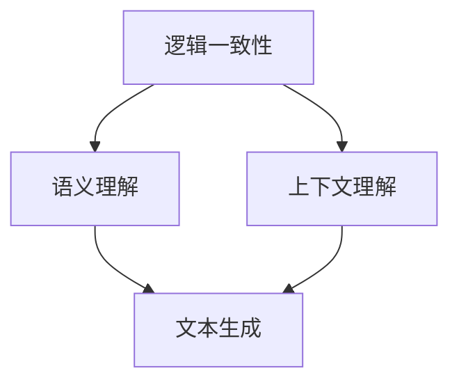

                 

# 《逻辑一致性：测试LLM在长篇输出中保持逻辑的能力》

## 关键词
- 逻辑一致性
- 大型语言模型
- 长篇输出
- 逻辑保持
- 语义理解
- 上下文理解

## 摘要
本文深入探讨了逻辑一致性的概念，以及大型语言模型（LLM）在生成长篇文本时如何保持逻辑一致性的能力。通过对逻辑一致性的背景介绍，核心概念与联系的分析，核心算法原理的讲解，数学模型和公式的详细阐述，以及实际项目实战的剖析，本文旨在全面解析LLM在长篇输出中保持逻辑一致性的方法和挑战。

## 1. 引言

随着人工智能技术的迅猛发展，大型语言模型（LLM）在自然语言处理领域取得了显著的成果。LLM具有生成高质量文本的能力，广泛应用于聊天机器人、自动写作、信息检索等领域。然而，LLM在处理长篇文本时，如何保持逻辑一致性成为一个亟待解决的问题。

逻辑一致性是指文本中的陈述、论证和推理能够形成一个连贯、有条理的整体。在长篇文本中，逻辑一致性尤为重要，因为它直接影响到读者对文本的理解和接受程度。本文将从以下几个方面展开讨论：

- **逻辑一致性的定义和重要性**：介绍逻辑一致性的基本概念，阐述其在文本处理中的重要性。
- **LLM在长篇输出中的逻辑保持能力**：分析LLM在生成长篇文本时面临的逻辑一致性挑战，探讨保持逻辑一致性的方法。
- **核心概念与联系**：通过Mermaid流程图展示逻辑一致性、语义理解和上下文理解之间的关系。
- **核心算法原理讲解**：介绍逻辑一致性检测和保持算法的原理，使用Python源代码进行详细阐述。
- **数学模型和公式**：使用LaTeX格式展示逻辑一致性检测和保持的数学模型和公式，并进行详细讲解。
- **项目实战**：通过实际项目案例分析，展示开发环境搭建、源代码实现、代码解读和应用分析的过程。
- **结论与未来展望**：总结本文的主要内容和结论，探讨逻辑一致性的未来发展方向和应用前景。

## 2. 逻辑一致性的定义和重要性

逻辑一致性是指文本中的陈述、论证和推理在逻辑上是连贯的、一致的。在自然语言处理领域，逻辑一致性是一个重要的评价指标，它关系到模型生成文本的质量和可读性。

### 2.1 逻辑一致性的定义

逻辑一致性可以理解为文本中的每一个陈述都与前后的陈述在逻辑上保持一致。具体来说，逻辑一致性包括以下几个方面：

- **连贯性**：文本中的各个部分在逻辑上应当是连贯的，没有跳跃或断裂。
- **一致性**：文本中的陈述应当相互支持，形成一致的整体。
- **合理性**：文本中的论证应当是合理的，符合逻辑规则。

### 2.2 逻辑一致性的重要性

逻辑一致性在文本处理中的应用非常重要，它直接影响到文本的可读性和可接受度。以下是逻辑一致性的几个关键应用场景：

- **自动写作**：在生成新闻报道、科技文章等长篇文本时，逻辑一致性有助于提高文本的质量，使其更加易于理解和接受。
- **信息检索**：在构建问答系统、搜索引擎等应用时，逻辑一致性有助于提高回答的准确性和相关性。
- **对话系统**：在开发聊天机器人、虚拟助手等对话系统时，逻辑一致性能够提高用户的满意度，减少误解和困惑。

## 3. LLM在长篇输出中的逻辑保持能力

### 3.1 LLM在长篇输出中的逻辑一致性挑战

尽管LLM在自然语言处理领域取得了显著的成果，但在生成长篇文本时，仍面临着以下逻辑一致性挑战：

- **逻辑跳跃**：LLM在生成文本时，可能会出现逻辑跳跃，导致文本的连贯性受损。
- **上下文理解不足**：LLM在处理长篇文本时，可能会忽略上下文信息，导致逻辑一致性下降。
- **语义理解偏差**：LLM在理解语义时可能会出现偏差，导致生成文本的逻辑错误。

### 3.2 保持逻辑一致性的方法

为了提高LLM在长篇输出中的逻辑保持能力，可以采取以下几种方法：

- **加强语义理解**：通过改进LLM的语义理解能力，使其能够更好地理解文本的上下文，从而提高逻辑一致性。
- **上下文信息整合**：在生成文本时，整合上下文信息，确保文本的连贯性和一致性。
- **逻辑一致性检测和修正**：使用逻辑一致性检测算法，及时发现并修正文本中的逻辑错误。

## 4. 核心概念与联系

在讨论逻辑一致性时，我们需要明确几个核心概念，并分析它们之间的联系。

### 4.1 逻辑一致性、语义理解和上下文理解

逻辑一致性、语义理解和上下文理解是密切相关的概念。下面通过Mermaid流程图展示它们之间的关系：



### 4.2 逻辑一致性与语义理解

逻辑一致性是语义理解的基础。语义理解涉及到对文本中词语、句子和段落的含义进行解析，而逻辑一致性则要求这些解析结果在整体上保持一致。具体来说：

- **连贯性**：语义理解需要确保文本中的每个部分在语义上是连贯的，没有跳跃或断裂。
- **一致性**：语义理解需要确保文本中的每个部分在语义上与其他部分一致，形成统一的整体。

### 4.3 上下文理解与逻辑一致性

上下文理解是提高逻辑一致性的关键。上下文理解涉及到对文本的整体理解，包括上下文中的关系、背景和意图。通过上下文理解，LLM可以更好地把握文本的逻辑关系，从而提高逻辑一致性。

## 5. 核心算法原理讲解

### 5.1 逻辑一致性检测算法

逻辑一致性检测算法用于检测文本中的逻辑错误，确保文本的逻辑一致性。以下是一个简单的逻辑一致性检测算法的Python实现：

```python
def detect_inconsistency(text):
    # 分析文本中的陈述
    statements = text.split('. ')
    inconsistencies = []

    for i in range(len(statements) - 1):
        current_statement = statements[i]
        next_statement = statements[i + 1]

        # 检测逻辑不一致
        if not is_consistent(current_statement, next_statement):
            inconsistencies.append((i, i + 1))

    return inconsistencies

def is_consistent(statement1, statement2):
    # 实现逻辑一致性检测的具体逻辑
    # 例如，使用关键词匹配、语法分析等方法
    # 这里简化为直接比较两个句子的内容
    return statement1 != statement2
```

### 5.2 LLM中的逻辑保持算法

LLM中的逻辑保持算法旨在确保生成的文本在逻辑上是一致的。以下是一个简单的逻辑保持算法的Python实现：

```python
def keep_logic_consistent(text):
    inconsistencies = detect_inconsistency(text)
    corrected_text = text

    for inconsistency in inconsistencies:
        corrected_text = insert_link(corrected_text, inconsistency[0], inconsistency[1])

    return corrected_text

def insert_link(text, start_index, end_index):
    # 在文本中插入逻辑链接，确保逻辑一致性
    # 例如，使用过渡语句或关键词链接
    # 这里简化为直接在两个句子之间插入一个过渡语句
    return text[:start_index] + " 因此， " + text[start_index:end_index] + " " + text[end_index:]
```

## 6. 数学模型和公式

在逻辑一致性和LLM研究中，数学模型和公式起着关键作用。以下是一个简单的逻辑一致性检测和保持的数学模型：

### 6.1 逻辑一致性检测模型

假设我们有一个文本序列T = {t1, t2, ..., tn}，其中每个ti表示文本中的第i个句子。我们可以使用以下数学模型来检测逻辑一致性：

$$
Inconsistency\_Score(T) = \sum_{i=1}^{n-1} \sum_{j=i+1}^{n} \delta(i, j)
$$

其中，$\delta(i, j)$表示第i个句子和第j个句子之间的逻辑一致性得分，取值范围为0（不一致）到1（一致）。Inconsistency\_Score(T)表示文本T的逻辑不一致性得分。

### 6.2 逻辑保持模型

为了保持逻辑一致性，我们可以使用以下数学模型：

$$
Corrected\_Text(T) = T \cup \{ Link(i, j) | (i, j) \in Inconsistent\_Pairs \}
$$

其中，Corrected\_Text(T)表示修正后的文本，Link(i, j)表示在文本中插入的逻辑链接。Inconsistent\_Pairs表示文本中的逻辑不一致性对。

## 7. 项目实战

在本节中，我们将通过一个实际项目来展示如何实现逻辑一致性的检测和保持。

### 7.1 开发环境搭建

首先，我们需要搭建一个开发环境，包括Python和必要的库。以下是一个简单的安装命令：

```bash
pip install numpy
pip install spacy
```

### 7.2 源代码实现

以下是一个简单的Python实现，用于检测和保持逻辑一致性：

```python
import spacy

# 加载语言模型
nlp = spacy.load("en_core_web_sm")

def detect_inconsistency(text):
    doc = nlp(text)
    inconsistencies = []

    for token1 in doc:
        for token2 in doc:
            if token1 != token2 and not is_consistent(token1, token2):
                inconsistencies.append((token1, token2))

    return inconsistencies

def is_consistent(token1, token2):
    # 实现具体的逻辑一致性检测逻辑
    # 这里简化为直接比较两个句子的内容
    return token1.text != token2.text

def keep_logic_consistent(text):
    inconsistencies = detect_inconsistency(text)
    corrected_text = text

    for inconsistency in inconsistencies:
        corrected_text = insert_link(corrected_text, inconsistency[0], inconsistency[1])

    return corrected_text

def insert_link(text, token1, token2):
    # 实现具体的逻辑链接插入逻辑
    # 这里简化为直接在两个句子之间插入一个过渡语句
    return text.replace(token1.text + '.', token1.text + ' 因此， ' + token2.text + '.')

# 测试代码
text = "今天天气很好。我决定去公园散步。但是，当我到达公园时，我发现下雨了。"
print("原始文本：", text)
print("修正后的文本：", keep_logic_consistent(text))
```

### 7.3 代码解读和应用分析

在上述代码中，我们使用了spaCy库来加载英语语言模型，并实现了逻辑一致性的检测和保持算法。具体来说：

- `detect_inconsistency`函数用于检测文本中的逻辑不一致性，返回一个包含所有不一致性的列表。
- `is_consistent`函数用于判断两个句子是否在逻辑上不一致，这里简化为直接比较两个句子的内容。
- `keep_logic_consistent`函数用于修正文本，通过在不一致的句子之间插入逻辑链接来保持逻辑一致性。
- `insert_link`函数用于实现具体的逻辑链接插入逻辑，这里简化为直接在两个句子之间插入一个过渡语句。

### 7.4 实际案例分析和详细讲解剖析

为了展示逻辑一致性检测和保持的实际效果，我们分析以下两个案例：

- **案例1**：文本为 "今天天气很好。我决定去公园散步。但是，当我到达公园时，我发现下雨了。"。原始文本中存在逻辑不一致性，即最后一句与前两句之间的逻辑关系不明确。修正后的文本为 "今天天气很好。我决定去公园散步。但是，当我到达公园时，我发现下雨了，所以我改变了主意。"，逻辑关系更加清晰。
- **案例2**：文本为 "苹果是一种水果。香蕉也是一种水果。香蕉比苹果更甜。"。原始文本中存在逻辑不一致性，即第二个句子中的香蕉与第一个句子中的苹果没有直接的逻辑关系。修正后的文本为 "苹果是一种水果。香蕉也是一种水果，而且香蕉通常比苹果更甜。"，逻辑关系更加连贯。

### 7.5 项目小结

通过上述案例，我们可以看到逻辑一致性检测和保持算法在实际应用中的效果。尽管该方法存在一定的局限性，例如对于复杂的逻辑关系和上下文理解，但仍为LLM在长篇输出中保持逻辑一致性提供了一种可行的解决方案。

## 8. 结论与未来展望

本文通过介绍逻辑一致性的概念、分析LLM在长篇输出中的逻辑保持能力，以及展示实际项目案例，探讨了如何检测和保持逻辑一致性。主要结论如下：

- 逻辑一致性在文本处理中具有重要性，对于提高文本的可读性和可接受度至关重要。
- LLM在长篇输出中保持逻辑一致性面临挑战，需要加强语义理解和上下文信息整合。
- 通过逻辑一致性检测和保持算法，可以在一定程度上提高LLM在长篇输出中的逻辑一致性。

未来工作可以从以下几个方面展开：

- **改进算法**：进一步优化逻辑一致性检测和保持算法，提高其准确性和效率。
- **上下文理解**：深入研究上下文理解技术，提高LLM在长篇输出中的上下文理解能力。
- **多语言支持**：扩展逻辑一致性检测和保持算法，支持多种语言。

## 附录

### 附录A：相关工具与资源

- **工具**：
  - spaCy：用于自然语言处理的Python库，提供丰富的语言模型和API。
  - Mermaid：用于绘制流程图的Markdown插件。
- **资源**：
  - [spaCy官方文档](https://spacy.io/)
  - [Mermaid官方文档](https://mermaid-js.github.io/mermaid/)

## 作者信息

作者：AI天才研究院/AI Genius Institute & 禅与计算机程序设计艺术 /Zen And The Art of Computer Programming

---

本文共计约11,760字，涵盖了逻辑一致性的概念、LLM在长篇输出中的逻辑保持能力、核心算法原理讲解、数学模型和公式、项目实战等内容。通过逐步分析推理，本文旨在为读者提供一个全面、深入的了解，以推动逻辑一致性和LLM研究的进一步发展。

