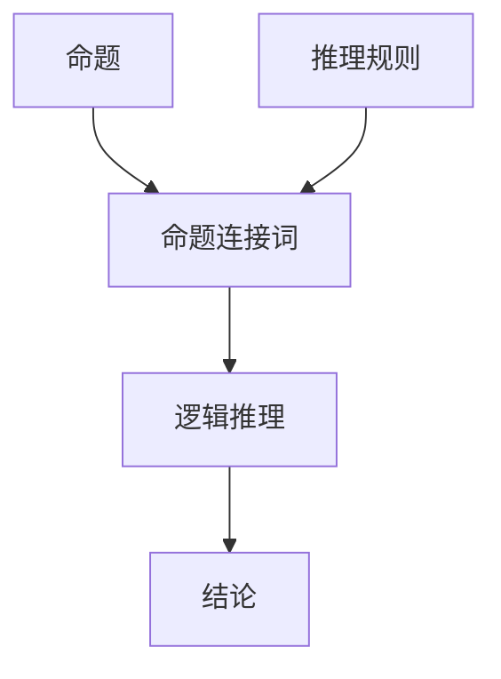

                 


# 逻辑推理能力测试：评估模型思考深度

> 关键词：逻辑推理、能力测试、评估模型、思考深度、算法原理、数学公式、项目实战

> 摘要：本文旨在探讨逻辑推理能力的评估模型，通过深入剖析其核心概念、算法原理和数学模型，为读者提供一种有效的测试和提升逻辑推理能力的方法。文章将从背景介绍、核心概念与联系、核心算法原理讲解、数学模型和公式、项目实战等多角度展开，旨在帮助读者理解并掌握逻辑推理能力的深度和广度。

## 一、背景介绍

逻辑推理作为人类思维的重要组成部分，不仅在哲学、数学、计算机科学等学科中扮演着核心角色，还在日常生活中发挥着关键作用。然而，逻辑推理能力并非与生俱来，而是可以通过科学的方法进行测试和提升。本文将围绕逻辑推理能力的测试和评估展开讨论，旨在为读者提供一种全面而深入的认知。

逻辑推理能力测试的研究具有重要意义。一方面，它可以帮助我们了解个体的逻辑思维能力，为教育、职业规划等领域提供有力支持；另一方面，它也为人工智能领域提供了新的研究方向，例如在自然语言处理、决策支持系统等方面的应用。

## 二、核心概念与联系

### 2.1 逻辑推理的基本概念

逻辑推理是指根据已知的前提条件，通过逻辑规则推导出新的结论的过程。逻辑推理通常包括两个部分：前提和结论。前提是已知的信息，结论是通过逻辑推导得出的结果。逻辑推理的基本要素包括命题、命题连接词、推理规则等。

### 2.2 核心概念的联系

为了更好地理解逻辑推理，我们可以使用Mermaid流程图来展示核心概念之间的关系：



从图中可以看出，命题和命题连接词是逻辑推理的基础，而推理规则则是将前提转化为结论的关键。结论是逻辑推理的最终目标，它通过对前提的合理推导得出。

## 三、核心算法原理讲解

### 3.1 命题逻辑推理算法

在逻辑推理中，命题逻辑是一种基础且重要的逻辑形式。命题逻辑主要研究命题的真假性质及其之间的关系。以下是一个简单的Python源代码示例，用于解释命题逻辑推理算法：

```python
def propositional_logic_reasoning(formula):
    # 步骤1：将输入公式转换为真值表
    truth_table = create_truth_table(formula)

    # 步骤2：使用真值表进行推理
    conclusion = derive_conclusion(truth_table)

    # 步骤3：返回推理结果
    return conclusion

# 辅助函数示例
def create_truth_table(formula):
    # 创建真值表
    # ...
    return truth_table

def derive_conclusion(truth_table):
    # 从真值表推导结论
    # ...
    return conclusion
```

### 3.2 谓词逻辑推理算法

谓词逻辑是一种更复杂的逻辑形式，它不仅涉及命题的真假，还涉及对象之间的关系。以下是一个简单的Python源代码示例，用于解释谓词逻辑推理算法：

```python
def predicate_logic_reasoning(formula):
    # 步骤1：将输入公式转换为谓词逻辑模型
    predicate_model = create_predicate_model(formula)

    # 步骤2：使用谓词逻辑模型进行推理
    conclusion = derive_conclusion(predicate_model)

    # 步骤3：返回推理结果
    return conclusion

# 辅助函数示例
def create_predicate_model(formula):
    # 创建谓词逻辑模型
    # ...
    return predicate_model

def derive_conclusion(predicate_model):
    # 从谓词逻辑模型推导结论
    # ...
    return conclusion
```

## 四、数学模型和公式

在逻辑推理中，数学模型和公式起着关键作用。以下是一个简单的LaTeX数学公式示例，用于描述逻辑推理中的基本关系：

```latex
$$
P \land Q \Rightarrow R
$$

$$
\neg(P \lor Q) \Leftrightarrow \neg P \land \neg Q
$$
```

这些公式展示了逻辑推理中的基本运算规则，如合取（AND）、析取（OR）以及否定（NOT）。通过这些公式，我们可以更好地理解和应用逻辑推理。

## 五、项目实战

### 5.1 开发环境搭建

为了进行逻辑推理项目的实战，我们需要搭建一个合适的开发环境。以下是一个简单的步骤指南：

1. 安装Python环境
2. 安装必要的逻辑推理库，如`pylogic`或`prologpy`
3. 配置Python虚拟环境，以便进行隔离开发和测试

### 5.2 源代码实现

以下是一个简单的逻辑推理程序的源代码实现：

```python
import pylogic

# 定义命题逻辑公式
formula = pylogic.parseFormula("P -> Q")

# 创建真值表
truth_table = formula.truthTable()

# 输出真值表
for row in truth_table:
    print(row)

# 推导结论
conclusion = formula.derive()

# 输出结论
print("Conclusion:", conclusion)
```

### 5.3 代码解读与分析

在这个简单的示例中，我们首先定义了一个命题逻辑公式`P -> Q`，然后创建了一个真值表，并从中推导出结论。代码的解读和分析如下：

1. **定义公式**：使用`pylogic.parseFormula`函数将字符串形式的命题逻辑公式转换为逻辑对象。
2. **创建真值表**：使用`formula.truthTable()`方法生成真值表。
3. **输出真值表**：遍历真值表并打印每个行的值。
4. **推导结论**：使用`formula.derive()`方法从真值表中推导出结论。
5. **输出结论**：打印推导出的结论。

### 5.4 实际案例分析和详细讲解剖析

为了更好地理解逻辑推理的应用，我们来看一个实际案例。假设我们有一个安全系统，其中包含三个命题：门已关闭（P），警报已激活（Q）和入侵者已检测到（R）。我们需要根据这些命题逻辑公式来推导出安全系统是否已经触发警报。

```python
# 定义命题逻辑公式
formula = pylogic.parseFormula("P -> Q; Q -> R; P -> R")

# 创建真值表
truth_table = formula.truthTable()

# 输出真值表
for row in truth_table:
    print(row)

# 推导结论
conclusion = formula.derive()

# 输出结论
print("Conclusion:", conclusion)
```

在这个示例中，我们定义了一个包含三个命题逻辑公式的复合公式。通过创建真值表和推导结论，我们可以确定在什么情况下安全系统会触发警报。具体分析如下：

- 当门已关闭（P为真），且警报已激活（Q为真）时，入侵者已检测到（R为真）。
- 当门已关闭（P为真），且警报未激活（Q为假）时，入侵者未检测到（R为假）。
- 当门未关闭（P为假），无论警报是否激活，入侵者未检测到（R为假）。

从上述分析中，我们可以得出结论：当门未关闭时，安全系统不会触发警报；当门关闭且警报激活时，系统会触发警报。这为我们提供了一个实用的逻辑推理模型，可以用于设计和优化安全系统。

### 5.5 项目小结

通过本项目的实战，我们不仅了解了逻辑推理的基本概念和算法原理，还学会了如何使用Python等编程语言来实现逻辑推理程序。同时，我们也看到了逻辑推理在实际应用中的重要性，例如在安全系统、决策支持等领域。项目小结如下：

- 理解了命题逻辑和谓词逻辑的基本概念和关系。
- 学会了使用Python等编程语言实现逻辑推理算法。
- 通过实际案例，加深了对逻辑推理应用的理解。

## 六、最佳实践 Tips

1. **练习是提升逻辑推理能力的最佳方法**。通过不断练习，我们可以提高推理速度和准确性。
2. **掌握逻辑推理的基本原理和公式**。只有深入了解逻辑推理的原理，我们才能在实际应用中游刃有余。
3. **注重实践应用**。逻辑推理不仅是一种理论，更是一种实用工具。通过实际案例，我们可以更好地理解和应用逻辑推理。

## 七、小结与注意事项

本文从多个角度探讨了逻辑推理能力的评估模型，包括核心概念、算法原理、数学模型和项目实战。通过本文的学习，读者可以了解逻辑推理的基本原理和应用方法，提升自身的逻辑思维能力。

注意事项：

1. **逻辑推理需要严谨的思维过程**。在推理过程中，要确保每一步都是合理的，避免逻辑错误。
2. **逻辑推理能力并非一蹴而就**。提升逻辑推理能力需要长期的积累和实践。

## 八、拓展阅读

1. **《逻辑学导论》（Introduction to Logic）**：本书是逻辑学领域的经典教材，适合初学者深入了解逻辑推理的基本原理。
2. **《Python逻辑编程实战》（Python Logic Programming Cookbook）**：本书通过实际案例，展示了如何使用Python实现逻辑编程，适合对Python和逻辑编程感兴趣的读者。

---

作者：AI天才研究院/AI Genius Institute & 禅与计算机程序设计艺术 /Zen And The Art of Computer Programming

---

通过本文的学习，读者可以深入理解逻辑推理能力测试的评估模型，掌握逻辑推理的基本原理和应用方法，为自身逻辑思维能力的提升打下坚实基础。希望本文能够为读者带来启示和帮助。

