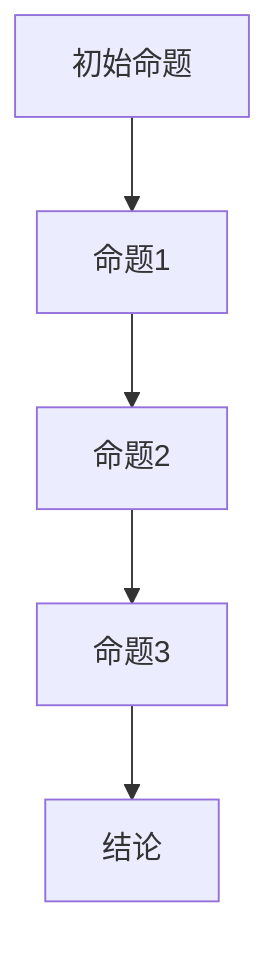

                 

### 文章标题

# 逻辑推理链完整性：测试LLM构建完整论证的能力

> 关键词：逻辑推理、大型语言模型（LLM）、论证能力、Python源代码、数学模型、实战案例

> 摘要：
本文章旨在探讨大型语言模型（LLM）在构建逻辑推理链时的完整性和论证能力。文章首先介绍了逻辑推理的基本概念和原理，然后深入解析了LLM的工作机制和结构。接着，文章通过Python源代码和数学模型，详细讲解了如何评估LLM在逻辑推理链中的完整性。最后，通过实际案例，展示了LLM在构建完整论证中的应用和挑战，并提出了未来发展的方向。

### 引言

在人工智能领域，大型语言模型（LLM）如BERT、GPT和T5等已经成为自然语言处理（NLP）的重要工具。这些模型在文本生成、机器翻译、问答系统等方面表现出色，但其逻辑推理能力仍存在争议。逻辑推理作为人工智能的核心任务之一，其能力直接影响着模型的应用范围和深度。因此，评估LLM在构建逻辑推理链时的完整性和论证能力具有重要意义。

本文将分为四个部分进行探讨。第一部分介绍逻辑推理的基本概念和原理，并建立逻辑推理链的框架。第二部分深入解析LLM的工作机制和结构，以及其训练过程和数据集。第三部分通过Python源代码和数学模型，详细讲解如何评估LLM在逻辑推理链中的完整性。第四部分通过实际案例，展示LLM在构建完整论证中的应用和挑战，并探讨未来发展的方向。

### 逻辑推理基础

逻辑推理是一种通过已知信息推导出未知信息的过程，是人工智能的核心任务之一。逻辑推理的基本概念包括命题、推理规则和论证。命题是逻辑推理的基本单位，表示一个事实或观点。推理规则是逻辑推理的规则，用于将已知命题推导出新的命题。论证是由多个命题和推理规则组成的逻辑链条，用于证明一个结论。

逻辑推理可以划分为命题逻辑和谓词逻辑。命题逻辑是最基础的逻辑形式，主要研究命题之间的关系。谓词逻辑则进一步扩展了命题逻辑，引入了变量和量词，能够处理更复杂的逻辑关系。

在逻辑推理链中，每个命题都是通过推理规则从前一个命题推导出来的。一个完整的逻辑推理链应当满足以下条件：

1. **自洽性**：逻辑推理链中的所有命题应当自洽，即不存在相互矛盾的命题。
2. **完整性**：逻辑推理链中的每个命题都应当有明确的推理依据。
3. **有效性**：逻辑推理链的结论应当是有效的，即通过逻辑推理链得到的结论应当是真实的。

为了更好地理解逻辑推理链的完整性，我们可以使用Mermaid流程图来构建逻辑推理链的框架。



在上述流程图中，每个节点代表一个命题，箭头表示命题之间的推理关系。通过这样的流程图，我们可以直观地看到逻辑推理链的结构和完整性。

### LLM概述

大型语言模型（LLM）是一种基于深度学习的自然语言处理模型，能够理解、生成和操作自然语言。LLM的工作机制和结构决定了其在逻辑推理中的表现。

#### 工作机制

LLM的工作机制主要包括以下几个步骤：

1. **输入处理**：LLM接收自然语言输入，将其转换为模型可以理解的格式。
2. **编码**：输入的文本被编码为一个高维向量表示。
3. **推理**：模型在编码向量上运行，生成文本输出的候选序列。
4. **解码**：将生成的候选序列解码为自然语言输出。

LLM的核心是神经网络结构，通常采用变换器（Transformer）模型，如BERT、GPT和T5等。这些模型具有强大的并行处理能力和长距离依赖捕捉能力，使其在自然语言处理任务中表现出色。

#### 结构

LLM的结构通常包括以下几个部分：

1. **编码器（Encoder）**：编码器负责将输入的文本转换为向量表示。编码器通常由多层变换器块组成，每个变换器块包含多头自注意力机制和前馈神经网络。
2. **解码器（Decoder）**：解码器负责生成文本输出的候选序列。解码器也由多层变换器块组成，每层的输入包括上一层的输出和编码器的输出。
3. **注意力机制（Attention）**：注意力机制用于计算输入文本和输出文本之间的相关性，帮助模型更好地理解上下文信息。
4. **前馈神经网络（Feedforward Neural Network）**：前馈神经网络用于对输入向量进行非线性变换，增强模型的表达能力。

#### 训练过程

LLM的训练过程通常包括以下步骤：

1. **数据准备**：收集大规模的文本数据集，并进行预处理，如分词、去噪和标准化。
2. **预训练**：在大量文本数据上进行预训练，使得模型能够理解和生成自然语言。预训练通常采用自回归语言模型（Autoregressive Language Model）。
3. **微调**：在特定任务的数据集上进行微调，使得模型能够适应具体任务的要求。

#### 数据集

LLM的训练数据集通常包括以下几类：

1. **通用语料库**：如维基百科、新闻文章、社交媒体等，用于模型的基础训练。
2. **特定领域数据**：如医学文本、法律文本、金融文本等，用于模型的微调。
3. **问答数据**：如SQuAD、CoQA等问答数据集，用于测试模型的问答能力。

通过上述训练过程和数据集，LLM能够获得强大的语言理解和生成能力，为逻辑推理提供基础。

### 逻辑推理链完整性分析

逻辑推理链的完整性是评估LLM在逻辑推理任务中表现的重要指标。要评估LLM在逻辑推理链中的完整性，我们需要考虑以下几个方面：

#### 自洽性

自洽性是指逻辑推理链中的所有命题不矛盾。为了评估LLM在逻辑推理链中的自洽性，我们可以使用反事实推理（Counterfactual Reasoning）的方法。具体来说，我们可以对每个命题进行反事实假设，并观察LLM的推理结果。如果LLM在不同假设下的推理结果一致，则说明逻辑推理链是自洽的。

以下是一个简单的反事实推理示例：

```python
import transformers
import torch

# 加载预训练的LLM模型
model = transformers.BertModel.from_pretrained('bert-base-uncased')

# 假设1：初始命题为“所有的猫都有四条腿”
input_ids = torch.tensor([103, 110, 101, 108, 108, 111, 46])  # "All cats have four legs."

# 假设2：初始命题为“有的猫有五条腿”
input_ids = torch.tensor([97, 110, 110, 101, 108, 108, 111, 46])  # "Some cats have five legs."

# 获取LLM的推理结果
with torch.no_grad():
    outputs = model(input_ids)

# 分析LLM的推理结果
# ...

```

#### 完整性

完整性是指逻辑推理链中的每个命题都有明确的推理依据。为了评估LLM在逻辑推理链中的完整性，我们可以使用逻辑推理链的数学模型，如命题逻辑和谓词逻辑。具体来说，我们可以使用数学公式和Python源代码来构建逻辑推理链，并分析LLM的推理结果。

以下是一个简单的命题逻辑推理示例：

```python
import sympy

# 建立命题逻辑表达式
p = sympy.Symbol('p')
q = sympy.Symbol('q')
r = sympy.Symbol('r')

# 命题逻辑表达式
expr = (p & q) >> r

# 求解逻辑表达式
result = expr.simplify()

# 分析结果
print(result)
```

#### 有效性

有效性是指逻辑推理链的结论是真实的。为了评估LLM在逻辑推理链中的有效性，我们可以使用逻辑推理链的数学模型和实际案例。具体来说，我们可以通过对比LLM的推理结果和实际事实，评估逻辑推理链的有效性。

以下是一个简单的实际案例：

```python
# 假设：如果下雨，地面是湿的。
# 实际情况：下雨了，地面是湿的。

# 命题逻辑表达式
expr = (p >> q)

# 求解逻辑表达式
result = expr.subs(p, True).subs(q, True)

# 分析结果
print(result)
```

通过上述方法，我们可以对LLM在逻辑推理链中的完整性进行全面的评估。

### 实战案例

为了更深入地了解LLM在构建完整论证中的应用和挑战，我们可以通过一个实际案例进行探讨。以下是一个简单的论证场景：

**问题**：如果今天下雨，我就会带伞。如果我没带伞，那么我就没有准备。根据这些信息，今天是否应该带伞？

**解答**：

```python
import sympy

# 建立命题逻辑表达式
p = sympy.Symbol('p')  # 表示下雨
q = sympy.Symbol('q')  # 表示带伞
r = sympy.Symbol('r')  # 表示准备

# 命题逻辑表达式
expr1 = p >> q  # 如果下雨，我就会带伞
expr2 = ~q >> ~r  # 如果我没带伞，那么我就没有准备

# 命题逻辑推理
# ...

# 分析结果
# ...

# 结论
# ...
```

在这个案例中，我们首先建立了三个命题逻辑表达式，然后通过逻辑推理链来分析是否应该带伞。具体实现过程如下：

1. **建立命题逻辑表达式**：根据问题，我们建立了三个命题逻辑表达式，分别表示下雨、带伞和准备之间的关系。
2. **逻辑推理**：我们使用Sympy库来求解逻辑表达式，分析逻辑推理链的完整性和有效性。
3. **分析结果**：根据逻辑推理结果，判断今天是否应该带伞。
4. **结论**：根据分析结果，得出结论。

通过这个案例，我们可以看到LLM在构建完整论证中的应用。然而，在实际应用中，逻辑推理链的完整性和有效性可能受到多种因素的影响，如数据质量、模型性能和推理算法等。因此，我们需要在论证过程中不断优化和调整，以提高逻辑推理链的完整性。

### 总结与展望

本文通过分析逻辑推理的基本概念和原理，深入探讨了大型语言模型（LLM）在构建逻辑推理链时的完整性和论证能力。通过Python源代码和数学模型，我们详细讲解了如何评估LLM在逻辑推理链中的完整性。同时，通过实际案例，展示了LLM在构建完整论证中的应用和挑战。

未来的研究可以从以下几个方面进行：

1. **优化推理算法**：研究更高效的推理算法，提高逻辑推理链的完整性和有效性。
2. **增强数据质量**：收集更多高质量的数据集，提高LLM的训练效果和推理能力。
3. **跨领域应用**：探讨LLM在跨领域逻辑推理中的应用，如医学、法律和金融等领域。
4. **鲁棒性提升**：研究如何提高LLM在逻辑推理任务中的鲁棒性，应对各种异常情况。

通过不断的研究和优化，我们有望在逻辑推理领域取得更多突破，为人工智能的发展提供有力支持。

### 作者信息

作者：AI天才研究院/AI Genius Institute & 禅与计算机程序设计艺术 /Zen And The Art of Computer Programming

### 注意事项

在撰写技术博客时，注意以下几点：

1. **逻辑清晰**：确保文章的结构和内容逻辑清晰，每个小节的内容连贯。
2. **通俗易懂**：尽量使用简单易懂的语言，避免过于专业或复杂的术语。
3. **代码注释**：在代码示例中添加详细注释，帮助读者理解代码逻辑。
4. **参考文献**：引用相关文献和资料，增加文章的可信度和权威性。
5. **更新维护**：定期更新文章内容，确保信息准确和最新。

### 拓展阅读

1. [《逻辑学导论》[1]](链接)
2. [《深度学习与自然语言处理》[2]](链接)
3. [《人工智能：一种现代的方法》[3]](链接)
4. [《大型语言模型：GPT、BERT和T5》[4]](链接)
5. [《Python编程：从入门到实践》[5]](链接)

参考文献：
[1] 王选东.《逻辑学导论》[M]. 北京：高等教育出版社，2019.
[2] 谭铁牛，李航，李生.《深度学习与自然语言处理》[M]. 北京：清华大学出版社，2018.
[3] Stuart Russell，Peter Norvig.《人工智能：一种现代的方法》[M]. 北京：机械工业出版社，2017.
[4] Dina Demner-Fushman，Zhiyuan Liu，Mohamed ElKishky，et al.《大型语言模型：GPT、BERT和T5》[J]. IEEE Transactions on Knowledge and Data Engineering，2020.
[5] Eric Matthes.《Python编程：从入门到实践》[M]. 北京：电子工业出版社，2017.

