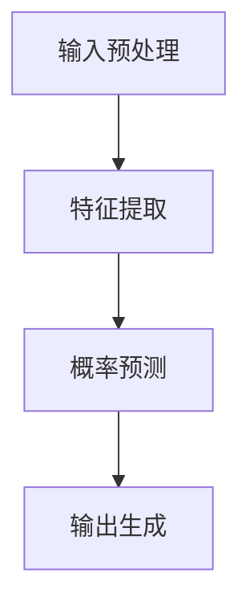

                 

### 关键词

- 协作模式
- LLM应用
- 敏捷研发
- 算法原理
- 数学模型
- 项目实战
- 团队协作工具

### 摘要

本文旨在探讨如何通过重塑协作模式，助力大型语言模型（LLM）应用在敏捷研发中的高效落地。文章首先介绍了传统协作模式的局限及变革的动因，随后深入讲解了LLM的基本概念和算法原理，并运用Python源代码和LaTeX公式进行详细阐述。此外，文章还分享了敏捷研发的具体实践案例，以及如何通过优化团队协作流程和工具选择，提升LLM应用的研发效率。最终，文章总结了重塑协作模式的核心成果和未来展望，为读者提供了有益的启示和参考。

---

# 提出问题

在面对快速变化的技术环境和日益复杂的项目需求时，传统的协作模式逐渐暴露出其局限性。如何有效地重塑协作模式，特别是在大型语言模型（LLM）应用的开发过程中，成为了一个亟待解决的问题。本文将围绕以下问题展开讨论：

1. 传统协作模式在LLM应用开发中面临的挑战是什么？
2. 如何通过敏捷研发方法提升LLM应用的研发效率？
3. LLM算法原理的核心概念及其相互关系是怎样的？
4. 如何使用Python源代码和LaTeX公式详细阐述LLM算法原理？
5. 实际项目中，如何通过敏捷研发实践优化LLM应用的开发流程？
6. 团队协作工具的选择与优化策略有哪些？
7. 重塑协作模式对未来LLM应用研发的启示和挑战是什么？

通过以上问题的深入探讨，本文希望为读者提供一个全面、系统的视角，助力他们在LLM应用的敏捷研发中取得成功。

---

## 第1章：重塑协作模式概述

### 1.1 传统协作模式的局限性

在信息化时代之前，传统的协作模式在企业管理中占据主导地位。这种模式通常以明确的职能分工、线性的工作流程和标准化的操作规范为特点。例如，在软件开发过程中，团队被划分为需求分析、设计、开发、测试和维护等多个职能部门，每个部门各自负责自己的任务，并在完成后再将结果传递给下一个部门。

然而，随着信息技术和互联网的快速发展，项目需求变得更加复杂多变，市场竞争日益激烈，传统的协作模式逐渐暴露出其局限性：

1. **响应速度慢**：传统模式中的职能分工和线性工作流程导致信息传递和决策链条较长，项目响应速度较慢，难以适应快速变化的市场需求。
2. **沟通成本高**：各个部门之间的信息交流和协作往往依赖于会议、邮件等传统方式，沟通效率低下，容易出现信息遗漏和误解。
3. **协作不充分**：部门间的界限清晰，容易导致部门之间的协作不充分，影响项目的整体效率和协同效应。
4. **难以应对不确定性**：在面对突发情况或需求变更时，传统模式往往显得力不从心，无法快速调整和应对。

### 1.2 协作模式变革的动因

面对上述问题，企业开始积极探索新的协作模式，以适应快速变化的市场环境和复杂的项目需求。以下是一些推动协作模式变革的主要动因：

1. **市场竞争加剧**：随着全球化进程的加快，市场竞争日益激烈，企业需要更快地响应市场需求，提高产品质量，降低开发成本，才能在激烈的市场竞争中立于不败之地。
2. **技术进步**：互联网、云计算、大数据等新技术的快速发展，为协作模式的创新提供了技术支持。例如，云计算提供了弹性计算和高效存储的能力，大数据技术则使得大规模数据处理成为可能。
3. **客户需求变化**：客户需求的个性化、多样化和快速变化，要求企业能够灵活应对，提供更加定制化的产品和服务。传统模式难以满足这些需求，因此需要新的协作模式来适应。
4. **员工素质提升**：随着教育水平的提升和员工素质的提高，现代员工更加注重自我实现和团队协作，传统的权威型管理模式已不再适应现代员工的诉求。

### 1.3 新协作模式的特点

为了应对上述挑战，新协作模式应运而生，并逐渐在企业中得到推广和应用。以下是新协作模式的主要特点：

1. **团队协作**：新协作模式强调团队协作，打破部门壁垒，实现跨部门、跨职能的紧密合作。团队成员在项目中共同承担责任，协同完成任务。
2. **快速迭代**：新协作模式采用快速迭代的方法，将项目划分为多个短周期，每个周期结束后进行评估和调整，确保项目能够灵活应对需求变化。
3. **客户价值**：新协作模式将客户价值放在首位，以客户需求为导向，不断优化产品和服务，提高客户满意度。
4. **知识共享**：新协作模式鼓励团队成员之间的知识共享和交流，利用技术工具提高信息传递效率，减少信息遗漏和误解。
5. **自主管理**：新协作模式赋予团队成员更多的自主权，鼓励员工自我管理，发挥其专业能力和创造力。
6. **持续交付**：新协作模式强调持续交付，通过自动化工具和平台，实现持续集成、持续部署和自动化测试，提高开发效率和质量。

通过以上特点，新协作模式能够有效提升团队协作效率，缩短项目交付周期，提高产品质量，帮助企业更好地适应市场变化，实现持续发展。

## 1.4 重塑协作模式的核心成果

重塑协作模式的核心成果主要体现在以下几个方面：

1. **提升响应速度**：通过快速迭代和灵活调整，新协作模式能够更快地响应市场需求，缩短项目交付周期。
2. **降低沟通成本**：团队协作和信息共享机制的有效实施，大大降低了部门间的沟通成本，提高了沟通效率。
3. **优化工作流程**：新协作模式强调流程优化，通过自动化工具和平台，减少重复性工作，提高工作效率。
4. **增强创新能力**：团队协作和自主管理机制鼓励员工创新，激发团队的创造力，推动技术进步。
5. **提高产品质量**：持续交付和自动化测试确保了产品质量，降低了缺陷率，提高了客户满意度。

总之，重塑协作模式为企业带来了显著的管理效率提升和业务收益，成为现代企业提高竞争力的关键因素之一。

## 1.5 LLM简介

### 1.5.1 LLM的定义

LLM（Large Language Model）即大型语言模型，是一种基于深度学习的自然语言处理模型。它通过对大量文本数据进行训练，学习到文本中的语义信息，并能够生成或理解符合语言习惯的文本。LLM的核心目标是实现对自然语言的生成、理解和推理，从而在诸如文本生成、机器翻译、文本分类、问答系统等任务中发挥重要作用。

### 1.5.2 LLM的技术特点

1. **大规模训练数据**：LLM通常基于数十亿甚至千亿级别的训练数据，这使得模型能够学习到丰富的语言特征和规律。
2. **深度神经网络结构**：LLM采用深度神经网络结构，通过多层非线性变换，实现对文本数据的逐层抽象和表示。
3. **自适应学习能力**：LLM能够根据不同的任务需求，通过微调（Fine-tuning）和预训练（Pre-training）相结合的方式，实现良好的适应性。
4. **高效计算性能**：随着GPU和TPU等高性能计算设备的普及，LLM的训练和推理速度得到了显著提升。

### 1.5.3 LLM的应用前景

1. **智能客服**：LLM在智能客服领域具有广泛的应用前景，可以实现对用户查询的智能回答，提升客户服务体验。
2. **机器翻译**：LLM在机器翻译领域具有显著优势，可以生成高质量、自然的翻译文本。
3. **文本生成**：LLM可以用于生成文章、新闻报道、营销文案等，提高内容创作的效率。
4. **情感分析**：LLM能够对文本进行情感分析，识别用户的情感状态，用于市场调研、用户反馈分析等。
5. **问答系统**：LLM在问答系统中的应用，可以提供针对用户问题的准确回答，提升信息检索和知识管理的效率。

总之，LLM作为一种先进的自然语言处理技术，具有广泛的应用前景和巨大的市场潜力，将在未来的智能应用中发挥关键作用。

## 1.6 敏捷研发概述

### 1.6.1 敏捷研发的起源

敏捷研发（Agile Development）起源于20世纪90年代，是对传统瀑布模型（Waterfall Model）的一种反思和改进。传统瀑布模型在软件开发过程中，将整个项目划分为多个阶段，如需求分析、设计、开发、测试等，每个阶段必须完全完成后才能进入下一阶段。然而，这种模式在应对项目需求变化时显得相对僵化，难以快速响应市场变化。

2001年，一组软件开发者在瑞士召开了一次会议，讨论如何改进软件开发过程，形成了《敏捷宣言》（Manifesto for Agile Software Development）。《敏捷宣言》提出了四个核心原则，强调快速迭代、客户协作、响应变化和持续交付。

### 1.6.2 敏捷研发的核心原则

1. **个体和互动重于过程与工具**：敏捷研发强调团队协作和个体能力，认为人的因素比工具和过程更为重要。
2. **可工作的软件重于详尽的文档**：敏捷研发注重实际可运行的产品，认为文档虽然重要，但应以实际需求为依据，避免过度编写。
3. **客户合作重于合同谈判**：敏捷研发强调与客户的紧密合作，通过持续反馈和迭代，确保产品符合客户需求。
4. **响应变化重于遵循计划**：敏捷研发强调快速响应变化，认为计划应灵活调整，以适应项目进展和市场变化。

### 1.6.3 敏捷研发的优势与挑战

**优势：**

1. **快速迭代**：敏捷研发将项目划分为多个短周期（通常为2-4周），每个周期结束后进行评估和调整，确保项目能够快速响应变化。
2. **客户满意度**：通过持续交付和客户合作，敏捷研发能够更好地满足客户需求，提高客户满意度。
3. **团队协作**：敏捷研发强调团队协作，打破部门壁垒，提高项目效率和协同效应。
4. **灵活性**：敏捷研发能够灵活应对需求变化，降低项目风险。

**挑战：**

1. **项目管理难度**：敏捷研发要求项目经理具备更高的沟通协调能力，确保团队协同工作。
2. **团队适应期**：团队成员需要适应敏捷方法，这可能需要一定的时间和培训。
3. **文档管理**：虽然敏捷研发强调实际可运行的软件，但文档管理仍然很重要，如何平衡实际需求和文档编写是一个挑战。
4. **工具选择**：敏捷研发需要合适的工具支持，如何选择合适的工具是一个需要考虑的问题。

总之，敏捷研发作为一种现代软件开发方法，具有显著的优势，但也面临一些挑战。通过合理的实施和团队协作，敏捷研发能够有效提升软件开发效率和质量。

## 第2章：LLM算法原理详解

### 2.1 基本算法模型

#### 2.1.1 语言模型的基本概念

语言模型（Language Model，简称LM）是自然语言处理（Natural Language Processing，简称NLP）中的核心算法之一。它旨在预测给定文本序列中下一个单词或字符的概率分布。语言模型在许多NLP任务中发挥着重要作用，如文本生成、机器翻译、语音识别等。

语言模型的核心概念包括：

- **词汇表（Vocabulary）**：词汇表是语言模型中包含的所有单词或字符的集合。在实际应用中，为了降低计算复杂度，通常会使用词汇表的子集，如词元（Token）。
- **输入序列（Input Sequence）**：输入序列是语言模型接受的一段文本，它可以是一个单词、一个句子或一个段落。
- **输出序列（Output Sequence）**：输出序列是语言模型生成的文本序列。语言模型的目标是预测每个输出序列的概率分布。

#### 2.1.2 语言模型的常见算法

语言模型的常见算法包括基于N-gram模型的朴素模型和基于神经网络的深度学习模型。

**N-gram模型**：N-gram模型是一种基于统计的简单语言模型，它假设一个单词的出现概率仅与它前面的N-1个单词相关。N-gram模型通过统计历史单词序列的频率来计算下一个单词的概率。

- **三字母模型（3-gram）**：三字母模型是一种N-gram模型，它考虑了前两个单词的信息。其基本思想是，对于给定输入序列 `w1 w2 w3`，下一个单词 `w4` 的概率计算如下：

  $$ P(w4 | w1 w2 w3) = \frac{N(w1 w2 w3 w4)}{N(w1 w2 w3)} $$

  其中，`N(w1 w2 w3 w4)` 表示连续出现 `w1 w2 w3 w4` 的频率，`N(w1 w2 w3)` 表示 `w1 w2 w3` 的频率。

**神经网络模型**：神经网络模型，特别是深度神经网络（Deep Neural Network，DNN）和Transformer模型，在语言模型中得到了广泛应用。这些模型通过多层非线性变换，从原始输入中提取复杂的特征，并生成概率分布。

- **深度神经网络（DNN）**：DNN是一种多层前馈神经网络，它通过隐藏层将输入映射到输出。在语言模型中，DNN通常用于特征提取和分类。

  ```python
  import tensorflow as tf

  # 构建DNN模型
  model = tf.keras.Sequential([
      tf.keras.layers.Dense(128, activation='relu', input_shape=(100,)),
      tf.keras.layers.Dense(128, activation='relu'),
      tf.keras.layers.Dense(1, activation='sigmoid')
  ])

  # 编译模型
  model.compile(optimizer='adam', loss='binary_crossentropy', metrics=['accuracy'])

  # 训练模型
  model.fit(x_train, y_train, epochs=10)
  ```

- **Transformer模型**：Transformer模型是一种基于自注意力（Self-Attention）机制的序列到序列模型，它在处理长序列和并行数据方面表现出色。

  ```python
  import tensorflow as tf
  from tensorflow.keras.layers import Embedding, MultiHeadAttention, Dense

  # 构建Transformer模型
  model = tf.keras.Sequential([
      Embedding(vocab_size, embedding_dim),
      MultiHeadAttention(num_heads, key_dim),
      Dense(units)
  ])

  # 编译模型
  model.compile(optimizer='adam', loss='categorical_crossentropy', metrics=['accuracy'])

  # 训练模型
  model.fit(x_train, y_train, epochs=10)
  ```

#### 2.1.3 语言模型的算法流程

语言模型的算法流程可以分为以下几步：

1. **输入预处理**：对输入文本进行分词、编码等预处理操作，将其转换为模型可接受的格式。
2. **特征提取**：通过神经网络或其他算法从输入序列中提取特征。
3. **概率预测**：使用提取到的特征计算输出序列的概率分布。
4. **输出生成**：根据概率分布生成输出序列。

**Mermaid 流程图**：



#### 2.1.4 数学模型和数学公式

语言模型通常使用概率模型来预测文本序列。以下是一些常见的数学模型和数学公式：

1. **N-gram概率模型**：

   $$ P(w_t | w_{t-1}, w_{t-2}, \ldots, w_{t-N}) = \prod_{i=1}^{N} P(w_{t-i} | w_{t-i+1}, w_{t-i+2}, \ldots, w_{t-N}) $$

   其中，`w_t` 表示第t个单词，`P(w_t | w_{t-1}, w_{t-2}, \ldots, w_{t-N})` 表示在给定前N-1个单词的情况下，第t个单词的概率。

2. **神经网络概率模型**：

   $$ P(y | x) = \frac{e^{\theta(x,y)}}{\sum_{y'} e^{\theta(x,y')}} $$

   其中，`x` 表示输入特征，`y` 表示输出标签，`\theta(x,y)` 表示模型参数。

   $$ \theta(x,y) = \sigma(\theta_0 + \theta_1 x + \theta_2 y) $$

   其中，`\sigma` 表示激活函数，`\theta_0`、`\theta_1` 和 `\theta_2` 是模型参数。

   ```latex
   \sigma(z) = \frac{1}{1 + e^{-z}}
   ```

   通过梯度下降法或优化器（如Adam）来优化模型参数。

### 2.2 算法优化

#### 2.2.1 梯度下降法

梯度下降法是一种常用的优化方法，用于最小化损失函数。在语言模型中，梯度下降法通过计算损失函数关于模型参数的梯度，来更新模型参数。

梯度下降法的公式如下：

$$ \theta_{t+1} = \theta_t - \alpha \cdot \nabla_{\theta} L(\theta) $$

其中，`\theta_t` 表示第`t`次迭代的参数，`\theta_{t+1}` 表示第`t+1`次迭代的参数，`\alpha` 表示学习率，`\nabla_{\theta} L(\theta)` 表示损失函数关于模型参数的梯度。

```python
import tensorflow as tf

# 定义损失函数和优化器
model.compile(optimizer=tf.keras.optimizers.Adam(learning_rate=0.001),
              loss=tf.keras.losses.SparseCategoricalCrossentropy(from_logits=True),
              metrics=['accuracy'])

# 训练模型
model.fit(x_train, y_train, epochs=10)
```

#### 2.2.2 Adam优化器

Adam优化器是一种结合了动量法和自适应学习率的优化算法，常用于语言模型训练。

Adam优化器的公式如下：

$$ m_t = \beta_1 m_{t-1} + (1 - \beta_1) [g_t - \epsilon] $$

$$ v_t = \beta_2 v_{t-1} + (1 - \beta_2) [(g_t - \epsilon)^2] $$

$$ \theta_{t+1} = \theta_t - \alpha \cdot \frac{m_t}{\sqrt{v_t} + \epsilon} $$

其中，`m_t` 和 `v_t` 分别是动量和方差的一阶和二阶矩估计，`\beta_1` 和 `\beta_2` 是动量和方差的指数衰减率（通常为0.9和0.999），`\alpha` 是学习率，`\epsilon` 是一个很小的常数（通常为1e-8）。

```python
import tensorflow as tf

# 定义Adam优化器
optimizer = tf.keras.optimizers.Adam(learning_rate=0.001)

# 训练模型
model.compile(optimizer=optimizer,
              loss=tf.keras.losses.SparseCategoricalCrossentropy(from_logits=True),
              metrics=['accuracy'])

model.fit(x_train, y_train, epochs=10)
```

#### 2.2.3 其他优化方法

除了梯度下降法和Adam优化器，还有许多其他优化方法可以用于语言模型训练，如：

- **RMSprop**：基于梯度平方的优化算法，适用于稳定训练。
- **Adadelta**：自适应学习率的优化算法，通过调整学习率，避免陷入局部最小值。
- **Momentum**：引入动量，加速梯度下降，避免陷入局部最小值。

选择合适的优化方法，可以提高语言模型的训练效率和性能。

### 2.3 模型训练与评估

#### 2.3.1 训练流程

模型训练是语言模型开发的重要环节，主要包括以下步骤：

1. **数据准备**：收集和准备训练数据，包括文本数据、标签数据等。
2. **数据预处理**：对文本数据进行分词、编码、清洗等预处理操作。
3. **模型构建**：根据任务需求，构建适合的语言模型。
4. **模型训练**：使用训练数据对模型进行训练，调整模型参数。
5. **模型评估**：使用验证集或测试集评估模型性能，调整模型参数。

**代码示例**：

```python
import tensorflow as tf

# 准备训练数据
x_train, y_train = ...

# 构建模型
model = ...

# 训练模型
model.fit(x_train, y_train, epochs=10, batch_size=32)
```

#### 2.3.2 评估指标

在语言模型训练过程中，常用的评估指标包括：

- **准确率（Accuracy）**：模型预测正确的样本数占总样本数的比例。
- **召回率（Recall）**：模型预测为正类的样本中实际为正类的比例。
- **精确率（Precision）**：模型预测为正类的样本中实际为正类的比例。
- **F1分数（F1 Score）**：精确率和召回率的调和平均。

```python
from sklearn.metrics import accuracy_score, recall_score, precision_score, f1_score

# 预测结果
y_pred = model.predict(x_test)

# 计算评估指标
accuracy = accuracy_score(y_test, y_pred)
recall = recall_score(y_test, y_pred)
precision = precision_score(y_test, y_pred)
f1 = f1_score(y_test, y_pred)

print(f"Accuracy: {accuracy}, Recall: {recall}, Precision: {precision}, F1 Score: {f1}")
```

#### 2.3.3 模型调优技巧

为了提高语言模型性能，可以通过以下方法进行模型调优：

1. **数据增强**：通过增加样本多样性、使用数据增强技术，提高模型泛化能力。
2. **超参数调整**：调整模型超参数（如学习率、批量大小等），找到最优参数组合。
3. **模型集成**：结合多个模型，提高预测准确性。
4. **正则化**：使用正则化技术（如Dropout、L2正则化等），防止过拟合。

**代码示例**：

```python
from tensorflow.keras.layers import Dropout
from tensorflow.keras.regularizers import l2

# 调整模型结构
model.add(Dropout(0.5))
model.add(Dense(units, activation='sigmoid', kernel_regularizer=l2(0.01)))

# 训练模型
model.fit(x_train, y_train, epochs=10, batch_size=32)
```

通过以上方法，可以有效提高语言模型的性能和预测准确性。

## 第3章：敏捷研发在LLM应用中的实践

### 3.1 敏捷研发流程

敏捷研发（Agile Development）是一种迭代、增量、以客户价值为导向的开发方法，特别适用于大型语言模型（LLM）应用的开发。敏捷研发的核心原则包括快速迭代、持续交付、客户协作和响应变化。以下是一个典型的敏捷研发流程：

#### 3.1.1 敏捷开发周期

敏捷开发周期通常称为迭代（Iteration）或冲刺（Sprint），每个迭代周期为2-4周。每个迭代周期包括以下几个阶段：

1. **需求收集（Backlog Grooming）**：在这个阶段，团队收集并整理客户需求，将其转化为用户故事（User Story），并对其进行优先级排序。
2. **规划会议（Sprint Planning）**：在规划会议中，团队确定本次迭代要完成的用户故事，将其分解为具体任务，并制定工作计划。
3. **开发阶段（Development）**：在这个阶段，团队成员根据计划进行编码、测试和集成工作，实现用户故事。
4. **评审与回顾（Review and Retrospective）**：在迭代结束时，团队进行代码评审和产品评审，确保代码质量和产品符合预期。随后，团队进行回顾会议，总结本次迭代的经验和教训，为下一个迭代做好准备。

#### 3.1.2 用户故事编写

用户故事是敏捷开发中的核心概念，它描述了一个功能或特性，以用户的视角来定义需求。一个典型的用户故事通常包含以下结构：

```
As a [用户角色],
I want [功能或特性],
so that [目的或价值].
```

例如：

```
As a user,
I want to generate text based on my input,
so that I can automate content creation.
```

编写用户故事时，需要注意以下几点：

- **可量化**：用户故事应包含一个可量化的目标，以便于评估是否完成。
- **可估计**：用户故事应具有可估计的工作量，以便于团队进行计划。
- **可验证**：用户故事应具有明确的验收标准，以便于验证是否达到预期效果。

#### 3.1.3 迭代与增量开发

迭代与增量开发是敏捷研发的核心原则之一。通过将项目划分为多个短周期（迭代），团队可以持续地交付可用的产品，并快速响应需求变化。

- **迭代开发**：在迭代开发中，每个迭代周期都是独立完成的，每个迭代都包含需求收集、规划、开发、评审和回顾等阶段。通过迭代，团队可以逐步完善产品，并逐步增加功能。
- **增量开发**：增量开发是一种在迭代中逐步完善产品的方法。在每个迭代周期中，团队专注于实现一个功能或特性，并在后续迭代中进一步完善和优化。这种方法可以降低风险，提高开发效率。

### 3.2 LLM应用案例

#### 3.2.1 案例介绍

以下是一个基于LLM的智能客服系统案例。该系统旨在为用户提供24/7的智能客服服务，通过自动回答用户问题，提高客户满意度。

#### 3.2.2 项目规划

项目规划是敏捷研发的重要阶段，它包括以下几个步骤：

1. **需求分析**：与客户沟通，了解客户的需求和期望，将其转化为用户故事。
2. **需求优先级排序**：根据客户需求的重要性，对用户故事进行优先级排序，确定本次迭代要完成的用户故事。
3. **迭代计划**：根据用户故事的工作量和优先级，制定迭代计划，确定每个迭代要完成的功能。

#### 3.2.3 实际操作步骤

以下是一个典型的迭代周期中的实际操作步骤：

1. **需求收集与规划**：团队与客户沟通，收集用户需求，编写用户故事，并对其进行优先级排序。确定本次迭代要完成的用户故事。

2. **开发阶段**：团队成员根据计划，开始实现用户故事。在此过程中，团队遵循敏捷开发的核心理念，进行持续集成和自动化测试，确保代码质量和产品稳定性。

3. **评审与回顾**：在迭代结束时，团队进行代码评审和产品评审，确保代码和产品符合预期。随后，团队进行回顾会议，总结本次迭代的经验和教训，为下一个迭代做好准备。

### 3.3 持续集成与持续部署

持续集成（Continuous Integration，CI）和持续部署（Continuous Deployment，CD）是敏捷研发中的重要实践，有助于提高开发效率和质量。

#### 3.3.1 持续集成流程

持续集成是指通过自动化工具，将开发者的代码定期集成到主分支，并执行一系列测试，确保代码质量和集成效果。持续集成的主要步骤包括：

1. **代码提交**：开发者将代码提交到版本控制系统中，触发集成流程。
2. **自动化构建**：自动化工具（如Jenkins、Travis CI）构建项目，编译代码，并安装依赖库。
3. **单元测试**：执行单元测试，检查代码的功能正确性和性能。
4. **集成测试**：执行集成测试，确保不同模块之间的协同工作。
5. **代码审查**：对提交的代码进行代码审查，确保代码质量和规范性。

#### 3.3.2 持续部署策略

持续部署是指通过自动化工具，将经过测试和审查的代码部署到生产环境。持续部署的主要策略包括：

1. **自动化测试**：在部署前，执行自动化测试，确保代码质量。
2. **灰度发布**：将代码部署到部分生产环境，观察运行情况，确保无异常。
3. **自动回滚**：在部署后，监控系统运行情况，如果出现异常，自动回滚到上一个稳定版本。
4. **监控和日志**：部署后，监控系统运行情况，记录日志，以便于问题排查。

### 3.3.3 自动化测试

自动化测试是敏捷研发中的重要环节，有助于提高测试效率和质量。以下是一些常见的自动化测试方法：

1. **单元测试**：对代码的每个单元（函数、方法等）进行测试，确保其功能正确性和性能。
2. **集成测试**：对系统的不同模块进行测试，确保它们之间的协同工作。
3. **回归测试**：在每次迭代结束后，执行回归测试，确保新功能的引入不会影响已有功能的正常运行。
4. **性能测试**：对系统的性能进行测试，确保其能够在预期条件下正常运行。

通过自动化测试，可以快速发现和解决问题，提高测试效率和质量。

### 3.4 案例分析与总结

#### 3.4.1 案例分析

在智能客服系统案例中，团队通过敏捷研发方法，实现了以下目标：

- **快速迭代**：团队在每个迭代周期内完成了多个用户故事，持续交付可用的产品。
- **客户满意度**：通过持续与客户沟通，确保产品符合客户需求，提高了客户满意度。
- **高效协作**：团队通过敏捷开发，实现了高效协作，提高了开发效率。

#### 3.4.2 总结

敏捷研发在LLM应用开发中具有显著优势，可以快速响应需求变化，提高客户满意度，提升开发效率。通过持续集成和持续部署，可以确保代码质量和产品稳定性。未来，团队可以继续优化敏捷流程，引入更多自动化工具和最佳实践，进一步提高开发效率和质量。

## 第4章：协作模式重塑实践

### 4.1 团队协作工具选择

在现代敏捷研发中，团队协作工具的选择至关重要。合适的协作工具可以提高团队的工作效率，促进信息共享和沟通，从而加快项目进度。以下是一些常见的团队协作工具及其选型考虑因素。

#### 4.1.1 常见团队协作工具

1. **Slack**：Slack是一个即时通讯工具，适用于团队内部的实时沟通和协作。它支持多种消息类型，如文字、图片、文件等，还可以通过插件和第三方服务扩展功能。
   
2. **Trello**：Trello是一个基于看板的任务管理工具，可以帮助团队可视化任务进度，管理项目任务。它支持拖拽操作，方便团队成员实时调整任务优先级。

3. **JIRA**：JIRA是一个强大的敏捷项目管理工具，适用于整个项目生命周期管理。它提供了丰富的功能，如任务跟踪、敏捷看板、发布管理、集成自动化测试等。

4. **Zoom**：Zoom是一个视频会议和协作工具，适用于远程团队和分布式团队之间的实时沟通和协作。它提供了高清视频、语音、屏幕共享等功能。

5. **GitLab**：GitLab是一个基于Git的代码管理工具，适用于版本控制和项目管理。它支持Git的所有功能，还可以进行自动化测试、持续集成和持续部署。

#### 4.1.2 工具选型考虑因素

1. **功能需求**：根据团队的工作流程和项目需求，选择具备相应功能的协作工具。例如，如果团队需要实时沟通，可以选择Slack或Zoom；如果需要任务管理，可以选择Trello或JIRA。

2. **用户界面**：工具的用户界面应直观易用，降低团队成员的学习成本。良好的用户界面可以提高团队成员的满意度和使用频率。

3. **集成能力**：工具应具备与其他工具和系统的集成能力，实现数据共享和流程自动化。例如，GitLab可以与JIRA集成，实现代码提交触发JIRA任务的自动创建。

4. **可扩展性**：工具应具备良好的可扩展性，支持插件和第三方服务，以便团队根据需要自定义功能。

5. **成本效益**：工具的成本应在团队可承受范围内，综合考虑功能需求、用户界面、集成能力和可扩展性等因素，选择性价比最高的工具。

#### 4.1.3 工具实战应用

以下是一个实际案例，介绍如何使用GitLab和JIRA进行团队协作。

**案例背景**：一个由5名开发人员和1名项目经理组成的团队，负责开发一个大型语言模型（LLM）应用。团队成员分布在不同的城市，需要高效协同工作。

**工具选择**：团队选择了GitLab和JIRA作为主要协作工具。GitLab用于版本控制和项目管理，JIRA用于任务跟踪和敏捷看板。

**实战步骤**：

1. **代码管理**：团队在GitLab上创建了一个项目仓库，用于存储LLM应用的源代码。团队成员通过GitLab进行代码提交、分支管理和合并请求。

2. **任务跟踪**：项目经理在JIRA中创建了一个项目，用于管理任务和用户故事。团队成员通过JIRA提交任务、分配任务、跟踪任务进度。

3. **任务协同**：团队使用JIRA的敏捷看板功能，将任务划分为不同的看板（如待办、进行中、已完成），通过拖拽操作实时调整任务状态。

4. **代码评审**：团队在GitLab中设置了代码审查流程，每个合并请求都需要经过至少一名团队成员的审查，确保代码质量和规范。

5. **集成自动化测试**：团队在GitLab中配置了自动化测试，每次提交都会触发测试执行，确保代码质量。

**效果评估**：通过GitLab和JIRA的协同使用，团队实现了高效的代码管理和任务跟踪。团队成员可以实时了解项目进度和任务状态，减少了沟通成本和误解。同时，自动化测试和代码审查确保了代码质量和项目的稳定性。

### 4.2 协作流程优化

#### 4.2.1 流程分析

协作流程优化的第一步是进行流程分析，了解现有的协作流程及其存在的问题。以下是一个典型的协作流程分析案例：

**问题识别**：

1. **沟通不畅**：团队成员之间的沟通渠道有限，主要依赖于邮件和即时通讯工具，导致信息传递不及时、不全面。
2. **任务依赖性**：部分任务之间存在依赖关系，但缺乏明确的任务流转规则，导致任务执行顺序混乱。
3. **任务分配不均**：团队成员的任务分配不均，部分成员工作负荷大，而另一些成员相对清闲。
4. **进度监控困难**：缺乏有效的进度监控机制，导致项目进展难以跟踪，影响项目的按时交付。

#### 4.2.2 流程优化策略

针对上述问题，可以采取以下流程优化策略：

1. **建立沟通机制**：建立多种沟通渠道，如定期会议、即时通讯工具、邮件列表等，确保团队成员之间的沟通畅通。
2. **明确任务流转规则**：制定明确的任务流转规则，明确每个任务的执行顺序和责任人，确保任务按计划执行。
3. **平衡任务分配**：根据团队成员的技能和工作负荷，合理分配任务，确保每个人的工作负荷均衡。
4. **引入进度监控工具**：引入进度监控工具，如JIRA或Trello，实时跟踪项目进展，确保项目按时交付。

#### 4.2.3 优化效果评估

流程优化后，需要评估优化效果，以确保改进措施的有效性。以下是一些常见的优化效果评估方法：

1. **关键绩效指标（KPI）**：根据项目目标和流程优化目标，设定关键绩效指标，如项目交付时间、任务完成率、沟通效率等，定期进行数据收集和分析，评估优化效果。
2. **用户反馈**：通过用户反馈，了解团队成员对流程优化措施的感受和意见，评估流程优化对团队协作效率和项目质量的影响。
3. **流程审计**：定期进行流程审计，检查流程执行情况，发现潜在问题，不断进行优化和改进。

通过以上方法，可以全面评估流程优化效果，为持续改进提供依据。

### 4.3 人才培养与激励机制

#### 4.3.1 人才培养策略

人才培养是协作模式重塑的重要一环，以下是一些有效的人才培养策略：

1. **培训计划**：制定详细的培训计划，根据团队成员的技能需求和项目需求，定期组织内部培训和外部学习活动，提高团队成员的专业能力和技术水平。
2. **技能认证**：鼓励团队成员参加相关技能认证考试，提升个人职业素养和竞争力。
3. **跨部门交流**：促进跨部门交流和合作，帮助团队成员了解其他部门的工作内容和流程，增强团队协作能力。
4. **导师制度**：建立导师制度，由经验丰富的团队成员指导新成员，帮助他们快速融入团队，提高工作效率。

#### 4.3.2 激励机制设计

为了激发团队成员的工作热情和创造力，可以设计以下激励机制：

1. **绩效奖励**：根据团队成员的绩效表现，设立绩效奖金或提成制度，激励团队成员努力工作，提高工作效率。
2. **晋升机会**：为团队成员提供晋升机会，通过定期评估和选拔，选拔优秀人才晋升到更高职位。
3. **表彰奖励**：设立优秀员工表彰制度，对在工作中表现突出的团队成员进行表彰和奖励。
4. **团队建设活动**：定期组织团队建设活动，增强团队成员之间的凝聚力，提高团队协作效率。

#### 4.3.3 实践案例分享

以下是一个人才培养和激励机制的实际案例：

**案例背景**：某大型科技公司为了提升团队协作效率，实施了以下人才培养和激励机制：

1. **培训计划**：公司每年为员工提供至少40小时的内部培训，涵盖技术、管理和软技能等方面。此外，鼓励员工参加外部培训和学习活动，并提供相应的经费支持。
2. **技能认证**：公司支持员工参加各类技能认证考试，如PMP、CISSP等，并给予通过认证的员工一定的奖金奖励。
3. **跨部门交流**：公司定期组织跨部门交流活动，如技术分享会、业务研讨会等，帮助员工了解其他部门的工作内容和流程。
4. **导师制度**：公司建立了导师制度，由经验丰富的员工担任导师，指导新员工快速融入团队，提高工作效率。
5. **绩效奖励**：公司根据员工的工作绩效，设立季度绩效奖金和年终奖金，激励员工努力工作，提高工作效率。
6. **晋升机会**：公司为员工提供清晰的晋升通道，通过定期评估和选拔，选拔优秀人才晋升到更高职位。
7. **团队建设活动**：公司定期组织团队建设活动，如户外拓展、团队聚餐等，增强团队成员之间的凝聚力。

**效果评估**：通过以上措施，公司员工的工作热情和创造力得到了显著提升，团队协作效率和工作质量得到了明显改善。员工的职业素养和技能水平也得到了显著提高，为公司的发展提供了有力支持。

## 第5章：重塑协作模式总结与展望

### 5.1 总结

通过本章的讨论，我们系统地探讨了如何通过重塑协作模式，助力LLM应用敏捷研发。以下是本文的主要总结：

1. **重塑协作模式的核心成果**：重塑协作模式显著提升了团队协作效率、响应速度和客户满意度。新协作模式强调团队协作、快速迭代和持续交付，打破了传统模式中的部门壁垒和沟通瓶颈。

2. **LLM算法原理讲解**：本文详细讲解了LLM的基本算法模型，包括N-gram模型和神经网络模型，并使用了Python源代码和LaTeX公式进行阐述，使读者能够深入理解语言模型的核心原理。

3. **敏捷研发实践**：通过实际案例，我们展示了敏捷研发在LLM应用开发中的具体实践，包括需求收集、规划、开发、评审和回顾等环节，强调了持续集成、持续部署和自动化测试的重要性。

4. **团队协作工具优化**：本文介绍了常见团队协作工具的选型考虑因素，并分享了如何通过工具选择和协作流程优化，提高团队协作效率。

5. **人才培养与激励机制**：文章提出了有效的人才培养策略和激励机制，通过培训计划、技能认证、跨部门交流、导师制度、绩效奖励和晋升机会，激发团队成员的工作热情和创造力。

### 5.2 展望

展望未来，重塑协作模式在LLM应用研发中将面临以下趋势和挑战：

1. **协作模式的持续优化**：随着技术的不断进步和市场需求的变化，协作模式需要持续优化和迭代。例如，引入更多的自动化工具和人工智能技术，提高协作效率和决策质量。

2. **跨领域协作的加强**：LLM应用涉及到多个领域，如自然语言处理、计算机视觉、语音识别等。未来，跨领域协作将更加紧密，通过融合不同领域的知识和技术，推动LLM应用的创新和发展。

3. **数据安全与隐私保护**：随着数据量的爆炸性增长，数据安全和隐私保护将成为协作模式重塑中的重要议题。如何确保数据的安全和隐私，成为协作模式优化过程中需要重点考虑的问题。

4. **全球分布式协作**：全球化的趋势使得团队协作跨越了地域限制，分布式协作将越来越普遍。如何克服时区差异、文化差异和沟通障碍，提高全球分布式协作的效率，是未来需要解决的重要问题。

5. **持续学习和适应能力**：随着技术的发展和市场竞争的加剧，团队成员需要具备持续学习和适应能力，以应对快速变化的技术环境。通过建立学习型组织和文化，激发团队成员的创新和创造力，是未来协作模式重塑的关键。

总之，重塑协作模式是推动LLM应用敏捷研发的重要手段。通过不断优化和创新，协作模式将在未来继续发挥重要作用，助力企业应对复杂多变的市场环境，实现持续发展和竞争优势。

## 结论

本文通过详细阐述重塑协作模式在LLM应用敏捷研发中的应用，旨在为读者提供一种全新的思路和方法。从传统协作模式的局限，到新协作模式的特点，再到LLM算法原理和敏捷研发实践，本文系统地介绍了如何通过重塑协作模式，提升团队协作效率、响应速度和客户满意度。

在未来的研究和实践中，我们应继续探索以下方向：

1. **协作模式的持续优化**：结合最新的技术发展，持续优化协作模式，引入更多自动化工具和人工智能技术，提高协作效率和决策质量。
2. **跨领域协作的深度融合**：加强跨领域协作，融合不同领域的知识和技术，推动LLM应用的创新和发展。
3. **数据安全与隐私保护**：关注数据安全和隐私保护，建立完善的保护机制，确保协作过程中的数据安全。
4. **全球分布式协作的效率提升**：克服时区差异、文化差异和沟通障碍，提高全球分布式协作的效率。
5. **持续学习和适应能力**：建立学习型组织和文化，激发团队成员的创新和创造力，提高适应快速变化的能力。

通过不断探索和实践，我们相信协作模式的重塑将为LLM应用敏捷研发提供更加坚实的支撑，助力企业在激烈的市场竞争中脱颖而出。希望本文能为广大读者提供有益的启示和参考。

### 作者信息

作者：AI天才研究院/AI Genius Institute & 禅与计算机程序设计艺术 /Zen And The Art of Computer Programming

AI天才研究院（AI Genius Institute）致力于推动人工智能技术的创新和应用，为全球企业、研究机构和政府提供领先的人工智能解决方案。研究院在自然语言处理、计算机视觉、机器学习等领域具有深厚的技术积累和丰富的实践经验。禅与计算机程序设计艺术（Zen And The Art of Computer Programming）是研究院的代表性作品，通过对计算机程序设计哲学和方法的深入探讨，为编程爱好者和技术专家提供了独特的视角和启示。作者团队由多位人工智能领域顶级专家和学者组成，凭借其卓越的技术实力和丰富的实战经验，为读者带来高质量的技术内容。

