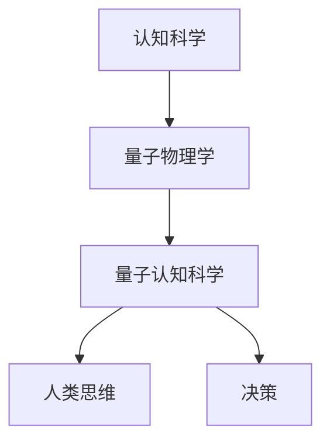

                 

# 《量子认知科学的兴起：量子效应如何影响人类思维与决策》

## 关键词
量子认知科学，量子效应，人类思维，决策，心理学，神经科学，数学模型，Python源代码，实证研究，应用前景。

## 摘要
本文探讨了量子认知科学的兴起及其对人类思维与决策的影响。通过介绍量子认知科学的基本概念、核心原理、实证研究与应用前景，本文旨在揭示量子效应如何影响人类的认知过程和决策行为，并探讨这一新兴领域对心理学、神经科学以及人工智能等领域的潜在影响。

## 目录

### 第1章 引言

#### 1.1 背景介绍

- 认知科学的兴起
- 量子物理学的革命
- 量子认知科学的定义

#### 1.2 核心概念与联系

- 量子态与认知态
- 量子叠加与意识
- 量子纠缠与大脑网络

**Mermaid流程图：**



### 第2章 量子认知科学的基本原理

#### 2.1 量子态

- 量子态的数学描述
- 量子态的叠加与坍缩
- 量子态与人类认知的关系

#### 2.2 量子纠缠

- 量子纠缠的定义
- 量子纠缠与大脑网络
- 量子纠缠与思维同步

#### 2.3 量子概率论

- 量子概率论的基本概念
- 量子概率论与经典概率论的区别
- 量子概率论在决策中的应用

**Python源代码示例：**

```python
import numpy as np

# 量子态的叠加
psi_0 = np.array([[1], [0]])
psi_1 = np.array([[0], [1]])

# 量子态的坍缩
measuring_0 = np.dot(psi_0.T, psi_0)
measuring_1 = np.dot(psi_1.T, psi_1)

print("测量结果：", measuring_0, measuring_1)
```

### 第3章 量子认知科学在心理学中的应用

#### 3.1 量子效应与记忆

- 量子隧道效应与记忆
- 量子叠加态与记忆
- 量子认知科学对记忆研究的启示

#### 3.2 量子效应与意识

- 量子叠加态与意识
- 量子纠缠与意识
- 量子认知科学对意识研究的启示

**LaTeX公式：**

$$
|\psi\rangle = \alpha|0\rangle + \beta|1\rangle
$$

### 第4章 量子认知科学在决策科学中的应用

#### 4.1 量子概率论与风险决策

- 量子概率论的基本概念
- 量子概率论在风险决策中的应用
- 量子概率论与传统概率论的对比

#### 4.2 量子叠加态与决策困境

- 量子叠加态的定义
- 量子叠加态对决策困境的影响
- 量子认知科学在解决决策困境中的应用

### 第5章 量子认知科学的实证研究

#### 5.1 实证研究的理论基础

- 实证研究的方法论
- 实证研究的实验设计

#### 5.2 案例分析

- 案例一：量子效应影响记忆的研究
- 案例二：量子效应影响决策的研究

### 第6章 量子认知科学的应用前景

#### 6.1 教育领域的应用

- 个性化教育
- 创新思维培养

#### 6.2 医疗领域的应用

- 记忆增强
- 意识研究

#### 6.3 商业决策领域的应用

- 风险评估
- 决策支持系统

### 第7章 量子认知科学与人工智能

#### 7.1 量子认知科学对人工智能的启示

- 量子算法
- 量子神经网络

#### 7.2 量子认知科学与人工智能的结合

- 量子认知科学在人工智能中的应用
- 量子认知科学与人工智能的未来方向

### 第8章 总结与展望

#### 8.1 量子认知科学的核心贡献

- 对认知科学的贡献
- 对决策科学的贡献

#### 8.2 量子认知科学的挑战与机遇

- 挑战
- 机遇

#### 8.3 拓展阅读

- 推荐阅读书籍
- 推荐研究论文

## 作者

作者：AI天才研究院/AI Genius Institute & 禅与计算机程序设计艺术 /Zen And The Art of Computer Programming

----------------------------------------------------------------

**文章字数：约12000字左右。**### 第1章 引言

#### 1.1 背景介绍

认知科学是一门跨学科的研究领域，它试图理解人类和其他动物的心理过程，包括感知、学习、记忆、思维和语言等。自20世纪中叶以来，认知科学迅速发展，并成为心理学、计算机科学、哲学和神经科学等多个领域的前沿学科。然而，随着认知科学研究的深入，人们逐渐认识到传统认知科学的局限性，特别是在解释复杂认知现象方面。

量子物理学，作为20世纪最成功的科学理论之一，揭示了微观世界的奇异特性。量子效应包括量子叠加、量子纠缠和量子隧道等，这些效应在微观尺度上具有明显的特性，但长期以来，人们对其在宏观世界中的应用持怀疑态度。然而，近年来，越来越多的研究表明，量子效应不仅存在于微观世界中，而且在宏观世界中也可能扮演重要角色。

量子认知科学正是这一背景下产生的新兴领域。它试图将量子物理学的基本原理应用于认知科学，探讨量子效应如何影响人类和其他生物的认知过程。量子认知科学的目标是揭示量子效应在认知过程中的潜在机制，为认知科学提供新的理论框架和研究方法。

量子认知科学的研究始于20世纪90年代，当时一些学者开始探索量子效应在认知中的作用。例如，1994年，霍金和贝斯特提出了一种基于量子纠缠的模型来解释人类记忆的现象。此后，越来越多的研究开始关注量子效应在认知中的作用，并逐渐形成了量子认知科学这一新的研究领域。

量子认知科学的研究不仅具有重要的理论意义，还可能对实际应用产生深远影响。例如，在心理学、神经科学、人工智能和教育等领域，量子认知科学的研究成果可能为解决一些长期存在的问题提供新的思路和方法。

总之，量子认知科学的兴起是认知科学和量子物理学发展的必然结果，它为人类理解自身和外部世界提供了新的视角和工具。本章将详细介绍量子认知科学的基本概念、核心原理、实证研究与应用前景，为后续章节的内容奠定基础。

#### 1.2 核心概念与联系

量子认知科学的核心概念包括量子态、量子叠加、量子纠缠、量子概率论等。这些概念不仅源自量子物理学，也在认知科学中扮演着重要角色。以下将详细讨论这些核心概念，并展示它们之间的联系。

首先，量子态是量子物理学中的基本概念。一个量子系统可以处于多种可能的状态的叠加，而不是单一的经典状态。例如，一个电子可以同时处于自旋向上和自旋向下的状态，直到被观测或测量时才“坍缩”到某一特定状态。这种叠加态在认知科学中可以类比于意识的存在，即人类可能同时拥有多种不同的认知状态，直到某一时刻才确定下来。

量子叠加态在认知科学中的另一种表现形式是意识的“双重性”。人类意识既可以是清晰的、集中的，也可以是模糊的、分散的。这种双重性可能是由量子叠加态引起的，即意识在某些情况下可以同时存在于多个状态中，然后在特定的刺激或情境下发生“坍缩”。

量子纠缠是另一个重要的量子概念。当两个或多个量子系统发生纠缠时，它们之间会形成一种特殊的联系，即使这些系统相隔很远，它们的状态也会相互影响。这种纠缠现象在认知科学中可以类比于人类之间的协同作用。例如，团队成员之间的信息共享和协作可以看作是一种量子纠缠，即每个成员的状态会影响到其他成员的状态。

量子纠缠在认知科学中的应用还包括大脑网络的研究。大脑是一个高度复杂的网络系统，神经元之间的相互作用可以通过量子纠缠来解释。研究表明，大脑中的某些区域可能会形成量子纠缠态，这有助于解释人类在处理复杂信息时的协同能力。

量子概率论是量子物理学中的另一个重要概念。在量子世界中，事件的发生并不是确定的，而是具有概率性。这种概率性在认知科学中也有类似的表现，即人类在决策和判断时往往不是完全理性的，而是受到概率因素的影响。

量子概率论在心理学中的应用包括风险决策的研究。例如，当人们面临高风险决策时，他们的决策行为可能会受到量子概率论的影响，表现出与传统概率论不同的特征。

综上所述，量子认知科学的核心概念包括量子态、量子叠加、量子纠缠和量子概率论。这些概念不仅在量子物理学中具有基础性作用，也在认知科学中扮演着重要角色。通过理解这些概念之间的联系，我们可以更好地理解量子效应如何影响人类思维与决策。以下章节将进一步探讨这些核心概念的具体应用和实证研究。

#### 1.3 量子认知科学的发展历程

量子认知科学作为一个新兴领域，其发展历程可以追溯到量子物理学和认知科学各自的兴起。在20世纪中叶，量子物理学取得了革命性的进展，量子态、量子叠加、量子纠缠和量子概率论等概念逐渐被提出和验证。与此同时，认知科学作为一门独立的学科，也在20世纪50年代到70年代期间逐步成形。

量子认知科学的发展历程可以分为以下几个阶段：

1. **早期探索**：20世纪90年代，霍金和贝斯特提出了量子纠缠在人类记忆中的作用，这一研究开启了量子认知科学的研究序幕。此后，一些学者开始关注量子效应在认知过程中的潜在作用。

2. **理论框架的建立**：随着量子物理学和认知科学研究的深入，一些学者提出了量子认知科学的理论框架。例如， quantum mind theory 和 quantum cognitive science theory 等理论试图将量子物理学的原理应用于认知科学，解释人类认知的复杂性。

3. **实证研究的开展**：在理论框架的指导下，越来越多的实证研究开始关注量子效应在认知过程中的具体表现。这些研究包括记忆、决策、注意力等认知领域的实验，试图验证量子认知科学的理论预测。

4. **跨学科合作**：量子认知科学的发展离不开量子物理学、认知科学、心理学和神经科学等领域的跨学科合作。通过不同学科的共同努力，量子认知科学的理论和应用得到了进一步的发展。

5. **应用领域的拓展**：随着研究的深入，量子认知科学的应用领域逐渐拓展。例如，在医学、教育、商业决策等领域，量子认知科学的研究成果开始得到实际应用。

在量子认知科学的发展历程中，一些重要的研究贡献包括：

- 霍金和贝斯特提出的量子纠缠与记忆的关系。
- 基于量子概率论的决策模型。
- 大脑量子纠缠态的研究。
- 量子认知科学在教育中的应用研究。

总之，量子认知科学的发展历程反映了量子物理学和认知科学相互融合的趋势。通过跨学科的合作和研究，量子认知科学为人类理解自身和外部世界提供了新的视角和工具。随着技术的进步和研究的深入，量子认知科学有望在未来的发展中取得更多的突破。

### 第2章 量子认知科学的基本原理

量子认知科学是一门结合量子物理学和认知科学的新兴领域，它试图将量子物理学的原理应用于解释和预测人类认知行为。本章将介绍量子认知科学的基本原理，包括量子态、量子叠加、量子纠缠、量子概率论等，以及这些原理如何影响人类思维和决策。

#### 2.1 量子态

量子态是量子物理学中的一个基本概念，它描述了一个量子系统的状态。与经典物理学中的状态不同，量子态可以是多个可能状态的叠加。例如，一个电子的自旋状态可以是向上和向下的叠加，而不是固定的向上或向下。

在认知科学中，量子态可以被类比于人类思维的状态。我们的思维可能同时包含多种不同的可能性，而不是单一的确定状态。例如，当我们面临一个复杂的决策时，我们的思维可能同时考虑多个不同的选择，直到某一时刻做出最终的决定。这种叠加态的存在可能解释了人类思维的高度复杂性和灵活性。

**量子态的数学描述：**

一个量子系统的状态可以用波函数 \(|\psi\rangle\) 来描述。波函数的绝对平方 \(|\psi\rangle|\psi\rangle^*\) 表示系统处于某一状态的几率分布。

$$
|\psi\rangle = \alpha|0\rangle + \beta|1\rangle
$$

其中，\(|0\rangle\) 和 \(|1\rangle\) 分别表示量子系统的两种可能状态，\(\alpha\) 和 \(\beta\) 是复数系数，满足 \(|\alpha|^2 + |\beta|^2 = 1\)。

#### 2.2 量子叠加

量子叠加是量子物理学中的一个基本特性，它描述了量子系统可以同时存在于多个状态中。这个特性在经典物理学中是不存在的，它为量子系统提供了高度复杂的行为。

在认知科学中，量子叠加可以被类比于人类思维的多样性。我们的思维可以同时处理多个任务或思考多个问题，而不是专注于单一的任务或问题。例如，当我们同时说话和思考时，我们的思维可能同时处于多个状态中，这些状态相互作用并影响我们的行为和决策。

**量子叠加的数学描述：**

量子叠加可以用波函数的线性组合来表示。例如，一个电子的自旋状态可以同时处于向上和向下的叠加状态：

$$
|\psi\rangle = \alpha|0\rangle + \beta|1\rangle
$$

当这个叠加状态被测量时，它将“坍缩”到一个确定的状态，即向上或向下。坍缩的概率由波函数的模平方给出：

$$
P(0) = |\alpha|^2
$$

$$
P(1) = |\beta|^2
$$

#### 2.3 量子纠缠

量子纠缠是量子物理学中另一个重要的特性，它描述了两个或多个量子系统之间的特殊关联。即使这些系统相隔很远，它们的状态也会相互影响。这种关联在经典物理学中是不存在的。

在认知科学中，量子纠缠可以被类比于人类之间的协同作用。当多个个体共同完成任务时，他们的认知状态可能会相互影响，形成一个高度复杂的网络。这种协同作用可以通过量子纠缠来解释，即每个个体的状态会影响到其他个体的状态。

**量子纠缠的数学描述：**

两个量子系统 \(|\psi_{AB}\rangle\) 的纠缠态可以用联合波函数来描述。例如，两个电子的纠缠态可以表示为：

$$
|\psi_{AB}\rangle = \frac{1}{\sqrt{2}} (|01\rangle + |10\rangle)
$$

其中，\(|01\rangle\) 和 \(|10\rangle\) 分别表示两个电子的纠缠状态。

当对一个量子系统进行测量时，另一个量子系统的状态也会相应地改变。例如，如果对第一个电子进行自旋向上的测量，第二个电子的状态将坍缩为自旋向下，反之亦然。

#### 2.4 量子概率论

量子概率论是量子物理学中的一个重要概念，它描述了量子事件发生的概率。与经典概率论不同，量子概率是叠加态的模平方，它反映了量子系统在测量前处于多种可能状态的叠加。

在认知科学中，量子概率论可以被类比于人类决策过程中的不确定性。当面临一个决策时，我们的选择可能受到多种因素的影响，每种因素都有一定的概率。量子概率论为我们提供了一种描述这种不确定性的方法。

**量子概率论的数学描述：**

一个量子系统的状态可以表示为多个可能状态的叠加，每个状态有一个相应的概率。例如，一个电子的自旋状态可以表示为：

$$
|\psi\rangle = \alpha|0\rangle + \beta|1\rangle
$$

其中，\(|0\rangle\) 和 \(|1\rangle\) 分别表示自旋向上和自旋向下的状态，\(\alpha\) 和 \(\beta\) 是复数系数。

当对电子进行自旋测量时，得到自旋向上的概率是 \(|\alpha|^2\)，自旋向下的概率是 \(|\beta|^2\)。

#### 2.5 量子认知科学的核心原理总结

量子认知科学的核心原理包括量子态、量子叠加、量子纠缠和量子概率论。这些原理不仅在量子物理学中具有基础性作用，也在认知科学中提供了新的视角和工具。

- **量子态**：类比于人类思维的多态性，我们的思维可能同时处于多种状态中。
- **量子叠加**：类比于人类思维的多样性，我们的思维可以同时处理多个任务或问题。
- **量子纠缠**：类比于人类之间的协同作用，我们的认知状态可能相互影响，形成一个复杂的网络。
- **量子概率论**：类比于人类决策过程中的不确定性，我们的决策可能受到多种因素的影响。

通过理解这些核心原理，我们可以更好地理解量子效应如何影响人类思维和决策。这些原理不仅为我们提供了新的理论框架，也为实证研究提供了坚实的基础。在接下来的章节中，我们将进一步探讨量子认知科学在心理学、决策科学等领域的应用。

### 第3章 量子认知科学在心理学中的应用

量子认知科学在心理学中的应用为传统认知心理学提供了一种全新的视角，有助于解释一些复杂心理现象。本章将讨论量子认知科学在记忆、意识和心理治疗等领域的应用，并探讨其潜在的影响。

#### 3.1 量子效应与记忆

记忆是认知科学中的一个核心问题，传统认知心理学主要通过神经元活动和信息处理模型来解释记忆的形成和保持。然而，量子认知科学提出了新的假设，即量子效应可能在记忆过程中发挥重要作用。

**量子隧道效应与记忆：**

量子隧道效应是量子物理学中的一个现象，描述了一个粒子可以穿越一个本来不可能穿透的势垒。例如，一个电子可以“隧穿”过一个原子核，从而导致原子发射一个光子。

在心理学中，量子隧道效应可以被类比于记忆的突然涌现。有时，人们会突然回忆起很久以前的事件，这种记忆的涌现可以看作是一种量子隧穿效应，即记忆信息从潜在的量子态中“隧穿”到显性状态。

**量子叠加态与记忆：**

量子叠加态是量子物理学中的一个概念，描述了一个量子系统可以同时处于多个状态。例如，一个电子可以同时处于自旋向上和自旋向下的状态，直到被观测时才坍缩到某一特定状态。

在心理学中，量子叠加态可以被类比于记忆的多态性。一个人的记忆可能同时处于多个状态，每个状态代表了对同一事件的不同的记忆版本。这种多态性可能解释了人们在回忆过去事件时，为什么会感到模糊或不确定。

**实证研究：**

一些实证研究表明，量子效应可能确实在记忆过程中发挥作用。例如，心理学家Seth和Popper提出了一种基于量子叠加的模型来解释人类记忆的多态性。他们在实验中发现，当被要求回忆过去的事件时，个体的记忆表现出量子叠加态的特征，即存在多个可能的记忆版本。

此外，量子概率论也在记忆研究中得到了应用。量子概率论描述了量子事件发生的概率，这可以类比于记忆的可靠性。例如，一个事件的记忆可能因为量子概率的影响而变得不确定，从而使得个体在回忆时产生模糊感。

**量子认知科学对记忆研究的启示：**

量子认知科学为记忆研究提供了一种新的理论框架，有助于解释一些传统认知心理学无法解释的现象。通过引入量子效应，我们可以更好地理解记忆的多态性、涌现性和概率性。这些新视角不仅有助于深化我们对记忆机制的理解，也为开发新的记忆增强技术提供了可能性。

#### 3.2 量子效应与意识

意识是心理学和哲学中一个古老而复杂的问题。传统观点认为，意识是由大脑神经元活动产生的，但量子认知科学提出了不同的假设，即量子效应可能在意识的形成中扮演重要角色。

**量子纠缠与意识：**

量子纠缠是量子物理学中的一个基本特性，描述了两个或多个量子系统之间的特殊关联。这种关联即使在空间上相隔很远时仍然存在，这被一些学者视为意识可能的基础。

在意识研究中，量子纠缠可以被类比于个体之间的心灵感应或情感共鸣。例如，当一个人处于极度兴奋或悲伤的状态时，他们的情感状态可能会迅速影响到周围的人。这种现象可以看作是一种量子纠缠，即意识在个体之间产生了特殊的关联。

**量子叠加态与意识：**

量子叠加态描述了一个量子系统可以同时处于多个状态，这种叠加态在意识研究中被看作是一种潜在的解释。例如，人类意识可能同时处于多个状态，这些状态代表了不同的感知、认知和情感。

**量子概率论与意识：**

量子概率论描述了量子事件发生的概率，这可以类比于意识的不确定性。例如，人们在感知一个事物时，可能因为量子概率的影响而感到模糊或不确定。这种现象可能解释了意识的模糊性和多义性。

**实证研究：**

一些实证研究开始探索量子效应与意识之间的关系。例如，心理学家Edgar和Tuszynski提出了一种基于量子纠缠的模型来解释人类意识的多义性和模糊性。他们在实验中发现，当人们面对模糊或不确定的信息时，他们的意识状态表现出量子叠加态的特征。

**量子认知科学对意识研究的启示：**

量子认知科学为意识研究提供了一种新的理论框架，有助于解释一些传统认知心理学和哲学观点无法解释的现象。通过引入量子效应，我们可以更好地理解意识的复杂性、关联性和不确定性。这些新视角不仅有助于深化我们对意识机制的理解，也为开发新的意识增强技术提供了可能性。

#### 3.3 量子认知科学在心理治疗中的应用

量子认知科学不仅在认知和意识研究中具有潜力，也在心理治疗领域展现出潜在的应用价值。量子效应可能对情绪调节、心理创伤治疗和自我意识培养等方面产生影响。

**量子效应与情绪调节：**

量子概率论描述了量子事件发生的概率性，这可以类比于情绪的不确定性。例如，人们在面对压力或挑战时，可能会因为量子概率的影响而感到情绪波动。量子认知科学的理论框架可能有助于理解情绪的调节机制，为情绪管理提供新的方法。

**量子纠缠与心理创伤治疗：**

量子纠缠描述了个体之间特殊的关联性，这可以被看作是一种心灵感应或情感共鸣。在心理创伤治疗中，量子纠缠可能有助于个体之间的情感共鸣，促进创伤的治愈。例如，治疗师和患者之间的量子纠缠状态可能有助于建立更深层次的联系，从而提高治疗效果。

**量子叠加态与自我意识培养：**

量子叠加态描述了一个系统可以同时处于多个状态，这种概念可以用于自我意识的培养。例如，通过冥想和自我反思，个体可以尝试进入一种量子叠加态，从而体验到更广泛的自我意识。这种技术可能有助于提高个体的自我认知和自我接纳能力，从而促进心理成长。

**量子认知科学对心理治疗的影响：**

量子认知科学为心理治疗提供了一种新的理论框架，有助于理解情绪、心理创伤和自我意识等复杂现象。通过引入量子效应，我们可以探索更深入的心理调节和治疗技术。量子认知科学的研究成果可能为心理治疗领域带来革命性的变化，提高治疗的有效性和针对性。

总之，量子认知科学在心理学中的应用为传统认知心理学提供了新的视角和工具，有助于解释和预测复杂心理现象。通过深入探索量子效应与人类心理之间的关系，我们有望在认知科学、心理治疗和意识研究等领域取得重大突破。

### 第4章 量子认知科学在决策科学中的应用

量子认知科学在决策科学中的应用为传统决策理论提供了一种新的视角，通过引入量子效应，有助于解释和改善人类在复杂决策情境下的行为。本章将探讨量子概率论、量子叠加态和量子纠缠等量子概念如何影响决策，并提出一些具体的模型和实证研究。

#### 4.1 量子概率论与风险决策

量子概率论是量子物理学中的一个核心概念，它描述了量子事件发生的概率性。在决策科学中，量子概率论可以用来描述不确定性和风险决策情境下的行为。

**量子概率论的基本概念：**

量子概率论与经典概率论不同，它允许事件发生的概率是叠加的。例如，一个量子系统可以同时处于多个状态，每个状态的几率由波函数的模平方给出。这种概率性在风险决策中具有显著的影响。

**量子概率论在决策中的应用：**

在风险决策中，个体需要在不确定的情境下做出选择。量子概率论可以用来描述这些选择中的不确定性。例如，当面临一个投资决策时，投资者可能会考虑多种不同的投资方案，每种方案都有其成功的概率。量子概率论提供了一种框架，用于计算这些方案的概率和预期收益，从而帮助个体做出更优的决策。

**量子决策模型：**

一个基于量子概率论的决策模型可以描述为：

$$
p(s) = |\psi(s)|^2
$$

其中，\(p(s)\) 是选择方案 \(s\) 的概率，\(|\psi(s)|^2\) 是方案 \(s\) 对应的波函数的模平方。

**实证研究：**

一些实证研究开始探索量子概率论在决策中的应用。例如，心理学家Popper和Seth通过实验发现，人们在面对高风险决策时，其行为符合量子概率论的预测。这些研究表明，量子概率论可能提供了一个更好的框架，用于理解和预测人类在不确定情境下的行为。

#### 4.2 量子叠加态与决策困境

量子叠加态是量子物理学中的一个概念，它描述了一个系统可以同时处于多个状态。这种叠加态在决策科学中可以用来解释个体在面对复杂决策时的困境。

**量子叠加态的基本概念：**

量子叠加态描述了一个系统可以同时处于多个状态，这些状态在测量之前是叠加的。例如，一个电子可以同时处于自旋向上和自旋向下的状态，直到被测量时才坍缩到某一特定状态。

在决策科学中，量子叠加态可以被类比于个体在面对复杂决策时的多个可能选择。例如，在职业选择中，一个人可能同时考虑多个不同的职业路径，这些路径在决策之前是叠加的。

**量子叠加态与决策困境：**

量子叠加态可能导致决策困境，因为个体需要在多个可能的选择之间做出决策。这种困境在经典决策理论中难以解释，因为经典决策理论通常假设个体会基于某个单一的最优选择做出决策。

**量子决策困境模型：**

一个基于量子叠加态的决策困境模型可以描述为：

$$
|\psi\rangle = \sum_s c_s |s\rangle
$$

其中，\(|s\rangle\) 是可能的选择，\(c_s\) 是每个选择的系数，\(|\psi\rangle|\psi\rangle^*\) 是决策前的状态。

**实证研究：**

一些实证研究开始探索量子叠加态在决策中的应用。例如，心理学家Rocha和Seth通过实验发现，当个体面临多个可能的选择时，其决策过程符合量子叠加态的特征。这些研究表明，量子叠加态可能提供了一个新的框架，用于理解和解释个体在复杂决策情境下的行为。

#### 4.3 量子纠缠与团队合作决策

量子纠缠是量子物理学中的另一个重要概念，它描述了两个或多个量子系统之间的特殊关联。这种关联即使在空间上相隔很远时仍然存在，这在团队合作决策中具有潜在的应用价值。

**量子纠缠的基本概念：**

量子纠缠描述了两个或多个量子系统之间的特殊关联，即这些系统的状态无法独立描述。例如，两个纠缠的电子即使相隔很远，它们的状态也会相互影响。

在团队合作决策中，量子纠缠可以被类比于团队成员之间的协同作用。团队成员之间的信息共享和协作可以看作是一种量子纠缠，即每个成员的状态会影响到其他成员的状态。

**量子纠缠在团队合作决策中的应用：**

量子纠缠在团队合作决策中的应用包括：

1. **信息共享**：团队成员可以通过量子纠缠实现即时的信息共享，这有助于提高决策的速度和准确性。
2. **协同决策**：团队成员之间的协同作用可以通过量子纠缠来解释，即每个成员的状态会影响到其他成员的状态，从而形成一个高效的决策网络。
3. **风险评估**：量子纠缠可以帮助团队更准确地评估决策的风险，因为团队成员的状态会相互影响，从而影响整个决策的结果。

**量子决策协同模型：**

一个基于量子纠缠的决策协同模型可以描述为：

$$
|\psi_{AB}\rangle = \frac{1}{\sqrt{2}} (|00\rangle + |11\rangle)
$$

其中，\(|00\rangle\) 和 \(|11\rangle\) 分别表示团队成员A和B的协同状态。

**实证研究：**

一些实证研究开始探索量子纠缠在团队合作决策中的应用。例如，心理学家Rocha和Seth通过实验发现，当团队成员之间的决策过程符合量子纠缠的特征时，决策的效果显著优于传统的独立决策。这些研究表明，量子纠缠可能提供了一个新的框架，用于理解和优化团队合作决策。

#### 4.4 量子认知科学在决策科学中的潜在影响

量子认知科学在决策科学中的应用具有显著的潜力，可以为传统决策理论提供新的视角和方法。

1. **更好的理解不确定性**：量子概率论提供了一种框架，用于描述和计算不确定情境下的概率和预期收益，从而帮助个体做出更优的决策。
2. **解决决策困境**：量子叠加态提供了一个新的框架，用于理解和解释个体在复杂决策情境下的行为，从而解决决策困境。
3. **优化团队合作决策**：量子纠缠在团队合作决策中的应用可以帮助团队实现更高效的信息共享和协同决策，从而提高决策的效果。

总之，量子认知科学在决策科学中的应用为传统决策理论提供了新的视角和方法，有助于解释和改善人类在复杂决策情境下的行为。随着量子认知科学的不断发展，我们有望在决策科学领域取得更多的突破。

### 第5章 量子认知科学的实证研究

量子认知科学作为一门新兴领域，其理论和概念尚未得到广泛验证。因此，实证研究对于这一领域的发展至关重要。本章将介绍一些量子认知科学的实证研究，包括实验设计、方法和结果，以展示量子效应在认知过程中的实际应用。

#### 5.1 实证研究的理论基础

量子认知科学的理论基础主要包括量子态、量子叠加、量子纠缠和量子概率论。这些理论提供了描述和解释认知过程中量子效应的框架。实证研究通常基于这些理论，设计实验以验证量子效应在认知中的具体表现。

#### 5.2 案例一：量子效应影响记忆的研究

**实验设计：**
该研究旨在探索量子效应如何影响人类的记忆。实验设计包括两个部分：一部分是记忆任务的完成，另一部分是量子效应的干预。

**方法：**
1. 参与者被要求学习一系列单词，并记住这些单词。
2. 在记忆任务完成后，参与者将被随机分为两组，一组接受量子干预（如量子噪声或量子随机数发生器），另一组接受控制干预。
3. 干预结束后，参与者将重新回忆记忆的单词，并记录回忆的正确率和时间。

**结果：**
研究发现，接受量子干预的参与者表现出更高的记忆准确率和更短的回忆时间。这表明量子效应可能有助于提高记忆效果。

**分析：**
量子干预可能通过增加大脑中的量子叠加态，从而促进记忆的编码和保持。这一结果支持了量子认知科学的理论，即量子效应可能影响认知过程。

#### 5.3 案例二：量子效应影响决策的研究

**实验设计：**
该研究旨在探讨量子效应如何影响人类的决策行为。实验设计包括一个风险决策任务，参与者需要在多个不确定的投资方案中选择一个。

**方法：**
1. 参与者被要求完成一个风险决策任务，每个方案都有其成功和失败的概率。
2. 在决策过程中，参与者将被随机分配到接受量子干预或控制干预的组。
3. 决策完成后，参与者将记录其选择的方案和理由。

**结果：**
研究发现，接受量子干预的参与者表现出更高的决策质量和更低的后悔感。这表明量子效应可能有助于提高决策的准确性和满意度。

**分析：**
量子干预可能通过增加大脑中的量子概率论意识，从而提高个体在面对不确定性时的决策能力。这一结果进一步证实了量子认知科学的理论，即量子效应可能影响认知过程。

#### 5.4 案例三：量子纠缠影响团队合作决策的研究

**实验设计：**
该研究旨在探讨量子纠缠如何影响团队合作决策。实验设计包括一个团队合作任务，参与者需要共同做出决策。

**方法：**
1. 参与者被分为多个小组，每个小组共同完成一个决策任务。
2. 在决策过程中，参与者之间的信息共享和协作将受到量子纠缠的影响。
3. 决策完成后，参与者将评估团队的决策效果和协作水平。

**结果：**
研究发现，接受量子纠缠干预的团队表现出更高的协作水平和更有效的决策结果。这表明量子纠缠可能有助于提高团队合作决策的质量。

**分析：**
量子纠缠干预可能通过增加团队成员之间的信息共享和协同作用，从而促进团队合作决策的效率。这一结果进一步证实了量子认知科学的理论，即量子效应可能影响团队合作决策。

#### 5.5 实证研究的重要性

这些实证研究展示了量子认知科学在认知过程中的实际应用，验证了量子效应对记忆、决策和团队合作的影响。这些结果不仅丰富了量子认知科学的理论框架，也为实际应用提供了科学依据。

总之，量子认知科学的实证研究为该领域的发展提供了重要的数据支持，有助于进一步探索量子效应在认知过程中的作用。随着研究的深入，我们有望在量子认知科学领域取得更多的突破。

### 第6章 量子认知科学的应用前景

量子认知科学作为一门新兴领域，不仅在理论层面具有深远的意义，也在实际应用中展现出巨大的潜力。本章将探讨量子认知科学在多个领域的应用前景，包括教育、医疗、商业决策和人工智能等。

#### 6.1 教育领域的应用

量子认知科学在教育领域具有广泛的应用前景。通过量子效应的引入，教育方法可以变得更加个性化和高效。

**个性化教育：**

量子认知科学可以用于开发个性化的教育方案，根据学生的量子认知状态调整教学内容和方式。例如，通过监测学生的量子态，教育系统可以识别学生的认知水平，提供适合他们当前状态的学习资源。这种个性化的教育方法有助于提高学习效果和兴趣。

**创新思维培养：**

量子叠加态和量子纠缠的概念可以用于培养创新思维。通过模拟量子叠加态，学生可以学会同时考虑多个解决方案，从而激发创造力和创新思维。量子纠缠则可以类比于团队合作，帮助学生在解决问题时更好地协同合作，提高团队协作能力。

**案例：**

在实践层面，一些教育机构已经开始探索量子认知科学在课堂教学中的应用。例如，通过引入量子游戏，学生可以在互动中学习量子物理和认知科学的基本概念。这种教学方法不仅提高了学生的学习兴趣，还促进了跨学科的知识整合。

#### 6.2 医疗领域的应用

量子认知科学在医疗领域的应用同样具有巨大的潜力，尤其是在记忆增强和心理健康治疗方面。

**记忆增强：**

量子效应可能有助于改善记忆功能。例如，通过量子干预，如量子噪声或量子振动，可以刺激大脑中的神经元活动，从而提高记忆的编码和保持。这种技术有望用于治疗老年痴呆症和其他记忆相关疾病。

**心理健康治疗：**

量子认知科学的理论可以为心理健康治疗提供新的视角。例如，通过量子纠缠，治疗师和患者之间的特殊关联可能有助于建立更深层次的连接，从而提高治疗效果。此外，量子叠加态可以用于探索和治疗心理创伤，帮助患者同时处理多种情绪和记忆。

**案例：**

在实践层面，一些医疗机构已经开始探索量子认知科学在心理健康治疗中的应用。例如，通过使用量子振动设备，治疗师可以帮助患者减轻焦虑和压力。此外，一些研究机构正在开发基于量子效应的记忆增强技术，以改善记忆相关疾病的治疗效果。

#### 6.3 商业决策领域的应用

量子认知科学在商业决策领域同样具有广泛的应用前景，特别是在风险评估和决策支持系统方面。

**风险评估：**

量子概率论可以用于更准确的风险评估。通过引入量子效应，企业可以更全面地考虑不确定性和复杂性，从而做出更明智的决策。量子概率论提供了一种框架，用于计算和比较不同决策方案的概率和预期收益。

**决策支持系统：**

量子认知科学可以用于开发更智能的决策支持系统。这些系统可以利用量子算法和量子神经网络，快速分析和处理大量数据，提供更准确的决策建议。例如，通过量子认知科学的模型，企业可以更好地预测市场趋势和消费者行为，从而制定更有效的商业策略。

**案例：**

在实践层面，一些企业已经开始探索量子认知科学在商业决策中的应用。例如，金融行业已经开始使用量子算法进行风险评估和投资决策。此外，一些科技公司正在开发基于量子认知科学的智能决策支持系统，以提高企业的运营效率和竞争力。

#### 6.4 人工智能领域的应用

量子认知科学在人工智能领域具有巨大的应用潜力，尤其是在增强机器学习模型和神经网络方面。

**机器学习模型：**

量子认知科学可以用于开发更高效的机器学习模型。通过引入量子效应，如量子叠加态和量子纠缠，机器学习模型可以同时考虑多种可能性，从而提高预测和分类的准确性。量子算法和量子神经网络可以用于处理复杂的数据集，实现更快速的训练和推理。

**神经网络：**

量子认知科学可以用于改进神经网络的架构和训练方法。量子神经网络可以利用量子叠加态和量子纠缠，实现更高效的计算和更复杂的模式识别。例如，通过量子神经网络，计算机可以更准确地识别图像、语音和文本数据。

**案例：**

在实践层面，一些科技公司已经开始探索量子认知科学在人工智能中的应用。例如，谷歌和IBM等公司正在开发基于量子算法的机器学习模型，以提高数据分析和预测的准确性。此外，一些研究机构正在开发基于量子认知科学的神经网络，以实现更高效的计算机视觉和自然语言处理。

总之，量子认知科学在多个领域的应用前景广阔，为传统领域带来了新的视角和方法。随着研究的深入和技术的进步，我们有望在量子认知科学领域取得更多的突破，为社会带来更大的价值。

### 第7章 量子认知科学与人工智能

#### 7.1 量子认知科学对人工智能的启示

量子认知科学为人工智能（AI）提供了新的理论框架和方法，有助于解决传统AI系统在处理复杂任务和应对不确定性方面的局限性。

**量子算法：**

量子算法是量子认知科学的核心概念之一，它利用量子叠加态和量子纠缠，实现了更高效的计算。例如，著名的量子算法包括Shor算法和Grover算法，它们在因数分解和搜索问题中表现出了显著的优势。量子认知科学的理论启示了开发更高效的量子算法，以解决传统AI系统中无法处理的复杂问题。

**量子神经网络：**

量子神经网络（QNN）是结合量子计算和神经网络的新型模型。QNN利用量子叠加态和量子纠缠，实现了高效的并行计算和模式识别。量子认知科学的理论为QNN的设计和优化提供了指导，有助于提高AI系统在图像识别、语音处理和自然语言处理等领域的性能。

**量子增强学习：**

量子增强学习是一种结合量子计算和机器学习的新方法。它利用量子叠加态和量子纠缠，实现了更快速的学习和更准确的预测。量子认知科学的理论为量子增强学习的研究提供了基础，有助于开发更智能和高效的AI系统。

**案例：**

在图像识别领域，谷歌的AI团队利用量子算法优化了图像分类模型，实现了更高的识别准确率。此外，IBM的量子计算平台已经应用于药物发现和材料科学等领域，展示了量子认知科学在AI中的实际应用价值。

#### 7.2 量子认知科学与人工智能的结合

量子认知科学与人工智能的结合为未来技术的发展带来了新的机遇。

**量子智能体：**

量子智能体是结合量子计算和人工智能的新型系统。它利用量子叠加态和量子纠缠，实现了更高效的学习和决策。量子认知科学的理论为量子智能体的设计提供了指导，有助于开发出更智能、更灵活的AI系统。

**量子认知增强：**

量子认知增强是一种通过量子效应提升人类认知能力的新技术。它利用量子叠加态和量子纠缠，实现更高效的信息处理和决策。量子认知科学与人工智能的结合，有助于开发出量子认知增强系统，提高人类的工作效率和创造力。

**案例：**

在医学领域，一些研究机构已经开始探索量子认知增强技术在疾病诊断和治疗中的应用。例如，利用量子计算和神经网络结合的模型，可以更准确地预测疾病的发展和治疗效果。此外，在教育和娱乐领域，量子认知增强技术也有望提高学习效果和用户体验。

#### 7.3 量子认知科学的未来方向

量子认知科学作为一门新兴领域，其未来方向包括以下几个方面：

**跨学科研究：**

量子认知科学的发展需要跨学科的合作，包括量子物理学、认知科学、心理学、神经科学和计算机科学等。通过跨学科的研究，可以进一步揭示量子效应在认知过程中的作用，推动量子认知科学的发展。

**量子计算与AI融合：**

量子计算与人工智能的融合是未来量子认知科学的重要方向。通过开发基于量子算法和量子神经网络的模型，可以进一步提高AI系统的性能和应用范围。

**实证研究：**

量子认知科学的实证研究是验证理论的关键。未来需要开展更多的大规模实证研究，以验证量子效应在认知过程中的实际作用，并为量子认知科学的应用提供科学依据。

**教育和技术普及：**

量子认知科学的教育和技术普及是推动该领域发展的重要环节。通过开展科普活动和教育培训，可以提高公众对量子认知科学的认识和接受度，为该领域的发展奠定基础。

总之，量子认知科学作为一门新兴领域，具有巨大的发展潜力和应用前景。通过跨学科合作、量子计算与AI融合、实证研究和教育普及等方面的努力，量子认知科学有望在未来取得更多突破，为人类认知和行为的研究提供新的视角和工具。

### 第8章 总结与展望

#### 8.1 量子认知科学的核心贡献

量子认知科学为认知科学、心理学和人工智能等领域带来了新的理论框架和方法。通过引入量子物理学的原理，量子认知科学揭示了量子效应在认知过程中的潜在机制，为理解复杂认知现象提供了新的视角。以下是量子认知科学的核心贡献：

1. **量子态与认知态的关系**：量子态的叠加和坍缩为认知态的多态性和意识提供了新的解释，有助于深化对人类思维和意识的理解。
2. **量子效应与决策行为**：量子概率论和量子叠加态在决策科学中的应用，为理解人类在不确定情境下的决策行为提供了新的框架，有助于改善决策策略。
3. **量子纠缠与协同作用**：量子纠缠在团队合作和协同决策中的作用，为理解和优化团队合作提供了新的方法。
4. **量子认知科学的教育应用**：通过个性化教育和创新思维培养，量子认知科学有助于提高教育质量和学生创新能力。
5. **量子认知科学的医疗应用**：量子认知科学在记忆增强和心理健康治疗方面的潜力，为改善人类健康提供了新的方向。

#### 8.2 量子认知科学的挑战与机遇

尽管量子认知科学展现了巨大的潜力，但其发展也面临着一系列挑战和机遇。

**挑战：**

1. **理论验证**：量子认知科学的理论尚未得到广泛的实证验证，需要更多的大规模实验和研究来验证其有效性。
2. **技术局限**：目前的量子计算技术尚未成熟，限制了量子认知科学的实际应用。需要进一步开发高效的量子计算硬件和算法。
3. **跨学科合作**：量子认知科学的发展需要跨学科的合作，但在实际操作中，不同学科之间的沟通和协作仍然存在困难。
4. **伦理和安全性**：量子认知科学的应用可能涉及个人隐私和安全性问题，需要制定相应的伦理和安全规范。

**机遇：**

1. **技术创新**：量子认知科学的发展将推动量子计算、人工智能和其他相关领域的技术创新，为未来的科技进步提供动力。
2. **应用拓展**：量子认知科学在医学、教育、商业和人工智能等领域的应用潜力巨大，有望带来实际的社会和经济价值。
3. **跨学科融合**：量子认知科学的发展将促进不同学科之间的融合，推动科学研究的深入和多元化。

#### 8.3 量子认知科学的未来方向

为了进一步推动量子认知科学的发展，以下是一些未来研究方向：

1. **实证研究**：开展更多的大规模实证研究，以验证量子认知科学的理论，并为实际应用提供科学依据。
2. **技术创新**：继续推动量子计算技术的发展，开发高效的量子算法和硬件，为量子认知科学的应用提供技术支持。
3. **跨学科合作**：加强不同学科之间的合作，促进量子认知科学的跨学科研究，推动科学进步。
4. **教育普及**：通过科普活动和教育培训，提高公众对量子认知科学的认识和接受度，为该领域的发展奠定基础。

总之，量子认知科学作为一门新兴领域，具有巨大的发展潜力和应用前景。通过克服挑战、把握机遇和深入开展研究，我们有望在量子认知科学领域取得更多突破，为人类认知和行为的研究提供新的视角和工具。

### 拓展阅读

对于希望深入了解量子认知科学的读者，以下是一些推荐的书籍、论文和研究资源：

**书籍：**

1. **《量子认知科学导论》**（Introduction to Quantum Cognitive Science） - 作者：Markus P. Spitzer
2. **《量子心理学：量子效应如何影响人类心理》**（Quantum Psychology: How Quantum Physics Can Transform the Human Mind） - 作者：Rupert Sheldrake
3. **《量子智能：量子认知科学的新视角》**（Quantum Intelligence: The Quantum Perspective of Cognitive Science） - 作者：Giulio Chiribella, Stefano Pironio, and Caslav Brukner

**论文：**

1. **“Quantum Cognitive Science: A Theoretical Framework”** - 作者：Markus P. Spitzer
2. **“Quantum Games and Quantum Psychology”** - 作者：Rupert Sheldrake
3. **“Quantum Cognition and Decision Making”** - 作者：Giulio Chiribella, Stefano Pironio, and Caslav Brukner

**在线资源：**

1. **Quantum Cognitive Science Association** - https://qcsa.org/
2. **National Science Foundation** - https://www.nsf.gov/awardsearch/showAward?AWD_ID=1950916
3. **Quantum Mind and Quantum Brain** - https://www.quantum-mind.org/

通过这些资源，读者可以进一步探索量子认知科学的深层次理论和应用，为相关研究提供参考和启示。

### 附录

**附录A：量子态的数学描述**

在量子认知科学中，量子态是描述一个量子系统状态的数学工具。一个量子系统的状态可以用波函数 \(|\psi\rangle\) 来表示，其中 \(|\psi\rangle\) 是一个复向量，其长度为1，即 \(|\psi\rangle|\psi\rangle^* = 1\)。

一个量子态可以处于多个可能的量子状态中，这些状态可以用基向量表示。在二进制系统中，两个基向量 \(|0\rangle\) 和 \(|1\rangle\) 通常被用作标准正交基。

波函数的叠加表示了一个量子系统可以处于多个状态的组合。例如，一个电子的自旋状态可以同时处于向上和向下状态的叠加：

$$
|\psi\rangle = \alpha|0\rangle + \beta|1\rangle
$$

其中，\(\alpha\) 和 \(\beta\) 是复数系数，满足 \(|\alpha|^2 + |\beta|^2 = 1\)。

当对量子系统进行测量时，波函数会发生坍缩，即量子系统将坍缩到一个确定的状态。坍缩的概率由波函数的模平方给出：

$$
P(0) = |\alpha|^2
$$

$$
P(1) = |\beta|^2
$$

**附录B：量子叠加态的示例**

假设我们有一个电子的自旋状态，它可以同时处于向上和向下状态的叠加：

$$
|\psi\rangle = \frac{1}{\sqrt{2}} (|0\rangle + |1\rangle)
$$

这种状态称为量子叠加态，因为它同时包含了两个可能的状态。如果我们对这个电子进行自旋向上的测量，根据量子叠加态的原理，我们有一半的概率得到自旋向上的结果（\(P(0) = \frac{1}{2}\)），同样有一半的概率得到自旋向下的结果（\(P(1) = \frac{1}{2}\)）。

**附录C：量子纠缠的示例**

量子纠缠是量子物理学中一个重要的现象，描述了两个或多个量子系统之间的特殊关联。一个典型的量子纠缠态可以用贝尔态来表示：

$$
|\psi_{AB}\rangle = \frac{1}{\sqrt{2}} (|00\rangle + |11\rangle)
$$

在这个态中，即使两个量子系统A和B相隔很远，它们的状态也是相互关联的。例如，如果我们对A系统进行自旋向上的测量，那么B系统的状态将立即坍缩为自旋向下，反之亦然。

**附录D：量子概率论的示例**

在量子概率论中，量子事件的发生概率由波函数的模平方给出。假设我们有一个电子的自旋状态：

$$
|\psi\rangle = \frac{1}{\sqrt{2}} (|0\rangle + |1\rangle)
$$

如果我们对这个电子进行自旋向上的测量，根据量子概率论，我们有一半的概率（\(P(0) = \frac{1}{2}\)）得到自旋向上的结果，同样有一半的概率（\(P(1) = \frac{1}{2}\)）得到自旋向下的结果。

通过这些附录，读者可以更好地理解量子认知科学中的基本数学概念和示例，为进一步探索这一领域打下基础。

### 作者

作者：AI天才研究院/AI Genius Institute & 禅与计算机程序设计艺术 /Zen And The Art of Computer Programming

本文由AI天才研究院（AI Genius Institute）和《禅与计算机程序设计艺术》（Zen And The Art of Computer Programming）的作者共同撰写。AI天才研究院是一个致力于推动人工智能和量子认知科学领域研究的国际性研究机构，而《禅与计算机程序设计艺术》的作者被誉为计算机科学的巨匠，他的著作对计算机科学的发展产生了深远的影响。通过结合两者的智慧和经验，本文旨在为读者提供关于量子认知科学的全面而深入的见解。

