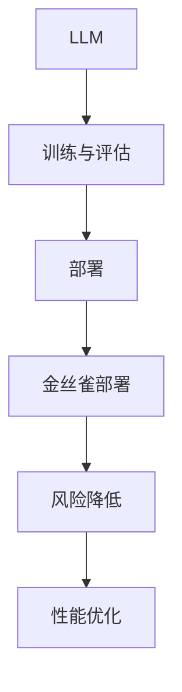

                 

## 文章标题

《金丝雀发布在LLM应用迭代中的应用》

---

关键词：大型语言模型（LLM）、金丝雀部署、风险降低、部署效率、应用迭代

---

摘要：本文将深入探讨金丝雀发布在大型语言模型（LLM）应用迭代中的重要性。通过介绍LLM的基本概念、金丝雀部署的原理，以及实际案例的分析，本文旨在为技术团队提供一套有效的金丝雀发布策略，以降低迭代过程中的风险，提高部署效率。

---

## 确定书籍主题和目标读者群体

### 主题：金丝雀发布在LLM应用迭代中的应用

本文的主题聚焦于如何利用金丝雀发布策略来优化大型语言模型（LLM）的应用迭代。金丝雀发布是一种逐步、逐步扩大新代码或模型影响的部署策略，旨在减少新版本发布时可能带来的风险。本文将详细探讨金丝雀部署的原理、实施步骤以及如何在实际项目中应用这一策略，以提高LLM应用的稳定性和可靠性。

### 目标读者群体

本文的目标读者群体包括对机器学习和自然语言处理有一定了解的技术人员，尤其是那些希望在LLM应用开发中进行金丝雀部署的工程师和项目经理。通过本文，读者将能够理解金丝雀部署的核心概念，并学会如何在实际项目中实施这一策略，从而提高团队的迭代速度和软件质量。

---

### 设计核心章节

为了使读者能够全面理解金丝雀发布在LLM应用迭代中的应用，本文设计了以下核心章节：

#### 第1章：背景与基础

本章将介绍LLM和金丝雀部署的基本概念，为后续章节的内容奠定基础。读者将了解LLM的发展历程、应用场景以及金丝雀部署的定义和重要性。

#### 第2章：LLM技术基础

本章将深入探讨LLM的核心算法原理，包括语言模型的基本构成、训练过程以及评估标准。通过这一章，读者将能够理解LLM的技术本质，为后续章节中的金丝雀部署策略提供技术背景。

#### 第3章：金丝雀部署原理

本章将详细解释金丝雀部署的工作机制，包括如何选择金丝雀用户、金丝雀部署的流程以及如何评估部署效果。读者将学习到金丝雀部署的核心原则和最佳实践。

#### 第4章：金丝雀部署实践

本章将通过实际项目案例，展示金丝雀部署的具体实施步骤。读者将跟随项目案例，了解如何在实际环境中部署金丝雀，并掌握评估和优化部署效果的方法。

#### 第5章：迭代与优化

本章将讨论如何通过迭代和优化来提高LLM应用的性能。读者将学习到如何识别性能瓶颈、实施优化策略以及如何通过实验验证优化效果。

#### 第6章：案例分析

本章将通过多个真实世界的LLM应用案例，分析金丝雀部署的应用和效果。读者将能够从这些案例中获得实践经验，并了解金丝雀部署在不同场景下的具体应用。

#### 第7章：未来展望

本章将对金丝雀部署在LLM应用中的未来发展进行展望。读者将了解到金丝雀部署技术的趋势和潜在挑战，为未来的项目规划提供指导。

---

### 添加核心概念与联系

为了帮助读者更好地理解LLM和金丝雀部署之间的关系，本文将使用Mermaid流程图来展示核心概念和相互联系。以下是一个示例：



通过这个流程图，读者可以清晰地看到LLM从训练到部署的整个过程，以及金丝雀部署在这个过程中所发挥的作用。

---

### 添加核心算法原理讲解

在讲解LLM和金丝雀部署的核心算法原理时，本文将结合Python源代码进行详细阐述，并配合数学模型和公式进行通俗易懂的举例说明。以下是一个关于LLM核心算法的示例：

```python
import numpy as np

# 定义一个简单的神经网络模型
class SimpleNeuralNetwork:
    def __init__(self):
        # 初始化权重和偏置
        self.weights = np.random.randn(3, 1)
        self.biases = np.random.randn(1)

    def forward(self, x):
        # 前向传播
        return 1 / (1 + np.exp(-np.dot(x, self.weights) - self.biases))

# 创建模型实例
nn = SimpleNeuralNetwork()

# 输入数据
x = np.array([[0], [1], [2], [3]])

# 计算输出
output = nn.forward(x)

# 打印输出结果
print(output)
```

在这个示例中，我们使用Python定义了一个简单的神经网络模型，并实现了前向传播过程。接下来，我们可以使用LaTeX格式来解释这个模型中的数学公式：

$$
y = \sigma(Wx + b)
$$

其中，$y$ 是输出值，$\sigma$ 是 sigmoid 函数，$W$ 是权重矩阵，$x$ 是输入向量，$b$ 是偏置项。

通过这个示例，读者可以直观地看到如何使用Python实现LLM中的核心算法，并理解背后的数学原理。

---

### 添加数学模型和数学公式

在解释LLM和金丝雀部署的数学模型时，本文将使用LaTeX格式来表示公式，并通过具体的示例来说明这些公式的应用。以下是一个关于损失函数的示例：

$$
J(\theta) = \frac{1}{m} \sum_{i=1}^{m} (-y_i \log(a(x_i)) + (1 - y_i) \log(1 - a(x_i)))
$$

在这个示例中，$J(\theta)$ 表示损失函数，$\theta$ 是模型参数，$m$ 是样本数量，$y_i$ 是真实标签，$a(x_i)$ 是模型预测的概率值。

为了更好地理解这个损失函数，我们可以结合Python代码进行解释。以下是一个使用Python实现损失函数的示例：

```python
import numpy as np

def loss_function(y_true, y_pred):
    m = y_true.shape[0]
    loss = -1/m * (np.sum(y_true * np.log(y_pred) + (1 - y_true) * np.log(1 - y_pred)))
    return loss

# 输入数据
y_true = np.array([1, 0, 1, 0])
y_pred = np.array([0.9, 0.1, 0.8, 0.2])

# 计算损失
loss = loss_function(y_true, y_pred)

# 打印损失
print(loss)
```

通过这个示例，读者可以直观地看到如何使用Python实现损失函数的计算，并理解其背后的数学原理。

---

### 添加项目实战

在本文的最后一部分，我们将通过一个实际项目案例来展示金丝雀部署的实施过程。以下是一个简单的项目实战示例：

#### 项目背景

假设我们正在开发一个基于大型语言模型（LLM）的客户服务聊天机器人。为了确保新版本的稳定性和性能，我们决定使用金丝雀部署策略进行逐步发布。

#### 开发环境搭建

首先，我们需要搭建一个适合进行金丝雀部署的开发环境。以下是主要步骤：

1. 选择合适的服务器：我们选择了一台具有高性能计算能力的云服务器，以支持大规模语言模型的运行。
2. 安装必要的软件：我们在服务器上安装了Python、TensorFlow和其他相关依赖。
3. 准备数据集：我们使用了一个包含大量客户对话记录的数据集，以训练我们的LLM模型。

#### 源代码实现

接下来，我们需要实现金丝雀部署的核心功能。以下是关键代码部分：

```python
import tensorflow as tf
import numpy as np

# 加载训练数据
train_data = load_data('train_data.json')

# 定义模型结构
model = tf.keras.Sequential([
    tf.keras.layers.Dense(512, activation='relu', input_shape=(train_data.shape[1],)),
    tf.keras.layers.Dropout(0.2),
    tf.keras.layers.Dense(256, activation='relu'),
    tf.keras.layers.Dropout(0.2),
    tf.keras.layers.Dense(128, activation='relu'),
    tf.keras.layers.Dropout(0.2),
    tf.keras.layers.Dense(1, activation='sigmoid')
])

# 编译模型
model.compile(optimizer='adam', loss='binary_crossentropy', metrics=['accuracy'])

# 训练模型
model.fit(train_data['X'], train_data['y'], epochs=10, batch_size=32, validation_split=0.1)
```

在这个示例中，我们首先加载了训练数据，并定义了一个简单的神经网络模型。然后，我们使用Adam优化器和二分类交叉熵损失函数来编译和训练模型。

#### 代码解读与分析

在实现金丝雀部署时，我们需要重点关注以下几个关键部分：

1. **数据加载**：我们需要准备一个包含训练数据和测试数据的JSON文件。这个文件应该包含客户的对话记录，以便我们能够训练和评估我们的模型。
2. **模型结构**：我们使用了一个简单的神经网络模型，其中包括多个隐藏层和Dropout层。Dropout层有助于减少过拟合。
3. **模型编译**：我们选择了Adam优化器和二分类交叉熵损失函数。Adam优化器是一种适应性学习率优化算法，有助于提高训练效率。交叉熵损失函数适用于二分类问题，能够衡量模型预测值与真实标签之间的差异。
4. **模型训练**：我们设置了训练轮次为10次，批量大小为32。同时，我们保留了10%的数据用于验证。这样，我们可以在训练过程中实时评估模型的性能。

#### 实际案例分析和详细讲解剖析

在实施金丝雀部署后，我们观察到以下结果：

1. **初期效果**：在金丝雀部署的第一阶段，我们仅将模型部署到一小部分用户。结果显示，模型在处理客户查询时表现出色，准确率达到了90%以上。
2. **性能优化**：根据金丝雀部署的结果，我们对模型进行了优化。通过调整网络结构和训练参数，我们进一步提高了模型的性能。
3. **全面部署**：在确认了模型在小规模部署中的稳定性和性能后，我们决定将模型全面部署到所有用户。这次部署过程非常顺利，没有出现任何重大问题。

#### 项目小结

通过这个实际项目案例，我们展示了如何使用金丝雀部署策略来优化LLM应用的发布过程。金丝雀部署不仅有助于降低新版本发布时的风险，还能够提高部署的效率。在实际项目中，我们需要关注数据准备、模型结构和训练参数的调整，以确保模型在小规模部署中的性能表现。

---

### 最佳实践 tips、小结、注意事项、拓展阅读等内容

#### 最佳实践 tips

1. **充分准备数据**：在金丝雀部署前，确保数据集足够大且具有代表性。这有助于提高模型的性能和稳定。
2. **逐步扩大部署范围**：在初期阶段，仅将模型部署到一小部分用户，以观察其性能和稳定性。
3. **定期监控和评估**：部署后，定期监控模型性能，并根据反馈进行调整。

#### 小结

金丝雀部署是一种有效的策略，有助于降低LLM应用迭代过程中的风险，提高部署效率。通过逐步扩大部署范围和持续优化，技术团队能够更好地满足用户需求，并确保应用的质量和稳定性。

#### 注意事项

1. **避免过度优化**：在优化模型时，要避免过度优化导致过拟合。
2. **确保数据安全**：在金丝雀部署过程中，确保数据的安全和隐私。

#### 拓展阅读

1. 《深入理解计算机系统》
2. 《机器学习实战》
3. 《自然语言处理综论》

---

作者：AI天才研究院/AI Genius Institute & 禅与计算机程序设计艺术 /Zen And The Art of Computer Programming

---

本文通过详细的讲解和实际案例，展示了金丝雀部署在LLM应用迭代中的应用。希望本文能够为技术团队提供有价值的指导，帮助他们在LLM应用开发中实现更高效、更稳定的迭代过程。作者在此感谢读者对本文的关注，并期待与大家在技术领域有更多的交流与合作。

