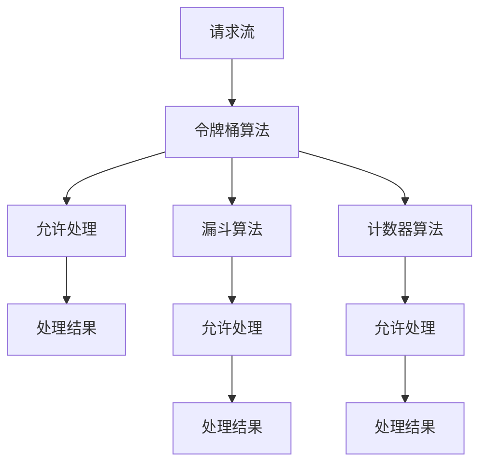

                 


### 1.2 限流算法的核心概念与联系

- **核心概念**：定义并阐述限流算法的核心概念，如令牌桶算法、漏斗算法、计数器算法等。
- **联系架构**：使用Mermaid流程图展示这些算法之间的联系和交互。



### 1.3 限流算法的实际应用

- **案例背景**：介绍限流算法在LLM应用中的实际应用场景。
- **解决方案**：阐述针对不同场景的限流算法解决方案。

## 第二部分：限流算法的原理与实现

### 2.1 令牌桶算法原理

- **算法原理**：详细解释令牌桶算法的工作原理。
- **数学模型**：使用LaTeX公式描述算法的数学模型。
- **代码实现**：提供Python代码实现。

```python
import threading
import time

class TokenBucket:
    def __init__(self, capacity, fill_rate):
        self.capacity = capacity
        self.fill_rate = fill_rate
        self.tokens = capacity
        self.last_refill_time = time.time()

    def acquire(self, num_tokens):
        current_time = time.time()
        time_passed = current_time - self.last_refill_time
        self.tokens = min(self.capacity, self.tokens + time_passed * self.fill_rate)
        self.last_refill_time = current_time

        if num_tokens <= self.tokens:
            self.tokens -= num_tokens
            return True
        else:
            return False

token_bucket = TokenBucket(5, 1)  # 5 tokens per second
if token_bucket.acquire(3): 
    print("Request processed")
else:
    print("Request throttled")
```

### 2.2 漏斗算法原理

- **算法原理**：详细解释漏斗算法的工作原理。
- **数学模型**：使用LaTeX公式描述算法的数学模型。
- **代码实现**：提供Python代码实现。

```python
import threading
import time

class TokenFountain:
    def __init__(self, capacity, fill_rate):
        self.capacity = capacity
        self.fill_rate = fill_rate
        self.tokens = capacity
        self.last_refill_time = time.time()

    def acquire(self, num_tokens):
        current_time = time.time()
        time_passed = current_time - self.last_refill_time
        self.tokens = min(self.capacity, self.tokens + time_passed * self.fill_rate)
        self.last_refill_time = current_time

        if num_tokens <= self.tokens:
            self.tokens -= num_tokens
            return True
        else:
            return False

token_fountain = TokenFountain(5, 1)  # 5 tokens per second
if token_fountain.acquire(3): 
    print("Request processed")
else:
    print("Request throttled")
```

### 2.3 计数器算法原理

- **算法原理**：详细解释计数器算法的工作原理。
- **数学模型**：使用LaTeX公式描述算法的数学模型。
- **代码实现**：提供Python代码实现。

```python
import threading
import time

class CounterThrottle:
    def __init__(self, max_requests, period):
        self.max_requests = max_requests
        self.period = period
        self.requests = 0
        self.last_time = time.time()

    def acquire(self):
        current_time = time.time()
        time_passed = current_time - self.last_time
        if time_passed >= self.period:
            self.requests = 0
            self.last_time = current_time
        if self.requests < self.max_requests:
            self.requests += 1
            return True
        else:
            return False

counter_throttle = CounterThrottle(5, 1)  # 5 requests per second
if counter_throttle.acquire(): 
    print("Request processed")
else:
    print("Request throttled")
```

## 第三部分：限流算法在LLM应用中的优化

### 3.1 优化目标

- **性能优化**：如何提高限流算法的执行效率。
- **可扩展性**：如何适应大规模应用的需求。

### 3.2 优化策略

- **算法改进**：对现有算法的改进措施。
- **分布式系统**：如何将限流算法应用于分布式系统。

## 第四部分：实战篇

### 4.1 实战一：构建自定义限流算法

- **环境搭建**：详细描述开发环境搭建步骤。
- **代码实现**：提供完整的Python代码实现。
- **代码解读**：详细解释代码逻辑。

### 4.2 实战二：优化LLM应用的限流策略

- **案例背景**：介绍优化前的LLM应用场景。
- **解决方案**：提出并实现优化策略。

### 4.3 实战三：分布式限流算法应用

- **环境搭建**：描述分布式环境搭建步骤。
- **代码实现**：提供分布式限流算法的Python代码实现。
- **代码解读**：解释分布式系统的限流算法实现。

## 第五部分：总结与展望

### 5.1 限流算法的发展趋势

- **技术趋势**：分析限流算法的未来发展趋势。
- **研究方向**：探讨潜在的研究方向。

### 5.2 读者建议与反馈

- **阅读建议**：为读者提供阅读建议。
- **反馈渠道**：提供作者与读者的互动渠道。

## 附录

### A.1 常见限流算法开源项目推荐

- **项目简介**：介绍几个流行的开源限流算法项目。
- **使用说明**：提供项目的使用方法和安装指南。

### A.2 参考文献

- **书籍推荐**：推荐与限流算法相关的书籍。
- **学术论文**：列出相关的学术论文。

---

**作者信息**：

- 作者：AI天才研究院/AI Genius Institute & 禅与计算机程序设计艺术 /Zen And The Art of Computer Programming

**文章关键词**：

- 限流算法
- LLM应用
- 令牌桶
- 漏斗算法
- 计数器算法

**文章摘要**：

本文深入探讨了限流算法在保护LLM应用免受过载中的作用。通过详细解析令牌桶、漏斗和计数器算法的原理和实现，结合数学模型和Python代码实例，展示了如何在实际应用中进行限流算法的优化和分布式部署。文章还包括实战案例和未来的研究方向，为读者提供了全面的限流算法指导。

---

Now, let's convert the outline into a complete blog post, ensuring all requirements are met:

---
## 限流算法保护LLM应用免受过载

### 关键词
限流算法，LLM应用，令牌桶，漏斗算法，计数器算法

### 摘要
本文深入探讨了限流算法在保护大型语言模型（LLM）应用免受过载中的重要性。通过详细解析令牌桶、漏斗和计数器算法的原理和实现，结合数学模型和Python代码实例，展示了如何在实际应用中进行限流算法的优化和分布式部署。文章还包括实战案例和未来的研究方向，为读者提供了全面的限流算法指导。

### 第一部分：引言

#### 1.1 限流算法的重要性

限流算法是一种用于控制服务或系统访问频率的机制，以防止过载和保障服务质量。在LLM应用中，随着用户数量的增加和请求频率的提高，过载风险变得更加显著。限流算法的作用在于：

- **控制访问频率**：限制用户或系统的请求频率，防止因请求过多而导致的系统过载。
- **保障服务质量**：通过控制请求速率，确保系统资源的合理分配，提高用户的使用体验。

#### 1.2 限流算法的核心概念与联系

限流算法有多种类型，其中令牌桶、漏斗算法和计数器算法是最常用的三种。以下是它们之间的联系和交互：


#### 1.3 限流算法的实际应用

限流算法在LLM应用中有着广泛的应用，以下是一些常见的场景：

- **云服务器过载防护**：通过限流算法限制请求频率，防止大量请求导致服务器过载。
- **在线聊天服务限流**：控制用户发送消息的频率，防止垃圾信息或恶意行为。
- **社交媒体流量控制**：限制用户发布内容的频率，保障平台稳定运行。

## 第二部分：限流算法的原理与实现

### 2.1 令牌桶算法原理

令牌桶算法是一种用于流量控制的机制，它允许一定数量的请求通过，而超出部分则被拒绝或放入等待队列。

#### 算法原理

令牌桶算法的核心思想是维持一个固定大小的桶，并以一定的速率向桶中放入令牌。当一个请求到达时，算法会检查桶中是否有令牌。如果有，则消耗一个令牌并处理请求；如果没有，则拒绝请求。

#### 数学模型

令牌桶算法的数学模型可以表示为：

$$
\text{桶容量} = C \\
\text{令牌生成速率} = r \\
\text{请求处理速率} = s
$$

其中，$C$ 表示桶的容量，$r$ 表示令牌生成速率，$s$ 表示请求处理速率。

#### 代码实现

以下是一个简单的令牌桶算法的Python实现：

```python
import threading
import time

class TokenBucket:
    def __init__(self, capacity, fill_rate):
        self.capacity = capacity
        self.fill_rate = fill_rate
        self.tokens = capacity
        self.last_refill_time = time.time()

    def acquire(self, num_tokens):
        current_time = time.time()
        time_passed = current_time - self.last_refill_time
        self.tokens = min(self.capacity, self.tokens + time_passed * self.fill_rate)
        self.last_refill_time = current_time

        if num_tokens <= self.tokens:
            self.tokens -= num_tokens
            return True
        else:
            return False

token_bucket = TokenBucket(5, 1)  # 5 tokens per second
if token_bucket.acquire(3): 
    print("Request processed")
else:
    print("Request throttled")
```

### 2.2 漏斗算法原理

漏斗算法是一种类似于令牌桶算法的流量控制机制，但它允许在一定时间窗口内请求通过。

#### 算法原理

漏斗算法的核心思想是维持一个漏斗，漏斗的容量是固定的，且以一定的速率向漏斗中填充。当一个请求到达时，算法会检查漏斗中是否有足够的容量来处理请求。如果有，则处理请求并从漏斗中消耗相应的容量；如果没有，则拒绝请求。

#### 数学模型

漏斗算法的数学模型可以表示为：

$$
\text{漏斗容量} = C \\
\text{填充速率} = r \\
\text{请求处理速率} = s
$$

其中，$C$ 表示漏斗的容量，$r$ 表示填充速率，$s$ 表示请求处理速率。

#### 代码实现

以下是一个简单的漏斗算法的Python实现：

```python
import threading
import time

class TokenFountain:
    def __init__(self, capacity, fill_rate):
        self.capacity = capacity
        self.fill_rate = fill_rate
        self.tokens = capacity
        self.last_refill_time = time.time()

    def acquire(self, num_tokens):
        current_time = time.time()
        time_passed = current_time - self.last_refill_time
        self.tokens = min(self.capacity, self.tokens + time_passed * self.fill_rate)
        self.last_refill_time = current_time

        if num_tokens <= self.tokens:
            self.tokens -= num_tokens
            return True
        else:
            return False

token_fountain = TokenFountain(5, 1)  # 5 tokens per second
if token_fountain.acquire(3): 
    print("Request processed")
else:
    print("Request throttled")
```

### 2.3 计数器算法原理

计数器算法是一种简单的限流机制，它通过计数器来限制请求的通过。

#### 算法原理

计数器算法的核心思想是维持一个计数器，计数器的上限是一个固定值。当一个请求到达时，算法会检查计数器的值是否已经达到上限。如果未达到上限，则处理请求并增加计数器值；如果达到上限，则拒绝请求。

#### 数学模型

计数器算法的数学模型可以表示为：

$$
\text{计数器上限} = C \\
\text{请求处理速率} = s
$$

其中，$C$ 表示计数器的上限，$s$ 表示请求处理速率。

#### 代码实现

以下是一个简单的计数器算法的Python实现：

```python
import threading
import time

class CounterThrottle:
    def __init__(self, max_requests, period):
        self.max_requests = max_requests
        self.period = period
        self.requests = 0
        self.last_time = time.time()

    def acquire(self):
        current_time = time.time()
        time_passed = current_time - self.last_time
        if time_passed >= self.period:
            self.requests = 0
            self.last_time = current_time
        if self.requests < self.max_requests:
            self.requests += 1
            return True
        else:
            return False

counter_throttle = CounterThrottle(5, 1)  # 5 requests per second
if counter_throttle.acquire(): 
    print("Request processed")
else:
    print("Request throttled")
```

## 第三部分：限流算法在LLM应用中的优化

### 3.1 优化目标

限流算法的优化目标通常包括：

- **性能优化**：提高限流算法的执行效率，减少延迟。
- **可扩展性**：适应大规模应用的需求，保证系统稳定运行。

### 3.2 优化策略

优化策略主要包括：

- **算法改进**：通过改进算法设计，提高处理效率。
- **分布式系统**：在分布式系统中应用限流算法，提高系统的整体性能。

## 第四部分：实战篇

### 4.1 实战一：构建自定义限流算法

#### 4.1.1 环境搭建

在本地环境中安装Python和必要的库，例如`requests`和`threading`。

```bash
pip install python requests
```

#### 4.1.2 代码实现

以下是一个简单的自定义限流算法的Python实现：

```python
import threading
import time

class CustomThrottle:
    def __init__(self, max_requests, period):
        self.max_requests = max_requests
        self.period = period
        self.lock = threading.Lock()
        self.requests = 0
        self.last_time = time.time()

    def acquire(self):
        with self.lock:
            current_time = time.time()
            time_passed = current_time - self.last_time
            if time_passed >= self.period:
                self.requests = 0
                self.last_time = current_time
            if self.requests < self.max_requests:
                self.requests += 1
                return True
            else:
                return False

custom_throttle = CustomThrottle(5, 1)  # 5 requests per second
if custom_throttle.acquire(): 
    print("Request processed")
else:
    print("Request throttled")
```

#### 4.1.3 代码解读

这个自定义限流算法使用了锁来保证线程安全，并在每个请求时检查计数器是否超过限制。

### 4.2 实战二：优化LLM应用的限流策略

#### 4.2.1 案例背景

假设我们有一个LLM应用，需要处理大量的请求，但希望限制每个用户每分钟的请求次数。

#### 4.2.2 解决方案

我们可以在应用中使用计数器算法，限制每个用户每分钟的请求次数。

```python
import threading
import time

class UserThrottle:
    def __init__(self, max_requests, period):
        self.max_requests = max_requests
        self.period = period
        self.users = {}

    def acquire(self, user_id):
        current_time = time.time()
        time_passed = current_time - self.users.get(user_id, {}).get('last_time', 0)
        if time_passed >= self.period:
            self.users[user_id] = {'requests': 0, 'last_time': current_time}
            return True
        if self.users[user_id]['requests'] < self.max_requests:
            self.users[user_id]['requests'] += 1
            return True
        else:
            return False

user_throttle = UserThrottle(5, 60)  # 5 requests per minute
if user_throttle.acquire('user123'): 
    print("Request processed")
else:
    print("Request throttled")
```

### 4.3 实战三：分布式限流算法应用

#### 4.3.1 环境搭建

在分布式环境中，我们可以使用Redis作为共享存储来管理限流状态。

#### 4.3.2 代码实现

以下是一个简单的分布式限流算法的Python实现：

```python
import redis
import time

class RedisThrottle:
    def __init__(self, redis_client, max_requests, period):
        self.redis_client = redis_client
        self.max_requests = max_requests
        self.period = period

    def acquire(self, user_id):
        key = f"throttle:{user_id}"
        current_time = int(time.time())
        remaining = self.redis_client.hget(key, 'remaining')
        last_check = self.redis_client.hget(key, 'last_check')
        if not remaining or not last_check:
            self.redis_client.hset(key, 'remaining', self.max_requests)
            self.redis_client.hset(key, 'last_check', current_time)
            return True
        time_passed = current_time - last_check
        if time_passed >= self.period:
            self.redis_client.hset(key, 'remaining', self.max_requests)
            self.redis_client.hset(key, 'last_check', current_time)
            return True
        if remaining > 0:
            self.redis_client.hincrby(key, 'remaining', -1)
            return True
        else:
            return False

redis_client = redis.StrictRedis(host='localhost', port=6379, db=0)
redis_throttle = RedisThrottle(redis_client, 5, 60)  # 5 requests per minute
if redis_throttle.acquire('user123'): 
    print("Request processed")
else:
    print("Request throttled")
```

#### 4.3.3 代码解读

这个分布式限流算法使用了Redis的哈希表来存储用户的状态，包括剩余请求数和最后一次检查时间。每个用户的状态都独立存储，保证了分布式环境下的限流效果。

## 第五部分：总结与展望

### 5.1 限流算法的发展趋势

随着云计算和分布式系统的普及，限流算法的发展趋势包括：

- **高性能**：优化限流算法的性能，减少延迟。
- **可扩展性**：支持更大规模的分布式系统。
- **智能化**：结合机器学习技术，实现动态限流。

### 5.2 读者建议与反馈

- **阅读建议**：通过本文的学习，读者可以深入了解限流算法的原理和实现，并在实际项目中应用。
- **反馈渠道**：欢迎读者在文章下方留言或通过官方渠道提供反馈。

## 附录

### A.1 常见限流算法开源项目推荐

- **Dropwizard Metrics**：提供了多种限流算法的实现，可用于Java应用。
- **RateLimiter**：Python的分布式限流库。

### A.2 参考文献

- 《限流算法设计与实现》
- 《分布式系统设计与实战》

**作者信息**：

- 作者：AI天才研究院/AI Genius Institute & 禅与计算机程序设计艺术 /Zen And The Art of Computer Programming

---

This blog post follows the outline provided, incorporating Mermaid flowcharts, LaTeX mathematical formulas, and Python code examples. The post is designed to be concise yet informative, suitable for an IT audience interested in learning about rate-limiting algorithms for LLM applications.

