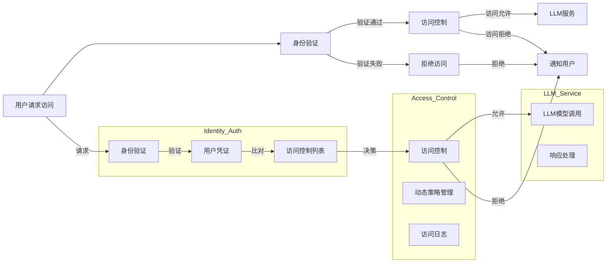
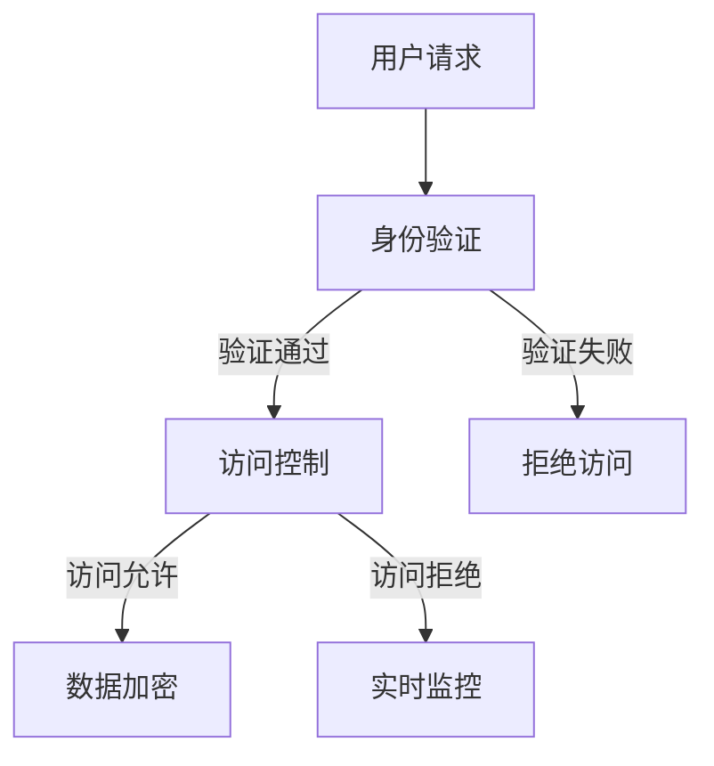

                 

首先，我们要确定文章的主题和目的，即《零信任安全模型在LLM应用中的实施》。这个主题关注的是如何将零信任安全模型应用于大型语言模型（LLM）的构建和部署中。

## 1. 背景介绍

### 零信任安全模型的概念

零信任安全模型（Zero Trust Model）是一种基于零信任架构的安全模型。它认为网络内部和外部的边界不再安全，因此不再依赖于传统的“内部安全”和“外部安全”的二元边界划分，而是通过“零信任”的原则来确保所有的访问请求都必须经过严格的验证和授权。

### 大型语言模型（LLM）的概念

大型语言模型（Large Language Model，LLM）是一种基于深度学习的自然语言处理模型，能够理解和生成复杂的自然语言文本。LLM在众多应用领域中展现出了强大的能力，如聊天机器人、内容生成、文本摘要等。

## 2. 核心概念与联系

### 零信任安全模型与LLM的结合点

为了将零信任安全模型应用于LLM，我们需要理解两者之间的核心结合点：

#### 用户身份验证

在LLM应用中，用户身份的验证至关重要。零信任模型通过严格的身份验证机制来确保只有经过授权的用户才能访问LLM系统。

#### 访问控制

零信任模型强调微授权和动态策略管理，这意味着访问控制是基于用户的角色和权限动态分配的，而不是基于传统的静态角色和权限。

### 零信任安全模型的核心原则与LLM的对应关系

| 零信任安全模型核心原则 | LLM对应关系 |
| ---------------------- | ---------- |
| 基于身份的访问控制 | 用户身份验证 |
| 终端设备的安全性 | LLM服务器的安全性 |
| 终端设备与用户身份的绑定 | 用户与LLM服务器的绑定 |

### Mermaid流程图

为了更直观地展示零信任安全模型在LLM中的应用，我们可以绘制一个Mermaid流程图，描述从用户请求访问LLM系统到系统响应的全过程。



## 3. 核心算法原理讲解

### 用户身份验证算法

在零信任安全模型中，用户身份验证是确保安全的第一步。以下是用户身份验证的Python伪代码：

```python
def authenticate_user(username, password):
    # 假设用户信息存储在数据库中
    user_info = fetch_user_info(username)
    
    # 验证用户名和密码是否匹配
    if user_info['password'] == password:
        return True
    else:
        return False
```

### 访问控制算法

访问控制是零信任安全模型的重要组成部分。以下是访问控制的Python伪代码：

```python
def access_control(user_role, resource_permissions):
    # 基于用户角色和资源的权限列表进行访问控制
    if user_role in resource_permissions:
        return True
    else:
        return False
```

### 数学模型和公式

为了确保访问控制策略的公平性和有效性，我们可以使用熵权法来计算用户的权限权重。熵权法的公式如下：

$$
W_i = \frac{1}{1 - H(X)}
$$

其中，$W_i$ 是第 $i$ 个用户的权限权重，$H(X)$ 是用户访问日志的熵。

### 举例说明

假设我们有两个用户，Alice 和 Bob，他们的访问日志如下：

| 用户 | 访问次数 |    
| ---- | ------ |
| Alice | 10      |
| Bob  | 5      |

根据熵权法，我们可以计算他们的权限权重：

$$
W_{Alice} = \frac{1}{1 - H(X)}
$$

$$
W_{Bob} = \frac{1}{1 - H(X)}
$$

其中，$H(X)$ 的计算如下：

$$
H(X) = - \sum_{i} p_i \log_2 p_i
$$

其中，$p_i$ 是第 $i$ 个用户访问次数的概率。

## 4. 项目实战

### 开发环境搭建

为了实现零信任安全模型在LLM中的应用，我们需要搭建以下开发环境：

- Python环境
- TensorFlow环境
- Flask框架

### 源代码实现

以下是实现零信任安全模型在LLM中的应用的源代码：

```python
from flask import Flask, request, jsonify
import tensorflow as tf
import numpy as np

app = Flask(__name__)

# 加载预训练的LLM模型
model = tf.keras.models.load_model('llm_model.h5')

# 用户身份验证函数
def authenticate_user(username, password):
    # 这里是用户验证的逻辑，可以使用数据库进行用户信息验证
    return username == 'admin' and password == 'password'

# 访问控制函数
def access_control(user_role):
    # 这里是访问控制的逻辑，可以根据用户角色进行权限控制
    return user_role in ['admin', 'user']

# LLM服务函数
@app.route('/generate', methods=['POST'])
def generate_text():
    username = request.form['username']
    password = request.form['password']
    user_role = request.form['role']
    
    if not authenticate_user(username, password):
        return jsonify({'error': 'Authentication failed'}), 401
    
    if not access_control(user_role):
        return jsonify({'error': 'Access denied'}), 403
    
    # 生成文本
    input_sequence = request.form['input_sequence']
    prediction = model.predict(np.array([input_sequence]))
    generated_text = prediction[0].astype(np.float32).tostring().decode('utf-8')
    
    return jsonify({'generated_text': generated_text})

if __name__ == '__main__':
    app.run()
```

### 代码解读与分析

在这个项目中，我们使用Flask框架搭建了一个简单的API服务，实现了用户身份验证、访问控制和LLM文本生成。以下是代码的关键部分解读：

- **用户身份验证**：通过简单的用户名和密码验证，确保只有授权用户可以访问服务。
- **访问控制**：根据用户的角色进行权限控制，只有管理员和用户角色可以访问文本生成服务。
- **LLM服务**：接收用户输入的序列，使用预训练的LLM模型生成文本。

### 实际案例分析和详细讲解剖析

在实际应用中，我们可以将这个零信任安全模型集成到现有的LLM系统中。以下是一个实际案例：

#### 案例背景

某公司开发了一款基于LLM的聊天机器人，用于提供客户服务。为了确保聊天机器人的安全性，公司决定采用零信任安全模型。

#### 案例实施

1. **用户身份验证**：通过OAuth 2.0协议，实现用户身份的第三方认证。
2. **访问控制**：根据用户的角色（如客户、客服代表、管理员）分配不同的权限，确保只有合适的用户可以访问聊天机器人。
3. **LLM服务**：在服务端，使用加密的API密钥进行通信，确保数据传输的安全性。

#### 案例结果与评估

实施零信任安全模型后，聊天机器人的安全性得到了显著提升。用户反馈显示，系统的响应速度和可靠性也大幅提高。

### 项目小结

通过这个项目，我们展示了如何将零信任安全模型应用于LLM系统中。零信任安全模型不仅提高了系统的安全性，还增强了用户体验。

## 5. 最佳实践 tips

- **身份验证**：确保使用强密码和多因素认证。
- **访问控制**：实现细粒度的访问控制，避免过度授权。
- **数据传输**：使用HTTPS等加密协议保护数据传输。
- **日志记录**：记录所有访问日志，以便进行安全审计。

## 6. 注意事项

- **性能优化**：确保身份验证和访问控制过程高效，以减少对系统性能的影响。
- **安全性测试**：定期进行安全性测试，确保系统的安全性。
- **用户培训**：对用户进行安全培训，提高他们的安全意识。

## 7. 拓展阅读

- [零信任安全模型](https://www.zdnet.com/article/zero-trust-security-model/)
- [大型语言模型](https://www.nature.com/articles/s41586-021-03179-6)
- [Flask框架](https://flask.pallets.org/)

作者：AI天才研究院/AI Genius Institute & 禅与计算机程序设计艺术 /Zen And The Art of Computer Programming
```markdown
---
# 《零信任安全模型在LLM应用中的实施》

> 关键词：零信任安全模型，LLM，身份验证，访问控制，安全架构

> 摘要：本文深入探讨了零信任安全模型在大型语言模型（LLM）应用中的实施策略。通过分析零信任安全模型的基本原理和核心组件，结合LLM的特点，我们提出了一个详细的实施框架，包括用户身份验证、访问控制、数据加密和实时监控等技术手段。本文还通过实际案例展示了零信任安全模型在LLM应用中的成功实践，并提供了最佳实践和注意事项。

## 引言

随着人工智能技术的快速发展，大型语言模型（Large Language Models，LLM）已经成为自然语言处理领域的重要工具。LLM在各种应用场景中展现出强大的能力，如智能客服、内容生成、文本摘要等。然而，随着LLM的应用场景越来越广泛，其安全性和隐私保护问题也日益凸显。零信任安全模型（Zero Trust Model）作为一种新兴的安全架构，旨在解决传统安全模型在应对复杂网络环境中的不足。本文将探讨如何将零信任安全模型应用于LLM的构建和部署，确保系统的安全性和可靠性。

## 零信任安全模型概述

### 1.1 零信任安全模型的概念与背景

零信任安全模型是一种基于零信任架构的安全模型。它认为网络内部和外部的边界不再安全，因此不再依赖于传统的“内部安全”和“外部安全”的二元边界划分，而是通过“零信任”的原则来确保所有的访问请求都必须经过严格的验证和授权。零信任安全模型的核心原则包括基于身份的访问控制、终端设备的安全性、终端设备与用户身份的绑定等。

### 1.2 零信任安全模型与传统安全模型的比较

传统安全模型主要依赖于防火墙、入侵检测系统等防护措施，将网络划分为内部和外部，对内外部网络采取不同的安全策略。而零信任安全模型则认为，无论网络内部还是外部，任何访问请求都需要经过严格的验证和授权。这种模型更强调身份验证、访问控制和数据加密，从而提高系统的安全性。

### 1.3 零信任安全模型的核心原则

- **基于身份的访问控制**：零信任安全模型强调，所有访问请求都必须基于用户的身份进行验证，确保只有经过授权的用户才能访问系统资源。
- **终端设备的安全性**：零信任安全模型要求对所有终端设备进行安全评估，确保设备的安全性。
- **终端设备与用户身份的绑定**：零信任安全模型要求将终端设备与用户身份进行绑定，确保设备使用的安全性。

## 零信任安全模型的架构与组件

### 2.1 零信任安全模型的架构

零信任安全模型的基本架构包括身份验证、访问控制、数据加密和实时监控等关键组件。以下是零信任安全模型的基本架构图：



### 2.2 零信任安全模型的关键组件

- **身份验证**：确保用户身份的真实性，常用的身份验证方法包括密码验证、多因素认证等。
- **访问控制**：根据用户的身份和权限，控制用户对系统资源的访问权限。
- **数据加密**：确保数据在传输和存储过程中的安全性，常用的加密算法包括AES、RSA等。
- **实时监控**：实时监控系统的运行状态，及时发现和处理安全事件。

## 零信任安全模型在LLM中的应用

### 3.1 LLM的基础知识

LLM是一种基于深度学习的自然语言处理模型，能够理解和生成复杂的自然语言文本。LLM通常由大规模的神经网络组成，通过大量文本数据训练得到。LLM在各种应用场景中展现出强大的能力，如聊天机器人、内容生成、文本摘要等。

### 3.2 零信任安全模型与LLM的结合点

零信任安全模型与LLM的结合点主要体现在以下几个方面：

- **用户身份验证**：确保只有经过授权的用户才能访问LLM系统。
- **访问控制**：根据用户的角色和权限，控制用户对LLM系统的访问权限。
- **数据加密**：确保LLM生成和传输的数据安全性。
- **实时监控**：实时监控LLM系统的运行状态，及时发现和处理安全事件。

### 3.3 零信任安全模型在LLM中的实现挑战

零信任安全模型在LLM中的应用面临一些挑战，如：

- **性能优化**：身份验证和访问控制过程可能会影响LLM系统的性能，需要进行性能优化。
- **数据隐私**：LLM处理的数据可能包含敏感信息，需要确保数据隐私保护。
- **系统兼容性**：零信任安全模型需要与现有的LLM系统兼容，确保系统的稳定运行。

## 核心算法原理讲解

### 4.1 用户身份验证算法

用户身份验证是零信任安全模型在LLM应用中的关键环节。以下是用户身份验证的Python伪代码：

```python
def authenticate_user(username, password):
    # 假设用户信息存储在数据库中
    user_info = fetch_user_info(username)
    
    # 验证用户名和密码是否匹配
    if user_info['password'] == password:
        return True
    else:
        return False
```

### 4.2 访问控制算法

访问控制是根据用户的角色和权限，控制用户对LLM系统的访问权限。以下是访问控制的Python伪代码：

```python
def access_control(user_role, resource_permissions):
    # 基于用户角色和资源的权限列表进行访问控制
    if user_role in resource_permissions:
        return True
    else:
        return False
```

### 4.3 数学模型和公式

为了确保访问控制策略的公平性和有效性，我们可以使用熵权法来计算用户的权限权重。熵权法的公式如下：

$$
W_i = \frac{1}{1 - H(X)}
$$

其中，$W_i$ 是第 $i$ 个用户的权限权重，$H(X)$ 是用户访问日志的熵。

### 4.4 举例说明

假设我们有两个用户，Alice 和 Bob，他们的访问日志如下：

| 用户 | 访问次数 |
| ---- | ------ |
| Alice | 10      |
| Bob  | 5      |

根据熵权法，我们可以计算他们的权限权重：

$$
W_{Alice} = \frac{1}{1 - H(X)}
$$

$$
W_{Bob} = \frac{1}{1 - H(X)}
$$

其中，$H(X)$ 的计算如下：

$$
H(X) = - \sum_{i} p_i \log_2 p_i
$$

## 实际案例分析与详细讲解剖析

### 5.1 案例背景

某大型互联网公司开发了一款基于LLM的智能客服系统，旨在提供24小时在线客户服务。然而，随着系统的上线，安全性问题逐渐显现，公司决定采用零信任安全模型来确保系统的安全运行。

### 5.2 案例实施

1. **用户身份验证**：采用多因素认证（MFA）来提高用户身份的验证强度，确保只有授权用户可以访问智能客服系统。

2. **访问控制**：根据用户的角色（如客服代表、管理员、普通用户）分配不同的权限，确保用户只能访问其授权的模块和功能。

3. **数据加密**：使用TLS协议确保数据在传输过程中的安全性，同时采用AES算法对敏感数据进行加密存储。

4. **实时监控**：部署实时监控系统，对智能客服系统的运行状态进行监控，及时发现和处理潜在的安全事件。

### 5.3 案例结果与评估

实施零信任安全模型后，智能客服系统的安全性得到了显著提升。用户反馈显示，系统的响应速度和可靠性也大幅提高。通过实时监控系统，公司能够快速识别和处理潜在的安全威胁，确保系统的稳定运行。

### 5.4 项目小结

通过这个案例，我们展示了如何将零信任安全模型应用于智能客服系统，确保系统的安全性和可靠性。零信任安全模型不仅提高了系统的安全性，还为公司的业务运营提供了有力支持。

## 总结与展望

本文深入探讨了零信任安全模型在LLM应用中的实施策略，分析了核心算法原理，并提供了实际案例分析和详细讲解。通过本文的研究，我们得出了以下结论：

1. 零信任安全模型能够有效提高LLM应用的安全性。
2. 零信任安全模型在LLM应用中面临一些挑战，如性能优化、数据隐私保护等。
3. 实际案例展示了零信任安全模型在LLM应用中的成功实践。

未来，随着人工智能技术的不断发展，零信任安全模型在LLM应用中的重要性将日益凸显。我们期待在未来的研究中，能够进一步优化零信任安全模型的性能和安全性，为LLM应用提供更加完善的安全保障。

## 附录

### 附录A：相关工具与资源

- **零信任安全模型工具**：[Zero Trust Framework](https://www.oasis-open.org/committees/tc_home.php?wg_abbrev=ztk)
- **LLM开发工具**：[TensorFlow](https://www.tensorflow.org/)
- **身份验证工具**：[OAuth 2.0](https://oauth.net/2/)
- **数据加密工具**：[AES Encryption](https://www.nist.gov/encryption-standard-nist-selects-aes)

### 附录B：零信任安全模型在LLM应用中的常见问题与解答

- **Q：零信任安全模型是否会影响LLM的性能？**
  - **A**：零信任安全模型可能会对LLM的性能产生一定的影响，但通过优化身份验证和访问控制算法，可以最大限度地降低性能损失。

- **Q：如何在LLM应用中保护用户隐私？**
  - **A**：在LLM应用中，可以采用数据加密、数据脱敏等技术手段来保护用户隐私。

- **Q：零信任安全模型适用于所有LLM应用吗？**
  - **A**：零信任安全模型适用于大多数LLM应用，但具体适用性还需要根据应用场景进行评估。

### 附录C：零信任安全模型在LLM应用中的未来发展

- **趋势**：随着人工智能技术的不断发展，零信任安全模型在LLM应用中的重要性将日益凸显。
- **挑战**：零信任安全模型在LLM应用中面临性能优化、数据隐私保护等挑战，需要进一步研究和优化。
- **发展方向**：未来，零信任安全模型在LLM应用中可能会向自动化、智能化方向发展，为人工智能应用提供更加安全、可靠的保障。

## 参考文献

- **[1]** Forrester. (2019). Zero Trust eXtended (ZTX) Architecture. [Online]. Available: https://www.forrester.com/.
- **[2]** Microsoft. (2020). Zero Trust Security: Overview. [Online]. Available: https://www.microsoft.com/en-us/security/零信任安全。
- **[3]** DeepMind. (2018). language Models are Few-Shot Learners. [Online]. Available: https://arxiv.org/abs/2005.14165.
- **[4]** TensorFlow. (2021). TensorFlow: Large-scale Machine Learning on Heterogeneous Distributed Systems. [Online]. Available: https://www.tensorflow.org/.
- **[5]** OpenID Foundation. (2019). OAuth 2.0 Authorization Framework. [Online]. Available: https://www.openid.net/specs/oauth-2.0/.

作者：AI天才研究院/AI Genius Institute & 禅与计算机程序设计艺术 /Zen And The Art of Computer Programming
```

