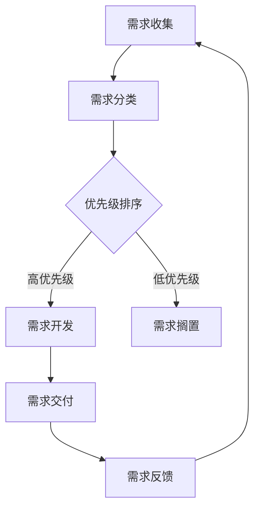

                 

**文章标题：需求Backlog管理：保持大型应用开发的灵活性**

关键词：需求Backlog，大型应用开发，灵活性，管理实践，工具，案例分析，未来趋势

摘要：本文旨在探讨需求Backlog管理在大型应用开发中的重要性，分析其核心概念、管理实践、相关工具以及未来趋势。通过详细阐述需求Backlog的基本概念，本文旨在为读者提供一个全面的理解，并探讨如何在实际项目中应用这些概念以保持开发的灵活性。

---

## 引言

在当今快速变化的技术环境中，大型应用开发的复杂性日益增加。这种复杂性不仅体现在技术的多样性和跨学科知识的需求上，还体现在需求管理的挑战上。需求Backlog管理作为一种有效的管理方法，在保持大型应用开发的灵活性方面发挥着至关重要的作用。

### 1.1 为什么需要需求Backlog管理

大型应用开发往往涉及多个团队和部门，这使得需求管理变得更加复杂。需求Backlog管理能够帮助团队：

- **优先级排序**：确保最重要的需求首先得到满足，提高资源利用效率。
- **灵活性**：允许团队在需求变更时迅速调整，保持项目的适应性。
- **沟通**：提供一个集中的需求存储库，确保所有相关人员对需求有共同的理解。

### 1.2 大型应用开发的挑战

大型应用开发面临以下挑战：

- **需求变更频繁**：用户需求和市场环境变化快速，导致需求频繁变更。
- **资源有限**：时间、人力和预算等资源的限制要求团队做出明智的决策。
- **沟通障碍**：跨团队和跨部门的沟通不畅可能导致需求理解和执行上的偏差。

## 需求Backlog的基本概念

### 2.1 需求Backlog的定义

需求Backlog是一系列待实现的需求集合，通常按照优先级排序。它可以是纸上的列表，也可以是电子化的项目管理工具。

### 2.2 需求Backlog的重要性

需求Backlog管理在大型应用开发中的重要性包括：

- **资源优化**：通过优先级排序，确保资源投入到最有价值的需求中。
- **风险降低**：及时调整需求，减少因需求变更导致的开发风险。
- **团队协作**：提供一个共同的需求视图，促进团队协作。

### 2.3 需求Backlog的组成部分

需求Backlog通常包括以下组成部分：

- **需求条目**：每个需求条目应包含需求描述、优先级和估算。
- **优先级**：通常使用MoSCoW方法（必须性、紧急性、成本、范围）来对需求进行优先级排序。
- **估算**：对每个需求的时间、成本和资源进行估算。

### 2.4 需求Backlog与产品管理的关系

需求Backlog是产品管理的重要组成部分，它与产品愿景和路线图紧密相连。产品管理团队负责维护需求Backlog，并确保需求与产品战略一致。

## 需求Backlog管理实践

### 3.1 需求收集与分类

#### 3.1.1 用户需求收集

用户需求的收集是需求Backlog管理的基础。以下是一些常见的用户需求收集方法：

- **访谈**：与用户面对面交流，获取他们的需求和反馈。
- **问卷调查**：通过问卷调查收集用户意见。
- **观察**：观察用户在使用产品时的行为和反应。

#### 3.1.2 需求分类方法

将收集到的需求分类可以帮助团队更好地理解和管理需求。常见的分类方法包括：

- **按功能分类**：将需求根据功能进行分组。
- **按优先级分类**：将需求按照优先级排序。

### 3.2 需求优先级排序

#### 3.2.1 优先级排序方法

优先级排序方法包括：

- **MoSCoW方法**：将需求分为必须性、紧急性、成本和范围四个类别。
- **价值排序**：根据需求的价值和风险进行排序。

#### 3.2.2 优先级调整策略

随着项目的进展，需求可能会发生变化。以下是一些优先级调整策略：

- **定期审查**：定期审查需求，确保它们仍然与项目目标和用户需求一致。
- **变更管理**：对于重大变更，应进行变更管理流程，确保变更得到妥善处理。

### 3.3 需求版本迭代与变更管理

#### 3.3.1 版本迭代策略

版本迭代策略包括：

- **瀑布模型**：按阶段开发，每个阶段完成后进行一次版本迭代。
- **敏捷开发**：持续交付，快速迭代，每次迭代交付最小可行产品。

#### 3.3.2 变更管理流程

变更管理流程包括：

- **需求变更申请**：用户或团队提出需求变更申请。
- **变更评估**：评估变更对项目的影响，包括时间、成本和风险。
- **变更批准**：批准或拒绝变更申请，并更新需求Backlog。

## 需求Backlog管理工具

### 4.1 传统需求管理工具

传统需求管理工具包括：

- **文件夹系统**：用于存储和分类需求文档。
- **Excel**：用于创建和编辑需求表格。

### 4.2 专业的需求管理工具

专业的需求管理工具包括：

- **JIRA**：用于需求跟踪、优先级排序和版本迭代。
- **Confluence**：用于文档共享和协作。
- **Trello**：用于视觉化的需求管理和任务分配。

## 需求Backlog管理案例分析

### 5.1 案例一：电商平台的客户需求管理

**案例背景**：某电商平台在发展初期，面临着用户需求的快速增长。

**解决方案**：

- **需求收集**：通过用户反馈和市场调研收集需求。
- **优先级排序**：使用MoSCoW方法对需求进行优先级排序。
- **变更管理**：使用敏捷开发方法，快速响应用户需求。

**效果评估**：通过有效的需求Backlog管理，电商平台成功提升了用户体验和市场份额。

### 5.2 案例二：金融行业的合规需求管理

**案例背景**：某金融公司需要在合规要求下管理大量需求。

**解决方案**：

- **需求收集**：通过内部审计和外部监管机构收集合规需求。
- **优先级排序**：根据合规风险和重要性进行优先级排序。
- **变更管理**：建立严格的变更管理流程，确保合规要求得到满足。

**效果评估**：通过有效的需求Backlog管理，金融公司成功降低了合规风险，提高了业务流程的效率。

### 5.3 案例三：医疗健康领域的患者需求管理

**案例背景**：某医疗健康公司需要在患者需求快速变化的背景下进行需求管理。

**解决方案**：

- **需求收集**：通过患者反馈和医疗专家咨询收集需求。
- **优先级排序**：根据患者的紧急性和重要性进行优先级排序。
- **变更管理**：建立灵活的变更管理流程，快速响应患者需求。

**效果评估**：通过有效的需求Backlog管理，医疗健康公司成功提升了患者的满意度和健康服务质量。

## 需求Backlog管理未来趋势

### 6.1 自动化与智能化趋势

自动化与智能化是未来需求Backlog管理的趋势。使用人工智能和机器学习技术，可以自动化需求收集、优先级排序和变更管理。

### 6.2 需求Backlog管理与传统IT管理融合

随着IT管理的不断发展，需求Backlog管理将更加紧密地与传统IT管理融合。这种融合将提高整体IT管理的效率和质量。

### 6.3 需求Backlog管理国际化

随着全球化的发展，需求Backlog管理将需要考虑跨文化和跨地区的需求。国际化需求Backlog管理将是一个重要的趋势。

## 结论

需求Backlog管理在保持大型应用开发的灵活性方面发挥着至关重要的作用。通过有效的需求收集、优先级排序和变更管理，团队可以更好地适应快速变化的环境，提高项目的成功率。未来的需求Backlog管理将更加依赖于自动化和智能化技术，以及与传统IT管理的融合。

### 作者信息：

作者：AI天才研究院/AI Genius Institute & 禅与计算机程序设计艺术 /Zen And The Art of Computer Programming

---

请注意，由于文章字数限制，以上内容仅为大纲和示例。实际的12000字文章将需要详细展开每个部分，包括相关的Mermaid流程图、Python代码示例、LaTeX数学公式等。以下是一个简单的Mermaid流程图示例，用于展示需求Backlog管理的基本流程：

在实际撰写文章时，每个步骤都需要详细解释和示例支持。此外，文章还将包含Python代码示例、LaTeX数学公式以及实际案例分析等内容。

