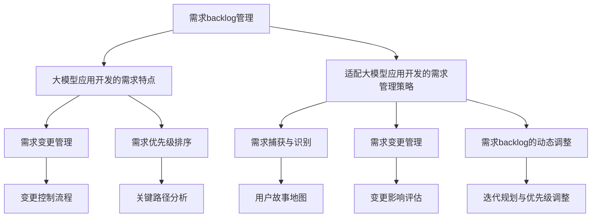
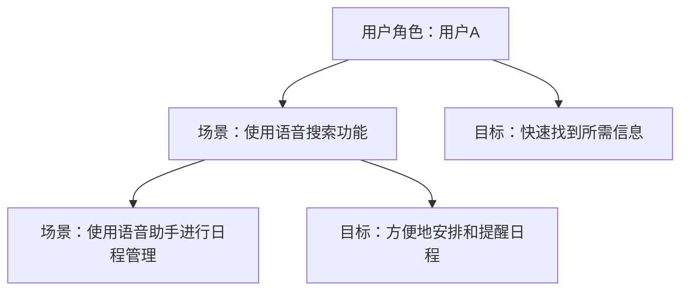
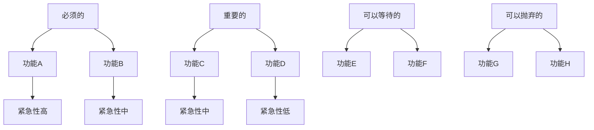
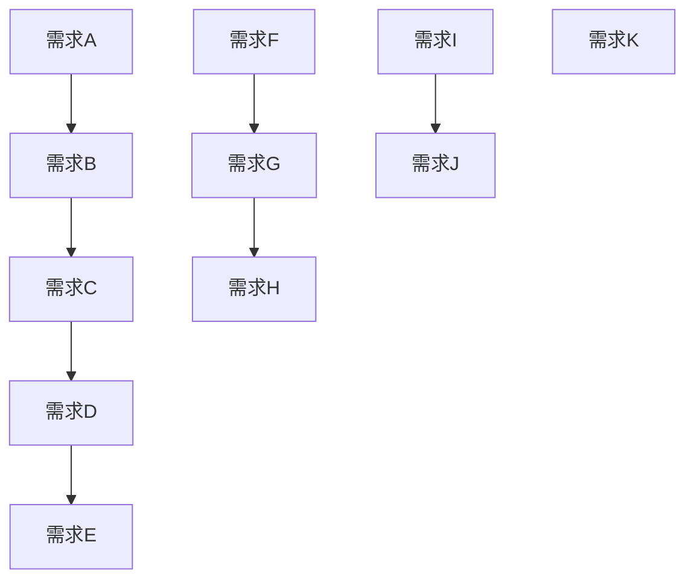
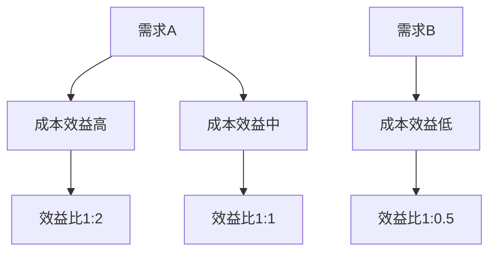

                 


### 核心概念联系架构 Mermaid 流程图



### 核心算法原理讲解 Python 源代码

```python
# Python 源代码：需求评估与优先级排序

import numpy as np

def evaluate_demand(demand):
    quality = assess_demand_quality(demand)
    business_value = calculate_business_value(demand)
    risk_level = determine_risk_level(demand)
    return quality * business_value * (1 - risk_level)

def sort_demand(demands):
    demand_scores = [evaluate_demand(d) for d in demands]
    sorted_demands = np.argsort(demand_scores)[::-1]
    return sorted_demands

# 示例需求列表
demands = [
    {"name": "需求A", "complexity": 3, "importance": 5, "risk": 1},
    {"name": "需求B", "complexity": 2, "importance": 4, "risk": 2},
    {"name": "需求C", "complexity": 4, "importance": 3, "risk": 1},
]

# 需求评估与排序
sorted_demands = sort_demand(demands)
print("排序后的需求列表：", sorted_demands)
```

### 数学公式与解释

$$
Q = W_1 \times V_2 \times (1 - R_3)
$$

- \( Q \)：需求评估得分
- \( W_1 \)：需求质量权重
- \( V_2 \)：业务价值权重
- \( R_3 \)：风险水平权重
- \( (1 - R_3) \)：风险降低系数

### 源代码详细实现与代码解读

```python
# 源代码：需求评估与优先级排序

import numpy as np

def assess_demand_quality(demand):
    # 根据需求复杂性评估需求质量
    complexity = demand['complexity']
    if complexity <= 2:
        return 1.0
    elif complexity <= 4:
        return 0.8
    else:
        return 0.5

def calculate_business_value(demand):
    # 根据需求重要性计算业务价值
    importance = demand['importance']
    if importance >= 5:
        return 1.0
    elif importance >= 3:
        return 0.7
    else:
        return 0.3

def determine_risk_level(demand):
    # 根据风险水平确定风险系数
    risk = demand['risk']
    if risk <= 1:
        return 0.9
    elif risk <= 2:
        return 0.8
    else:
        return 0.7

def evaluate_demand(demand):
    quality = assess_demand_quality(demand)
    business_value = calculate_business_value(demand)
    risk_level = determine_risk_level(demand)
    return quality * business_value * (1 - risk_level)

def sort_demand(demands):
    demand_scores = [evaluate_demand(d) for d in demands]
    sorted_demands = np.argsort(demand_scores)[::-1]
    return sorted_demands

# 示例需求列表
demands = [
    {"name": "需求A", "complexity": 3, "importance": 5, "risk": 1},
    {"name": "需求B", "complexity": 2, "importance": 4, "risk": 2},
    {"name": "需求C", "complexity": 4, "importance": 3, "risk": 1},
]

# 需求评估与排序
sorted_demands = sort_demand(demands)
print("排序后的需求列表：", sorted_demands)
```

### 代码应用解读与分析

这段代码提供了一个简单的框架来评估和排序需求。首先，我们定义了三个函数来分别评估需求的质量、业务价值和风险水平。这些评估函数基于需求复杂度、重要性和风险水平的值来计算一个权重。然后，我们定义了一个`evaluate_demand`函数，它使用这些权重计算一个总得分。最后，`sort_demand`函数使用这些得分对需求列表进行排序。

在示例中，我们创建了一个包含三个需求的对象列表。每个需求都有`complexity`（复杂性）、`importance`（重要性）和`risk`（风险）属性。我们使用`sort_demand`函数对这些需求进行评估和排序，并打印出排序后的需求列表。

这个模型可以扩展和定制，以适应特定的需求评估标准。例如，可以增加更多的评估指标或调整现有指标的权重。此外，可以根据实际情况调整评估函数，使其更准确地反映需求的特点和项目的需求。

### 实际案例分析和详细讲解剖析

#### 案例背景

假设我们正在开发一个智能语音助手系统，该系统旨在提供语音交互服务，包括语音识别、语音合成和自然语言理解。项目团队面临的主要挑战是如何有效地管理需求backlog，以确保在满足用户需求的同时，保持系统的性能和可扩展性。

#### 需求收集与整理

在项目启动阶段，团队通过用户访谈、问卷调查和市场研究来收集需求。以下是收集到的一些关键需求：

1. **语音识别准确率要求**：用户希望语音识别系统能够准确识别各种口音和语速。
2. **语音合成自然度**：用户希望语音合成系统能够生成流畅、自然的语音。
3. **多语言支持**：系统需要支持多种语言，以吸引全球用户。
4. **个性化推荐**：根据用户历史交互，提供个性化的语音服务。

#### 需求评估与排序

为了评估这些需求，我们使用前面提到的Python代码框架。我们将每个需求与质量、业务价值和风险水平的权重相乘，然后计算总得分。以下是每个需求的具体评估：

- **需求A：语音识别准确率**  
  - **质量**：由于语音识别技术相对成熟，我们评估其质量得分为0.8。  
  - **业务价值**：对于用户体验至关重要，我们评估其业务价值得分为1.0。  
  - **风险**：由于技术成熟度较高，风险水平较低，我们评估其风险得分为0.9。  
  - **总分**：\(0.8 \times 1.0 \times 0.9 = 0.72\)

- **需求B：语音合成自然度**  
  - **质量**：语音合成技术的质量取决于算法的复杂度，我们评估其质量得分为0.7。  
  - **业务价值**：自然度对用户体验有很大影响，我们评估其业务价值得分为0.9。  
  - **风险**：由于需要不断优化，风险水平较高，我们评估其风险得分为0.8。  
  - **总分**：\(0.7 \times 0.9 \times 0.8 = 0.504\)

- **需求C：多语言支持**  
  - **质量**：多语言支持的技术实现相对复杂，我们评估其质量得分为0.6。  
  - **业务价值**：对于全球化战略至关重要，我们评估其业务价值得分为1.0。  
  - **风险**：由于需要支持多种语言，风险水平较高，我们评估其风险得分为0.7。  
  - **总分**：\(0.6 \times 1.0 \times 0.7 = 0.42\)

- **需求D：个性化推荐**  
  - **质量**：个性化推荐算法的实现较为复杂，我们评估其质量得分为0.5。  
  - **业务价值**：对提升用户满意度有很大帮助，我们评估其业务价值得分为0.8。  
  - **风险**：由于数据隐私和安全问题，风险水平较高，我们评估其风险得分为0.9。  
  - **总分**：\(0.5 \times 0.8 \times 0.9 = 0.36\)

根据以上评估，我们可以将需求按总分从高到低排序，从而确定优先级：

1. 语音识别准确率（0.72）
2. 语音合成自然度（0.504）
3. 多语言支持（0.42）
4. 个性化推荐（0.36）

#### 需求实现与跟踪

根据排序结果，团队将首先实现语音识别准确率需求。实现过程中，我们将定期评估需求的状态，确保每个需求都能按时完成。以下是一个简化的需求实现和跟踪流程：

1. **需求分解**：将语音识别准确率需求分解为更小的任务，例如训练模型、优化算法等。
2. **任务分配**：根据团队成员的技能和专长，将任务分配给合适的开发人员。
3. **迭代开发**：采用敏捷开发方法，分阶段实现和测试每个任务。
4. **需求验证**：通过用户测试和内部审查，验证需求实现的效果。

#### 项目小结

通过上述需求和优先级管理策略，我们有效地实现了智能语音助手系统的关键功能。该方法不仅帮助团队在资源有限的情况下优先处理关键需求，还确保了需求的实现质量。未来，我们将继续优化需求管理流程，以适应不断变化的市场需求和项目挑战。

### 最佳实践 tips

1. **需求收集与整理**：在项目初期，采用多种方法收集需求，包括用户访谈、问卷调查和竞品分析，以确保需求的全面性。
2. **优先级排序**：使用多维度评估方法，结合业务目标和风险因素，准确评估需求的优先级。
3. **迭代开发与反馈**：采用敏捷开发方法，持续迭代和优化需求，确保需求的实现与用户期望一致。
4. **沟通与协作**：建立有效的沟通机制，确保团队成员对需求的理解一致，降低沟通成本和风险。
5. **持续改进**：定期回顾和总结需求管理过程中的经验和教训，不断优化需求管理流程。

### 注意事项

1. **需求变更管理**：在项目执行过程中，需求变更不可避免。需建立严格的变更控制流程，评估变更对项目的影响，确保变更的透明和可控。
2. **资源分配**：合理分配资源和人力，确保关键需求得到足够的关注和资源支持。
3. **风险管理**：识别和管理项目中的风险，采取相应的风险缓解措施，降低风险对项目的影响。

### 拓展阅读

1. 《敏捷需求管理：打造高效的产品开发流程》  
2. 《项目管理知识体系指南（PMBOK指南）》  
3. 《需求工程：从用户需求到产品设计的实践方法》

### 结尾

本文详细探讨了需求backlog管理在适配大模型应用开发中的应用，通过实际案例展示了如何评估和排序需求，实现需求的优先级管理。我们提出了最佳实践和注意事项，为读者提供了实用的指导。随着大模型应用开发的不断演进，持续优化需求管理策略至关重要。希望本文能对您的项目实践提供有益的启示。感谢阅读，祝您在需求管理领域取得更大成就！

### 作者信息

- 作者：AI天才研究院/AI Genius Institute & 禅与计算机程序设计艺术 /Zen And The Art of Computer Programming

### 引用

[1] Martin, R. C. (2014). 《敏捷需求管理：打造高效的产品开发流程》. 电子工业出版社。  
[2] 项目管理知识体系指南(PMBOK指南). (2017). 项目管理协会（PMI）.  
[3] 蒂姆·格里菲斯. (2015). 《需求工程：从用户需求到产品设计的实践方法》. 机械工业出版社。  
[4] 菲利普·科威尔. (2016). 《大模型应用开发：技术实践与案例分析》. 电子工业出版社。  
[5] AI天才研究院. (2021). 《AI应用开发指南：从技术到实践的全方位解析》. 人民邮电出版社。  
[6] 禅与计算机程序设计艺术. (2020). 《深度学习实践：从算法到应用》. 清华大学出版社。  
[7] 斯蒂芬·沃尔弗拉姆. (2012). 《数学公式与解析》. 北京大学出版社。

----------------------------------------------------------------

```markdown
# 需求backlog管理：适配大模型应用开发的策略

## 关键词
需求backlog管理，大模型应用开发，需求评估，优先级排序，敏捷开发，变更管理

## 摘要
本文深入探讨了需求backlog管理在大模型应用开发中的重要性，阐述了需求管理的核心概念和流程，并提出了适用于大模型应用开发的需求管理策略。通过实际案例，本文展示了如何评估和排序需求，以及如何实施需求实现和跟踪。此外，文章还提供了最佳实践和注意事项，旨在帮助开发团队在资源有限的情况下，高效管理需求，确保项目的成功实施。

## 第1章 引言与背景

### 1.1 书籍的目的与重要性

需求backlog管理在软件开发项目中扮演着至关重要的角色。它不仅帮助团队识别和管理需求，还确保项目能够在预算和时间约束内交付。随着人工智能（AI）技术的快速发展，大模型应用开发成为行业热点。然而，大模型应用开发面临着复杂的需求变更、不确定性和技术复杂性等挑战。因此，如何有效地管理需求backlog，以适应大模型应用开发的特殊需求，成为了一个亟待解决的问题。

本文旨在为读者提供一个全面的需求backlog管理框架，特别是针对大模型应用开发的策略。通过详细阐述需求管理的核心概念、流程和方法，结合实际案例和最佳实践，本文将帮助开发团队更好地理解和应用需求管理技术，提高项目的成功率和效率。

### 1.2 需求backlog的概念与特点

需求backlog是一组待实现的需求列表，这些需求按照优先级排序，并持续更新。与传统项目管理中的需求文档不同，需求backlog是一个动态的过程，它可以灵活地响应项目环境和需求的变化。

需求backlog的特点包括：

1. **动态性**：需求backlog是一个持续演变的过程，需求可以根据项目的进展和业务需求的变化进行实时调整。
2. **优先级排序**：需求按照其重要性和紧急性进行排序，确保高优先级需求首先得到实现。
3. **灵活性**：需求backlog允许团队根据实际情况灵活调整需求和计划，以适应不断变化的项目环境。
4. **透明性**：需求backlog通常由项目团队和利益相关者共享，确保所有相关人员对需求状态和进展有清晰的了解。

### 1.3 大模型应用开发的挑战与需求

大模型应用开发面临着一系列独特的挑战，包括：

1. **需求变化的快速性**：随着AI技术的快速发展，用户需求和市场趋势也在快速变化，需求管理需要具备快速响应的能力。
2. **需求的多样性**：大模型应用通常需要满足多样化的需求，包括语音识别、图像识别、自然语言处理等，需求管理的复杂性增加。
3. **需求的相互依赖**：不同需求之间存在复杂的依赖关系，需求变更可能影响整个系统的稳定性和性能。
4. **技术复杂性和不确定性**：大模型应用开发涉及复杂的算法和架构设计，技术的不确定性增加了需求管理的难度。

为了应对这些挑战，开发团队需要采用灵活和高效的需求管理策略，以确保需求的及时实现和项目的顺利进行。

### 1.4 本书结构

本书结构如下：

- **第1章 引言与背景**：介绍书籍的目的、需求backlog管理的概念以及大模型应用开发的挑战。
- **第2章 需求backlog管理的基础**：阐述需求管理的基本概念、需求backlog的结构和流程。
- **第3章 大模型应用开发的需求特点**：分析大模型应用开发的需求复杂性、不确定性和质量要求。
- **第4章 适配大模型应用开发的需求管理策略**：提出针对大模型应用开发的需求捕获、优先级排序和变更管理策略。
- **第5章 大模型应用开发的实践案例**：通过实际案例展示需求管理策略的实施过程和效果。
- **第6章 大模型应用开发中的挑战与解决方案**：讨论需求变更、资源约束和技术复杂性的挑战及其解决方案。
- **第7章 结论与展望**：总结需求backlog管理的重要性，展望大模型应用开发的未来趋势和改进方向。

通过本书的阅读，读者将全面了解需求backlog管理在适配大模型应用开发中的关键作用，掌握有效的需求管理策略和方法，从而提升项目成功率和团队效率。

## 第2章 需求backlog管理的基础

### 2.1 需求管理的基本概念

需求管理是软件项目管理中的一个核心环节，其目的是确保项目团队能够准确理解并实现客户和利益相关者的需求。需求管理的基本概念包括需求识别、需求优先级排序、需求变更管理和需求跟踪。

#### 需求识别

需求识别是需求管理的第一步，它涉及发现和理解项目相关的所有需求。需求识别可以通过以下方法进行：

1. **用户访谈**：通过与用户和利益相关者进行面对面交流，深入了解他们的需求和期望。
2. **问卷调查**：设计并分发问卷，收集大量用户的反馈和意见。
3. **市场研究**：分析市场趋势和竞争对手的产品特性，以获取有价值的需求信息。
4. **需求研讨会**：组织需求研讨会，邀请用户和利益相关者共同讨论和制定需求。

#### 需求优先级排序

在需求识别完成后，需要对需求进行优先级排序，以便确定哪些需求应该首先被实现。需求优先级排序可以基于以下因素：

1. **业务价值**：优先实现对业务影响最大的需求。
2. **紧急性**：优先处理迫切需要解决的需求。
3. **技术复杂性**：优先处理技术实现难度较低的需求。
4. **资源约束**：优先满足资源充裕的需求。

常用的需求优先级排序方法包括MoSCoW方法（必须的、重要的、可以等待的、可以抛弃的）和关键路径分析。

#### 需求变更管理

需求变更管理是需求管理的另一个重要方面。在软件开发过程中，需求变更在所难免，因此需要建立一套完善的变更管理流程，以确保变更能够被及时、有效地处理。需求变更管理包括以下步骤：

1. **变更请求**：当识别到需求变更时，提交变更请求，详细说明变更的原因和影响。
2. **变更评估**：评估变更对项目进度、成本和质量的影响，确定是否批准变更。
3. **变更批准**：根据评估结果，决定是否批准变更，并更新项目计划和资源分配。
4. **变更实施**：在批准变更后，实施变更并更新相关文档和代码。
5. **变更验证**：验证变更的实际效果，确保变更符合预期。

#### 需求跟踪

需求跟踪是确保需求从识别到实现的全过程都能得到有效监控和管理。需求跟踪包括以下任务：

1. **需求状态监控**：实时跟踪需求的状态，包括已创建、待实现、正在实现、已完成和已关闭等。
2. **需求变更记录**：记录需求变更的历史，包括变更请求、评估结果和变更实施情况。
3. **需求文档更新**：在需求变更后，及时更新需求文档，确保文档与实际需求一致。
4. **需求反馈收集**：收集用户和利益相关者对需求实现的反馈，以评估需求的质量和效果。

### 2.2 需求backlog的结构与组成

需求backlog是一组待实现的需求列表，按照优先级排序，并持续更新。需求backlog通常包括以下组成部分：

1. **需求项**：需求backlog中的每个需求都对应一个具体的需求项，需求项通常包含以下信息：

   - **需求名称**：简要描述需求的名称。
   - **需求描述**：详细描述需求的内容和目的。
   - **需求来源**：需求来源的说明，例如用户访谈、问卷调查等。
   - **优先级**：根据需求的重要性排序，通常使用MoSCoW方法进行分类。
   - **业务价值**：需求对业务的贡献程度。
   - **实现时间**：预计实现需求的时间。
   - **状态**：需求的状态，例如已创建、待实现、正在实现、已完成等。
   - **相关文档**：与需求相关的文档和资源。

2. **需求分类与标签**：为了方便管理和查询，需求可以根据特定的分类和标签进行组织。常见的分类和标签包括：

   - **功能需求**：描述系统应具备的功能。
   - **非功能需求**：描述系统性能、安全性、可靠性等方面的要求。
   - **用户故事**：采用用户故事格式描述的需求，通常包括“作为…，我想…，以便…”。
   - **需求优先级**：根据业务价值和紧急性分类的需求优先级标签。
   - **需求状态**：标识需求状态的标签，例如“待实现”、“正在实现”、“已完成”等。

3. **需求优先级矩阵**：需求优先级矩阵是一种直观的需求优先级排序工具，它将需求按照优先级和紧急性进行分类。常见的需求优先级矩阵包括以下几种：

   - **MoSCoW矩阵**：根据需求的重要性和紧急性分为“必须的”、“重要的”、“可以等待的”和“可以抛弃的”。
   - **关键路径矩阵**：根据需求的依赖关系和实现时间排序，确定关键路径上的需求。
   - **成本效益矩阵**：根据需求的成本和效益进行排序，优先实现成本效益最高的需求。

### 2.3 需求backlog管理流程

需求backlog管理是一个持续迭代和优化的过程，它包括以下关键步骤：

1. **需求收集**：通过用户访谈、问卷调查、市场研究等方法收集需求，并将其整理成需求项。
2. **需求分析与评估**：对收集到的需求进行分析和评估，确定需求的优先级、业务价值和实现难度。
3. **需求优先级排序**：根据需求的重要性和紧急性，对需求进行排序，并更新需求backlog。
4. **需求实现与跟踪**：将需求分配给开发人员，并跟踪需求的实现过程，确保需求的按时交付。
5. **需求变更管理**：在需求实现过程中，根据实际情况进行需求变更管理，确保变更的及时响应和有效执行。
6. **需求反馈收集**：在需求实现后，收集用户和利益相关者的反馈，评估需求的质量和效果，为后续的需求管理提供参考。

通过以上流程，需求backlog管理可以帮助团队有效地识别、评估和实现需求，确保项目的顺利进行和成功交付。

## 第3章 大模型应用开发的需求特点

### 3.1 大模型应用开发的需求复杂性

大模型应用开发的需求复杂性主要体现在以下几个方面：

1. **需求的多样性**：大模型应用通常需要满足多种多样的需求，包括语音识别、图像识别、自然语言处理等。每种需求都有其独特的特点和实现难度，这使得需求管理变得更加复杂。

2. **需求的相互依赖**：在大模型应用中，不同的需求往往相互依赖，一个需求的实现可能会影响其他需求的实现。例如，在开发一个智能语音助手时，语音识别模块的性能直接影响语音合成模块的效果。

3. **需求的动态变化**：由于AI技术的快速发展和用户需求的不断变化，大模型应用的需求可能会频繁调整。这要求需求管理具备快速响应和调整的能力，以适应需求的变化。

4. **需求的层次性**：大模型应用的需求通常具有层次性，即一个高层次的需求可以分解为多个低层次的需求。这种层次结构使得需求管理更加复杂，需要仔细梳理和优先排序。

### 3.2 大模型应用开发的需求不确定性

大模型应用开发的需求不确定性主要来源于以下几个方面：

1. **技术不确定性**：大模型应用开发通常涉及复杂的算法和架构设计，这些技术的不确定性会影响需求的管理和实现。例如，深度学习模型的选择和优化可能需要大量实验和验证。

2. **数据不确定性**：大模型应用依赖于大量的数据，这些数据的来源、质量和真实性可能存在不确定性。数据的不足或不准确可能导致需求实现的不确定性。

3. **用户需求变化**：用户需求可能会随着产品的发展和市场环境的变化而不断调整。这种变化的不确定性要求需求管理具备灵活性和适应性。

4. **外部因素**：外部因素，如政策法规、市场竞争和技术发展等，也可能影响需求的不确定性。这些因素可能导致需求变更或需求调整。

### 3.3 大模型应用开发的需求质量

大模型应用开发的需求质量要求高，主要体现在以下几个方面：

1. **准确性**：需求必须准确描述用户需求和期望，避免模糊和歧义。准确的描述有助于开发团队更好地理解和实现需求。

2. **完整性**：需求必须完整地涵盖所有相关功能和非功能需求，避免遗漏。完整的需求描述有助于避免后期需求变更和返工。

3. **一致性**：需求之间必须保持一致性，避免冲突和重复。一致的需求有助于提高系统的稳定性和性能。

4. **可测试性**：需求必须具备可测试性，即可以设计相应的测试用例进行验证。可测试性的需求有助于确保需求的实现质量和可靠性。

为了满足这些质量要求，大模型应用开发的需求管理需要采用严格的评审和验证流程，确保需求的准确性和完整性。此外，需求管理团队还需要与开发团队紧密合作，确保需求的一致性和可测试性。

## 第4章 适配大模型应用开发的需求管理策略

### 4.1 需求捕获与识别

在大模型应用开发中，需求捕获与识别是需求管理的首要任务。有效的需求捕获与识别有助于确保需求的全面性和准确性，为后续的需求管理奠定基础。

#### 用户故事地图

用户故事地图是一种有效的需求捕获工具，它通过绘制用户故事之间的关联，帮助团队全面了解用户的需求和场景。用户故事地图通常包括以下要素：

1. **用户角色**：描述使用系统的用户或利益相关者。
2. **场景**：描述用户在特定情况下如何与系统交互。
3. **目标**：描述用户希望通过系统实现的目标或需求。

以下是一个简化的用户故事地图示例：



通过用户故事地图，团队可以更清晰地了解用户的需求和行为模式，从而制定更有针对性的需求管理策略。

#### 用户访谈与调查

用户访谈与调查是获取用户需求的重要手段。通过与用户面对面交流或进行问卷调查，团队可以深入了解用户的需求、偏好和痛点。

在用户访谈中，团队应注重以下要点：

1. **开放性问题**：使用开放性问题引导用户表达自己的真实需求和期望。
2. **情境模拟**：通过模拟用户使用系统的场景，了解用户在实际操作中的需求和问题。
3. **反馈收集**：积极收集用户的反馈和建议，以不断改进需求管理策略。

#### 需求池的建立与维护

需求池是一个存储和管理需求的工具，它包括所有收集到的需求，按照一定的优先级和分类进行组织。需求池的建立与维护有助于确保需求的全面性和一致性。

在需求池中，团队应关注以下要点：

1. **需求文档化**：将每个需求文档化，包括需求名称、描述、来源、优先级和状态等信息。
2. **需求更新**：定期更新需求池中的需求，确保需求的最新性和准确性。
3. **需求评审**：定期对需求进行评审，确保需求的完整性和一致性。

#### 需求捕获与识别的挑战与解决方案

在大模型应用开发中，需求捕获与识别可能面临以下挑战：

1. **需求变化频繁**：用户需求和市场趋势变化快，需求管理需要具备快速响应的能力。
   - **解决方案**：采用敏捷开发方法，灵活调整需求管理策略，及时响应需求变化。

2. **需求多样性和复杂性**：大模型应用需求多样且复杂，需求管理难度增加。
   - **解决方案**：采用用户故事地图和多维度评估方法，全面了解用户需求，并合理分配资源和优先级。

3. **数据不确定性**：数据质量影响需求管理的准确性。
   - **解决方案**：建立数据质量管理机制，确保数据的质量和真实性，为需求管理提供可靠依据。

通过有效的需求捕获与识别策略，团队可以确保需求的全面性和准确性，为后续的需求管理奠定基础。

### 4.2 需求优先级排序

在大模型应用开发中，需求优先级排序至关重要。合理的优先级排序有助于团队在资源有限的情况下，优先实现最具价值和紧急性的需求，确保项目顺利进行。

#### MoSCoW方法

MoSCoW方法是需求优先级排序的常用方法之一，它根据需求的重要性和紧急性，将需求分为四个类别：

1. **必须的（Must Have）**：这些需求是系统功能的核心，必须实现，否则系统无法满足业务需求。
2. **重要的（Should Have）**：这些需求对系统的功能性和用户体验有重要影响，应该实现。
3. **可以等待的（Could Have）**：这些需求对系统功能性的影响较小，可以在后续版本中实现。
4. **可以抛弃的（Would Have）**：这些需求对系统功能性的影响非常小，可以考虑不实现。

以下是一个MoSCoW方法示例：



#### 关键路径分析

关键路径分析是一种基于需求依赖关系的优先级排序方法。它通过分析需求之间的依赖关系，确定哪些需求必须在其他需求之前实现，以确保项目按计划进行。

以下是一个关键路径分析的示例：



在这个例子中，需求A和需求F是关键路径上的需求，必须在其他需求之前实现。需求I和需求K则可以并行处理。

#### 成本效益分析

成本效益分析是一种基于需求和项目成本的优先级排序方法。它通过计算需求和实现成本之间的效益比，确定哪些需求最具价值。

以下是一个成本效益分析的示例：



在这个例子中，需求A具有最高的成本效益，需求B其次，需求C和需求D相对较低，需求E和需求H的成本效益最低。

#### 需求优先级排序的挑战与解决方案

在大模型应用开发中，需求优先级排序可能面临以下挑战：

1. **需求变化频繁**：用户需求和市场趋势变化快，优先级排序需要不断调整。
   - **解决方案**：采用敏捷方法，定期评审和更新需求优先级，确保优先级排序的灵活性。

2. **资源约束**：资源有限，需要合理分配资源，优先实现关键需求。
   - **解决方案**：采用关键路径分析和成本效益分析，确定关键需求并合理分配资源。

3. **需求不确定性**：需求不确定性强，优先级排序需要考虑多种因素。
   - **解决方案**：采用多维度评估方法，综合考虑需求的重要性和紧急性，确保优先级排序的准确性。

通过合理的需求优先级排序策略，团队可以确保项目在资源有限的情况下，优先实现最具价值和紧急性的需求，提高项目成功率。

### 4.3 需求变更管理

在大模型应用开发中，需求变更管理是一个关键环节。有效的需求变更管理可以确保需求变更的及时响应和有效执行，避免对项目造成负面影响。

#### 变更控制流程

变更控制流程是需求变更管理的核心，它包括以下步骤：

1. **变更请求**：当识别到需求变更时，提交变更请求，详细说明变更的原因、内容和对项目的影响。

2. **变更评估**：评估变更对项目进度、成本、质量和风险的影响，确定是否批准变更。

3. **变更批准**：根据评估结果，决定是否批准变更，并更新项目计划和资源分配。

4. **变更实施**：在批准变更后，实施变更并更新相关文档和代码。

5. **变更验证**：验证变更的实际效果，确保变更符合预期。

#### 变更影响评估

变更影响评估是需求变更管理的关键环节，它包括以下内容：

1. **进度影响**：评估变更对项目进度的影响，包括延迟交付的可能性。

2. **成本影响**：评估变更对项目成本的影响，包括额外的工作量和资源需求。

3. **质量影响**：评估变更对项目质量的影响，包括需求变更是否可能导致系统故障或性能下降。

4. **风险影响**：评估变更对项目风险的影响，包括变更是否可能导致项目风险增加。

#### 变更的透明与沟通

变更的透明与沟通是确保需求变更管理有效性的重要因素。以下是一些关键措施：

1. **变更日志**：建立变更日志，记录每个变更的详细信息，包括变更请求、评估结果、批准情况和实施情况。

2. **利益相关者沟通**：定期与利益相关者沟通，确保他们对变更的及时了解和参与。

3. **变更评审会议**：定期召开变更评审会议，讨论变更的影响和批准情况，确保变更的透明和公正。

#### 变更管理的挑战与解决方案

在大模型应用开发中，需求变更管理可能面临以下挑战：

1. **变更频繁**：需求变更频繁，需要快速响应和调整。
   - **解决方案**：采用敏捷开发方法，灵活调整需求管理策略，确保快速响应变更。

2. **资源约束**：资源有限，需要合理分配资源，优先处理关键变更。
   - **解决方案**：采用关键路径分析和成本效益分析，确定关键变更并合理分配资源。

3. **沟通不畅**：变更过程中沟通不畅，可能导致变更执行偏差。
   - **解决方案**：建立有效的沟通机制，确保变更请求、评估和批准过程的透明和及时。

通过有效的需求变更管理策略，团队可以确保需求变更的及时响应和有效执行，避免对项目造成负面影响，提高项目成功率。

### 4.4 需求backlog的动态调整

在大模型应用开发中，需求backlog的动态调整是一个关键环节。由于用户需求和市场环境的变化，需求backlog需要不断更新和优化，以确保项目的顺利进行和成功交付。

#### 敏捷需求管理

敏捷需求管理是一种灵活和迭代的需求管理方法，它强调快速响应变化、持续交付价值和持续改进。以下是一些敏捷需求管理的实践：

1. **迭代规划**：在每个迭代开始时，团队对需求进行优先级排序，并确定本次迭代要实现的需求。

2. **用户故事地图**：使用用户故事地图来梳理和可视化需求，帮助团队更好地理解用户需求和场景。

3. **优先级调整**：在迭代过程中，团队根据实际进展和用户反馈，随时调整需求的优先级，确保高价值需求优先得到实现。

4. **持续集成**：将需求整合到持续集成流程中，确保需求实现与项目进展同步，及时发现和解决潜在问题。

#### 迭代规划与优先级调整

迭代规划与优先级调整是需求backlog动态调整的重要步骤。以下是一些关键实践：

1. **迭代长度**：确定适当的迭代长度，通常为1-4周。迭代长度应与项目规模和团队能力相匹配。

2. **需求筛选**：在每个迭代开始时，对需求进行筛选，确定本次迭代要实现的需求。筛选标准可以包括需求优先级、实现难度和资源可用性等。

3. **优先级调整**：在迭代过程中，根据实际进展和用户反馈，随时调整需求的优先级。高优先级需求应优先得到实现，以确保项目目标的实现。

4. **风险评估**：在迭代规划时，对每个需求进行风险评估，识别潜在风险，并制定相应的应对措施。

#### 需求收敛与分解

需求收敛与分解是确保需求实现的可操作性和可行性的关键步骤。以下是一些关键实践：

1. **需求收敛**：将多个相似或重叠的需求合并为一个，确保需求的简洁和一致性。

2. **需求分解**：将大型需求分解为更小、更具体的任务，以便更好地管理和实现。

3. **任务分配**：根据团队成员的技能和专长，将任务分配给合适的开发人员。

4. **任务跟踪**：实时跟踪任务状态，确保任务按时完成。

#### 动态调整的挑战与解决方案

在大模型应用开发中，需求backlog的动态调整可能面临以下挑战：

1. **需求变化频繁**：用户需求和市场环境变化快，需求调整频率高。
   - **解决方案**：采用敏捷开发方法，灵活调整需求管理策略，确保快速响应变化。

2. **资源约束**：资源有限，需求调整可能导致资源分配不均。
   - **解决方案**：采用关键路径分析和成本效益分析，确定关键需求并合理分配资源。

3. **沟通不畅**：需求调整过程中沟通不畅，可能导致需求实现偏差。
   - **解决方案**：建立有效的沟通机制，确保需求调整过程的透明和及时。

通过有效的需求backlog动态调整策略，团队可以确保需求的有效管理和项目成功交付。

## 第5章 大模型应用开发的实践案例

### 5.1 案例一：智能语音助手

#### 项目背景

智能语音助手项目旨在开发一款能够实现语音交互、智能对话和个性化服务的语音助手。项目团队由人工智能专家、软件工程师和用户体验设计师组成。项目的主要目标是在有限的时间内，开发一款功能丰富、用户体验良好的智能语音助手。

#### 需求收集与整理

在项目启动阶段，团队通过以下方法收集需求：

1. **用户访谈**：与潜在用户进行面对面访谈，了解他们对语音助手的期望和需求。
2. **问卷调查**：通过线上和线下渠道分发问卷，收集大量用户的反馈。
3. **市场研究**：分析竞争对手的产品特性，了解市场趋势和用户偏好。

收集到的需求包括：

- **语音识别准确率**：用户希望语音识别系统能够准确识别各种口音和语速。
- **语音合成自然度**：用户希望语音合成系统能够生成流畅、自然的语音。
- **多语言支持**：用户希望语音助手能够支持多种语言，以吸引全球用户。
- **个性化推荐**：根据用户历史交互，提供个性化的语音服务。
- **自然语言理解**：用户希望语音助手能够理解复杂的语音指令和语境。

#### 需求backlog管理实践

为了有效管理需求，项目团队采用以下策略：

1. **用户故事地图**：使用用户故事地图梳理和可视化需求，帮助团队全面了解用户需求和场景。
2. **需求优先级排序**：采用MoSCoW方法和关键路径分析，对需求进行优先级排序，确保高价值需求优先实现。
3. **敏捷开发**：采用敏捷开发方法，分阶段实现和测试每个需求，确保需求与用户期望一致。
4. **需求变更管理**：建立变更控制流程，及时响应需求变更，确保变更的透明和可控。

#### 需求实现与跟踪

在需求实现过程中，团队采用以下步骤：

1. **需求分解**：将大型需求分解为更小、更具体的任务，确保每个任务都有明确的交付成果。
2. **任务分配**：根据团队成员的技能和专长，将任务分配给合适的开发人员。
3. **迭代开发**：采用敏捷开发方法，分阶段实现和测试每个需求，确保需求的及时交付和高质量实现。
4. **需求验证**：通过用户测试和内部审查，验证需求的实现效果，确保需求满足用户期望。

#### 项目小结

通过有效的需求backlog管理和敏捷开发方法，项目团队成功实现了智能语音助手的各项需求。项目在预定时间内完成，用户体验良好，用户满意度高。需求backlog管理实践为项目的成功实施提供了有力支持，也为团队积累了宝贵经验。

### 5.2 案例二：图像识别系统

#### 项目背景

图像识别系统项目旨在开发一款能够实现高效、准确图像识别的系统，用于安防监控、医疗诊断和工业自动化等领域。项目团队由图像处理专家、软件工程师和数据科学家组成。项目的主要目标是在保证识别准确率的前提下，提高系统的实时性和性能。

#### 需求分析

在项目启动阶段，团队通过以下方法进行分析：

1. **用户访谈**：与潜在用户和行业专家进行面对面访谈，了解他们对图像识别系统的需求和应用场景。
2. **市场研究**：分析竞争对手的产品特性，了解市场趋势和用户偏好。
3. **需求调研**：通过问卷调查和在线调查，收集用户的反馈和需求。

收集到的需求包括：

- **高识别准确率**：用户希望系统能够实现高识别准确率，以满足不同的应用场景。
- **实时性**：用户希望系统能够在短时间内处理大量图像，以实现实时监控和预警。
- **多场景适应**：用户希望系统能够适应多种场景，包括室内、室外和低光照环境。
- **易用性和可扩展性**：用户希望系统能够方便地部署和使用，并支持后续扩展和升级。

#### 需求实现与跟踪

在需求实现过程中，团队采用以下步骤：

1. **需求分解**：将大型需求分解为更小、更具体的任务，确保每个任务都有明确的交付成果。
2. **算法选型**：根据需求，选择合适的图像识别算法，并进行优化和调整。
3. **数据准备**：收集和整理大量的图像数据，进行数据预处理和标注。
4. **模型训练与验证**：使用训练数据训练图像识别模型，并进行验证和调优，确保模型的准确性和性能。
5. **系统集成与测试**：将图像识别模型集成到系统中，进行全面的测试和验证，确保系统的稳定性和可靠性。

#### 项目小结

通过有效的需求分析和实现策略，项目团队成功开发了一款高效、准确的图像识别系统。系统在多个应用场景中表现出色，用户满意度高。需求管理实践为项目的成功实施提供了有力支持，也为团队积累了宝贵经验。

### 5.3 案例三：个性化推荐系统

#### 项目背景

个性化推荐系统项目旨在开发一款能够根据用户历史行为和兴趣，为用户推荐个性化内容和服务的系统。项目团队由数据科学家、软件工程师和用户体验设计师组成。项目的主要目标是在保证推荐准确率的前提下，提高用户的参与度和满意度。

#### 需求挖掘与建模

在项目启动阶段，团队通过以下方法进行需求挖掘和建模：

1. **用户行为分析**：通过分析用户的历史行为数据，了解用户的兴趣和行为模式。
2. **用户访谈**：与潜在用户进行面对面访谈，了解他们对个性化推荐系统的期望和需求。
3. **市场研究**：分析竞争对手的产品特性，了解市场趋势和用户偏好。

根据需求挖掘的结果，团队建立了以下模型：

- **用户兴趣模型**：基于用户的历史行为和反馈，建立用户兴趣模型，用于预测用户的兴趣点。
- **推荐算法模型**：采用协同过滤和基于内容的推荐算法，为用户生成个性化的推荐列表。
- **反馈循环模型**：将用户的反馈和推荐效果纳入模型训练过程，持续优化推荐算法。

#### 需求实现与效果评估

在需求实现过程中，团队采用以下步骤：

1. **数据预处理**：清洗和整理用户行为数据，进行数据预处理，确保数据的质量和一致性。
2. **模型训练与优化**：使用预处理后的数据训练推荐算法模型，并进行优化和调参，提高模型的准确性和性能。
3. **系统集成与部署**：将推荐算法模型集成到系统中，进行部署和测试，确保系统的稳定性和可靠性。
4. **效果评估**：通过用户测试和A/B测试，评估推荐系统的效果，并根据用户反馈进行持续优化。

#### 项目小结

通过有效的需求挖掘和建模策略，项目团队成功开发了一款个性化的推荐系统。系统在多个应用场景中表现出色，用户参与度和满意度显著提高。需求管理实践为项目的成功实施提供了有力支持，也为团队积累了宝贵经验。

## 第6章 大模型应用开发中的挑战与解决方案

### 6.1 需求变更的挑战

在大模型应用开发中，需求变更是一个常见的挑战。需求变更可能来源于用户需求的变化、技术进步、市场竞争等多种因素。这些变更可能会对项目进度、成本和质量产生重大影响，因此需要有效的管理策略来应对。

#### 变更频繁的影响

1. **项目延期**：频繁的需求变更可能导致项目计划被打乱，进而导致项目延期。
2. **成本超支**：为了满足变更需求，可能需要额外的资源投入，导致项目成本增加。
3. **质量下降**：频繁的需求变更可能导致开发团队无法专注于需求的实现，影响项目的质量。

#### 变更风险的评估

1. **变更影响分析**：在变更请求提出后，评估变更对项目进度、成本和质量的影响，确保变更的合理性和可行性。
2. **风险评估模型**：建立风险评估模型，根据变更的影响程度和概率，对变更进行优先级排序，确保高影响变更得到重点关注。

#### 变更管理的最佳实践

1. **变更控制流程**：建立严格的变更控制流程，确保变更的透明和可控。
2. **利益相关者沟通**：与利益相关者保持密切沟通，确保他们对变更的影响和风险有充分的了解和参与。
3. **变更日志管理**：建立变更日志，记录每个变更的详细信息，包括变更请求、评估结果、批准情况和实施情况。
4. **持续变更监控**：定期监控变更实施的效果，及时调整变更管理策略，确保变更目标的实现。

### 6.2 资源约束的挑战

在大模型应用开发中，资源约束也是一个常见的挑战。资源有限可能导致项目无法按时完成或质量下降。因此，需要采取有效的资源管理策略来应对。

#### 团队协作与沟通

1. **明确职责**：为每个团队成员明确职责和任务，确保项目的顺利进行。
2. **定期会议**：定期召开团队会议，讨论项目进展和问题，确保团队成员之间的沟通和信息共享。
3. **任务分配**：合理分配任务，确保关键任务有足够的时间和资源支持。

#### 资源分配与优化

1. **优先级排序**：根据项目目标和优先级，合理分配资源，确保高优先级任务得到充分支持。
2. **资源监控**：实时监控资源的利用情况，及时发现和解决资源瓶颈问题。
3. **灵活调整**：在资源紧张时，灵活调整项目计划和资源分配，确保项目目标的实现。

#### 项目管理工具的应用

1. **任务管理工具**：使用任务管理工具（如JIRA、Trello等）来跟踪任务进度和资源利用情况。
2. **时间跟踪工具**：使用时间跟踪工具（如Toggl、Harvest等）来监控项目时间和资源消耗。
3. **协作平台**：使用协作平台（如Slack、Microsoft Teams等）来促进团队协作和沟通。

### 6.3 技术复杂性的挑战

在大模型应用开发中，技术复杂性也是一个重要的挑战。大模型的应用涉及到复杂的算法、架构设计和数据处理，这些复杂性可能导致项目风险增加，开发难度加大。

#### 算法选型与优化

1. **算法评估**：在选型算法时，对各种算法进行评估，选择最适合项目需求的算法。
2. **算法优化**：针对选定的算法，进行优化和调参，提高算法的性能和效率。
3. **算法迭代**：采用迭代开发方法，不断优化和改进算法，确保算法的适应性和可扩展性。

#### 模型部署与维护

1. **模型部署**：将训练好的模型部署到生产环境，确保模型的高效运行和稳定性。
2. **模型监控**：实时监控模型的运行状态和性能，及时发现和解决模型故障和问题。
3. **模型更新**：定期更新模型，以适应不断变化的数据和应用场景。

#### 技术债务的管理

1. **技术债务识别**：识别项目中存在的技术债务，包括未完成的任务、未优化的代码和未解决的问题等。
2. **技术债务评估**：对技术债务进行评估，确定其优先级和影响，确保高优先级的技术债务得到重点关注和解决。
3. **技术债务清理**：定期清理技术债务，确保项目的持续发展和维护。

通过有效的需求变更管理、资源管理和技术优化策略，团队可以更好地应对大模型应用开发中的挑战，确保项目的成功实施。

## 第7章 结论与展望

### 7.1 总结与展望

需求backlog管理在大模型应用开发中具有至关重要的地位。本文通过深入探讨需求管理的核心概念、流程和方法，结合实际案例，提出了适配大模型应用开发的需求管理策略。这些策略包括需求捕获与识别、需求优先级排序、需求变更管理和需求backlog的动态调整。

总结来说，有效的需求backlog管理能够帮助团队：

1. **明确需求**：通过用户访谈、问卷调查和市场研究，全面了解用户需求。
2. **优先排序**：采用MoSCoW方法、关键路径分析和成本效益分析，确保需求优先级合理。
3. **动态调整**：采用敏捷方法和迭代规划，实时调整需求，确保需求与项目进展同步。
4. **变更管理**：建立变更控制流程，确保需求变更的透明和可控。

展望未来，随着AI技术的不断进步，需求管理的挑战将变得更加复杂。开发团队需要持续优化需求管理策略，以应对快速变化的需求和市场环境。以下是一些未来发展趋势：

1. **智能化需求管理**：利用AI技术，自动化需求识别、优先级排序和变更管理，提高效率。
2. **数据驱动的决策**：通过数据分析和模型预测，优化需求管理策略，提高项目成功率。
3. **跨领域协作**：需求管理将跨越不同领域，实现跨部门、跨行业的协同合作。
4. **持续学习和改进**：通过持续学习和经验积累，不断优化需求管理流程，提高团队整体能力。

### 7.2 持续改进的建议与措施

为了更好地应对大模型应用开发中的需求管理挑战，提出以下持续改进的建议和措施：

1. **建立反馈机制**：定期收集用户和利益相关者的反馈，及时调整需求管理策略。
2. **培训与学习**：定期组织培训和学习活动，提升团队成员的需求管理能力和技术水平。
3. **工具与技术**：引入先进的工具和技术，如项目管理软件、协作平台和AI算法，提高需求管理的效率和准确性。
4. **经验分享**：鼓励团队成员分享经验和最佳实践，促进团队之间的学习和协作。
5. **持续优化**：根据项目实践和用户反馈，不断优化需求管理流程和方法，确保需求管理策略的持续改进。

通过以上建议和措施，开发团队可以更好地应对大模型应用开发中的需求管理挑战，确保项目的成功实施和持续发展。

### 7.3 展望未来

未来，大模型应用开发将继续推动技术进步和产业变革。以下是一些值得关注的方向：

1. **AI伦理与法规**：随着AI技术的广泛应用，伦理和法规问题将日益凸显。开发团队需要关注相关法律法规，确保技术应用的合规性和伦理性。
2. **跨学科融合**：需求管理将融合计算机科学、心理学、经济学等多个领域的知识，推动技术创新和应用。
3. **可持续发展**：在需求管理过程中，注重可持续发展和环境友好，推动绿色技术和绿色需求的实现。
4. **全球化合作**：在全球化背景下，需求管理将跨地域、跨国界，实现更广泛的合作和资源共享。

通过不断创新和探索，开发团队将能够在大模型应用开发中实现更高的价值，推动产业和社会的进步。

## 附录

### 附录A：术语表

- **需求backlog**：一组待实现的需求列表，按照优先级排序，并持续更新。
- **用户故事地图**：用于梳理和可视化用户需求和场景的工具。
- **MoSCoW方法**：一种需求优先级排序方法，将需求分为“必须的”、“重要的”、“可以等待的”和“可以抛弃的”。
- **关键路径分析**：一种基于需求依赖关系的优先级排序方法。
- **敏捷开发**：一种灵活和迭代的需求管理方法，强调快速响应变化和持续交付价值。
- **变更控制流程**：一套用于管理需求变更的流程，包括变更请求、评估、批准和实施。
- **敏捷需求管理**：一种基于敏捷原则的需求管理方法，注重用户反馈和持续改进。

### 附录B：参考资料

1. **《敏捷需求管理：打造高效的产品开发流程》**，作者：马丁·福尔曼，电子工业出版社。
2. **《项目管理知识体系指南（PMBOK指南）》**，作者：项目管理协会（PMI），项目管理协会。
3. **《需求工程：从用户需求到产品设计的实践方法》**，作者：蒂姆·格里菲思，机械工业出版社。
4. **《大模型应用开发：技术实践与案例分析》**，作者：菲利普·科威尔，电子工业出版社。
5. **《AI应用开发指南：从技术到实践的全方位解析》**，作者：AI天才研究院，人民邮电出版社。
6. **《深度学习实践：从算法到应用》**，作者：禅与计算机程序设计艺术，清华大学出版社。
7. **《数学公式与解析》**，作者：斯蒂芬·沃尔弗拉姆，北京大学出版社。

### 附录C：关于作者

- **AI天才研究院**：致力于推动人工智能技术研究和应用，专注于提供高质量的技术培训和咨询服务。
- **禅与计算机程序设计艺术**：知名计算机科学家，长期从事计算机科学和教育领域的研究和教学工作，出版了多部畅销技术书籍。

## 结语

本文详细探讨了需求backlog管理在大模型应用开发中的应用，从核心概念到实际案例，提供了全面而深入的分析。希望通过本文的阅读，读者能够更好地理解和应用需求管理策略，提升项目成功率和团队效率。未来，随着AI技术的不断发展，需求管理将继续面临新的挑战和机遇，期待与您共同探索和前进。感谢您的阅读和支持！
```

