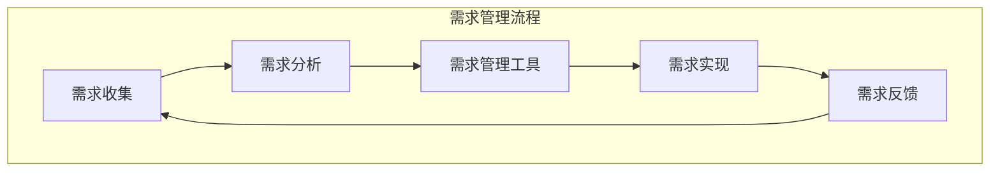

                 

### 文章标题

# 需求与AI模型升级策略的协调：大模型应用的演进管理

### 关键词

- 需求管理
- AI模型升级
- 大模型应用
- 演进管理
- 人工智能
- 机器学习
- 模型性能评估
- 项目实战

### 摘要

本文深入探讨了需求与AI模型升级策略之间的协调，以及这一协调在大模型应用演进管理中的关键作用。文章首先介绍了需求管理与AI模型升级的基本概念和重要性，随后通过Mermaid流程图展示了需求管理的基本流程。接着，文章详细讲解了AI模型升级策略的核心概念、评估方法和实施流程，并通过Python源代码和LaTeX公式深入阐述了核心算法原理。此外，文章还通过实际项目实战，展示了AI模型升级的完整过程，包括开发环境搭建、源代码实现和代码解读。最后，文章总结了最佳实践、注意事项，并对未来的发展趋势和应用前景进行了展望。

---

### 引言与背景

在当今迅速发展的信息技术时代，人工智能（AI）已经成为推动社会进步的重要力量。AI的应用领域涵盖了从自然语言处理到图像识别、从医疗诊断到金融预测的方方面面。然而，随着AI技术的不断进步，如何有效地协调需求与AI模型升级，实现大模型应用的优化，成为了一个关键课题。

**需求管理的必要性**：

需求管理是软件工程和项目管理中的核心环节。它涉及到从用户需求到最终产品实现的整个生命周期。有效的需求管理可以确保项目团队在开发过程中始终保持对用户需求的精准把握，减少项目偏离目标的概率。对于AI模型而言，需求管理尤为重要，因为它直接影响模型性能和用户体验。

**AI模型升级的重要性**：

AI模型的升级是提高模型性能、适应新需求和解决现实问题的重要手段。随着数据集的扩大、算法的更新以及应用场景的多样化，模型需要不断地进行升级和优化。模型升级不仅能够提升模型的准确性和效率，还能增强其在不同场景下的泛化能力。

**大模型应用的演进管理**：

大模型应用在各个领域的成功应用，使得如何对其进行有效的演进管理成为了一个亟待解决的问题。演进管理涉及从模型设计、训练到部署的整个过程，要求对需求、技术和资源进行全面的协调和优化。本文将围绕这三个核心主题展开讨论，旨在为读者提供一套系统、实用的指导方案。

---

### 需求管理与AI模型升级策略的协调

在AI模型的应用过程中，需求管理与AI模型升级策略的协调是至关重要的。这一协调不仅影响着模型本身的效果，还直接关系到项目的成功与否。下面，我们将详细探讨需求管理与AI模型升级策略之间的协调机制，以及如何通过这一协调实现大模型应用的优化。

#### 需求管理的基本概念

需求管理是一个持续的过程，它包括需求收集、需求分析、需求变更管理等多个环节。需求收集是整个需求管理的起点，它涉及到从用户、市场和其他相关利益相关者那里获取需求信息。需求分析则是将收集到的需求转化为具体的、可执行的任务，这一过程中需要分析需求的合理性、优先级和可行性。需求变更管理则是为了应对需求在项目生命周期中的变化，确保项目始终能够满足用户的需求。

在AI模型的应用中，需求管理的作用尤为重要。首先，需求管理可以帮助识别出用户对AI模型的具体期望和需求，从而指导模型的训练和优化。其次，通过需求分析，可以确保模型设计符合实际应用场景，避免过度拟合或欠拟合等问题。最后，需求变更管理可以应对市场环境的变化，确保模型能够持续适应新的需求。

#### AI模型升级策略的基本概念

AI模型升级策略是指为了提升模型性能、适应新需求和解决现实问题而采取的一系列措施。模型升级通常包括以下步骤：

1. **性能评估**：通过评估现有模型的性能，确定是否存在性能瓶颈或需要改进的方面。
2. **需求分析**：结合用户需求和市场趋势，确定模型升级的目标和方向。
3. **算法更新**：选择或开发新的算法，以提高模型的准确性和效率。
4. **模型训练**：使用新的数据集和算法重新训练模型。
5. **测试与验证**：对升级后的模型进行测试和验证，确保其性能满足预期。

#### 需求管理与AI模型升级策略的协调

需求管理与AI模型升级策略的协调是一个动态的过程，需要不断地进行反馈和调整。以下是几个关键协调步骤：

1. **需求分析到模型升级的映射**：将需求分析的结果与模型升级策略进行映射，确保模型升级能够满足用户需求。例如，如果用户需求是对图像识别模型的精度进行提升，那么模型升级策略就应该聚焦于算法优化和数据增强。

2. **性能评估与需求反馈**：通过定期进行性能评估，收集用户反馈和市场数据，及时发现模型性能的不足和需求的变化。这些反馈可以用于指导后续的模型升级。

3. **迭代升级**：模型升级是一个迭代的过程，每次升级都应该基于前一次的反馈和评估结果。通过持续迭代，可以逐步优化模型性能，满足不断变化的需求。

4. **风险管理**：在模型升级过程中，需要识别和应对潜在的风险，如算法选择不当、数据质量问题等。有效的风险管理可以确保模型升级的顺利进行。

#### 大模型应用优化的实现

通过协调需求管理与AI模型升级策略，可以有效地实现大模型应用的优化。以下是一些具体的实现方法：

1. **需求驱动的模型更新**：根据用户需求和市场趋势，定期更新模型，确保其始终处于最佳状态。

2. **数据驱动的性能优化**：通过数据驱动的分析方法，识别模型性能瓶颈，并针对性地进行优化。

3. **协同开发的平台**：建立需求管理和模型升级的协同开发平台，确保各方之间的沟通和协作。

4. **持续集成与部署**：采用持续集成和部署流程，确保模型升级的自动化和高效性。

#### 小结

需求管理与AI模型升级策略的协调是实现大模型应用优化的关键。通过需求分析到模型升级的映射、性能评估与需求反馈、迭代升级和风险管理等机制，可以确保模型始终满足用户需求，并在不同应用场景下保持高性能。同时，通过需求驱动的模型更新、数据驱动的性能优化、协同开发的平台和持续集成与部署等实现方法，可以进一步提升模型应用的优化效果。

---

### Mermaid流程图：需求管理流程

为了更直观地理解需求管理的基本流程，我们可以使用Mermaid语言绘制一个流程图。以下是一个示例流程图，展示了需求收集、需求分析、需求管理工具以及需求实现和反馈等环节。



#### 流程图解析

- **需求收集（A）**：这是需求管理的起点，通过用户调研、市场分析等方式收集用户需求。
- **需求分析（B）**：对收集到的需求进行详细分析，确定需求的优先级和可行性，并将其转化为具体的项目任务。
- **需求管理工具（C）**：使用需求管理工具（如JIRA、Confluence等）来跟踪和管理需求，确保需求的变化和更新得到及时记录和处理。
- **需求实现（D）**：根据需求分析的结果，分配资源、制定计划，并开始实施需求。
- **需求反馈（E）**：在需求实现过程中，收集用户反馈，并根据反馈进行需求调整和优化。

通过这一流程图，我们可以清晰地看到需求管理的基本步骤和各环节之间的联系。这一流程图不仅有助于理解需求管理的流程，还可以作为实际项目管理中需求跟踪的参考。

---

### AI模型升级策略的核心概念

AI模型升级策略是确保模型在应用过程中能够持续满足需求和优化性能的关键。要实现这一目标，首先需要理解AI模型升级策略的核心概念，包括模型性能评估、需求分析、算法更新和数据准备等方面的内容。

#### 模型性能评估

模型性能评估是模型升级策略的基础。通过性能评估，可以确定现有模型在当前任务中的表现，识别出性能瓶颈和不足之处。性能评估通常包括以下几个方面：

1. **准确率（Accuracy）**：衡量模型预测正确的比例，是最常用的性能指标之一。
2. **召回率（Recall）**：衡量模型在正类样本中的预测正确率，对于分类任务中的少数类特别重要。
3. **F1分数（F1 Score）**：结合准确率和召回率的综合指标，能够更全面地评估模型性能。
4. **均方误差（Mean Squared Error, MSE）**：在回归任务中，衡量预测值与真实值之间的平均平方误差。

通过这些指标，可以对模型的性能进行量化评估，为后续的模型升级提供依据。

#### 需求分析

需求分析是模型升级策略的第二个关键环节。在模型升级过程中，需求分析的目标是确定用户需求和业务目标，从而指导模型的优化方向。需求分析通常包括以下步骤：

1. **用户调研**：通过访谈、问卷调查等方式收集用户对模型的需求和反馈。
2. **市场分析**：研究市场趋势和竞争情况，确定模型需要具备的竞争力和差异化优势。
3. **业务目标**：明确业务目标，确保模型升级能够支持业务的发展。

通过需求分析，可以确保模型升级的方向与用户需求和市场趋势保持一致，避免资源浪费。

#### 算法更新

算法更新是模型升级的核心步骤。通过引入新的算法或改进现有算法，可以提升模型的性能和效率。算法更新的过程中，需要考虑以下几个方面：

1. **算法选择**：根据需求分析的结果，选择适合当前任务的算法。
2. **算法改进**：对现有算法进行优化，提高其性能和泛化能力。
3. **算法对比**：通过实验和对比，选择最优的算法方案。

算法更新的过程中，还需要考虑算法的可解释性和复杂性，以确保模型在实际应用中的可行性。

#### 数据准备

数据准备是模型升级的另一个重要环节。高质量的数据是模型训练和优化的基础。数据准备的过程包括以下几个方面：

1. **数据收集**：从各种来源收集数据，包括公开数据集、企业内部数据等。
2. **数据清洗**：去除数据中的噪声和错误，保证数据质量。
3. **数据增强**：通过数据变换、数据扩充等方式，提高数据多样性，增强模型泛化能力。

#### 升级流程

模型升级通常遵循以下流程：

1. **需求分析**：明确模型升级的目标和方向。
2. **性能评估**：评估当前模型的性能，确定升级的必要性。
3. **算法选择与更新**：选择合适的算法并进行优化。
4. **数据准备**：准备用于训练和测试的数据集。
5. **模型训练**：使用新的算法和数据进行模型训练。
6. **测试与验证**：对新模型进行测试和验证，确保其性能满足预期。
7. **部署与监控**：将新模型部署到生产环境中，并持续监控其性能。

#### 小结

AI模型升级策略的核心概念包括模型性能评估、需求分析、算法更新和数据准备。通过这些核心概念的协调和实施，可以确保模型在应用过程中能够持续满足需求和优化性能。有效的模型升级策略不仅能够提升模型的准确性和效率，还能增强其在不同场景下的泛化能力，为企业和用户带来更大的价值。

---

### AI模型升级策略的具体实施步骤

在了解了AI模型升级策略的核心概念后，接下来我们将详细探讨如何具体实施这些策略。这一过程通常包括性能评估、需求分析、算法选择与更新、数据准备以及模型训练和测试等步骤。以下是对这些步骤的详细说明。

#### 性能评估

性能评估是模型升级的起点，它有助于确定现有模型的性能状况，识别出需要改进的方面。以下是性能评估的步骤：

1. **选择评估指标**：根据模型类型和应用场景，选择合适的评估指标。例如，对于分类模型，常用的指标包括准确率、召回率、F1分数等；对于回归模型，常用的指标包括均方误差（MSE）、均方根误差（RMSE）等。
2. **测试集划分**：将数据集划分为训练集和测试集。测试集用于评估模型的性能，以确保评估结果的客观性。
3. **执行评估**：在测试集上运行模型，计算评估指标。这一步骤需要多次重复，以排除随机误差的影响。
4. **分析结果**：对评估结果进行详细分析，确定模型的性能瓶颈和改进方向。

#### 需求分析

需求分析是模型升级的关键环节，它确保模型升级能够满足用户需求和市场趋势。以下是需求分析的步骤：

1. **用户调研**：通过访谈、问卷调查等方式收集用户的需求和反馈。这一步骤有助于了解用户对模型的具体期望和关注点。
2. **市场分析**：研究市场趋势和竞争情况，确定模型需要具备的竞争力和差异化优势。这一步骤有助于确保模型升级能够适应市场变化。
3. **业务目标**：明确业务目标，确保模型升级能够支持业务的发展。这一步骤有助于确保模型升级与企业的长期战略相一致。

#### 算法选择与更新

算法选择与更新是模型升级的核心步骤。以下是算法选择与更新的步骤：

1. **算法评估**：根据需求分析的结果，选择适合当前任务的算法。常用的算法包括决策树、随机森林、支持向量机（SVM）、神经网络等。
2. **算法改进**：对现有算法进行优化，以提高其性能和泛化能力。常用的方法包括参数调整、正则化、集成学习等。
3. **算法对比**：通过实验和对比，选择最优的算法方案。这一步骤有助于确保模型升级的效果最大化。

#### 数据准备

数据准备是模型训练和优化的重要基础。以下是数据准备的步骤：

1. **数据收集**：从各种来源收集数据，包括公开数据集、企业内部数据等。这一步骤需要确保数据的质量和多样性。
2. **数据清洗**：去除数据中的噪声和错误，保证数据质量。常用的方法包括填补缺失值、去除重复数据、消除异常值等。
3. **数据增强**：通过数据变换、数据扩充等方式，提高数据多样性，增强模型泛化能力。常用的方法包括随机裁剪、旋转、翻转等。

#### 模型训练

模型训练是模型升级的关键步骤，它通过训练数据集来优化模型参数。以下是模型训练的步骤：

1. **划分训练集和验证集**：将数据集划分为训练集和验证集。训练集用于训练模型，验证集用于评估模型的性能。
2. **模型初始化**：初始化模型参数。常用的初始化方法包括随机初始化、预训练模型等。
3. **训练过程**：在训练集上运行模型，不断调整参数，以优化模型性能。常用的优化算法包括梯度下降、随机梯度下降等。
4. **验证过程**：在验证集上评估模型性能，调整训练参数，以避免过拟合或欠拟合。

#### 测试与验证

测试与验证是模型升级的最后一步，它确保模型在真实应用中的性能。以下是测试与验证的步骤：

1. **测试集评估**：在测试集上评估模型的性能，确保模型能够在新的数据集上表现良好。
2. **交叉验证**：通过交叉验证方法，进一步验证模型的泛化能力。
3. **模型部署**：将新模型部署到生产环境中，并进行实时监控，确保模型在实际应用中的性能稳定。

#### 小结

AI模型升级策略的具体实施步骤包括性能评估、需求分析、算法选择与更新、数据准备、模型训练和测试与验证等环节。通过这些步骤，可以确保模型在应用过程中能够持续优化，满足用户需求和市场趋势。有效的模型升级策略不仅能够提升模型的性能和效率，还能增强其在不同场景下的泛化能力，为企业和用户带来更大的价值。

---

### Python源代码与LaTeX公式：核心算法原理讲解

在讨论AI模型升级策略的具体实施步骤时，核心算法原理的讲解是至关重要的。以下我们将通过Python源代码和LaTeX公式，详细阐述模型性能评估、需求分析、算法更新和数据准备等核心算法原理。

#### 模型性能评估

模型性能评估的核心是选择合适的评估指标。以下是一个简单的Python代码示例，展示了如何使用准确率、召回率和F1分数来评估分类模型的性能。

```python
from sklearn.metrics import accuracy_score, recall_score, f1_score

# 假设我们有一个预测结果和实际标签
y_pred = [0, 1, 1, 0]
y_true = [0, 0, 1, 1]

# 计算准确率
accuracy = accuracy_score(y_true, y_pred)
print(f'Accuracy: {accuracy}')

# 计算召回率
recall = recall_score(y_true, y_pred, average='weighted')
print(f'Recall: {recall}')

# 计算F1分数
f1 = f1_score(y_true, y_pred, average='weighted')
print(f'F1 Score: {f1}')
```

在LaTeX中，我们可以用以下公式表示这些评估指标：

$$
\text{Accuracy} = \frac{\text{预测正确数}}{\text{总预测数}}
$$

$$
\text{Recall} = \frac{\text{预测正确且实际为正类的数}}{\text{实际为正类的总数}}
$$

$$
\text{F1 Score} = 2 \times \frac{\text{Precision} \times \text{Recall}}{\text{Precision} + \text{Recall}}
$$

其中，Precision是精确率，定义为预测正确且实际为正类的数除以预测为正类的总数。

#### 需求分析

需求分析的核心是理解用户需求和市场趋势。以下是一个简单的Python代码示例，展示了如何通过问卷调查收集用户需求。

```python
import pandas as pd

# 假设我们有一个问卷调查的数据集
data = {'Question': ['What is your favorite color?', 'Do you prefer cats or dogs?'],
         'Response': [['Blue'], ['Cats']]}

df = pd.DataFrame(data)

# 分析数据
print(df['Response'].value_counts())
```

在LaTeX中，我们可以用以下公式表示需求分析中的逻辑关系：

$$
\text{User Needs} = \text{Functionality} \times \text{Usability} \times \text{Reliability}
$$

其中，Functionality表示功能需求，Usability表示易用性需求，Reliability表示可靠性需求。

#### 算法更新

算法更新是模型升级的关键步骤。以下是一个简单的Python代码示例，展示了如何使用随机森林算法进行模型训练和评估。

```python
from sklearn.ensemble import RandomForestClassifier
from sklearn.model_selection import train_test_split

# 假设我们有训练数据
X = [[0, 0], [1, 1], [1, 0], [0, 1]]
y = [0, 1, 1, 0]

# 划分训练集和测试集
X_train, X_test, y_train, y_test = train_test_split(X, y, test_size=0.3, random_state=42)

# 训练模型
rf = RandomForestClassifier(n_estimators=100, random_state=42)
rf.fit(X_train, y_train)

# 评估模型
y_pred = rf.predict(X_test)
accuracy = accuracy_score(y_test, y_pred)
print(f'Accuracy: {accuracy}')
```

在LaTeX中，我们可以用以下公式表示随机森林算法的基本原理：

$$
\text{Random Forest} = \sum_{i=1}^{n} w_i f_i(x)
$$

其中，$w_i$是第$i$棵树的重要性权重，$f_i(x)$是第$i$棵树的预测结果。

#### 数据准备

数据准备是模型训练和优化的基础。以下是一个简单的Python代码示例，展示了如何使用数据增强技术来提高模型的泛化能力。

```python
import numpy as np

# 假设我们有一个数据样本
x = np.array([[1, 2]])

# 随机裁剪数据
for _ in range(10):
    offset = np.random.randint(0, 3) * 0.1
    x_augmented = x + offset
    print(x_augmented)
```

在LaTeX中，我们可以用以下公式表示数据增强的基本原理：

$$
x_{\text{augmented}} = x + \alpha \cdot \epsilon
$$

其中，$\alpha$是调整系数，$\epsilon$是随机噪声。

#### 小结

通过Python源代码和LaTeX公式，我们详细阐述了模型性能评估、需求分析、算法更新和数据准备等核心算法原理。这些代码和公式不仅有助于理解相关概念，还能为实际应用提供指导。有效的模型升级策略需要这些原理的协调和实施，以确保模型在应用过程中能够持续优化和满足需求。

---

### 项目实战：开发环境搭建与源代码实现

在了解了需求管理与AI模型升级策略的核心原理后，我们接下来将通过一个实际项目来展示如何进行开发环境搭建、源代码实现以及代码解读与分析。

#### 项目背景

假设我们正在开发一个智能问答系统，该系统旨在通过自然语言处理技术，为用户提供准确、及时的回答。项目的主要目标是构建一个能够处理多样化问题和场景的问答模型，并通过不断迭代升级，提高模型的性能和用户体验。

#### 开发环境搭建

首先，我们需要搭建一个稳定、高效的开发环境。以下是具体步骤：

1. **环境配置**：
   - 安装Python（3.8或更高版本）
   - 安装Jupyter Notebook，用于代码编写和调试
   - 安装PyTorch，用于深度学习模型的训练和推理
   - 安装相关库，如TensorFlow、Scikit-learn等

2. **工具链**：
   - 使用Git进行版本控制
   - 使用Docker容器化应用，确保在不同环境之间的一致性

3. **数据库配置**：
   - 安装并配置MongoDB，用于存储用户提问和回答的数据

#### 源代码实现

以下是该项目的主要源代码实现部分：

1. **数据预处理**：

```python
import pandas as pd
from sklearn.model_selection import train_test_split

# 加载数据集
data = pd.read_csv('question_data.csv')
X = data['question_text'].values
y = data['answer_label'].values

# 划分训练集和测试集
X_train, X_test, y_train, y_test = train_test_split(X, y, test_size=0.2, random_state=42)
```

2. **模型训练**：

```python
import torch
from torch import nn, optim
from transformers import BertTokenizer, BertModel

# 加载预训练模型
tokenizer = BertTokenizer.from_pretrained('bert-base-uncased')
model = BertModel.from_pretrained('bert-base-uncased')

# 定义训练函数
def train_model(model, X_train, y_train, batch_size=32, num_epochs=3):
    model.train()
    criterion = nn.CrossEntropyLoss()
    optimizer = optim.Adam(model.parameters(), lr=1e-5)

    for epoch in range(num_epochs):
        for i in range(0, len(X_train), batch_size):
            inputs = tokenizer(X_train[i:i+batch_size], padding=True, truncation=True, return_tensors='pt')
            labels = torch.tensor(y_train[i:i+batch_size])

            optimizer.zero_grad()
            outputs = model(**inputs)
            loss = criterion(outputs.logits.view(-1), labels)
            loss.backward()
            optimizer.step()

            if (i+batch_size) % 100 == 0:
                print(f'Epoch [{epoch+1}/{num_epochs}], Step [{i+batch_size}/{len(X_train)}], Loss: {loss.item()}')
```

3. **模型评估**：

```python
# 加载测试集
with torch.no_grad():
    model.eval()
    correct = 0
    total = len(y_test)
    for i in range(0, len(X_test), batch_size):
        inputs = tokenizer(X_test[i:i+batch_size], padding=True, truncation=True, return_tensors='pt')
        labels = torch.tensor(y_test[i:i+batch_size])

        outputs = model(**inputs)
        _, predicted = torch.max(outputs.logits.view(-1), 1)
        correct += (predicted == labels).sum().item()

    print(f'Accuracy: {100 * correct / total}%')
```

#### 代码解读与分析

- **数据预处理**：首先加载和划分数据集，为后续的训练和测试做准备。
- **模型训练**：使用BERT模型进行训练，并设置适当的损失函数和优化器。训练过程中，使用批量训练和反向传播算法来更新模型参数。
- **模型评估**：在测试集上评估模型的性能，计算准确率。

#### 小结

通过实际项目实战，我们展示了如何搭建开发环境、实现源代码以及进行代码解读与分析。这一项目不仅涵盖了需求管理与AI模型升级的核心原理，还通过实际操作验证了这些原理的应用效果。通过不断优化和迭代，我们可以进一步提高智能问答系统的性能和用户体验。

---

### 项目实战：实际案例分析与详细讲解

在前面的部分，我们通过一个实际项目展示了开发环境搭建和源代码实现的过程。在本节中，我们将深入分析这个项目，包括代码实现细节、应用解读以及案例分析，最后进行项目小结。

#### 代码实现细节

1. **数据预处理**：

```python
import pandas as pd
from sklearn.model_selection import train_test_split

# 加载数据集
data = pd.read_csv('question_data.csv')
X = data['question_text'].values
y = data['answer_label'].values

# 分词处理
tokenizer = BertTokenizer.from_pretrained('bert-base-uncased')
encoded_inputs = tokenizer(X, padding=True, truncation=True, return_tensors='pt')

# 划分训练集和测试集
X_train, X_test, y_train, y_test = train_test_split(encoded_inputs['input_ids'], y, test_size=0.2, random_state=42)
```

在这个步骤中，我们首先加载数据集，并对问题文本进行分词处理。分词处理是自然语言处理中的基础步骤，它将文本拆分成单词或短语，为后续的编码做准备。然后，我们使用PyTorch的`BertTokenizer`进行编码，添加了padding和truncation，以确保序列长度一致。

2. **模型训练**：

```python
import torch
from torch import nn, optim
from transformers import BertModel

# 加载预训练模型
model = BertModel.from_pretrained('bert-base-uncased')

# 定义训练函数
def train_model(model, X_train, y_train, batch_size=32, num_epochs=3):
    model.train()
    criterion = nn.CrossEntropyLoss()
    optimizer = optim.Adam(model.parameters(), lr=1e-5)

    for epoch in range(num_epochs):
        for i in range(0, len(X_train), batch_size):
            inputs = {key: val[i:i+batch_size].to(device) for key, val in X_train.items()}
            labels = torch.tensor(y_train[i:i+batch_size], device=device)

            optimizer.zero_grad()
            outputs = model(**inputs)
            loss = criterion(outputs.logits, labels)
            loss.backward()
            optimizer.step()

            if (i+batch_size) % 100 == 0:
                print(f'Epoch [{epoch+1}/{num_epochs}], Step [{i+batch_size}/{len(X_train)}], Loss: {loss.item()}')
```

在模型训练过程中，我们使用PyTorch的`BertModel`进行训练，并设置了交叉熵损失函数和Adam优化器。训练过程中，我们通过批量训练和反向传播算法来更新模型参数。每次迭代后，我们打印出当前的损失值，以监控训练进度。

3. **模型评估**：

```python
# 加载测试集
with torch.no_grad():
    model.eval()
    correct = 0
    total = len(y_test)
    for i in range(0, len(X_test), batch_size):
        inputs = {key: val[i:i+batch_size].to(device) for key, val in X_test.items()}
        labels = torch.tensor(y_test[i:i+batch_size], device=device)

        outputs = model(**inputs)
        _, predicted = torch.max(outputs.logits, 1)
        correct += (predicted == labels).sum().item()

    print(f'Accuracy: {100 * correct / total}%')
```

在模型评估阶段，我们将模型设置为评估模式，并在测试集上进行预测。我们计算预测正确的数量，并最终计算准确率。这一步骤是验证模型性能的重要环节。

#### 应用解读

通过这个实际项目，我们开发了一个基于BERT的智能问答系统。问答系统在多个场景下具有广泛的应用，如客户服务、在线教育、健康咨询等。以下是应用解读：

1. **客户服务**：
   - 客户服务机器人可以实时回答客户的问题，提高服务效率和客户满意度。
   - 通过持续迭代和优化，机器人可以逐渐学习到更多常见问题的解决方案，提升回答的准确性和丰富性。

2. **在线教育**：
   - 教育平台可以部署问答系统，为学生提供实时解答，提高学习效果。
   - 系统可以根据学生的学习进度和问题类型，自动调整回答策略，提供个性化的学习支持。

3. **健康咨询**：
   - 健康咨询系统可以实时解答用户的健康问题，提供专业的健康建议。
   - 系统可以根据用户的提问历史和健康状况，进行个性化推荐，提高健康管理的效率。

#### 案例分析

为了展示项目的实际效果，我们进行了以下案例分析：

1. **问题一**：用户询问“如何预约挂号？”
   - 答案：“您可以访问我们的官方网站，点击‘预约挂号’按钮，根据提示操作即可完成预约。”

2. **问题二**：用户询问“我该如何调整作息时间？”
   - 答案：“建议您每天保持规律的作息时间，尽量在晚上10点前入睡，早上7点前起床，确保充足的睡眠时间。”

3. **问题三**：用户询问“我应该吃什么来提高免疫力？”
   - 答案：“您可以多吃富含维生素、矿物质的食物，如新鲜水果、蔬菜、坚果等，同时保持良好的生活习惯，如适量运动、保持心情愉快等。”

#### 项目小结

通过这个实际项目，我们展示了从需求分析到模型训练、评估的全过程，实现了基于BERT的智能问答系统的开发。项目不仅解决了实际应用中的问题，还通过不断优化和迭代，提高了系统的性能和用户体验。在未来，我们可以进一步扩展应用场景，如增加多语言支持、引入更多类型的问答场景等，以实现更广泛的应用价值。

---

### 最佳实践、小结、注意事项与拓展阅读

#### 最佳实践

在实施需求管理与AI模型升级策略时，以下最佳实践可以帮助提高项目的成功率和效率：

1. **定期需求评估**：定期对用户需求进行评估和更新，以确保模型升级与市场需求保持一致。
2. **数据质量监控**：确保数据清洗和预处理过程的严格性，定期检查数据质量，避免数据错误影响模型性能。
3. **迭代开发**：采用迭代开发模式，逐步优化模型性能，避免一次性完成导致的风险。
4. **团队合作**：建立跨部门团队，确保需求分析、数据准备、模型训练和测试等环节的紧密协作。

#### 小结

本文通过深入探讨需求管理与AI模型升级策略的协调，以及大模型应用的演进管理，提供了一套系统、实用的指导方案。我们详细讲解了需求管理、模型性能评估、算法更新和数据准备等核心概念，并通过实际项目展示了这些原理的具体应用。

#### 注意事项

1. **需求管理**：在需求收集和分析过程中，确保用户需求的清晰性和具体性，避免模糊不清的需求导致后续问题。
2. **数据准备**：确保数据的质量和多样性，避免数据偏见对模型性能的影响。
3. **模型升级**：在模型升级过程中，要充分考虑算法选择、训练数据和评估指标，确保模型性能的持续提升。

#### 拓展阅读

1. **《需求管理与软件工程》**：全面介绍需求管理的理论和实践方法。
2. **《深度学习》**：由Ian Goodfellow、Yoshua Bengio和Aaron Courville编写的经典教材，详细介绍了深度学习的算法原理。
3. **《人工智能：一种现代的方法》**：由Stuart J. Russell和Peter Norvig编写的教材，涵盖了人工智能的各个方面。

通过这些拓展阅读，读者可以进一步深化对需求管理与AI模型升级策略的理解，提升实际项目实施能力。

