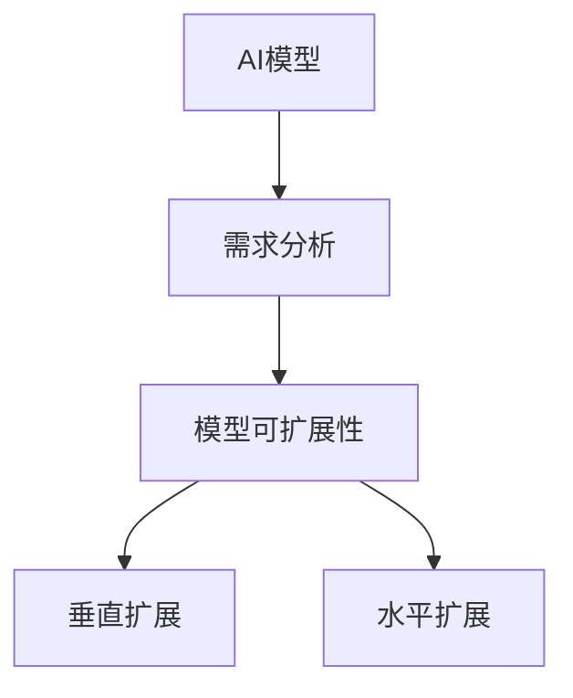

                 

# 《需求与AI模型可扩展性的协调：大模型应用开发策略》

> **关键词**：AI模型、需求分析、可扩展性、大模型、应用开发策略

> **摘要**：本文将深入探讨AI模型在需求变化下的可扩展性，分析AI模型与应用开发之间的协调机制，并提出一系列策略，以实现大模型在复杂应用场景中的高效开发与优化。

## 引言

随着人工智能技术的快速发展，AI模型在各个行业中的应用越来越广泛。然而，需求的变化和业务的发展速度往往超出了模型的预期，这就对AI模型的可扩展性提出了新的挑战。本文将围绕这一主题，从需求分析、模型可扩展性原理、核心算法讲解、数学模型应用、项目实战等多个方面进行深入探讨，旨在为AI模型的应用开发提供一套切实可行的策略。

## 背景介绍

### AI模型的现状与发展

人工智能（AI）作为当今科技发展的前沿领域，已经取得了显著的成果。从最初的规则系统、知识表示，到基于统计学的机器学习，再到深度学习的崛起，AI模型的技术层次和复杂度不断提升。如今，AI模型已经广泛应用于自然语言处理、计算机视觉、语音识别、推荐系统等多个领域，成为了推动行业进步的重要力量。

### 需求的变化

在快速发展的同时，市场需求也在不断变化。企业对AI模型的需求不仅体现在性能提升上，还体现在灵活性和适应性上。随着业务场景的多样化，需求变得更加复杂，对AI模型的响应速度和可扩展性提出了更高的要求。这要求我们在设计AI模型时，必须考虑其可扩展性，以满足不断变化的市场需求。

### 可扩展性的重要性

AI模型的可扩展性直接影响到其应用范围和业务价值。一个具有良好可扩展性的模型可以轻松适应不同的业务场景，从而实现更高的业务灵活性。此外，可扩展性还可以降低模型维护成本，提高开发效率。因此，研究AI模型的可扩展性具有重要的现实意义。

## 核心概念与联系

### AI模型概述

AI模型是人工智能的核心组成部分，它通过模拟人类智能行为，实现自动识别、分类、预测等功能。常见的AI模型包括决策树、支持向量机、神经网络等。其中，神经网络由于其强大的非线性映射能力，成为了当前应用最为广泛的AI模型。

### 需求分析概述

需求分析是AI模型应用开发的重要环节，它涉及到对业务需求的识别、分析和整理。需求分析的质量直接影响到AI模型的应用效果。需求分析的方法包括用户访谈、问卷调查、场景分析等。

### 模型可扩展性原理

模型可扩展性是指AI模型在面临需求变化时，能够通过适当的调整和优化，保持其性能和应用价值的能力。模型可扩展性包括两个方面：垂直扩展和水平扩展。垂直扩展是通过增加模型参数和复杂度来提高性能，水平扩展是通过增加模型实例和计算资源来提高性能。

### 核心概念联系架构 Mermaid 流程图



## 核心算法原理讲解

### AI模型适应性的算法原理

AI模型的适应性是指模型在面对不同需求时，能够自动调整其结构和参数，以适应新的场景。常见的适应性算法包括迁移学习、多任务学习等。以下是一个简单的迁移学习算法的Python实现：

```python
# 迁移学习算法实现
def transfer_learning(source_model, target_model, target_data):
    # 将源模型参数复制到目标模型
    target_model.load_state_dict(source_model.state_dict())
    # 使用目标数据对目标模型进行训练
    target_model.fit(target_data)
    return target_model
```

### 模型可扩展性的算法原理

模型可扩展性算法主要包括模型参数优化、计算资源分配等。以下是一个简单的模型参数优化算法的Python实现：

```python
# 模型参数优化算法实现
def optimize_parameters(model, data):
    # 使用数据对模型进行训练
    model.fit(data)
    # 优化模型参数
    optimizer = torch.optim.Adam(model.parameters(), lr=0.001)
    for epoch in range(num_epochs):
        optimizer.zero_grad()
        outputs = model(data)
        loss = loss_function(outputs, targets)
        loss.backward()
        optimizer.step()
    return model
```

## 数学模型详解

### 模型可扩展性的数学模型

模型可扩展性的数学模型通常涉及模型性能、计算资源、需求变化等因素。以下是一个简化的模型可扩展性度量公式：

$$
\text{模型扩展性度量} = \frac{\text{模型性能}}{\text{计算资源需求}}
$$

### 数学模型公式详解

假设模型性能与训练数据量、模型参数量、计算资源需求等因素相关，可以表示为：

$$
\text{模型性能} = f(\text{训练数据量}, \text{模型参数量}, \text{计算资源需求})
$$

其中，$f$ 是一个复杂的非线性函数。

## 应用实践

### 开发环境搭建

在进行AI模型的应用开发前，需要搭建一个合适的开发环境。以下是一个基于Python的AI模型开发环境搭建的步骤：

1. 安装Python（建议使用3.7及以上版本）。
2. 安装TensorFlow或PyTorch等深度学习框架。
3. 安装必要的依赖库，如NumPy、Pandas等。

### 源代码详细实现

以下是一个简单的AI模型应用开发案例，包括数据预处理、模型训练、模型评估等步骤：

```python
# 数据预处理
data = load_data('data.csv')
processed_data = preprocess_data(data)

# 模型训练
model = build_model()
model.fit(processed_data, epochs=10)

# 模型评估
evaluation = model.evaluate(processed_data)
print('Model evaluation:', evaluation)
```

### 代码解读与分析

在这段代码中，首先进行数据预处理，包括数据清洗、特征提取等步骤。然后，构建一个简单的AI模型，使用处理后的数据进行训练。最后，对训练好的模型进行评估，输出评估结果。

### 实际案例分析和详细讲解剖析

以下是一个实际案例：某电商平台希望通过AI模型预测用户购买行为，以提高销售业绩。

1. **需求分析**：分析用户行为数据，包括浏览历史、购买记录、用户画像等。
2. **数据预处理**：对用户行为数据进行清洗和特征提取。
3. **模型选择**：选择适合的用户行为预测模型，如决策树、随机森林等。
4. **模型训练**：使用预处理后的数据进行模型训练。
5. **模型评估**：评估模型预测效果，包括准确率、召回率等指标。

### 项目小结

通过这个案例，我们可以看到，AI模型的应用开发需要经历需求分析、数据预处理、模型选择、模型训练和模型评估等多个环节。在每个环节中，都需要充分考虑模型的可扩展性，以满足不断变化的需求。

## 最佳实践 Tips

1. **需求分析要深入**：深入了解业务需求，确保AI模型的应用效果。
2. **数据预处理要细致**：数据预处理是模型训练的关键，要确保数据质量。
3. **模型选择要合理**：根据业务需求和数据特点，选择合适的模型。
4. **模型优化要持续**：持续优化模型，提高模型性能和可扩展性。
5. **团队协作要高效**：建立高效的团队协作机制，确保项目进度和质量。

## 小结

本文从需求与AI模型可扩展性的协调出发，深入探讨了AI模型在需求变化下的应对策略。通过理论讲解、算法实现、数学模型分析、实际案例剖析等多个方面，为AI模型的应用开发提供了一套完整的解决方案。在未来，随着AI技术的不断进步，我们期待能够进一步优化这些策略，以应对更加复杂的业务需求。

## 附录

### A.1 相关资源

- 《深度学习》（Goodfellow, I., Bengio, Y., & Courville, A.）
- 《机器学习实战》（周志华）
- 《Python深度学习》（Fischer, F.）

### A.2 常见问题与解答

1. **什么是AI模型的可扩展性？**
   AI模型的可扩展性是指模型在面对不同规模的数据、不同的业务场景时，能够通过调整模型结构、参数或计算资源，保持其性能和应用价值的能力。

2. **如何评估AI模型的可扩展性？**
   可以通过以下指标来评估AI模型的可扩展性：模型性能、计算资源需求、模型调整的难度和成本等。

3. **什么是迁移学习？**
   迁移学习是指将一个预训练的模型（源模型）应用于一个新的任务（目标任务），通过少量的额外训练来提高目标任务的性能。

### A.3 进一步阅读材料

- 《机器学习：原理与算法》（李航）
- 《深度学习》（周志华）
- 《Python编程：从入门到实践》（埃里克·马瑟斯）

---

**作者：AI天才研究院/AI Genius Institute & 禅与计算机程序设计艺术 /Zen And The Art of Computer Programming**

