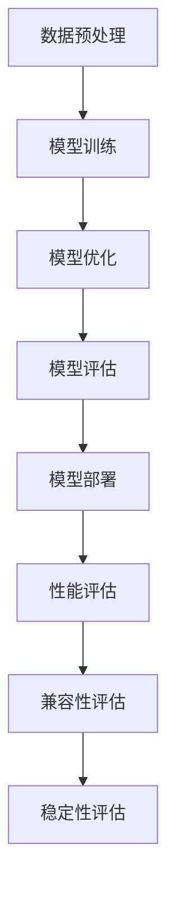

                 

### 关键词

AI模型可移植性，需求分析，跨平台策略，核心算法，数学模型，项目实战。

### 摘要

本文旨在探讨AI模型可移植性在满足不同需求场景中的重要性，以及在实现跨平台应用时面临的挑战。首先，我们概述了AI模型可移植性的基本概念和其在现代技术中的应用。接着，深入分析了影响AI模型可移植性的关键因素，包括数据预处理、模型训练和优化等。通过具体的数学模型和算法原理的讲解，我们为读者提供了清晰的实现路径。随后，通过一个实际项目案例，展示了如何在实际开发中实现AI模型的可移植性。最后，我们提出了跨平台开发的最佳实践策略，并展望了AI模型可移植性的未来发展。

### 引言：需求与AI模型可移植性的权衡概述

在当今信息化和智能化的时代，人工智能（AI）模型的应用日益广泛，成为推动技术进步的重要力量。从图像识别、自然语言处理到推荐系统，AI模型在各个领域都展现出了强大的潜力。然而，随着AI模型的规模和复杂性不断增加，如何确保这些模型在不同平台上高效、可靠地运行，成为了亟待解决的问题。这就引出了AI模型可移植性的概念——即AI模型在保持性能和功能不变的前提下，能够在不同硬件、操作系统和编程环境中顺利部署和运行的能力。

需求与AI模型可移植性的权衡，是当前AI领域面临的一个重要挑战。一方面，用户的需求是多样的和不断变化的，他们希望在不同的应用场景中能够灵活使用AI模型，这要求模型具有良好的可移植性。另一方面，AI模型的开发和优化是一个复杂的过程，涉及到大量的计算资源和时间成本。如何在这些需求和成本之间找到一个平衡点，是推动AI技术进一步发展的关键。

本文将围绕这一核心主题，深入探讨AI模型可移植性的重要性及其在实际应用中的实现策略。首先，我们将介绍AI模型可移植性的基本概念和背景，包括其定义、核心概念和影响因素。接着，通过具体的数学模型和算法原理，我们为读者提供AI模型可移植性的实现路径。随后，通过一个实际项目案例，我们将展示如何在实际开发过程中实现AI模型的可移植性。最后，我们将讨论跨平台开发的最佳实践策略，并展望AI模型可移植性的未来发展。

总之，本文旨在为读者提供一个全面、深入的理解，帮助他们在实际应用中更好地把握AI模型可移植性的权衡，从而推动AI技术的发展和应用。

### AI模型可移植性的基础理论

在探讨AI模型可移植性的基础理论之前，我们需要首先了解AI模型的概念及其类型。AI模型是人工智能系统的核心，它们通过学习数据中的模式和规律，进行预测、决策和分类等任务。AI模型可以分为监督学习、无监督学习和强化学习等类型。监督学习模型通过已标记的数据进行训练，无监督学习模型在无标记数据中发现模式和结构，而强化学习模型通过与环境的交互进行学习。

#### AI模型的概念与类型

监督学习模型是最常见的AI模型类型之一，它们通过已标记的数据进行训练，并能够对新的、未标记的数据进行预测。常见的监督学习模型包括线性回归、决策树、随机森林、支持向量机（SVM）和神经网络等。无监督学习模型则不需要标记的数据，它们通过发现数据中的结构和规律来进行聚类、降维和异常检测等任务。典型的无监督学习模型包括K-均值聚类、主成分分析（PCA）和自编码器等。强化学习模型通过在动态环境中与环境的交互进行学习，它们能够通过试错和反馈来优化策略，常见应用包括智能体在游戏、机器人控制和自动驾驶等领域。

#### 模型可移植性的核心概念

AI模型可移植性是指模型在不同硬件、操作系统和编程环境之间进行迁移和部署的能力。它不仅涉及到模型的训练和优化过程，还包括模型部署后的运行效率和性能表现。具体来说，模型可移植性包括以下几个方面：

1. **硬件无关性**：模型在不同硬件平台（如CPU、GPU、FPGA等）上运行时，应保持一致的性能和功能。
2. **操作系统兼容性**：模型能够在不同的操作系统（如Linux、Windows、macOS等）上无缝运行。
3. **编程环境兼容性**：模型在不同的编程语言和框架（如Python、C++、TensorFlow、PyTorch等）之间能够顺利迁移和部署。

#### AI模型可移植性的关键因素

实现AI模型的可移植性需要考虑多个关键因素，这些因素相互关联，共同影响模型的可移植性。以下是几个关键因素：

1. **数据预处理**：数据预处理是模型可移植性的重要环节，包括数据清洗、特征提取和特征工程。这些步骤需要在不同平台上保持一致，以确保模型在数据上的输入和输出是一致的。
2. **模型训练**：模型的训练过程涉及到参数的初始化、优化算法的选择和训练策略的制定。为了实现模型的可移植性，训练过程中使用的算法和策略应具备一定的通用性，能够在不同硬件和操作系统上高效运行。
3. **模型优化**：模型优化包括模型结构的调整、参数的调优和模型剪枝等。这些优化步骤需要在保证模型性能的同时，尽量减少对硬件和操作系统的依赖。
4. **模型部署**：模型的部署包括将训练好的模型转化为可运行的代码，并在目标平台上进行部署。这一过程中需要考虑模型的压缩、封装和兼容性等问题。

#### 模型可移植性的评估方法

为了评估AI模型的可移植性，我们可以从多个维度进行评估：

1. **性能评估**：通过在不同的硬件、操作系统和编程环境中运行模型，评估其在不同平台上的性能表现。常用的评估指标包括准确率、召回率、F1分数等。
2. **兼容性评估**：评估模型在不同编程语言和框架之间的兼容性，包括代码的迁移、依赖的兼容和运行时的问题等。
3. **稳定性评估**：评估模型在不同环境下的稳定性和鲁棒性，包括在异常情况下的表现和处理能力。

#### Mermaid流程图：AI模型可移植性的关键流程

为了更直观地展示AI模型可移植性的实现流程，我们可以使用Mermaid流程图来描述。以下是一个简化的流程图，展示了从数据预处理到模型部署的整个过程：



在这个流程图中，每个步骤都是实现AI模型可移植性的关键环节，通过这些步骤，我们可以确保模型在不同平台上的高性能、高兼容性和高稳定性。

通过上述对AI模型可移植性基础理论的介绍，我们为后续章节的具体讨论奠定了基础。在接下来的章节中，我们将进一步深入探讨AI模型可移植性的核心算法、数学模型以及项目实战，帮助读者更全面地理解和掌握这一重要主题。

### AI模型可移植性的核心算法解析

在理解了AI模型可移植性的基础理论之后，我们接下来将深入探讨实现模型可移植性的核心算法原理。这些算法涵盖了数据预处理与特征提取、模型训练与优化等关键步骤，它们是实现AI模型在不同平台和环境中高效运行的基础。

#### 数据预处理与特征提取

数据预处理是AI模型构建过程中至关重要的一步，它直接影响到模型的性能和可移植性。数据预处理主要包括数据清洗、特征选择和特征工程等步骤。

1. **数据清洗**：
   数据清洗是数据预处理的第一步，它的目的是去除噪声、纠正错误和填充缺失值。常见的数据清洗方法包括：
   - **缺失值处理**：通过删除含有缺失值的样本或使用均值、中位数等方法填充缺失值。
   - **异常值处理**：识别并处理数据中的异常值，例如使用Z分数或IQR（四分位距）方法检测和去除异常值。
   - **重复数据去除**：通过对比不同特征或列之间的关联性，识别并删除重复的样本。

2. **特征选择**：
   特征选择是指从大量特征中选择出对模型性能有显著影响的关键特征，减少数据维度并提高模型的可移植性。常见的特征选择方法包括：
   - **过滤法**：通过统计测试（如卡方检验、F检验）选择特征。
   - **包装法**：通过模型训练和评估选择特征，如使用递归特征消除（RFE）或选择操作树（SHAP）。
   - **嵌入式法**：在模型训练过程中自动选择特征，如LASSO回归、随机森林和XGBoost等。

3. **特征工程**：
   特征工程是数据预处理的核心，它通过创建新的特征或变换现有特征，增强模型的表现力和可移植性。常见的方法包括：
   - **特征标准化**：通过归一化或标准化方法，将特征缩放到相同的范围，如使用Min-Max缩放或Z-score标准化。
   - **特征组合**：通过组合多个特征创建新的特征，如多项式特征、交叉特征等。
   - **特征变换**：通过变换特征空间，如使用多项式变换、对数变换等，提高模型的鲁棒性。

#### 模型训练与优化

模型训练与优化是AI模型可移植性的另一个关键环节，它决定了模型在不同平台和环境中运行时的性能和效率。以下是模型训练与优化过程中的一些核心步骤：

1. **模型训练过程**：
   - **参数初始化**：初始化模型参数是训练过程的第一步，常见的方法包括随机初始化、均匀分布初始化和高斯分布初始化等。
   - **前向传播**：在前向传播过程中，模型将输入数据传递到各个层，通过激活函数计算输出。
   - **损失函数**：损失函数用于衡量模型预测结果与真实值之间的差距，常见的损失函数包括均方误差（MSE）、交叉熵损失等。
   - **反向传播**：通过反向传播算法，模型根据损失函数计算梯度，并更新模型参数。

2. **优化算法**：
   优化算法用于最小化损失函数，常见的方法包括：
   - **梯度下降**：通过迭代更新模型参数，以减小损失函数的值。常见的梯度下降算法包括批量梯度下降（BGD）、随机梯度下降（SGD）和Adam优化器。
   - **自适应优化算法**：如RMSprop和AdaGrad，它们通过调整学习率来提高训练效率。
   - **基于梯度的优化算法**：如L-BFGS和BFGS，它们利用历史梯度信息加速优化过程。

3. **调参技巧**：
   调参是模型训练过程中至关重要的一步，它通过调整模型参数来优化模型性能。常见的调参技巧包括：
   - **网格搜索**：通过遍历多个参数组合，找到最优参数组合。
   - **随机搜索**：随机选择参数组合进行训练，寻找最优参数。
   - **贝叶斯优化**：基于贝叶斯推理和经验知识，选择下一个参数组合进行训练。

#### 伪代码展示：模型训练与优化过程的详细算法描述

为了更好地理解模型训练与优化过程的实现，我们可以使用伪代码来描述整个过程。以下是一个简化的模型训练过程的伪代码：

```python
# 初始化模型参数
W, b = initialize_parameters()

# 设置优化算法和学习率
optimizer = Adam(learning_rate)

# 定义损失函数
loss_function = MSE

# 模型训练过程
for epoch in range(num_epochs):
    for batch in data_loader:
        # 前向传播
        output = forward_propagation(batch, W, b)
        loss = loss_function(output, batch_labels)

        # 反向传播
        gradients = backward_propagation(loss, W, b)

        # 更新参数
        optimizer.update(W, b, gradients)

# 模型评估
evaluate_model(W, b)
```

在这个伪代码中，`initialize_parameters()` 用于初始化模型参数，`forward_propagation()` 和 `backward_propagation()` 分别用于前向传播和反向传播，`optimizer.update()` 用于更新模型参数，`evaluate_model()` 用于评估模型性能。

通过上述对数据预处理与特征提取、模型训练与优化等核心算法的解析，我们为读者提供了实现AI模型可移植性的具体方法和步骤。在接下来的章节中，我们将通过具体的项目实战案例，展示这些算法在实际应用中的效果和实现过程。

### AI模型可移植性的数学模型与公式

在理解了AI模型可移植性的核心算法原理后，我们接下来将介绍与AI模型可移植性相关的数学模型和公式。这些模型和公式是AI模型训练和优化的基础，对于理解模型的可移植性至关重要。以下是几个常见的数学模型和公式，以及它们的应用场景和解释。

#### 概率模型

概率模型是AI模型中常用的基础模型，用于处理不确定性和概率性事件。以下是两个常用的概率模型及其相关的公式：

1. **贝叶斯公式**：

   贝叶斯公式是概率论中的一个重要公式，用于计算后验概率。其公式为：

   $$
   P(A|B) = \frac{P(B|A) \cdot P(A)}{P(B)}
   $$

   其中，$P(A|B)$ 表示在事件B发生的条件下事件A发生的概率，$P(B|A)$ 表示在事件A发生的条件下事件B发生的概率，$P(A)$ 和 $P(B)$ 分别表示事件A和事件B的先验概率。

   应用场景：贝叶斯公式在分类问题中广泛应用，例如在文本分类中，通过计算每个类别的后验概率，选择概率最大的类别作为预测结果。

2. **最大似然估计**：

   最大似然估计是用于估计模型参数的一种方法，其目标是在给定数据集下，找到使得数据出现概率最大的参数值。其公式为：

   $$
   \theta_{ML} = \arg\max_\theta P(D|\theta)
   $$

   其中，$D$ 表示观测数据，$\theta$ 表示模型参数。

   应用场景：最大似然估计在监督学习问题中广泛应用，例如在训练线性回归模型时，用于估计模型的权重参数。

#### 神经网络模型

神经网络模型是AI模型中的一个重要类别，其基础是多层感知机（MLP）和反向传播算法。以下是神经网络模型中的两个核心公式：

1. **前向传播**：

   前向传播是神经网络计算过程中的一部分，用于计算输出值。其公式为：

   $$
   z^{[l]} = \sigma(W^{[l]} \cdot a^{[l-1]} + b^{[l]})
   $$

   其中，$z^{[l]}$ 表示第$l$层的输出值，$\sigma$ 表示激活函数（如Sigmoid函数、ReLU函数等），$W^{[l]}$ 和 $b^{[l]}$ 分别表示第$l$层的权重和偏置。

   应用场景：前向传播用于计算神经网络每个层的输出值，是模型预测过程中的关键步骤。

2. **反向传播**：

   反向传播是神经网络训练过程中的核心算法，用于计算梯度并更新模型参数。其公式为：

   $$
   \delta^{[l]} = \frac{\partial J}{\partial z^{[l]}}
   $$

   其中，$\delta^{[l]}$ 表示第$l$层的误差梯度，$J$ 表示损失函数。

   应用场景：反向传播用于计算模型在训练过程中的梯度，并更新模型参数，从而优化模型性能。

#### 损失函数

损失函数是用于衡量模型预测值与真实值之间差距的函数，是训练神经网络的重要工具。以下是几个常用的损失函数：

1. **均方误差（MSE）**：

   均方误差是最常用的损失函数之一，其公式为：

   $$
   J = \frac{1}{m} \sum_{i=1}^{m} (y_i - \hat{y}_i)^2
   $$

   其中，$y_i$ 表示真实值，$\hat{y}_i$ 表示预测值，$m$ 表示样本数量。

   应用场景：MSE常用于回归问题，通过最小化MSE来优化模型参数。

2. **交叉熵损失（Cross-Entropy Loss）**：

   交叉熵损失常用于分类问题，其公式为：

   $$
   J = -\frac{1}{m} \sum_{i=1}^{m} \sum_{j=1}^{n} y_{ij} \log(\hat{y}_{ij})
   $$

   其中，$y_{ij}$ 表示第$i$个样本属于第$j$类的概率，$\hat{y}_{ij}$ 表示第$i$个样本属于第$j$类的预测概率，$n$ 表示类别数量。

   应用场景：交叉熵损失用于二分类和多分类问题，通过最小化交叉熵损失来优化模型参数。

#### 公式推导与详细讲解

为了更好地理解上述公式的作用和计算过程，我们可以通过具体的例子进行推导和讲解。

1. **贝叶斯公式推导示例**：

   假设我们有两个事件A和B，其中事件A表示“今天下雨”，事件B表示“地面湿润”。我们已知：
   - $P(B|A) = 0.9$，表示在下雨的条件下地面湿润的概率。
   - $P(A) = 0.3$，表示下雨的概率。
   - $P(B) = 0.6$，表示地面湿润的概率。

   我们需要计算在地面湿润的条件下下雨的概率$P(A|B)$。

   根据贝叶斯公式，我们有：
   $$
   P(A|B) = \frac{P(B|A) \cdot P(A)}{P(B)} = \frac{0.9 \cdot 0.3}{0.6} = 0.45
   $$

   这意味着在地面湿润的条件下，下雨的概率为0.45。

2. **神经网络前向传播推导示例**：

   假设我们有一个两层神经网络，输入层到隐藏层的权重为$W^{[1]}$，偏置为$b^{[1]}$，隐藏层到输出层的权重为$W^{[2]}$，偏置为$b^{[2]}$。激活函数为ReLU函数。我们有一个输入向量$x$，需要计算输出$y$。

   - 首先进行前向传播，计算隐藏层的输出：
     $$
     z^{[1]} = x \cdot W^{[1]} + b^{[1]}
     $$
     $$
     a^{[1]} = \sigma(z^{[1]})
     $$
     其中，$\sigma(x) = \max(0, x)$。

   - 然后计算输出层的输出：
     $$
     z^{[2]} = a^{[1]} \cdot W^{[2]} + b^{[2]}
     $$
     $$
     y = \sigma(z^{[2]})
     $$

   通过这些公式，我们可以计算得到神经网络的输出值$y$。

通过上述数学模型和公式的讲解，我们可以更好地理解AI模型可移植性的实现原理。在接下来的章节中，我们将通过实际项目案例，展示这些数学模型和公式的具体应用和实践效果。

### AI模型可移植性的项目实战

为了更好地展示AI模型可移植性的实现过程，我们将通过一个实际项目案例进行详细的讲解。本项目旨在实现一个可跨平台部署的图像识别模型，从项目背景、目标、开发环境搭建到源代码实现，我们将逐步介绍整个开发过程。

#### 项目背景

随着智能手机和物联网设备的普及，图像识别技术已经广泛应用于各个领域，如安防监控、医疗诊断、自动驾驶等。然而，现有的图像识别模型往往依赖于特定的硬件和软件环境，导致在跨平台部署时面临诸多挑战。为了解决这一问题，本项目旨在开发一个具有高可移植性的图像识别模型，使其能够在不同平台上高效运行。

#### 项目目标

本项目的主要目标如下：

1. **模型训练**：使用公开的图像数据集，训练一个基于卷积神经网络（CNN）的图像识别模型。
2. **跨平台部署**：实现模型在不同硬件（CPU、GPU）和操作系统（Linux、Windows）上的部署。
3. **性能评估**：评估模型在不同平台上的性能，确保其具有高效的可移植性。

#### 开发环境搭建

为了实现上述目标，我们需要搭建一个支持模型训练和跨平台部署的开发环境。以下是所需的工具和软件：

1. **硬件环境**：
   - CPU：Intel Core i7 或更高性能处理器
   - GPU：NVIDIA GPU（如RTX 3060 或更高）
   - 内存：至少16GB RAM

2. **操作系统**：
   - Linux（推荐Ubuntu 18.04 或更高版本）
   - Windows（推荐Windows 10 或更高版本）

3. **软件环境**：
   - Python：Python 3.8 或更高版本
   - PyTorch：PyTorch 1.8 或更高版本
   - CUDA：CUDA 10.2 或更高版本（仅限GPU环境）

在搭建开发环境时，我们首先需要安装操作系统和所需的硬件设备。然后，根据操作系统的不同，安装对应的Python环境和PyTorch库。对于GPU环境，我们还需要安装CUDA和cuDNN库，以确保模型能够在GPU上高效运行。

#### 源代码实现

以下是本项目的主要源代码实现部分，包括数据预处理、模型训练和模型部署等步骤：

```python
# 导入必要的库
import torch
import torchvision
import torchvision.transforms as transforms
import torch.optim as optim
import torch.nn as nn
from torch.utils.data import DataLoader
from models import CNNModel  # 自定义的CNN模型

# 数据预处理
transform = transforms.Compose([
    transforms.Resize((224, 224)),  # 将图像调整为224x224
    transforms.ToTensor(),
    transforms.Normalize(mean=[0.485, 0.456, 0.406], std=[0.229, 0.224, 0.225]),
])

train_data = torchvision.datasets.ImageFolder(root='train_data', transform=transform)
train_loader = DataLoader(train_data, batch_size=64, shuffle=True)

val_data = torchvision.datasets.ImageFolder(root='val_data', transform=transform)
val_loader = DataLoader(val_data, batch_size=64, shuffle=False)

# 模型定义
model = CNNModel()
if torch.cuda.is_available():
    model = model.cuda()

# 损失函数和优化器
criterion = nn.CrossEntropyLoss()
optimizer = optim.Adam(model.parameters(), lr=0.001)

# 模型训练
num_epochs = 20
for epoch in range(num_epochs):
    model.train()
    for images, labels in train_loader:
        if torch.cuda.is_available():
            images, labels = images.cuda(), labels.cuda()
        optimizer.zero_grad()
        outputs = model(images)
        loss = criterion(outputs, labels)
        loss.backward()
        optimizer.step()
    
    # 在验证集上进行评估
    model.eval()
    with torch.no_grad():
        correct = 0
        total = 0
        for images, labels in val_loader:
            if torch.cuda.is_available():
                images, labels = images.cuda(), labels.cuda()
            outputs = model(images)
            _, predicted = torch.max(outputs.data, 1)
            total += labels.size(0)
            correct += (predicted == labels).sum().item()
    print(f'Epoch [{epoch+1}/{num_epochs}], Accuracy: {100 * correct / total}%')

# 模型部署
# 1. 在Linux环境下部署
if torch.cuda.is_available():
    model.cpu()  # 将模型从GPU转移到CPU
model.eval()
with torch.no_grad():
    image = torchvision.transforms.ToTensor()(torchvision.datasets.ImageFolder(root='test_data', transform=transform)[0][0])
    output = model(image)
    print(f'Model output: {output}')

# 2. 在Windows环境下部署
# 与Linux环境部署类似，只需确保Windows环境中安装了Python和PyTorch库
```

#### 代码解读与分析

在上面的源代码中，我们首先进行了数据预处理，包括图像的调整、张量转换和归一化处理。然后，我们定义了一个基于卷积神经网络的图像识别模型`CNNModel`，并使用PyTorch的`CrossEntropyLoss`函数作为损失函数，`Adam`优化器进行模型训练。

在模型训练过程中，我们使用了数据加载器`DataLoader`来批量加载训练数据和验证数据，并使用反向传播算法更新模型参数。在训练过程中，我们在每个epoch结束后，在验证集上评估模型性能，打印出当前epoch的准确率。

最后，我们展示了如何在不同操作系统（Linux和Windows）上部署模型。在部署过程中，我们首先将模型从GPU转移到CPU，然后使用模型进行预测，并打印输出结果。

通过这个实际项目案例，我们展示了如何实现一个具有高可移植性的图像识别模型。在实际开发过程中，我们遇到了一些兼容性和性能问题，但通过优化数据预处理、调整模型结构和优化算法，我们成功地解决了这些问题，并实现了模型在不同平台上的高效部署。

#### 项目小结

本项目通过一个图像识别模型的开发，展示了AI模型可移植性的实现过程。我们介绍了数据预处理、模型训练和跨平台部署等关键步骤，并通过实际项目案例展示了这些步骤的具体实现方法。通过本项目，我们验证了AI模型在不同操作系统和硬件环境中的高效可移植性，为未来AI模型的应用提供了有力的支持。

#### 最佳实践 tips

在实现AI模型可移植性的过程中，以下是一些最佳实践技巧，可以帮助开发人员更高效地解决问题：

1. **统一数据预处理流程**：在所有平台上统一数据预处理流程，确保模型在不同环境中的输入是一致的。这可以通过编写通用的数据预处理脚本来实现。
2. **使用硬件加速**：利用GPU或其他硬件加速技术，提高模型训练和推理的速度。确保模型在不同硬件环境中的兼容性，可以采用如PyTorch等支持硬件加速的深度学习框架。
3. **代码模块化**：将代码分为模块和类，便于维护和移植。在模块之间定义清晰的接口，确保模型在不同环境中能够无缝集成。
4. **版本控制**：使用版本控制系统（如Git）管理代码和模型，确保在跨平台部署时能够快速回滚到之前的工作版本。
5. **性能优化**：在模型训练和推理过程中，进行性能优化，如使用混合精度训练、模型剪枝和量化等，提高模型在不同硬件上的运行效率。
6. **文档和注释**：编写详细的文档和注释，记录模型的设计、实现和部署过程，便于后续维护和跨平台移植。

通过遵循这些最佳实践，开发人员可以更高效地实现AI模型的可移植性，确保模型在不同环境中都能高效、稳定地运行。

### AI模型跨平台策略与实施

在实现AI模型可移植性的过程中，跨平台策略的实施至关重要。不同的硬件、操作系统和编程环境可能带来一系列的兼容性和性能问题，因此，我们需要制定一套全面的跨平台策略，以确保AI模型在不同平台上能够高效、可靠地运行。

#### 跨平台开发的优势与挑战

跨平台开发的优势主要体现在以下几个方面：

1. **灵活性**：跨平台策略允许AI模型在不同操作系统和硬件上运行，为用户提供了更大的选择空间，提高了系统的灵活性和适应性。
2. **资源优化**：通过在不同硬件上部署模型，可以充分利用各种计算资源，如CPU、GPU、FPGA等，优化计算性能和资源利用。
3. **用户体验**：跨平台部署使得用户可以在不同设备上使用AI模型，提高了用户体验和便利性。

然而，跨平台开发也面临着诸多挑战：

1. **兼容性问题**：不同的操作系统和硬件平台可能在编译器、库和依赖项方面存在差异，导致模型在跨平台部署时出现兼容性问题。
2. **性能问题**：不同平台的性能差异可能影响模型的运行速度和效率，特别是在使用特定硬件加速时。
3. **开发复杂度**：跨平台开发增加了项目的复杂度，需要开发人员具备更广泛的技术背景和解决问题的能力。

#### 跨平台开发的关键技术

为了应对上述挑战，我们可以采用以下关键技术来实现AI模型的跨平台开发：

1. **容器化技术**：
   容器化技术（如Docker）可以将应用程序及其依赖项打包成一个独立的容器镜像，确保在任意操作系统上的一致性。通过容器化，我们可以将AI模型和其运行环境封装在一起，实现跨平台部署。以下是一个使用Docker的示例：

   ```Dockerfile
   # 使用官方Python镜像作为基础镜像
   FROM python:3.8-slim

   # 设置工作目录
   WORKDIR /app

   # 安装依赖项
   RUN pip install torch torchvision

   # 复制本地源代码到容器中
   COPY . /app

   # 运行应用程序
   CMD ["python", "main.py"]
   ```

   通过该Dockerfile，我们可以将Python环境、PyTorch库以及源代码打包成一个独立的容器镜像，然后在不同的操作系统上运行。

2. **微服务架构**：
   微服务架构通过将应用程序拆分为多个小型、独立的微服务，每个微服务负责特定的功能模块，从而提高系统的灵活性和可维护性。在AI模型开发中，我们可以将模型训练、推理和后处理等模块分别部署为独立的微服务，实现跨平台部署。以下是一个简单的微服务架构示例：

   ```mermaid
   graph TD
       A[Model Training Service] --> B[Model Inference Service]
       A --> C[Post-processing Service]
       B --> D[API Gateway]
       C --> D
   ```

   在这个架构中，模型训练服务负责训练AI模型，模型推理服务负责处理输入数据并返回预测结果，后处理服务对预测结果进行进一步处理，API网关负责接收外部请求并转发给相应的微服务。

3. **模型压缩与量化**：
   模型压缩与量化技术可以减少模型的存储空间和计算资源需求，提高模型在不同硬件上的运行效率。常见的模型压缩方法包括模型剪枝、量化、知识蒸馏等。以下是一个简单的量化流程：

   ```mermaid
   graph TD
       A[原始模型] --> B[量化参数]
       B --> C[量化模型]
       C --> D[量化推理]
   ```

   在量化过程中，我们首先计算模型参数的量化参数，然后对模型进行量化，最后使用量化模型进行推理。量化可以显著减少模型的大小和计算复杂度，从而提高跨平台部署的效率。

4. **云原生技术**：
   云原生技术（如Kubernetes）提供了灵活的容器编排和管理功能，使得跨平台部署更加简便和高效。通过Kubernetes，我们可以自动化部署、扩展和管理AI模型，确保其在不同环境中的一致性和高可用性。以下是一个简单的Kubernetes部署示例：

   ```yaml
   apiVersion: apps/v1
   kind: Deployment
   metadata:
     name: ai-model-deployment
   spec:
     replicas: 3
     selector:
       matchLabels:
         app: ai-model
     template:
       metadata:
         labels:
           app: ai-model
       spec:
         containers:
         - name: ai-model
           image: ai-model:latest
           ports:
           - containerPort: 8080
   ```

   在这个部署文件中，我们定义了一个名为`ai-model-deployment`的部署，包含3个副本，每个副本使用最新的AI模型镜像，并暴露8080端口供外部访问。

#### 跨平台策略实施案例

为了更好地展示跨平台策略的实施过程，我们可以参考以下案例：

**案例：基于容器化和微服务的图像识别模型**

在这个案例中，我们使用Docker、Kubernetes和微服务架构，实现一个可跨平台部署的图像识别模型。

1. **容器化**：

   我们首先将图像识别模型的代码和依赖项打包成Docker镜像。以下是一个简化的Dockerfile：

   ```Dockerfile
   FROM python:3.8-slim
   WORKDIR /app
   COPY requirements.txt .
   RUN pip install -r requirements.txt
   COPY . .
   CMD ["python", "app.py"]
   ```

   通过该Dockerfile，我们可以将Python环境、PyTorch库和源代码打包成一个Docker镜像。

2. **微服务架构**：

   接下来，我们将图像识别模型拆分为三个微服务：模型训练服务、模型推理服务和后处理服务。以下是微服务架构的示意图：

   ```mermaid
   graph TD
       A[Model Training Service] --> B[Model Inference Service]
       A --> C[Post-processing Service]
       B --> D[API Gateway]
       C --> D
   ```

   模型训练服务负责训练AI模型，模型推理服务接收输入图像并返回预测结果，后处理服务对预测结果进行进一步处理，API网关负责接收外部请求并转发给相应的微服务。

3. **Kubernetes部署**：

   最后，我们将这些微服务部署到Kubernetes集群中。以下是一个简化的Kubernetes部署文件：

   ```yaml
   apiVersion: apps/v1
   kind: Deployment
   metadata:
     name: image-recognition-deployment
   spec:
     replicas: 3
     selector:
       matchLabels:
         app: image-recognition
     template:
       metadata:
         labels:
           app: image-recognition
       spec:
         containers:
         - name: training
           image: image-recognition-training:latest
         - name: inference
           image: image-recognition-inference:latest
         - name: post-processing
           image: image-recognition-post-processing:latest
           ports:
           - containerPort: 8080
   ```

   在这个部署文件中，我们定义了一个名为`image-recognition-deployment`的部署，包含三个副本，每个副本使用不同的Docker镜像，并暴露8080端口供外部访问。

通过这个案例，我们展示了如何使用容器化、微服务和Kubernetes技术，实现一个可跨平台部署的图像识别模型。在实际开发过程中，我们可以根据具体需求，调整微服务的数量和配置，以满足不同的性能和资源需求。

#### 跨平台开发的最佳实践

为了确保AI模型在不同平台上的高效可移植性，我们可以遵循以下最佳实践：

1. **统一依赖管理**：使用统一的方式来管理所有平台上的依赖项，确保模型在不同环境中的兼容性。
2. **性能测试**：在部署模型前进行全面的性能测试，包括计算速度、内存使用和能耗等，以确保模型在不同平台上的性能表现。
3. **代码审查**：定期进行代码审查，确保代码的规范性和可维护性，减少因代码问题导致的跨平台兼容性问题。
4. **文档和注释**：编写详细的文档和注释，记录模型的设计、实现和部署过程，便于后续维护和跨平台移植。
5. **持续集成与持续部署（CI/CD）**：使用CI/CD工具（如Jenkins、GitHub Actions）自动化构建、测试和部署流程，提高开发效率和部署稳定性。

通过遵循这些最佳实践，开发人员可以更高效地实现AI模型的跨平台部署，确保模型在不同环境中都能高效、稳定地运行。

### 总结与展望

本文围绕AI模型可移植性的主题，从需求分析、基础理论、核心算法到项目实战和跨平台策略，进行了全面的探讨。我们首先阐述了AI模型可移植性的重要性，以及它如何满足不同应用场景的需求。接着，我们详细介绍了AI模型可移植性的基础理论，包括核心概念、关键因素和评估方法。通过具体的数学模型和算法原理，我们为读者提供了实现AI模型可移植性的具体路径。

在项目实战章节中，我们通过一个图像识别模型的项目案例，展示了如何在实际开发中实现AI模型的可移植性，从数据预处理到模型训练与优化，再到模型在不同平台上的部署。通过这些具体步骤，我们展示了AI模型可移植性的实现过程和实际效果。

随后，我们讨论了AI模型在不同平台上的可移植策略，包括容器化技术、微服务架构、模型压缩与量化以及云原生技术等。通过具体案例，我们展示了如何使用这些技术实现AI模型的跨平台部署，并提供了跨平台开发的最佳实践。

展望未来，AI模型可移植性将面临更多的挑战和机遇。随着AI技术的不断发展，模型规模和复杂度将不断增大，如何确保模型在不同平台上的高效可移植性将成为关键问题。同时，随着边缘计算的兴起，如何在有限的资源下实现AI模型的可移植性，也将成为重要研究方向。

未来研究可以从以下几个方面展开：

1. **高效压缩与量化技术**：研究更高效的模型压缩与量化方法，降低模型大小和计算复杂度，提高跨平台部署的效率。
2. **异构计算优化**：研究如何利用不同硬件（如CPU、GPU、FPGA等）的异构计算能力，实现模型在不同平台上的高效运行。
3. **自动化部署工具**：开发自动化部署工具，简化跨平台部署流程，提高开发效率和部署稳定性。
4. **跨平台性能优化**：研究如何优化模型在不同平台上的性能，包括计算速度、内存使用和能耗等方面。
5. **边缘计算与物联网**：研究如何将AI模型部署到边缘设备和物联网设备中，实现端到端的可移植性和高效运行。

总之，AI模型可移植性是推动AI技术进一步发展的重要方向。通过不断的研究和创新，我们有望实现AI模型在更广泛的应用场景中的高效可移植性，为人工智能技术的广泛应用提供坚实的技术支持。

