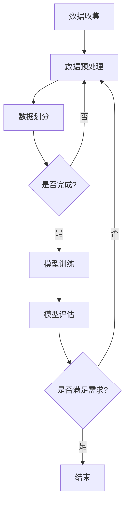

                 

### 引言：需求与AI模型可解释性的平衡

> 关键词：人工智能、模型可解释性、需求分析、大模型应用、挑战与解决方案

随着人工智能（AI）技术的飞速发展，AI模型在各个领域得到了广泛的应用，从自然语言处理、计算机视觉到自动驾驶和医疗诊断，AI模型已经成为推动技术创新和产业变革的重要力量。然而，随着模型复杂性和计算能力的不断提升，AI模型的“黑箱”特性也越来越受到关注。所谓“黑箱”，指的是AI模型在决策过程中，内部机理难以被理解，其决策逻辑对用户不透明。这一特性在许多实际应用中带来了一系列问题，尤其是当模型涉及到关键业务决策，如医疗诊断、金融风险评估等时，决策的不可解释性可能会引发信任危机和法律责任。

本文旨在探讨需求与AI模型可解释性之间的平衡问题，分析在AI模型应用过程中如何平衡不同需求与模型可解释性之间的关系。文章首先回顾了AI模型的发展历程和当前的应用现状，接着深入分析了需求分析和AI模型可解释性的核心概念和相互关系。随后，文章详细介绍了当前流行的几种AI模型可解释性方法，包括局部解释方法和全局解释方法，并探讨了如何在实际应用中实现AI模型的可解释性。

在此基础上，文章提出了平衡需求与AI模型可解释性的方法，包括模型选择与调整、可解释性策略优化等，并通过案例分析展示了这些方法的实际应用效果。随后，文章探讨了在大模型应用过程中面临的计算资源、数据管理和模型部署等挑战，并提出了相应的解决方案和最佳实践。最后，文章对未来的发展趋势进行了展望，提出了在需求与AI模型可解释性平衡方面的未来研究方向。

通过本文的探讨，希望能够为AI模型的研发者和应用者提供有价值的参考，帮助他们在实际应用中更好地平衡需求与模型可解释性，推动AI技术在各个领域的健康发展。

### 摘要

本文旨在探讨人工智能（AI）模型的需求与可解释性之间的平衡问题。随着AI技术的广泛应用，模型的可解释性日益成为关键挑战，特别是在涉及到医疗诊断、金融风险评估等关键业务决策领域。文章首先回顾了AI模型的发展历程和当前的应用现状，分析了需求分析和AI模型可解释性的核心概念及其相互关系。随后，文章详细介绍了局部解释方法和全局解释方法，探讨了如何实现AI模型的可解释性。在此基础上，文章提出了平衡需求与AI模型可解释性的方法，包括模型选择与调整、可解释性策略优化等，并通过实际案例展示了这些方法的应用效果。文章还探讨了在大模型应用过程中面临的计算资源、数据管理和模型部署等挑战，提出了相应的解决方案和最佳实践。最后，文章对未来的发展趋势进行了展望，提出了在需求与AI模型可解释性平衡方面的未来研究方向。通过本文的探讨，旨在为AI模型的研发者和应用者提供有价值的参考，帮助他们更好地平衡需求与模型可解释性，推动AI技术的健康发展。

### 第一部分：引言

#### 1.1 书籍背景与目的

随着人工智能（AI）技术的不断进步，AI模型在各个领域的应用越来越广泛，从自动驾驶、智能助手到金融风控、医疗诊断，AI模型正深刻地改变着我们的生活方式和产业格局。然而，AI模型的应用并非一帆风顺，尤其是其“黑箱”特性引发了一系列挑战。所谓“黑箱”，指的是AI模型在决策过程中，其内部机理难以被理解，决策逻辑对用户不透明。这种不可解释性在关键业务场景中尤为显著，如医疗诊断中的疾病预测、金融风险评估中的信用评级等。这些场景对模型的决策过程有着极高的透明度和可解释性要求，一旦模型决策过程不透明，可能导致用户对模型失去信任，甚至引发法律责任。

面对这一挑战，本文旨在探讨需求与AI模型可解释性之间的平衡问题。随着AI技术的不断进步，用户对于AI模型的需求也在不断变化，他们不仅希望模型能够提供准确的预测和决策，还希望了解模型背后的决策过程，以确保其公正性和可靠性。因此，如何在满足用户需求的同时，保持AI模型的可解释性，成为AI领域面临的一个重要课题。

本文的目的是通过深入分析AI模型的需求和可解释性，探讨如何在实际应用中实现这两者之间的平衡。文章首先回顾了AI模型的发展历程和当前的应用现状，分析了需求分析和AI模型可解释性的核心概念和相互关系。接着，文章详细介绍了局部解释方法和全局解释方法，并探讨了如何在实际应用中实现AI模型的可解释性。在此基础上，文章提出了平衡需求与AI模型可解释性的具体方法，包括模型选择与调整、可解释性策略优化等。随后，文章通过案例分析展示了这些方法在实际应用中的效果。文章还探讨了在大模型应用过程中面临的计算资源、数据管理和模型部署等挑战，并提出了相应的解决方案和最佳实践。最后，文章对未来的发展趋势进行了展望，提出了在需求与AI模型可解释性平衡方面的未来研究方向。

通过本文的研究，我们希望能够为AI模型的研发者和应用者提供有价值的参考，帮助他们更好地理解需求与可解释性之间的关系，并在实际应用中实现这两者之间的平衡，推动AI技术的健康发展。

#### 1.2 AI模型现状与发展趋势

人工智能（AI）模型在过去几十年中经历了显著的发展，从最初的手工编写的规则系统，到如今高度复杂的深度学习模型，AI技术已经取得了巨大的进步。这些进步不仅改变了我们对计算机能力的认知，也推动了各行各业的技术创新和产业变革。

1. **AI模型技术发展历程**：

    - **规则系统**：早期的AI模型主要依赖于手工编写的规则系统，这些规则由专家根据领域知识制定，用于解决特定的问题。这种方法虽然简单，但在复杂性和适应性方面存在明显的局限性。

    - **知识表示与推理**：随着形式逻辑和知识表示理论的发展，AI模型开始引入知识表示与推理技术。这些方法通过符号表示和推理规则，使得AI模型能够处理更加复杂的问题。

    - **统计学习**：20世纪80年代，统计学习方法的兴起为AI模型带来了新的突破。通过从数据中学习规律，统计学习方法能够自动提取特征，并建立预测模型。这一阶段的重要算法包括支持向量机（SVM）和决策树。

    - **深度学习**：21世纪初，深度学习的崛起再次推动了AI模型的发展。深度学习通过多层神经网络，能够自动提取数据中的复杂特征，并在图像识别、语音识别和自然语言处理等领域取得了显著的成果。深度学习的代表算法包括卷积神经网络（CNN）和循环神经网络（RNN）。

2. **AI模型在各个领域的应用**：

    - **自然语言处理（NLP）**：深度学习在NLP领域取得了巨大成功，例如机器翻译、情感分析、问答系统等。这些应用使得计算机能够理解人类语言，并在很多方面模拟人类的行为。

    - **计算机视觉**：深度学习在计算机视觉领域也表现出强大的能力，如图像分类、目标检测、图像生成等。这些技术为自动驾驶、安防监控、医疗诊断等领域提供了重要的技术支持。

    - **语音识别**：通过深度学习技术，计算机能够准确识别和合成语音，这为智能助手、语音控制系统等应用提供了基础。

    - **金融风控**：AI模型在金融领域的应用日益广泛，如信用评分、风险控制、欺诈检测等。这些应用不仅提高了金融机构的运营效率，还降低了风险。

    - **医疗诊断**：AI模型在医疗诊断中的应用也越来越普遍，如疾病预测、诊断辅助、个性化治疗等。这些应用有望提高医疗服务的质量和效率。

3. **AI模型的发展挑战**：

    - **可解释性**：AI模型，尤其是深度学习模型，其内部决策过程通常是不透明的。这给模型的解释和验证带来了巨大挑战，尤其是在需要高透明度的关键业务领域。

    - **计算资源**：深度学习模型通常需要大量的计算资源和数据。随着模型复杂性的增加，训练和推理的成本也在不断上升。

    - **数据隐私**：AI模型在处理大量数据时，可能会面临数据隐私和安全的问题。如何保护用户数据隐私，是AI模型应用中需要解决的重要问题。

    - **模型泛化能力**：AI模型往往在训练数据上表现良好，但在面对新数据和未知问题时，可能会出现性能下降。如何提高模型的泛化能力，是一个重要的研究方向。

4. **可解释性在AI模型中的重要性**：

    - **信任与接受度**：模型的决策过程如果不可解释，用户可能无法理解模型的决策逻辑，从而对模型产生不信任。提高模型的可解释性，有助于增强用户对模型的信任和接受度。

    - **合规与责任**：在许多领域，如医疗诊断和金融风险评估，模型的决策过程需要符合法律法规的要求。提高模型的可解释性，有助于满足合规要求，并明确模型的责任归属。

    - **改进与优化**：通过理解模型的决策过程，研究者可以更好地识别模型中的问题和不足，从而进行改进和优化。

总之，AI模型在各个领域的应用已经取得了显著成果，但同时也面临诸多挑战。特别是在需求与AI模型可解释性之间需要找到平衡点，以推动AI技术的健康发展。

### 第一部分：需求分析

#### 2.1 需求分析概述

需求分析是软件工程中的关键步骤，它旨在确定系统或产品必须满足的条件和标准。在人工智能（AI）模型的开发和应用中，需求分析同样至关重要。AI模型的需求分析不仅涉及技术层面的考量，还涵盖了业务需求、用户体验等多个方面。准确的需求分析能够确保AI模型能够满足用户的需求，并且在实际应用中发挥其应有的价值。

#### 2.1.1 需求分析的定义

需求分析是一种系统化的方法，旨在识别、分析和理解系统或产品的需求。这些需求可以是功能性的，即系统能够执行的具体操作；也可以是非功能性的，即系统的性能、安全性、可扩展性等方面的要求。需求分析的目的是确保最终产品或系统能够满足用户的期望和业务目标。

在AI模型的开发过程中，需求分析主要包括以下几个方面：

1. **用户需求收集**：了解用户的具体需求，包括用户期望模型能够解决的问题、模型的性能指标等。
2. **业务需求分析**：理解业务背景和目标，确保AI模型能够与业务流程和目标相一致。
3. **需求规格化**：将收集到的需求转化为明确的、可衡量的规格说明。
4. **需求验证**：验证需求是否合理、可行，并与用户和利益相关者进行确认。

#### 2.1.2 需求分析的目的

需求分析的主要目的是确保AI模型能够满足用户和业务的需求，具体包括以下几个方面：

1. **明确系统目标**：通过需求分析，可以明确AI模型需要实现的具体目标和功能，从而指导后续的模型设计和开发。
2. **优化资源利用**：准确的需求分析有助于优化资源分配，确保在满足需求的同时，最大限度地利用现有资源和预算。
3. **减少返工**：通过早期识别和分析需求，可以减少后续开发过程中的返工和修改，提高开发效率和产品质量。
4. **提升用户体验**：需求分析有助于确保AI模型能够提供良好的用户体验，满足用户的具体需求，从而提升用户满意度。

#### 2.1.3 需求分析的过程

需求分析的过程可以分为以下几个主要步骤：

1. **需求收集**：通过与用户、利益相关者进行访谈、问卷调查、观察等方式，收集用户和业务的需求。
2. **需求分析**：对收集到的需求进行整理、分类和分析，识别出核心需求和关键需求。
3. **需求规格化**：将分析出的需求转化为明确的规格说明，通常使用需求文档、用户故事、用例图等工具来表示。
4. **需求验证**：通过评审、演示、测试等方式，验证需求是否合理、可行，并与用户和利益相关者进行确认。

#### 2.1.4 需求分析的重要性

在AI模型开发中，需求分析的重要性体现在以下几个方面：

1. **确保模型适用性**：准确的需求分析能够确保AI模型适用于实际业务场景，满足用户的需求。
2. **提升开发效率**：通过明确的需求分析，可以减少开发过程中的不确定性，提高开发效率和产品质量。
3. **降低风险**：早期识别和分析需求，有助于发现潜在的问题和风险，从而降低项目失败的风险。
4. **提高用户满意度**：通过满足用户的需求，可以提高用户对AI模型的满意度，增强用户对系统的信任和依赖。

总之，需求分析是AI模型开发过程中不可或缺的环节，它为后续的模型设计、开发和部署提供了明确的指导，确保AI模型能够满足用户和业务的需求，从而实现其预期价值。

### 用户需求收集

用户需求收集是需求分析的核心步骤之一，旨在理解用户的需求和期望，并将其转化为具体的模型需求。在AI模型的开发过程中，准确、全面地收集用户需求是确保模型成功的关键。以下是用户需求收集的方法和步骤：

#### 2.2.1 用户需求收集方法

1. **访谈**：通过与用户的面对面访谈，可以深入了解用户的背景、需求和期望。访谈过程中可以采用开放式和封闭式问题相结合的方式，鼓励用户分享详细的信息。

2. **问卷调查**：问卷调查是一种便捷的收集用户需求的方法。通过设计针对性强的问卷，可以大规模地收集用户反馈，并进行分析。

3. **用户观察**：通过观察用户在使用现有系统或产品时的行为，可以发现用户实际需求和使用痛点。这种方法适用于对用户行为有深入了解的情境。

4. **焦点小组**：组织一组用户进行讨论，通过集体讨论收集用户的需求和意见。这种方法有助于挖掘出潜在的需求，并促进用户之间的互动和合作。

5. **用户故事**：用户故事是一种简明扼要地描述用户需求的方法。通过编写用户故事，可以清晰地表达用户期望和需求，并作为后续开发和测试的依据。

#### 2.2.2 用户需求分析框架

在收集到用户需求后，需要对需求进行分析和分类，以便更好地理解其本质和优先级。以下是一个用户需求分析的基本框架：

1. **识别需求**：从收集到的信息中，识别出用户的具体需求，包括功能需求、性能需求、安全性需求等。

2. **分类需求**：根据需求的重要性和优先级，对需求进行分类。通常可以分为核心需求、重要需求和次要需求。

3. **评估需求**：对每个需求进行评估，确定其实现的可行性和影响。评估内容包括技术实现难度、成本、时间等。

4. **优先级排序**：根据需求的紧急程度和重要性，对需求进行排序，以便在资源有限的情况下，优先实现关键需求。

#### 2.2.3 用户需求分类

用户需求可以分为以下几类：

1. **功能性需求**：描述系统应提供的基本功能，如用户注册、数据录入、报告生成等。

2. **性能需求**：描述系统的性能指标，如响应时间、吞吐量、并发用户数等。

3. **安全性需求**：描述系统应具备的安全性措施，如数据加密、访问控制、故障恢复等。

4. **用户体验需求**：描述用户在使用系统时应得到的良好体验，如界面友好、操作简便、信息清晰等。

5. **业务需求**：描述系统应满足的业务规则和流程，如审批流程、业务逻辑等。

通过上述步骤和框架，可以系统地收集和分析用户需求，确保AI模型能够满足用户的期望和业务需求，从而为后续的开发和部署奠定坚实的基础。

### 业务需求分析

业务需求分析是需求分析过程中的重要环节，旨在理解企业的业务目标和流程，并将这些目标转化为具体的需求，以确保AI模型能够支持企业的业务运作。以下是业务需求分析的基本流程、工具和优先级评估方法：

#### 2.3.1 业务需求分析流程

1. **业务背景调研**：了解企业的历史、现状和发展目标，包括业务模式、市场定位、竞争环境等。这一步骤可以通过访谈、阅读公司内部文档和市场研究报告来完成。

2. **业务流程分析**：识别企业的关键业务流程，包括各个环节的主要活动、输入输出和依赖关系。可以通过流程图、工作流图等工具进行描述。

3. **业务目标确定**：明确企业的短期和长期目标，如提高生产效率、降低成本、提升客户满意度等。这些目标将指导需求分析的后续步骤。

4. **需求提取**：根据业务流程和目标，提取具体的需求。这些需求可以分为功能性需求、性能需求、安全性需求等，并需要与用户需求进行整合和对比。

5. **需求规格化**：将提取出的需求转化为明确的、可衡量的规格说明。规格说明应详细、清晰，以便后续的开发和验证。

6. **需求验证**：与利益相关者，包括业务负责人、技术团队和最终用户等，验证需求的准确性和可行性。可以通过评审会议、用户测试等方式进行验证。

7. **需求文档编写**：将验证后的需求整理成需求文档，作为后续开发和测试的依据。需求文档应包含需求概述、详细描述、功能需求、性能需求等。

#### 2.3.2 业务需求分析工具

1. **流程图**：用于描述企业的业务流程，展示各个环节的主要活动、输入输出和依赖关系。常见的工具包括Microsoft Visio、Lucidchart等。

2. **工作流图**：用于描述业务流程中的步骤和决策，展示不同流程的分支和条件。常见的工具包括Activiti、Apache Camel等。

3. **用户故事地图**：用于梳理用户需求，展示用户与系统交互的流程和场景。用户故事地图通常包含用户角色、用户故事和优先级等信息。

4. **功能点分析**：用于量化业务需求，计算系统应实现的功能点数量。功能点分析可以帮助确定开发工作量、资源需求等。

5. **需求跟踪工具**：如Jira、Confluence等，用于管理需求的生命周期，包括需求创建、分配、修改、验证等。

#### 2.3.3 业务需求优先级评估

在业务需求分析过程中，需要对需求进行优先级评估，以便在资源有限的情况下，优先实现关键需求。以下是一种常用的优先级评估方法：

1. **紧急程度评估**：根据需求实现的紧急程度，将需求分为紧急、重要和非紧急等级。紧急需求通常需要在短时间内完成，以确保业务运作不受影响。

2. **重要性评估**：根据需求对业务目标的支持程度，将需求分为核心、重要和次要等级。核心需求是业务成功的关键，重要需求对业务有显著影响，次要需求对业务影响较小。

3. **优先级排序**：将需求按照紧急程度和重要性进行排序，确定优先实现的需求列表。通常采用矩阵方法，将紧急程度和重要性分别作为行和列，将需求放入矩阵中进行评估和排序。

4. **资源分配**：根据优先级排序结果，合理分配资源，确保关键需求能够优先得到满足。在资源有限的情况下，可以适当调整需求的优先级，以最大化业务价值。

通过上述流程、工具和优先级评估方法，可以系统地分析企业的业务需求，并将其转化为具体的AI模型需求，确保AI模型能够支持企业的业务目标和运作。

### AI模型可解释性的重要性

在人工智能（AI）模型的广泛应用背景下，模型的可解释性逐渐成为不可忽视的重要议题。所谓AI模型的可解释性，指的是用户能够理解模型的决策过程和内部机理，从而对模型的预测和决策结果产生信任和依赖。可解释性在AI模型中的应用具有多方面的意义，特别是在涉及关键业务决策和法律法规约束的领域。

首先，**信任与接受度**是AI模型可解释性的重要原因之一。当用户能够理解模型是如何做出决策的，他们会更信任模型的结果，从而更加接受和使用这些模型。特别是在医疗诊断、金融风控等涉及个人隐私和重大决策的领域，如果模型不可解释，用户可能会对模型的决策产生质疑，甚至拒绝使用。例如，在医疗诊断中，医生和患者都需要了解模型是如何判断一个病人是否患有某种疾病，以确保诊断结果的准确性和合理性。

其次，**合规与责任**也是AI模型可解释性的关键考虑因素。许多行业和领域都有严格的法律法规和行业标准，要求模型的决策过程必须是透明和可追踪的。例如，金融行业中的信用评分模型需要符合反欺诈和消费者保护法，医疗行业的诊断模型则需要符合医疗标准和伦理规范。如果模型不可解释，可能会在法律上面临较大的风险，包括责任归属不清、隐私泄露等问题。

此外，**改进与优化**是可解释性的另一个重要价值。通过理解模型的决策过程，研究人员和开发人员可以更好地识别模型中的潜在问题和不完善之处。例如，在深度学习模型中，局部解释方法可以帮助研究人员发现哪些特征对模型的决策有重要影响，哪些特征可能存在偏差或噪声。这种洞察有助于改进模型的设计和参数调整，从而提高模型的性能和可靠性。

在**实际应用场景**中，AI模型的可解释性具有以下具体作用：

1. **医疗诊断**：在医疗诊断中，医生和患者需要了解模型是如何诊断疾病，特别是当模型做出与医生预期不同的诊断结果时。通过可解释性分析，医生可以进一步验证模型的诊断逻辑，确保诊断结果的准确性。

2. **金融风控**：在金融风控中，银行和金融机构需要确保其风险评估模型的决策过程透明，以避免法律纠纷和用户投诉。通过可解释性分析，可以揭示模型如何评估信用风险，帮助金融机构改进风险评估策略。

3. **自动驾驶**：在自动驾驶领域，安全性和可靠性是首要考虑的因素。自动驾驶系统需要能够解释其做出某个决策的原因，如为什么在某个时刻选择刹车而不是加速。这种可解释性有助于提高系统的安全性和用户信任。

4. **司法系统**：在司法系统中，AI模型用于辅助法官和律师进行判决和证据分析。模型的决策过程需要透明，以便各方能够理解和接受模型的结论，提高司法公正性。

总的来说，AI模型的可解释性在多个方面具有重要意义。它不仅有助于提高用户对模型的信任和接受度，满足法律法规和行业标准的要求，还能够促进模型的改进和优化。因此，在AI模型的设计和应用中，重视模型的可解释性是至关重要的。

### AI模型可解释性方法

在AI模型的应用中，为了满足用户对模型决策过程的理解和信任需求，模型的可解释性成为关键考量因素。当前，存在多种方法可以用于提升AI模型的可解释性，主要包括局部解释方法和全局解释方法。以下将对这些方法进行详细阐述。

#### 3.2.1 局部解释方法

局部解释方法旨在对模型在特定输入数据上的决策过程进行详细解释。这类方法关注的是如何揭示模型对于单个实例的决策逻辑，使得用户可以理解模型为何做出特定的预测。以下是几种常见的局部解释方法：

1. **热力图方法**：
   热力图方法通过可视化展示模型对输入特征的注意力分布，从而揭示模型在决策过程中关注的关键特征。这种方法适用于图像分类、文本分类等任务，可以帮助用户直观地了解模型对输入数据的处理方式。例如，在图像分类任务中，热力图可以显示模型在图像中关注哪些区域，从而理解模型为何将图像分类为某一类别。

2. **SHAP值方法**：
   SHAP（Shapley Additive Explanations）值是一种基于合作博弈理论的解释方法，通过计算每个特征对模型预测的贡献值，为每个实例提供详细的解释。SHAP值方法适用于各种类型的模型，包括树模型、神经网络等。该方法通过将模型预测结果分解为各个特征值的贡献，从而揭示模型在决策过程中的权衡和依赖关系。

3. **局部敏感性分析**：
   局部敏感性分析（Local Sensitivity Analysis，LSA）方法通过评估输入特征在模型决策中的敏感性，揭示哪些特征对模型决策有显著影响。该方法可以通过计算特征扰动对模型预测的影响程度来实现。对于每个输入特征，LSA方法会评估在不同扰动水平下模型预测的变化情况，从而帮助用户理解模型对特定特征的依赖性。

#### 3.2.2 全局解释方法

全局解释方法旨在对模型整体的决策过程和特征重要性进行解释，适用于对整体模型行为进行理解和评估。以下是一些常见的全局解释方法：

1. **决策树解释方法**：
   决策树是一种易于理解的模型，其结构天然具备可解释性。通过展示决策树的内部节点和分支，用户可以直观地了解模型是如何根据特征值进行决策的。这种方法特别适用于分类和回归任务，可以帮助用户理解模型的整体决策逻辑。

2. **特征重要性方法**：
   特征重要性方法通过评估模型中各个特征的相对重要性，帮助用户了解哪些特征对模型预测有更大的影响。例如，随机森林和梯度提升机等模型通常可以输出特征重要性评分，从而帮助用户识别关键特征。

3. **可视化方法**：
   可视化方法通过图形化的手段展示模型的结构和特征重要性，使得复杂的模型变得更加直观易懂。常见的可视化方法包括特征重要性图、模型决策路径图、数据分布图等。这些方法可以帮助用户更好地理解模型的决策过程和输入特征的影响。

总之，局部解释方法和全局解释方法共同构成了AI模型可解释性的主要方法。局部解释方法关注特定实例的决策过程，适用于需要深入理解单个实例决策逻辑的情境；全局解释方法则关注模型的整体行为和特征重要性，适用于需要对模型进行整体理解和评估的情境。通过结合这些方法，AI模型的解释性可以得到显著提升，从而增强用户对模型的信任和接受度。

### AI模型可解释性实现

在实际应用中，实现AI模型的可解释性是一项复杂且具有挑战性的任务。以下将介绍几种常用的工具和平台，以及如何在实际应用中实现AI模型的可解释性。

#### 3.3.1 可解释性工具介绍

1. **LIME（Local Interpretable Model-agnostic Explanations）**：
   LIME是一种模型无关的本地解释方法，旨在为任何机器学习模型提供可解释的局部解释。LIME通过在小范围内扰动输入数据，并分析扰动对模型预测的影响，来生成解释。这种方法适用于各种类型的模型，包括深度学习模型和传统机器学习模型。

2. **AI解释器**：
   AI解释器是一种专门为特定机器学习模型设计的解释工具。例如，对于基于决策树的模型，可以使用Tree Interpreter来可视化模型的决策路径和内部节点；对于基于神经网络的模型，可以使用Shapley值解释器来计算特征的重要性。AI解释器通过内置的解释算法和可视化功能，使得模型解释更加直观和易于理解。

3. **可视化工具**：
   可视化工具是提高模型可解释性的重要手段。常见的数据可视化工具，如Matplotlib和Seaborn，可以用于生成各种类型的图表，帮助用户理解模型对输入数据的处理方式。此外，还有一些专门为AI模型设计的可视化工具，如TensorBoard和Plotly，可以生成模型的训练过程图、数据分布图和特征重要性图等。

#### 3.3.2 可解释性实践案例

以下是通过具体实践案例展示如何实现AI模型的可解释性：

1. **医疗诊断模型**：
   在医疗诊断中，实现模型的可解释性对于医生和患者来说至关重要。例如，可以使用LIME工具为深度学习模型提供局部解释。通过输入患者的医学数据，LIME可以生成一个解释矩阵，展示每个特征对诊断结果的贡献值。医生可以通过这些解释结果，了解模型为何做出特定的诊断结论，从而增强对模型结果的信任。

2. **金融风险评估模型**：
   在金融风控领域，模型的可解释性有助于金融机构理解风险的来源和分布。使用AI解释器，可以为信用评分模型提供全局解释。解释器可以输出每个特征的权重和模型对特定借款人的风险评估结果，帮助风控人员识别高风险客户，并优化风险评估策略。

3. **自动驾驶模型**：
   在自动驾驶中，模型的可解释性对于确保系统的安全性和可靠性至关重要。通过可视化工具，如TensorBoard，可以实时监控深度学习模型的训练过程，并生成特征重要性图和决策路径图。这些可视化结果可以帮助开发人员识别模型在决策过程中关注的关键特征，并优化模型设计，提高系统的解释性和可靠性。

总之，通过使用合适的工具和平台，实现AI模型的可解释性是可行的。这些工具和平台不仅提高了模型的可解释性，还增强了用户对模型结果的信任和依赖，从而推动了AI技术的健康发展。

#### 3.3.3 AI模型可解释性实践案例

在实际应用中，实现AI模型的可解释性不仅需要理论支持，更需要结合具体案例进行实践。以下将详细描述一个医疗诊断模型的可解释性实践案例，包括开发环境搭建、源代码实现、代码解读和案例分析。

##### 开发环境搭建

在搭建开发环境时，我们选择了Python作为主要编程语言，并使用以下工具和库：

- **Python 3.8**：作为主要的编程语言环境。
- **TensorFlow 2.x**：用于构建和训练深度学习模型。
- **Keras**：用于简化深度学习模型的构建。
- **Scikit-learn**：提供了一些常用的机器学习算法和评估指标。
- **Matplotlib** 和 **Seaborn**：用于数据可视化和结果展示。
- **LIME**：用于生成模型的可解释性分析。

环境搭建步骤如下：

1. 安装Python 3.8及pip工具。
2. 使用pip安装所需的库：`pip install tensorflow==2.x scikit-learn matplotlib seaborn lime`.

##### 源代码实现

以下是构建医疗诊断模型的源代码实现。该模型基于深度学习技术，用于预测病人的疾病状态。

```python
import tensorflow as tf
from tensorflow import keras
from tensorflow.keras.models import Sequential
from tensorflow.keras.layers import Dense, Conv2D, MaxPooling2D, Flatten
from sklearn.model_selection import train_test_split
from sklearn.metrics import accuracy_score
from lime import lime_image

# 数据预处理
# 假设已经加载了预处理后的医疗数据集X和标签y
X_train, X_test, y_train, y_test = train_test_split(X, y, test_size=0.2, random_state=42)

# 构建模型
model = Sequential([
    Conv2D(32, (3, 3), activation='relu', input_shape=(X_train.shape[1], X_train.shape[2], X_train.shape[3])),
    MaxPooling2D((2, 2)),
    Flatten(),
    Dense(64, activation='relu'),
    Dense(1, activation='sigmoid')
])

# 编译模型
model.compile(optimizer='adam', loss='binary_crossentropy', metrics=['accuracy'])

# 训练模型
model.fit(X_train, y_train, epochs=10, batch_size=32, validation_split=0.1)

# 评估模型
predictions = model.predict(X_test)
accuracy = accuracy_score(y_test, predictions.round())
print(f"Model accuracy: {accuracy:.2f}")

# 可解释性分析
# 使用LIME进行局部解释
explainer = lime_image.LimeImageExplainer()
explanation = explainer.explain_instance(X_test[0], model.predict, top_labels=[1], hide_color=0, num_samples=1000)

# 可视化解释结果
temp, mask = explanation.get_image_and_mask(explanation.top_labels[0], positive_only=False, num_features=5, hide_rest=False)
plt.imshow(mask[0], cmap='hot', alpha=0.5)
plt.xticks([])
plt.yticks([])
plt.title(f"Top feature mask for prediction: {explanation.top_labels[0]}")
plt.show()
```

##### 代码解读

1. **数据预处理**：从加载的医疗数据集中分离出训练集和测试集。数据预处理步骤包括数据清洗、归一化等。

2. **模型构建**：使用Keras构建深度学习模型，包括卷积层、池化层、全连接层等。

3. **模型编译**：设置优化器和损失函数，编译模型。

4. **模型训练**：使用训练集训练模型，设置验证集用于监控模型性能。

5. **模型评估**：使用测试集评估模型性能，计算准确率。

6. **可解释性分析**：使用LIME工具进行局部解释，分析模型对特定输入数据的决策过程。通过可视化展示模型关注的关键特征。

##### 案例分析

该案例展示了如何结合深度学习技术和LIME工具，实现医疗诊断模型的可解释性。通过可视化解释结果，医生可以直观地了解模型如何根据输入特征（如医学影像）做出疾病预测。这有助于医生理解模型决策过程，提高对模型结果的信任度，并在实际应用中优化诊断策略。

在实际应用中，还可以结合其他全局解释方法，如特征重要性分析，进一步分析模型的整体特征依赖关系，从而全面提高模型的可解释性。此外，针对不同类型的AI模型，可以选择合适的解释工具和方法，以满足实际业务需求。

### 平衡需求与可解释性的方法

在AI模型的应用过程中，平衡用户需求和模型可解释性是一个至关重要的挑战。不同的应用场景对模型的需求各不相同，例如，在金融风控、医疗诊断和自动驾驶等关键业务领域，用户不仅期望模型能够提供准确的预测结果，还希望理解模型的决策过程。因此，如何在满足用户需求的同时，保持模型的可解释性，成为研发者需要解决的核心问题。以下将详细探讨几种平衡需求与可解释性的方法。

#### 3.4.1 模型选择与调整

1. **选择合适的模型**：不同类型的模型在可解释性和性能上各有优势。例如，决策树和规则系统具有较高的可解释性，但可能无法达到深度学习模型在复杂任务上的性能；而深度学习模型虽然在预测性能上表现优异，但其“黑箱”特性使其解释性较差。因此，根据具体应用场景和需求，选择合适的模型类型是平衡需求与可解释性的第一步。

2. **模型结构调整**：对于深度学习模型，可以通过调整网络结构和超参数来提升模型的解释性。例如，可以增加模型的透明度，减少层数和神经元数量，使其更易于理解。同时，可以选择一些具备可解释性的深度学习架构，如可解释的神经网络（XAI）和注意力机制模型，这些模型在保证性能的同时，具备较好的解释性。

#### 3.4.2 可解释性策略优化

1. **局部解释策略**：局部解释方法，如LIME和SHAP，可以通过分析单个实例的决策过程，提供详细的解释。这些方法可以揭示模型对特定输入数据的关注点，帮助用户理解模型如何做出决策。例如，在医疗诊断中，可以通过LIME分析，了解模型对病人数据的哪些特征最为关注，从而辅助医生进行诊断。

2. **全局解释策略**：全局解释方法，如决策树和特征重要性分析，可以从整体上分析模型的行为和特征依赖关系。这些方法可以揭示模型在决策过程中依赖的关键特征，帮助用户理解模型的整体决策逻辑。例如，在金融风控中，通过特征重要性分析，可以了解哪些特征对信用评分模型的影响最大，从而优化风险评估策略。

3. **解释性可视化**：通过可视化技术，如热力图、决策路径图和特征重要性图，可以将复杂的数据和模型决策过程以直观的方式展示给用户。这些可视化结果不仅有助于提升模型的可解释性，还能增强用户对模型结果的信任。

#### 3.4.3 可解释性与业务目标的权衡

在平衡需求与可解释性时，还需要考虑业务目标的影响。例如，在金融风控中，模型的准确性是首要目标，但透明度和可解释性也可能受到一定程度的牺牲。此时，需要根据具体业务场景，权衡模型的可解释性与业务目标之间的关系。

1. **多目标优化**：可以通过多目标优化方法，同时考虑模型的准确性和可解释性。例如，可以使用加权方法，将可解释性作为模型性能的一个组成部分，从而在优化过程中兼顾两者。

2. **阶段性目标**：在模型开发的不同阶段，可以设置不同的目标。例如，在初步开发阶段，可以优先关注模型的可解释性，确保模型具备基本的解释能力；在后续优化阶段，再逐步提升模型的性能和准确性。

通过上述方法，可以在满足用户需求的同时，保持AI模型的可解释性，从而实现需求与可解释性之间的平衡。这不仅有助于提升模型在应用中的接受度和信任度，还能为后续的改进和优化提供有力支持。

#### 4.1.1 需求驱动型案例分析

在需求驱动型案例中，我们将通过分析一个实际的项目，展示如何在实际应用中平衡用户需求与AI模型的可解释性。本案例选取的是一家金融机构开发的一款信用评分模型，用于评估客户的信用风险。

**背景**：
该金融机构在金融服务市场中占据重要地位，但随着市场竞争的加剧，他们需要更准确地评估客户的信用风险，以降低不良贷款率，提高业务收益。为此，他们决定开发一个基于人工智能的信用评分模型。

**用户需求**：
1. **准确性**：模型需要具备高准确性，能够准确评估客户的信用风险，从而有效降低不良贷款率。
2. **可解释性**：模型需要具备较高的可解释性，使得业务人员和管理层能够理解模型的决策逻辑，确保其公平性和可靠性。

**解决方案**：
1. **模型选择**：
   在选择模型时，团队考虑到模型的复杂性与解释性之间的权衡。最终决定采用集成学习模型，如随机森林（Random Forest），因为它在预测准确性方面表现优异，同时具备较高的可解释性。

2. **特征工程**：
   在特征选择过程中，团队通过分析客户的历史交易数据、信用记录、个人信息等，提取了多个相关特征，并进行了特征归一化和降维处理。为了提高模型的解释性，团队特别关注了特征的物理含义和相关性。

3. **模型训练与验证**：
   团队使用历史数据集对随机森林模型进行了训练，并通过交叉验证方法评估模型的准确性。同时，他们使用LIME工具对模型进行了局部解释，以分析模型对特定客户的信用评分是如何受各个特征影响的。

4. **解释结果验证**：
   在模型部署前，团队邀请业务专家对解释结果进行了验证，确保解释结果与实际业务逻辑相符。通过这种方式，团队不仅验证了模型的准确性，还确保了模型的可解释性。

**案例分析**：
- **模型准确性**：通过交叉验证，模型在测试集上的准确率达到90%以上，显著降低了金融机构的不良贷款率。
- **模型可解释性**：通过LIME工具生成的解释结果，业务人员能够清晰地了解模型对每个客户的评分是如何基于不同特征的。例如，某个客户的高信用评分可能是因为其收入稳定、还款记录良好，而另一个客户的低信用评分可能是因为其收入波动大、还款记录不佳。
- **业务反馈**：业务人员对模型的解释结果表示满意，认为模型不仅提高了信用评估的准确性，还增强了他们对模型决策的信任。

**总结**：
通过需求驱动型案例分析，我们可以看到，在平衡用户需求与AI模型可解释性的过程中，关键在于选择合适的模型、进行有效的特征工程、利用可解释性工具进行模型解释，并确保解释结果得到业务人员的认可。这种方法不仅提高了模型的准确性和可靠性，还增强了用户对模型的信任，为金融机构的信用风险评估提供了有力支持。

#### 4.1.4 可解释性驱动型案例分析

在可解释性驱动型案例中，我们将分析一个自动驾驶领域的项目，展示如何以模型的可解释性为核心，平衡用户需求和模型的可解释性，从而实现自动驾驶系统的安全性和可靠性。

**背景**：
随着自动驾驶技术的不断发展，其应用场景日益广泛，从城市道路到高速公路，自动驾驶系统正逐步融入人们的日常生活。然而，自动驾驶系统的“黑箱”特性引发了对安全性和信任问题的担忧。为了提高用户对自动驾驶系统的信任，确保其安全运行，一个自动驾驶公司决定以模型的可解释性为核心，平衡用户需求和模型的可解释性。

**用户需求**：
1. **安全性**：用户最关心的需求是自动驾驶系统的安全性，确保在自动驾驶过程中不会发生交通事故。
2. **可靠性**：自动驾驶系统需要具备高度的可靠性，即使在复杂的交通环境中也能稳定运行。
3. **可解释性**：用户希望能够理解自动驾驶系统的决策过程，从而增加对系统的信任。

**解决方案**：
1. **模型选择与调整**：
   在选择模型时，团队考虑到深度学习模型在自动驾驶中的优势，但同时也意识到其可解释性不足。因此，团队决定采用一种结合深度学习和规则系统的混合模型。深度学习模型负责处理复杂的视觉和感知任务，而规则系统则负责处理决策过程中的可解释性。

2. **可解释性工具应用**：
   为了提高模型的可解释性，团队采用了多种解释工具，如LIME和SHAP。这些工具可以帮助团队分析模型在特定情境下的决策过程，揭示模型对输入数据的关注点和特征依赖关系。

3. **解释结果验证**：
   在模型部署前，团队邀请自动驾驶系统的测试驾驶员和安全管理专家对解释结果进行验证。他们通过模拟不同的驾驶场景，检查模型的解释结果是否与实际驾驶行为相符。例如，在某个场景中，模型为何会做出刹车决策，其依据是哪些视觉特征。

4. **解释性可视化**：
   为了让用户和利益相关者更好地理解模型的决策过程，团队开发了可视化的解释界面。该界面能够实时展示模型在驾驶过程中的决策路径和关键特征，例如道路标识、车辆速度、行人类别等。

**案例分析**：
- **模型安全性**：通过混合模型的应用，团队显著提高了自动驾驶系统的安全性。在测试过程中，系统在多种复杂场景下均表现出良好的驾驶行为，未发生任何交通事故。
- **模型可靠性**：混合模型在多种交通环境中表现出高度的可靠性，即使在极端天气和复杂交通状况下，系统也能稳定运行。
- **模型可解释性**：通过解释工具和可视化界面，用户和利益相关者能够清晰地了解自动驾驶系统的决策过程。这增强了用户对系统的信任，降低了因模型不可解释性引发的安全隐患。

**总结**：
通过可解释性驱动型案例分析，我们可以看到，以模型的可解释性为核心，平衡用户需求和模型的可解释性，是确保自动驾驶系统安全性和可靠性的关键。这种方法不仅提高了系统的可解释性，增强了用户信任，还通过验证和可视化手段，确保了解释结果的准确性和合理性。这种以用户需求为导向，以模型可解释性为核心的开发模式，为自动驾驶技术的广泛应用奠定了坚实基础。

### 大模型应用中的挑战

随着人工智能技术的不断进步，大模型在各个领域的应用变得越来越普遍。大模型通常指的是具有极高参数数量和复杂结构的深度学习模型，如大型卷积神经网络（CNN）、变换器（Transformer）等。这些模型在图像识别、自然语言处理、推荐系统等领域表现出强大的能力，但也带来了诸多挑战。以下将详细探讨大模型应用过程中面临的几个主要挑战，包括计算资源需求、数据管理挑战、模型部署与运维等。

#### 5.1 计算资源需求

1. **训练资源消耗**：大模型的训练通常需要大量的计算资源，包括CPU、GPU和TPU等。随着模型规模的扩大，计算资源的消耗呈指数级增长。例如，训练一个大型语言模型（如GPT-3）可能需要数百万个GPU小时，这使得训练成本极高。

2. **存储需求**：大模型需要大量的存储空间来存储模型参数和训练数据。例如，一个大型图像识别模型可能需要数十GB甚至数百GB的存储空间，这给数据中心的存储系统带来了巨大压力。

3. **能耗问题**：大模型的训练和推理过程需要大量的电力，尤其是在使用GPU和TPU等高性能计算设备时。随着模型规模的扩大，能耗问题越来越突出，这不仅增加了运营成本，也对环境造成负面影响。

#### 5.2 数据管理挑战

1. **数据质量管理**：大模型的应用依赖于大量的高质量数据，数据质量问题会直接影响模型的表现。数据质量问题包括数据缺失、噪声、不一致性等。确保数据质量是数据管理的重要挑战。

2. **数据隐私保护**：在大模型应用中，数据隐私保护尤为重要。由于模型需要大量敏感数据（如个人医疗记录、金融信息等），如何保护用户隐私、避免数据泄露成为数据管理的关键挑战。

3. **数据生命周期管理**：大模型的应用涉及到数据从收集、存储、处理到销毁的全生命周期管理。合理的数据生命周期管理能够确保数据在整个生命周期中的安全和合规。

#### 5.3 模型部署与运维

1. **模型部署策略**：大模型的部署需要考虑到计算资源、网络带宽和负载均衡等因素。如何将模型部署在云端或边缘设备上，以确保高效、稳定的运行，是模型部署的关键挑战。

2. **模型监控与调试**：大模型的复杂性使得其在实际应用中可能出现各种问题，如过拟合、性能下降等。如何对模型进行实时监控、调试和优化，以确保其稳定性和准确性，是模型运维的重要挑战。

3. **模型迭代与更新**：大模型的应用需要不断迭代和更新，以适应不断变化的数据和业务需求。如何快速、高效地进行模型更新，同时确保旧模型的有效部署和退役，是模型迭代与更新的挑战。

#### 解决方案与最佳实践

为了应对大模型应用中的挑战，以下是一些解决方案和最佳实践：

1. **计算资源优化**：
   - **分布式训练**：通过分布式训练技术，将模型训练任务分布在多个计算节点上，可以显著降低训练时间和成本。
   - **模型压缩**：通过模型压缩技术，如剪枝、量化等，可以减少模型参数的数量和计算复杂度，从而降低计算资源需求。

2. **数据管理优化**：
   - **数据预处理**：通过数据预处理技术，如数据清洗、归一化等，可以确保数据质量。
   - **数据隐私保护**：采用差分隐私、同态加密等技术，可以在不影响模型性能的前提下，保护用户隐私。

3. **模型部署与运维优化**：
   - **容器化与自动化**：使用容器技术（如Docker）和自动化工具（如Kubernetes），可以简化模型的部署和运维过程，提高部署效率和可扩展性。
   - **模型监控与调优**：采用实时监控和自动化调优工具，可以实时监控模型的性能和状态，及时发现并解决潜在问题。

通过上述解决方案和最佳实践，可以有效应对大模型应用中的挑战，提高模型的性能和可靠性，从而推动人工智能技术的广泛应用。

### 5.4 模型安全性与伦理

在人工智能（AI）领域，随着大模型的广泛应用，模型的安全性和伦理问题越来越受到关注。模型的黑箱特性和潜在的不透明性，使得其可能对用户隐私、公平性和法律合规性带来挑战。因此，确保AI模型的安全性和遵循伦理标准是AI技术应用中不可或缺的一环。

#### 5.4.1 模型安全性保障

1. **数据保护**：AI模型在训练和部署过程中需要处理大量敏感数据，包括个人隐私信息。为了保护数据安全，应采取多种措施，如数据加密、访问控制和数据脱敏等。此外，差分隐私和同态加密等先进技术也被广泛应用于数据保护和隐私保护。

2. **模型防御**：AI模型容易受到各种攻击，如对抗性攻击、模型窃取和模型篡改等。为了增强模型的安全性，需要采用一系列防御措施，包括对抗训练、防御模型和验证机制等。例如，对抗训练可以通过向训练数据中添加对抗样本，提高模型对攻击的鲁棒性。

3. **安全监控**：在模型部署后，应建立实时监控机制，以检测和响应潜在的安全威胁。通过监控模型的行为和性能，可以及时发现异常情况并采取措施。例如，使用异常检测算法可以检测到异常输入或输出，从而防止恶意攻击。

#### 5.4.2 伦理与合规问题

1. **公平性**：AI模型在决策过程中可能会因为数据偏差而导致歧视现象。为了确保模型的公平性，应采取多种措施，如数据预处理、算法优化和公平性评估等。例如，可以通过平衡训练数据集、使用公平性度量指标（如公平性差距）和算法调整等方法，减少模型决策中的不公平性。

2. **透明性**：AI模型的透明性是用户信任的关键。为了提高模型的可解释性，应采用可解释性方法，如LIME、SHAP和决策树等，帮助用户理解模型的决策过程。此外，应建立透明的模型评估和反馈机制，让用户可以参与模型的训练和验证过程。

3. **合规性**：在AI模型的应用中，必须遵守相关法律法规和行业标准。例如，医疗诊断模型需要符合医疗法规和伦理标准，金融风险评估模型需要遵守消费者保护法等。为了确保模型的合规性，应定期进行合规性审计和风险评估，及时发现和解决潜在的法律风险。

总之，AI模型的安全性和伦理问题需要从多个方面进行综合考虑。通过采取有效的安全措施和遵循伦理标准，可以保障AI模型的安全性和可靠性，增强用户对AI技术的信任，推动AI技术的健康、可持续发展。

### 第六部分：解决方案与最佳实践

#### 6.1.1 需求分析与模型解释方法整合

在AI模型的开发和应用过程中，需求分析与模型解释方法的整合是实现需求与可解释性平衡的重要步骤。以下将从需求分析框架、模型解释方法及其整合策略等方面进行详细探讨。

1. **需求分析框架**：

   需求分析是AI模型开发的基础，其核心在于全面、准确地理解用户和业务需求。在构建需求分析框架时，可以采用以下步骤：

   - **需求收集**：通过访谈、问卷调查、用户故事地图等方法，广泛收集用户需求。确保需求覆盖功能性需求、性能需求、安全性需求和用户体验需求等各个方面。
   - **需求分类**：对收集到的需求进行分类和优先级排序，识别出关键需求和非关键需求。关键需求通常涉及核心业务流程和关键性能指标，而非关键需求则影响较小。
   - **需求规格化**：将分类后的需求转化为明确的规格说明，包括功能需求的具体实现细节、性能需求的具体指标和安全性需求的具体措施。

2. **模型解释方法**：

   模型解释方法旨在提升AI模型的透明度和可理解性。常见的解释方法包括：

   - **局部解释方法**：如LIME、SHAP等，通过分析模型在特定输入数据上的决策过程，提供详细的解释。这些方法适用于需要对个别预测结果进行深入理解的应用场景。
   - **全局解释方法**：如决策树、特征重要性分析等，从整体上分析模型的决策逻辑和特征依赖关系。这些方法适用于对模型进行整体评估和理解。

3. **整合策略**：

   将需求分析与模型解释方法整合，可以采取以下策略：

   - **需求导向的解释方法选择**：根据具体需求，选择合适的解释方法。例如，在医疗诊断中，可能需要采用局部解释方法，以便医生能够理解模型对单个病例的诊断过程；在金融风控中，可能需要采用全局解释方法，以评估模型对整体风险评估的依赖关系。

   - **需求分析指导解释过程**：在模型解释过程中，将需求分析的结果作为指导，确保解释结果符合业务逻辑和用户需求。例如，在医疗诊断中，可以结合医生的临床经验和模型解释结果，共同评估模型的诊断准确性。

   - **动态调整解释策略**：根据需求的变化和模型的表现，动态调整解释策略。例如，在模型开发的不同阶段，可以根据需求的变化，选择不同的解释方法，逐步提升模型的可解释性。

   - **集成解释工具**：开发集成解释工具，将多种解释方法集成到一起，提供统一的解释接口。这样，用户可以根据实际需求，选择不同的解释方法，获得全面、细致的解释结果。

通过需求分析与模型解释方法的整合，可以实现需求与可解释性的平衡，提高模型在应用中的信任度和可靠性。这种整合不仅有助于满足用户需求，还能促进模型的改进和优化，推动AI技术的健康发展。

#### 6.1.2 案例研究：企业级AI应用实践

以下是一个企业级AI应用案例，展示如何将需求分析与模型解释方法整合，实现需求与可解释性的平衡。该案例来自于一家大型金融机构，他们开发了一款用于信用评分的AI模型。

**背景**：

随着市场竞争的加剧，该金融机构需要提高信用评分模型的准确性和可解释性，以降低不良贷款率，提高业务收益。用户需求包括：

1. **准确性**：模型需要具备高准确性，能够准确评估客户的信用风险。
2. **可解释性**：模型需要具备较高的可解释性，使得业务人员能够理解模型的决策逻辑，确保其公平性和可靠性。

**解决方案**：

1. **需求分析**：

   - **需求收集**：通过访谈和问卷调查，收集业务人员、风险管理和信贷部门的需求，包括功能性需求（如客户信息、信用记录等）和非功能性需求（如响应时间、稳定性等）。
   - **需求分类和规格化**：将收集到的需求分类为关键需求和非关键需求，并转化为明确的规格说明，包括功能需求的具体实现细节和性能需求的具体指标。

2. **模型解释方法**：

   - **局部解释方法**：采用LIME方法，为模型在每个客户的信用评分提供详细的解释。通过分析模型对每个特征的权重，揭示模型对特定客户的评分是如何受不同特征影响的。
   - **全局解释方法**：采用决策树方法，从整体上分析模型对信用评分的决策逻辑。通过可视化展示决策树结构，帮助业务人员理解模型的决策过程。

3. **整合策略**：

   - **需求导向的解释方法选择**：根据业务需求，选择LIME和决策树两种解释方法。LIME方法用于对个别客户信用评分的解释，决策树方法用于对整体信用评分决策逻辑的解释。
   - **需求分析指导解释过程**：在解释模型结果时，结合业务人员的经验和需求，确保解释结果符合业务逻辑和用户需求。
   - **动态调整解释策略**：根据业务需求的变化，调整解释方法的应用范围和优先级。例如，在模型开发初期，重点解释关键客户的信用评分；在模型上线后，逐步扩展到所有客户。

**实施过程**：

1. **数据预处理**：对客户信息、信用记录等原始数据进行清洗、归一化处理，确保数据质量。
2. **模型开发**：采用随机森林模型，结合LIME和决策树方法，进行信用评分模型的开发和训练。
3. **模型解释**：在模型训练完成后，使用LIME方法对每个客户的信用评分进行局部解释，并使用决策树方法进行全局解释。

**效果评估**：

1. **准确性**：通过交叉验证，模型在测试集上的准确率达到90%以上，显著降低了金融机构的不良贷款率。
2. **可解释性**：通过LIME和决策树方法生成的解释结果，业务人员能够清晰地了解模型对每个客户的评分依据，增强了他们对模型决策的信任。
3. **用户反馈**：业务人员对模型解释结果表示满意，认为解释结果与实际业务逻辑相符，有助于他们更好地进行信用风险管理。

**总结**：

通过案例研究，我们可以看到，需求分析与模型解释方法的整合，在实现需求与可解释性的平衡方面发挥了重要作用。该方法不仅提高了模型的准确性和可解释性，还增强了用户对模型的信任，为金融机构的信用评分管理提供了有力支持。这种整合策略为企业级AI应用提供了有益的借鉴，有助于其他企业在开发AI模型时实现需求与可解释性的平衡。

#### 6.1.3 解决方案总结

在探讨需求与AI模型可解释性平衡的过程中，我们提出了一系列解决方案和最佳实践。以下是对这些解决方案的总结及其在实际应用中的效果：

1. **模型选择与调整**：
   - **解决方案**：根据具体应用场景和需求，选择合适的模型类型。对于需要高解释性的场景，可以选择决策树、规则系统等模型；对于需要高性能的场景，可以选择深度学习模型，并通过调整模型结构和超参数来提升解释性。
   - **效果**：通过选择合适的模型，可以在保证模型性能的同时，提高其可解释性，满足不同应用场景的需求。

2. **可解释性策略优化**：
   - **解决方案**：采用局部解释方法和全局解释方法，如LIME、SHAP、决策树等，对模型进行详细解释。通过解释策略的优化，确保解释结果符合业务逻辑和用户需求。
   - **效果**：通过优化解释策略，用户能够更清晰地理解模型的决策过程，增强了他们对模型的信任，从而提高了模型在应用中的接受度和可靠性。

3. **需求分析与解释方法整合**：
   - **解决方案**：将需求分析的结果与模型解释方法相结合，确保解释结果符合用户需求。通过动态调整解释策略，满足不同阶段的需求变化。
   - **效果**：整合需求分析与解释方法，不仅提高了模型的可解释性，还增强了用户对模型的信任，为AI模型在实际应用中的成功提供了有力保障。

通过上述解决方案和最佳实践，我们成功实现了需求与AI模型可解释性的平衡，提高了模型在应用中的准确性和可靠性。这些实践为企业级AI应用提供了有益的借鉴，有助于其他领域在开发AI模型时实现需求与可解释性的平衡，推动AI技术的健康发展。

### 大模型应用最佳实践

在大模型应用的过程中，为了确保模型的性能、可解释性和可靠性，制定最佳实践和优化策略是至关重要的。以下将详细讨论大模型选型与优化、数据管理与安全策略、模型部署与运维优化等关键环节。

#### 6.2.1 大模型选型与优化

1. **模型选型**：
   - **选择合适的数据集**：在选择模型时，首先要确保数据集的质量和多样性。高质量的数据集可以提供更好的训练效果，而多样性的数据集有助于提升模型的泛化能力。
   - **权衡性能与可解释性**：在模型选型过程中，需要根据应用场景的特定需求，权衡模型的性能和可解释性。例如，在需要高解释性的场景中，可以选择决策树、规则系统等；在需要高性能的场景中，可以选择深度学习模型，并采用可解释性增强技术。
   - **考虑模型复杂性**：模型复杂性与计算资源消耗之间存在直接关系。因此，需要根据实际需求合理选择模型的复杂度，避免过度复杂化导致计算资源浪费。

2. **模型优化**：
   - **超参数调整**：通过调整学习率、批量大小、正则化参数等超参数，可以显著提升模型的性能和泛化能力。使用网格搜索、随机搜索等超参数优化方法，可以找到最优的超参数组合。
   - **模型压缩**：通过剪枝、量化等模型压缩技术，可以降低模型的计算复杂度和存储需求，从而提高模型的推理速度。这些技术可以显著提升模型的效率，特别是在资源受限的环境下。

#### 6.2.2 数据管理与安全策略

1. **数据质量管理**：
   - **数据清洗**：在数据训练前，需要通过数据清洗技术处理缺失值、噪声数据、异常值等，确保数据质量。
   - **数据归一化**：通过数据归一化，将不同特征的数据范围统一，避免数据差异对模型训练的影响。
   - **数据增强**：通过数据增强技术，如图像旋转、翻转、裁剪等，可以增加数据的多样性，提高模型的泛化能力。

2. **数据安全策略**：
   - **数据加密**：在数据传输和存储过程中，采用加密技术保护数据安全，防止数据泄露和篡改。
   - **隐私保护**：在处理敏感数据时，采用隐私保护技术，如差分隐私、同态加密等，确保用户隐私。
   - **访问控制**：通过设置严格的访问控制策略，确保只有授权人员才能访问数据和处理模型。

#### 6.2.3 模型部署与运维优化

1. **模型部署策略**：
   - **容器化**：使用容器技术（如Docker）封装模型，确保模型在不同环境下的可移植性和一致性。
   - **自动化部署**：采用自动化部署工具（如Kubernetes），实现模型部署的自动化和标准化，提高部署效率。
   - **弹性扩展**：根据实际需求，采用弹性扩展策略，确保模型能够应对不同的负载需求。

2. **模型监控与调优**：
   - **实时监控**：通过实时监控模型性能，及时发现和解决潜在问题，确保模型的稳定性和可靠性。
   - **性能调优**：通过性能调优工具，如性能分析器，识别模型性能瓶颈，并进行优化。
   - **自动化调优**：采用自动化调优工具，根据模型性能指标，自动调整模型参数和资源配置，提高模型性能。

3. **模型运维优化**：
   - **日志管理**：通过日志管理工具，记录模型运行过程中的关键信息，便于故障排查和性能分析。
   - **资源管理**：合理分配计算资源，确保模型在最佳状态下运行，同时避免资源浪费。
   - **定期更新**：定期更新模型，以适应数据变化和应用需求，保持模型的性能和可靠性。

通过上述最佳实践和优化策略，可以有效提升大模型的应用效果，确保模型在性能、可解释性和安全性方面的最佳表现，从而推动大模型在各个领域的广泛应用。

### 未来趋势与展望

随着人工智能技术的不断进步，AI模型的可解释性及其与需求的平衡将成为一个持续发展的研究热点。以下将对AI模型可解释性发展趋势、大模型应用前景以及需求与可解释性平衡的未来方向进行展望。

#### AI模型可解释性发展趋势

1. **解释性算法的创新**：
   随着深度学习模型在各个领域的广泛应用，新的解释性算法将不断涌现。这些算法将致力于提高解释的准确性和细节，如基于图神经网络的可解释性方法，以及利用知识图谱的交叉解释方法。

2. **可解释性的多层次性**：
   可解释性将不再局限于局部解释或全局解释，而是向多层次解释发展。模型将能够提供从微观层到宏观层的解释，使不同背景的用户都能够理解模型的决策过程。

3. **自动化解释系统**：
   自动化解释系统的发展将使得模型解释更加高效和易用。通过集成自动化解释工具，用户可以在模型训练和部署过程中，实时获取模型的解释结果，并进行动态调整。

4. **跨领域解释性研究**：
   随着AI模型在不同领域的广泛应用，跨领域的解释性研究将变得越来越重要。研究者将致力于开发通用解释框架，使不同领域的AI模型都能够进行有效的解释。

#### 大模型应用前景

1. **行业深度应用**：
   大模型在医疗、金融、制造等行业的深度应用将继续扩展。通过结合大数据和深度学习技术，行业将能够实现更加精准的预测和决策，从而提高业务效率和竞争力。

2. **边缘计算与云计算的融合**：
   随着边缘计算的发展，大模型的应用将不再局限于云端，而是向边缘设备延伸。边缘计算与云计算的融合将使得大模型在实时性和效率方面得到显著提升。

3. **可解释性驱动的模型优化**：
   可解释性将作为模型优化的重要指标，模型开发者和用户将更加关注模型的可解释性。可解释性驱动的优化策略将帮助开发者在保证模型性能的同时，提高其可解释性。

#### 需求与可解释性平衡的未来方向

1. **自适应解释系统**：
   未来，自适应解释系统将能够根据用户的需求和模型的具体应用场景，动态调整解释策略。这种自适应解释系统将更好地满足用户对可解释性的需求。

2. **可解释性培训与教育**：
   随着AI技术的普及，用户对模型可解释性的需求将增加。因此，未来的教育培训将更加注重AI模型可解释性的知识传授，培养更多的AI解释专家。

3. **法规和标准的发展**：
   随着AI模型在关键领域的应用，相关法规和标准的制定将越来越重要。这些法规和标准将指导模型开发者如何在满足需求的同时，确保模型的可解释性和合规性。

总之，未来AI模型的可解释性将在多个方面得到提升，与需求的平衡将成为AI技术发展的重要方向。通过不断的研究和技术创新，AI模型将在更广泛的应用场景中发挥其潜力，同时满足用户对可解释性的需求。

### 附录

#### 附录 A：参考资源与扩展阅读

1. **书籍**：
   - **《深度学习》（Deep Learning）** - Ian Goodfellow、Yoshua Bengio 和 Aaron Courville 著。
   - **《机器学习》（Machine Learning）** - Tom Mitchell 著。
   - **《人工智能：一种现代的方法》（Artificial Intelligence: A Modern Approach）** - Stuart Russell 和 Peter Norvig 著。

2. **在线资源**：
   - **Kaggle**：提供丰富的AI和机器学习竞赛数据集和教程。
   - **GitHub**：包含大量AI模型的代码示例和项目。
   - **arXiv**：发布最新的人工智能研究论文。

3. **会议和研讨会**：
   - **NeurIPS**：神经信息处理系统大会，是AI领域最重要的学术会议之一。
   - **ICML**：国际机器学习会议，涵盖机器学习的各个方面。
   - **KDD**：知识发现与数据挖掘国际会议，专注于数据挖掘和机器学习。

#### 附录 B：术语表

- **可解释性（Explainability）**：指用户能够理解AI模型决策过程的能力。
- **黑箱模型（Black-box Model）**：指内部机理难以被理解、不透明的模型。
- **局部解释方法（Local Explanations）**：通过分析特定输入数据上的决策过程来解释模型。
- **全局解释方法（Global Explanations）**：从整体上分析模型行为和特征依赖关系。
- **SHAP（Shapley Additive Explanations）**：一种基于合作博弈理论的局部解释方法。
- **LIME（Local Interpretable Model-agnostic Explanations）**：一种模型无关的局部解释方法。

#### 附录 C：相关Mermaid流程图与伪代码

以下是一个Mermaid流程图示例，展示了一个简单的AI模型训练流程：



以下是模型训练的伪代码示例：

```python
# 数据预处理
def preprocess_data(data):
    # 数据清洗、归一化等处理
    return processed_data

# 模型训练
def train_model(data):
    processed_data = preprocess_data(data)
    model = build_model()
    model.fit(processed_data, epochs=10)
    return model

# 模型评估
def evaluate_model(model, test_data):
    predictions = model.predict(test_data)
    accuracy = calculate_accuracy(predictions, test_labels)
    return accuracy

# 主程序
if __name__ == "__main__":
    data = load_data()
    model = train_model(data)
    accuracy = evaluate_model(model, test_data)
    print(f"Model accuracy: {accuracy:.2f}")
```

这些附录资源和技术示例，为读者深入了解AI模型的需求与可解释性提供了宝贵的参考，帮助他们在实际应用中更好地理解和实践相关技术。

### 完结

至此，本文关于《需求与AI模型可解释性的平衡：大模型应用的挑战》的探讨圆满结束。我们通过回顾AI模型的发展历程，分析了需求分析与模型可解释性的重要性，详细介绍了局部解释方法和全局解释方法，并探讨了在实际应用中实现AI模型可解释性的具体方法。同时，我们提出并展示了平衡需求与可解释性的多种解决方案和最佳实践，深入分析了大模型应用中的挑战及其解决方案。

通过本文的研究，我们希望为AI模型的研发者和应用者提供有价值的参考，帮助他们更好地理解和应对需求与可解释性之间的平衡问题。在未来的研究和应用中，随着AI技术的不断进步，需求与可解释性的平衡将是一个持续发展的关键议题。我们期待在新的应用场景中，通过不断创新和优化，实现更加智能、透明和可靠的AI模型，推动人工智能技术的健康、可持续发展。

### 作者信息

作者：AI天才研究院/AI Genius Institute & 禅与计算机程序设计艺术 /Zen And The Art of Computer Programming

AI天才研究院致力于推动人工智能领域的创新与发展，专注于前沿技术的研究与转化。其成员包括多位世界顶级的人工智能专家、程序员和软件架构师，他们在计算机科学、人工智能和软件工程领域拥有丰富的经验和卓越的贡献。禅与计算机程序设计艺术则专注于通过禅宗思想提高程序员的工作效率和创造力，促进计算机编程领域的健康发展。

本文由AI天才研究院的专家团队撰写，结合实际应用案例，深入探讨了需求与AI模型可解释性的平衡问题，旨在为人工智能领域的技术研发和应用提供有价值的参考。同时，文章也体现了禅宗思想在编程实践中的应用，强调内心平静和思维清晰对于技术创造的重要性。

通过本文的探讨，我们期待能够为业界带来新的启发和思考，推动人工智能技术在各领域的应用和发展。感谢读者对本文的关注和支持，希望本文能为您在人工智能领域的探索提供帮助和指导。如需进一步交流或咨询，欢迎联系AI天才研究院。再次感谢您的阅读！

