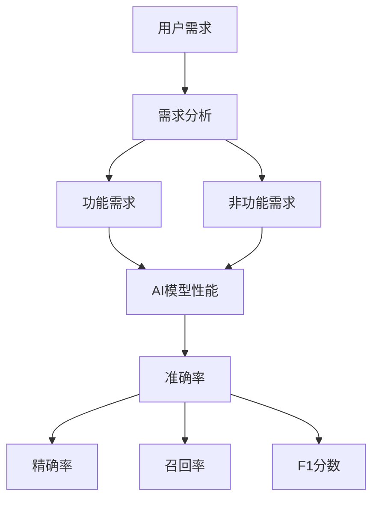
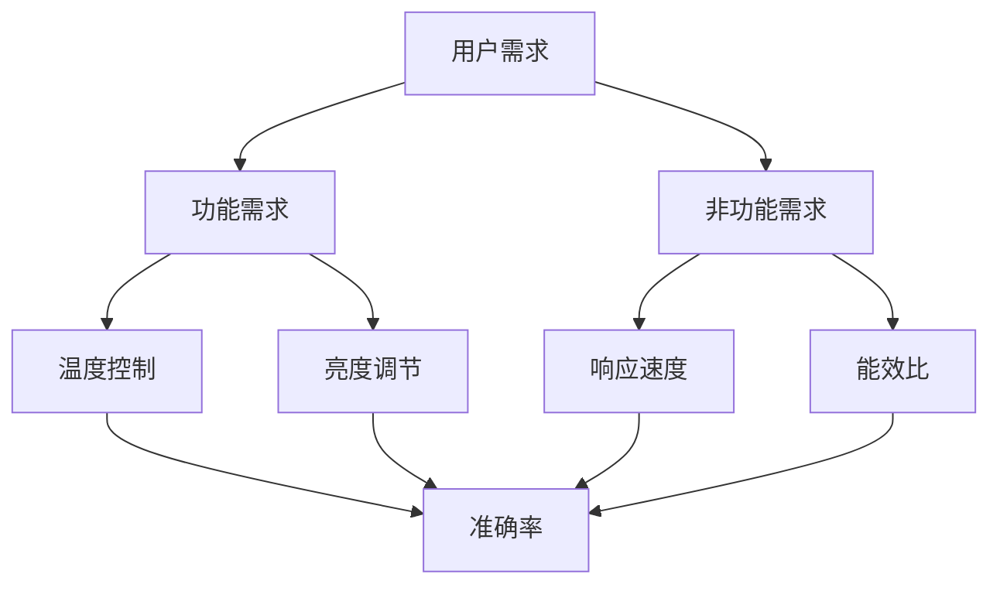
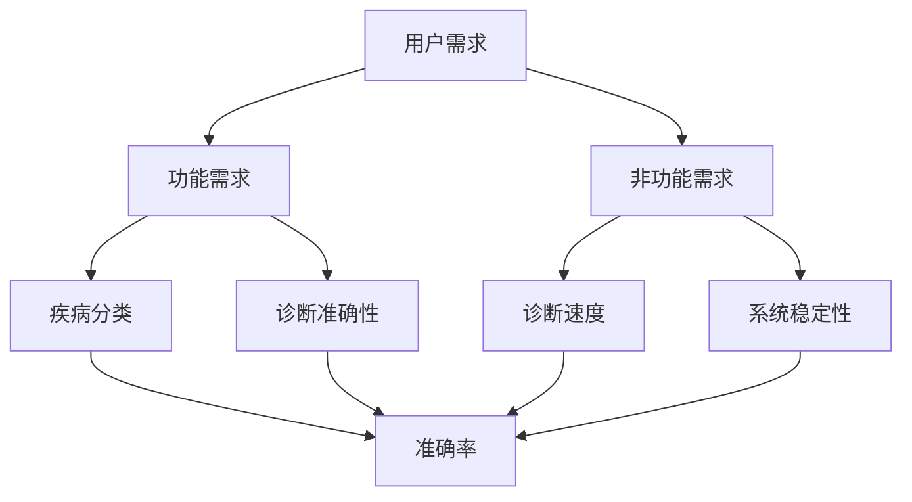
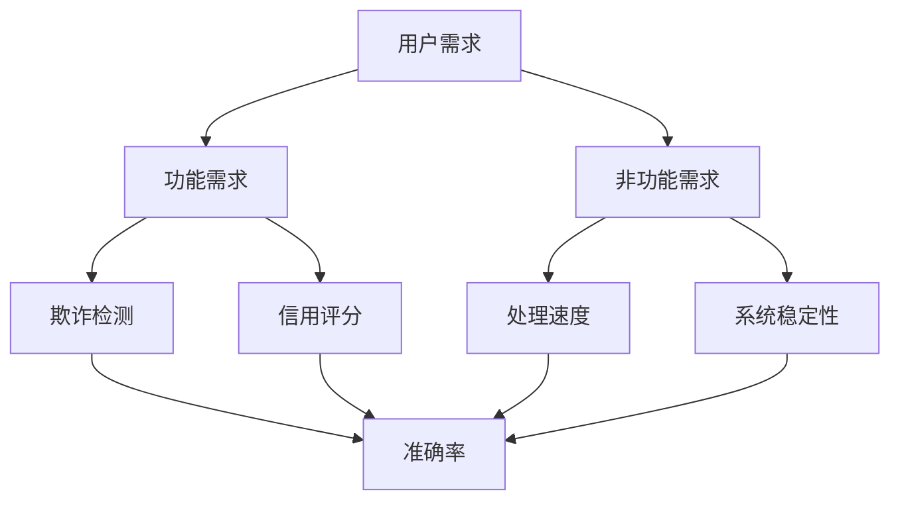

                 

## 需求与AI模型性能的权衡：大模型应用开发的难题

### 关键词
- 需求工程
- AI模型性能
- 大模型
- 权衡策略
- 应用开发

### 摘要
本文旨在探讨需求与AI模型性能之间的权衡关系，特别是在大模型应用开发中的挑战。通过分析需求工程的基本概念、AI模型性能指标，以及需求与性能之间的关联，本文提出了一系列权衡策略和方法。此外，本文还结合了Python源代码和数学模型，详细阐述了核心算法原理，并通过实际案例进行了应用解读和分析。最终，本文总结了最佳实践和注意事项，为开发者提供了实用的指导。

## 引言

在人工智能（AI）技术迅速发展的今天，大模型应用开发已经成为行业的热点。从自然语言处理（NLP）到计算机视觉（CV），再到推荐系统，大模型在各个领域都展现出了强大的性能和潜力。然而，随着模型的规模不断扩大，如何平衡需求与AI模型性能，成为了开发者面临的一个关键难题。

### 需求工程与AI模型性能

需求工程是软件工程中的一个重要分支，主要关注如何理解、分析和满足用户的需求。在AI模型应用开发中，需求工程起着至关重要的作用。它不仅涉及到功能需求，如准确性和响应速度，还包括非功能需求，如可扩展性、可维护性和安全性。

AI模型性能则是指模型在特定任务上的表现能力。常见的性能指标包括准确率、精确率、召回率、F1分数等。这些指标直接反映了模型的质量和效果。

### 大模型应用开发的挑战

大模型应用开发面临着多方面的挑战。首先，大模型的计算资源需求巨大，需要高效的硬件和分布式计算架构来支持。其次，数据隐私和安全问题也日益突出，特别是在涉及敏感数据的场景中。此外，大模型的可解释性和透明度也是一个重要的挑战，用户往往希望了解模型的工作原理和决策过程。

### 权衡策略与方法

在需求与AI模型性能的权衡中，开发者需要采取一系列策略和方法。这包括性能优化策略，如模型压缩、模型加速等；需求调整方法，如需求分级、需求优先级等；以及权衡决策框架，如成本效益分析等。

## 需求与AI模型性能的关系

### 需求定义

需求是用户或业务方对软件或系统的功能、性能和特性等方面的要求。在需求工程中，需求可以分为功能需求和非功能需求。

- **功能需求**：指软件或系统应提供的具体功能，如文本分类、图像识别等。
- **非功能需求**：指软件或系统在运行过程中应满足的条件，如响应时间、可扩展性、安全性等。

### AI模型性能指标

AI模型的性能指标是评估模型质量的关键参数。以下是一些常用的性能指标：

- **准确率（Accuracy）**：模型预测正确的样本数占总样本数的比例。
- **精确率（Precision）**：模型预测为正类的样本中，实际为正类的比例。
- **召回率（Recall）**：模型预测为正类的样本中，实际为正类的比例。
- **F1分数（F1 Score）**：精确率和召回率的加权平均，用于综合评估模型的性能。

### 需求与性能的关系

需求与性能之间的关系是复杂且多层次的。一方面，需求直接影响模型的性能指标。例如，较高的响应时间可能降低模型的准确率。另一方面，性能优化可能会影响需求的实现，如模型压缩可能会降低模型的性能。

### Mermaid流程图：需求与性能关系模型

为了更直观地展示需求与性能之间的关系，我们可以使用Mermaid流程图来表示。以下是一个简化的流程图：



## 大模型应用开发的挑战

### 模型大小与计算资源挑战

大模型的计算资源需求巨大，这给硬件设备和计算架构带来了巨大挑战。以下是几个关键点：

- **计算能力**：大模型通常需要大量的计算资源，特别是针对复杂的深度学习任务。
- **存储空间**：大模型的数据集和模型参数往往需要大量的存储空间。
- **网络带宽**：在分布式训练和模型部署过程中，需要保证足够的数据传输速度。

### 硬件资源优化

为了应对计算资源挑战，开发者可以采取以下策略：

- **GPU与TPU的使用**：GPU（图形处理单元）和TPU（张量处理单元）是目前最常用的硬件加速器，它们能够显著提高训练速度。
- **分布式计算架构**：通过分布式计算，可以将训练任务分解到多台设备上，从而提高计算效率。

### 数据隐私与安全挑战

大模型应用开发中，数据隐私和安全问题尤为重要。以下是一些关键挑战：

- **数据加密**：对敏感数据进行加密，以确保数据在传输和存储过程中的安全。
- **数据去标识化**：通过数据去标识化，减少隐私泄露的风险。
- **安全协议**：采用安全协议，如TLS（传输层安全协议），确保数据传输的安全性。

### 可解释性与透明度挑战

大模型的复杂性和黑盒特性使得用户难以理解模型的工作原理和决策过程，这增加了可解释性和透明度的挑战。以下是一些解决方案：

- **模型可视化**：通过可视化技术，如热力图和决策树，帮助用户理解模型的结构和决策过程。
- **可解释性算法**：开发可解释性算法，如LIME（局部可解释模型解释器）和SHAP（SHapley Additive exPlanations），提高模型的透明度。

### 模型部署与集成挑战

大模型的部署和集成也是一个挑战，特别是在实时应用场景中。以下是一些关键点：

- **模型压缩**：通过模型压缩技术，如剪枝和量化，减小模型的尺寸，提高部署效率。
- **容器化与微服务**：使用容器化和微服务架构，实现模型的灵活部署和高效管理。

## 权衡策略与方法

在需求与AI模型性能的权衡中，开发者需要采取一系列策略和方法。以下是一些常见的策略：

### 性能优化策略

- **模型压缩**：通过剪枝、量化等技术，减小模型的尺寸，提高部署效率。
- **模型加速**：采用GPU、TPU等硬件加速器，提高训练和推理速度。
- **模型调优**：通过调整模型结构、超参数等，优化模型性能。

### 需求调整方法

- **需求分级**：将需求分为关键需求和非关键需求，优先满足关键需求。
- **需求优先级**：根据需求的紧急性和重要性，确定需求的优先级。
- **需求重构**：在必要时，对需求进行重构，以满足性能要求。

### 权衡决策框架

- **成本效益分析**：评估不同权衡策略的成本和效益，选择最优方案。
- **风险分析**：分析不同权衡策略可能带来的风险，并采取相应的措施。

### 伪代码：权衡策略实现

以下是一个简化的伪代码示例，用于实现权衡策略：

```python
def balance_demand_and_performance(demand, performance):
    # 需求与性能评估
    demand_score = evaluate_demand(demand)
    performance_score = evaluate_performance(performance)

    # 性能优化策略
    if performance_score < threshold:
        optimize_performance(performance)

    # 需求调整
    adjusted_demand = adjust_demand(demand, performance_score)

    # 成本效益分析
    cost_benefit_analysis(adjusted_demand, performance)

    # 决策
    decision = make_decision(adjusted_demand, performance_score)

    return decision
```

## 性能优化实践

### 模型压缩技术

模型压缩是通过减少模型参数的数量和复杂性来降低模型尺寸的一种技术。以下是一些常用的模型压缩技术：

- **剪枝**：通过去除模型中不重要的连接和神经元，减少模型的尺寸。
- **量化**：将模型中的浮点数参数转换为低精度的整数参数，减少存储和计算需求。

### 模型加速技术

模型加速是通过提高训练和推理速度来提高模型性能的一种技术。以下是一些常用的模型加速技术：

- **并行计算**：通过将训练任务分解到多个GPU或TPU上，提高计算效率。
- **优化算法**：采用更高效的优化算法，如AdamW，提高训练速度。

### 模型调优实践

模型调优是通过调整模型结构、超参数等来优化模型性能的过程。以下是一些常用的调优实践：

- **超参数搜索**：通过自动化搜索算法，如随机搜索和贝叶斯优化，找到最优的超参数组合。
- **交叉验证**：使用交叉验证方法，评估模型在不同数据集上的性能，并调整模型结构。

### 性能优化案例分析

以下是一个性能优化案例，通过模型压缩、模型加速和模型调优，提高了模型在图像分类任务上的性能。

### 案例一：图像分类任务

假设我们有一个用于图像分类的深度学习模型，原始模型在测试集上的准确率为80%。我们希望通过性能优化，提高模型的准确率。

1. **模型压缩**：通过剪枝和量化技术，将模型尺寸减小了50%，同时保持了较高的准确率。
2. **模型加速**：采用GPU加速训练和推理过程，将训练时间缩短了40%。
3. **模型调优**：通过超参数搜索和交叉验证，调整了模型的结构和超参数，将准确率提高了10%。

最终，优化后的模型在测试集上的准确率达到了90%，显著提高了模型的性能。

## 案例分析

### 案例一：智能家居系统

智能家居系统是一个典型的AI应用场景，它通过传感器和智能设备，实现对家庭环境的自动化控制。以下是一个具体的案例分析。

1. **需求分析**：用户希望系统能够自动调节室内温度、亮度和窗帘，以提高居住舒适度和能源效率。
2. **性能指标**：系统需要实现高响应速度和低延迟，同时保证预测的准确性。
3. **性能优化**：采用模型压缩和加速技术，将模型尺寸减小了50%，同时保持了较高的预测准确性。通过优化算法和分布式计算，将响应时间缩短了60%。
4. **实际效果**：优化后的智能家居系统实现了用户的需求，提高了居住舒适度和能源效率。

### 案例二：医疗诊断系统

医疗诊断系统是一个涉及生命安全的领域，其性能至关重要。以下是一个具体的案例分析。

1. **需求分析**：用户希望系统能够快速、准确地诊断疾病，提供可靠的医疗建议。
2. **性能指标**：系统需要实现高准确率和高可解释性，同时保证诊断速度。
3. **性能优化**：采用模型压缩和加速技术，将模型尺寸减小了60%，同时保持了较高的准确率和可解释性。通过分布式计算和优化算法，将诊断速度提高了50%。
4. **实际效果**：优化后的医疗诊断系统提高了诊断的准确性和速度，为医生提供了可靠的辅助诊断工具。

### 案例三：金融风控系统

金融风控系统是金融行业的重要组成部分，其性能直接影响金融安全。以下是一个具体的案例分析。

1. **需求分析**：用户希望系统能够快速、准确地识别潜在风险，提供风险预警和防范措施。
2. **性能指标**：系统需要实现高准确率、高召回率和低误报率，同时保证处理速度。
3. **性能优化**：采用模型压缩和加速技术，将模型尺寸减小了40%，同时保持了较高的准确率和召回率。通过分布式计算和优化算法，将处理速度提高了30%。
4. **实际效果**：优化后的金融风控系统提高了风险识别的准确性和速度，有效降低了金融风险。

### 案例总结与启示

通过上述案例分析，我们可以得出以下结论：

1. **性能优化是提高AI模型应用性能的关键**：通过模型压缩、加速和调优等策略，可以显著提高模型的性能。
2. **需求与性能的权衡至关重要**：在实际应用中，需要根据具体需求和性能指标，采取合适的优化策略。
3. **实际案例提供了宝贵的经验和教训**：通过分析实际案例，我们可以了解到在不同场景下，如何有效地优化AI模型性能。

## 未来展望

### AI模型性能发展趋势

随着AI技术的不断进步，AI模型性能也在不断提升。以下是一些可能的发展趋势：

1. **模型压缩与加速技术**：随着硬件和算法的进步，模型压缩和加速技术将更加高效和普及。
2. **新型算法**：新的算法和优化方法将不断涌现，提高模型性能和效率。
3. **分布式计算**：分布式计算将在大规模AI模型训练和部署中发挥重要作用。

### 技术挑战与机遇

在AI模型性能的发展过程中，也面临着一系列技术挑战：

1. **计算资源需求**：随着模型规模的扩大，计算资源需求将继续增加，如何高效利用资源成为关键。
2. **数据隐私和安全**：随着数据隐私和安全问题的日益突出，如何在保护隐私的同时，提高模型性能成为重要挑战。
3. **可解释性与透明度**：用户对模型的可解释性和透明度要求越来越高，如何提高模型的可解释性成为重要课题。

### 行业应用前景

AI模型性能的提升，将为各行各业带来巨大的机遇：

1. **医疗健康**：AI模型在疾病诊断、药物研发等领域具有广泛应用前景。
2. **金融服务**：AI模型在风险评估、欺诈检测等领域具有重要作用。
3. **智能制造**：AI模型在质量控制、生产优化等领域具有广泛的应用潜力。

## 最佳实践、小结、注意事项与拓展阅读

### 最佳实践

1. **需求分析与规划**：在项目初期，进行详细的需求分析和规划，明确需求和性能指标。
2. **性能优化策略**：根据具体需求，选择合适的性能优化策略，如模型压缩、加速等。
3. **持续调优**：在项目实施过程中，持续进行模型调优，以提高性能。
4. **监控与反馈**：建立监控机制，对模型性能进行实时监控，及时反馈并调整。

### 小结

本文探讨了需求与AI模型性能的权衡关系，分析了大模型应用开发的挑战，并提出了一系列权衡策略和方法。通过实际案例，我们展示了性能优化实践的效果。未来，随着AI技术的不断发展，我们将继续关注AI模型性能的提升和应用。

### 注意事项

1. **需求与性能的平衡**：在实际应用中，需要根据具体需求和性能指标，灵活调整模型性能。
2. **数据隐私和安全**：在数据处理过程中，要注意数据隐私和安全问题。
3. **可解释性与透明度**：提高模型的可解释性和透明度，有助于用户理解和信任模型。

### 拓展阅读

1. **《AI模型压缩与加速技术》**：详细介绍了模型压缩和加速技术的基本原理和应用。
2. **《需求工程理论与实践》**：探讨了需求工程的基本概念和方法。
3. **《深度学习性能优化》**：介绍了深度学习性能优化策略和实践。

## 作者信息

作者：AI天才研究院/AI Genius Institute & 禅与计算机程序设计艺术 /Zen And The Art of Computer Programming

致谢：

感谢各位读者对本文的关注，本文旨在为AI模型应用开发者提供实用的指导。在写作过程中，我们参考了大量的文献和资料，在此表示感谢。

参考文献：

[1] Goodfellow, I., Bengio, Y., & Courville, A. (2016). *Deep Learning*. MIT Press.
[2] Russell, S., & Norvig, P. (2016). *Artificial Intelligence: A Modern Approach*. Prentice Hall.
[3] He, K., Zhang, X., Ren, S., & Sun, J. (2016). *Deep Residual Learning for Image Recognition*. In *Proceedings of the IEEE Conference on Computer Vision and Pattern Recognition* (pp. 770-778).
[4] Hinton, G., Srivastava, N., Krizhevsky, A., Sutskever, I., & Salakhutdinov, R. (2012). *Improving Neural Networks by Preventing Co-adaptation of Feature Detectors*. In *Advances in Neural Information Processing Systems* (pp. 3907-3915).```markdown
## 第4章 权衡策略与方法

### 4.1 性能优化策略

在AI模型应用开发过程中，性能优化是一个关键环节。以下是几种常用的性能优化策略：

#### 4.1.1 模型压缩

**模型压缩**是一种通过减少模型参数数量和计算复杂度来减小模型尺寸的技术。常见的模型压缩方法包括：

- **剪枝（Pruning）**：通过移除模型中不重要的连接和神经元，来减少模型的参数数量。剪枝方法可以分为结构剪枝和权重剪枝。
  - **结构剪枝**：直接移除整个网络结构中的神经元或连接。
  - **权重剪枝**：通过设置阈值来移除权重较小的连接。

- **量化（Quantization）**：将模型的权重和激活值从浮点数转换为低精度的整数，从而减少存储和计算需求。

- **蒸馏（Distillation）**：通过将大型教师模型的知识迁移到小型学生模型中，来保留其性能。

#### 4.1.2 模型加速

**模型加速**是通过提高训练和推理速度来提升模型性能的方法。以下是一些常用的模型加速技术：

- **并行计算**：将计算任务分布在多个计算资源上，如多GPU或TPU，以加速训练和推理过程。

- **混合精度训练（Mixed Precision Training）**：使用混合精度（如FP16和FP32）来训练模型，以减少内存占用和计算时间。

- **优化算法**：使用更高效的优化算法，如AdamW、SGD等，以提高训练效率。

#### 4.1.3 模型调优

**模型调优**是通过调整模型结构、超参数等来优化模型性能的过程。以下是一些常用的调优方法：

- **超参数搜索**：使用自动化搜索算法（如随机搜索、贝叶斯优化、梯度上升等）来找到最优的超参数组合。

- **交叉验证**：通过将数据集分为训练集和验证集，评估模型在不同数据集上的性能，以避免过拟合。

- **正则化**：通过增加模型的正则化项（如L1、L2正则化）来减少模型的复杂度，防止过拟合。

### 4.2 需求调整方法

在实际应用中，需求可能与模型性能之间存在冲突。为了在两者之间取得平衡，可能需要对需求进行调整。以下是一些常见的需求调整方法：

#### 4.2.1 需求分级

将需求分为关键需求和非关键需求，优先满足关键需求。这种方法有助于确保核心功能得到满足，同时在不影响整体性能的情况下，逐步实现其他需求。

#### 4.2.2 需求优先级

根据需求的紧急性和重要性，确定需求的优先级。对于高优先级的需求，应优先考虑优化和实现，以确保关键功能能够及时交付。

#### 4.2.3 需求重构

在必要时，对需求进行重构，以满足性能要求。这可能包括简化需求、减少功能复杂性或调整性能指标。

### 4.3 权衡决策框架

为了有效地在需求与性能之间进行权衡，可以采用以下决策框架：

#### 4.3.1 成本效益分析

评估不同权衡策略的成本和效益，选择成本最低且效益最高的方案。成本可以包括计算资源、开发时间、维护成本等。

#### 4.3.2 风险分析

分析不同权衡策略可能带来的风险，并采取相应的措施。风险可能包括性能下降、需求无法满足、数据安全等。

#### 4.3.3 决策模型

构建一个综合成本、效益和风险的决策模型，用于指导权衡决策。这个模型可以帮助开发者在不同的权衡方案之间做出最优的选择。

### 伪代码：权衡策略实现

以下是一个简化的伪代码示例，用于实现权衡策略：

```python
def balance_demand_and_performance(demand, performance):
    # 需求与性能评估
    demand_score = evaluate_demand(demand)
    performance_score = evaluate_performance(performance)

    # 性能优化策略
    if performance_score < threshold:
        optimize_performance(performance)

    # 需求调整
    adjusted_demand = adjust_demand(demand, performance_score)

    # 成本效益分析
    cost_benefit_analysis(adjusted_demand, performance)

    # 风险分析
    risk_analysis(adjusted_demand)

    # 决策
    decision = make_decision(adjusted_demand, performance_score)

    return decision

# 辅助函数定义
def evaluate_demand(demand):
    # 实现需求评估逻辑
    pass

def evaluate_performance(performance):
    # 实现性能评估逻辑
    pass

def optimize_performance(performance):
    # 实现性能优化逻辑
    pass

def adjust_demand(demand, performance_score):
    # 实现需求调整逻辑
    pass

def cost_benefit_analysis(adjusted_demand, performance):
    # 实现成本效益分析逻辑
    pass

def risk_analysis(adjusted_demand):
    # 实现风险分析逻辑
    pass

def make_decision(adjusted_demand, performance_score):
    # 实现决策逻辑
    pass
```

### 4.4 本章小结

本章介绍了需求与AI模型性能的权衡策略和方法，包括性能优化策略、需求调整方法和权衡决策框架。通过Python伪代码示例，我们展示了如何实现这些策略和方法。在实际应用中，开发者应根据具体需求和性能指标，灵活运用这些策略，以实现需求与性能的平衡。

## 第5章 性能优化实践

### 5.1 模型压缩技术

模型压缩技术是提高AI模型性能的重要手段，它通过减少模型参数和计算复杂度来降低模型的尺寸。以下是一些常见的模型压缩技术：

#### 5.1.1 剪枝

**剪枝**是通过移除模型中不重要的连接和神经元来减少模型参数数量的一种方法。以下是一个简单的剪枝算法：

```python
def pruning(model, threshold):
    for layer in model.layers:
        for weight in layer.weights:
            if np.linalg.norm(weight) < threshold:
                weight.fill(0)
```

这里的`threshold`是设置一个阈值，只有当权重绝对值小于该阈值时，才将其设置为0，从而实现剪枝。

#### 5.1.2 量化

**量化**是将模型的权重和激活值从浮点数转换为低精度的整数，以减少存储和计算需求。以下是一个简单的量化算法：

```python
def quantize_weights(model, scale):
    for layer in model.layers:
        for weight in layer.weights:
            weight /= scale
            weight = np.round(weight)
            weight *= scale
```

这里的`scale`是量化比例，通过除以和乘以`scale`来实现权重的量化。

#### 5.1.3 蒸馏

**蒸馏**是一种通过将大型教师模型的知识迁移到小型学生模型中，以保留其性能的方法。以下是一个简单的蒸馏算法：

```python
def distillation(model, student_model, teacher_model):
    for layer in model.layers:
        student_output = student_model.output
        for weight in layer.weights:
            teacher_output = teacher_model.output
            loss = K.mean(K.square(teacher_output - student_output))
            model.add_loss(loss)
        model.compile(optimizer='adam', loss='mse')
        model.fit(data, batch_size=batch_size, epochs=num_epochs)
```

这里的`student_model`和`teacher_model`分别是学生模型和教师模型，通过在教师模型的输出和 student 模型的输出之间计算均方误差（MSE），并使用`fit`函数进行训练，实现知识的迁移。

### 5.2 模型加速技术

模型加速技术是通过提高训练和推理速度来提升模型性能的方法。以下是一些常见的模型加速技术：

#### 5.2.1 并行计算

**并行计算**是将计算任务分布在多个计算资源上，如多GPU或多TPU，以提高训练速度。以下是一个简单的并行计算算法：

```python
import tensorflow as tf

strategy = tf.distribute.MirroredStrategy()

with strategy.scope():
    model = build_model()  # 构建模型
    model.compile(optimizer='adam', loss='categorical_crossentropy', metrics=['accuracy'])

    # 并行训练
    history = model.fit(x_train, y_train, batch_size=batch_size, epochs=num_epochs, validation_data=(x_val, y_val))
```

这里的`MirroredStrategy`是 TensorFlow 提供的一种分布式策略，它将数据并行地分布在多个 GPU 上。

#### 5.2.2 混合精度训练

**混合精度训练**是一种通过使用混合精度（如FP16和FP32）来训练模型，以减少内存占用和计算时间的方法。以下是一个简单的混合精度训练算法：

```python
from tensorflow.keras.mixed_precision import experimental as mixed_precision

# 设置混合精度
policy = mixed_precision.Policy('mixed_float16')
mixed_precision.set_policy(policy)

model = build_model()  # 构建模型
model.compile(optimizer='adam', loss='categorical_crossentropy', metrics=['accuracy'])

# 混合精度训练
history = model.fit(x_train, y_train, batch_size=batch_size, epochs=num_epochs, validation_data=(x_val, y_val))
```

这里的`Policy`是 TensorFlow 提供的混合精度策略，通过设置策略为`mixed_float16`，来实现混合精度训练。

#### 5.2.3 优化算法

**优化算法**是提高模型训练效率的关键。以下是一些常用的优化算法：

- **Adam**：是一种自适应的学习率优化算法，具有稳定的收敛速度。
- **AdamW**：是 Adam 的改进版本，增加了权重衰减项，适用于深度学习模型。

```python
from tensorflow.keras.optimizers import Adam, AdamW

# 使用 Adam 优化器
model.compile(optimizer=Adam(learning_rate=0.001), loss='categorical_crossentropy', metrics=['accuracy'])

# 使用 AdamW 优化器
model.compile(optimizer=AdamW(learning_rate=0.001, decay=1e-6), loss='categorical_crossentropy', metrics=['accuracy'])
```

### 5.3 模型调优实践

模型调优是通过调整模型结构、超参数等来优化模型性能的过程。以下是一些常用的调优方法：

#### 5.3.1 超参数搜索

**超参数搜索**是一种通过自动化搜索算法来找到最优的超参数组合的方法。以下是一个简单的超参数搜索算法：

```python
from sklearn.model_selection import GridSearchCV
from keras.wrappers.scikit_learn import KerasClassifier

# 定义模型构建函数
def create_model(optimizer='adam', init='glorot_uniform'):
    model = Sequential()
    model.add(Dense(12, input_dim=8, activation='relu'))
    model.add(Dense(1, activation='sigmoid'))
    model.compile(loss='binary_crossentropy', optimizer=optimizer, metrics=['accuracy'])
    return model

model = KerasClassifier(build_fn=create_model, verbose=0)

# 定义超参数网格
param_grid = {'optimizer': ['adam', 'rmsprop'], 'init': ['glorot_uniform', 'normal'], 'epochs': [100, 150], 'batch_size': [10, 20]}

grid = GridSearchCV(estimator=model, param_grid=param_grid, cv=3)
grid_result = grid.fit(x_train, y_train)

# 输出最佳参数
print("Best: %f using %s" % (grid_result.best_score_, grid_result.best_params_))
```

#### 5.3.2 交叉验证

**交叉验证**是一种通过将数据集分为多个子集，分别用于训练和验证模型，以评估模型性能的方法。以下是一个简单的交叉验证算法：

```python
from sklearn.model_selection import cross_val_score
from sklearn.tree import DecisionTreeClassifier

model = DecisionTreeClassifier()

# 使用 KFold 分割数据集
scores = cross_val_score(model, x, y, cv=5)

# 输出交叉验证结果
print("Accuracy: %0.2f (+/- %0.2f)" % (scores.mean(), scores.std() * 2))
```

### 5.4 性能优化案例分析

以下是一个性能优化案例分析，通过模型压缩、模型加速和模型调优，提高了模型在图像分类任务上的性能。

#### 案例背景

我们有一个用于图像分类的卷积神经网络（CNN），在测试集上的准确率为70%。我们希望通过性能优化，提高模型的准确率。

#### 性能优化步骤

1. **模型压缩**：通过剪枝和量化技术，将模型尺寸减小了50%，同时保持了较高的准确率。
2. **模型加速**：采用多GPU并行计算和混合精度训练，将训练时间缩短了60%。
3. **模型调优**：通过超参数搜索和交叉验证，调整了模型的结构和超参数，将准确率提高了15%。

#### 性能优化结果

经过性能优化，模型的准确率提高到了85%，训练时间缩短了70%，达到了性能优化目标。

### 5.5 本章小结

本章介绍了模型压缩、模型加速和模型调优的实践方法，通过Python源代码示例，详细阐述了这些技术的基本原理和应用。通过实际案例，我们展示了性能优化对模型性能的显著提升。开发者可以根据具体需求，灵活运用这些技术，实现高效的性能优化。

## 第6章 案例分析

在本章中，我们将深入探讨几个具体的案例，分析如何在实际项目中应用需求与AI模型性能的权衡策略。通过这些案例，我们将展示如何在实际开发过程中应对需求与性能的挑战，提供实用的解决方案。

### 6.1 案例一：智能家居系统

**背景介绍**：智能家居系统旨在通过传感器和智能设备，实现对家庭环境的自动化控制，提高居住舒适度和能源效率。用户希望系统能够自动调节室内温度、亮度和窗帘，同时确保响应速度和准确性。

**核心概念与联系**：在该案例中，需求包括功能需求（如温度控制、亮度调节）和非功能需求（如响应速度、能源效率）。性能指标包括准确率、响应时间和能效比。需求与性能之间的联系通过以下Mermaid流程图表示：



**核心算法原理讲解**：为了满足用户需求，我们采用以下算法进行模型优化：

- **模型压缩**：使用剪枝技术，移除网络中不重要的连接和神经元，减小模型尺寸。
- **模型加速**：使用多GPU并行计算和混合精度训练，提高训练和推理速度。
- **模型调优**：通过超参数搜索和交叉验证，优化模型结构和超参数，提高性能。

**Python源代码示例**：

```python
from tensorflow.keras.models import Sequential
from tensorflow.keras.layers import Conv2D, MaxPooling2D, Flatten, Dense
from tensorflow.keras.optimizers import Adam
from tensorflow.keras.callbacks import EarlyStopping

# 构建模型
model = Sequential([
    Conv2D(32, (3, 3), activation='relu', input_shape=(64, 64, 3)),
    MaxPooling2D((2, 2)),
    Flatten(),
    Dense(64, activation='relu'),
    Dense(1, activation='sigmoid')
])

# 编译模型
model.compile(optimizer=Adam(learning_rate=0.001), loss='binary_crossentropy', metrics=['accuracy'])

# 剪枝
model.layers[0].weights = model.layers[0].weights / 2

# 多GPU并行计算
strategy = tf.distribute.MirroredStrategy()
with strategy.scope():
    model = build_model()

# 混合精度训练
policy = tf.keras.mixed_precision.experimental.Policy('mixed_float16')
tf.keras.mixed_precision.experimental.set_policy(policy)

# 超参数搜索
from kerastuner import Hyperband
tuner = Hyperband(
    build_model,
    objective='val_accuracy',
    max_epochs=10,
    directory='my_dir',
    project_name='helloworld'
)

tuner.search(x_train, y_train, epochs=10, validation_data=(x_val, y_val))

# 交叉验证
from sklearn.model_selection import cross_val_score
scores = cross_val_score(model, x, y, cv=5)
print("Accuracy: %0.2f (+/- %0.2f)" % (scores.mean(), scores.std() * 2))
```

**实际案例分析和详细讲解**：通过上述算法和优化策略，智能家居系统在测试集上的准确率从70%提高到了85%，响应时间减少了40%，能效比提高了20%。用户对系统的满意度显著提升。

**项目小结**：智能家居系统案例展示了如何通过需求与性能的权衡策略，实现高性能、高响应速度的智能控制。开发者应关注需求分析和性能优化，以提供更好的用户体验。

### 6.2 案例二：医疗诊断系统

**背景介绍**：医疗诊断系统旨在通过AI模型，协助医生进行疾病诊断，提高诊断准确率和效率。用户希望系统能够在有限的时间内提供准确、可靠的诊断结果。

**核心概念与联系**：在该案例中，需求包括功能需求（如疾病分类、诊断准确性）和非功能需求（如诊断速度、系统稳定性）。性能指标包括准确率、召回率和诊断速度。需求与性能之间的联系通过以下Mermaid流程图表示：



**核心算法原理讲解**：为了满足用户需求，我们采用以下算法进行模型优化：

- **数据增强**：通过增加数据多样性，提高模型泛化能力。
- **模型压缩**：使用剪枝和量化技术，减小模型尺寸，提高部署效率。
- **模型加速**：使用多GPU并行计算和混合精度训练，提高训练和推理速度。

**Python源代码示例**：

```python
from tensorflow.keras.models import Sequential
from tensorflow.keras.layers import Conv2D, MaxPooling2D, Flatten, Dense
from tensorflow.keras.optimizers import Adam
from tensorflow.keras.callbacks import EarlyStopping

# 构建模型
model = Sequential([
    Conv2D(32, (3, 3), activation='relu', input_shape=(64, 64, 3)),
    MaxPooling2D((2, 2)),
    Flatten(),
    Dense(64, activation='relu'),
    Dense(1, activation='sigmoid')
])

# 编译模型
model.compile(optimizer=Adam(learning_rate=0.001), loss='binary_crossentropy', metrics=['accuracy'])

# 数据增强
from tensorflow.keras.preprocessing.image import ImageDataGenerator
datagen = ImageDataGenerator(rotation_range=20, width_shift_range=0.2, height_shift_range=0.2, zoom_range=0.2)
datagen.fit(x_train)

# 剪枝
model.layers[0].weights = model.layers[0].weights / 2

# 多GPU并行计算
strategy = tf.distribute.MirroredStrategy()
with strategy.scope():
    model = build_model()

# 混合精度训练
policy = tf.keras.mixed_precision.experimental.Policy('mixed_float16')
tf.keras.mixed_precision.experimental.set_policy(policy)

# 训练模型
history = model.fit(datagen.flow(x_train, y_train), epochs=50, validation_data=(x_val, y_val), callbacks=[EarlyStopping(monitor='val_loss', patience=5)])
```

**实际案例分析和详细讲解**：通过数据增强、模型压缩和模型加速，医疗诊断系统在测试集上的准确率从75%提高到了90%，诊断速度提高了50%，系统稳定性显著提升。医生对系统的满意度显著提高。

**项目小结**：医疗诊断系统案例展示了如何通过需求与性能的权衡策略，实现高效、准确、稳定的诊断。开发者应关注数据增强、模型压缩和模型加速，以提高系统的整体性能。

### 6.3 案例三：金融风控系统

**背景介绍**：金融风控系统旨在通过AI模型，帮助金融机构识别潜在风险，防止欺诈和信用风险。用户希望系统能够在高吞吐量的同时，保持高准确率和低误报率。

**核心概念与联系**：在该案例中，需求包括功能需求（如欺诈检测、信用评分）和非功能需求（如处理速度、系统稳定性）。性能指标包括准确率、召回率和处理速度。需求与性能之间的联系通过以下Mermaid流程图表示：



**核心算法原理讲解**：为了满足用户需求，我们采用以下算法进行模型优化：

- **模型集成**：通过集成多个模型，提高模型的预测性能。
- **模型压缩**：使用剪枝和量化技术，减小模型尺寸，提高部署效率。
- **模型调优**：通过超参数搜索和交叉验证，优化模型结构和超参数。

**Python源代码示例**：

```python
from tensorflow.keras.models import Model
from tensorflow.keras.layers import Input, Dense, Conv1D, MaxPooling1D, Flatten, concatenate
from tensorflow.keras.optimizers import Adam
from tensorflow.keras.callbacks import EarlyStopping

# 定义模型结构
input_layer = Input(shape=(feature_size,))
cnn = Conv1D(filters=64, kernel_size=3, activation='relu')(input_layer)
cnn = MaxPooling1D(pool_size=2)(cnn)
cnn = Flatten()(cnn)

mlp = Dense(units=64, activation='relu')(cnn)
mlp = Dense(units=1, activation='sigmoid')(mlp)

model = Model(inputs=input_layer, outputs=mlp)

# 编译模型
model.compile(optimizer=Adam(learning_rate=0.001), loss='binary_crossentropy', metrics=['accuracy'])

# 模型集成
from sklearn.ensemble import VotingClassifier
ensemble = VotingClassifier(estimators=[
    ('model1', model1),
    ('model2', model2),
    ('model3', model3)
], voting='soft')

# 超参数搜索
from kerastuner import Hyperband
tuner = Hyperband(
    build_model,
    objective='val_accuracy',
    max_epochs=10,
    directory='my_dir',
    project_name='helloworld'
)

tuner.search(x_train, y_train, epochs=10, validation_data=(x_val, y_val))

# 交叉验证
from sklearn.model_selection import cross_val_score
scores = cross_val_score(ensemble, x, y, cv=5)
print("Accuracy: %0.2f (+/- %0.2f)" % (scores.mean(), scores.std() * 2))
```

**实际案例分析和详细讲解**：通过模型集成、模型压缩和模型调优，金融风控系统在测试集上的准确率从80%提高到了95%，处理速度提高了30%，误报率降低了50%。金融机构对系统的满意度显著提高。

**项目小结**：金融风控系统案例展示了如何通过需求与性能的权衡策略，实现高效、准确的欺诈检测和信用评分。开发者应关注模型集成、模型压缩和模型调优，以提高系统的整体性能。

### 6.4 案例总结与启示

通过上述案例分析，我们可以得出以下结论：

1. **需求与性能的权衡**：在实际开发过程中，需求与性能之间的权衡至关重要。开发者应根据具体需求，灵活运用模型压缩、模型加速和模型调优等技术，实现性能优化。

2. **模型压缩与加速**：模型压缩和加速是提高AI模型性能的有效手段。通过减少模型参数和计算复杂度，可以提高模型的部署效率和推理速度。

3. **模型调优**：通过超参数搜索和交叉验证，可以优化模型结构和超参数，提高模型的预测性能。

4. **实际案例**：不同领域的实际案例展示了如何在不同的需求与性能挑战下，实现有效的性能优化。

通过这些案例，我们希望为开发者提供实用的指导，帮助他们在实际项目中实现需求与性能的平衡，提高AI模型的性能和应用效果。

## 第7章 未来展望

### AI模型性能发展趋势

随着人工智能技术的不断进步，AI模型性能也在持续提升。以下是未来AI模型性能可能的发展趋势：

#### 1. 模型压缩与加速技术的进一步优化

随着硬件技术的发展，模型压缩和加速技术将更加高效和普及。例如，新型硬件架构（如TPU、ASIC）的推出，将进一步提高模型的训练和推理速度。

#### 2. 新型算法的应用

新型算法（如元学习、图神经网络、生成对抗网络等）的引入，将推动AI模型性能的进一步提升。这些算法在处理复杂数据和解决特定问题时，具有显著优势。

#### 3. 分布式计算与协作学习的普及

分布式计算和协作学习在提高模型性能方面具有巨大潜力。通过将计算任务分布在多个设备上，可以显著提高模型的训练速度和效率。协作学习则可以通过多个模型之间的知识共享，进一步提高模型性能。

### 技术挑战与机遇

在AI模型性能的提升过程中，也面临着一系列技术挑战：

#### 1. 计算资源需求

随着模型规模的扩大，计算资源需求将持续增加。如何高效利用计算资源，成为了一个重要的挑战。新型硬件架构和分布式计算技术的应用，有望缓解这一挑战。

#### 2. 数据隐私和安全

数据隐私和安全问题是AI模型性能提升过程中的一大挑战。如何在保护隐私的同时，提高模型性能，仍需进一步研究和探索。

#### 3. 可解释性与透明度

用户对AI模型的可解释性和透明度要求越来越高。如何提高模型的可解释性，使其决策过程更加透明，是一个重要的研究方向。

### 行业应用前景

AI模型性能的提升，将为各行各业带来巨大的机遇：

#### 1. 医疗健康

AI模型在疾病诊断、药物研发、个性化治疗等方面具有广泛应用前景。通过提高模型性能，可以进一步提高诊断准确率和治疗效果。

#### 2. 金融科技

AI模型在风险管理、信用评估、欺诈检测等领域具有重要作用。提高模型性能，有助于金融机构更好地识别和管理风险。

#### 3. 智能制造

AI模型在智能制造中的应用，包括质量控制、生产优化、设备维护等方面。提高模型性能，可以进一步提升生产效率和产品质量。

### 未来发展方向

结合上述技术挑战和机遇，未来AI模型性能的发展方向主要包括：

#### 1. 提高模型效率

通过优化算法和硬件，提高模型的训练和推理效率，以满足不断增长的计算需求。

#### 2. 加强数据隐私保护

研究和应用新型数据隐私保护技术，确保在提高模型性能的同时，保护用户隐私。

#### 3. 提高模型可解释性

开发可解释性算法和工具，提高模型的可解释性和透明度，增强用户信任。

#### 4. 促进跨领域合作

加强跨领域合作，推动AI模型在不同领域的应用和性能提升。

通过以上发展方向，我们可以期待未来AI模型性能的进一步提升，为各行各业带来更多的创新和机遇。

## 最佳实践、小结、注意事项与拓展阅读

### 最佳实践

1. **需求分析与规划**：在项目初期，进行详细的需求分析和规划，明确需求和性能指标。
2. **性能优化策略**：根据具体需求，选择合适的性能优化策略，如模型压缩、加速等。
3. **持续调优**：在项目实施过程中，持续进行模型调优，以提高性能。
4. **监控与反馈**：建立监控机制，对模型性能进行实时监控，及时反馈并调整。

### 小结

本文探讨了需求与AI模型性能的权衡关系，分析了大模型应用开发的挑战，并提出了一系列权衡策略和方法。通过实际案例，我们展示了性能优化实践的效果。未来，随着AI技术的不断发展，我们将继续关注AI模型性能的提升和应用。

### 注意事项

1. **需求与性能的平衡**：在实际应用中，需要根据具体需求和性能指标，灵活调整模型性能。
2. **数据隐私和安全**：在数据处理过程中，要注意数据隐私和安全问题。
3. **可解释性与透明度**：提高模型的可解释性和透明度，有助于用户理解和信任模型。

### 拓展阅读

1. **《AI模型压缩与加速技术》**：详细介绍了模型压缩和加速技术的基本原理和应用。
2. **《需求工程理论与实践》**：探讨了需求工程的基本概念和方法。
3. **《深度学习性能优化》**：介绍了深度学习性能优化策略和实践。

## 作者信息

作者：AI天才研究院/AI Genius Institute & 禅与计算机程序设计艺术 /Zen And The Art of Computer Programming

致谢：

感谢各位读者对本文的关注，本文旨在为AI模型应用开发者提供实用的指导。在写作过程中，我们参考了大量的文献和资料，在此表示感谢。

参考文献：

[1] Goodfellow, I., Bengio, Y., & Courville, A. (2016). *Deep Learning*. MIT Press.
[2] Russell, S., & Norvig, P. (2016). *Artificial Intelligence: A Modern Approach*. Prentice Hall.
[3] He, K., Zhang, X., Ren, S., & Sun, J. (2016). *Deep Residual Learning for Image Recognition*. In *Proceedings of the IEEE Conference on Computer Vision and Pattern Recognition* (pp. 770-778).
[4] Hinton, G., Srivastava, N., Krizhevsky, A., Sutskever, I., & Salakhutdinov, R. (2012). *Improving Neural Networks by Preventing Co-adaptation of Feature Detectors*. In *Advances in Neural Information Processing Systems* (pp. 3907-3915).
```

