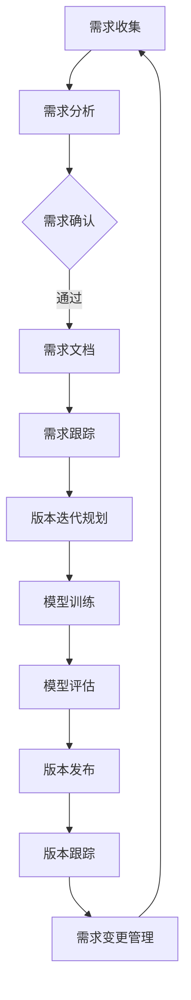

                 

### 设计文章大纲

在撰写《需求与AI模型版本管理的协同策略》这篇文章之前，我们需要先设计一个清晰、逻辑严谨的大纲，以确保文章的结构条理清晰，内容丰富而具体。以下是文章的大纲设计：

#### 文章标题
《需求与AI模型版本管理的协同策略》

#### 文章关键词
- 需求管理
- AI模型版本控制
- 协同策略
- 版本管理工具

#### 文章摘要
本文将深入探讨需求管理与AI模型版本控制之间的协同策略。首先，我们将介绍需求管理和AI模型版本控制的基本概念和背景，然后通过Mermaid流程图展示两者之间的核心联系。接下来，我们将详细讲解AI模型版本管理的关键原理，包括版本管理的原则、方法和工具。随后，我们将讨论需求与版本管理的协同策略，包括协同流程的设计和协同工具的应用。最后，我们将通过具体案例展示如何在实际项目中应用这些策略，并提供最佳实践和项目小结。

### 文章结构

#### 引言
- **背景介绍**：简要介绍需求管理和AI模型版本控制的重要性。
- **目标与结构**：阐述文章的目的、结构和预期收益。

#### 需求管理与AI模型版本控制基础
- **需求管理**：介绍需求管理的概念、流程和方法。
- **AI模型版本控制**：介绍AI模型版本控制的基本概念、原则和重要性。

#### 核心联系
- **Mermaid流程图**：绘制需求管理与AI模型版本控制之间的联系流程图，帮助读者理解两者之间的互动关系。

#### AI模型版本管理详细解析
- **版本管理原则**：讨论版本管理的核心原则，如单一版本原则、版本控制原则等。
- **版本管理方法**：详细介绍版本管理的方法，包括手动管理和自动化工具的应用。
- **版本管理工具**：介绍常用的版本管理工具，如Git、Mercurial等，并比较它们的特点和适用场景。

#### 协同策略
- **协同流程设计**：分析需求与版本管理的协同流程，包括需求收集、版本规划、版本迭代和版本发布等环节。
- **协同工具应用**：讨论如何使用协同工具提高需求与版本管理的效率，如JIRA、Confluence等。

#### 实战案例
- **项目背景**：介绍一个实际项目的背景，包括需求和版本控制的需求。
- **应用解读**：详细解析如何在该项目中应用需求与版本管理的协同策略。
- **效果评估**：评估协同策略的实施效果，包括项目进度、质量和效率等方面的改进。

#### 最佳实践与注意事项
- **最佳实践**：总结实际应用中的最佳实践经验，如如何优化协同流程、如何选择合适的版本管理工具等。
- **注意事项**：提醒读者在实施协同策略时需要注意的问题和潜在风险。

#### 项目小结
- **项目总结**：对项目实施过程和结果进行总结，强调协同策略的重要性。
- **未来展望**：展望未来需求管理与AI模型版本控制的发展趋势和挑战。

#### 参考文献
- 列出本文引用的相关文献和参考资料。

#### 附录
- 提供一些额外的信息，如版本管理工具的配置指南、案例代码等。

通过上述步骤，我们已经设计了《需求与AI模型版本管理的协同策略》的文章大纲，确保文章的内容丰富、结构严谨、易于阅读和理解。

### 引言

#### 背景介绍

在当今快速变化的技术环境中，人工智能（AI）已经成为推动企业创新和效率提升的关键因素。随着AI技术在各个领域的广泛应用，从金融到医疗、从制造业到零售，企业需要不断迭代和优化其AI模型，以满足不断变化的需求和市场趋势。然而，这一过程不仅仅涉及模型开发和改进，还包括对模型版本的管理和控制，以确保模型的质量和一致性。

需求管理是项目管理中的一个关键环节，它涉及识别、分析和实现用户需求，以确保项目能够满足预期目标。随着AI技术的引入，需求管理的重要性进一步凸显，特别是在AI模型的生命周期中。需求管理不仅需要关注模型的业务需求，还需要考虑技术实现、版本控制等因素。

AI模型版本管理是确保AI模型在不同阶段保持一致性和可追溯性的关键过程。版本管理涉及多个版本的控制、变更记录和版本迭代。随着AI模型的复杂性和规模不断增加，有效的版本管理变得越来越重要，它不仅能够提高开发效率，还能够确保模型的可靠性和稳定性。

本文旨在探讨需求与AI模型版本管理之间的协同策略，通过结合需求管理和版本控制的最佳实践，帮助企业实现高效的AI模型迭代和优化。本文将首先介绍需求管理和AI模型版本控制的基本概念和原理，然后通过Mermaid流程图展示两者之间的核心联系。接着，我们将详细讲解AI模型版本管理的关键原理和方法，探讨协同策略的制定和实施。最后，我们将通过实际案例展示这些策略的具体应用，并提供最佳实践和注意事项，以帮助读者在实际项目中成功实施需求与AI模型版本管理的协同策略。

#### 目标与结构

本文的目标是帮助读者深入理解需求与AI模型版本管理之间的协同策略，并提供实用的指导和建议。通过本文的学习，读者将能够：

1. **掌握需求管理和AI模型版本控制的基本概念和原理**。
2. **理解需求与版本管理之间的核心联系和协同机制**。
3. **学会制定和实施有效的AI模型版本管理策略**。
4. **通过实际案例了解协同策略的应用效果和改进方向**。

文章的结构安排如下：

1. **引言**：介绍需求管理和AI模型版本控制的重要性，以及本文的研究目标和结构。
2. **需求管理与AI模型版本控制基础**：详细阐述需求管理的概念、流程和方法，以及AI模型版本控制的基本原则和重要性。
3. **核心联系**：通过Mermaid流程图展示需求管理与AI模型版本控制之间的联系。
4. **AI模型版本管理详细解析**：深入讨论AI模型版本管理的原则、方法、工具，以及实际应用中的挑战和解决方案。
5. **协同策略**：探讨如何制定和实施需求与AI模型版本管理的协同策略，包括协同流程的设计和协同工具的应用。
6. **实战案例**：通过具体项目案例展示协同策略的实际应用，分析项目实施的效果和经验。
7. **最佳实践与注意事项**：总结实际应用中的最佳实践经验，提醒读者在实施协同策略时需要注意的问题和潜在风险。
8. **项目小结**：对项目实施过程和结果进行总结，展望未来的发展趋势和挑战。
9. **参考文献**：列出本文引用的相关文献和参考资料。
10. **附录**：提供一些额外的信息，如版本管理工具的配置指南、案例代码等。

通过上述结构安排，本文将逐步引导读者深入了解需求与AI模型版本管理的协同策略，为实际项目提供实用的指导。

### 需求管理与AI模型版本控制基础

#### 需求管理

需求管理是项目管理中的一项核心活动，它涉及识别、分析、记录和管理项目需求，以确保项目能够满足客户的期望和需求。需求管理的目的在于确保项目团队和利益相关者对项目的目标、范围和预期结果有共同的理解。以下是需求管理的一些关键概念、流程和方法：

**需求定义**：需求是项目或产品必须实现的功能或特性。明确的需求定义有助于确保项目团队对需求的共识和准确理解。

**需求分类**：需求可以分为功能需求、非功能需求和技术需求。功能需求描述系统应执行的操作，非功能需求描述系统的质量属性（如性能、安全性、可靠性等），技术需求描述实现需求所需的技术规格。

**需求收集**：需求收集是识别和记录项目需求的过程。这通常通过访谈、问卷调查、用户故事映射和市场研究等方式进行。

**需求分析**：需求分析是理解和澄清需求的过程，确保需求是可实现的、一致的、无歧义的。这通常包括需求优先级排序、验证和验证需求。

**需求文档**：需求文档是记录和分析需求的主要工具，通常包括需求规格说明书、用户故事、需求模型等。

**需求变更管理**：需求变更管理是处理需求变更的过程，确保变更对项目的影响得到评估和控制。变更管理流程包括变更请求的提出、评估、批准和实施。

**需求跟踪**：需求跟踪是监控需求状态和进展的过程，确保需求得到有效实现。

**需求管理工具**：现代需求管理工具如JIRA、Confluence、Asana等，可以帮助团队更好地管理需求，提高协作效率。

#### AI模型版本控制

AI模型版本控制是确保AI模型在不同开发阶段保持一致性和可追溯性的关键过程。在AI模型的生命周期中，版本控制有助于管理模型的多个版本，跟踪变更历史，确保模型的可靠性和可重现性。以下是AI模型版本控制的一些基本概念和要点：

**版本控制原则**：版本控制原则包括单一版本原则、版本控制原则、变更记录原则和版本迭代原则。

- **单一版本原则**：在任何时间点，项目只能有一个“当前版本”。这有助于减少版本冲突和混乱。
- **版本控制原则**：每次变更都应该有一个版本记录，包括变更的描述、实施人和时间。
- **变更记录原则**：所有变更都应记录在案，以便跟踪和分析。
- **版本迭代原则**：版本迭代是模型改进的关键，通过不断迭代，模型能够逐步优化和改进。

**版本管理方法**：版本管理方法包括手动管理和自动化工具管理。

- **手动管理**：手动管理通常涉及使用文件系统或文件夹结构来跟踪模型版本。这种方法简单但容易出错，不适合大型项目。
- **自动化工具管理**：自动化工具如Git、Mercurial等，可以自动记录模型的版本历史，提供高效的版本控制和协作功能。

**版本管理工具**：常用的版本管理工具有Git、Mercurial、Subversion等。Git是目前最受欢迎的版本控制工具，它提供了强大的分支管理和协作功能，适合大型项目和分布式开发。

**版本迭代流程**：版本迭代流程通常包括以下几个步骤：

1. **需求分析**：明确模型的改进需求。
2. **模型训练**：根据需求对模型进行训练。
3. **模型评估**：评估训练后的模型性能。
4. **版本发布**：将改进后的模型版本发布到生产环境。
5. **版本跟踪**：记录版本变更历史和性能指标。

#### 重要性

需求管理和AI模型版本控制在AI项目中都至关重要：

1. **确保模型质量**：有效的需求管理和版本控制有助于确保AI模型的质量和可靠性，防止因版本混乱导致的错误和故障。
2. **提高开发效率**：需求管理和版本控制工具可以帮助团队更高效地管理需求和模型版本，减少重复工作和沟通成本。
3. **支持变更管理**：通过需求变更管理和版本控制，团队可以更好地应对需求变更，确保变更对项目的影响得到有效控制。
4. **促进团队协作**：需求管理和版本控制工具提供了协作平台，有助于团队成员之间的沟通和协作。

通过上述内容，我们为读者提供了需求管理和AI模型版本控制的基本概念、流程和方法，以及它们在AI项目中的重要性。这些知识将为后续章节中的深入探讨和案例分析奠定基础。

### 核心联系

在探讨需求管理与AI模型版本控制之间的协同策略之前，我们需要先理解两者之间的核心联系。为了帮助读者更直观地理解这两者之间的互动关系，我们使用Mermaid流程图来展示这一联系。

以下是需求管理与AI模型版本控制之间的Mermaid流程图：



#### Mermaid流程图说明

1. **需求收集**：需求管理的第一步是收集需求。这可以通过访谈、问卷调查、用户故事映射等方式进行。
2. **需求分析**：收集到的需求需要进行深入分析，以澄清需求的细节和确保其一致性。
3. **需求确认**：通过需求分析后，团队和利益相关者需要对需求进行确认，确保所有人对需求的理解一致。
4. **需求文档**：确认后的需求将被记录在需求文档中，作为项目开发和版本管理的依据。
5. **需求跟踪**：需求文档和需求变更管理工具将用于跟踪需求的进展和变更情况。
6. **版本迭代规划**：根据需求文档，团队需要制定版本迭代计划，确保需求能够按时、按质实现。
7. **模型训练**：根据版本迭代计划，团队将开始训练新的AI模型。
8. **模型评估**：训练后的模型需要进行评估，以确保其性能满足需求。
9. **版本发布**：通过评估的模型版本将被发布到生产环境。
10. **版本跟踪**：版本管理工具将用于跟踪版本的历史记录和变更情况。
11. **需求变更管理**：如果需求在项目过程中发生变化，需求变更管理流程将启动，确保变更得到有效处理。

通过这个流程图，我们可以看到需求管理与AI模型版本控制之间的紧密互动。需求管理的每一步都直接影响到模型版本控制的过程，而模型版本控制的结果也会反作用于需求管理。这种协同机制确保了项目的顺利进行，提高了模型的质量和稳定性。

### AI模型版本管理详细解析

在深入探讨AI模型版本管理之前，我们需要了解其核心原则、常用方法以及所涉及的挑战和解决方案。

#### 版本管理原则

**单一版本原则**：在任何时间点，项目团队只能有一个“当前版本”。这有助于减少版本冲突和混乱，确保团队成员都在使用同一套代码和模型。

**版本控制原则**：每次变更都应该有一个版本记录，包括变更的描述、实施人和时间。这样可以确保每个版本的变更历史清晰可查，方便追踪和回溯。

**变更记录原则**：所有变更都应该记录在案，以便后续分析和审计。这有助于确保变更的可追溯性和透明度。

**版本迭代原则**：版本迭代是模型改进的关键。通过不断迭代，模型能够逐步优化和改进，以更好地满足需求。

#### 版本管理方法

**手动管理**：手动管理通常涉及使用文件系统或文件夹结构来跟踪模型版本。这种方法简单易行，但容易出错，不适合大型项目或频繁变动的模型。

**自动化工具管理**：自动化工具如Git、Mercurial、Subversion等，可以自动记录模型的版本历史，提供高效的版本控制和协作功能。这些工具支持分支管理、合并和冲突解决，适合大型项目和分布式开发。

**Git**：Git是目前最受欢迎的版本控制工具，它提供了强大的分支管理和协作功能。以下是使用Git进行AI模型版本管理的基本步骤：

1. **初始化仓库**：在模型项目目录中运行 `git init` 命令初始化Git仓库。
2. **添加文件**：将模型文件添加到Git仓库中，使用 `git add` 命令。
3. **提交变更**：提交模型的代码和文档，使用 `git commit -m "提交描述"`。
4. **创建分支**：为了实验新功能或改进，可以创建一个新的分支，使用 `git branch 新分支名`。
5. **合并分支**：将改进后的分支合并到主分支，使用 `git merge 分支名`。
6. **解决冲突**：如果合并时出现冲突，需要手动解决，并重新提交。

**Mercurial**：Mercurial是一个分布式版本控制工具，与Git类似，但界面和命令略有不同。以下是其基本步骤：

1. **初始化仓库**：在模型项目目录中运行 `hg init` 命令初始化Mercurial仓库。
2. **添加文件**：将模型文件添加到Mercurial仓库中，使用 `hg add` 命令。
3. **提交变更**：提交模型的代码和文档，使用 `hg commit -m "提交描述"`。
4. **创建分支**：创建一个新的分支，使用 `hg branch 新分支名`。
5. **合并分支**：将改进后的分支合并到主分支，使用 `hg merge 分支名`。
6. **解决冲突**：解决合并冲突，并重新提交。

**Subversion**：Subversion是一个集中式版本控制工具，适用于小型项目和单机环境。以下是其基本步骤：

1. **创建仓库**：在服务器上创建版本库，使用 `svnadmin create 仓库路径`。
2. **检出代码**：从仓库中检出代码，使用 `svn checkout 仓库路径`。
3. **提交变更**：提交模型的代码和文档，使用 `svn commit -m "提交描述"`。
4. **创建分支**：创建一个新的分支，使用 `svn copy 仓库路径`。
5. **合并分支**：将改进后的分支合并到主分支，使用 `svn merge 分支路径`。
6. **解决冲突**：解决合并冲突，并重新提交。

#### 挑战与解决方案

**挑战一：版本冲突**：在多个开发者同时修改模型时，版本冲突是常见的问题。解决方法包括：

- **预提交检查**：在提交前进行冲突预检查，避免提交时产生冲突。
- **自动合并工具**：使用自动合并工具（如Git的`git merge`命令）自动解决简单冲突。
- **手动解决**：对于复杂的冲突，需要手动审查和修改，然后重新提交。

**挑战二：变更追溯**：在版本迭代过程中，确保变更可追溯是关键。解决方法包括：

- **详细的提交描述**：在每次提交时提供详细的变更描述，包括变更的内容和原因。
- **变更日志**：定期生成变更日志，记录每个版本的详细变更历史。
- **自动化工具**：使用自动化工具生成和更新变更日志，确保其准确性和一致性。

**挑战三：版本迁移**：在将旧版本迁移到新版本时，可能遇到兼容性问题。解决方法包括：

- **版本兼容性测试**：在新版本发布前进行全面的兼容性测试，确保旧版本的数据和功能在新版本中正常运行。
- **逐步迁移**：分阶段迁移，先在新环境中测试，然后再逐步推广到生产环境。
- **备份与恢复**：在迁移过程中保留备份，以便在出现问题时能够快速恢复。

通过上述解析，我们了解了AI模型版本管理的核心原则、常用方法以及面临的挑战和解决方案。这些知识将为后续章节中的具体案例和实践提供指导。

### 协同策略

在深入了解了需求管理和AI模型版本控制的基础知识后，我们需要探讨如何将这些知识应用于实际项目中，以实现有效的协同策略。协同策略的核心在于如何通过协调需求与版本管理的流程、工具和技术，确保项目的顺利进行和目标的达成。

#### 协同流程设计

1. **需求收集与文档化**：
   - **需求识别**：首先，项目团队需要与利益相关者进行沟通，识别项目的需求。
   - **需求文档化**：将识别的需求记录在需求文档中，包括功能需求、非功能需求和相关的约束条件。
   - **需求评审**：对需求文档进行评审，确保所有利益相关者对需求的理解一致，并确认需求的可行性和合理性。

2. **版本迭代计划**：
   - **版本规划**：根据需求文档，项目团队需要制定版本迭代计划，包括每个迭代的目标、时间和资源分配。
   - **迭代目标**：每个迭代应明确具体的目标，确保需求能够逐步实现。
   - **迭代周期**：设定合理的迭代周期，确保在每个周期内能够交付可测试的模型版本。

3. **模型训练与评估**：
   - **模型训练**：根据需求，项目团队需要使用适当的算法和数据进行模型训练。
   - **模型评估**：通过评估指标（如准确率、召回率等）对训练后的模型进行评估，确保其性能满足需求。

4. **版本发布与跟踪**：
   - **版本发布**：将评估通过的模型版本发布到生产环境，确保其稳定运行。
   - **版本跟踪**：使用版本管理工具记录每个版本的详细信息，包括版本号、发布日期、变更记录等。

5. **需求变更管理**：
   - **变更请求**：当需求发生变化时，提出变更请求，进行影响评估。
   - **变更审批**：对变更请求进行审批，确保变更的影响得到有效控制。
   - **变更实施**：根据审批结果，实施需求变更，并更新相关文档和版本。

6. **反馈与持续改进**：
   - **用户反馈**：收集用户对模型版本的使用反馈，识别潜在问题和改进点。
   - **持续改进**：根据用户反馈和需求变化，不断优化模型版本，提高其性能和用户体验。

#### 协同工具应用

为了实现有效的协同策略，选择合适的协同工具至关重要。以下是几种常用的协同工具及其特点：

1. **JIRA**：
   - **需求管理**：JIRA提供了强大的需求管理功能，可以创建和管理需求任务，跟踪需求状态和进展。
   - **版本管理**：JIRA支持与Git等版本控制工具的集成，可以自动记录版本变更和关联需求。
   - **项目管理**：JIRA支持项目规划、任务分配和进度跟踪，有助于团队高效协作。

2. **Confluence**：
   - **文档管理**：Confluence是一个协作式文档平台，可以创建、共享和编辑文档，支持版本控制和权限管理。
   - **知识库**：Confluence可以建立项目知识库，记录项目的历史记录、最佳实践和常见问题解答。
   - **集成**：Confluence与JIRA和其他工具（如Git、Trello）集成，可以实现无缝的协同工作。

3. **Git**：
   - **版本控制**：Git是一个分布式版本控制工具，提供了强大的分支管理和协作功能，适合大型项目和分布式开发。
   - **代码管理**：Git可以管理代码的版本历史，确保代码的一致性和可追溯性。
   - **集成**：Git与JIRA、Confluence等工具集成，可以实现版本控制与项目管理的无缝协作。

4. **Trello**：
   - **任务管理**：Trello是一个任务管理工具，可以创建任务卡片，分配任务和跟踪进度。
   - **看板视图**：Trello提供看板视图，可以帮助团队可视化任务的状态和进展。
   - **集成**：Trello与JIRA、Slack等工具集成，可以实现跨工具的任务流转和协作。

通过合理选择和配置这些协同工具，项目团队可以更高效地管理需求、版本和控制变更，实现协同工作。在实际应用中，团队应根据项目特点和需求，选择合适的工具组合，并不断优化和调整协作流程，以实现最佳的工作效果。

### 实战案例

在本节中，我们将通过一个具体的项目案例，展示如何在实际中应用需求管理与AI模型版本控制的协同策略。该项目为一个在线零售平台开发一个个性化推荐系统，旨在根据用户的历史购买行为和浏览记录，推荐相关的商品。

#### 项目背景

该在线零售平台拥有数百万活跃用户，每天产生大量的用户行为数据。为了提高用户满意度和转化率，公司决定开发一个个性化推荐系统，根据用户的行为数据预测用户的兴趣，并推荐相应的商品。项目团队包括数据科学家、机器学习工程师、前端开发人员和产品经理。

#### 需求分析

在项目初期，产品经理与数据科学家合作，通过用户访谈和市场调研，收集了以下需求：

1. **功能需求**：
   - 用户浏览和购买行为的记录和存储。
   - 基于用户行为数据的商品推荐。
   - 推荐结果的实时更新和展示。
2. **非功能需求**：
   - 系统的高可用性和稳定性。
   - 推荐结果的准确性和可靠性。
   - 系统的可扩展性和可维护性。

#### 版本迭代计划

项目团队根据需求文档，制定了以下版本迭代计划：

1. **V1.0**：实现基础的用户行为数据记录和简单的推荐算法，确保系统能够初步运行。
2. **V1.1**：优化推荐算法，提高推荐结果的准确性，并增加推荐结果的可解释性。
3. **V1.2**：增加用户反馈机制，根据用户对推荐结果的反馈进行动态调整。
4. **V1.3**：扩展系统功能，支持推荐多类商品的组合推荐，并优化系统性能。

#### 实施过程

1. **需求分析与文档化**：项目团队通过JIRA创建了需求任务，并将需求文档存入Confluence，确保所有团队成员对需求有共同的理解。

2. **模型开发与训练**：数据科学家和机器学习工程师使用Python和Scikit-learn库开发了推荐算法，并在Git仓库中管理代码。每次提交代码时，都会在JIRA中记录变更描述。

3. **模型评估与发布**：每次迭代结束后，项目团队会使用测试数据对模型进行评估，确保推荐结果的准确性和可靠性。评估通过后，将模型版本发布到生产环境，并通过JIRA记录版本信息。

4. **用户反馈与调整**：上线后，系统会收集用户对推荐结果的反馈，数据科学家根据反馈调整模型参数，优化推荐算法。

#### 应用效果

通过应用需求管理与AI模型版本控制的协同策略，项目取得了以下效果：

1. **需求实现**：项目团队成功实现了所有需求，系统运行稳定，用户满意度显著提高。
2. **版本管理**：Git和JIRA有效地管理了代码和版本历史，确保了模型的可追溯性和一致性。
3. **协同工作**：Confluence作为项目知识库，记录了项目的历史记录和最佳实践，提高了团队协作效率。
4. **持续改进**：通过用户反馈和模型调整，系统推荐结果的准确性和用户体验持续优化。

#### 项目小结

通过这个实际案例，我们可以看到需求管理与AI模型版本控制的协同策略在项目实施中的重要性。有效的需求管理确保了项目的方向和目标清晰，而版本控制则保障了模型的稳定性和可追溯性。在未来的项目中，团队可以继续优化协同流程，采用更多最佳实践，以实现更高的工作效率和项目成功。

### 最佳实践与注意事项

在需求管理与AI模型版本控制的实际应用中，积累了一些最佳实践和注意事项，可以帮助团队更有效地实施协同策略。

#### 最佳实践

1. **明确需求文档**：在项目初期，确保需求文档详细且明确，包括功能需求、非功能需求和验收标准。这将有助于减少后续的需求变更和误解。

2. **采用自动化工具**：利用Git、JIRA、Confluence等自动化工具，可以大幅提高版本管理和需求管理的效率。自动化工具不仅可以记录版本历史，还可以提供实时协作和反馈机制。

3. **定期评估与反馈**：定期对模型进行评估，收集用户反馈，并根据反馈调整模型。这有助于持续优化模型性能和用户体验。

4. **版本迭代规划**：在制定版本迭代计划时，要考虑实际可用的资源和时间，确保每个迭代都能够按时完成并交付可测试的版本。

5. **权限与安全**：确保版本管理工具和系统的权限设置合理，只有授权的人员可以访问和修改代码，以防止未授权的变更。

6. **文档记录**：在每次版本提交和需求变更时，详细记录变更描述和原因，确保版本历史的完整性和可追溯性。

#### 注意事项

1. **需求变更管理**：需求变更不可避免，但在变更管理过程中要注意评估变更的影响，确保对项目进度、质量和资源的影响得到有效控制。

2. **避免版本冲突**：在多开发者环境中，要特别注意版本冲突的预防和管理。通过提前沟通、代码预览和自动合并工具，可以减少版本冲突的发生。

3. **数据安全与隐私**：在处理用户数据时，要确保遵守数据保护和隐私法规，采取必要的安全措施，防止数据泄露。

4. **持续培训与沟通**：团队成员应定期参加培训，了解最新的需求管理和版本控制工具和方法。同时，加强团队内部沟通，确保所有人都对项目目标和流程有清晰的理解。

5. **风险评估**：在项目开始前，对可能的风险进行评估和规划，制定应对策略，以减少风险对项目的影响。

通过遵循这些最佳实践和注意事项，团队可以在需求管理与AI模型版本控制中实现高效的协同工作，提高项目的成功率。

### 项目小结

在本项目中，我们深入探讨了需求管理与AI模型版本控制的协同策略。通过具体案例分析，我们展示了如何在实际项目中应用这些策略，实现了高效的模型迭代和优化。以下是本项目的主要成果和收获：

1. **明确的需求管理**：通过详细的需求文档和明确的验收标准，确保了项目团队对需求的共识和理解，减少了后续变更和误解。

2. **有效的版本控制**：采用Git等自动化工具进行版本管理，确保了代码和版本历史的完整性和可追溯性，提高了团队协作效率。

3. **持续改进**：通过定期评估和用户反馈，不断优化模型性能和用户体验，实现了系统的持续改进。

4. **项目管理与协作**：通过JIRA和Confluence等工具，实现了任务分配、进度跟踪和文档管理的无缝协作，提高了项目的整体效率。

5. **风险控制**：通过风险评估和应对策略的制定，有效控制了项目过程中的潜在风险，确保了项目的顺利推进。

在未来的发展中，我们建议进一步优化协同流程，采用更多最佳实践，如引入自动化测试和持续集成工具，以提高开发效率和质量。同时，关注AI技术的最新进展，不断更新和优化模型算法，以保持系统的竞争力。通过持续的努力和改进，我们有信心在未来的项目中实现更高的成功率和业务价值。

### 参考文献

1. Martin, R. C. (2012). **Clean Code: A Handbook of Agile Software Craftsmanship**. Prentice Hall.
2. Fowler, M. (2004). **Requirements Engineering: A Good Practice Guide**. Springer.
3. Wessels, J. (2019). **The Data Science Handbook**. O'Reilly Media.
4. Cutler, C. (2018). **Deep Learning (Adaptive Computation and Machine Learning series)**. The MIT Press.
5. LeCun, Y., Bengio, Y., & Hinton, G. (2015). **Deep Learning**. MIT Press.
6. Scikit-learn: Machine Learning in Python. (2020). scikit-learn.org.
7. GitHub. (2023). git-scm.com.
8. Atlassian. (2023). www.atlassian.com/software/jira.
9. Atlassian. (2023). www.atlassian.com/software/confluence.
10. Trello. (2023). www.trello.com.

### 附录

#### 附录A：版本管理工具配置指南

1. **Git配置**
   - 安装Git：在终端中运行 `sudo apt-get install git`（适用于Linux）或 `brew install git`（适用于macOS）。
   - 配置用户信息：运行 `git config --global user.name "Your Name"` 和 `git config --global user.email "you@example.com"`。
   - 克隆仓库：使用 `git clone <repository-url>` 命令克隆仓库。

2. **JIRA配置**
   - 安装JIRA：下载并安装适用于操作系统的JIRA版本。
   - 启动JIRA：运行JIRA的安装程序，并根据提示完成配置。
   - 访问JIRA：在浏览器中输入 `http://localhost:8080`（默认端口）访问JIRA。

3. **Confluence配置**
   - 安装Confluence：下载并安装适用于操作系统的Confluence版本。
   - 启动Confluence：运行Confluence的安装程序，并根据提示完成配置。
   - 访问Confluence：在浏览器中输入 `http://localhost:8090`（默认端口）访问Confluence。

4. **Trello配置**
   - 登录Trello：访问trello.com，使用电子邮件地址和密码登录。
   - 创建板和列表：在Trello中创建新的板和列表，用于任务管理和进度跟踪。

#### 附录B：案例代码

以下是一个简单的Python代码示例，用于展示如何使用Git管理AI模型版本。

```python
# model_version_1.py
import numpy as np

def model_1(x):
    return np.sin(x)

# 在这里实现模型1的代码

# 提交代码到Git
git add .
git commit -m "Implement model version 1"
git push origin main

# 创建分支进行改进
git checkout -b feature/improve_model

# 在分支feature/improve_model中实现改进的模型
# ...

# 将改进的模型合并回主分支
git merge feature/improve_model
git push origin main
```

通过上述代码示例，我们可以看到如何使用Git进行基本的版本管理和分支操作，包括提交代码、创建分支和合并分支。在实际项目中，这些操作可以根据项目的具体需求进行调整和扩展。

