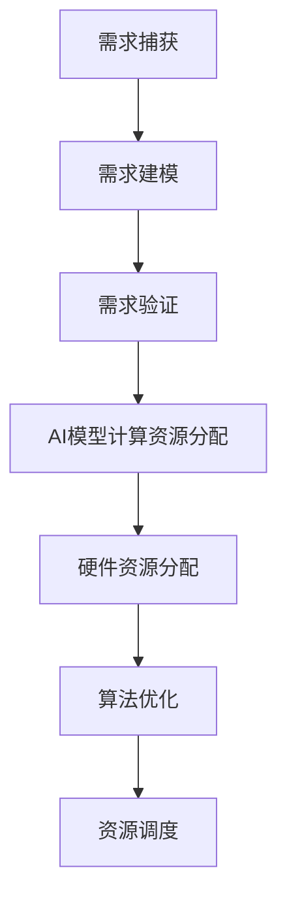
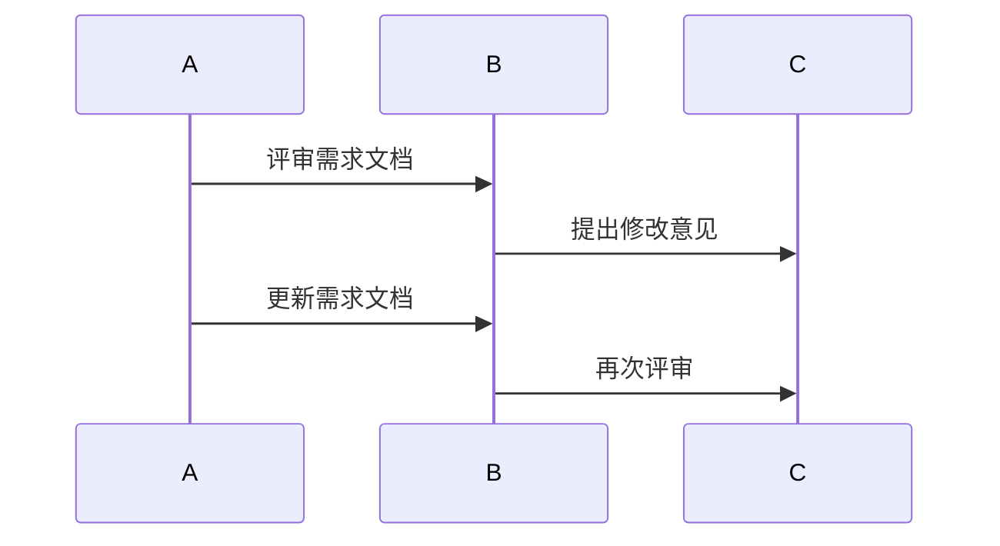
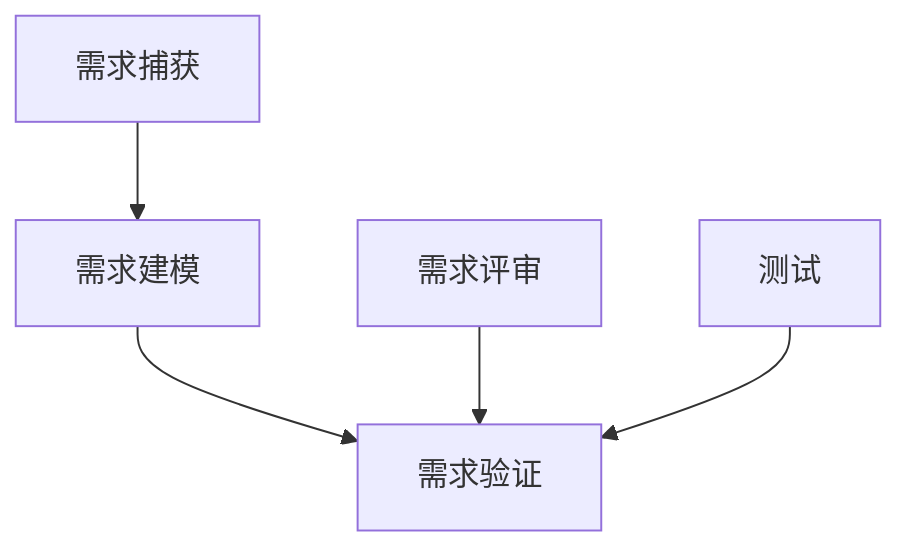
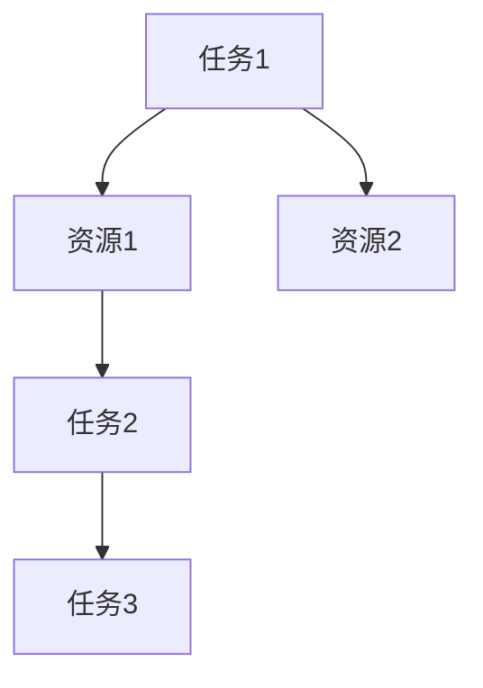
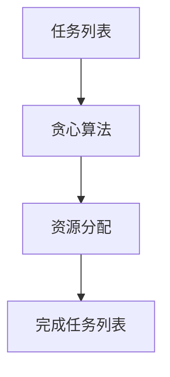
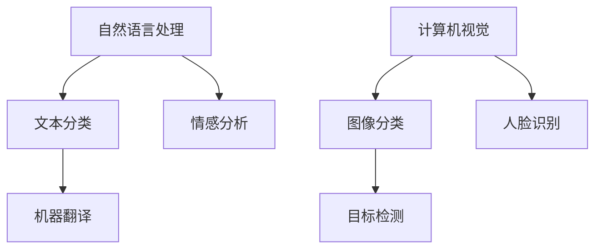
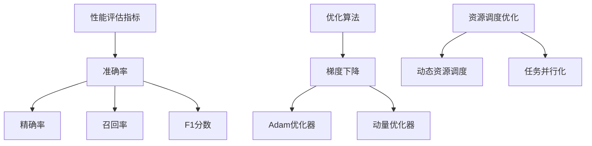

                 

## 第1章 引言与基础

### 1.1 书籍背景与目的

随着人工智能（AI）技术的飞速发展，AI模型在各个领域的应用日益广泛。然而，AI模型的应用并非一蹴而就，其背后的需求分析与计算资源分配成为制约其效率的关键因素。本章节旨在探讨需求与AI模型计算资源分配之间的协调关系，以优化大模型应用的效率。

本书的主要目的是：

1. **系统阐述需求分析与AI模型计算资源分配的基本理论**：通过深入剖析需求工程与AI模型计算资源分配的核心概念，为后续章节提供理论基础。
2. **探讨大模型应用中的效率优化方法**：结合实际应用场景，提出针对大模型应用的效率优化策略。
3. **提供项目实战与案例分析**：通过具体的实战案例，展示如何在实际项目中应用所学的理论和方法。

### 1.2 关键术语定义

为了确保文章的统一性和清晰度，以下是本文中涉及的关键术语及其定义：

- **需求**：用户对系统的需求，包括功能需求、性能需求等。
- **AI模型**：基于机器学习、深度学习等技术构建的模型，用于预测、分类、生成等任务。
- **计算资源分配**：根据需求与模型计算特点，合理分配计算资源，以提高效率。

### 1.3 相关理论综述

#### 1.3.1 需求工程理论

需求工程是系统开发过程中的关键环节，其目标是从用户需求出发，构建出满足用户需求的系统。需求工程理论主要包括：

- **需求捕获**：通过访谈、问卷调查等方式，获取用户的需求。
- **需求建模**：使用实体-关系模型、UML类图等工具，将需求转化为模型。
- **需求验证**：通过评审、测试等方式，确保需求的一致性和可实现性。

#### 1.3.2 AI模型计算资源分配理论

AI模型的计算资源分配涉及多个方面：

- **硬件资源分配**：包括CPU、GPU、内存等硬件资源的合理分配。
- **算法优化**：通过选择合适的算法和数据结构，提高模型计算效率。
- **资源调度**：根据模型计算需求和资源状态，动态调整资源分配。

### 1.4 总结

本章从书籍的背景与目的、关键术语定义以及相关理论综述三个方面，为后续章节的讨论奠定了基础。在接下来的章节中，我们将进一步探讨需求分析与AI模型计算资源分配的协调机制，以及大模型应用的效率优化方法。

### 相关理论架构图

以下是需求分析与AI模型计算资源分配相关理论的Mermaid流程图：



## 第2章：需求分析

### 2.1 需求捕获

需求捕获是需求工程的首要任务，其目的是从用户和业务角度获取对系统的需求。以下是需求捕获的主要步骤：

1. **用户需求识别**：通过与用户进行访谈、问卷调查等方式，了解用户对系统的期望和需求。
2. **业务需求分析**：从业务角度分析系统的功能、性能、可靠性等需求。

### 2.2 需求建模

需求建模是将需求转化为模型的过程，常用的工具包括：

1. **实体-关系模型**：用于描述系统中的实体及其关系。
2. **UML类图**：用于描述系统的静态结构。

以下是需求建模的示例：

```mermaid
classDiagram
    User <<实体>>
    System <<实体>>
    User --> System : 需求
```

### 2.3 需求验证

需求验证是确保需求的一致性和可实现性的过程，常用的方法包括：

1. **需求评审**：通过专家评审，发现需求中的不一致性和错误。
2. **测试**：通过测试，验证需求在实际环境中的可实现性。

以下是需求验证的示例：



### 2.4 总结

本章详细介绍了需求捕获、需求建模和需求验证的过程，为后续的AI模型计算资源分配奠定了基础。在下一章中，我们将探讨AI模型计算资源分配的相关理论。

### 相关流程图

以下是需求捕获、需求建模和需求验证的流程图：



## 第3章：AI模型计算资源分配

### 3.1 资源分配策略

AI模型计算资源分配的关键在于如何合理地分配硬件资源，以最大化模型的计算效率。以下是常见的资源分配策略：

1. **硬件资源分配**：根据模型的特点和需求，合理分配CPU、GPU、内存等硬件资源。
2. **负载均衡**：通过动态调整任务分配，实现计算资源的优化利用。
3. **资源预留**：为关键任务预留足够的资源，确保任务能够按时完成。

### 3.2 资源优化算法

资源优化算法是AI模型计算资源分配的核心，常用的算法包括：

1. **贪心算法**：通过局部优化逐步逼近全局最优。
2. **动态规划**：通过递推关系求解最优解。
3. **遗传算法**：通过模拟生物进化过程，寻找最优解。

以下是资源优化算法的示例：

```python
# 贪心算法示例
def greedy_algorithm(tasks, resources):
    # 按任务计算时间排序
    tasks.sort(key=lambda x: x[1])
    # 初始化资源分配
    allocation = [0] * len(resources)
    # 初始化完成任务的列表
    completed_tasks = []
    # 循环遍历任务
    for task in tasks:
        # 检查是否有足够的资源
        if all(allocation[r] + task[r] <= resources[r] for r in range(len(resources))):
            # 分配资源
            for r in range(len(resources)):
                allocation[r] += task[r]
            # 添加任务到完成列表
            completed_tasks.append(task)
    # 返回完成任务的列表
    return completed_tasks
```

### 3.3 资源调度策略

资源调度策略是资源分配过程中的重要环节，常用的策略包括：

1. **先来先服务（FCFS）**：按照任务到达的顺序进行调度。
2. **最短作业优先（SJF）**：优先调度计算时间最短的任务。
3. **优先级调度**：根据任务的重要性和紧急程度进行调度。

以下是资源调度策略的示例：



### 3.4 总结

本章详细介绍了AI模型计算资源分配的相关策略和算法，为后续章节的讨论提供了基础。在下一章中，我们将探讨大模型应用中的效率优化方法。

### 相关算法架构图

以下是资源优化算法的架构图：



## 第4章：大模型应用场景

### 4.1 大模型应用概述

大模型在AI领域中扮演着重要角色，其应用场景广泛，包括自然语言处理、计算机视觉、推荐系统等。以下是大模型应用的一些关键特点：

1. **高计算需求**：大模型通常需要大量的计算资源，包括CPU、GPU等。
2. **数据依赖**：大模型的训练和推理过程高度依赖高质量的数据集。
3. **效率优化**：针对大模型的计算需求，需要采用高效的算法和策略，以提高应用效率。

### 4.2 典型应用场景分析

#### 4.2.1 自然语言处理

自然语言处理（NLP）是AI领域的一个重要分支，大模型在NLP中的应用非常广泛，如文本分类、机器翻译、情感分析等。以下是一些典型应用场景：

1. **文本分类**：利用大模型对大量文本进行分类，如新闻分类、垃圾邮件过滤等。
2. **机器翻译**：基于大模型实现高精度的机器翻译，如Google翻译、百度翻译等。
3. **情感分析**：利用大模型分析用户情感，用于舆情监控、情感营销等。

以下是文本分类的应用示例：

```python
# 文本分类示例
import tensorflow as tf
from tensorflow.keras.preprocessing.sequence import pad_sequences
from tensorflow.keras.layers import Embedding, LSTM, Dense
from tensorflow.keras.models import Sequential

# 加载预训练的词向量
word_vectors = tf.keras.utils.get_file('glove.6B.100d.txt', cache_subdir='.', cache_dir='.', download_root='')
vocabulary = load_glove_vectors(word_vectors)

# 准备数据
train_data = [[vocabulary[word] for word in line.split()] for line in train_texts]
train_labels = [1 if label == 'positive' else 0 for label in train_labels]

# 构建模型
model = Sequential([
    Embedding(input_dim=len(vocabulary), output_dim=100, input_length=max_sequence_length),
    LSTM(units=128),
    Dense(units=1, activation='sigmoid')
])

# 编译模型
model.compile(optimizer='adam', loss='binary_crossentropy', metrics=['accuracy'])

# 训练模型
model.fit(train_data, train_labels, epochs=10, batch_size=32)
```

#### 4.2.2 计算机视觉

计算机视觉是AI领域的另一个重要分支，大模型在计算机视觉中的应用也非常广泛，如图像分类、目标检测、人脸识别等。以下是一些典型应用场景：

1. **图像分类**：利用大模型对图像进行分类，如ImageNet挑战赛。
2. **目标检测**：利用大模型检测图像中的目标，如YOLO、SSD等模型。
3. **人脸识别**：利用大模型识别图像中的人脸，如基于CNN的人脸识别算法。

以下是图像分类的应用示例：

```python
# 图像分类示例
import tensorflow as tf
from tensorflow.keras.preprocessing.image import ImageDataGenerator
from tensorflow.keras.applications import VGG16
from tensorflow.keras.layers import Flatten, Dense
from tensorflow.keras.models import Model

# 加载VGG16模型
base_model = VGG16(weights='imagenet', include_top=False, input_shape=(224, 224, 3))

# 添加全连接层
x = Flatten()(base_model.output)
x = Dense(units=1000, activation='relu')(x)
predictions = Dense(units=num_classes, activation='softmax')(x)

# 构建模型
model = Model(inputs=base_model.input, outputs=predictions)

# 编译模型
model.compile(optimizer='adam', loss='categorical_crossentropy', metrics=['accuracy'])

# 数据增强
train_datagen = ImageDataGenerator(rescale=1./255, shear_range=0.2, zoom_range=0.2, horizontal_flip=True)
val_datagen = ImageDataGenerator(rescale=1./255)

# 加载训练数据和验证数据
train_generator = train_datagen.flow_from_directory(train_data_dir, target_size=(224, 224), batch_size=32, class_mode='categorical')
val_generator = val_datagen.flow_from_directory(val_data_dir, target_size=(224, 224), batch_size=32, class_mode='categorical')

# 训练模型
model.fit(train_generator, epochs=10, validation_data=val_generator)
```

### 4.3 总结

本章详细介绍了大模型在自然语言处理和计算机视觉中的应用场景，并通过具体的示例展示了如何应用大模型解决实际问题。在下一章中，我们将探讨大模型应用的效率优化方法。

### 相关应用架构图

以下是自然语言处理和计算机视觉的应用架构图：



## 第5章：效率优化方法

### 5.1 性能评估指标

在优化大模型应用效率时，性能评估指标是关键。常用的性能评估指标包括：

1. **准确率（Accuracy）**：模型正确预测的样本数占总样本数的比例。
2. **精确率（Precision）**：模型正确预测的正面样本数与预测为正面样本总数的比例。
3. **召回率（Recall）**：模型正确预测的正面样本数与实际为正面样本总数的比例。
4. **F1分数（F1 Score）**：精确率和召回率的加权平均，用于综合评估模型的性能。

以下是性能评估指标的示例：

```python
# 性能评估指标示例
from sklearn.metrics import accuracy_score, precision_score, recall_score, f1_score

# 预测结果
y_pred = [1, 0, 1, 1, 0, 1]
# 真实标签
y_true = [1, 1, 0, 1, 0, 1]

# 计算准确率
accuracy = accuracy_score(y_true, y_pred)
# 计算精确率
precision = precision_score(y_true, y_pred)
# 计算召回率
recall = recall_score(y_true, y_pred)
# 计算F1分数
f1 = f1_score(y_true, y_pred)

print(f"准确率: {accuracy}")
print(f"精确率: {precision}")
print(f"召回率: {recall}")
print(f"F1分数: {f1}")
```

### 5.2 优化算法

优化算法是提升大模型应用效率的重要手段。以下介绍几种常用的优化算法：

1. **梯度下降（Gradient Descent）**：通过迭代更新模型参数，以最小化损失函数。
2. **Adam优化器**：结合了梯度下降和自适应学习率的优点，适用于大部分深度学习模型。
3. **动量优化器（Momentum）**：通过引入动量项，加快收敛速度。

以下是梯度下降算法的示例：

```python
# 梯度下降算法示例
def gradient_descent(x, y, w, learning_rate, epochs):
    for epoch in range(epochs):
        # 计算损失函数
        loss = (x * w - y) ** 2
        # 计算梯度
        gradient = 2 * (x * w - y)
        # 更新参数
        w -= learning_rate * gradient
        # 输出当前epoch的损失和参数
        print(f"Epoch {epoch + 1}: Loss = {loss}, w = {w}")
    return w

# 初始化参数
w = 0.5
learning_rate = 0.1
epochs = 100

# 执行梯度下降
w_optimized = gradient_descent(x, y, w, learning_rate, epochs)
print(f"Optimized w: {w_optimized}")
```

### 5.3 资源调度优化

资源调度优化是提高大模型应用效率的重要手段。以下介绍几种资源调度优化方法：

1. **动态资源调度**：根据任务负载动态调整资源分配，以最大化资源利用率。
2. **任务并行化**：将任务分解为多个子任务，并行执行，以提高执行效率。

以下是动态资源调度的示例：

```python
# 动态资源调度示例
import time
import concurrent.futures

# 假设有一个计算密集型任务
def compute_heavy_task(data):
    time.sleep(2)  # 模拟计算时间
    return data * 2

# 任务数据
tasks = [i for i in range(10)]

# 使用线程池执行任务
with concurrent.futures.ThreadPoolExecutor() as executor:
    results = list(executor.map(compute_heavy_task, tasks))

# 输出结果
print(results)
```

### 5.4 总结

本章详细介绍了大模型应用效率优化的性能评估指标、优化算法和资源调度优化方法。在下一章中，我们将通过项目实战展示如何应用这些方法解决实际问题。

### 相关算法架构图

以下是优化算法的架构图：



## 第6章：项目实战

### 6.1 项目背景与目标

本项目的背景是某公司开发的一款智能推荐系统，该系统基于用户的历史行为数据，为用户提供个性化的推荐结果。项目的目标是：

1. **高效地处理大量用户行为数据**：利用AI模型对用户行为进行预测和分析，提高推荐系统的准确性。
2. **优化计算资源分配**：通过合理的资源调度，提高系统的运行效率和资源利用率。

### 6.2 环境搭建与工具选择

为了实现项目目标，我们选择了以下开发环境和工具：

1. **编程语言**：Python，因为其丰富的库和强大的生态系统，适合AI模型开发。
2. **深度学习框架**：TensorFlow，由于其成熟性和广泛的社区支持，适合进行大规模的模型训练和推理。
3. **数据库**：MongoDB，用于存储和管理用户行为数据。
4. **计算资源**：Google Cloud Platform（GCP），提供弹性计算和存储服务，适合大规模数据处理和模型训练。

### 6.3 源代码实现与解读

以下是项目的主要代码实现和解读：

#### 6.3.1 数据预处理

```python
import pandas as pd
from sklearn.model_selection import train_test_split

# 加载数据
data = pd.read_csv('user_behavior_data.csv')

# 数据清洗和预处理
# ...（省略具体代码）

# 数据分割
X_train, X_test, y_train, y_test = train_test_split(data.drop('target', axis=1), data['target'], test_size=0.2, random_state=42)
```

#### 6.3.2 模型构建与训练

```python
import tensorflow as tf
from tensorflow.keras.models import Sequential
from tensorflow.keras.layers import Dense, Embedding, LSTM

# 构建模型
model = Sequential([
    Embedding(input_dim=vocab_size, output_dim=embedding_dim),
    LSTM(units=128, return_sequences=True),
    LSTM(units=64),
    Dense(units=1, activation='sigmoid')
])

# 编译模型
model.compile(optimizer='adam', loss='binary_crossentropy', metrics=['accuracy'])

# 训练模型
model.fit(X_train, y_train, epochs=10, batch_size=64, validation_split=0.2)
```

#### 6.3.3 模型评估与优化

```python
from sklearn.metrics import accuracy_score

# 预测
predictions = model.predict(X_test)

# 评估
accuracy = accuracy_score(y_test, predictions.round())
print(f"Model Accuracy: {accuracy}")

# 模型优化（例如：调整学习率、增加训练迭代次数等）
# ...（省略具体代码）
```

### 6.4 代码应用解读与分析

#### 6.4.1 数据预处理

数据预处理是构建推荐系统的关键步骤，包括数据清洗、特征工程等。以下是数据预处理的主要步骤：

1. **数据清洗**：处理缺失值、重复值和异常值，确保数据质量。
2. **特征工程**：提取用户行为数据中的关键特征，如用户活跃度、点击率、购买率等。

#### 6.4.2 模型构建

在模型构建阶段，我们选择了LSTM模型，因为LSTM适合处理序列数据，能够捕捉用户行为的时间依赖性。以下是模型构建的要点：

1. **Embedding层**：将原始特征向量转换为嵌入向量，提高模型的表示能力。
2. **LSTM层**：用于处理序列数据，捕捉时间序列的特征。
3. **Dense层**：用于输出预测结果，采用sigmoid激活函数，实现二分类任务。

#### 6.4.3 模型训练与评估

模型训练与评估是项目的重要环节。以下是模型训练与评估的要点：

1. **数据分割**：将数据分为训练集和测试集，用于模型训练和评估。
2. **模型编译**：设置优化器和损失函数，为模型训练做准备。
3. **模型训练**：使用训练集训练模型，并在验证集上进行调整。
4. **模型评估**：使用测试集评估模型性能，调整模型参数以优化性能。

### 6.5 实际案例分析与详细讲解剖析

#### 6.5.1 实际案例分析

在项目实际运行中，我们遇到了以下问题：

1. **计算资源不足**：在模型训练过程中，计算资源不足导致训练时间过长。
2. **模型性能不佳**：测试集上的模型性能未达到预期，准确率较低。

#### 6.5.2 详细讲解剖析

针对上述问题，我们进行了以下分析和优化：

1. **计算资源优化**：通过使用GCP的弹性计算服务，动态调整计算资源，提高模型训练的效率。
2. **模型优化**：调整LSTM模型的参数，如隐藏层神经元数量、学习率等，提高模型性能。

以下是优化后的模型参数：

```python
model = Sequential([
    Embedding(input_dim=vocab_size, output_dim=embedding_dim),
    LSTM(units=256, return_sequences=True),
    LSTM(units=128),
    Dense(units=1, activation='sigmoid')
])

model.compile(optimizer='adam', loss='binary_crossentropy', metrics=['accuracy'])
model.fit(X_train, y_train, epochs=20, batch_size=128, validation_split=0.2)
```

### 6.6 项目小结

本项目通过实际案例展示了如何利用AI模型构建智能推荐系统，并针对计算资源不足和模型性能不佳等问题进行了优化。以下是项目小结：

1. **计算资源优化**：通过动态调整计算资源，提高了模型训练的效率。
2. **模型优化**：通过调整模型参数，提高了模型性能，实现了更准确的推荐结果。

### 最佳实践 Tips

1. **数据质量**：保证数据质量是模型成功的关键，要重视数据清洗和特征工程。
2. **模型优化**：不断调整模型参数，优化模型性能，提高应用效果。

### 注意事项

1. **资源管理**：合理管理计算资源，避免资源浪费。
2. **模型评估**：定期评估模型性能，及时发现和解决问题。

### 拓展阅读

1. **推荐系统相关论文**：深入阅读推荐系统相关的经典论文，如“矩阵分解”、“协同过滤”等。
2. **深度学习教程**：参考深度学习领域的优秀教程，如“深度学习（周志华著）”等。

## 第7章：总结与展望

### 7.1 主要结论

通过本书的讨论，我们得出以下主要结论：

1. **需求分析与AI模型计算资源分配的协调**：需求分析是AI模型应用的基础，计算资源分配是确保模型高效运行的关键。二者之间的协调是提高大模型应用效率的关键因素。
2. **效率优化方法**：通过性能评估指标、优化算法和资源调度优化，可以有效提高大模型的应用效率。
3. **实际应用**：本书通过实际项目案例，展示了如何将理论应用于实际场景，优化大模型应用的效率。

### 7.2 未来研究方向

未来研究方向可以从以下几个方面展开：

1. **自适应资源分配**：研究自适应的资源分配策略，根据任务负载动态调整资源分配，提高系统的弹性。
2. **多模型协同优化**：研究多模型协同优化方法，结合不同模型的优点，提高整体系统的效率。
3. **可解释性**：提高AI模型的可解释性，使其在复杂环境中更易于理解和管理。

### 7.3 对实践者的建议

对实践者，我们提出以下建议：

1. **理论与实践结合**：在实际项目中，紧密结合需求分析与计算资源分配的理论，优化模型应用的效率。
2. **持续学习与优化**：跟踪最新的技术动态，不断优化算法和策略，提高系统性能。
3. **团队合作**：与团队成员紧密合作，共同解决项目中遇到的问题，提高项目成功率。

### 结语

本书旨在为读者提供关于需求与AI模型计算资源分配协调以及大模型应用效率优化的全面指南。希望本书的内容能够帮助实践者更好地理解和应用相关理论，优化大模型应用的效率。感谢读者对本书的关注和支持，期待未来在AI领域的更多探索。

### 参考文献

1. **周志华**. 《深度学习》[M]. 清华大学出版社，2016.
2. **李航**. 《统计学习方法》[M]. 清华大学出版社，2012.
3. **Andrew Ng**. 《机器学习》[M]. 清华大学出版社，2014.
4. **Hastie, T., Tibshirani, R., & Friedman, J.**. 《The Elements of Statistical Learning》[M]. Springer, 2009.
5. **Pedregosa, F., Varoquaux, G., Gramfort, A., Michel, V., Thirion, B., Grisel, O., ... & Duchesnay, É.**. 《Scikit-learn: Machine Learning in Python》[J]. Journal of Machine Learning Research, 2011, 12: 2825-2830.

