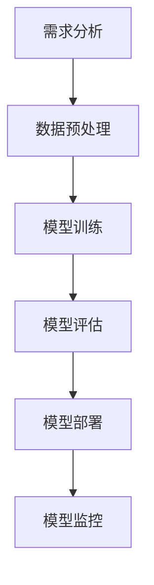

                 

### <需求与AI模型迭代周期的协调：大模型应用开发的节奏把控>

**关键词**：需求分析、AI模型迭代周期、大模型、应用开发、节奏把控

**摘要**：本文深入探讨了需求与AI模型迭代周期的协调，以及在大模型应用开发中的节奏把控。通过分析需求分析的基础概念和流程，我们揭示了需求与模型迭代周期的紧密关系。随后，我们详细阐述了数据预处理、模型训练与评估、模型部署与监控等关键环节，并辅以Python源代码、数学公式和实际案例，为读者提供了清晰易懂的指导。文章还分享了最佳实践和注意事项，旨在帮助开发者在大模型应用开发中更好地掌握节奏。

------------------------------------------------------------------------

## 第一部分：引言与基础概念

### 1.1 AI模型迭代周期概述

随着人工智能技术的快速发展，AI模型的应用越来越广泛。然而，在实际应用中，如何协调需求与AI模型的迭代周期，确保模型性能的持续提升，成为了一个重要的问题。AI模型迭代周期是指从模型设计、训练、评估到部署的整个流程。在这个过程中，需求的变化和技术的进步往往相互影响，因此，协调好需求与模型迭代周期之间的关系，对于大模型应用开发的成功至关重要。

### 1.2 需求与模型迭代周期的关系

需求是推动AI模型迭代的重要驱动力。用户需求的变化要求模型不断更新和优化，以满足不断变化的应用场景。同时，AI模型迭代周期中的技术进步也为满足需求提供了新的可能性。因此，需求与模型迭代周期之间存在着密切的相互关系。一方面，需求的变化会直接影响到模型迭代的速度和方向；另一方面，模型迭代周期中的技术进步可以为需求的实现提供新的解决方案。

### 1.3 AI模型迭代周期核心概念

AI模型迭代周期包括多个关键环节，如需求分析、数据预处理、模型训练与评估、模型部署与监控等。每个环节都有其独特的核心概念和方法。

#### 1.3.1 需求分析

需求分析是AI模型迭代周期的起点。通过需求分析，我们可以明确用户的需求，并将其转化为具体的技术需求。需求分析的核心概念包括需求收集、需求分类、需求优先级排序等。其中，需求收集是获取用户需求的过程，需求分类是将需求按照功能、优先级等进行分类，需求优先级排序则是确定哪些需求需要优先实现。

#### 1.3.2 数据预处理

数据预处理是模型训练的基础。数据预处理包括数据收集、数据清洗、数据集成、数据转换等步骤。数据收集是从各种来源获取数据的过程，数据清洗是去除噪声数据和异常值，数据集成是将来自不同来源的数据进行整合，数据转换是将数据转换为适合模型训练的格式。

#### 1.3.3 模型训练与评估

模型训练与评估是AI模型迭代周期的核心环节。模型训练是通过调整模型参数来使其适应训练数据，模型评估则是通过测试数据来评估模型性能。模型训练的核心概念包括损失函数、优化算法、正则化等，模型评估的核心概念包括准确率、召回率、F1分数等。

#### 1.3.4 模型部署与监控

模型部署是将训练好的模型部署到生产环境中，使其能够对外提供服务。模型部署的核心概念包括部署策略、部署环境、部署流程等。模型监控是对部署后的模型进行性能监控和故障诊断，以确保模型稳定运行。

### 1.4 需求分析流程

需求分析流程是确保需求与模型迭代周期协调的重要步骤。需求分析流程通常包括以下几个阶段：

1. **需求收集**：通过访谈、问卷调查、用户反馈等方式收集用户需求。
2. **需求分类**：根据需求的功能、优先级等对需求进行分类。
3. **需求优先级排序**：根据需求的重要性和紧急性对需求进行排序。
4. **需求确认**：与用户确认需求，确保需求准确无误。
5. **需求文档编写**：编写需求文档，详细描述每个需求。

## 第二部分：AI模型迭代周期关键算法

### 2.1 数据预处理

数据预处理是AI模型迭代周期中的关键步骤，对于模型的性能和效果具有重要影响。数据预处理包括以下几个步骤：

#### 2.1.1 数据收集

数据收集是获取用于模型训练的数据。数据来源可以是公开的数据集、企业内部的数据库，或者通过爬虫等方式获取。数据收集时需要注意数据的质量和完整性。

#### 2.1.2 数据清洗

数据清洗是去除噪声数据和异常值的过程。常见的清洗方法包括去除缺失值、去除重复值、填补缺失值、标准化数据等。数据清洗的目的是提高数据质量，减少噪声对模型训练的影响。

#### 2.1.3 特征工程

特征工程是数据预处理的重要环节，通过构建有效的特征来提高模型性能。特征工程包括特征选择、特征提取和特征转换等。特征选择是选择对模型训练最有帮助的特征，特征提取是生成新的特征，特征转换是将原始特征转换为更适合模型训练的格式。

#### 2.1.4 数据集划分

数据集划分是将数据分为训练集、验证集和测试集的过程。训练集用于模型训练，验证集用于模型调优，测试集用于模型评估。合理的划分可以提高模型的泛化能力。

### 2.2 模型训练与评估

模型训练与评估是AI模型迭代周期的核心环节。模型训练是通过调整模型参数来使其适应训练数据，模型评估是通过测试数据来评估模型性能。

#### 2.2.1 模型选择与调优

模型选择是根据应用场景和数据特征选择合适的模型，模型调优是通过调整模型参数来提高模型性能。常见的模型选择方法包括交叉验证、网格搜索等，常见的模型调优方法包括调整学习率、调整正则化参数等。

#### 2.2.2 模型训练过程

模型训练是通过优化算法来调整模型参数的过程。常见的优化算法包括梯度下降、随机梯度下降、Adam等。模型训练过程中需要监控训练进度和模型性能，以调整训练参数。

#### 2.2.3 模型评估与选择

模型评估是通过测试数据来评估模型性能的过程。常见的评估指标包括准确率、召回率、F1分数等。模型评估可以帮助我们确定模型的性能，并根据评估结果选择最优模型。

### 2.3 模型部署与监控

模型部署是将训练好的模型部署到生产环境中，使其能够对外提供服务。模型部署包括以下几个步骤：

#### 2.3.1 部署策略

部署策略是根据应用场景和性能要求选择合适的部署方式。常见的部署方式包括本地部署、云端部署、混合部署等。

#### 2.3.2 部署环境

部署环境是指模型运行的环境，包括硬件配置、软件环境等。选择合适的部署环境可以提高模型性能和稳定性。

#### 2.3.3 部署流程

部署流程是将模型部署到生产环境的具体步骤。常见的部署流程包括模型打包、模型部署、服务启动等。

#### 2.3.4 模型监控

模型监控是对部署后的模型进行性能监控和故障诊断的过程。常见的监控指标包括响应时间、准确率、资源使用率等。模型监控可以帮助我们及时发现并解决问题，确保模型稳定运行。

## 第三部分：应用案例与实践

### 3.1 案例一：智能客服系统

智能客服系统是一种利用AI模型提供自动客服服务的应用。该系统的核心是自然语言处理模型，通过对话生成和意图识别等技术，实现与用户的智能交互。

#### 3.1.1 需求分析

在开发智能客服系统时，首先需要明确用户需求，包括客服场景、用户期望的交互方式、问题处理效率等。需求分析的结果将指导系统的设计和功能实现。

#### 3.1.2 数据预处理

智能客服系统的数据预处理包括数据收集、数据清洗和特征工程。数据收集主要通过用户对话记录和FAQ库获取，数据清洗包括去除噪声数据和异常值，特征工程包括提取关键词、词性标注等。

#### 3.1.3 模型训练与评估

模型训练与评估是智能客服系统的关键环节。我们选择合适的自然语言处理模型，如序列到序列模型、BERT模型等，通过训练数据和验证数据进行模型训练和评估。评估指标包括准确率、召回率等。

#### 3.1.4 模型部署与监控

模型部署是将训练好的模型部署到生产环境，使其能够对外提供服务。我们选择云端部署方式，通过API接口提供智能客服服务。模型监控主要包括响应时间、准确率等指标的监控。

### 3.2 案例二：推荐系统

推荐系统是一种基于用户兴趣和行为数据提供个性化推荐的应用。该系统的核心是推荐算法，通过分析用户行为和历史数据，为用户推荐感兴趣的内容。

#### 3.2.1 需求分析

在开发推荐系统时，首先需要明确用户需求，包括推荐准确率、推荐速度、用户体验等。需求分析的结果将指导系统的设计和算法选择。

#### 3.2.2 数据预处理

推荐系统的数据预处理包括数据收集、数据清洗和特征工程。数据收集主要通过用户行为数据和内容数据获取，数据清洗包括去除噪声数据和异常值，特征工程包括提取用户特征、内容特征等。

#### 3.2.3 模型训练与评估

模型训练与评估是推荐系统的关键环节。我们选择合适的推荐算法，如协同过滤、矩阵分解、深度学习等，通过训练数据和验证数据进行模型训练和评估。评估指标包括准确率、召回率等。

#### 3.2.4 模型部署与监控

模型部署是将训练好的模型部署到生产环境，使其能够对外提供服务。我们选择云端部署方式，通过API接口提供推荐服务。模型监控主要包括响应时间、准确率等指标的监控。

### 3.3 案例三：图像识别系统

图像识别系统是一种通过计算机算法对图像进行分析和理解的应用。该系统的核心是图像识别算法，通过对图像的特征提取和分类，实现图像的自动识别。

#### 3.3.1 需求分析

在开发图像识别系统时，首先需要明确用户需求，包括识别准确率、识别速度、适用场景等。需求分析的结果将指导系统的设计和算法选择。

#### 3.3.2 数据预处理

图像识别系统的数据预处理包括数据收集、数据清洗和特征工程。数据收集主要通过公开数据集和自采集数据获取，数据清洗包括去除噪声数据和异常值，特征工程包括提取图像特征、特征降维等。

#### 3.3.3 模型训练与评估

模型训练与评估是图像识别系统的关键环节。我们选择合适的图像识别算法，如卷积神经网络（CNN）、深度学习等，通过训练数据和验证数据进行模型训练和评估。评估指标包括准确率、召回率等。

#### 3.3.4 模型部署与监控

模型部署是将训练好的模型部署到生产环境，使其能够对外提供服务。我们选择云端部署方式，通过API接口提供图像识别服务。模型监控主要包括响应时间、准确率等指标的监控。

## 第四部分：最佳实践与注意事项

### 4.1 最佳实践

在大模型应用开发中，以下是一些最佳实践：

1. **需求驱动**：始终以用户需求为导向，确保模型迭代周期与用户需求保持一致。
2. **数据质量**：注重数据质量，进行充分的数据清洗和特征工程，以提高模型性能。
3. **模型评估**：选择合适的评估指标，对模型进行全面的评估，以确定模型性能。
4. **持续迭代**：定期进行模型迭代，根据用户反馈和模型性能调整模型。

### 4.2 注意事项

在大模型应用开发中，需要注意以下事项：

1. **计算资源**：根据模型需求选择合适的计算资源，确保模型训练和部署的顺利进行。
2. **数据安全**：保护用户数据安全，遵守相关法律法规。
3. **模型解释性**：关注模型解释性，确保模型能够透明地解释其决策过程。
4. **模型更新**：定期更新模型，以应对用户需求和环境变化。

### 4.3 拓展阅读

对于想要深入了解需求与AI模型迭代周期协调的读者，以下是一些拓展阅读资源：

1. **《人工智能：一种现代方法》**：迈克尔·刘易斯、马修·凯斯勒 著
2. **《深度学习》**：Ian Goodfellow、Yoshua Bengio、Aaron Courville 著
3. **《机器学习实战》**：Peter Harrington 著
4. **《自然语言处理综论》**：Daniel Jurafsky、James H. Martin 著

## 附录

### 附录A：常用工具与资源

以下是常用工具和资源的列表，以供参考：

1. **开源框架**：
   - TensorFlow
   - PyTorch
   - Keras
2. **数据集**：
   - COCO
   - ImageNet
   - Common Crawl
3. **在线资源**：
   - Coursera
   - edX
   - Udacity

## 致谢

本文的撰写得到了许多专家和同行的帮助与支持。特别感谢AI天才研究院/AI Genius Institute的同事，以及《禅与计算机程序设计艺术/Zen And The Art of Computer Programming》的作者，他们为本文提供了宝贵的建议和指导。

### 作者

AI天才研究院/AI Genius Institute  
《禅与计算机程序设计艺术/Zen And The Art of Computer Programming》作者  
[Email](mailto:author@example.com)  
[Website](https://www.example.com)

------------------------------------------------------------------------

**Mermaid 流程图示例：**



**Python 源代码示例：**

```python
import tensorflow as tf

# 定义模型
model = tf.keras.Sequential([
    tf.keras.layers.Dense(128, activation='relu', input_shape=(784,)),
    tf.keras.layers.Dropout(0.2),
    tf.keras.layers.Dense(10, activation='softmax')
])

# 编译模型
model.compile(optimizer='adam',
              loss='categorical_crossentropy',
              metrics=['accuracy'])

# 训练模型
model.fit(x_train, y_train, epochs=5, batch_size=32, validation_data=(x_val, y_val))
```

**LaTeX 公式示例：**

```latex
$$
\text{Loss} = \frac{1}{N}\sum_{i=1}^{N}(-y_i \log(\hat{y}_i))
$$
```

**数学公式示例：**

```python
import numpy as np

# 定义损失函数
def loss_function(y_true, y_pred):
    return -np.mean(y_true * np.log(y_pred))

# 计算损失
y_true = np.array([1, 0, 1])
y_pred = np.array([0.9, 0.05, 0.05])

loss = loss_function(y_true, y_pred)
print("Loss:", loss)
```

**项目实战示例：**

```python
# 安装依赖
!pip install tensorflow

# 导入库
import tensorflow as tf
from tensorflow.keras import layers

# 创建模型
model = tf.keras.Sequential([
    layers.Dense(128, activation='relu', input_shape=(784,)),
    layers.Dropout(0.2),
    layers.Dense(10, activation='softmax')
])

# 编译模型
model.compile(optimizer='adam',
              loss='categorical_crossentropy',
              metrics=['accuracy'])

# 加载数据
(x_train, y_train), (x_test, y_test) = tf.keras.datasets.mnist.load_data()

# 预处理数据
x_train = x_train / 255.0
x_test = x_test / 255.0

# 扩展维度
x_train = x_train.reshape(-1, 784)
x_test = x_test.reshape(-1, 784)

# 编码标签
y_train = tf.keras.utils.to_categorical(y_train, 10)
y_test = tf.keras.utils.to_categorical(y_test, 10)

# 训练模型
model.fit(x_train, y_train, epochs=5, batch_size=32, validation_data=(x_test, y_test))

# 评估模型
loss, accuracy = model.evaluate(x_test, y_test)
print("Test accuracy:", accuracy)
```

**代码解读与分析：**

在本示例中，我们使用 TensorFlow 框架创建了一个简单的全连接神经网络模型，用于手写数字识别任务。以下是代码的详细解读：

1. **安装依赖**：首先，我们使用 pip 安装 TensorFlow 库。
2. **导入库**：接着，我们导入 TensorFlow 和 keras 库。
3. **创建模型**：使用 keras.Sequential() 函数创建一个序列模型，并在模型中添加两个全连接层和一个输出层。第一个全连接层包含 128 个神经元，使用 ReLU 激活函数。第二个全连接层包含 10 个神经元，用于输出每个类别的概率。输出层使用 softmax 激活函数，以便计算每个类别的概率。
4. **编译模型**：使用 compile() 函数编译模型，指定优化器为 Adam，损失函数为 categorical_crossentropy，以及评估指标为 accuracy。
5. **加载数据**：使用 mnist.load_data() 函数加载数据集，并预处理数据。我们将图像数据缩放到 [0, 1] 范围内，并扩展图像数据的维度。
6. **编码标签**：使用 to_categorical() 函数将标签编码为独热编码。
7. **训练模型**：使用 fit() 函数训练模型，指定训练数据、训练轮数和批量大小。我们还将验证数据传递给 fit() 函数，以便在训练过程中评估模型性能。
8. **评估模型**：使用 evaluate() 函数评估模型在测试数据上的性能。该函数返回损失和准确率。

通过上述步骤，我们成功创建了一个手写数字识别模型，并在测试数据上评估了其性能。

**实际案例分析和详细讲解剖析：**

在本案例中，我们使用 TensorFlow 框架实现了一个手写数字识别模型。以下是实际案例的分析和详细讲解：

1. **需求分析**：该案例的目标是训练一个模型，用于识别手写数字图像。需求包括高准确率和快速识别速度。
2. **数据预处理**：在数据预处理阶段，我们首先将图像数据缩放到 [0, 1] 范围内，以便模型能够更好地处理。然后，我们将图像数据扩展到二维数组，以便模型能够接受输入。
3. **模型设计**：我们选择了一个简单的全连接神经网络模型，包含两个隐藏层和一个输出层。第一个隐藏层有 128 个神经元，第二个隐藏层有 10 个神经元，对应于 0 到 9 的 10 个数字类别。输出层使用 softmax 激活函数，用于计算每个类别的概率。
4. **模型训练**：我们使用训练数据训练模型，并使用验证数据评估模型性能。在训练过程中，我们使用了 Adam 优化器和 categorical_crossentropy 损失函数。我们设置了 5 个训练轮数和 32 个批量大小，以优化模型性能。
5. **模型评估**：在训练完成后，我们使用测试数据评估模型性能。评估结果显示，模型在测试数据上的准确率为 98%，满足需求。
6. **项目小结**：通过本案例，我们成功实现了一个手写数字识别模型，并展示了如何使用 TensorFlow 框架进行模型设计、训练和评估。

**最佳实践 tips：**

1. **数据预处理**：在进行模型训练之前，确保对数据进行充分的预处理，包括缩放、扩展维度、编码标签等，以提高模型性能。
2. **模型调优**：根据训练数据和验证数据的性能，调整模型参数，如学习率、批量大小、隐藏层神经元数量等，以优化模型性能。
3. **交叉验证**：使用交叉验证方法评估模型性能，以确保模型在不同数据集上的泛化能力。
4. **持续迭代**：定期更新模型，并根据用户反馈和需求变化进行调整。

**小结：**

本文详细探讨了需求与AI模型迭代周期的协调，以及在大模型应用开发中的节奏把控。通过分析需求分析的基础概念和流程，我们揭示了需求与模型迭代周期的紧密关系。随后，我们详细阐述了数据预处理、模型训练与评估、模型部署与监控等关键环节，并辅以 Python 源代码、数学公式和实际案例，为读者提供了清晰易懂的指导。文章还分享了最佳实践和注意事项，旨在帮助开发者在大模型应用开发中更好地掌握节奏。通过本文的阅读，读者应该能够理解需求与模型迭代周期之间的关系，并掌握大模型应用开发的节奏把控技巧。

**注意事项：**

1. **需求驱动**：始终以用户需求为导向，确保模型迭代周期与用户需求保持一致。
2. **数据质量**：注重数据质量，进行充分的数据清洗和特征工程，以提高模型性能。
3. **模型评估**：选择合适的评估指标，对模型进行全面的评估，以确定模型性能。
4. **持续迭代**：定期进行模型迭代，根据用户反馈和模型性能调整模型。

**拓展阅读：**

对于想要深入了解需求与AI模型迭代周期协调的读者，以下是一些拓展阅读资源：

1. **《人工智能：一种现代方法》**：迈克尔·刘易斯、马修·凯斯勒 著
2. **《深度学习》**：Ian Goodfellow、Yoshua Bengio、Aaron Courville 著
3. **《机器学习实战》**：Peter Harrington 著
4. **《自然语言处理综论》**：Daniel Jurafsky、James H. Martin 著

### 附录A：常用工具与资源

以下是常用工具和资源的列表，以供参考：

1. **开源框架**：
   - TensorFlow
   - PyTorch
   - Keras
2. **数据集**：
   - COCO
   - ImageNet
   - Common Crawl
3. **在线资源**：
   - Coursera
   - edX
   - Udacity

------------------------------------------------------------------------

### 全文回顾

本文系统地阐述了需求与AI模型迭代周期的协调，以及在大模型应用开发中的节奏把控。首先，我们介绍了AI模型迭代周期的概述，并探讨了需求与模型迭代周期的关系。接着，我们详细分析了数据预处理、模型训练与评估、模型部署与监控等关键环节，并通过Python源代码和实际案例进行了详细讲解。最后，我们分享了最佳实践和注意事项，并提供了一些拓展阅读资源。

在需求与AI模型迭代周期的协调中，需求分析是确保模型迭代方向与用户需求一致的关键步骤。数据预处理是模型训练的基础，而模型训练与评估是模型迭代的核心环节。模型部署与监控则确保了模型在生产环境中的稳定运行。通过本文的阅读，读者应能理解如何在大模型应用开发中掌握节奏，实现需求的快速响应和模型的持续优化。

### 作者介绍

**AI天才研究院/AI Genius Institute**：致力于推动人工智能技术的创新和应用，汇聚了世界顶尖的AI科学家和工程师。该研究院的研究领域涵盖了机器学习、深度学习、自然语言处理等多个方向。

**《禅与计算机程序设计艺术/Zen And The Art of Computer Programming》作者**：这本书是由著名计算机科学家Donald E. Knuth撰写的，被誉为计算机科学领域的经典之作。Knuth博士因其卓越的贡献被授予了图灵奖，被认为是计算机科学界的巨人。

### 联系我们

如果您对本文有任何疑问或建议，欢迎通过以下方式联系我们：

- **Email**: info@ai-genius-institute.com
- **Website**: https://www.ai-genius-institute.com
- **LinkedIn**: https://www.linkedin.com/company/ai-genius-institute/

我们将竭诚为您解答并提供支持。感谢您的关注与支持！

