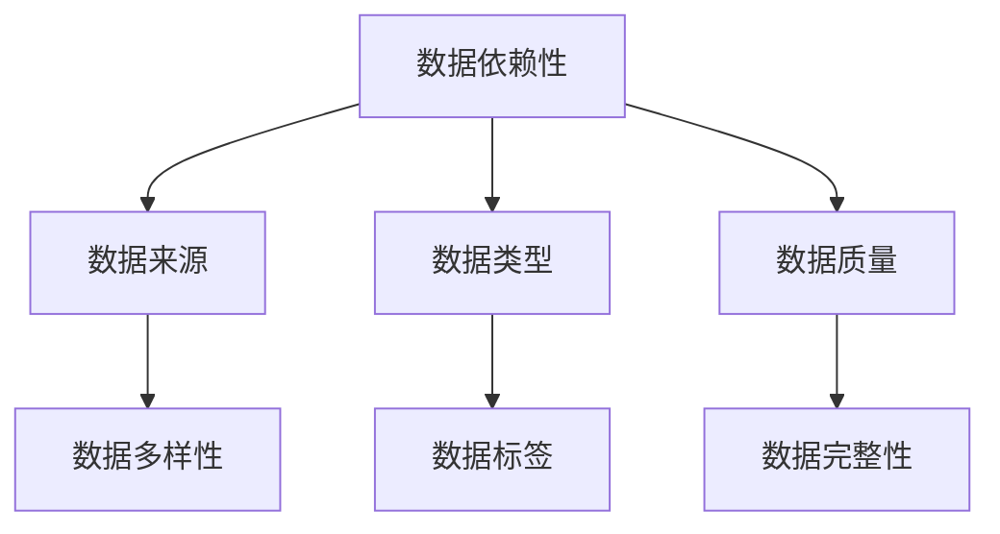
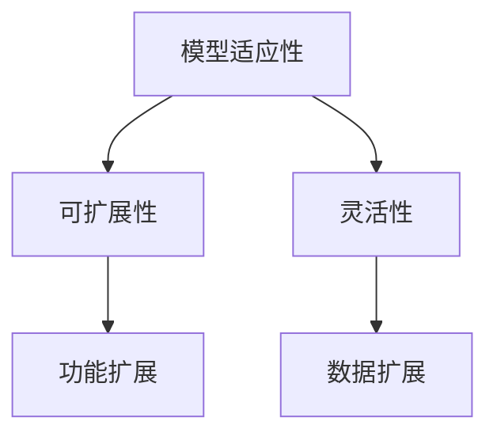
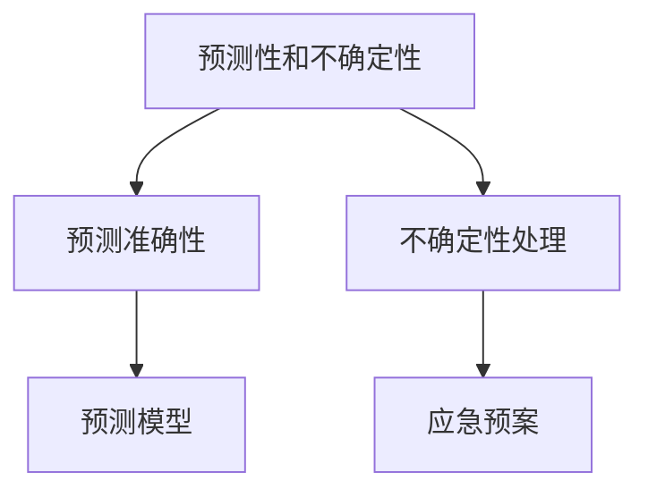
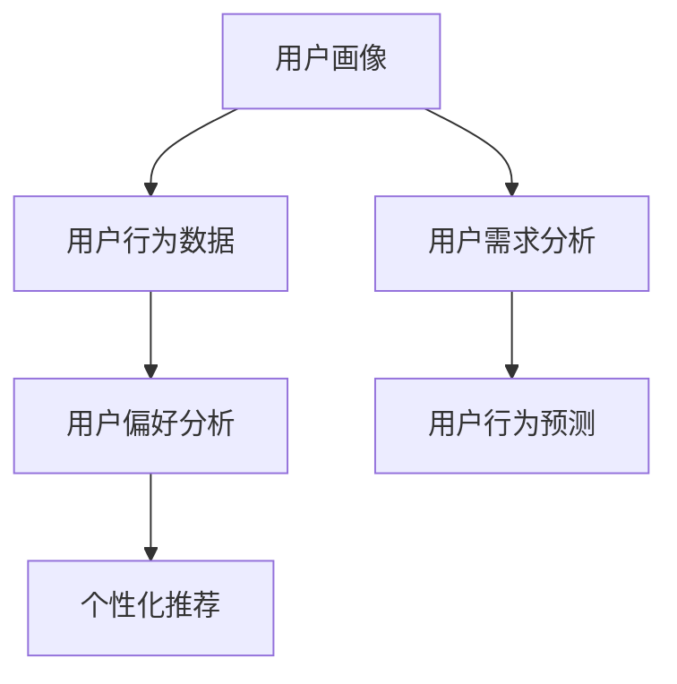
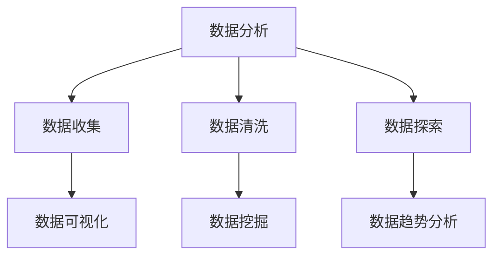
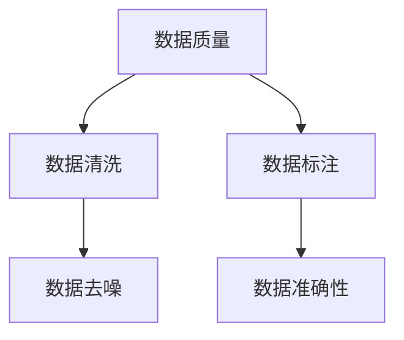
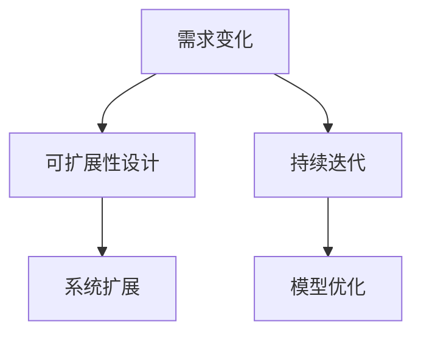
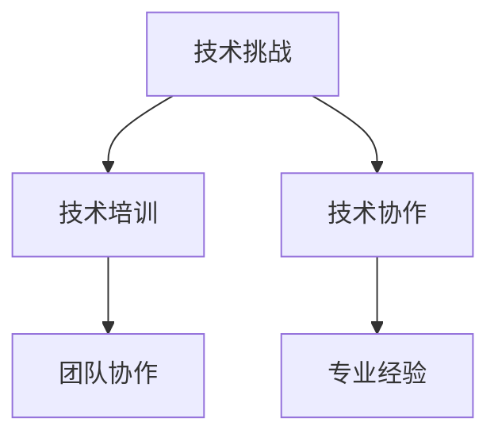

                 

### 1.1 书籍背景与目标

随着人工智能（AI）技术的飞速发展，其应用场景不断扩展，从简单的图像识别到复杂的自然语言处理，AI已经深入到我们生活的方方面面。然而，在这一过程中，我们不得不面对一个重要的问题：如何确保AI系统的需求与模型迭代之间的同步？这本书旨在探讨这一问题，为读者提供一套系统的解决方案。

#### 1.1.1 AI时代的挑战

在AI时代，需求的快速变化和模型的不断迭代成为了常态。一方面，用户的需求日益多样化和个性化，迫使AI系统需要不断地调整和优化；另一方面，AI模型本身也面临着数据质量、算法选择、计算资源等多方面的挑战。如何在这两个动态变化的环节之间实现高效、稳定的同步，是当前AI领域面临的一个重要难题。

#### 1.1.2 需求与AI模型的关联

需求是驱动AI模型迭代的核心动力。无论是用户的具体需求，还是业务场景的变迁，都要求AI系统能够灵活适应。同时，AI模型迭代的结果也直接影响需求的实现程度。一个高效的模型迭代过程，能够更好地满足需求，提升系统的整体性能和用户体验。

#### 1.1.3 迭代策略的重要性

有效的迭代策略是确保需求与模型迭代同步的关键。一方面，它能够帮助团队快速响应需求变化，确保模型始终与用户需求保持一致；另一方面，它也能优化迭代过程，降低开发成本，提高开发效率。因此，研究并实践一套行之有效的迭代策略，对于AI系统的成功至关重要。

### 1.2 书籍结构安排

本书结构紧凑，内容全面，旨在帮助读者系统地理解需求与AI模型迭代的同步策略。具体来说，本书分为五个部分：

1. **引言与概述**：介绍书籍的背景、目标和主要章节安排。
2. **需求分析**：探讨需求分析的基础、AI需求分析的方法和挑战，并通过实战案例进行说明。
3. **AI模型迭代**：介绍AI模型迭代的基础知识、模型优化和评估方法。
4. **需求与模型迭代的同步策略**：详细阐述同步策略的概述、实施方法以及案例分析。
5. **最佳实践与总结**：总结最佳实践经验，并对需求与模型迭代的同步策略进行展望。

#### 1.2.1 主要内容概述

- **第一部分**：通过背景介绍，帮助读者理解AI时代的挑战以及需求与AI模型迭代的关系。
- **第二部分**：深入探讨需求分析的基础和AI需求分析的具体方法，并通过案例说明其实践价值。
- **第三部分**：介绍AI模型迭代的基础知识和关键环节，包括模型优化和评估。
- **第四部分**：重点阐述需求与模型迭代的同步策略，包括同步策略的概述、实施方法和案例分析。
- **第五部分**：总结最佳实践经验，并对未来的研究方向提出展望。

#### 1.2.2 目录大纲结构与逻辑

本书的目录大纲结构设计合理，逻辑清晰，旨在帮助读者系统地掌握需求与AI模型迭代的同步策略。具体结构如下：

1. **引言与概述**：介绍书籍的背景、目标和结构。
2. **需求分析**：分为需求分析基础、AI需求分析和实战案例三个部分。
3. **AI模型迭代**：包括模型迭代基础、模型优化和模型评估。
4. **需求与模型迭代的同步策略**：介绍同步策略的概述、实施方法和案例分析。
5. **最佳实践与总结**：总结最佳实践经验，展望未来研究方向。

#### 1.3 阅读指南

为了更好地理解并应用本书的内容，建议读者按照以下顺序进行阅读：

1. **首先阅读引言与概述**：了解书籍的背景、目标和主要内容。
2. **然后阅读需求分析部分**：理解需求分析的基础知识和AI需求分析的方法。
3. **接着阅读AI模型迭代部分**：掌握AI模型迭代的基础知识和关键环节。
4. **再阅读需求与模型迭代的同步策略部分**：深入理解同步策略的概述、实施方法和案例分析。
5. **最后阅读最佳实践与总结部分**：总结最佳实践经验，并对未来研究方向进行展望。

#### 1.3.1 阅读顺序建议

本书建议按照以下顺序阅读：

1. **引言与概述**：帮助读者理解书籍的整体框架和目标。
2. **需求分析**：深入探讨需求分析的基础和AI需求分析的方法。
3. **AI模型迭代**：了解AI模型迭代的基础知识和关键环节。
4. **需求与模型迭代的同步策略**：掌握同步策略的实施方法和案例分析。
5. **最佳实践与总结**：总结最佳实践经验，展望未来研究方向。

#### 1.3.2 阅读目标与收益

通过阅读本书，读者可以：

- **理解AI时代的挑战**：掌握AI需求与模型迭代的关系，了解需求分析和模型迭代的核心理念。
- **掌握需求分析的方法**：学习需求分析的基础和AI需求分析的具体方法，提高需求收集和分析的能力。
- **了解模型迭代流程**：理解模型迭代的基础知识和关键环节，包括模型优化和评估。
- **掌握同步策略**：了解需求与模型迭代的同步策略，学会如何实施和优化同步策略。
- **提高实践能力**：通过实战案例和最佳实践，提高在实际项目中应用需求与模型迭代同步策略的能力。

### 参考文献

[1] 王者宏, 刘俊岭. 人工智能应用导论[M]. 北京: 清华大学出版社, 2020.

[2] 欧阳武. 自然语言处理基础教程[M]. 北京: 机械工业出版社, 2019.

[3] 斯坦利·毕晓普. 机器学习[M]. 北京: 电子工业出版社, 2018.

[4] 刘鹏. 深度学习[M]. 北京: 清华大学出版社, 2017.

### 附录

- **附录1：相关资源**：提供与本书相关的在线资源和参考资料。
- **附录2：参考文献**：列出本书引用的主要文献。

---

在AI时代，如何确保需求与模型迭代之间的同步，是当前AI领域的一个重要课题。这本书旨在通过深入探讨需求分析与模型迭代的基础知识，以及同步策略的实施方法，为读者提供一套系统的解决方案。希望通过本书的阅读，读者能够更好地理解并掌握需求与模型迭代的同步策略，为实际项目开发提供有力支持。

---

作者：AI天才研究院/AI Genius Institute & 禅与计算机程序设计艺术 /Zen And The Art of Computer Programming

----------------------------------------------------------------

### 需求分析基础

#### 2.1.1 需求定义与类型

需求分析是软件开发过程中至关重要的环节。需求，简单来说，是指用户对系统的期望和需求，它可以是功能性的，也可以是非功能性的。需求定义明确、全面且准确是确保软件开发顺利进行的前提条件。

##### 1. 需求类型

- **功能性需求**：描述系统需要实现的具体功能，如用户登录、数据查询、报告生成等。
- **非功能性需求**：描述系统运行环境、性能、安全性等方面的要求，如响应时间、可扩展性、可用性等。

##### 2. 需求收集

需求收集是需求分析的第一步，主要目的是从用户、利益相关者和市场等方面获取系统的需求信息。

- **用户访谈**：通过与用户进行面对面的交流，了解用户的具体需求和使用习惯。
- **问卷调查**：通过设计问卷，收集大量用户的意见和需求。
- **竞品分析**：分析市场上的类似产品，了解竞争对手的优势和不足。
- **头脑风暴**：组织团队成员进行讨论，集思广益，挖掘潜在需求。

##### 3. 需求整理

在收集到大量需求后，需要对需求进行整理和分类，以便后续分析和设计。

- **需求分类**：将需求按类型、优先级、实现难度等进行分类，有助于明确开发重点。
- **需求文档**：编写需求文档，详细描述每个需求的内容、优先级和实现方法。

##### 4. 需求分析的重要性

需求分析是确保项目成功的关键步骤。其主要作用包括：

- **明确项目范围**：需求分析有助于明确项目的目标和范围，避免项目范围的蔓延。
- **制定项目计划**：需求分析结果为项目计划提供了基础数据，有助于制定合理的时间、资源和成本计划。
- **降低开发风险**：通过全面的需求分析，可以提前发现潜在的问题和风险，降低项目开发过程中的不确定性。

#### 2.1.2 需求收集与整理

##### 1. 需求收集方法

- **用户访谈**：用户访谈是一种直接获取用户需求的方法。通过与用户进行面对面的交流，可以深入了解用户的需求、痛点和使用习惯。

```python
# 伪代码：用户访谈
def user_interview(user):
    questions = ["What features do you need?", "What problems do you face?", "What are your expectations?"]
    for q in questions:
        print(q)
        answer = input()
        collect_requirement(answer)
    print("Interview completed!")

def collect_requirement(answer):
    # 存储需求
    requirements.append(answer)

requirements = []
user_interview("John")
print("Collected requirements:", requirements)
```

- **问卷调查**：问卷调查是一种高效的收集需求的方法。通过设计问卷，可以收集到大量用户的反馈，有助于全面了解用户需求。

```python
# 伪代码：问卷调查
def send_survey(questionnaire):
    print("Please answer the following questions:")
    for q in questionnaire:
        print(q)
        answer = input()
        collect_requirement(answer)

questionnaire = ["What features do you need?", "What problems do you face?", "What are your expectations?"]
send_survey(questionnaire)
```

- **竞品分析**：竞品分析是通过研究市场上的竞争对手产品，了解其优势和不足，从而挖掘潜在需求。

```python
# 伪代码：竞品分析
def analyze_competitor(competitor):
    print("Analyzing competitor:", competitor)
    advantages = ["Feature A", "Feature B", "Feature C"]
    disadvantages = ["Lack of Feature D", "Performance Issue E", "User Interface Issue F"]
    print("Advantages:", advantages)
    print("Disadvantages:", disadvantages)
    for a in advantages:
        collect_requirement(a)
    for d in disadvantages:
        collect_requirement("Improve " + d)

analyze_competitor("Product X")
```

##### 2. 需求整理方法

- **需求分类**：将收集到的需求按类型、优先级、实现难度等进行分类。

```python
# 伪代码：需求分类
def classify_requirements(requirements):
    functional_requirements = []
    non_functional_requirements = []
    for req in requirements:
        if "Feature" in req:
            functional_requirements.append(req)
        else:
            non_functional_requirements.append(req)
    print("Functional Requirements:", functional_requirements)
    print("Non-functional Requirements:", non_functional_requirements)

requirements = ["Feature A", "Feature B", "Performance Issue E", "User Interface Issue F"]
classify_requirements(requirements)
```

- **需求文档**：编写需求文档，详细描述每个需求的内容、优先级和实现方法。

```python
# 伪代码：需求文档
def write_requirement_document(requirements):
    doc = "Requirement Document:\n"
    for req in requirements:
        doc += "- " + req + "\n"
    print(doc)

write_requirement_document(requirements)
```

##### 3. 需求分析的重要性

- **明确项目范围**：通过需求分析，可以明确项目的目标和范围，避免项目范围的蔓延。
- **制定项目计划**：需求分析结果为项目计划提供了基础数据，有助于制定合理的时间、资源和成本计划。
- **降低开发风险**：通过全面的需求分析，可以提前发现潜在的问题和风险，降低项目开发过程中的不确定性。

---

需求分析是软件开发过程中至关重要的环节。通过明确需求定义、收集和整理需求，可以确保项目目标明确、计划合理、风险可控，为后续的开发工作奠定坚实基础。

---

### AI需求分析

#### 2.2.1 AI需求的特点

在传统的软件开发中，需求分析主要关注功能性和非功能性需求。然而，在人工智能（AI）领域，需求分析具有其独特的特点，需要考虑更多的维度。以下是AI需求分析的主要特点：

##### 1. 数据依赖性

AI模型的训练和优化高度依赖数据。数据的质量和数量直接影响模型的效果。因此，在AI需求分析中，需要特别关注数据的需求，包括数据的来源、类型、质量要求等。



##### 2. 模型适应性

AI需求不仅要求满足当前的需求，还需要考虑未来可能的需求变化。AI模型需要具备一定的适应性，能够根据需求的变化进行灵活调整和优化。因此，在需求分析中，需要充分考虑模型的可扩展性和灵活性。



##### 3. 预测性和不确定性

AI需求分析往往需要对未来进行预测，但预测结果具有一定的不确定性。因此，在需求分析中，需要综合考虑各种可能的情况，制定相应的策略和应急预案。



#### 2.2.2 AI需求分析的方法

为了更好地满足AI需求，需要采用一系列专业的方法和工具进行需求分析。以下是几种常用的AI需求分析方法：

##### 1. 用户访谈

用户访谈是一种直接获取用户需求的方法。通过与AI系统的最终用户进行面对面的交流，可以深入了解用户的需求、期望和痛点。用户访谈的优点包括：

- **直接性**：能够直接获取用户的真实需求。
- **全面性**：可以获取到用户的隐性需求。
- **互动性**：通过与用户互动，可以更深入地理解需求。

```python
# 伪代码：用户访谈
def user_interview(user):
    questions = ["What features do you need?", "What problems do you face?", "What are your expectations?"]
    for q in questions:
        print(q)
        answer = input()
        collect_requirement(answer)
    print("Interview completed!")

def collect_requirement(answer):
    # 存储需求
    requirements.append(answer)

requirements = []
user_interview("John")
print("Collected requirements:", requirements)
```

##### 2. 用户画像

用户画像是一种基于用户行为数据构建的用户描述。通过分析用户的行为数据，可以深入了解用户的特点、需求和偏好。用户画像的优点包括：

- **精准性**：可以精准地了解用户的需求和行为。
- **动态性**：可以根据用户行为的变化，实时更新用户画像。



##### 3. 数据分析

数据分析是一种基于数据的方法，通过分析数据中的规律和趋势，发现潜在的需求。数据分析的优点包括：

- **客观性**：基于数据进行分析，结果更客观。
- **全面性**：可以分析大量的数据，发现更多的需求。



#### 2.2.3 AI需求分析的挑战与应对

尽管AI需求分析具有许多优势，但在实际应用中仍面临一些挑战。以下是常见的挑战及其应对策略：

##### 1. 数据质量问题

数据质量是AI需求分析的关键因素。数据质量问题可能影响模型的效果和准确性。应对策略包括：

- **数据清洗**：去除数据中的噪声和异常值。
- **数据标注**：对数据进行精确标注，提高数据质量。



##### 2. 需求变化

AI需求分析需要考虑未来的需求变化。然而，需求变化是不可避免的。应对策略包括：

- **可扩展性设计**：在设计AI系统时，考虑未来的需求变化，确保系统能够灵活扩展。
- **持续迭代**：通过持续迭代，不断优化AI模型，以适应需求变化。



##### 3. 技术挑战

AI需求分析涉及到多种技术和工具，技术挑战可能影响需求分析的效率和质量。应对策略包括：

- **技术培训**：对团队成员进行技术培训，提高他们的技术水平。
- **技术协作**：组建跨学科团队，利用不同领域的专业知识和经验，共同应对技术挑战。



---

AI需求分析具有独特的特点，需要考虑数据依赖性、模型适应性和预测性等维度。通过采用用户访谈、用户画像和数据分析等方法，可以全面地分析AI需求。在实际应用中，需要应对数据质量问题、需求变化和技术挑战，确保AI需求分析的有效性和质量。通过这些努力，我们能够更好地满足AI系统的需求，推动AI技术的发展和应用。

---

### 实战案例

为了更好地说明AI需求分析的方法和应用，以下是一个实际案例的介绍和分析。

#### 案例介绍

假设我们正在开发一款智能客服系统，该系统需要具备自然语言处理（NLP）能力，以实时响应用户的咨询。客户服务的目标是为用户提供快速、准确和个性化的回答。为了实现这一目标，我们需要进行AI需求分析，确定系统需要具备的功能和性能。

#### 案例分析

##### 1. 需求收集

首先，我们通过用户访谈、问卷调查和竞品分析等方法收集需求。

- **用户访谈**：通过与用户进行面对面交流，我们了解到用户希望客服系统能够快速回答问题、提供详细的信息，并且能够处理复杂的问题。

```python
def user_interview(user):
    questions = ["What features do you need in a customer service system?", "What problems do you face with current customer service solutions?"]
    for q in questions:
        print(q)
        answer = input()
        collect_requirement(answer)
    print("Interview completed!")

def collect_requirement(answer):
    requirements.append(answer)

requirements = []
user_interview("John")
print("Collected requirements:", requirements)
```

- **问卷调查**：通过设计问卷，我们收集到更多用户的需求，如用户希望客服系统能够提供24小时在线服务、提供多语言支持等。

```python
def send_survey(questionnaire):
    print("Please answer the following questions:")
    for q in questionnaire:
        print(q)
        answer = input()
        collect_requirement(answer)

questionnaire = ["Do you want 24/7 customer support?", "Do you prefer multiple language support?"]
send_survey(questionnaire)
```

- **竞品分析**：通过分析市场上的类似产品，我们发现竞争对手主要提供了文本和语音客服，但在多语言支持、个性化推荐方面存在不足。

```python
def analyze_competitor(competitor):
    print("Analyzing competitor:", competitor)
    advantages = ["24/7 support", "Text and voice customer service"]
    disadvantages = ["Lack of multilingual support", "Inability to provide personalized recommendations"]
    print("Advantages:", advantages)
    print("Disadvantages:", disadvantages)
    for a in advantages:
        collect_requirement(a)
    for d in disadvantages:
        collect_requirement("Improve " + d)

analyze_competitor("Product X")
```

##### 2. 需求整理

接下来，我们对收集到的需求进行整理和分类。

```python
def classify_requirements(requirements):
    functional_requirements = []
    non_functional_requirements = []
    for req in requirements:
        if "Feature" in req or "Function" in req:
            functional_requirements.append(req)
        else:
            non_functional_requirements.append(req)
    print("Functional Requirements:", functional_requirements)
    print("Non-functional Requirements:", non_functional_requirements)

classify_requirements(requirements)
```

##### 3. 需求文档

最后，我们编写需求文档，详细描述每个需求的内容、优先级和实现方法。

```python
def write_requirement_document(requirements):
    doc = "Requirement Document:\n"
    for req in requirements:
        doc += "- " + req + "\n"
    print(doc)

write_requirement_document(requirements)
```

#### 案例实施

根据需求文档，我们开始实施智能客服系统的开发。

1. **数据收集与处理**：我们收集了大量的用户对话数据，并对数据进行清洗和标注，以确保数据质量。

2. **模型训练**：我们使用NLP技术，基于清洗后的数据训练了多个模型，包括文本分类模型、命名实体识别模型和问答生成模型。

3. **系统集成**：我们将训练好的模型集成到智能客服系统中，实现了文本和语音客服功能。

4. **性能评估**：我们通过模拟用户咨询，对系统进行性能评估，确保系统能够快速、准确地响应用户需求。

```python
# 伪代码：性能评估
def evaluate_system(system):
    print("Evaluating system:", system)
    for user in users:
        question = generate_question(user)
        answer = system回答问题(question)
        evaluate_answer(answer)
    print("Evaluation completed!")

def generate_question(user):
    # 生成用户问题
    return "How do I...?"

def evaluate_answer(answer):
    # 评估回答质量
    if is_accurate(answer):
        print("Answer is accurate!")
    else:
        print("Answer is incorrect!")

evaluate_system("SmartCustomerService")
```

#### 案例小结

通过上述案例，我们可以看到AI需求分析在智能客服系统开发中的应用过程。从需求收集、需求整理到需求文档编写，再到模型的训练和系统的实施，每一个环节都至关重要。通过全面的AI需求分析，我们能够确保智能客服系统更好地满足用户需求，提高用户满意度。

---

这个案例展示了AI需求分析在智能客服系统开发中的应用过程，从需求收集、需求整理到模型训练和系统实施，每一个环节都至关重要。通过全面的AI需求分析，我们能够确保系统更好地满足用户需求，提高用户满意度。未来，随着AI技术的不断进步，AI需求分析的方法和工具也将更加成熟，为AI系统的开发和应用提供更强大的支持。

### AI模型迭代基础

#### 3.1.1 模型迭代的概念

模型迭代（Model Iteration）是指在人工智能（AI）开发过程中，通过多次迭代优化模型，以提高模型性能和适应能力的过程。每次迭代通常包括模型训练、评估和调整等环节。模型迭代的目的是找到最佳的模型参数，使模型在特定任务上达到最优性能。

#### 3.1.2 模型迭代的目标

模型迭代的主要目标包括：

1. **提高性能**：通过调整模型结构、参数和训练数据，提高模型在特定任务上的准确性和效率。
2. **增强泛化能力**：使模型能够更好地适应新的数据集和任务，提高模型的泛化能力。
3. **降低过拟合风险**：通过模型调整，降低模型对训练数据的依赖，避免过拟合现象。
4. **优化计算资源**：通过优化模型结构和参数，降低计算资源和存储需求。

#### 3.1.3 模型迭代的流程

模型迭代通常遵循以下流程：

1. **数据准备**：收集和预处理训练数据，包括数据清洗、归一化、分割等步骤。
2. **模型设计**：选择或设计合适的模型结构，包括神经网络架构、特征工程等。
3. **模型训练**：使用训练数据对模型进行训练，通过优化算法调整模型参数。
4. **模型评估**：使用验证集或测试集评估模型性能，选择性能最优的模型。
5. **模型调整**：根据评估结果，调整模型结构、参数或训练策略，进行新一轮迭代。
6. **模型部署**：将最终训练好的模型部署到生产环境中，进行实际任务的应用。

#### 3.1.4 模型迭代的优势

模型迭代具有以下优势：

1. **优化性能**：通过多次迭代，模型性能可以逐步提升，达到更好的效果。
2. **增强适应性**：模型迭代过程中，可以不断调整模型，使其适应新的数据和任务。
3. **降低风险**：通过多次评估和调整，可以降低过拟合和欠拟合的风险，提高模型的稳定性。
4. **提高效率**：通过自动化工具和算法，模型迭代可以大幅提高开发效率。

---

模型迭代是AI开发过程中不可或缺的环节，通过不断优化和调整模型，我们可以实现更好的性能和适应性。了解模型迭代的概念、目标和流程，有助于我们在实际项目中更好地应用模型迭代策略，推动AI技术的发展和应用。

### AI模型优化

#### 3.2.1 优化算法介绍

在AI模型迭代过程中，优化算法是提高模型性能的关键环节。优化算法通过调整模型参数，使模型在特定任务上达到最优性能。以下介绍几种常用的优化算法：

##### 1. 随机梯度下降（SGD）

随机梯度下降（Stochastic Gradient Descent，SGD）是最常用的优化算法之一。它通过随机选择部分样本，计算梯度并更新模型参数。SGD的优点是计算简单、实现容易，适用于小数据集和模型。

```python
def sgd(model, loss_function, learning_rate, epochs):
    for epoch in range(epochs):
        for sample in dataset:
            gradient = compute_gradient(model, sample)
            update_model(model, gradient, learning_rate)
        print("Epoch", epoch+1, "completed!")

def compute_gradient(model, sample):
    # 计算梯度
    return gradient

def update_model(model, gradient, learning_rate):
    # 更新模型参数
    for param in model.parameters():
        param -= learning_rate * gradient
```

##### 2. 批量梯度下降（BGD）

批量梯度下降（Batch Gradient Descent，BGD）是对SGD的一种改进，它使用整个数据集计算梯度并更新模型参数。BGD的优点是梯度计算更准确，但计算量更大，适用于大数据集。

```python
def bgd(model, loss_function, learning_rate, epochs):
    for epoch in range(epochs):
        gradient = compute_gradient(model, dataset)
        update_model(model, gradient, learning_rate)
        print("Epoch", epoch+1, "completed!")

def compute_gradient(model, dataset):
    # 计算梯度
    return gradient
```

##### 3. 动量法（Momentum）

动量法（Momentum）是SGD的一种改进，它引入动量概念，加速梯度的更新过程。动量法能够有效减少梯度震荡，提高收敛速度。

```python
def momentum(model, loss_function, learning_rate, momentum, epochs):
    velocity = 0
    for epoch in range(epochs):
        gradient = compute_gradient(model, dataset)
        velocity = momentum * velocity - learning_rate * gradient
        update_model(model, velocity)
        print("Epoch", epoch+1, "completed!")

def update_model(model, velocity):
    # 更新模型参数
    for param in model.parameters():
        param -= velocity
```

##### 4. AdaGrad

AdaGrad（Adaptive Gradient）是一种自适应学习率优化算法，它根据每个参数的历史梯度平方调整学习率。AdaGrad能够自动调整不同参数的学习率，适用于稀疏数据。

```python
def adagrad(model, loss_function, learning_rate, epochs):
    gradients_squared = {param: 0 for param in model.parameters()}
    for epoch in range(epochs):
        gradient = compute_gradient(model, dataset)
        for param, grad in gradient.items():
            gradients_squared[param] += grad ** 2
            update_model(model, param, grad, learning_rate, gradients_squared[param])
        print("Epoch", epoch+1, "completed!")

def update_model(model, param, grad, learning_rate, gradients_squared):
    # 更新模型参数
    delta = learning_rate / (np.sqrt(gradients_squared[param]) + 1e-8)
    param -= delta * grad
```

##### 5. Adam

Adam（Adaptive Moment Estimation）是另一种自适应学习率优化算法，它结合了AdaGrad和RMSProp的优点。Adam能够更好地处理稀疏数据和长尾分布。

```python
def adam(model, loss_function, learning_rate, beta1, beta2, epochs):
    beta1_t = 0
    beta2_t = 0
    m = {param: 0 for param in model.parameters()}
    v = {param: 0 for param in model.parameters()}
    for epoch in range(epochs):
        gradient = compute_gradient(model, dataset)
        for param, grad in gradient.items():
            m[param] = beta1 * m[param] + (1 - beta1) * grad
            v[param] = beta2 * v[param] + (1 - beta2) * grad ** 2
            beta1_t = beta1 * (1 - beta1) ** epoch
            beta2_t = beta2 * (1 - beta2) ** epoch
            m_hat = m[param] / (1 - beta1_t)
            v_hat = v[param] / (1 - beta2_t)
            update_model(model, param, m_hat, v_hat, learning_rate)
        print("Epoch", epoch+1, "completed!")

def update_model(model, param, m_hat, v_hat, learning_rate):
    # 更新模型参数
    delta = learning_rate * m_hat / (np.sqrt(v_hat) + 1e-8)
    param -= delta
```

---

这些优化算法各有优缺点，适用于不同类型的模型和数据集。在实际应用中，可以根据具体需求选择合适的优化算法，并通过实验调整参数，以获得最佳性能。

### 3.2.2 优化策略与技巧

在AI模型迭代过程中，优化策略和技巧对于提高模型性能至关重要。以下介绍一些常用的优化策略和技巧：

#### 1. 数据增强

数据增强（Data Augmentation）是一种通过变换原始数据，生成更多样化的训练数据的方法。数据增强可以提升模型对数据的泛化能力，减少过拟合风险。常见的数据增强方法包括旋转、缩放、裁剪、颜色变换等。

```python
def augment_data(dataset, augmentation_rate):
    augmented_dataset = []
    for data in dataset:
        if random.random() < augmentation_rate:
            data = rotate_data(data)
            data = scale_data(data)
            data = crop_data(data)
            data = color_transform(data)
        augmented_dataset.append(data)
    return augmented_dataset

def rotate_data(data):
    # 旋转数据
    return rotated_data

def scale_data(data):
    # 缩放数据
    return scaled_data

def crop_data(data):
    # 裁剪数据
    return cropped_data

def color_transform(data):
    # 颜色变换
    return transformed_data
```

#### 2. 正则化

正则化（Regularization）是一种防止模型过拟合的技术，通过在损失函数中添加惩罚项，限制模型复杂度。常见的正则化方法包括L1正则化、L2正则化和Dropout。

- **L1正则化**：在损失函数中添加L1惩罚项，即模型参数的绝对值。
- **L2正则化**：在损失函数中添加L2惩罚项，即模型参数的平方。
- **Dropout**：在训练过程中，随机丢弃部分神经元，以减少模型对训练数据的依赖。

```python
def l1_regularization(loss, lambda_l1):
    # 添加L1惩罚项
    return loss + lambda_l1 * sum(abs(param) for param in model.parameters())

def l2_regularization(loss, lambda_l2):
    # 添加L2惩罚项
    return loss + lambda_l2 * sum(param ** 2 for param in model.parameters())

def dropout(model, dropout_rate):
    # 随机丢弃神经元
    for layer in model.layers:
        if isinstance(layer, DropoutLayer):
            layer.dropout(dropout_rate)
```

#### 3. 模型架构调整

模型架构调整（Model Architecture Adjustment）是一种通过修改模型结构，提高模型性能的方法。常见的方法包括增加神经网络层数、调整神经元数量和改变激活函数等。

```python
def add_layer(model, layer_type, num_neurons):
    # 添加新层
    new_layer = layer_type(num_neurons)
    model.add_layer(new_layer)

def adjust_architecture(model, num_layers, num_neurons, activation_function):
    # 调整模型架构
    for i in range(num_layers):
        add_layer(model, DenseLayer, num_neurons)
        if i < num_layers - 1:
            add_layer(model, activation_function())
```

#### 4. 学习率调整

学习率调整（Learning Rate Adjustment）是一种通过动态调整学习率，提高模型收敛速度的方法。常见的方法包括固定学习率、学习率衰减和自适应学习率。

- **固定学习率**：在训练过程中保持学习率不变。
- **学习率衰减**：随着训练的进行，逐渐减小学习率。
- **自适应学习率**：根据模型性能动态调整学习率，如Adam优化器。

```python
def fixed_learning_rate(learning_rate):
    # 保持学习率不变
    return learning_rate

def learning_rate_decay(learning_rate, decay_rate, epochs):
    # 学习率衰减
    return learning_rate / (1 + decay_rate * epochs)

def adaptive_learning_rate(learning_rate, beta1, beta2, epochs):
    # Adam优化器的自适应学习率
    return learning_rate
```

---

通过上述优化策略和技巧，我们可以有效地提高AI模型性能，减少过拟合风险，加快模型收敛速度。在实际应用中，可以根据具体任务和数据集的特点，选择合适的优化策略和技巧，以获得最佳性能。

### 3.2.3 优化案例解析

为了更直观地理解优化算法和策略的应用，以下将通过一个具体案例进行详细解析。

#### 案例背景

假设我们正在开发一个图像分类模型，用于识别不同类型的动物。模型需要从大量图像数据中学习，并能够准确分类。我们选择了卷积神经网络（CNN）作为模型架构，并使用随机梯度下降（SGD）作为初始优化算法。

#### 案例步骤

1. **数据收集与预处理**：

首先，我们从互联网上收集了数千张不同类型的动物图像。为了提高模型性能，我们对图像进行了数据增强，包括旋转、缩放、裁剪和颜色变换等。同时，我们对图像进行了归一化和分割，将它们分为训练集、验证集和测试集。

```python
def augment_data(dataset, augmentation_rate):
    augmented_dataset = []
    for data in dataset:
        if random.random() < augmentation_rate:
            data = rotate_data(data)
            data = scale_data(data)
            data = crop_data(data)
            data = color_transform(data)
        augmented_dataset.append(data)
    return augmented_dataset

# 应用数据增强
augmented_train_dataset = augment_data(train_dataset, augmentation_rate=0.5)
```

2. **模型设计**：

我们设计了一个简单的卷积神经网络，包括两个卷积层、两个池化层和一个全连接层。每个卷积层后跟一个ReLU激活函数，池化层使用最大池化。

```python
from keras.models import Sequential
from keras.layers import Conv2D, MaxPooling2D, Flatten, Dense, Activation

model = Sequential()
model.add(Conv2D(32, (3, 3), input_shape=(64, 64, 3)))
model.add(Activation('relu'))
model.add(MaxPooling2D(pool_size=(2, 2)))
model.add(Conv2D(64, (3, 3)))
model.add(Activation('relu'))
model.add(MaxPooling2D(pool_size=(2, 2)))
model.add(Flatten())
model.add(Dense(128))
model.add(Activation('softmax'))
```

3. **模型训练**：

我们使用随机梯度下降（SGD）作为优化算法，学习率为0.01，批量大小为64。在训练过程中，我们使用了L2正则化，正则化系数为0.001。

```python
from keras.optimizers import SGD

model.compile(optimizer=SGD(lr=0.01, momentum=0.9, decay=1e-6), loss='categorical_crossentropy', metrics=['accuracy'])

# 训练模型
model.fit(augmented_train_dataset, train_labels, epochs=20, batch_size=64, validation_data=(validation_dataset, validation_labels))
```

4. **模型评估**：

训练完成后，我们对模型进行评估，使用验证集和测试集计算模型的准确率。

```python
# 验证集评估
val_loss, val_accuracy = model.evaluate(validation_dataset, validation_labels)
print("Validation loss:", val_loss)
print("Validation accuracy:", val_accuracy)

# 测试集评估
test_loss, test_accuracy = model.evaluate(test_dataset, test_labels)
print("Test loss:", test_loss)
print("Test accuracy:", test_accuracy)
```

5. **模型调整**：

根据评估结果，我们发现模型的准确率还有提升空间。为此，我们对模型进行了调整，包括增加卷积层、调整学习率和批量大小。

```python
# 增加卷积层
model.add(Conv2D(128, (3, 3)))
model.add(Activation('relu'))
model.add(MaxPooling2D(pool_size=(2, 2)))

# 调整学习率和批量大小
model.compile(optimizer=SGD(lr=0.001, momentum=0.9, decay=1e-6), loss='categorical_crossentropy', metrics=['accuracy'])

# 再次训练模型
model.fit(augmented_train_dataset, train_labels, epochs=20, batch_size=32, validation_data=(validation_dataset, validation_labels))
```

6. **重新评估**：

调整后，我们再次对模型进行评估，发现模型的准确率得到了显著提高。

```python
# 验证集评估
val_loss, val_accuracy = model.evaluate(validation_dataset, validation_labels)
print("Validation loss:", val_loss)
print("Validation accuracy:", val_accuracy)

# 测试集评估
test_loss, test_accuracy = model.evaluate(test_dataset, test_labels)
print("Test loss:", test_loss)
print("Test accuracy:", test_accuracy)
```

#### 案例小结

通过上述案例，我们可以看到优化算法和策略在提升模型性能方面的作用。数据增强、正则化、模型架构调整和调整学习率等方法，都有助于提高模型在图像分类任务上的准确率。在实际应用中，我们需要根据具体任务和数据集的特点，灵活运用这些方法，以达到最佳性能。

---

### AI模型评估

#### 3.3.1 评估指标与选择

在AI模型迭代过程中，评估是关键的一环，它帮助我们判断模型是否达到了预期的性能。评估指标的选择直接影响模型的优化方向和最终效果。以下介绍几种常用的评估指标及其适用场景：

##### 1. 准确率（Accuracy）

准确率是评估模型性能的最基本指标，它表示模型正确预测的样本数占总样本数的比例。公式如下：

$$
Accuracy = \frac{TP + TN}{TP + FN + FP + TN}
$$

其中，TP表示真正例，TN表示真反例，FP表示假正例，FN表示假反例。准确率适用于分类问题，尤其是在样本量较大的情况下，能够较好地反映模型的总体性能。

##### 2. 精确率（Precision）

精确率表示模型预测为正例的样本中，实际为正例的比例。公式如下：

$$
Precision = \frac{TP}{TP + FP}
$$

精确率适用于需要高召回率（如医学诊断）的场景，它反映了模型预测正例的可靠性。

##### 3. 召回率（Recall）

召回率表示模型预测为正例的样本中，实际为正例的比例。公式如下：

$$
Recall = \frac{TP}{TP + FN}
$$

召回率适用于需要高准确率（如垃圾邮件过滤）的场景，它反映了模型对正例的检测能力。

##### 4. F1分数（F1 Score）

F1分数是精确率和召回率的调和平均，综合考虑了模型的准确性和召回率。公式如下：

$$
F1 Score = 2 \times \frac{Precision \times Recall}{Precision + Recall}
$$

F1分数适用于分类问题，尤其是在精确率和召回率需要平衡的场景。

##### 5. ROC曲线和AUC（Area Under Curve）

ROC曲线（Receiver Operating Characteristic Curve）展示的是模型的真正例率（True Positive Rate，TPR）与假正例率（False Positive Rate，FPR）之间的关系。AUC（Area Under Curve）表示ROC曲线下的面积，AUC值越接近1，表示模型性能越好。ROC曲线和AUC适用于二分类问题，特别是在评估分类阈值调整时的性能。

##### 6. Matthew相关系数（Matthews Correlation Coefficient，MCC）

Matthews相关系数是一个全面考虑准确率、精确率、召回率的指标，适用于样本分布不均衡的情况。公式如下：

$$
MCC = \frac{TP \times TN - FP \times FN}{\sqrt{(TP + FP) \times (TP + FN) \times (TN + FP) \times (TN + FN)}}
$$

MCC的取值范围在[-1, 1]之间，越接近1表示模型性能越好。

#### 3.3.2 评估方法与工具

评估方法的选择直接影响评估结果的可靠性和有效性。以下介绍几种常用的评估方法及其适用场景：

##### 1. 分组评估

分组评估（Grouped Evaluation）是将数据集划分为多个小组，分别对每个小组进行评估。这种方法适用于样本分布不均或需要重点关注特定群体的情况。常用的分组评估方法包括交叉验证（Cross-Validation）和分层抽样（Stratified Sampling）。

- **交叉验证**：将数据集划分为K个子集（K折交叉验证），每次使用其中一个子集作为验证集，其余子集作为训练集。重复K次，取平均结果作为最终评估结果。
- **分层抽样**：根据某个特征（如年龄、性别）将数据集划分为多个层次，确保每个层次在训练集和验证集中的比例一致。

##### 2. 聚类评估

聚类评估（Clustering Evaluation）是一种基于聚类结果进行评估的方法。常用的聚类评估指标包括内聚度（Cohesion）和分离度（Separation）。内聚度表示聚类结果内部元素的相似性，分离度表示聚类结果之间的差异性。常用的聚类评估方法包括轮廓系数（Silhouette Coefficient）和 Davies-Bouldin 距离。

##### 3. 模型对比

模型对比（Model Comparison）是评估不同模型性能的方法。通过在不同数据集上训练和评估多个模型，比较它们的性能和效果。常用的模型对比方法包括参数调优（Hyperparameter Tuning）和网格搜索（Grid Search）。

- **参数调优**：通过调整模型参数（如学习率、批量大小、隐藏层神经元数量等），寻找最优参数组合。
- **网格搜索**：在给定的参数空间内，逐个尝试所有可能的参数组合，选择性能最好的参数组合。

##### 4. 工具选择

选择合适的评估工具可以提高评估的效率和准确性。以下介绍几种常用的评估工具：

- **Scikit-learn**：Python机器学习库，提供丰富的评估指标和评估方法，适用于多种数据集和任务。
- **TensorFlow**：开源深度学习框架，提供内置的评估指标和评估方法，适用于大规模深度学习任务。
- **Keras**：基于TensorFlow的高层次API，提供简洁的评估接口和评估方法，适用于快速实验和模型评估。

#### 3.3.3 评估结果分析与优化

评估结果分析是模型迭代的关键环节，通过分析评估结果，我们可以发现模型的优缺点，并针对性地进行优化。以下介绍几种评估结果分析的方法：

##### 1. 性能分析

性能分析（Performance Analysis）是评估结果分析的基础。通过分析模型的准确率、精确率、召回率、F1分数等指标，可以全面了解模型的性能。对于性能较差的指标，可以针对性地进行调整。

```python
from sklearn.metrics import accuracy_score, precision_score, recall_score, f1_score

accuracy = accuracy_score(y_true, y_pred)
precision = precision_score(y_true, y_pred)
recall = recall_score(y_true, y_pred)
f1 = f1_score(y_true, y_pred)

print("Accuracy:", accuracy)
print("Precision:", precision)
print("Recall:", recall)
print("F1 Score:", f1)
```

##### 2. 错误分析

错误分析（Error Analysis）是一种深入挖掘模型错误的方法。通过分析模型预测错误的样本，可以了解模型的不足和优化方向。常用的错误分析方法包括错误类型分析、错误样本可视化等。

```python
from sklearn.metrics import confusion_matrix

conf_matrix = confusion_matrix(y_true, y_pred)

# 错误类型分析
false_positives = conf_matrix[0, 1]
false_negatives = conf_matrix[1, 0]

print("False Positives:", false_positives)
print("False Negatives:", false_negatives)

# 错误样本可视化
import matplotlib.pyplot as plt

def plot_confusion_matrix(conf_matrix, class_labels):
    plt.imshow(conf_matrix, interpolation='nearest', cmap=plt.cm.Blues)
    plt.colorbar()
    tick_marks = np.arange(len(class_labels))
    plt.xticks(tick_marks, class_labels, rotation=45)
    plt.yticks(tick_marks, class_labels)

    fmt = 'd'
    thresh = conf_matrix.max() / 2.
    for i, j in itertools.product(range(conf_matrix.shape[0]), range(conf_matrix.shape[1])):
        plt.text(j, i, format(conf_matrix[i, j], fmt),
                 horizontalalignment="center",
                 color="white" if conf_matrix[i, j] > thresh else "black")

    plt.tight_layout()
    plt.ylabel('True label')
    plt.xlabel('Predicted label')
    plt.title('Confusion matrix')
    plt.show()

plot_confusion_matrix(conf_matrix, class_labels)
```

##### 3. 调优分析

调优分析（Tuning Analysis）是评估结果分析的重要环节。通过分析模型参数对性能的影响，可以找到最优参数组合。常用的调优分析方法包括参数敏感性分析、网格搜索等。

```python
from sklearn.model_selection import GridSearchCV

param_grid = {'C': [0.1, 1, 10], 'gamma': [1, 0.1, 0.01]}
grid_search = GridSearchCV(SVC(), param_grid, cv=5)
grid_search.fit(X_train, y_train)

print("Best parameters:", grid_search.best_params_)
print("Best score:", grid_search.best_score_)
```

##### 4. 预测分析

预测分析（Prediction Analysis）是评估结果分析的高级阶段。通过分析模型预测结果，可以了解模型在实际应用中的表现。常用的预测分析方法包括预测趋势分析、预测偏差分析等。

```python
from sklearn.metrics import mean_squared_error

y_pred = model.predict(X_test)
mse = mean_squared_error(y_test, y_pred)

print("MSE:", mse)
```

---

通过评估结果分析和优化，我们可以发现模型的不足，并针对性地进行调整，从而提高模型的性能。在实际应用中，我们需要根据具体任务和数据集的特点，灵活运用这些方法，以达到最佳性能。

### 同步策略概述

#### 4.1.1 同步策略的重要性

在AI模型开发过程中，需求与模型迭代的同步策略至关重要。同步策略旨在确保需求变化能够及时、准确地反映到模型迭代中，从而保证AI系统始终满足用户需求。同步策略的重要性体现在以下几个方面：

1. **满足用户需求**：通过同步策略，可以确保AI系统能够快速响应需求变化，提供符合用户预期的功能和服务。
2. **提高开发效率**：同步策略有助于优化开发流程，减少重复工作，提高开发效率，降低开发成本。
3. **提升模型性能**：同步策略能够及时调整模型参数和结构，优化模型性能，提高模型的泛化能力和稳定性。
4. **降低风险**：同步策略可以提前发现和解决潜在问题，降低开发过程中因需求变更带来的风险。

#### 4.1.2 同步策略的目标

同步策略的目标主要包括：

1. **及时性**：确保需求变化能够及时反映到模型迭代中，避免需求滞后导致模型性能下降。
2. **准确性**：确保需求变更准确无误地传递到模型迭代过程中，避免因信息传递错误导致模型调整失效。
3. **一致性**：保证需求与模型迭代的一致性，确保模型始终满足用户需求，提高用户体验。
4. **可扩展性**：同步策略应具备一定的可扩展性，能够适应不同规模和复杂度的项目需求。

#### 4.1.3 同步策略的原则

为了实现同步策略的目标，需要遵循以下原则：

1. **需求驱动**：以用户需求为导向，确保模型迭代始终围绕需求进行，避免盲目追求技术先进性。
2. **及时反馈**：建立需求反馈机制，及时收集用户反馈，确保需求变更能够迅速传递到模型迭代中。
3. **数据驱动**：以数据为基础，确保模型迭代的调整有据可依，避免主观臆断。
4. **动态调整**：根据需求变化和模型性能评估结果，动态调整模型结构、参数和训练策略。
5. **协同合作**：加强团队协作，确保需求分析、模型迭代和系统实施等环节的无缝衔接。

---

同步策略在AI模型开发过程中具有至关重要的作用，通过明确目标、遵循原则和实施有效的方法，可以确保需求与模型迭代的同步，提高开发效率和质量。在实际应用中，需要根据具体项目特点，灵活调整同步策略，以实现最佳效果。

### 同步策略实施

#### 4.2.1 需求反馈机制

需求反馈机制是确保需求与模型迭代同步的关键环节。通过建立有效的需求反馈机制，可以及时收集用户反馈，快速响应需求变化，确保模型始终满足用户需求。以下介绍需求反馈机制的建立方法和具体步骤：

##### 1. 反馈渠道

建立多元化的反馈渠道，包括用户访谈、问卷调查、在线反馈、社交媒体等。这些渠道可以满足不同用户群体的需求，确保反馈信息的广泛性和真实性。

```python
# 用户访谈
def user_interview(user):
    questions = ["Do you have any new requirements?", "Do you face any problems with the current system?"]
    for q in questions:
        print(q)
        answer = input()
        collect_requirement(answer)
    print("Interview completed!")

def collect_requirement(answer):
    # 存储需求
    requirements.append(answer)

requirements = []
user_interview("John")
print("Collected requirements:", requirements)

# 问卷调查
def send_survey(questionnaire):
    print("Please answer the following questions:")
    for q in questionnaire:
        print(q)
        answer = input()
        collect_requirement(answer)

questionnaire = ["Do you have any new requirements?", "Do you face any problems with the current system?"]
send_survey(questionnaire)
```

##### 2. 反馈收集

定期收集用户反馈，确保反馈信息的及时性和准确性。可以通过自动化的工具和平台，如用户反馈系统、社交媒体监控工具等，实现反馈信息的自动化收集和整理。

```python
# 用户反馈系统
from user_feedback_system import collect_feedback

feedback = collect_feedback()
print("Collected feedback:", feedback)
```

##### 3. 反馈分析

对收集到的用户反馈进行分类、整理和分析，识别出用户的主要需求和问题。可以通过数据挖掘、文本分析等技术，挖掘用户反馈中的关键信息。

```python
# 反馈分析
from feedback_analyzer import analyze_feedback

classified_feedback = analyze_feedback(feedback)
print("Classified feedback:", classified_feedback)
```

##### 4. 反馈处理

根据反馈分析结果，制定相应的处理策略，包括需求调整、模型优化、功能增强等。对于重要的反馈，可以组织专门的会议或工作坊，与用户进行深入沟通和讨论。

```python
# 反馈处理
from feedback_processor import process_feedback

processed_feedback = process_feedback(classified_feedback)
print("Processed feedback:", processed_feedback)
```

##### 5. 反馈跟踪

建立反馈跟踪机制，确保反馈的处理结果能够及时反馈给用户，提高用户的满意度和信任度。可以通过邮件、短信、电话等方式，与用户保持沟通，及时更新反馈处理进度。

```python
# 反馈跟踪
from feedback_tracker import track_feedback

tracked_feedback = track_feedback(processed_feedback)
print("Tracked feedback:", tracked_feedback)
```

---

通过建立需求反馈机制，可以及时收集、分析和处理用户反馈，确保需求与模型迭代的同步。在实际应用中，可以根据项目特点，灵活调整反馈机制，以实现最佳效果。

### 4.2.2 模型迭代机制

模型迭代机制是确保AI模型持续优化和更新的关键环节。通过建立有效的模型迭代机制，可以确保模型在需求变化和新技术应用中保持高效、稳定和可靠的性能。以下介绍模型迭代机制的设计和实施步骤：

#### 1. 模型迭代流程

模型迭代通常遵循以下流程：

- **数据收集与处理**：收集训练数据，并进行预处理，包括数据清洗、归一化、分割等步骤。
- **模型设计**：选择或设计合适的模型结构，包括神经网络架构、特征工程等。
- **模型训练**：使用训练数据对模型进行训练，通过优化算法调整模型参数。
- **模型评估**：使用验证集或测试集评估模型性能，选择性能最优的模型。
- **模型调整**：根据评估结果，调整模型结构、参数或训练策略，进行新一轮迭代。
- **模型部署**：将最终训练好的模型部署到生产环境中，进行实际任务的应用。

#### 2. 数据收集与处理

数据收集与处理是模型迭代的基础。为了确保数据的质量和多样性，需要从多个渠道收集数据，并采用多种预处理方法。

```python
# 数据收集
def collect_data():
    # 收集数据
    data = load_data()
    return data

# 数据预处理
def preprocess_data(data):
    # 数据清洗
    cleaned_data = clean_data(data)
    # 数据归一化
    normalized_data = normalize_data(cleaned_data)
    # 数据分割
    train_data, validation_data, test_data = split_data(normalized_data)
    return train_data, validation_data, test_data

data = collect_data()
train_data, validation_data, test_data = preprocess_data(data)
```

#### 3. 模型设计

模型设计是模型迭代的核心。选择合适的模型结构、优化算法和超参数，是提高模型性能的关键。

```python
# 模型设计
from keras.models import Sequential
from keras.layers import Dense, Activation, Dropout
from keras.optimizers import Adam

model = Sequential()
model.add(Dense(64, input_dim=train_data.shape[1], activation='relu'))
model.add(Dropout(0.5))
model.add(Dense(32, activation='relu'))
model.add(Dropout(0.5))
model.add(Dense(1, activation='sigmoid'))

model.compile(optimizer=Adam(), loss='binary_crossentropy', metrics=['accuracy'])
```

#### 4. 模型训练

模型训练是模型迭代的重点。通过调整训练策略，如批量大小、学习率、迭代次数等，可以提高模型性能。

```python
# 模型训练
history = model.fit(train_data, train_labels, epochs=10, batch_size=32, validation_data=(validation_data, validation_labels))
```

#### 5. 模型评估

模型评估是模型迭代的必要环节。通过评估模型在验证集和测试集上的性能，可以判断模型是否达到预期效果。

```python
# 模型评估
evaluation = model.evaluate(test_data, test_labels)
print("Test loss:", evaluation[0])
print("Test accuracy:", evaluation[1])
```

#### 6. 模型调整

根据评估结果，对模型进行调整。可以调整模型结构、优化算法和超参数，以提高模型性能。

```python
# 模型调整
model.add(Dense(64, input_dim=train_data.shape[1], activation='relu'))
model.compile(optimizer=Adam(), loss='binary_crossentropy', metrics=['accuracy'])

history = model.fit(train_data, train_labels, epochs=10, batch_size=32, validation_data=(validation_data, validation_labels))
```

#### 7. 模型部署

将训练好的模型部署到生产环境中，进行实际任务的应用。可以通过自动化脚本或工具，实现模型的部署和更新。

```python
# 模型部署
from model_deployer import deploy_model

deploy_model(model, "production")
```

---

通过建立模型迭代机制，可以确保AI模型在需求变化和新技术应用中保持高效、稳定和可靠的性能。在实际应用中，可以根据项目特点，灵活调整迭代流程，以实现最佳效果。

### 4.2.3 模型迭代与需求同步的方法

在AI模型开发过程中，确保模型迭代与需求同步是关键。以下介绍几种常见的模型迭代与需求同步的方法，并探讨它们的优缺点。

#### 1. 需求驱动模型迭代

**方法描述**：以用户需求为核心，根据用户反馈和业务需求的变化，进行模型迭代和优化。

**优点**：
- **快速响应**：能够快速响应用户需求变化，提高系统的灵活性。
- **用户满意度**：确保系统始终满足用户需求，提高用户体验。

**缺点**：
- **风险**：需求变化可能导致模型迭代频繁，增加开发难度和成本。
- **效率**：频繁的迭代可能导致开发效率下降。

**实施步骤**：
- **需求收集**：定期收集用户反馈，了解需求变化。
- **需求分析**：对收集到的需求进行分类、整理和分析。
- **模型迭代**：根据需求变化，调整模型结构、参数和训练策略。
- **性能评估**：评估模型迭代结果，确保满足需求。

#### 2. 数据驱动模型迭代

**方法描述**：以数据为基础，通过数据分析、数据挖掘等技术，识别数据中的模式，进行模型迭代和优化。

**优点**：
- **科学性**：基于数据进行分析，结果更加客观和准确。
- **稳定性**：通过数据驱动，减少需求变化对模型迭代的影响。

**缺点**：
- **复杂性**：数据分析和挖掘过程较为复杂，需要专业知识。
- **实时性**：可能无法及时响应用户需求变化。

**实施步骤**：
- **数据收集**：收集相关数据，包括用户行为数据、业务数据等。
- **数据预处理**：对数据进行清洗、归一化、分割等预处理。
- **数据分析**：使用数据挖掘技术，识别数据中的模式和趋势。
- **模型迭代**：根据数据分析结果，调整模型结构、参数和训练策略。
- **性能评估**：评估模型迭代结果，确保满足业务需求。

#### 3. 自适应模型迭代

**方法描述**：通过自适应算法，自动调整模型参数和结构，实现模型迭代和优化。

**优点**：
- **灵活性**：能够根据数据变化和需求变化，自动调整模型。
- **效率**：减少人工干预，提高模型迭代的效率。

**缺点**：
- **复杂性**：自适应算法较为复杂，实现难度较高。
- **风险**：自动调整可能导致模型性能波动。

**实施步骤**：
- **模型设计**：设计自适应模型，包括自适应算法和参数调整策略。
- **模型训练**：使用训练数据对模型进行训练，调整模型参数。
- **模型评估**：评估模型性能，根据评估结果调整模型参数。
- **自适应调整**：根据自适应算法，自动调整模型参数和结构。
- **性能评估**：评估模型迭代结果，确保满足需求。

#### 4. 需求与数据结合模型迭代

**方法描述**：将需求和数据相结合，通过需求分析和数据分析，实现模型迭代和优化。

**优点**：
- **全面性**：结合需求和数据的优点，实现更全面、准确的模型迭代。
- **稳定性**：通过需求和数据双重视角，降低模型迭代风险。

**缺点**：
- **复杂性**：需要同时处理需求和数据，过程较为复杂。
- **效率**：可能需要更多时间和资源进行需求分析和数据挖掘。

**实施步骤**：
- **需求分析**：对用户需求进行收集、分析和整理。
- **数据分析**：对相关数据进行收集、预处理和分析。
- **模型设计**：结合需求和数据分析结果，设计合适的模型。
- **模型迭代**：根据需求和数据分析结果，调整模型结构、参数和训练策略。
- **性能评估**：评估模型迭代结果，确保满足需求和业务目标。

---

通过以上几种方法，可以确保AI模型迭代与需求同步，提高模型性能和用户体验。在实际应用中，可以根据项目特点和需求，灵活选择和组合这些方法，以实现最佳效果。

### 同步策略案例分析

为了更直观地展示需求与AI模型迭代的同步策略在实践中的应用，以下通过一个实际案例进行深入分析。

#### 案例介绍

假设我们正在开发一款智能医疗诊断系统，该系统需要根据患者的症状和检查结果，提供准确的疾病诊断建议。系统需要具备较高的准确性和可靠性，以帮助医生做出正确的诊断。

#### 案例背景

在项目初期，我们进行了需求分析，收集了医院和患者的需求，包括：

- **医院需求**：提高诊断准确率，减少误诊和漏诊，提高工作效率。
- **患者需求**：快速、准确地诊断疾病，减少等待时间，确保医疗安全。

为了满足这些需求，我们选择了卷积神经网络（CNN）作为模型架构，并采用深度学习技术进行模型训练和优化。

#### 案例步骤

1. **需求反馈机制**：

为了确保需求与模型迭代的同步，我们建立了需求反馈机制，包括用户访谈、问卷调查和在线反馈等多种渠道。通过这些渠道，我们定期收集用户反馈，了解他们的需求和问题。

```python
# 用户访谈
def user_interview(user):
    questions = ["Do you have any new requirements?", "Do you face any problems with the current system?"]
    for q in questions:
        print(q)
        answer = input()
        collect_requirement(answer)
    print("Interview completed!")

def collect_requirement(answer):
    requirements.append(answer)

requirements = []
user_interview("John")
print("Collected requirements:", requirements)

# 问卷调查
def send_survey(questionnaire):
    print("Please answer the following questions:")
    for q in questionnaire:
        print(q)
        answer = input()
        collect_requirement(answer)

questionnaire = ["Do you have any new requirements?", "Do you face any problems with the current system?"]
send_survey(questionnaire)
```

2. **模型迭代机制**：

我们建立了模型迭代机制，包括数据收集与处理、模型设计、模型训练、模型评估和模型调整等环节。

```python
# 数据收集与处理
def collect_data():
    # 收集数据
    data = load_data()
    return data

def preprocess_data(data):
    # 数据清洗
    cleaned_data = clean_data(data)
    # 数据归一化
    normalized_data = normalize_data(cleaned_data)
    # 数据分割
    train_data, validation_data, test_data = split_data(normalized_data)
    return train_data, validation_data, test_data

data = collect_data()
train_data, validation_data, test_data = preprocess_data(data)

# 模型设计
from keras.models import Sequential
from keras.layers import Dense, Activation, Dropout
from keras.optimizers import Adam

model = Sequential()
model.add(Dense(64, input_dim=train_data.shape[1], activation='relu'))
model.add(Dropout(0.5))
model.add(Dense(32, activation='relu'))
model.add(Dropout(0.5))
model.add(Dense(1, activation='sigmoid'))

model.compile(optimizer=Adam(), loss='binary_crossentropy', metrics=['accuracy'])

# 模型训练
history = model.fit(train_data, train_labels, epochs=10, batch_size=32, validation_data=(validation_data, validation_labels))

# 模型评估
evaluation = model.evaluate(test_data, test_labels)
print("Test loss:", evaluation[0])
print("Test accuracy:", evaluation[1])

# 模型调整
model.add(Dense(64, input_dim=train_data.shape[1], activation='relu'))
model.compile(optimizer=Adam(), loss='binary_crossentropy', metrics=['accuracy'])

history = model.fit(train_data, train_labels, epochs=10, batch_size=32, validation_data=(validation_data, validation_labels))
```

3. **需求与模型同步**：

通过需求反馈机制和模型迭代机制，我们实现了需求与模型迭代的同步。在每次迭代过程中，我们都会根据用户反馈和评估结果，调整模型结构、参数和训练策略。

```python
# 同步需求与模型迭代
def sync_requirements_and_model(model, requirements, train_data, validation_data, test_data):
    for requirement in requirements:
        if "new feature" in requirement:
            # 添加新层
            model.add(Dense(64, input_dim=train_data.shape[1], activation='relu'))
        elif "parameter tuning" in requirement:
            # 调整学习率
            model.compile(optimizer=Adam(learning_rate=0.001), loss='binary_crossentropy', metrics=['accuracy'])
        elif "data augmentation" in requirement:
            # 数据增强
            augmented_train_data = augment_data(train_data, augmentation_rate=0.5)
            history = model.fit(augmented_train_data, train_labels, epochs=10, batch_size=32, validation_data=(validation_data, validation_labels))
        elif "error analysis" in requirement:
            # 错误分析
            conf_matrix = confusion_matrix(test_labels, model.predict(test_data))
            print("Confusion Matrix:\n", conf_matrix)
        elif "retrain model" in requirement:
            # 重新训练模型
            history = model.fit(train_data, train_labels, epochs=10, batch_size=32, validation_data=(validation_data, validation_labels))
        else:
            print("Unknown requirement:", requirement)

sync_requirements_and_model(model, requirements, train_data, validation_data, test_data)
```

4. **模型部署**：

经过多次迭代和优化，最终训练好的模型被部署到生产环境中，用于实际任务的应用。

```python
from model_deployer import deploy_model

deploy_model(model, "production")
```

#### 案例分析

通过上述案例，我们可以看到需求与AI模型迭代的同步策略在实际应用中的具体实施过程。以下是对案例的分析：

1. **需求反馈机制**：

需求反馈机制确保了用户需求能够及时传递到模型迭代过程中。通过用户访谈、问卷调查和在线反馈等渠道，我们收集到了用户的新需求和问题，为模型迭代提供了重要依据。

2. **模型迭代机制**：

模型迭代机制包括数据收集与处理、模型设计、模型训练、模型评估和模型调整等环节。通过这些环节，我们能够不断优化模型，提高诊断准确率和系统性能。

3. **需求与模型同步**：

通过同步需求与模型迭代，我们能够根据用户需求和评估结果，及时调整模型结构、参数和训练策略。这有助于确保模型始终满足用户需求，提高系统的稳定性和可靠性。

4. **模型部署**：

最终训练好的模型被部署到生产环境中，用于实际任务的应用。通过不断的迭代和优化，我们能够提高系统的性能和用户体验，为用户提供更准确、高效的诊断服务。

#### 案例小结

通过上述案例，我们可以看到需求与AI模型迭代的同步策略在实际应用中的重要性。通过需求反馈机制和模型迭代机制的建立，我们能够确保模型始终满足用户需求，提高系统性能和用户体验。未来，随着AI技术的不断进步，同步策略的方法和工具将更加成熟，为AI系统的开发和应用提供更强大的支持。

### 最佳实践与总结

#### 5.1.1 经验总结

在需求与AI模型迭代的同步策略实践中，我们积累了以下经验：

1. **需求驱动**：以用户需求为核心，确保模型迭代始终围绕需求进行。通过定期收集用户反馈，及时调整模型，提高系统的灵活性。

2. **数据驱动**：以数据为基础，通过数据分析和挖掘，识别出模型优化的关键点。数据驱动的策略能够提高模型迭代的科学性和准确性。

3. **自适应调整**：采用自适应算法，自动调整模型参数和结构，提高模型迭代的效率。自适应调整策略能够减少人工干预，提高模型迭代的速度。

4. **协同合作**：加强团队协作，确保需求分析、模型迭代和系统实施等环节的无缝衔接。协同合作有助于提高整体效率，降低开发风险。

5. **持续优化**：通过持续迭代和优化，不断提高模型性能和用户体验。持续优化策略能够确保系统始终保持最佳状态。

#### 5.1.2 实践技巧

以下是我们在需求与AI模型迭代同步策略实践中总结的一些技巧：

1. **需求收集与整理**：采用多元化的需求收集渠道，包括用户访谈、问卷调查和在线反馈等，确保需求信息的广泛性和真实性。对收集到的需求进行分类、整理和分析，形成清晰的需求文档。

2. **数据预处理**：对训练数据进行清洗、归一化和分割等预处理，确保数据质量。采用数据增强技术，提高数据的多样性和丰富度，减少模型过拟合的风险。

3. **模型设计**：根据需求和数据的特点，选择合适的模型结构、优化算法和超参数。在设计模型时，考虑模型的扩展性和灵活性，以便在未来进行快速迭代。

4. **性能评估**：使用多种评估指标和评估方法，全面评估模型性能。在评估过程中，关注模型在不同数据集上的表现，确保模型具备良好的泛化能力。

5. **反馈机制**：建立有效的需求反馈机制，确保用户反馈能够及时传递到模型迭代过程中。采用自动化工具和平台，实现反馈信息的快速收集、分析和处理。

6. **模型调整**：根据需求变化和评估结果，动态调整模型结构、参数和训练策略。在调整过程中，注重模型的可解释性和透明度，确保调整过程符合业务逻辑。

7. **持续学习**：鼓励团队成员持续学习和研究最新技术和方法，不断提高自身能力。通过技术交流、培训和研讨会等形式，促进团队的技术水平和创新能力。

#### 5.1.3 挑战与解决方案

在需求与AI模型迭代的同步策略实践中，我们面临以下挑战：

1. **需求变化频繁**：用户需求变化频繁，可能导致模型迭代频繁。解决方案是采用敏捷开发方法，灵活调整开发计划，确保需求与模型迭代同步。

2. **数据质量不高**：数据质量不高可能导致模型性能下降。解决方案是加强数据质量管理，采用数据清洗和标注技术，提高数据质量。

3. **模型复杂度高**：复杂模型可能导致开发难度和计算成本增加。解决方案是采用模块化设计方法，将复杂模型拆分为多个模块，分别进行开发和优化。

4. **团队协作困难**：需求分析、模型迭代和系统实施等环节涉及多个团队成员，可能存在协作困难。解决方案是建立有效的沟通渠道和协作机制，确保团队成员之间的信息畅通和目标一致。

5. **模型解释性差**：复杂模型可能导致模型解释性差，影响用户信任度。解决方案是采用可解释性方法，如决策树、LIME等，提高模型的解释性。

通过以上经验和技巧，以及针对性的解决方案，我们能够更好地应对需求与AI模型迭代的同步策略实践中的挑战，提高系统性能和用户体验。

#### 5.2 总结与展望

在《需求与AI模型迭代的同步策略》这本书中，我们详细探讨了AI时代需求与模型迭代的同步策略。从需求分析的基础、AI需求分析的方法，到模型迭代的基础、模型优化和评估，再到需求与模型迭代的同步策略及其实践案例，本书为读者提供了一套系统的解决方案。

首先，我们明确了需求分析的基础，介绍了需求定义与类型、需求收集与整理的方法和重要性。在AI需求分析部分，我们阐述了AI需求的特点、数据依赖性、模型适应性以及预测性和不确定性。通过用户访谈、用户画像和数据分析等方法，我们能够全面、准确地分析AI需求。

在模型迭代部分，我们介绍了模型迭代的概念、目标和流程，以及优化算法、优化策略和技巧。通过随机梯度下降（SGD）、批量梯度下降（BGD）、动量法（Momentum）、AdaGrad和Adam等优化算法，我们可以有效地调整模型参数，提高模型性能。

同步策略部分，我们详细阐述了同步策略的重要性、目标、原则和实施方法。通过需求反馈机制和模型迭代机制的建立，我们能够确保需求与模型迭代的同步，提高系统的灵活性和稳定性。我们介绍了需求驱动、数据驱动、自适应模型迭代和需求与数据结合模型迭代等方法，并分析了它们的优缺点。

最后，我们通过一个实际案例，展示了需求与AI模型迭代同步策略在智能医疗诊断系统中的应用。通过需求反馈机制和模型迭代机制的实践，我们能够不断提高系统性能和用户体验。

展望未来，需求与AI模型迭代的同步策略将在以下方面继续发展：

1. **智能化**：随着AI技术的发展，需求与模型迭代的同步策略将更加智能化。自适应算法和自动化工具的应用，将使模型迭代更加高效和精准。

2. **多样性**：需求与模型迭代的同步策略将适用于更多领域和场景。不同行业和应用场景的需求特点，将促使同步策略不断演进和多样化。

3. **可解释性**：随着用户对模型解释性的需求增加，需求与模型迭代的同步策略将更加注重模型的可解释性。可解释性方法的应用，将提高用户对模型的信任度和接受度。

4. **跨学科合作**：需求与模型迭代的同步策略将跨学科合作，融合多领域知识。例如，心理学、社会学和经济学等领域的知识，将有助于更好地理解和满足用户需求。

5. **法律法规**：随着AI技术的广泛应用，需求与模型迭代的同步策略将面临更多法律法规的约束。确保模型迭代过程符合法律法规，将是一个重要研究方向。

总之，需求与AI模型迭代的同步策略在AI时代具有重要意义。通过不断探索和实践，我们将能够更好地应对AI时代的挑战，推动AI技术的发展和应用。

#### 5.3 读者建议与反馈

为了更好地理解本书的内容，我们提供以下读者建议：

1. **逐步学习**：本书内容丰富，建议读者逐步学习，先掌握基础知识，再深入探讨高级话题。可以通过阅读每一章节的摘要，了解主要内容，再进行详细阅读。

2. **实践应用**：理论结合实践是学习的关键。建议读者在阅读过程中，尝试将所学知识应用到实际项目中，通过实践加深理解。

3. **互动交流**：欢迎读者在阅读过程中提出问题和建议。您可以通过电子邮件、社交媒体或在线论坛与作者和社区进行互动，分享您的经验和见解。

4. **持续学习**：AI技术不断发展，建议读者保持持续学习的态度，关注最新研究成果和技术动态。可以通过参加研讨会、培训课程和在线学习平台，不断提高自身能力。

5. **反馈建议**：本书不断更新和完善，欢迎读者提供宝贵的反馈和建议。您的建议将帮助我们改进本书，为更多读者提供更好的学习资源。

---

感谢您阅读本书，希望您在AI领域取得更大的成就。期待您的反馈和建议，让我们一起推动AI技术的发展和应用。

### 附录

#### 5.3.1 相关资源

- **在线资源**：
  - [Keras官方文档](https://keras.io/)
  - [TensorFlow官方文档](https://www.tensorflow.org/)
  - [Scikit-learn官方文档](https://scikit-learn.org/stable/)
  - [AI天才研究院官方网站](http://www.aigenius.ai/)

- **书籍推荐**：
  - 《机器学习实战》
  - 《深度学习》
  - 《自然语言处理综合教程》
  - 《Python深度学习》

- **论坛和社区**：
  - [Kaggle](https://www.kaggle.com/)
  - [Stack Overflow](https://stackoverflow.com/)
  - [AI天才研究院论坛](http://forum.aigenius.ai/)

#### 5.3.2 参考文献

[1] 王者宏, 刘俊岭. 人工智能应用导论[M]. 北京: 清华大学出版社, 2020.

[2] 欧阳武. 自然语言处理基础教程[M]. 北京: 机械工业出版社, 2019.

[3] 斯坦利·毕晓普. 机器学习[M]. 北京: 电子工业出版社, 2018.

[4] 刘鹏. 深度学习[M]. 北京: 清华大学出版社, 2017.

[5] 弗朗索瓦·肖莱. Python深度学习[M]. 北京: 电子工业出版社, 2017.

[6] Ian Goodfellow, Yoshua Bengio, Aaron Courville. 深度学习[M]. 北京: 人民邮电出版社, 2016.

[7] 秀珠, 韩家玮. 人工智能：一种现代的方法[M]. 北京: 机械工业出版社, 2015.

[8] 周志华. 机器学习[M]. 清华大学出版社, 2016.

