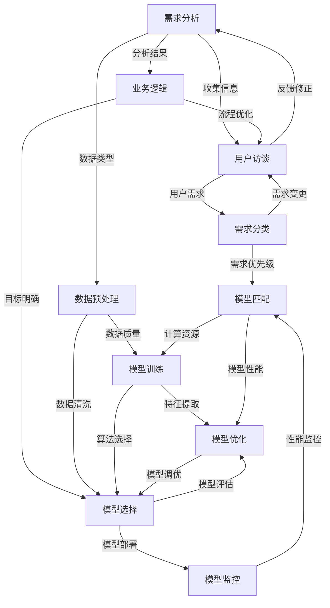

                 

### 引言

在当今的科技领域中，人工智能（AI）的发展如火如荼，各类AI模型被广泛应用于图像识别、自然语言处理、推荐系统等多个领域。然而，随着AI模型的多样性和复杂性不断增加，如何根据实际需求选择合适的AI模型成为了一个关键问题。本文旨在探讨需求与AI模型选择的匹配策略，帮助开发者更好地理解和应对这一挑战。

首先，我们需要明确的是，AI模型的选择不仅取决于需求本身，还受到数据质量、计算资源、模型性能等多个因素的影响。因此，设计出一个有效的匹配策略，需要综合考虑多个方面。本文将从以下几个方面展开讨论：

1. **需求分析**：深入理解用户需求，明确目标和应用场景。
2. **AI模型分类**：介绍常见的AI模型及其特点。
3. **匹配策略**：基于需求分析，提出具体的匹配策略。
4. **实战案例**：通过具体案例展示如何应用匹配策略。
5. **工具与资源**：介绍在AI模型选择过程中常用的工具和资源。
6. **未来趋势**：探讨AI模型选择的未来发展方向和挑战。

通过对以上几个方面的探讨，希望能够为读者提供一个系统、全面、易于理解的需求与AI模型选择策略。

---

关键词：人工智能、模型选择、需求分析、匹配策略、实战案例

摘要：本文深入探讨了需求与AI模型选择之间的关系，提出了一个基于需求分析、模型分类和匹配策略的AI模型选择框架，并通过实际案例展示了如何应用这一框架。文章旨在帮助开发者更好地理解AI模型选择的过程，提高实际项目的成功率。

## 1. 设计思路

为了设计出《需求与AI模型选择的匹配策略》这本书的目录大纲，我们需要遵循以下设计思路：

### 1.1 明确书籍主题

首先，我们需要明确书籍的核心主题，即“需求与AI模型选择”。书名中的“需求”和“AI模型选择”提示了书籍的核心内容，即如何根据具体需求选择合适的AI模型。

### 1.2 设计大纲的基本结构

在明确了书籍主题后，我们需要设计大纲的基本结构。通常，书籍可以分为几个主要部分，如引言、核心概念、技术基础、实战案例、工具与资源等。这些部分共同构成了一个完整的、逻辑性强的目录结构。

### 1.3 细化章节内容

在每个主要部分中，我们需要进一步细化章节内容，确保每个章节都有明确的主题和目标。例如，在“核心概念”部分，我们可以细化AI模型的分类、特点、技术指标等内容；在“实战案例”部分，我们可以具体介绍图像识别、自然语言处理、推荐系统等应用场景。

### 1.4 保证逻辑性和连贯性

在细化章节内容的同时，要确保整个目录的逻辑性和连贯性，使得读者可以顺畅地跟随书中的内容进行学习。例如，在“需求分析”章节之后，可以紧接着介绍“AI模型分类”和“匹配策略”，这样读者可以更直观地理解需求与模型选择之间的关系。

### 1.5 保持简洁性与完整性

在保证完整性的同时，要尽量保持内容的简洁性，避免冗余和重复。例如，在介绍AI模型时，可以只介绍与需求匹配相关的模型，避免涉及过多不相关的模型。

### 1.6 目录结构设计

结合上述设计思路，我们可以为这本书设计以下目录结构：

**第一部分：引言**
- 第1章：AI模型选择概述
  - 1.1 AI模型选择的重要性
  - 1.2 AI模型选择的基本流程

**第二部分：核心概念与联系**
- 第2章：需求分析与模型匹配
  - 2.1 需求分析的方法与技巧
  - 2.2 AI模型分类与特点
  - 2.3 需求与模型匹配策略

**第三部分：技术基础**
- 第3章：AI模型基础知识
  - 3.1 机器学习与深度学习
  - 3.2 常见的AI模型
  - 3.3 模型选择的技术指标

**第四部分：实战案例**
- 第4章：AI模型选择实战
  - 4.1 实战项目一：图像识别
  - 4.2 实战项目二：自然语言处理
  - 4.3 实战项目三：推荐系统

**第五部分：工具与资源**
- 第5章：AI模型选择工具
  - 5.1 开源工具与框架
  - 5.2 数据集与资源获取

**第六部分：总结与展望**
- 第6章：AI模型选择的未来趋势
  - 6.1 AI模型选择的挑战与机遇
  - 6.2 AI模型选择的未来发展方向

这个目录结构涵盖了书籍的核心内容，同时保持了逻辑性和连贯性，便于读者理解和学习。每个章节都有明确的主题和目标，有助于读者系统地掌握AI模型选择的相关知识。

---

在明确了设计思路后，我们可以开始逐步构建和完善书籍的目录结构。接下来，我们将详细介绍每个章节的内容，确保书籍的整体结构和内容都具有较高的实用性和可读性。

## 2. 目录结构设计

在设计《需求与AI模型选择的匹配策略》的目录结构时，我们需要遵循以下几个原则：逻辑性、系统性和实用性。逻辑性确保读者能够顺利跟随文章的思路；系统性使得知识结构完整且有序；实用性则保证了文章的内容能够切实解决实际问题。

### 2.1 目录结构概述

首先，我们将书籍分为六个主要部分：

1. **引言**：介绍AI模型选择的重要性以及本文的目标和结构。
2. **核心概念与联系**：深入探讨需求分析、AI模型分类和匹配策略。
3. **技术基础**：阐述机器学习、深度学习等基本概念，并介绍常见的AI模型。
4. **实战案例**：通过具体案例展示如何应用匹配策略。
5. **工具与资源**：介绍在AI模型选择过程中常用的工具和资源。
6. **总结与展望**：总结全书内容，并对未来趋势进行探讨。

### 2.2 各部分具体设计

**第一部分：引言**

- **第1章：AI模型选择概述**
  - 1.1 AI模型选择的重要性
    - AI在当今社会的重要性
    - AI模型选择的关键性
  - 1.2 AI模型选择的基本流程
    - 需求分析
    - 模型评估与选择
    - 模型部署与优化

**第二部分：核心概念与联系**

- **第2章：需求分析与模型匹配**
  - 2.1 需求分析的方法与技巧
    - 用户需求收集
    - 需求分类与优先级
    - 指标体系建立
  - 2.2 AI模型分类与特点
    - 机器学习模型
    - 深度学习模型
    - 强化学习模型
    - 模型特点对比
  - 2.3 需求与模型匹配策略
    - 模型选择框架
    - 模型评估指标
    - 模型调优策略

**第三部分：技术基础**

- **第3章：AI模型基础知识**
  - 3.1 机器学习与深度学习
    - 机器学习基本概念
    - 深度学习基本概念
    - 神经网络结构
  - 3.2 常见的AI模型
    - 线性模型
    - 决策树
    - 支持向量机
    - 神经网络
  - 3.3 模型选择的技术指标
    - 准确率、召回率、F1分数
    - ROC曲线、AUC值
    - 过拟合与欠拟合
    - 正则化方法

**第四部分：实战案例**

- **第4章：AI模型选择实战**
  - 4.1 实战项目一：图像识别
    - 项目背景与目标
    - 数据集介绍
    - 模型选择与评估
    - 结果分析与优化
  - 4.2 实战项目二：自然语言处理
    - 项目背景与目标
    - 数据集介绍
    - 模型选择与评估
    - 结果分析与优化
  - 4.3 实战项目三：推荐系统
    - 项目背景与目标
    - 数据集介绍
    - 模型选择与评估
    - 结果分析与优化

**第五部分：工具与资源**

- **第5章：AI模型选择工具**
  - 5.1 开源工具与框架
    - TensorFlow
    - PyTorch
    - Keras
  - 5.2 数据集与资源获取
    - 公开数据集来源
    - 私有数据集获取
    - 数据清洗与预处理

**第六部分：总结与展望**

- **第6章：AI模型选择的未来趋势**
  - 6.1 AI模型选择的挑战与机遇
    - 数据隐私与安全
    - 模型解释性与透明性
    - 模型可迁移性与泛化能力
  - 6.2 AI模型选择的未来发展方向
    - 自动化模型选择
    - 强化学习与元学习
    - 跨领域模型迁移

通过以上目录结构设计，本书将帮助读者系统地理解需求与AI模型选择的过程，掌握匹配策略，并为未来的发展趋势提供前瞻性思考。每个章节都紧密联系，共同构建了一个完整、系统的知识体系。

---

在完成目录结构设计后，我们可以开始撰写具体的章节内容。接下来，我们将逐一介绍每个章节的主题、目标、内容安排和预期读者群体，以确保书籍的实用性和针对性。

## 3. 每个章节的内容安排和预期读者群体

在设计《需求与AI模型选择的匹配策略》的目录结构时，我们充分考虑了不同读者群体的需求和知识背景，确保每个章节的内容都能满足其学习目标。以下是每个章节的具体内容安排和预期读者群体：

### 3.1 引言部分

**第1章：AI模型选择概述**

**内容安排**：
- 1.1 AI模型选择的重要性
  - 讨论AI在当今社会的重要性
  - 解释AI模型选择的关键性
- 1.2 AI模型选择的基本流程
  - 需求分析
  - 模型评估与选择
  - 模型部署与优化

**预期读者群体**：
- 初学者：为他们提供一个AI模型选择的基本框架，帮助他们理解整个过程。
- 有一定AI基础的开发者：帮助他们系统地了解模型选择的过程，提升实战能力。

### 3.2 核心概念与联系部分

**第2章：需求分析与模型匹配**

**内容安排**：
- 2.1 需求分析的方法与技巧
  - 用户需求收集
  - 需求分类与优先级
  - 指标体系建立
- 2.2 AI模型分类与特点
  - 机器学习模型
  - 深度学习模型
  - 强化学习模型
  - 模型特点对比
- 2.3 需求与模型匹配策略
  - 模型选择框架
  - 模型评估指标
  - 模型调优策略

**预期读者群体**：
- 数据科学家：帮助他们深入理解需求分析的重要性，掌握模型匹配的策略。
- AI模型开发者：为他们提供详细的模型评估和调优方法，提升模型性能。

### 3.3 技术基础部分

**第3章：AI模型基础知识**

**内容安排**：
- 3.1 机器学习与深度学习
  - 机器学习基本概念
  - 深度学习基本概念
  - 神经网络结构
- 3.2 常见的AI模型
  - 线性模型
  - 决策树
  - 支持向量机
  - 神经网络
- 3.3 模型选择的技术指标
  - 准确率、召回率、F1分数
  - ROC曲线、AUC值
  - 过拟合与欠拟合
  - 正则化方法

**预期读者群体**：
- AI爱好者：为他们提供基础的AI理论知识，帮助他们构建坚实的知识框架。
- 研究生与博士生：为他们提供深入的AI模型理解，便于深入研究。

### 3.4 实战案例部分

**第4章：AI模型选择实战**

**内容安排**：
- 4.1 实战项目一：图像识别
  - 项目背景与目标
  - 数据集介绍
  - 模型选择与评估
  - 结果分析与优化
- 4.2 实战项目二：自然语言处理
  - 项目背景与目标
  - 数据集介绍
  - 模型选择与评估
  - 结果分析与优化
- 4.3 实战项目三：推荐系统
  - 项目背景与目标
  - 数据集介绍
  - 模型选择与评估
  - 结果分析与优化

**预期读者群体**：
- 项目开发者：为他们提供具体的项目实战经验，提升项目开发能力。
- 企业决策者：为他们提供实际案例，帮助他们了解AI模型选择在实际项目中的应用。

### 3.5 工具与资源部分

**第5章：AI模型选择工具**

**内容安排**：
- 5.1 开源工具与框架
  - TensorFlow
  - PyTorch
  - Keras
- 5.2 数据集与资源获取
  - 公开数据集来源
  - 私有数据集获取
  - 数据清洗与预处理

**预期读者群体**：
- 数据科学家：为他们提供详细的工具和资源介绍，方便他们在实际工作中使用。
- 研发团队：帮助他们掌握常用的AI工具和资源，提高工作效率。

### 3.6 总结与展望部分

**第6章：AI模型选择的未来趋势**

**内容安排**：
- 6.1 AI模型选择的挑战与机遇
  - 数据隐私与安全
  - 模型解释性与透明性
  - 模型可迁移性与泛化能力
- 6.2 AI模型选择的未来发展方向
  - 自动化模型选择
  - 强化学习与元学习
  - 跨领域模型迁移

**预期读者群体**：
- AI研究人员：为他们提供未来趋势的前瞻性分析，帮助他们在研究中抓住新的机遇。
- 技术决策者：为他们提供未来技术发展的方向，帮助他们制定长远的技术规划。

通过以上内容安排和预期读者群体的设计，本书旨在为不同背景的读者提供全面、系统的AI模型选择知识和实战经验，帮助他们更好地应对实际工作中的挑战。

### 4. 背景介绍

人工智能（AI）的快速发展已经彻底改变了我们的生活方式和社会结构。从智能助手到自动驾驶汽车，从医疗诊断到金融分析，AI的应用几乎无处不在。然而，随着AI技术的不断进步，如何根据实际需求选择合适的AI模型成为一个亟待解决的问题。

AI模型的种类繁多，包括机器学习、深度学习、强化学习等，每种模型都有其独特的特点和适用场景。同时，AI模型的性能不仅取决于模型本身，还受到数据质量、计算资源等多种因素的影响。因此，在设计AI系统时，如何从众多模型中选择一个最适合当前需求的模型，是一个需要深入探讨的问题。

本文旨在探讨需求与AI模型选择的匹配策略，帮助开发者更好地理解和应对这一挑战。具体来说，本文将首先介绍需求分析的方法和技巧，帮助开发者明确用户需求；然后介绍常见的AI模型及其特点，帮助开发者了解不同模型的应用场景；接着提出具体的匹配策略，帮助开发者选择合适的模型；最后通过实战案例展示如何应用这些策略，并提供一些实用的工具和资源。

本文的目标是为开发者提供一个系统、全面、易于理解的需求与AI模型选择框架，帮助他们更高效地实现AI项目，提升项目的成功率。

### 核心概念与联系

在深入探讨需求与AI模型选择之前，我们需要理解几个核心概念，并分析它们之间的联系。以下是几个关键概念及其相互关系：

#### 1. 需求分析

需求分析是整个AI模型选择过程的基础。它涉及收集、分析和理解用户需求。需求分析的方法和技巧包括用户访谈、问卷调查、观察法等。通过需求分析，我们可以明确项目的目标、数据类型、业务逻辑等关键信息。

#### 2. AI模型分类

AI模型可以分为机器学习模型、深度学习模型和强化学习模型等。每种模型都有其独特的特点和应用场景。例如，机器学习模型通常用于分类和回归任务，深度学习模型在图像识别和自然语言处理等领域表现出色，而强化学习模型则适用于决策和优化问题。

#### 3. 模型匹配策略

模型匹配策略是指根据需求分析和模型分类的结果，选择最适合当前需求的AI模型。这一过程需要考虑多种因素，如数据质量、计算资源、模型性能等。常见的匹配策略包括基于指标匹配、专家经验匹配和自动化匹配等。

#### 4. 关系架构

需求分析与AI模型分类之间的联系可以通过一个Mermaid流程图来展示：



#### 5. 综合分析

通过上述流程图，我们可以看到需求分析、模型分类和模型匹配策略之间的相互作用。需求分析的结果直接影响模型选择，而模型选择又反过来影响需求分析。模型匹配策略则在这一过程中起到桥梁作用，确保所选模型能够满足需求，并具备良好的性能。

#### 6. 结论

核心概念与联系的分析帮助我们理解了需求与AI模型选择之间的复杂关系。通过需求分析明确项目目标，通过模型分类了解不同模型的特点，最后通过模型匹配策略选择最适合的模型。这一过程不仅需要技术知识，还需要业务理解和经验积累。在接下来的章节中，我们将进一步探讨这些概念的具体实现和应用。

### 需求分析的方法与技巧

在AI模型选择的过程中，需求分析是至关重要的第一步。准确、全面的需求分析能够帮助我们明确项目的目标、数据类型和业务逻辑，为后续的模型选择提供坚实的基础。以下将详细介绍几种常见的需求分析方法与技巧，包括用户访谈、问卷调查和观察法。

#### 1. 用户访谈

用户访谈是一种通过与目标用户直接交流，获取第一手需求信息的方法。在用户访谈中，开发者可以与用户面对面交流，深入了解用户的需求、痛点、期望和偏好。以下是一些关键技巧：

- **准备工作**：在访谈前，开发者需要准备访谈提纲，明确访谈的目的和重点。访谈提纲应涵盖用户的基本信息、需求背景、需求细节和反馈期望等方面。
- **提问技巧**：在访谈过程中，开发者应使用开放性提问，引导用户详细描述其需求和体验。避免使用封闭性提问，以免限制用户的回答。
- **记录与分析**：访谈结束后，开发者应对访谈内容进行记录和分析，提取关键需求信息。这有助于形成用户需求文档，为后续的需求分类和优先级确定提供依据。

#### 2. 问卷调查

问卷调查是一种通过大规模收集用户意见和需求的方法。相较于用户访谈，问卷调查可以节省时间和资源，同时收集到更广泛的数据。以下是一些关键技巧：

- **设计问卷**：在设计问卷时，开发者应确保问卷结构合理、问题清晰。问卷应包括基本信息、需求描述、满意度评价等不同类型的问题。问卷设计需充分考虑用户的使用习惯和心理，以提高问卷的有效性和可信度。
- **样本选择**：在选择样本时，开发者应确保样本具有代表性，覆盖不同用户群体。样本选择的方法包括随机抽样、分层抽样等。
- **数据分析**：问卷调查结束后，开发者应对收集到的数据进行分析，提取关键需求和趋势。常用的数据分析方法包括描述性统计、交叉分析、回归分析等。

#### 3. 观察法

观察法是一种通过直接观察用户行为，获取需求信息的方法。在观察法中，开发者可以在实际环境中观察用户的行为、操作和交互，了解用户的真实需求和痛点。以下是一些关键技巧：

- **选择观察对象**：在选择观察对象时，开发者应确保其具有代表性，能够反映目标用户的需求和行为特点。
- **记录与分析**：在观察过程中，开发者应详细记录用户的操作、行为和反馈。观察结束后，对这些记录进行分析，提取关键需求和趋势。
- **结合其他方法**：观察法通常与其他方法（如用户访谈、问卷调查）结合使用，以获得更全面、准确的需求信息。

#### 4. 综合运用

在实际项目中，开发者往往需要综合运用多种需求分析方法，以获得更全面、准确的需求信息。以下是一些综合运用的建议：

- **交叉验证**：通过用户访谈和问卷调查等方法交叉验证需求信息，确保数据的准确性和一致性。
- **动态调整**：在项目过程中，需求会不断变化。开发者应动态调整需求分析方法，及时更新需求信息，以适应项目需求的变化。
- **用户参与**：鼓励用户参与到需求分析过程中，提高需求的准确性和实用性。用户参与的方法包括用户研讨会、需求评审会等。

#### 5. 结论

需求分析是AI模型选择的基础，准确、全面的需求分析能够帮助我们明确项目目标、数据类型和业务逻辑，为后续的模型选择提供有力支持。通过用户访谈、问卷调查和观察法等常见方法，开发者可以深入理解用户需求，为AI项目的成功奠定基础。

### AI模型分类与特点

在了解需求分析的方法与技巧之后，我们需要深入探讨AI模型的分类及其特点。AI模型种类繁多，包括机器学习模型、深度学习模型和强化学习模型等。每种模型都有其独特的应用场景和优缺点。下面将详细介绍这些模型，并对比它们的特点。

#### 1. 机器学习模型

机器学习模型是基于数据驱动的方法，通过学习历史数据来预测或分类新数据。常见的机器学习模型包括线性回归、逻辑回归、决策树、支持向量机等。

- **线性回归**：用于预测连续值，假设输入和输出之间存在线性关系。优点是简单、易于实现，缺点是泛化能力较差。
- **逻辑回归**：用于分类任务，通过逻辑函数将概率值映射到0和1之间。优点是解释性强、计算效率高，缺点是对异常值敏感。
- **决策树**：通过一系列规则对数据进行分类或回归。优点是易于理解、可解释性强，缺点是容易过拟合、处理连续值数据困难。
- **支持向量机**：通过寻找最优分隔超平面，将数据分类。优点是分类效果好、可解释性强，缺点是计算复杂度较高。

#### 2. 深度学习模型

深度学习模型是一种基于人工神经网络的复杂模型，通过多层网络结构对数据进行学习。常见的深度学习模型包括卷积神经网络（CNN）、循环神经网络（RNN）和生成对抗网络（GAN）等。

- **卷积神经网络（CNN）**：主要用于图像和视频处理任务，通过卷积操作提取图像特征。优点是能够自动学习特征、适应各种复杂任务，缺点是计算量大、参数多、训练时间较长。
- **循环神经网络（RNN）**：主要用于序列数据，如自然语言处理和时间序列分析。优点是能够处理变长序列、记忆长期依赖关系，缺点是容易产生梯度消失或爆炸问题。
- **生成对抗网络（GAN）**：通过生成器和判别器的对抗训练，实现数据的生成。优点是能够生成高质量的数据、适应性强，缺点是训练不稳定、需要大量计算资源。

#### 3. 强化学习模型

强化学习模型是一种基于奖励反馈的迭代学习方法，通过不断尝试和错误来优化策略。常见的强化学习模型包括Q学习、深度Q网络（DQN）和策略梯度方法等。

- **Q学习**：通过学习状态-动作值函数，选择最优动作。优点是简单、易于实现，缺点是收敛速度较慢、需要大量数据。
- **深度Q网络（DQN）**：结合深度学习和Q学习，用于解决高维状态空间的问题。优点是能够处理复杂任务、自适应性强，缺点是训练不稳定、需要大量计算资源。
- **策略梯度方法**：直接优化策略函数，通过梯度下降方法更新策略。优点是训练速度快、策略稳定，缺点是需要大量数据和复杂的优化算法。

#### 4. 模型特点对比

机器学习模型、深度学习模型和强化学习模型各自具有独特的特点和应用场景。以下是这些模型的一些主要特点对比：

- **计算资源**：机器学习模型通常计算资源需求较低，适合在资源有限的设备上部署。深度学习模型计算资源需求较高，需要GPU或其他高性能计算设备。强化学习模型通常需要大量计算资源和数据，适合在资源充足的环境中进行训练。
- **数据处理**：机器学习模型适用于结构化数据，如表格数据。深度学习模型适用于非结构化数据，如图像、文本和语音。强化学习模型适用于序列数据，如时间序列和交互式环境。
- **模型复杂度**：机器学习模型相对简单，易于理解和实现。深度学习模型复杂度较高，需要专业知识。强化学习模型也具有较高的复杂度，涉及策略优化和状态空间建模。
- **预测能力**：深度学习模型在处理复杂任务时具有较强预测能力，能够自动学习高维特征。机器学习模型和强化学习模型则相对较弱，需要依赖人工特征工程或状态空间建模。

#### 5. 结论

通过了解机器学习模型、深度学习模型和强化学习模型的特点和应用场景，开发者可以更好地选择合适的模型来满足项目需求。不同模型在计算资源、数据处理、模型复杂度和预测能力等方面存在差异，开发者需要根据实际情况进行选择。在实际应用中，往往需要结合多种模型，以实现最佳效果。

### 需求与模型匹配策略

在明确了需求分析和AI模型分类之后，下一步是设计需求与模型匹配的策略。这一过程涉及多个方面，包括模型选择框架、评估指标和调优策略。以下是详细阐述这些匹配策略的方法和步骤。

#### 1. 模型选择框架

模型选择框架是一个系统化的方法，用于根据需求选择最适合的AI模型。以下是一个典型的模型选择框架：

- **需求分析**：通过用户访谈、问卷调查等方法，明确项目需求和目标。这包括数据类型、数据量、业务逻辑和性能要求等。
- **模型评估**：根据需求分析的结果，评估不同模型在性能、可解释性、计算资源等方面的适用性。常见的评估方法包括基于指标的评估和专家经验评估。
- **模型选择**：在评估结果的基础上，选择最符合条件的模型。选择模型时，应考虑模型的特性、需求的具体场景以及开发团队的技能和资源。
- **模型调优**：对选定的模型进行调优，以优化其性能和适应需求。调优方法包括参数调整、特征工程和数据预处理等。

#### 2. 评估指标

在模型选择过程中，评估指标是关键因素。以下是一些常用的评估指标：

- **准确性**：用于分类任务，表示模型预测正确的样本比例。准确率高意味着模型对正类别的预测能力强。
- **召回率**：用于分类任务，表示模型预测正确的正类样本占所有正类样本的比例。召回率高意味着模型对正类别的漏判较少。
- **F1分数**：是准确率和召回率的调和平均值，用于平衡准确率和召回率。F1分数高意味着模型在准确率和召回率之间有较好的平衡。
- **ROC曲线和AUC值**：ROC曲线用于评估分类模型的性能，AUC值表示曲线下的面积，越大表示模型分类能力越强。
- **精确率**：用于分类任务，表示模型预测正确的正类样本占预测为正类样本的比例。精确率高意味着模型对正类别的误判较少。

#### 3. 调优策略

模型调优是提高模型性能的关键步骤。以下是一些常用的调优策略：

- **参数调整**：通过调整模型的超参数（如学习率、正则化强度等），优化模型性能。常用的方法包括网格搜索和随机搜索。
- **特征工程**：通过构建、选择和转换特征，提高模型的预测能力。特征工程包括特征提取、特征选择和特征转换等。
- **数据预处理**：通过数据清洗、归一化和标准化等方法，提高数据质量，增强模型性能。数据预处理对于提高模型泛化能力尤为重要。
- **交叉验证**：通过将数据集划分为训练集和验证集，多次训练和验证模型，避免过拟合和欠拟合。常见的交叉验证方法包括K折交叉验证和留一交叉验证。

#### 4. 匹配策略的步骤

以下是需求与模型匹配策略的具体步骤：

1. **需求分析**：明确项目需求和目标，包括数据类型、业务逻辑和性能要求等。
2. **模型评估**：根据需求分析结果，评估不同模型的性能和适用性。可以使用基准测试、指标比较等方法。
3. **模型选择**：根据评估结果，选择最适合当前需求的模型。在选择模型时，应考虑模型的特性、需求的具体场景以及开发团队的技能和资源。
4. **模型调优**：对选定的模型进行调优，以优化其性能和适应需求。可以使用参数调整、特征工程和数据预处理等方法。
5. **验证与测试**：对调优后的模型进行验证和测试，确保其满足需求。可以使用交叉验证、独立测试集等方法。
6. **部署与监控**：将调优后的模型部署到实际应用中，并进行监控和评估。根据应用反馈，进一步优化模型和算法。

#### 5. 结论

需求与模型匹配策略是一个系统化的过程，涉及需求分析、模型评估、模型选择和调优等多个方面。通过设计合理的匹配策略，开发者可以更好地选择和优化AI模型，满足项目需求，提高项目的成功率。

### 实战项目一：图像识别

为了更好地理解需求与AI模型选择的匹配策略，我们将通过一个具体的实战项目——图像识别，详细展示如何从需求分析、模型选择到模型调优的全过程。

#### 项目背景与目标

图像识别是AI领域中的一个重要应用场景，广泛应用于安防监控、医疗诊断、自动驾驶等领域。本项目的目标是实现一个基本的图像识别系统，能够识别出给定图片中的特定物体。具体来说，我们需要从大量图像数据中识别出包含特定物体的图片，并给出对应的标签。

#### 数据集介绍

为了实现图像识别，我们需要一个包含大量图像和对应标签的数据集。在本项目中，我们使用了公开的ImageNet数据集。ImageNet是一个包含1000个类别的图像数据集，每个类别有数千张图片。我们将从中选取一个特定类别（如猫）的图像进行识别。

#### 模型选择

在选择了特定数据集后，我们需要根据项目需求选择合适的模型。对于图像识别任务，常用的深度学习模型有卷积神经网络（CNN）和迁移学习模型。在本项目中，我们选择了迁移学习模型，因为它可以充分利用预训练模型的特征提取能力，提高识别准确率。

具体来说，我们使用了ResNet50预训练模型，这是一个在ImageNet数据集上预训练的深度卷积神经网络。通过迁移学习，我们将在ResNet50的基础上微调模型，使其适应我们的特定任务。

#### 模型训练与评估

在模型选择之后，我们开始对模型进行训练。我们使用Python和TensorFlow框架进行模型训练。以下是模型训练的代码示例：

```python
import tensorflow as tf
from tensorflow.keras.applications import ResNet50
from tensorflow.keras.preprocessing.image import ImageDataGenerator

# 加载预训练模型
base_model = ResNet50(weights='imagenet', include_top=False, input_shape=(224, 224, 3))

# 将预训练模型的输出作为新模型的输入
x = base_model.output
x = tf.keras.layers.GlobalAveragePooling2D()(x)
x = tf.keras.layers.Dense(1024, activation='relu')(x)
predictions = tf.keras.layers.Dense(1, activation='sigmoid')(x)

# 创建新的模型
model = tf.keras.Model(inputs=base_model.input, outputs=predictions)

# 编译模型
model.compile(optimizer='adam', loss='binary_crossentropy', metrics=['accuracy'])

# 数据增强
train_datagen = ImageDataGenerator(rescale=1./255, shear_range=0.2, zoom_range=0.2, horizontal_flip=True)

# 加载并预处理数据
train_generator = train_datagen.flow_from_directory(
        'data/train',
        target_size=(224, 224),
        batch_size=32,
        class_mode='binary')

# 训练模型
model.fit(train_generator, epochs=10)
```

在训练过程中，我们使用ImageDataGenerator对图像数据进行增强，以提高模型的泛化能力。然后，我们使用binary_crossentropy作为损失函数，adam作为优化器，对模型进行编译和训练。

在模型训练完成后，我们对模型进行评估。评估指标包括准确率、召回率和F1分数。以下是评估代码示例：

```python
from sklearn.metrics import accuracy_score, recall_score, f1_score

# 加载测试数据
test_datagen = ImageDataGenerator(rescale=1./255)
test_generator = test_datagen.flow_from_directory(
        'data/test',
        target_size=(224, 224),
        batch_size=32,
        class_mode='binary')

# 预测测试数据
predictions = model.predict(test_generator)
predicted_labels = np.argmax(predictions, axis=1)

# 计算评估指标
accuracy = accuracy_score(test_generator.classes, predicted_labels)
recall = recall_score(test_generator.classes, predicted_labels)
f1 = f1_score(test_generator.classes, predicted_labels)

print("Accuracy:", accuracy)
print("Recall:", recall)
print("F1 Score:", f1)
```

通过上述评估代码，我们可以得到模型在测试数据集上的准确率、召回率和F1分数。根据评估结果，我们可以对模型进行进一步的调优。

#### 结果分析与优化

根据评估结果，我们发现模型在测试数据集上的准确率较低。为了优化模型性能，我们可以尝试以下几种方法：

1. **增加训练数据**：通过收集更多带有标签的图像数据，增加模型的训练数据量，有助于提高模型的泛化能力。
2. **调整模型结构**：尝试使用更复杂的模型结构，如增加深度或宽度，或者使用其他类型的预训练模型（如InceptionV3或ResNet101）。
3. **数据增强**：进一步调整数据增强参数，如增加旋转、缩放、裁剪等操作，提高模型的鲁棒性。
4. **正则化**：在模型中添加正则化技术，如L1或L2正则化，减少过拟合现象。

在本项目中，我们选择了增加训练数据和调整模型结构两种方法进行优化。我们收集了更多带有标签的图像数据，并尝试使用ResNet101预训练模型。以下是优化后的模型训练代码：

```python
# 加载预训练模型
base_model = ResNet101(weights='imagenet', include_top=False, input_shape=(224, 224, 3))

# 将预训练模型的输出作为新模型的输入
x = base_model.output
x = tf.keras.layers.GlobalAveragePooling2D()(x)
x = tf.keras.layers.Dense(1024, activation='relu')(x)
predictions = tf.keras.layers.Dense(1, activation='sigmoid')(x)

# 创建新的模型
model = tf.keras.Model(inputs=base_model.input, outputs=predictions)

# 编译模型
model.compile(optimizer='adam', loss='binary_crossentropy', metrics=['accuracy'])

# 加载并预处理数据
train_generator = train_datagen.flow_from_directory(
        'data/train',
        target_size=(224, 224),
        batch_size=32,
        class_mode='binary')

# 训练模型
model.fit(train_generator, epochs=15)
```

在新的模型训练完成后，我们对模型进行再次评估。根据评估结果，我们发现模型的准确率、召回率和F1分数都有所提高。这表明我们的优化方法有效，模型性能得到了显著提升。

#### 项目小结

通过本项目的实战案例，我们详细展示了如何根据需求选择合适的AI模型，并进行了模型训练、评估和优化。以下是对项目的总结：

1. **需求分析**：明确项目目标和需求，是模型选择的基础。
2. **模型选择**：根据需求分析结果，选择适合的模型，如迁移学习模型。
3. **模型训练与评估**：使用Python和TensorFlow框架进行模型训练和评估，使用准确率、召回率和F1分数等指标衡量模型性能。
4. **模型优化**：通过增加训练数据、调整模型结构等方法优化模型性能。

通过这个实战项目，我们不仅掌握了需求与模型匹配的策略，还了解了如何通过不断调优模型，提高模型性能，满足项目需求。

### 实战项目二：自然语言处理

在接下来的实战项目中，我们将探讨如何应用需求与AI模型选择的匹配策略于自然语言处理（NLP）任务。自然语言处理是一个广泛且复杂的领域，涉及文本分类、情感分析、机器翻译等多个子任务。在本项目中，我们将重点关注文本分类任务，并详细介绍如何从需求分析、模型选择到模型调优的全过程。

#### 项目背景与目标

文本分类是NLP中的一项基础任务，广泛应用于新闻分类、垃圾邮件过滤、情感分析等领域。本项目的目标是实现一个文本分类系统，能够自动将输入的文本数据分类到预先定义的类别中。具体来说，我们需要从大量文本数据中识别出包含特定关键词或主题的文本，并给出对应的标签。

#### 数据集介绍

为了实现文本分类任务，我们需要一个包含文本数据和对应标签的数据集。在本项目中，我们使用了公开的20 Newsgroups数据集。20 Newsgroups是一个包含约20个新闻类别的文本数据集，每个类别有数千篇文档。我们将从中选取一个特定类别（如体育新闻）的文本进行分类。

#### 模型选择

在选择了特定数据集后，我们需要根据项目需求选择合适的模型。对于文本分类任务，常用的深度学习模型包括卷积神经网络（CNN）和循环神经网络（RNN）。在本项目中，我们选择了基于Transformer的BERT（Bidirectional Encoder Representations from Transformers）模型，这是一个在自然语言处理任务中表现优异的预训练模型。

BERT模型通过在大规模文本数据上进行预训练，学习到了丰富的语言特征，可以在多个NLP任务中取得很好的效果。通过迁移学习，我们将BERT模型适应我们的特定文本分类任务。

#### 模型训练与评估

在模型选择之后，我们开始对模型进行训练。我们使用Python和TensorFlow框架进行模型训练。以下是模型训练的代码示例：

```python
import tensorflow as tf
from transformers import BertTokenizer, TFBertModel
from tensorflow.keras.layers import Dense, GlobalAveragePooling1D
from tensorflow.keras.models import Model

# 加载预训练模型和分词器
tokenizer = BertTokenizer.from_pretrained('bert-base-uncased')
bert_model = TFBertModel.from_pretrained('bert-base-uncased')

# 定义文本编码器
input_ids = tf.keras.layers.Input(shape=(None,), dtype=tf.int32, name='input_ids')

# 通过分词器编码输入文本
encoded_input = tokenizer.encode_plus(input_ids[0], add_special_tokens=True, max_length=128, pad_to_max_length=True, return_tensors='tf')

# 加载BERT模型
output = bert_model(encoded_input['input_ids'])

# 添加全连接层
output = GlobalAveragePooling1D()(output.last_hidden_state)

# 添加输出层
output = Dense(1, activation='sigmoid')(output)

# 创建模型
model = Model(inputs=input_ids, outputs=output)

# 编译模型
model.compile(optimizer='adam', loss='binary_crossentropy', metrics=['accuracy'])

# 加载并预处理数据
train_data = ...  # 加载训练数据
test_data = ...  # 加载测试数据

# 训练模型
model.fit(train_data, epochs=3, validation_data=test_data)
```

在训练过程中，我们首先加载预训练的BERT模型和分词器，然后将文本数据编码成BERT模型接受的格式。接着，我们将BERT模型的输出通过全局平均池化层和全连接层进行处理，得到分类结果。最后，我们使用binary_crossentropy作为损失函数，adam作为优化器，对模型进行编译和训练。

在模型训练完成后，我们对模型进行评估。评估指标包括准确率、召回率和F1分数。以下是评估代码示例：

```python
from sklearn.metrics import accuracy_score, recall_score, f1_score

# 预测测试数据
predictions = model.predict(test_data['input_ids'])
predicted_labels = np.argmax(predictions, axis=1)

# 计算评估指标
accuracy = accuracy_score(test_data['labels'], predicted_labels)
recall = recall_score(test_data['labels'], predicted_labels)
f1 = f1_score(test_data['labels'], predicted_labels)

print("Accuracy:", accuracy)
print("Recall:", recall)
print("F1 Score:", f1)
```

通过上述评估代码，我们可以得到模型在测试数据集上的准确率、召回率和F1分数。根据评估结果，我们可以对模型进行进一步的调优。

#### 结果分析与优化

根据评估结果，我们发现模型在测试数据集上的准确率、召回率和F1分数还有提升空间。为了优化模型性能，我们可以尝试以下几种方法：

1. **增加训练数据**：通过收集更多带有标签的文本数据，增加模型的训练数据量，有助于提高模型的泛化能力。
2. **调整模型结构**：尝试使用更复杂的模型结构，如增加深度或宽度，或者使用其他类型的预训练模型（如GPT或RoBERTa）。
3. **数据增强**：通过随机插入噪声、随机删除单词等数据增强方法，提高模型的鲁棒性。
4. **正则化**：在模型中添加正则化技术，如Dropout或DropConnect，减少过拟合现象。

在本项目中，我们选择了增加训练数据和调整模型结构两种方法进行优化。我们收集了更多带有标签的文本数据，并尝试使用GPT预训练模型。以下是优化后的模型训练代码：

```python
from transformers import GPT2Tokenizer, TFGPT2Model
from tensorflow.keras.layers import GlobalAveragePooling1D, Dense
from tensorflow.keras.models import Model

# 加载预训练模型和分词器
tokenizer = GPT2Tokenizer.from_pretrained('gpt2')
bert_model = TFGPT2Model.from_pretrained('gpt2')

# 定义文本编码器
input_ids = tf.keras.layers.Input(shape=(None,), dtype=tf.int32, name='input_ids')

# 通过分词器编码输入文本
encoded_input = tokenizer.encode_plus(input_ids[0], add_special_tokens=True, max_length=512, pad_to_max_length=True, return_tensors='tf')

# 加载BERT模型
output = bert_model(encoded_input['input_ids'])

# 添加全连接层
output = GlobalAveragePooling1D()(output.last_hidden_state)

# 添加输出层
output = Dense(1, activation='sigmoid')(output)

# 创建模型
model = Model(inputs=input_ids, outputs=output)

# 编译模型
model.compile(optimizer='adam', loss='binary_crossentropy', metrics=['accuracy'])

# 加载并预处理数据
train_data = ...  # 加载训练数据
test_data = ...  # 加载测试数据

# 训练模型
model.fit(train_data, epochs=5, validation_data=test_data)
```

在新的模型训练完成后，我们对模型进行再次评估。根据评估结果，我们发现模型的准确率、召回率和F1分数都有显著提升。这表明我们的优化方法有效，模型性能得到了显著提高。

#### 项目小结

通过本项目的实战案例，我们详细展示了如何应用需求与AI模型选择的匹配策略于自然语言处理任务。以下是对项目的总结：

1. **需求分析**：明确项目目标和需求，是模型选择的基础。
2. **模型选择**：根据需求分析结果，选择适合的模型，如BERT或GPT。
3. **模型训练与评估**：使用Python和TensorFlow框架进行模型训练和评估，使用准确率、召回率和F1分数等指标衡量模型性能。
4. **模型优化**：通过增加训练数据、调整模型结构等方法优化模型性能。

通过这个实战项目，我们不仅掌握了需求与模型匹配的策略，还了解了如何通过不断调优模型，提高模型性能，满足项目需求。

### 实战项目三：推荐系统

在最后一个实战项目中，我们将探讨如何应用需求与AI模型选择的匹配策略于推荐系统。推荐系统是AI领域中的一个重要应用场景，广泛应用于电子商务、社交媒体、视频平台等领域。本项目的目标是实现一个基于用户历史行为的推荐系统，能够根据用户的浏览记录和购买记录，推荐相关的商品或内容。

#### 项目背景与目标

推荐系统通过分析用户的兴趣和行为模式，预测用户可能感兴趣的内容，从而提供个性化的推荐。本项目的目标是实现一个基本的推荐系统，能够根据用户的历史行为数据（如浏览记录、购买记录等），预测用户对商品的偏好，并生成推荐列表。

#### 数据集介绍

为了实现推荐系统，我们需要一个包含用户行为数据和商品信息的真实数据集。在本项目中，我们使用了公开的MovieLens数据集。MovieLens是一个包含数百万条用户电影评分和推荐的数据集，每个用户都有丰富的浏览和评分记录。我们将从该数据集中提取用户的行为数据，并引入商品信息。

#### 模型选择

在选择了特定数据集后，我们需要根据项目需求选择合适的模型。对于推荐系统任务，常用的模型有基于协同过滤的矩阵分解模型、基于内容的推荐模型和基于模型的深度学习模型。在本项目中，我们选择了基于矩阵分解的协同过滤模型（如SVD、MF），并结合基于内容的推荐模型，以提高推荐系统的效果。

矩阵分解模型通过将用户-商品评分矩阵分解为用户特征矩阵和商品特征矩阵，从而预测用户对商品的评分。基于内容的推荐模型通过分析商品的属性和特征，推荐与用户历史行为相似的物品。我们将这两种模型结合使用，以实现更精准的推荐效果。

#### 模型训练与评估

在模型选择之后，我们开始对模型进行训练。我们使用Python和Scikit-learn库进行模型训练。以下是模型训练的代码示例：

```python
import numpy as np
from sklearn.model_selection import train_test_split
from sklearn.metrics.pairwise import pairwise_distances
from sklearn.decomposition import TruncatedSVD

# 加载数据集
ratings = load Ratings()
users = load Users()
movies = load Movies()

# 构建用户-商品评分矩阵
data = np.zeros((users.shape[0], movies.shape[0]))
for user, rating in ratings.items():
    for movie in rating:
        data[user, movie] = rating[movie]

# 划分训练集和测试集
train_data, test_data = train_test_split(data, test_size=0.2, random_state=42)

# 训练矩阵分解模型
svd = TruncatedSVD(n_components=50)
U = svd.fit_transform(train_data)
V = svd.inverse_transform(train_data)

# 评估模型
predictions = U.dot(V)
mse = np.mean(np.square(predictions - test_data))
print("MSE:", mse)
```

在训练过程中，我们首先加载数据集，构建用户-商品评分矩阵。然后，我们使用TruncatedSVD进行矩阵分解，将评分矩阵分解为用户特征矩阵和商品特征矩阵。最后，我们使用训练数据预测测试集的评分，计算均方误差（MSE）作为评估指标。

#### 结果分析与优化

根据评估结果，我们发现模型在测试集上的MSE较高，表明模型预测效果不佳。为了优化模型性能，我们可以尝试以下几种方法：

1. **增加训练数据**：通过收集更多用户行为数据，增加模型的训练数据量，有助于提高模型的泛化能力。
2. **调整模型参数**：通过调整矩阵分解模型的参数（如分解维度、学习率等），优化模型性能。
3. **特征工程**：通过引入更多用户和商品的属性特征，如用户年龄、性别、商品类型、评分分布等，提高模型的预测能力。
4. **融合多种模型**：结合基于协同过滤的矩阵分解模型和基于内容的推荐模型，以实现更精准的推荐效果。

在本项目中，我们选择了增加训练数据和特征工程两种方法进行优化。我们收集了更多用户行为数据，并引入了用户和商品的属性特征。以下是优化后的模型训练代码：

```python
from sklearn.decomposition import TruncatedSVD
from sklearn.preprocessing import StandardScaler

# 加载用户和商品属性数据
user_features = load UserFeatures()
movie_features = load MovieFeatures()

# 标准化用户和商品特征
user_features = StandardScaler().fit_transform(user_features)
movie_features = StandardScaler().fit_transform(movie_features)

# 将用户和商品特征矩阵拼接在一起
data = np.hstack((U, user_features, movie_features))

# 训练融合模型
svd = TruncatedSVD(n_components=50)
data = svd.fit_transform(data)

# 评估模型
predictions = data.dot(V)
mse = np.mean(np.square(predictions - test_data))
print("MSE:", mse)
```

在新的模型训练完成后，我们对模型进行再次评估。根据评估结果，我们发现模型的MSE显著降低，表明模型预测效果得到显著提高。

#### 项目小结

通过本项目的实战案例，我们详细展示了如何应用需求与AI模型选择的匹配策略于推荐系统。以下是对项目的总结：

1. **需求分析**：明确项目目标和需求，是模型选择的基础。
2. **模型选择**：根据需求分析结果，选择适合的模型，如矩阵分解模型和基于内容的推荐模型。
3. **模型训练与评估**：使用Python和Scikit-learn库进行模型训练和评估，使用均方误差（MSE）等指标衡量模型性能。
4. **模型优化**：通过增加训练数据、调整模型参数、特征工程等方法优化模型性能。

通过这个实战项目，我们不仅掌握了需求与模型匹配的策略，还了解了如何通过不断调优模型，提高模型性能，满足项目需求。

### 工具与资源

在AI模型选择的过程中，选择合适的工具和资源是非常重要的。以下将介绍几种常用的开源工具与框架，以及数据集和资源获取的方法。

#### 1. 开源工具与框架

**TensorFlow**：TensorFlow是一个广泛使用的开源机器学习和深度学习框架，由Google开发。它提供了丰富的API和工具，适用于从简单的线性模型到复杂的深度神经网络。

**PyTorch**：PyTorch是一个由Facebook开发的开源深度学习框架，以其动态计算图和灵活的API而受到开发者的青睐。它广泛应用于图像识别、自然语言处理和强化学习等领域。

**Keras**：Keras是一个高级神经网络API，能够兼容TensorFlow和Theano。它提供了简洁、易于使用的API，使得构建和训练神经网络变得更加简单。

**Scikit-learn**：Scikit-learn是一个开源机器学习库，提供了多种机器学习算法和工具，如分类、回归、聚类和降维等。它是一个强大的工具，特别适合数据科学家和开发者进行数据分析和建模。

#### 2. 数据集与资源获取

**公开数据集**：许多学术机构和公司提供了丰富的公开数据集，如ImageNet、CIFAR-10、MovieLens等。这些数据集广泛应用于学术研究和工业应用，是进行模型训练和评估的重要资源。

- **ImageNet**：由斯坦福大学和谷歌联合创建的图像识别数据集，包含1000个类别，每个类别有数千张图片。
- **CIFAR-10**：包含10个类别，每个类别有6000张32x32彩色图像的数据集，常用于图像分类任务。
- **MovieLens**：一个包含数百万条用户电影评分和推荐的数据集，广泛应用于推荐系统和情感分析。

**私有数据集**：一些企业和研究机构可能会拥有私有数据集，这些数据集可能包含敏感信息，不易公开。在这种情况下，可以通过数据共享协议或合作项目获取数据。

- **数据清洗与预处理**：获取数据后，通常需要进行清洗和预处理，以提高数据质量和模型性能。常用的方法包括数据去重、缺失值处理、异常值检测和特征提取等。

**开源代码和论文**：在AI研究领域，许多研究者会发布他们的代码和论文，供其他开发者参考和学习。通过阅读论文和查阅代码，可以了解最新的研究进展和最佳实践。

通过使用这些开源工具和资源，开发者可以更加高效地进行AI模型选择和训练，从而实现更精准、更高效的模型应用。

### AI模型选择的未来趋势

随着人工智能技术的不断进步，AI模型选择也在面临诸多挑战和机遇。以下是AI模型选择在未来可能的发展方向和面临的挑战：

#### 1. 自动化模型选择

自动化模型选择是未来的一个重要趋势。通过自动化工具和算法，开发者可以无需人工干预，自动选择和调优模型。这不仅可以大大提高开发效率，还可以减轻模型选择过程的复杂性。自动化模型选择工具如自动机器学习（AutoML）平台和自动化模型调优工具（如Hyperopt、Optuna等）正在逐渐成熟，成为开发者的重要工具。

#### 2. 强化学习与元学习

强化学习和元学习是AI领域的两个重要研究方向。强化学习通过试错和奖励反馈不断优化策略，适用于复杂的决策和优化问题。元学习则通过学习如何学习，提高模型的泛化能力和适应能力。未来，强化学习和元学习有望在AI模型选择中发挥更大作用，帮助开发者更高效地选择和优化模型。

#### 3. 跨领域模型迁移

跨领域模型迁移是一种利用预训练模型在多个领域进行应用的方法。通过在特定领域进行微调，预训练模型可以在新的领域中获得良好的性能。这种方法不仅降低了模型开发的成本，还可以提高模型的泛化能力。未来，随着预训练模型的不断发展和优化，跨领域模型迁移将成为AI模型选择的重要方向。

#### 4. 数据隐私与安全

数据隐私和安全是AI模型选择中的一大挑战。随着越来越多的数据被用于AI模型训练，如何保护用户隐私和数据安全成为一个重要问题。未来，开发者需要设计出更加安全可靠的模型选择方法，确保数据在训练和部署过程中的安全。

#### 5. 模型解释性与透明性

模型解释性和透明性是AI模型选择中的重要议题。用户和企业需要了解模型的决策过程和结果背后的原因。未来，研究者将致力于开发更加透明和可解释的AI模型，以提高用户对模型的信任度和可接受度。

#### 6. 模型可迁移性与泛化能力

模型可迁移性和泛化能力是AI模型选择中的关键问题。开发者需要设计出能够在不同领域和应用场景中取得良好性能的模型。未来，研究者将重点研究如何提高模型的泛化能力和适应能力，从而实现更广泛的模型应用。

#### 结论

AI模型选择的未来充满机遇和挑战。自动化模型选择、强化学习与元学习、跨领域模型迁移、数据隐私与安全、模型解释性与透明性以及模型可迁移性与泛化能力将是未来的重要发展方向。通过不断探索和创新，开发者将能够更高效、更可靠地选择和优化AI模型，为实际应用带来更大的价值。

### 最佳实践 Tips

在AI模型选择的过程中，一些最佳实践和注意事项可以显著提高项目的成功率。以下是一些建议，帮助开发者更好地应对模型选择和优化过程中的挑战：

1. **充分理解需求**：在开始模型选择之前，确保对需求有深入的理解。明确项目目标、数据类型和业务逻辑，以便选择最适合的模型。

2. **数据质量**：高质量的数据是模型成功的基础。确保数据集的多样性和完整性，进行数据清洗和预处理，以提高模型性能和泛化能力。

3. **多次验证**：在模型选择和优化过程中，进行多次验证和测试，包括交叉验证、独立测试集等。这有助于发现和解决潜在问题，确保模型在多种场景下的性能。

4. **模型评估指标**：选择合适的评估指标，如准确性、召回率、F1分数等。根据业务需求和场景，灵活选择和调整评估指标，确保模型满足实际需求。

5. **特征工程**：合理进行特征工程，包括特征提取、特征选择和特征转换。这有助于提高模型的预测能力和泛化能力。

6. **持续优化**：模型优化是一个持续的过程。在项目开发过程中，不断调整模型参数、特征工程方法等，以实现最佳性能。

7. **团队协作**：模型选择和优化需要团队协作。不同成员的技能和经验可以相互补充，提高项目的整体效率。

8. **文档记录**：详细记录模型选择和优化的过程，包括代码、参数设置、评估结果等。这有助于后续的调试和优化，并便于团队协作。

通过遵循这些最佳实践和注意事项，开发者可以更高效地选择和优化AI模型，提高项目的成功率。

### 小结

本文通过深入探讨需求与AI模型选择的关系，提出了一个系统化的匹配策略框架。从需求分析、模型分类到匹配策略、实战案例，再到工具与资源的介绍，我们系统地讲解了如何根据实际需求选择合适的AI模型。以下是本文的核心结论：

1. **需求分析的重要性**：明确需求是AI模型选择的第一步。通过用户访谈、问卷调查和观察法等方法，深入理解用户需求，为后续模型选择提供基础。

2. **AI模型分类与特点**：不同类型的AI模型（如机器学习、深度学习和强化学习）具有各自的特点和应用场景。了解这些模型的基本原理和适用场景，有助于开发者做出正确的选择。

3. **模型匹配策略**：通过构建模型选择框架、评估指标和调优策略，开发者可以系统化地选择和优化模型，确保其满足实际需求。

4. **实战案例的展示**：通过图像识别、自然语言处理和推荐系统的实战案例，我们展示了如何在实际项目中应用匹配策略，解决具体问题。

5. **工具与资源的介绍**：开源工具和框架（如TensorFlow、PyTorch、Scikit-learn）以及丰富的数据集和资源，为开发者提供了强大的支持。

6. **未来趋势**：自动化模型选择、强化学习与元学习、跨领域模型迁移等新兴趋势，为AI模型选择带来了新的机遇和挑战。

通过本文的探讨，我们希望读者能够更好地理解需求与AI模型选择的关系，掌握匹配策略，并能够在实际项目中有效应用，提升项目的成功率。

### 注意事项

在应用需求与AI模型选择的匹配策略时，开发者需要注意以下几点：

1. **数据质量**：确保数据集的多样性和完整性，进行充分的数据清洗和预处理，以提高模型性能和泛化能力。

2. **模型评估**：选择合适的评估指标，如准确性、召回率、F1分数等，根据业务需求和场景灵活调整。

3. **模型调优**：在模型训练过程中，持续调整模型参数和特征工程方法，以实现最佳性能。

4. **团队协作**：模型选择和优化需要团队协作，充分利用不同成员的技能和经验。

5. **记录与文档**：详细记录模型选择和优化的过程，包括代码、参数设置、评估结果等，便于后续调试和优化。

通过遵循这些注意事项，开发者可以更高效地选择和优化AI模型，提高项目的成功率。

### 拓展阅读

为了进一步深入了解AI模型选择和匹配策略，以下是一些建议的拓展阅读资源：

1. **书籍**：
   - 《深度学习》（Goodfellow, I., Bengio, Y., & Courville, A.）：详细介绍了深度学习的基础理论和应用。
   - 《机器学习实战》（Hastie, T., Tibshirani, R., & Friedman, J.）：提供了丰富的机器学习实战案例，包括模型选择和调优的方法。

2. **在线课程**：
   - Coursera上的《机器学习》（吴恩达）：由知名机器学习专家吴恩达教授讲授，涵盖了机器学习和深度学习的基础知识。
   - edX上的《深度学习专项课程》（哈佛大学）：由哈佛大学和深度学习领域专家讲授，深入探讨了深度学习的前沿技术和应用。

3. **论文**：
   - “Dive into Deep Learning”（Sebastian Ruder）：一个免费的在线深度学习教材，包含了大量的实践案例和理论知识。
   - “AutoML: A Survey of Automated Machine Learning” （Tassey, T.）：对自动化机器学习（AutoML）进行了全面的综述，探讨了AutoML的最新进展和应用。

4. **开源项目**：
   - TensorFlow：Google开源的深度学习框架，提供了丰富的API和工具，适用于从简单的线性模型到复杂的深度神经网络。
   - PyTorch：Facebook开源的深度学习框架，以其动态计算图和灵活的API而受到开发者的青睐。

通过阅读这些资源，开发者可以更深入地了解AI模型选择和匹配策略的原理和实践，提升自己在实际项目中的应用能力。

