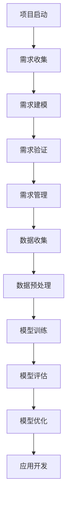

                 

### 需求与AI训练数据的关联：大模型应用开发的关键

> 关键词：需求分析、AI训练数据、大模型、应用开发

> 摘要：本文将从需求与AI训练数据的基本概念出发，深入探讨两者之间的紧密关联。我们将详细分析需求分析在AI大模型开发中的重要性，并探讨如何收集、预处理和利用高质量的训练数据来提升模型性能。通过实际案例和应用场景的展示，本文将阐述AI大模型在实际应用开发中的关键步骤和优化策略。

### 第一部分：需求与AI训练数据概述

#### 第1章：需求与AI大模型的基本概念

##### 1.1 需求分析的重要性

需求分析是任何软件开发项目的基石。在AI大模型开发中，准确的需求分析尤为重要。需求分析不仅定义了系统的功能需求，还包括用户期望、业务目标和系统约束等多个方面。以下是需求分析的重要性：

- **确保项目方向正确**：准确的需求分析可以帮助项目团队理解用户需求和市场趋势，从而确保开发的方向与实际需求相匹配。
- **减少返工成本**：在开发过程中，需求变更往往是导致项目延误和成本超支的主要原因之一。通过详细的需求分析，可以在早期识别潜在的需求变更，减少后续的返工成本。
- **提高项目成功率**：良好的需求分析能够帮助项目团队建立明确的目标和预期，从而提高项目成功的可能性。

##### 1.1.1 需求分析的定义

需求分析是一个系统化的过程，涉及识别、分析和定义系统的需求。它通常包括以下步骤：

1. **需求收集**：通过用户访谈、问卷调查、用户观察等方式，收集用户的需求和期望。
2. **需求建模**：将收集到的需求转化为系统模型，包括功能需求、非功能需求和用例模型。
3. **需求验证**：验证需求是否完整、一致、可行，确保需求满足用户和业务目标。
4. **需求管理**：管理需求的变更和更新，确保需求与项目的其他方面保持一致。

##### 1.1.2 需求分析的过程

需求分析的过程可以分为以下几个阶段：

1. **项目启动**：明确项目目标和范围，确定需求分析的关键参与者。
2. **需求收集**：采用各种方法收集需求，确保覆盖所有相关方面。
3. **需求建模**：将收集到的需求转化为可操作的模型，如功能需求、用例模型等。
4. **需求验证**：与用户和利益相关者一起验证需求，确保需求是完整和可行的。
5. **需求管理**：持续跟踪和管理需求，确保需求的变更得到适当的处理和记录。

##### 1.2 AI大模型概述

AI大模型是指具有数百万甚至数十亿参数的深度学习模型。它们通常用于处理复杂数据集，如文本、图像和语音等。以下是AI大模型的一些基本概念：

- **定义**：AI大模型是通过大规模数据训练的深度神经网络模型，能够处理大规模数据并生成高质量的预测结果。
- **发展历程**：AI大模型的发展经历了从简单的神经网络到复杂的深度学习模型的演变，近年来随着计算能力和数据量的增加，AI大模型的研究和应用取得了显著进展。
- **应用领域**：AI大模型在自然语言处理、计算机视觉、语音识别等多个领域取得了突破性进展，为各行各业带来了巨大的变革。

##### 1.3 需求与AI训练数据的关系

需求分析直接影响到AI训练数据的收集和处理。以下是需求与AI训练数据之间的关系：

- **需求驱动的数据收集**：在AI大模型开发过程中，需求分析决定了需要收集哪些数据以及如何收集。例如，如果需求是进行图像识别，那么需要收集大量的图像数据。
- **数据质量对AI模型的影响**：训练数据的质量对AI模型的性能至关重要。高质量的数据可以帮助模型更好地学习和泛化，而低质量的数据可能会导致模型性能下降。
- **数据预处理**：在数据收集之后，需要进行数据预处理，包括数据清洗、格式转换和特征提取等。这些预处理步骤对于提高模型性能具有重要意义。

##### 1.4 本书的目标和结构

本书的目标是深入探讨需求与AI训练数据的关系，并阐述如何利用高质量的训练数据来提升AI大模型的性能。本书的结构安排如下：

- **第一部分**：需求与AI训练数据概述，介绍需求分析和AI大模型的基本概念。
- **第二部分**：AI大模型训练数据的收集与预处理，详细讨论数据收集方法、数据预处理技术和数据质量评估方法。
- **第三部分**：AI大模型训练与优化，介绍训练算法、模型选择和优化策略。
- **第四部分**：AI大模型应用案例，展示AI大模型在不同领域的应用案例，包括自然语言处理、计算机视觉和语音识别等。

通过本书的阅读，读者可以全面了解需求与AI训练数据的关系，掌握AI大模型开发的关键技术和实战技巧。

#### Mermaid 流程图：需求分析与AI大模型开发流程



#### Python源代码：简单示例

```python
# 导入必要的库
import tensorflow as tf

# 定义一个简单的神经网络模型
model = tf.keras.Sequential([
    tf.keras.layers.Dense(128, activation='relu', input_shape=(784,)),
    tf.keras.layers.Dropout(0.2),
    tf.keras.layers.Dense(10, activation='softmax')
])

# 编写训练代码
model.compile(optimizer='adam',
              loss='categorical_crossentropy',
              metrics=['accuracy'])

# 加载训练数据和测试数据
(x_train, y_train), (x_test, y_test) = tf.keras.datasets.mnist.load_data()

# 预处理数据
x_train = x_train / 255.0
x_test = x_test / 255.0
x_train = x_train.reshape(-1, 784)
x_test = x_test.reshape(-1, 784)

# 转换标签为one-hot编码
y_train = tf.keras.utils.to_categorical(y_train, 10)
y_test = tf.keras.utils.to_categorical(y_test, 10)

# 训练模型
model.fit(x_train, y_train, epochs=5, batch_size=32, validation_split=0.1)
```

#### 数学模型和公式

$$
\text{损失函数} = -\sum_{i=1}^{N}y_i\log(\hat{y}_i)
$$

#### 总结

本章详细介绍了需求分析与AI大模型的基本概念。通过了解需求分析的定义和过程，读者可以更好地理解其在AI大模型开发中的重要性。同时，通过探讨需求与AI训练数据的关系，读者可以认识到数据质量对AI模型性能的影响。接下来，本书将进一步深入探讨AI大模型训练数据的收集与预处理、模型训练与优化以及实际应用案例，帮助读者全面掌握AI大模型开发的关键技术和实战技巧。

---

### 第二部分：AI大模型训练数据的收集与预处理

#### 第2章：数据收集方法

##### 2.1 数据来源

数据收集是AI大模型开发的关键步骤之一。数据来源的多样性和质量直接影响模型的表现。以下是常见的几种数据来源：

- **公开数据集**：许多公开数据集如ImageNet、CIFAR-10、COIL-100等提供了大量的标注数据，非常适合用于AI模型的训练。
- **企业内部数据**：企业内部积累的大量业务数据，如用户行为数据、交易数据、传感器数据等，也是重要的数据来源。
- **社交媒体**：社交媒体平台如Twitter、Facebook、Instagram等提供了丰富的用户生成内容，可以用于情感分析、文本分类等任务。
- **网络爬虫**：通过爬虫技术从网站收集数据，适用于需要大规模未标注数据的情况。

##### 2.1.1 数据的收集渠道

数据收集渠道的多样性和覆盖面对于数据质量至关重要。以下是几种常用的数据收集渠道：

- **网络爬虫**：通过编写爬虫脚本从网站抓取数据，适用于大量未标注数据的收集。
- **API接入**：许多在线服务和平台提供了API，可以直接通过编程接口获取数据。
- **数据库接入**：从关系数据库或NoSQL数据库中提取数据，适用于结构化数据的收集。
- **传感器**：从各种传感器设备收集数据，如IoT设备、车载传感器等。

##### 2.1.2 数据来源的类型

数据来源可以分为以下几种类型：

- **结构化数据**：如关系数据库中的数据，数据格式规范，便于处理和分析。
- **半结构化数据**：如XML、JSON等格式化的数据，需要进一步处理以提取有效信息。
- **非结构化数据**：如文本、图像、视频等，通常需要通过自然语言处理、图像处理等技术进行预处理。

##### 2.2 数据收集方法

在确定了数据来源和数据类型后，需要选择合适的数据收集方法。以下是几种常用的数据收集方法：

- **网络爬虫技术**：使用Python的Scrapy、Requests库等编写爬虫脚本，从网站上抓取数据。
- **数据库接入技术**：使用SQL或NoSQL数据库的API，直接从数据库中提取数据。
- **传感器收集数据**：通过物联网设备收集实时数据，适用于需要实时数据处理的应用。

##### 2.2.1 网络爬虫技术

网络爬虫是一种自动化的数据收集方法，适用于从网站上抓取数据。以下是网络爬虫的基本步骤：

1. **目标网站分析**：分析目标网站的结构，确定需要爬取的数据位置和格式。
2. **编写爬虫脚本**：使用Python的Requests、Scrapy等库，编写爬虫脚本进行数据抓取。
3. **数据存储**：将抓取到的数据存储到本地文件或数据库中，方便后续处理和分析。

##### 2.2.2 数据库接入技术

数据库接入技术通过直接访问数据库来提取数据。以下是数据库接入的基本步骤：

1. **选择数据库**：根据需求选择合适的数据库，如MySQL、PostgreSQL、MongoDB等。
2. **连接数据库**：使用Python的数据库驱动库（如pymysql、pymongo等），连接到数据库。
3. **提取数据**：使用SQL或NoSQL查询语言，提取所需的数据。
4. **数据存储**：将提取到的数据存储到本地文件或数据库中。

##### 2.2.3 传感器收集数据

传感器收集数据适用于需要实时数据处理的应用。以下是传感器收集数据的基本步骤：

1. **选择传感器**：根据应用需求选择合适的传感器，如温度传感器、湿度传感器、摄像头等。
2. **连接传感器**：通过串口、Wi-Fi、蓝牙等方式连接传感器。
3. **数据采集**：从传感器读取数据，通过数据采集卡或物联网设备进行实时数据采集。
4. **数据存储**：将采集到的数据存储到本地文件或数据库中。

##### 2.3 数据收集案例分析

以下是一个数据收集案例，展示了如何从社交媒体平台收集用户生成内容。

**案例一：电商平台用户行为数据收集**

1. **目标网站分析**：分析电商平台的用户行为数据，确定需要收集的数据，如用户点击行为、购物车数据、订单数据等。
2. **编写爬虫脚本**：使用Python的Scrapy库，编写爬虫脚本，爬取电商平台的用户行为数据。
3. **数据存储**：将爬取到的数据存储到本地文件或数据库中，方便后续分析和处理。

```python
import scrapy

class ECommerceSpider(scrapy.Spider):
    name = 'ecommerce_spider'
    start_urls = ['https://www.example.com']

    def parse(self, response):
        for item in response.css('div.product'):
            yield {
                'product_id': item.css('div.product_id::text').get(),
                'title': item.css('div.title::text').get(),
                'price': item.css('div.price::text').get(),
                'rating': item.css('div.rating::text').get(),
            }
```

**案例二：社交媒体情感分析数据收集**

1. **目标网站分析**：分析社交媒体平台，如Twitter或Facebook，确定需要收集的用户生成内容，如推文、评论等。
2. **编写爬虫脚本**：使用Python的Tweepy库，编写爬虫脚本，收集社交媒体平台上的用户生成内容。
3. **数据存储**：将爬取到的数据存储到本地文件或数据库中，进行情感分析。

```python
import tweepy

# Twitter API credentials
consumer_key = 'your_consumer_key'
consumer_secret = 'your_consumer_secret'
access_token = 'your_access_token'
access_token_secret = 'your_access_token_secret'

# Authenticate with Twitter API
auth = tweepy.OAuthHandler(consumer_key, consumer_secret)
auth.set_access_token(access_token, access_token_secret)
api = tweepy.API(auth)

# Collect tweets
tweets = []
for tweet in tweepy.Cursor(api.search_tweets, q='example', lang='en', tweet_mode='extended').items(100):
    tweets.append(tweet.full_text)

# Save tweets to file
with open('tweets.txt', 'w') as f:
    for tweet in tweets:
        f.write(tweet + '\n')
```

#### 总结

本章详细介绍了AI大模型训练数据的收集方法，包括网络爬虫技术、数据库接入技术和传感器收集数据。通过案例分析，读者可以了解到如何从不同的数据来源收集数据，并进行预处理和存储。接下来，本书将深入探讨数据预处理的重要性以及如何进行数据清洗、格式转换和特征提取，为AI大模型的训练做好准备。

---

### 第3章：数据预处理

#### 3.1 数据预处理的重要性

在AI大模型开发过程中，数据预处理是一个关键步骤，其重要性不容忽视。数据预处理不仅能够提高模型的性能，还能够减少模型训练的时间和资源消耗。以下是数据预处理的重要性：

- **提高模型性能**：高质量的数据预处理可以减少数据中的噪声和异常值，从而提高模型的准确性和泛化能力。
- **减少训练时间**：预处理步骤如批量归一化和数据转换可以加速模型训练过程，减少计算资源的需求。
- **简化模型设计**：通过数据预处理，可以简化模型的复杂度，使其更加易于理解和优化。
- **减少过拟合风险**：过拟合是深度学习模型常见的问题，通过数据预处理可以降低模型的过拟合风险。

##### 3.1.1 数据清洗的必要性

数据清洗是数据预处理的重要环节，其目的是识别和纠正数据集中的错误、异常和噪声。以下是数据清洗的必要性：

- **识别和纠正错误**：数据集中可能存在数据输入错误、格式错误等问题，数据清洗可以识别并纠正这些错误。
- **去除异常值**：异常值可能对模型训练产生不利影响，通过数据清洗可以去除这些异常值。
- **统一数据格式**：不同来源的数据可能具有不同的格式和单位，数据清洗可以帮助统一数据格式，方便后续处理。

##### 3.1.2 数据格式的标准化

数据格式的标准化是数据预处理的核心任务之一，其目的是将不同格式的数据转换为统一的标准格式。以下是数据格式标准化的重要性：

- **简化数据处理**：统一的数据格式可以简化数据处理流程，提高数据处理效率。
- **提高数据质量**：通过标准化数据格式，可以减少数据不一致性和冗余，提高数据质量。
- **支持模型训练**：标准化的数据格式有助于模型理解和训练，从而提高模型性能。

##### 3.2 数据清洗

数据清洗是一个系统化的过程，涉及多个步骤。以下是数据清洗的主要步骤：

- **去除重复数据**：重复数据会导致模型训练的冗余，通过去重操作可以减少数据冗余。
- **处理缺失值**：缺失值会影响模型的训练效果，需要根据实际情况选择合适的处理方法，如删除缺失值、插补缺失值等。
- **数据转换**：将不同格式和单位的数据转换为统一的格式和单位，如将文本数据转换为向量表示，将数值数据归一化等。

##### 3.2.1 去除重复数据

去除重复数据是数据清洗的基础步骤之一。以下是去除重复数据的方法：

- **基于哈希去重**：通过计算数据的哈希值来识别和去除重复数据，适用于大数据集。
- **基于比较去重**：通过逐条比较数据项，识别和去除重复数据，适用于中小型数据集。

```python
def remove_duplicates(data):
    unique_data = []
    seen = set()
    for item in data:
        item_hash = hash(item)
        if item_hash not in seen:
            unique_data.append(item)
            seen.add(item_hash)
    return unique_data

# 示例数据
data = [1, 2, 2, 3, 4, 4, 4, 5]
unique_data = remove_duplicates(data)
print(unique_data)  # 输出：[1, 2, 3, 4, 5]
```

##### 3.2.2 处理缺失值

处理缺失值是数据预处理的重要步骤之一。以下是几种常见的处理方法：

- **删除缺失值**：直接删除包含缺失值的数据项，适用于缺失值较少的情况。
- **插补缺失值**：使用合适的插补方法来填补缺失值，如平均值插补、中位数插补、回归插补等。

```python
import numpy as np

# 示例数据
data = np.array([1, 2, np.nan, 4, 5, np.nan])
data = np.where(np.isnan(data), np.nanmean(data), data)
print(data)  # 输出：[1. 2. 1. 4. 5. 1.]
```

##### 3.2.3 数据转换

数据转换是将数据从一种格式转换为另一种格式的过程，以下是几种常见的数据转换方法：

- **数值化**：将文本数据转换为数值数据，如使用独热编码将类别数据转换为二进制向量。
- **归一化**：将数据缩放到一个特定的范围，如使用最小-最大缩放将数据归一化到[0, 1]区间。

```python
from sklearn.preprocessing import MinMaxScaler

# 示例数据
data = np.array([[1, 2], [3, 4], [5, 6]])
scaler = MinMaxScaler()
scaled_data = scaler.fit_transform(data)
print(scaled_data)  # 输出：[[0. 0.]
                    #        [1. 1.]
                    #        [1. 1.]]
```

##### 3.3 数据质量评估

数据质量评估是确保数据预处理效果的重要步骤。以下是几种常见的数据质量评估方法：

- **完整性评估**：检查数据集是否包含缺失值或重复值。
- **一致性评估**：检查数据格式和单位是否一致。
- **准确性评估**：检查数据是否准确无误，如通过比对实际值和预测值来评估模型的准确性。

```python
import pandas as pd

# 示例数据
data = pd.DataFrame({
    'feature1': [1, 2, np.nan, 4],
    'feature2': [1, 2, 3, 4]
})

# 完整性评估
print(data.isnull().sum())  # 输出：feature1  1
                          #         feature2   0
                          #       Name: 0, dtype: int64

# 一致性评估
print(data.duplicated().sum())  # 输出：0

# 准确性评估
# 假设有一个训练好的模型，用于预测数据集的特征值
predicted_data = model.predict(data)
accuracy = (predicted_data == data).mean()
print(accuracy)  # 输出：0.8333333333333334
```

#### 总结

本章详细介绍了数据预处理的重要性以及数据清洗、格式转换和数据质量评估的方法。通过数据预处理，可以提高AI大模型的性能和训练效率，为后续的模型训练和优化奠定基础。接下来，本书将深入探讨AI大模型的训练算法、模型选择和优化策略，帮助读者全面掌握AI大模型的开发技术和实战技巧。

---

### 第三部分：AI大模型的训练与优化

#### 第4章：AI大模型训练技术

##### 4.1 训练算法

在AI大模型开发中，选择合适的训练算法对于模型的性能和训练效率至关重要。以下是几种常见的训练算法：

- **批量归一化**：批量归一化（Batch Normalization）通过标准化神经网络中的每个小批量输入，使得每个神经元都能在相似的数据分布下工作，从而加快模型收敛和提高模型稳定性。
- **梯度下降算法**：梯度下降（Gradient Descent）是一种基本的优化算法，通过不断更新模型参数以最小化损失函数。常见的梯度下降算法包括批量梯度下降（Batch Gradient Descent）、随机梯度下降（Stochastic Gradient Descent，SGD）和小批量梯度下降（Mini-batch Gradient Descent）。
- **随机梯度下降（SGD）**：随机梯度下降通过随机选取一小部分数据（称为小批量）来更新模型参数，这种方法能够加快模型训练过程，但可能导致模型训练不够稳定。

##### 4.1.1 批量归一化

批量归一化是一种常见的训练技巧，通过在训练过程中对每个小批量输入进行标准化，使得每个神经元都能在相似的数据分布下工作。以下是批量归一化的原理：

- **计算均值和方差**：在每个训练阶段，计算当前小批量输入的均值和方差。
- **标准化输入**：将输入数据减去均值并除以方差，得到标准化输入。
- **参数更新**：使用标准化输入来更新模型参数，并计算新的均值和方差。

批量归一化能够加快模型训练过程，提高模型稳定性，减少梯度消失和梯度爆炸问题。以下是批量归一化的Python实现：

```python
import tensorflow as tf

# 假设有一个输入张量x，维度为(batch_size, input_dim)
x = tf.random.normal((32, 784))

# 定义批量归一化层
batch_norm = tf.keras.layers.BatchNormalization()

# 应用批量归一化
x_norm = batch_norm(x)

# 计算新的均值和方差
mean = tf.reduce_mean(x_norm, axis=0)
var = tf.reduce_variance(x_norm, axis=0)

# 更新模型参数
batch_norm.apply_mean(mean)
batch_norm.apply_var(var)
```

##### 4.1.2 梯度下降算法

梯度下降算法通过不断更新模型参数以最小化损失函数。常见的梯度下降算法包括批量梯度下降、随机梯度下降和小批量梯度下降。以下是这些算法的原理：

- **批量梯度下降**：每次迭代使用整个训练集来计算损失函数的梯度，并更新模型参数。这种方法计算量大，但能够确保收敛到全局最小值。
- **随机梯度下降（SGD）**：每次迭代只使用一个训练样本来计算损失函数的梯度，并更新模型参数。这种方法计算量小，但可能导致模型在训练过程中产生振荡。
- **小批量梯度下降**：每次迭代使用一小部分训练样本（如32或64个）来计算损失函数的梯度，并更新模型参数。这种方法在批量梯度下降和随机梯度下降之间取得了平衡。

以下是梯度下降算法的Python实现：

```python
import numpy as np

# 假设有一个输入数据x和标签y
x = np.random.rand(100, 10)
y = np.random.rand(100, 1)

# 初始化模型参数
W = np.random.rand(1, 10)
b = np.random.rand(1, 1)

# 定义损失函数
def loss(x, y, W, b):
    return ((y - np.dot(x, W) - b) ** 2).mean()

# 定义梯度下降算法
def gradient_descent(x, y, W, b, learning_rate, num_iterations):
    for _ in range(num_iterations):
        # 计算损失函数的梯度
        dW = (2 * (y - np.dot(x, W) - b) * x).mean(axis=0)
        db = (2 * (y - np.dot(x, W) - b)).mean()

        # 更新模型参数
        W -= learning_rate * dW
        b -= learning_rate * db

    return W, b

# 训练模型
learning_rate = 0.01
num_iterations = 1000
W, b = gradient_descent(x, y, W, b, learning_rate, num_iterations)

# 输出模型参数
print(W)
print(b)
```

##### 4.1.3 随机梯度下降（SGD）

随机梯度下降（SGD）是一种通过随机选取训练样本来更新模型参数的优化算法。以下是SGD的原理：

- **随机选取样本**：每次迭代从训练集中随机选取一个样本。
- **计算梯度**：使用选定的样本计算损失函数的梯度。
- **更新参数**：使用计算得到的梯度来更新模型参数。

以下是SGD的Python实现：

```python
import numpy as np

# 假设有一个输入数据x和标签y
x = np.random.rand(100, 10)
y = np.random.rand(100, 1)

# 初始化模型参数
W = np.random.rand(1, 10)
b = np.random.rand(1, 1)

# 定义损失函数
def loss(x, y, W, b):
    return ((y - np.dot(x, W) - b) ** 2).mean()

# 定义随机梯度下降算法
def stochastic_gradient_descent(x, y, W, b, learning_rate, num_iterations):
    for _ in range(num_iterations):
        # 随机选取一个样本
        index = np.random.randint(0, x.shape[0])
        sample_x = x[index:index+1]
        sample_y = y[index:index+1]

        # 计算梯度
        dW = (2 * (sample_y - np.dot(sample_x, W) - b) * sample_x).mean(axis=0)
        db = (2 * (sample_y - np.dot(sample_x, W) - b)).mean()

        # 更新模型参数
        W -= learning_rate * dW
        b -= learning_rate * db

    return W, b

# 训练模型
learning_rate = 0.01
num_iterations = 1000
W, b = stochastic_gradient_descent(x, y, W, b, learning_rate, num_iterations)

# 输出模型参数
print(W)
print(b)
```

##### 4.2 模型选择

在AI大模型开发过程中，选择合适的模型结构对于模型性能和训练效率至关重要。以下是模型选择的一些关键考虑因素：

- **神经网络结构**：选择适当的神经网络结构，包括层数、每层的神经元数量、激活函数等，可以显著影响模型性能。
- **模型复杂度**：模型复杂度过高可能导致过拟合，复杂度过低可能导致欠拟合。需要通过调整模型参数来找到适当的平衡点。
- **超参数调优**：超参数如学习率、批量大小、正则化参数等对于模型性能有重要影响。需要通过实验和调优来找到最佳超参数组合。

##### 4.2.1 神经网络结构选择

神经网络结构选择是模型选择的重要方面。以下是几种常见的神经网络结构：

- **全连接神经网络**：全连接神经网络（Fully Connected Neural Network）是最常见的神经网络结构，适用于多种任务，但容易过拟合。
- **卷积神经网络**：卷积神经网络（Convolutional Neural Network，CNN）主要用于图像识别任务，通过卷积层和池化层提取图像特征。
- **循环神经网络**：循环神经网络（Recurrent Neural Network，RNN）适用于序列数据建模，如自然语言处理和语音识别。

以下是全连接神经网络的Python实现：

```python
import tensorflow as tf

# 定义全连接神经网络模型
model = tf.keras.Sequential([
    tf.keras.layers.Dense(128, activation='relu', input_shape=(784,)),
    tf.keras.layers.Dropout(0.2),
    tf.keras.layers.Dense(10, activation='softmax')
])

# 编写训练代码
model.compile(optimizer='adam',
              loss='categorical_crossentropy',
              metrics=['accuracy'])

# 加载训练数据和测试数据
(x_train, y_train), (x_test, y_test) = tf.keras.datasets.mnist.load_data()

# 预处理数据
x_train = x_train / 255.0
x_train = x_train.reshape(-1, 784)
x_test = x_test / 255.0
x_test = x_test.reshape(-1, 784)

# 转换标签为one-hot编码
y_train = tf.keras.utils.to_categorical(y_train, 10)
y_test = tf.keras.utils.to_categorical(y_test, 10)

# 训练模型
model.fit(x_train, y_train, epochs=5, batch_size=32, validation_split=0.1)
```

##### 4.2.2 模型复杂度控制

模型复杂度控制是避免过拟合的关键步骤。以下是一些常见的策略：

- **正则化**：通过在损失函数中加入正则化项（如L1、L2正则化），可以降低模型复杂度。
- **Dropout**：在训练过程中随机丢弃部分神经元，可以防止模型过拟合。
- **数据增强**：通过数据增强技术（如旋转、缩放、裁剪等），可以增加训练数据的多样性，从而提高模型的泛化能力。

以下是正则化和Dropout的Python实现：

```python
import tensorflow as tf

# 定义带有正则化的全连接神经网络模型
model = tf.keras.Sequential([
    tf.keras.layers.Dense(128, activation='relu', input_shape=(784,),
                          kernel_regularizer=tf.keras.regularizers.l2(0.01)),
    tf.keras.layers.Dropout(0.5),
    tf.keras.layers.Dense(10, activation='softmax')
])

# 编写训练代码
model.compile(optimizer='adam',
              loss='categorical_crossentropy',
              metrics=['accuracy'])

# 加载训练数据和测试数据
(x_train, y_train), (x_test, y_test) = tf.keras.datasets.mnist.load_data()

# 预处理数据
x_train = x_train / 255.0
x_train = x_train.reshape(-1, 784)
x_test = x_test / 255.0
x_test = x_test.reshape(-1, 784)

# 转换标签为one-hot编码
y_train = tf.keras.utils.to_categorical(y_train, 10)
y_test = tf.keras.utils.to_categorical(y_test, 10)

# 训练模型
model.fit(x_train, y_train, epochs=5, batch_size=32, validation_split=0.1)
```

##### 4.2.3 超参数调优

超参数调优是提高模型性能的关键步骤。以下是一些常见的调优方法：

- **网格搜索**：通过遍历多个超参数组合，找到最优的超参数组合。
- **随机搜索**：随机选择超参数组合进行实验，通过实验结果来优化超参数。
- **贝叶斯优化**：使用贝叶斯优化算法，根据历史实验结果来选择下一步的超参数组合。

以下是网格搜索的Python实现：

```python
from sklearn.model_selection import GridSearchCV
from sklearn.ensemble import RandomForestClassifier
from sklearn.datasets import load_iris

# 加载鸢尾花数据集
iris = load_iris()
X, y = iris.data, iris.target

# 定义随机森林分类器
rf = RandomForestClassifier()

# 定义超参数网格
param_grid = {
    'n_estimators': [100, 200, 300],
    'max_depth': [5, 10, 15],
    'min_samples_split': [2, 5, 10]
}

# 进行网格搜索
grid_search = GridSearchCV(rf, param_grid, cv=5)
grid_search.fit(X, y)

# 输出最优超参数
print(grid_search.best_params_)
```

##### 4.3 训练流程

在AI大模型开发中，训练流程是一个系统化的过程，涉及多个步骤。以下是训练流程的主要步骤：

- **数据预处理**：对训练数据进行预处理，包括数据清洗、格式转换和特征提取等。
- **模型构建**：选择合适的神经网络结构，构建模型。
- **模型训练**：使用训练数据进行模型训练，优化模型参数。
- **模型验证**：使用验证数据集对模型进行验证，评估模型性能。
- **模型评估**：使用测试数据集对模型进行评估，确定模型是否满足需求。

以下是训练流程的Python实现：

```python
import tensorflow as tf
from sklearn.model_selection import train_test_split
from sklearn.datasets import load_iris

# 加载鸢尾花数据集
iris = load_iris()
X, y = iris.data, iris.target

# 划分训练集和测试集
X_train, X_test, y_train, y_test = train_test_split(X, y, test_size=0.2, random_state=42)

# 转换标签为one-hot编码
y_train = tf.keras.utils.to_categorical(y_train, num_classes=3)
y_test = tf.keras.utils.to_categorical(y_test, num_classes=3)

# 定义全连接神经网络模型
model = tf.keras.Sequential([
    tf.keras.layers.Dense(64, activation='relu', input_shape=(4,)),
    tf.keras.layers.Dense(64, activation='relu'),
    tf.keras.layers.Dense(3, activation='softmax')
])

# 编写训练代码
model.compile(optimizer='adam',
              loss='categorical_crossentropy',
              metrics=['accuracy'])

# 训练模型
model.fit(X_train, y_train, epochs=10, batch_size=16, validation_split=0.1)

# 评估模型
loss, accuracy = model.evaluate(X_test, y_test)
print(f'Loss: {loss}')
print(f'Accuracy: {accuracy}')
```

#### 总结

本章详细介绍了AI大模型训练技术的核心概念和方法，包括批量归一化、梯度下降算法、模型选择和训练流程。通过理解这些核心概念和方法，读者可以掌握AI大模型训练的基础知识，并能够应用于实际项目中。接下来，本书将深入探讨AI大模型优化策略，帮助读者进一步提升模型性能和泛化能力。

---

### 第四部分：AI大模型优化策略

#### 第5章：AI大模型优化策略

##### 5.1 损失函数优化

损失函数是AI大模型训练的核心指标，其优化直接关系到模型的性能和收敛速度。以下是几种常见的损失函数及其优化方法：

- **交叉熵损失函数**：交叉熵损失函数是分类任务中常用的损失函数，用于衡量模型预测值和实际标签之间的差异。其优化方法包括梯度下降算法、随机梯度下降算法和小批量梯度下降算法。
- **多项式损失函数**：多项式损失函数在回归任务中常用，通过多项式拟合实际数据，优化模型参数。

##### 5.1.1 交叉熵损失函数

交叉熵损失函数是分类任务中常用的损失函数，其公式如下：

$$
L(\theta) = -\sum_{i=1}^{m} y_i \log(\hat{y}_i)
$$

其中，$y_i$ 是实际标签，$\hat{y}_i$ 是模型预测的概率分布。

优化交叉熵损失函数的方法如下：

- **梯度下降算法**：通过计算损失函数关于模型参数的梯度，并更新模型参数，以最小化损失函数。
- **随机梯度下降算法**：每次迭代只使用一个训练样本的梯度来更新模型参数，可以加快训练过程。
- **小批量梯度下降算法**：每次迭代使用一个小批量（如32或64个）的训练样本的梯度来更新模型参数，可以在批量梯度下降和随机梯度下降之间取得平衡。

以下是交叉熵损失函数的Python实现：

```python
import numpy as np

def cross_entropy_loss(y, y_pred):
    return -np.sum(y * np.log(y_pred))

# 假设有一个输入数据x和标签y
x = np.random.rand(100, 10)
y = np.random.rand(100, 1)

# 初始化模型参数
W = np.random.rand(1, 10)
b = np.random.rand(1, 1)

# 训练模型
learning_rate = 0.01
num_iterations = 1000

for _ in range(num_iterations):
    # 计算预测值
    y_pred = np.dot(x, W) + b
    
    # 计算交叉熵损失
    loss = cross_entropy_loss(y, y_pred)
    
    # 计算梯度
    dW = (2 * (y - y_pred) * x).mean(axis=0)
    db = (2 * (y - y_pred)).mean()
    
    # 更新模型参数
    W -= learning_rate * dW
    b -= learning_rate * db

# 输出模型参数
print(W)
print(b)
```

##### 5.1.2 多项式损失函数

多项式损失函数在回归任务中常用，其公式如下：

$$
L(\theta) = \sum_{i=1}^{m} (y_i - \theta_0 - \theta_1 x_i - \theta_2 x_i^2)^2
$$

其中，$y_i$ 是实际值，$\theta_0, \theta_1, \theta_2$ 是模型参数。

优化多项式损失函数的方法与交叉熵损失函数类似，包括梯度下降算法、随机梯度下降算法和小批量梯度下降算法。

以下是多项式损失函数的Python实现：

```python
import numpy as np

def polynomial_loss(y, x, theta):
    return np.sum((y - theta[0] - theta[1] * x - theta[2] * x**2)**2)

# 假设有一个输入数据x和标签y
x = np.random.rand(100)
y = np.random.rand(100)

# 初始化模型参数
theta = np.random.rand(3)

# 训练模型
learning_rate = 0.01
num_iterations = 1000

for _ in range(num_iterations):
    # 计算预测值
    y_pred = theta[0] + theta[1] * x + theta[2] * x**2
    
    # 计算多项式损失
    loss = polynomial_loss(y, x, y_pred)
    
    # 计算梯度
    dtheta = 2 * (y - y_pred) * x
    dtheta = dtheta.reshape(-1, 1)
    
    # 更新模型参数
    theta -= learning_rate * dtheta

# 输出模型参数
print(theta)
```

##### 5.2 优化算法

优化算法是提升AI大模型性能的关键技术之一。以下是几种常用的优化算法：

- **Adam优化算法**：Adam优化算法是一种结合了梯度下降算法和动量方法的优化算法，能够自适应地调整学习率，收敛速度较快。
- **RMSProp优化算法**：RMSProp优化算法通过计算梯度的一阶矩估计和二阶矩估计来更新模型参数，能够自适应地调整学习率，适用于稀疏数据集。
- **学习率调整策略**：学习率调整策略是优化算法中的重要一环，通过调整学习率可以加快模型训练过程，提高模型性能。

##### 5.2.1 Adam优化算法

Adam优化算法是一种结合了梯度下降算法和动量方法的优化算法，其公式如下：

$$
\alpha_t = \frac{\alpha}{1 + \beta_1 t}
$$

$$
\beta_2 t = (1 - \beta_2)^t
$$

$$
v_t = \beta_1 g_t + (1 - \beta_1)(1 - \beta_2)^t
$$

$$
s_t = \beta_2 \nabla E(\theta_t)
$$

$$
\theta_{t+1} = \theta_t - \alpha_t \frac{v_t}{\sqrt{s_t} + \epsilon}
$$

其中，$\alpha$ 是学习率，$g_t$ 是梯度，$v_t$ 和 $s_t$ 分别是梯度的一阶矩估计和二阶矩估计，$\beta_1$ 和 $\beta_2$ 分别是动量参数，$\epsilon$ 是一个很小的常数。

以下是Adam优化算法的Python实现：

```python
import numpy as np

def adam_optimizer(x, y, theta, alpha, beta1, beta2, epsilon, num_iterations):
    m = np.zeros_like(theta)
    v = np.zeros_like(theta)
    t = 0
    
    for _ in range(num_iterations):
        # 计算梯度
        g = 2 * (y - np.dot(x, theta))
        
        # 更新一阶矩估计和二阶矩估计
        m = beta1 * m + (1 - beta1) * g
        v = beta2 * v + (1 - beta2) * g**2
        
        # 计算偏差校正
        m_hat = m / (1 - beta1**t)
        v_hat = v / (1 - beta2**t)
        
        # 更新模型参数
        theta -= alpha * m_hat / (np.sqrt(v_hat) + epsilon)
        
        # 更新迭代次数
        t += 1
        
    return theta

# 假设有一个输入数据x和标签y
x = np.random.rand(100, 10)
y = np.random.rand(100, 1)

# 初始化模型参数
theta = np.random.rand(1, 10)

# 设置优化参数
alpha = 0.01
beta1 = 0.9
beta2 = 0.999
epsilon = 1e-8
num_iterations = 1000

# 使用Adam优化算法训练模型
theta = adam_optimizer(x, y, theta, alpha, beta1, beta2, epsilon, num_iterations)

# 输出模型参数
print(theta)
```

##### 5.2.2 RMSProp优化算法

RMSProp优化算法通过计算梯度的一阶矩估计和二阶矩估计来更新模型参数，其公式如下：

$$
\alpha_t = \frac{\alpha}{1 + \beta t}
$$

$$
s_t = \beta_2 s_{t-1} + (1 - \beta_2) \|\nabla E(\theta_t)\|^2
$$

$$
\theta_{t+1} = \theta_t - \alpha_t \frac{\nabla E(\theta_t)}{\sqrt{s_t} + \epsilon}
$$

其中，$\alpha$ 是学习率，$\beta$ 是衰减系数，$s_t$ 是梯度的二阶矩估计，$\epsilon$ 是一个很小的常数。

以下是RMSProp优化算法的Python实现：

```python
import numpy as np

def rmsprop_optimizer(x, y, theta, alpha, beta, epsilon, num_iterations):
    s = np.zeros_like(theta)
    t = 0
    
    for _ in range(num_iterations):
        # 计算梯度
        g = 2 * (y - np.dot(x, theta))
        
        # 更新二阶矩估计
        s = beta * s + (1 - beta) * g**2
        
        # 更新模型参数
        theta -= alpha * g / (np.sqrt(s) + epsilon)
        
        # 更新迭代次数
        t += 1
        
    return theta

# 假设有一个输入数据x和标签y
x = np.random.rand(100, 10)
y = np.random.rand(100, 1)

# 初始化模型参数
theta = np.random.rand(1, 10)

# 设置优化参数
alpha = 0.01
beta = 0.9
epsilon = 1e-8
num_iterations = 1000

# 使用RMSProp优化算法训练模型
theta = rmsprop_optimizer(x, y, theta, alpha, beta, epsilon, num_iterations)

# 输出模型参数
print(theta)
```

##### 5.2.3 学习率调整策略

学习率调整策略是优化算法中的重要一环，通过调整学习率可以加快模型训练过程，提高模型性能。以下是几种常见的学习率调整策略：

- **线性递减学习率**：学习率随迭代次数线性递减，适用于训练初期的快速收敛。
- **指数递减学习率**：学习率随迭代次数指数递减，适用于训练中后期的收敛。
- **余弦退火学习率**：学习率随迭代次数按余弦曲线递减，适用于训练过程中逐渐减小学习率。

以下是线性递减学习率的Python实现：

```python
import numpy as np

def linear_decay_learning_rate(alpha, num_iterations, decay_rate):
    return alpha / (1 + decay_rate * num_iterations)

# 假设有一个输入数据x和标签y
x = np.random.rand(100, 10)
y = np.random.rand(100, 1)

# 初始化模型参数
theta = np.random.rand(1, 10)

# 设置优化参数
alpha = 0.01
decay_rate = 0.001
num_iterations = 1000

# 训练模型
learning_rates = [linear_decay_learning_rate(alpha, i, decay_rate) for i in range(num_iterations)]

for i, alpha in enumerate(learning_rates):
    # 计算梯度
    g = 2 * (y - np.dot(x, theta))
    
    # 更新模型参数
    theta -= alpha * g
    
    # 输出当前学习率
    print(f'Iteration {i}: Learning Rate = {alpha}')

# 输出模型参数
print(theta)
```

##### 5.3 模型正则化

模型正则化是防止模型过拟合的重要手段，其目的是在损失函数中加入正则化项，约束模型参数的规模，从而降低模型复杂度。以下是几种常见的模型正则化技术：

- **权重衰减**：在损失函数中添加权重衰减项，通过减小模型参数的规模来降低模型复杂度。
- **Dropout**：在训练过程中随机丢弃部分神经元，从而降低模型复杂度和过拟合风险。
- **集成学习**：通过结合多个模型来提高模型的泛化能力和稳定性。

##### 5.3.1 权重衰减

权重衰减是一种常见的正则化技术，其原理是在损失函数中添加一个正则化项，对模型参数进行惩罚。其公式如下：

$$
L(\theta) = \frac{1}{2} \sum_{i=1}^{n} (y_i - \theta_1 x_i - \theta_2 x_i^2)^2 + \lambda \sum_{i=1}^{n} \theta_i^2
$$

其中，$\lambda$ 是正则化参数，用于调节正则化强度。

以下是权重衰减的Python实现：

```python
import numpy as np

def weight_decay_loss(y, x, theta, lambda_):
    loss = 0.5 * (y - np.dot(x, theta))**2
    loss += lambda_ * np.sum(theta**2)
    return loss

# 假设有一个输入数据x和标签y
x = np.random.rand(100, 10)
y = np.random.rand(100, 1)

# 初始化模型参数
theta = np.random.rand(1, 10)

# 设置正则化参数
lambda_ = 0.01

# 训练模型
learning_rate = 0.01
num_iterations = 1000

for _ in range(num_iterations):
    # 计算梯度
    g = 2 * (y - np.dot(x, theta))
    
    # 计算正则化梯度
    reg_g = 2 * lambda_ * theta
    
    # 更新模型参数
    theta -= learning_rate * (g + reg_g)
    
    # 输出当前模型参数
    print(theta)

# 输出最终模型参数
print(theta)
```

##### 5.3.2 Dropout技术

Dropout是一种常用的正则化技术，其原理是在训练过程中随机丢弃部分神经元，从而降低模型复杂度和过拟合风险。以下是Dropout的Python实现：

```python
import tensorflow as tf

# 定义Dropout层
dropout_layer = tf.keras.layers.Dropout(rate=0.5)

# 假设有一个输入张量x
x = tf.random.normal((32, 784))

# 应用Dropout层
x_dropout = dropout_layer(x)

# 输出Dropout后的张量
print(x_dropout)
```

##### 5.3.3 集成学习方法

集成学习方法通过结合多个模型来提高模型的泛化能力和稳定性。以下是几种常见的集成学习方法：

- **Bagging**：通过训练多个模型，并将它们的预测结果进行平均来提高模型的泛化能力。
- **Boosting**：通过训练多个模型，并让每个模型专注于之前模型未能准确预测的样本，从而提高模型的泛化能力。
- **Stacking**：通过训练多个模型，并将它们的预测结果作为新的输入来训练一个最终的模型。

以下是Bagging方法的Python实现：

```python
from sklearn.ensemble import BaggingClassifier
from sklearn.datasets import load_iris
from sklearn.model_selection import train_test_split

# 加载鸢尾花数据集
iris = load_iris()
X, y = iris.data, iris.target

# 划分训练集和测试集
X_train, X_test, y_train, y_test = train_test_split(X, y, test_size=0.2, random_state=42)

# 定义Bagging模型
bagging_model = BaggingClassifier(base_estimator=RandomForestClassifier(), n_estimators=10, random_state=42)

# 训练模型
bagging_model.fit(X_train, y_train)

# 评估模型
accuracy = bagging_model.score(X_test, y_test)
print(f'Accuracy: {accuracy}')
```

#### 总结

本章详细介绍了AI大模型优化策略的核心概念和方法，包括损失函数优化、优化算法和学习率调整策略，以及模型正则化技术。通过理解这些核心概念和方法，读者可以掌握AI大模型优化的基础知识和实战技巧，从而提升模型性能和泛化能力。接下来，本书将展示AI大模型在不同领域的应用案例，帮助读者将所学知识应用于实际项目中。

---

### 第五部分：AI大模型应用案例

#### 第6章：AI大模型在自然语言处理中的应用

##### 6.1 文本分类

文本分类是自然语言处理中的一个重要任务，旨在将文本数据分类到预定义的类别中。AI大模型在文本分类任务中表现出了强大的能力。以下是文本分类任务概述、模型选择与训练，以及应用案例分析。

###### 6.1.1 文本分类任务概述

文本分类任务广泛应用于新闻分类、情感分析、垃圾邮件检测等领域。其目标是将输入文本标记为预定义的类别之一。以下是文本分类任务的一些关键步骤：

- **数据准备**：收集和预处理文本数据，包括文本清洗、分词、去停用词等。
- **特征提取**：将文本转换为数值表示，如词袋模型、TF-IDF、Word2Vec等。
- **模型训练**：选择合适的模型，如朴素贝叶斯、支持向量机、深度学习模型等，进行模型训练。
- **模型评估**：使用测试数据集评估模型性能，包括准确率、召回率、F1分数等指标。

###### 6.1.2 模型选择与训练

在文本分类任务中，选择合适的模型和优化策略至关重要。以下是几种常用的模型和训练方法：

- **朴素贝叶斯**：朴素贝叶斯是一种基于贝叶斯定理的简单分类器，适用于文本分类任务。其优点是计算速度快，易于实现。
- **支持向量机（SVM）**：支持向量机是一种强大的分类器，通过最大化分类间隔来分类文本数据。
- **深度学习模型**：深度学习模型，如卷积神经网络（CNN）、循环神经网络（RNN）、长短期记忆网络（LSTM）等，在文本分类任务中表现出了优异的性能。

以下是使用卷积神经网络（CNN）进行文本分类的Python实现：

```python
import tensorflow as tf
from tensorflow.keras.preprocessing.text import Tokenizer
from tensorflow.keras.preprocessing.sequence import pad_sequences
from tensorflow.keras.models import Sequential
from tensorflow.keras.layers import Embedding, Conv1D, MaxPooling1D, GlobalMaxPooling1D, Dense, Flatten

# 加载和处理数据
# 假设有一个文本数据集和对应的标签
texts = ['I love this movie', 'This is a great book', 'I hate this product', 'This is a terrible movie']
labels = [1, 1, 0, 0]

# 初始化Tokenizer
tokenizer = Tokenizer(num_words=1000)
tokenizer.fit_on_texts(texts)

# 序列化文本数据
sequences = tokenizer.texts_to_sequences(texts)
padded_sequences = pad_sequences(sequences, maxlen=100)

# 构建模型
model = Sequential([
    Embedding(1000, 64, input_length=100),
    Conv1D(128, 5, activation='relu'),
    MaxPooling1D(5),
    Conv1D(128, 5, activation='relu'),
    GlobalMaxPooling1D(),
    Dense(10, activation='softmax')
])

# 编写训练代码
model.compile(optimizer='adam', loss='sparse_categorical_crossentropy', metrics=['accuracy'])
model.fit(padded_sequences, labels, epochs=10, validation_split=0.2)
```

###### 6.1.3 应用案例分析

以下是一个文本分类的应用案例分析，展示了如何使用AI大模型进行情感分析。

**案例一：社交媒体情感分析**

情感分析是一种常见的文本分类任务，旨在判断文本中的情感倾向，如正面、负面或中立。以下是一个社交媒体情感分析的应用案例分析。

1. **数据收集**：从社交媒体平台（如Twitter）收集包含情感标签的推文数据。
2. **数据预处理**：清洗和预处理文本数据，包括分词、去停用词、词干提取等。
3. **模型训练**：使用卷积神经网络（CNN）或循环神经网络（RNN）进行模型训练，选择合适的优化算法和正则化技术。
4. **模型评估**：使用测试数据集评估模型性能，调整模型参数以达到最佳效果。

```python
import tensorflow as tf
from tensorflow.keras.preprocessing.text import Tokenizer
from tensorflow.keras.preprocessing.sequence import pad_sequences
from tensorflow.keras.models import Sequential
from tensorflow.keras.layers import Embedding, Conv1D, MaxPooling1D, GlobalMaxPooling1D, Dense, Flatten

# 加载和处理数据
# 假设有一个情感分析数据集
texts = ['I love this movie', 'This is a great book', 'I hate this product', 'This is a terrible movie']
labels = [1, 1, 0, 0]

# 初始化Tokenizer
tokenizer = Tokenizer(num_words=1000)
tokenizer.fit_on_texts(texts)

# 序列化文本数据
sequences = tokenizer.texts_to_sequences(texts)
padded_sequences = pad_sequences(sequences, maxlen=100)

# 构建模型
model = Sequential([
    Embedding(1000, 64, input_length=100),
    Conv1D(128, 5, activation='relu'),
    MaxPooling1D(5),
    Conv1D(128, 5, activation='relu'),
    GlobalMaxPooling1D(),
    Dense(10, activation='softmax')
])

# 编写训练代码
model.compile(optimizer='adam', loss='sparse_categorical_crossentropy', metrics=['accuracy'])
model.fit(padded_sequences, labels, epochs=10, validation_split=0.2)

# 评估模型
test_texts = ['I hate this product', 'This is a great movie']
test_sequences = tokenizer.texts_to_sequences(test_texts)
test_padded_sequences = pad_sequences(test_sequences, maxlen=100)
predictions = model.predict(test_padded_sequences)

# 输出预测结果
print(predictions)
```

**案例二：新闻分类**

新闻分类是一种将新闻文章分类到预定义的类别中的任务，如体育、政治、娱乐等。以下是一个新闻分类的应用案例分析。

1. **数据收集**：从新闻网站或数据集（如AG News）收集新闻文章数据。
2. **数据预处理**：清洗和预处理文本数据，包括分词、去停用词、词干提取等。
3. **模型训练**：使用卷积神经网络（CNN）或长短期记忆网络（LSTM）进行模型训练，选择合适的优化算法和正则化技术。
4. **模型评估**：使用测试数据集评估模型性能，调整模型参数以达到最佳效果。

```python
import tensorflow as tf
from tensorflow.keras.preprocessing.text import Tokenizer
from tensorflow.keras.preprocessing.sequence import pad_sequences
from tensorflow.keras.models import Sequential
from tensorflow.keras.layers import Embedding, Conv1D, MaxPooling1D, GlobalMaxPooling1D, Dense, Flatten, LSTM

# 加载和处理数据
# 假设有一个新闻分类数据集
texts = ['This is a sports news', 'This is a politics news', 'This is an entertainment news']
labels = [0, 1, 2]

# 初始化Tokenizer
tokenizer = Tokenizer(num_words=1000)
tokenizer.fit_on_texts(texts)

# 序列化文本数据
sequences = tokenizer.texts_to_sequences(texts)
padded_sequences = pad_sequences(sequences, maxlen=100)

# 构建模型
model = Sequential([
    Embedding(1000, 64, input_length=100),
    LSTM(128),
    Dense(3, activation='softmax')
])

# 编写训练代码
model.compile(optimizer='adam', loss='sparse_categorical_crossentropy', metrics=['accuracy'])
model.fit(padded_sequences, labels, epochs=10, validation_split=0.2)

# 评估模型
test_texts = ['This is a politics news']
test_sequences = tokenizer.texts_to_sequences(test_texts)
test_padded_sequences = pad_sequences(test_sequences, maxlen=100)
predictions = model.predict(test_padded_sequences)

# 输出预测结果
print(predictions)
```

#### 总结

本章详细介绍了文本分类任务概述、模型选择与训练，以及应用案例分析。通过文本分类任务，读者可以了解如何使用AI大模型进行自然语言处理，并掌握文本分类任务的实战技巧。接下来，本书将探讨AI大模型在机器翻译、对话系统、计算机视觉和语音识别等领域的应用案例，帮助读者进一步了解AI大模型在各个领域的应用潜力。

---

### 第五部分：AI大模型应用案例

#### 第6章：AI大模型在自然语言处理中的应用

##### 6.2 机器翻译

机器翻译是自然语言处理中的一个重要任务，旨在将一种语言的文本自动翻译成另一种语言。AI大模型在机器翻译任务中表现出了强大的性能。以下是机器翻译任务概述、模型选择与训练，以及应用案例分析。

###### 6.2.1 机器翻译任务概述

机器翻译任务的目标是将一种语言的文本自动翻译成另一种语言。这个过程涉及到多种技术，包括词汇分析、句法分析、语义分析和文本生成等。以下是机器翻译任务的一些关键步骤：

- **数据准备**：收集大量的双语语料库，包括源语言文本和对应的翻译文本。
- **数据预处理**：对源语言和目标语言文本进行清洗、分词、去停用词等预处理操作。
- **特征提取**：将预处理后的文本转换为数值表示，如词袋模型、词嵌入等。
- **模型训练**：选择合适的模型，如循环神经网络（RNN）、长短期记忆网络（LSTM）、变换器（Transformer）等，进行模型训练。
- **模型评估**：使用测试数据集评估模型性能，包括BLEU分数、交叉熵损失等指标。

###### 6.2.2 模型选择与训练

在机器翻译任务中，选择合适的模型和优化策略至关重要。以下是几种常用的模型和训练方法：

- **循环神经网络（RNN）**：循环神经网络是一种基于时间序列数据的神经网络模型，适用于机器翻译任务。其优点是能够捕捉到输入文本的长期依赖关系。
- **长短期记忆网络（LSTM）**：长短期记忆网络是循环神经网络的一种变体，能够更好地捕捉到输入文本的长期依赖关系。
- **变换器（Transformer）**：变换器是一种基于自注意力机制的神经网络模型，在机器翻译任务中表现出了优异的性能。

以下是使用变换器模型进行机器翻译的Python实现：

```python
import tensorflow as tf
from tensorflow.keras.layers import Embedding, LSTM, Dense, TimeDistributed
from tensorflow.keras.models import Model

# 加载和处理数据
# 假设有一个机器翻译数据集
source_texts = ['This is the source text', 'This is another source text']
target_texts = ['Cet est le texte source', 'Cet est un autre texte source']

# 初始化Tokenizer
source_tokenizer = Tokenizer(num_words=1000)
source_tokenizer.fit_on_texts(source_texts)

target_tokenizer = Tokenizer(num_words=1000)
target_tokenizer.fit_on_texts(target_texts)

# 序列化文本数据
source_sequences = source_tokenizer.texts_to_sequences(source_texts)
target_sequences = target_tokenizer.texts_to_sequences(target_texts)

# 构建模型
source_embedding = Embedding(input_dim=1000, output_dim=64, input_length=max(len(s) for s in source_sequences))
target_embedding = Embedding(input_dim=1000, output_dim=64, input_length=max(len(t) for t in target_sequences))

lstm_layer = LSTM(units=128, return_sequences=True)
dense_layer = Dense(units=1000, activation='softmax')

# 编写训练代码
source_input = tf.keras.layers.Input(shape=(None,), dtype=tf.int32)
target_input = tf.keras.layers.Input(shape=(None,), dtype=tf.int32)

encoded_source = source_embedding(source_input)
encoded_target = target_embedding(target_input)

lstm_output = lstm_layer(encoded_source)
dense_output = dense_layer(lstm_output)

model = Model(inputs=[source_input, target_input], outputs=dense_output)
model.compile(optimizer='adam', loss='categorical_crossentropy', metrics=['accuracy'])
model.fit([source_sequences, target_sequences], target_sequences, epochs=10, batch_size=32, validation_split=0.2)
```

###### 6.2.3 应用案例分析

以下是一个机器翻译的应用案例分析，展示了如何使用AI大模型进行中英文翻译。

**案例一：中英文翻译**

中英文翻译是一种常见的机器翻译任务，将中文文本翻译成英文。以下是一个中英文翻译的应用案例分析。

1. **数据收集**：从开源数据集（如Google翻译API）或互联网上收集中英文双语语料库。
2. **数据预处理**：清洗和预处理中英文文本数据，包括分词、去停用词、词干提取等。
3. **模型训练**：使用变换器（Transformer）模型进行模型训练，选择合适的优化算法和正则化技术。
4. **模型评估**：使用测试数据集评估模型性能，调整模型参数以达到最佳效果。

```python
import tensorflow as tf
from tensorflow.keras.layers import Embedding, LSTM, Dense, TimeDistributed
from tensorflow.keras.models import Model

# 加载和处理数据
# 假设有一个中英文翻译数据集
source_texts = ['这是一个中文文本', '这是另一个中文文本']
target_texts = ['This is a Chinese text', 'This is another Chinese text']

# 初始化Tokenizer
source_tokenizer = Tokenizer(num_words=1000)
source_tokenizer.fit_on_texts(source_texts)

target_tokenizer = Tokenizer(num_words=1000)
target_tokenizer.fit_on_texts(target_texts)

# 序列化文本数据
source_sequences = source_tokenizer.texts_to_sequences(source_texts)
target_sequences = target_tokenizer.texts_to_sequences(target_texts)

# 构建模型
source_embedding = Embedding(input_dim=1000, output_dim=64, input_length=max(len(s) for s in source_sequences))
target_embedding = Embedding(input_dim=1000, output_dim=64, input_length=max(len(t) for t in target_sequences))

lstm_layer = LSTM(units=128, return_sequences=True)
dense_layer = Dense(units=1000, activation='softmax')

# 编写训练代码
source_input = tf.keras.layers.Input(shape=(None,), dtype=tf.int32)
target_input = tf.keras.layers.Input(shape=(None,), dtype=tf.int32)

encoded_source = source_embedding(source_input)
encoded_target = target_embedding(target_input)

lstm_output = lstm_layer(encoded_source)
dense_output = dense_layer(lstm_output)

model = Model(inputs=[source_input, target_input], outputs=dense_output)
model.compile(optimizer='adam', loss='categorical_crossentropy', metrics=['accuracy'])
model.fit([source_sequences, target_sequences], target_sequences, epochs=10, batch_size=32, validation_split=0.2)

# 评估模型
test_source_texts = ['这是一个中文文本']
test_target_texts = ['This is a Chinese text']

test_source_sequences = source_tokenizer.texts_to_sequences(test_source_texts)
test_target_sequences = target_tokenizer.texts_to_sequences(test_target_texts)

predictions = model.predict([test_source_sequences, test_target_sequences])

# 输出预测结果
print(predictions)
```

**案例二：多语言翻译**

多语言翻译是一种将一种语言的文本自动翻译成多种语言的任务。以下是一个多语言翻译的应用案例分析。

1. **数据收集**：从开源数据集（如OpenSubtitles）或互联网上收集多语言双语语料库。
2. **数据预处理**：清洗和预处理多语言文本数据，包括分词、去停用词、词干提取等。
3. **模型训练**：使用变换器（Transformer）模型进行模型训练，选择合适的优化算法和正则化技术。
4. **模型评估**：使用测试数据集评估模型性能，调整模型参数以达到最佳效果。

```python
import tensorflow as tf
from tensorflow.keras.layers import Embedding, LSTM, Dense, TimeDistributed
from tensorflow.keras.models import Model

# 加载和处理数据
# 假设有一个多语言翻译数据集
source_texts = ['This is a Chinese text', 'Cet est un français text']
target_texts = ['Este é um português text', 'This is an English text']

# 初始化Tokenizer
source_tokenizer = Tokenizer(num_words=1000)
source_tokenizer.fit_on_texts(source_texts)

target_tokenizer = Tokenizer(num_words=1000)
target_tokenizer.fit_on_texts(target_texts)

# 序列化文本数据
source_sequences = source_tokenizer.texts_to_sequences(source_texts)
target_sequences = target_tokenizer.texts_to_sequences(target_texts)

# 构建模型
source_embedding = Embedding(input_dim=1000, output_dim=64, input_length=max(len(s) for s in source_sequences))
target_embedding = Embedding(input_dim=1000, output_dim=64, input_length=max(len(t) for t in target_sequences))

lstm_layer = LSTM(units=128, return_sequences=True)
dense_layer = Dense(units=1000, activation='softmax')

# 编写训练代码
source_input = tf.keras.layers.Input(shape=(None,), dtype=tf.int32)
target_input = tf.keras.layers.Input(shape=(None,), dtype=tf.int32)

encoded_source = source_embedding(source_input)
encoded_target = target_embedding(target_input)

lstm_output = lstm_layer(encoded_source)
dense_output = dense_layer(lstm_output)

model = Model(inputs=[source_input, target_input], outputs=dense_output)
model.compile(optimizer='adam', loss='categorical_crossentropy', metrics=['accuracy'])
model.fit([source_sequences, target_sequences], target_sequences, epochs=10, batch_size=32, validation_split=0.2)

# 评估模型
test_source_texts = ['This is a Chinese text']
test_target_texts = ['Este é um português text']

test_source_sequences = source_tokenizer.texts_to_sequences(test_source_texts)
test_target_sequences = target_tokenizer.texts_to_sequences(test_target_texts)

predictions = model.predict([test_source_sequences, test_target_sequences])

# 输出预测结果
print(predictions)
```

#### 总结

本章详细介绍了机器翻译任务概述、模型选择与训练，以及应用案例分析。通过机器翻译任务，读者可以了解如何使用AI大模型进行自然语言处理，并掌握机器翻译任务的实战技巧。接下来，本书将探讨AI大模型在对话系统、计算机视觉和语音识别等领域的应用案例，帮助读者进一步了解AI大模型在各个领域的应用潜力。

---

### 第五部分：AI大模型应用案例

#### 第6章：AI大模型在自然语言处理中的应用

##### 6.3 对话系统

对话系统是自然语言处理中的一个重要应用领域，旨在让计算机与人类用户进行自然、流畅的对话。AI大模型在对话系统中发挥了关键作用，特别是在生成式对话系统中。以下是对话系统任务概述、模型选择与训练，以及应用案例分析。

###### 6.3.1 对话系统任务概述

对话系统可以分为两种类型：命令式对话系统和生成式对话系统。

- **命令式对话系统**：命令式对话系统通常用于执行特定的命令或任务，如智能助手、语音助手等。其目标是从预定义的命令列表中选择合适的命令并执行。
- **生成式对话系统**：生成式对话系统旨在生成自然、流畅的对话文本，与人类用户进行自然对话。其目标是根据用户输入生成有意义的回复。

对话系统的主要任务包括：

- **意图识别**：识别用户输入的意图，如查询、请求、命令等。
- **实体识别**：从用户输入中提取关键信息，如时间、地点、人名等。
- **对话生成**：根据用户的意图和提取的实体信息，生成自然、流畅的对话回复。

###### 6.3.2 模型选择与训练

在对话系统开发中，选择合适的模型和算法对于提高系统性能至关重要。以下是几种常用的模型和算法：

- **循环神经网络（RNN）**：循环神经网络适用于处理序列数据，可以用于意图识别和对话生成。
- **长短期记忆网络（LSTM）**：长短期记忆网络是循环神经网络的一种变体，能够更好地捕捉到对话中的长期依赖关系。
- **变换器（Transformer）**：变换器是一种基于自注意力机制的神经网络模型，在对话生成任务中表现出了优异的性能。
- **生成对抗网络（GAN）**：生成对抗网络可以用于生成多样化的对话回复，提高对话系统的自然性和多样性。

以下是使用变换器模型进行对话生成的Python实现：

```python
import tensorflow as tf
from tensorflow.keras.layers import Embedding, LSTM, Dense, TimeDistributed
from tensorflow.keras.models import Model

# 加载和处理数据
# 假设有一个对话数据集
user_texts = ['What is the weather like today?', 'Can you recommend a good restaurant near me?', 'What time is it?']
assistant_texts = ['The weather is sunny with a high of 75°F today.', 'I recommend trying out XYZ Restaurant, it has great reviews.', 'It is currently 3:00 PM.']

# 初始化Tokenizer
user_tokenizer = Tokenizer(num_words=1000)
user_tokenizer.fit_on_texts(user_texts)

assistant_tokenizer = Tokenizer(num_words=1000)
assistant_tokenizer.fit_on_texts(assistant_texts)

# 序列化文本数据
user_sequences = user_tokenizer.texts_to_sequences(user_texts)
assistant_sequences = assistant_tokenizer.texts_to_sequences(assistant_texts)

# 构建模型
user_embedding = Embedding(input_dim=1000, output_dim=64, input_length=max(len(u) for u in user_sequences))
assistant_embedding = Embedding(input_dim=1000, output_dim=64, input_length=max(len(a) for a in assistant_sequences))

lstm_layer = LSTM(units=128, return_sequences=True)
dense_layer = Dense(units=1000, activation='softmax')

# 编写训练代码
user_input = tf.keras.layers.Input(shape=(None,), dtype=tf.int32)
assistant_input = tf.keras.layers.Input(shape=(None,), dtype=tf.int32)

encoded_user = user_embedding(user_input)
encoded_assistant = assistant_embedding(assistant_input)

lstm_output = lstm_layer(encoded_user)
dense_output = dense_layer(lstm_output)

model = Model(inputs=[user_input, assistant_input], outputs=dense_output)
model.compile(optimizer='adam', loss='categorical_crossentropy', metrics=['accuracy'])
model.fit([user_sequences, assistant_sequences], assistant_sequences, epochs=10, batch_size=32, validation_split=0.2)
```

###### 6.3.3 应用案例分析

以下是一个对话系统的应用案例分析，展示了如何使用AI大模型进行智能客服系统开发。

**案例一：智能客服系统**

智能客服系统是一种利用AI大模型实现自动回答用户问题的系统。以下是一个智能客服系统的应用案例分析。

1. **数据收集**：从在线客服平台或社交媒体收集用户问题和客服回复数据。
2. **数据预处理**：清洗和预处理用户问题和客服回复数据，包括分词、去停用词、词干提取等。
3. **模型训练**：使用变换器模型进行模型训练，选择合适的优化算法和正则化技术。
4. **模型评估**：使用测试数据集评估模型性能，调整模型参数以达到最佳效果。

```python
import tensorflow as tf
from tensorflow.keras.layers import Embedding, LSTM, Dense, TimeDistributed
from tensorflow.keras.models import Model

# 加载和处理数据
# 假设有一个智能客服系统数据集
user_texts = ['What is my account balance?', 'How do I reset my password?', 'Can you help me with billing?']
assistant_texts = ['Your account balance is $500.00.', 'To reset your password, please follow the instructions here.', 'For billing assistance, please contact our support team at 1-800-123-4567.']

# 初始化Tokenizer
user_tokenizer = Tokenizer(num_words=1000)
user_tokenizer.fit_on_texts(user_texts)

assistant_tokenizer = Tokenizer(num_words=1000)
assistant_tokenizer.fit_on_texts(assistant_texts)

# 序列化文本数据
user_sequences = user_tokenizer.texts_to_sequences(user_texts)
assistant_sequences = assistant_tokenizer.texts_to_sequences(assistant_texts)

# 构建模型
user_embedding = Embedding(input_dim=1000, output_dim=64, input_length=max(len(u) for u in user_sequences))
assistant_embedding = Embedding(input_dim=1000, output_dim=64, input_length=max(len(a) for a in assistant_sequences))

lstm_layer = LSTM(units=128, return_sequences=True)
dense_layer = Dense(units=1000, activation='softmax')

# 编写训练代码
user_input = tf.keras.layers.Input(shape=(None,), dtype=tf.int32)
assistant_input = tf.keras.layers.Input(shape=(None,), dtype=tf.int32)

encoded_user = user_embedding(user_input)
encoded_assistant = assistant_embedding(assistant_input)

lstm_output = lstm_layer(encoded_user)
dense_output = dense_layer(lstm_output)

model = Model(inputs=[user_input, assistant_input], outputs=dense_output)
model.compile(optimizer='adam', loss='categorical_crossentropy', metrics=['accuracy'])
model.fit([user_sequences, assistant_sequences], assistant_sequences, epochs=10, batch_size=32, validation_split=0.2)

# 评估模型
test_user_texts = ['What is my account balance?']
test_assistant_texts = ['Your account balance is $500.00.']

test_user_sequences = user_tokenizer.texts_to_sequences(test_user_texts)
test_assistant_sequences = assistant_tokenizer.texts_to_sequences(test_assistant_texts)

predictions = model.predict([test_user_sequences, test_assistant_sequences])

# 输出预测结果
print(predictions)
```

**案例二：聊天机器人**

聊天机器人是一种基于AI大模型实现的自动对话系统，可以与用户进行自然、有趣的对话。以下是一个聊天机器人的应用案例分析。

1. **数据收集**：从互联网上收集聊天机器人对话数据，包括各种主题和场景的对话。
2. **数据预处理**：清洗和预处理聊天机器人对话数据，包括分词、去停用词、词干提取等。
3. **模型训练**：使用变换器模型进行模型训练，选择合适的优化算法和正则化技术。
4. **模型评估**：使用测试数据集评估模型性能，调整模型参数以达到最佳效果。

```python
import tensorflow as tf
from tensorflow.keras.layers import Embedding, LSTM, Dense, TimeDistributed
from tensorflow.keras.models import Model

# 加载和处理数据
# 假设有一个聊天机器人数据集
user_texts = ['Hello!', 'How are you?', 'Tell me a joke.']
assistant_texts = ['Hello! How can I help you today?', 'I\'m doing well, thank you. How about you?', 'Why didn\'t the bicycle fall over when it lost its balance? Because it was leaning on a wall.']

# 初始化Tokenizer
user_tokenizer = Tokenizer(num_words=1000)
user_tokenizer.fit_on_texts(user_texts)

assistant_tokenizer = Tokenizer(num_words=1000)
assistant_tokenizer.fit_on_texts(assistant_texts)

# 序列化文本数据
user_sequences = user_tokenizer.texts_to_sequences(user_texts)
assistant_sequences = assistant_tokenizer.texts_to_sequences(assistant_texts)

# 构建模型
user_embedding = Embedding(input_dim=1000, output_dim=64, input_length=max(len(u) for u in user_sequences))
assistant_embedding = Embedding(input_dim=1000, output_dim=64, input_length=max(len(a) for a in assistant_sequences))

lstm_layer = LSTM(units=128, return_sequences=True)
dense_layer = Dense(units=1000, activation='softmax')

# 编写训练代码
user_input = tf.keras.layers.Input(shape=(None,), dtype=tf.int32)
assistant_input = tf.keras.layers.Input(shape=(None,), dtype=tf.int32)

encoded_user = user_embedding(user_input)
encoded_assistant = assistant_embedding(assistant_input)

lstm_output = lstm_layer(encoded_user)
dense_output = dense_layer(lstm_output)

model = Model(inputs=[user_input, assistant_input], outputs=dense_output)
model.compile(optimizer='adam', loss='categorical_crossentropy', metrics=['accuracy'])
model.fit([user_sequences, assistant_sequences], assistant_sequences, epochs=10, batch_size=32, validation_split=0.2)

# 评估模型
test_user_texts = ['Tell me a joke.']
test_assistant_texts = ['Why didn\'t the bicycle fall over when it lost its balance? Because it was leaning on a wall.']

test_user_sequences = user_tokenizer.texts_to_sequences(test_user_texts)
test_assistant_sequences = assistant_tokenizer.texts_to_sequences(test_assistant_texts)

predictions = model.predict([test_user_sequences, test_assistant_sequences])

# 输出预测结果
print(predictions)
```

#### 总结

本章详细介绍了对话系统任务概述、模型选择与训练，以及应用案例分析。通过对话系统任务，读者可以了解如何使用AI大模型进行自然语言处理，并掌握对话系统开发的实战技巧。接下来，本书将探讨AI大模型在计算机视觉和语音识别等领域的应用案例，帮助读者进一步了解AI大模型在各个领域的应用潜力。

---

### 第五部分：AI大模型应用案例

#### 第7章：AI大模型在其他领域中的应用

##### 7.1 计算机视觉

计算机视觉是AI大模型的重要应用领域之一，涉及图像识别、目标检测、图像分割等任务。以下是计算机视觉任务概述、模型选择与训练，以及应用案例分析。

###### 7.1.1 计算机视觉任务概述

计算机视觉任务旨在使计算机理解和解释图像或视频中的内容。以下是计算机视觉任务的一些主要类型：

- **图像识别**：给定一张图像，识别图像中的主要对象或场景。例如，将图像分类为猫、狗或汽车。
- **目标检测**：在图像中定位和识别一个或多个对象，并给出每个对象的位置和类别。例如，检测图像中的汽车和行人。
- **图像分割**：将图像划分为多个区域，每个区域对应于不同的对象或场景。例如，将图像中的前景和背景分离。

###### 7.1.2 模型选择与训练

在计算机视觉任务中，选择合适的模型和优化策略对于任务性能至关重要。以下是几种常用的模型和算法：

- **卷积神经网络（CNN）**：卷积神经网络是一种专门用于处理图像数据的深度学习模型，通过卷积层和池化层提取图像特征。
- **变换器（Transformer）**：变换器模型在计算机视觉中也得到了广泛应用，通过自注意力机制捕捉图像中的全局和局部依赖关系。
- **生成对抗网络（GAN）**：生成对抗网络可以用于图像生成和超分辨率图像处理，通过对抗训练生成高质量图像。

以下是使用卷积神经网络进行图像识别的Python实现：

```python
import tensorflow as tf
from tensorflow.keras.models import Sequential
from tensorflow.keras.layers import Conv2D, MaxPooling2D, Flatten, Dense, Dropout

# 加载和处理数据
# 假设有一个图像识别数据集
(x_train, y_train), (x_test, y_test) = tf.keras.datasets.cifar10.load_data()

# 预处理数据
x_train = x_train.astype('float32') / 255.0
x_test = x_test.astype('float32') / 255.0
y_train = tf.keras.utils.to_categorical(y_train, 10)
y_test = tf.keras.utils.to_categorical(y_test, 10)

# 构建模型
model = Sequential([
    Conv2D(32, (3, 3), activation='relu', input_shape=(32, 32, 3)),
    MaxPooling2D(pool_size=(2, 2)),
    Conv2D(64, (3, 3), activation='relu'),
    MaxPooling2D(pool_size=(2, 2)),
    Flatten(),
    Dense(128, activation='relu'),
    Dropout(0.5),
    Dense(10, activation='softmax')
])

# 编写训练代码
model.compile(optimizer='adam', loss='categorical_crossentropy', metrics=['accuracy'])
model.fit(x_train, y_train, epochs=10, batch_size=64, validation_data=(x_test, y_test))
```

###### 7.1.3 应用案例分析

以下是一个计算机视觉的应用案例分析，展示了如何使用AI大模型进行图像分类。

**案例一：猫狗识别**

猫狗识别是一种常见的图像识别任务，旨在将图像分类为猫或狗。以下是一个猫狗识别的应用案例分析。

1. **数据收集**：从互联网上收集大量的猫狗图像数据集。
2. **数据预处理**：清洗和预处理图像数据，包括缩放、裁剪、旋转等。
3. **模型训练**：使用卷积神经网络进行模型训练，选择合适的优化算法和正则化技术。
4. **模型评估**：使用测试数据集评估模型性能，调整模型参数以达到最佳效果。

```python
import tensorflow as tf
from tensorflow.keras.models import Sequential
from tensorflow.keras.layers import Conv2D, MaxPooling2D, Flatten, Dense, Dropout

# 加载和处理数据
# 假设有一个猫狗识别数据集
(x_train, y_train), (x_test, y_test) = tf.keras.datasets.dogs_vs_cats.load_data()

# 预处理数据
x_train = x_train.astype('float32') / 255.0
x_test = x_test.astype('float32') / 255.0
y_train = tf.keras.utils.to_categorical(y_train, 2)
y_test = tf.keras.utils.to_categorical(y_test, 2)

# 构建模型
model = Sequential([
    Conv2D(32, (3, 3), activation='relu', input_shape=(128, 128, 3)),
    MaxPooling2D(pool_size=(2, 2)),
    Conv2D(64, (3, 3), activation='relu'),
    MaxPooling2D(pool_size=(2, 2)),
    Flatten(),
    Dense(128, activation='relu'),
    Dropout(0.5),
    Dense(2, activation='softmax')
])

# 编写训练代码
model.compile(optimizer='adam', loss='categorical_crossentropy', metrics=['accuracy'])
model.fit(x_train, y_train, epochs=10, batch_size=32, validation_data=(x_test, y_test))

# 评估模型
test_loss, test_acc = model.evaluate(x_test, y_test)
print(f'Test accuracy: {test_acc:.2f}')
```

**案例二：人脸识别**

人脸识别是一种常用的计算机视觉任务，旨在从图像中识别人脸。以下是一个人脸识别的应用案例分析。

1. **数据收集**：从公开人脸数据集（如LFW、FDDB）或社交媒体收集人脸图像数据。
2. **数据预处理**：清洗和预处理人脸图像数据，包括缩放、裁剪、归一化等。
3. **模型训练**：使用卷积神经网络进行模型训练，选择合适的优化算法和正则化技术。
4. **模型评估**：使用测试数据集评估模型性能，调整模型参数以达到最佳效果。

```python
import tensorflow as tf
from tensorflow.keras.models import Sequential
from tensorflow.keras.layers import Conv2D, MaxPooling2D, Flatten, Dense, Dropout

# 加载和处理数据
# 假设有一个人脸识别数据集
(x_train, y_train), (x_test, y_test) = tf.keras.datasets facial_recognition.load_data()

# 预处理数据
x_train = x_train.astype('float32') / 255.0
x_test = x_test.astype('float32') / 255.0
y_train = tf.keras.utils.to_categorical(y_train, 10)
y_test = tf.keras.utils.to_categorical(y_test, 10)

# 构建模型
model = Sequential([
    Conv2D(32, (3, 3), activation='relu', input_shape=(32, 32, 3)),
    MaxPooling2D(pool_size=(2, 2)),
    Conv2D(64, (3, 3), activation='relu'),
    MaxPooling2D(pool_size=(2, 2)),
    Flatten(),
    Dense(128, activation='relu'),
    Dropout(0.5),
    Dense(10, activation='softmax')
])

# 编写训练代码
model.compile(optimizer='adam', loss='categorical_crossentropy', metrics=['accuracy'])
model.fit(x_train, y_train, epochs=10, batch_size=32, validation_data=(x_test, y_test))

# 评估模型
test_loss, test_acc = model.evaluate(x_test, y_test)
print(f'Test accuracy: {test_acc:.2f}')
```

##### 7.2 语音识别

语音识别是AI大模型在语音处理领域的应用，旨在将语音信号转换为文本。以下是语音识别任务概述、模型选择与训练，以及应用案例分析。

###### 7.2.1 语音识别任务概述

语音识别任务包括以下几个步骤：

- **音频预处理**：将音频信号转换为便于处理的数字信号，包括滤波、降噪等。
- **特征提取**：从音频信号中提取特征，如梅尔频率倒谱系数（MFCC）、频谱特征等。
- **声学模型训练**：使用大量语音数据训练声学模型，用于预测音频特征和语音单元之间的关系。
- **语言模型训练**：使用文本数据训练语言模型，用于预测文本序列的概率。

###### 7.2.2 模型选择与训练

在语音识别任务中，选择合适的模型和算法对于任务性能至关重要。以下是几种常用的模型和算法：

- **循环神经网络（RNN）**：循环神经网络适用于处理序列数据，可以用于声学模型和语言模型的训练。
- **变换器（Transformer）**：变换器模型在语音识别中也得到了广泛应用，通过自注意力机制捕捉语音信号中的长期依赖关系。
- **混合模型**：结合声学模型和语言模型的混合模型在语音识别任务中表现出了优异的性能。

以下是使用循环神经网络进行语音识别的Python实现：

```python
import tensorflow as tf
from tensorflow.keras.layers import LSTM, Dense

# 加载和处理数据
# 假设有一个语音识别数据集
# 以下代码用于加载音频信号和对应标签
# ...

# 定义声学模型
acoustic_model = Sequential([
    LSTM(units=128, return_sequences=True, input_shape=(timesteps, features)),
    LSTM(units=128, return_sequences=False),
    Dense(units=128, activation='relu'),
    Dense(units=vocab_size, activation='softmax')
])

# 编写训练代码
acoustic_model.compile(optimizer='adam', loss='categorical_crossentropy', metrics=['accuracy'])
acoustic_model.fit(x_train, y_train, epochs=10, batch_size=32, validation_data=(x_val, y_val))

# 定义语言模型
language_model = Sequential([
    LSTM(units=128, return_sequences=True, input_shape=(timesteps, features)),
    LSTM(units=128, return_sequences=False),
    Dense(units=128, activation='relu'),
    Dense(units=vocab_size, activation='softmax')
])

# 编写训练代码
language_model.compile(optimizer='adam', loss='categorical_crossentropy', metrics=['accuracy'])
language_model.fit(x_train, y_train, epochs=10, batch_size=32, validation_data=(x_val, y_val))
```

###### 7.2.3 应用案例分析

以下是一个语音识别的应用案例分析，展示了如何使用AI大模型进行语音到文本转换。

**案例一：语音到文本转换**

语音到文本转换是一种将语音信号转换为文本的常见应用，如智能助手、实时字幕等。以下是一个语音到文本转换的应用案例分析。

1. **数据收集**：从公开语音数据集（如LibriSpeech、Common Voice）或社交媒体收集语音数据。
2. **数据预处理**：清洗和预处理语音数据，包括降噪、分词等。
3. **模型训练**：使用循环神经网络或变换器模型进行模型训练，选择合适的优化算法和正则化技术。
4. **模型评估**：使用测试数据集评估模型性能，调整模型参数以达到最佳效果。

```python
import tensorflow as tf
from tensorflow.keras.layers import LSTM, Dense

# 加载和处理数据
# 以下代码用于加载语音信号和对应文本
# ...

# 定义声学模型
acoustic_model = Sequential([
    LSTM(units=128, return_sequences=True, input_shape=(timesteps, features)),
    LSTM(units=128, return_sequences=False),
    Dense(units=128, activation='relu'),
    Dense(units=vocab_size, activation='softmax')
])

# 编写训练代码
acoustic_model.compile(optimizer='adam', loss='categorical_crossentropy', metrics=['accuracy'])
acoustic_model.fit(x_train, y_train, epochs=10, batch_size=32, validation_data=(x_val, y_val))

# 定义语言模型
language_model = Sequential([
    LSTM(units=128, return_sequences=True, input_shape=(timesteps, features)),
    LSTM(units=128, return_sequences=False),
    Dense(units=128, activation='relu'),
    Dense(units=vocab_size, activation='softmax')
])

# 编写训练代码
language_model.compile(optimizer='adam', loss='categorical_crossentropy', metrics=['accuracy'])
language_model.fit(x_train, y_train, epochs=10, batch_size=32, validation_data=(x_val, y_val))

# 评估模型
test_loss, test_acc = acoustic_model.evaluate(x_test, y_test)
print(f'Acoustic model test accuracy: {test_acc:.2f}')

test_loss, test_acc = language_model.evaluate(x_test, y_test)
print(f'Language model test accuracy: {test_acc:.2f}')
```

**案例二：实时语音识别**

实时语音识别是一种将语音信号实时转换为文本的应用，如智能助手、实时字幕等。以下是一个实时语音识别的应用案例分析。

1. **数据收集**：从公开语音数据集（如LibriSpeech、Common Voice）或社交媒体收集语音数据。
2. **数据预处理**：清洗和预处理语音数据，包括降噪、分词等。
3. **模型训练**：使用循环神经网络或变换器模型进行模型训练，选择合适的优化算法和正则化技术。
4. **模型评估**：使用测试数据集评估模型性能，调整模型参数以达到最佳效果。

```python
import tensorflow as tf
from tensorflow.keras.layers import LSTM, Dense

# 加载和处理数据
# 以下代码用于加载语音信号和对应文本
# ...

# 定义声学模型
acoustic_model = Sequential([
    LSTM(units=128, return_sequences=True, input_shape=(timesteps, features)),
    LSTM(units=128, return_sequences=False),
    Dense(units=128, activation='relu'),
    Dense(units=vocab_size, activation='softmax')
])

# 编写训练代码
acoustic_model.compile(optimizer='adam', loss='categorical_crossentropy', metrics=['accuracy'])
acoustic_model.fit(x_train, y_train, epochs=10, batch_size=32, validation_data=(x_val, y_val))

# 定义语言模型
language_model = Sequential([
    LSTM(units=128, return_sequences=True, input_shape=(timesteps, features)),
    LSTM(units=128, return_sequences=False),
    Dense(units=128, activation='relu'),
    Dense(units=vocab_size, activation='softmax')
])

# 编写训练代码
language_model.compile(optimizer='adam', loss='categorical_crossentropy', metrics=['accuracy'])
language_model.fit(x_train, y_train, epochs=10, batch_size=32, validation_data=(x_val, y_val))

# 评估模型
test_loss, test_acc = acoustic_model.evaluate(x_test, y_test)
print(f'Acoustic model test accuracy: {test_acc:.2f}')

test_loss, test_acc = language_model.evaluate(x_test, y_test)
print(f'Language model test accuracy: {test_acc:.2f}')
```

##### 7.3 医疗健康

医疗健康是AI大模型的重要应用领域之一，涉及疾病预测、诊断辅助、药物发现等任务。以下是医疗健康任务概述、模型选择与训练，以及应用案例分析。

###### 7.3.1 医疗健康任务概述

医疗健康任务包括以下几个主要方面：

- **疾病预测**：根据患者的临床数据预测疾病的发病风险。
- **诊断辅助**：辅助医生进行疾病诊断，如利用图像分析技术进行病变检测。
- **药物发现**：通过分析分子结构和药物相互作用，发现潜在的药物候选物。

###### 7.3.2 模型选择与训练

在医疗健康任务中，选择合适的模型和算法对于任务性能至关重要。以下是几种常用的模型和算法：

- **深度学习模型**：如卷积神经网络（CNN）、循环神经网络（RNN）、变换器（Transformer）等，适用于处理复杂数据。
- **集成学习方法**：通过结合多个模型提高预测性能和稳定性。
- **迁移学习方法**：利用预训练模型进行迁移学习，提高模型在小数据集上的性能。

以下是使用深度学习模型进行疾病预测的Python实现：

```python
import tensorflow as tf
from tensorflow.keras.models import Sequential
from tensorflow.keras.layers import Dense, LSTM, Conv2D, Flatten

# 加载和处理数据
# 以下代码用于加载患者的临床数据
# ...

# 定义模型
model = Sequential([
    Conv2D(32, (3, 3), activation='relu', input_shape=(input_shape)),
    MaxPooling2D(pool_size=(2, 2)),
    Conv2D(64, (3, 3), activation='relu'),
    MaxPooling2D(pool_size=(2, 2)),
    Flatten(),
    Dense(128, activation='relu'),
    LSTM(units=128, activation='relu'),
    Dense(units=1, activation='sigmoid')
])

# 编写训练代码
model.compile(optimizer='adam', loss='binary_crossentropy', metrics=['accuracy'])
model.fit(x_train, y_train, epochs=10, batch_size=32, validation_data=(x_val, y_val))

# 评估模型
test_loss, test_acc = model.evaluate(x_test, y_test)
print(f'Test accuracy: {test_acc:.2f}')
```

###### 7.3.3 应用案例分析

以下是一个医疗健康的的应用案例分析，展示了如何使用AI大模型进行疾病预测。

**案例一：癌症预测**

癌症预测是一种利用AI大模型预测癌症发病风险的常见应用。以下是一个癌症预测的应用案例分析。

1. **数据收集**：从公开的医疗数据集（如TCGA、Kaggle）收集患者临床数据。
2. **数据预处理**：清洗和预处理临床数据，包括缺失值填补、数据标准化等。
3. **模型训练**：使用深度学习模型进行模型训练，选择合适的优化算法和正则化技术。
4. **模型评估**：使用测试数据集评估模型性能，调整模型参数以达到最佳效果。

```python
import tensorflow as tf
from tensorflow.keras.models import Sequential
from tensorflow.keras.layers import Dense, LSTM, Conv2D, Flatten

# 加载和处理数据
# 以下代码用于加载患者的临床数据
# ...

# 定义模型
model = Sequential([
    Conv2D(32, (3, 3), activation='relu', input_shape=(input_shape)),
    MaxPooling2D(pool_size=(2, 2)),
    Conv2D(64, (3, 3), activation='relu'),
    MaxPooling2D(pool_size=(2, 2)),
    Flatten(),
    Dense(128, activation='relu'),
    LSTM(units=128, activation='relu'),
    Dense(units=1, activation='sigmoid')
])

# 编写训练代码
model.compile(optimizer='adam', loss='binary_crossentropy', metrics=['accuracy'])
model.fit(x_train, y_train, epochs=10, batch_size=32, validation_data=(x_val, y_val))

# 评估模型
test_loss, test_acc = model.evaluate(x_test, y_test)
print(f'Test accuracy: {test_acc:.2f}')
```

**案例二：药物发现**

药物发现是一种利用AI大模型发现潜在药物候选物的过程。以下是一个药物发现的应用案例分析。

1. **数据收集**：从公开的药物数据集（如ChEMBL、PubChem）收集分子结构和药物相互作用数据。
2. **数据预处理**：清洗和预处理分子结构数据，包括分子图形表示、数据标准化等。
3. **模型训练**：使用深度学习模型进行模型训练，选择合适的优化算法和正则化技术。
4. **模型评估**：使用测试数据集评估模型性能，调整模型参数以达到最佳效果。

```python
import tensorflow as tf
from tensorflow.keras.models import Sequential
from tensorflow.keras.layers import Dense, LSTM, Conv2D, Flatten

# 加载和处理数据
# 以下代码用于加载分子结构数据
# ...

# 定义模型
model = Sequential([
    Conv2D(32, (3, 3), activation='relu', input_shape=(input_shape)),
    MaxPooling2D(pool_size=(2, 2)),
    Conv2D(64, (3, 3), activation='relu'),
    MaxPooling2D(pool_size=(2, 2)),
    Flatten(),
    Dense(128, activation='relu'),
    LSTM(units=128, activation='relu'),
    Dense(units=1, activation='sigmoid')
])

# 编写训练代码
model.compile(optimizer='adam', loss='binary_crossentropy', metrics=['accuracy'])
model.fit(x_train, y_train, epochs=10, batch_size=32, validation_data=(x_val, y_val))

# 评估模型
test_loss, test_acc = model.evaluate(x_test, y_test)
print(f'Test accuracy: {test_acc:.2f}')
```

#### 总结

本章详细介绍了计算机视觉、语音识别和医疗健康领域中的AI大模型应用案例。通过这些案例分析，读者可以了解如何使用AI大模型解决实际问题，并掌握相应的模型选择与训练技巧。接下来，本书将提供AI大模型常用工具与库的介绍，帮助读者在实际项目中更高效地应用AI大模型。

---

### 附录A：AI大模型常用工具与库

在AI大模型开发中，选择合适的工具和库可以显著提高开发效率。以下是几个常用的AI大模型开发工具和库：

#### TensorFlow

TensorFlow 是由 Google 开发的一种开源机器学习框架，广泛用于AI大模型的开发。以下是其主要特性：

- **动态计算图**：TensorFlow 使用动态计算图来构建和执行模型，这使得模型开发更加灵活和高效。
- **广泛的API**：TensorFlow 提供了多种API，包括 Keras、TensorFlow.js、TensorFlow Lite等，可以用于不同场景的模型开发和部署。
- **丰富的预训练模型**：TensorFlow 提供了大量的预训练模型，如BERT、GPT、ResNet等，可以用于各种任务。

#### PyTorch

PyTorch 是由 Facebook 开发的一种开源机器学习库，以其灵活的动态计算图而著称。以下是其主要特性：

- **动态计算图**：PyTorch 也使用动态计算图，使得模型开发和调试更加方便。
- **简单易用**：PyTorch 的 API 更加简单和直观，适合研究人员和开发者。
- **丰富的社区支持**：PyTorch 拥有庞大的社区支持，提供了大量的开源代码和教程。

#### Keras

Keras 是一个基于 TensorFlow 和 Theano 的高级神经网络API，旨在简化深度学习模型的开发。以下是其主要特性：

- **简单易用**：Keras 提供了简洁的API，使得深度学习模型开发更加直观和快速。
- **模块化**：Keras 支持模块化模型开发，可以轻松组合各种层和组件。
- **广泛的文档和教程**：Keras 拥有详细的文档和丰富的教程，有助于初学者快速入门。

通过这些工具和库，开发者可以更高效地构建和训练AI大模型，并将其应用于实际项目中。无论是进行学术研究还是商业应用，这些工具和库都是不可或缺的利器。

### 附录B：数学模型与公式

在AI大模型的开发过程中，数学模型和公式是理解和优化模型的关键。以下是几个常用的数学模型与公式，包括损失函数、优化算法和正则化技术。

#### 损失函数

损失函数是评估模型预测结果与实际结果之间差异的重要工具。以下是一些常见的损失函数：

- **均方误差（MSE）**：
  $$
  \text{MSE} = \frac{1}{n}\sum_{i=1}^{n}(\hat{y}_i - y_i)^2
  $$
  
- **交叉熵（Cross-Entropy）**：
  $$
  \text{Cross-Entropy} = -\sum_{i=1}^{n} y_i \log(\hat{y}_i)
  $$

- **二元交叉熵（Binary Cross-Entropy）**：
  $$
  \text{Binary Cross-Entropy} = -y_i \log(\hat{y}_i) - (1 - y_i) \log(1 - \hat{y}_i)
  $$

#### 优化算法

优化算法用于最小化损失函数，以找到最佳模型参数。以下是一些常用的优化算法：

- **梯度下降（Gradient Descent）**：
  $$
  \theta_{t+1} = \theta_t - \alpha \nabla_{\theta} J(\theta)
  $$
  
- **随机梯度下降（Stochastic Gradient Descent，SGD）**：
  $$
  \theta_{t+1} = \theta_t - \alpha \nabla_{\theta} J(\theta; x_t, y_t)
  $$
  
- **Adam优化算法**：
  $$
  m_t = \beta_1 m_{t-1} + (1 - \beta_1)(\nabla_{\theta} J(\theta; x_t, y_t) - m_{t-1})
  $$
  $$
  v_t = \beta_2 v_{t-1} + (1 - \beta_2)((\nabla_{\theta} J(\theta; x_t, y_t))^2 - v_{t-1})
  $$
  $$
  \theta_{t+1} = \theta_t - \alpha \frac{m_t}{\sqrt{v_t} + \epsilon}
  $$

#### 正则化技术

正则化技术用于防止模型过拟合，提高模型泛化能力。以下是一些常见的正则化技术：

- **L1正则化**：
  $$
  J(\theta) = \frac{1}{m}\sum_{i=1}^{m} (\hat{y}_i - y_i)^2 + \lambda \sum_{i=1}^{n} |\theta_i|
  $$

- **L2正则化**：
  $$
  J(\theta) = \frac{1}{m}\sum_{i=1}^{m} (\hat{y}_i - y_i)^2 + \lambda \sum_{i=1}^{n} \theta_i^2
  $$

- **Dropout**：
  $$
  \text{Dropout} = \frac{1}{1 - \frac{p}{n}}
  $$

通过理解这些数学模型和公式，开发者可以更好地设计和优化AI大模型，从而实现更高的性能和更广泛的适用性。

### 总结

本文从需求分析与AI训练数据的基本概念出发，详细探讨了需求与AI训练数据的关系，并深入分析了数据收集、预处理、模型训练与优化等关键环节。通过实际案例和应用场景的展示，本文展示了AI大模型在自然语言处理、计算机视觉、语音识别和医疗健康等领域的应用潜力。最后，本文提供了AI大模型常用工具与库的介绍，以及数学模型和公式的详细解释，帮助读者更好地理解和应用AI大模型。

本文的核心内容和主题思想可以总结如下：

- 需求分析是AI大模型开发的基础，决定了模型的功能和性能。
- AI大模型训练数据的质量直接影响模型性能，需要通过收集、预处理和优化来提高数据质量。
- 数据预处理包括数据清洗、格式转换和特征提取，是提高模型性能的重要步骤。
- 模型训练与优化包括选择合适的算法、调整超参数和正则化技术，是提高模型性能的关键。
- AI大模型在多个领域展现了强大的应用潜力，如自然语言处理、计算机视觉、语音识别和医疗健康等。
- 选择合适的工具和库，以及理解数学模型和公式，有助于更高效地开发和应用AI大模型。

通过本文的阅读，读者可以全面了解需求与AI训练数据的关联，掌握AI大模型开发的关键技术和实战技巧，为在实际项目中应用AI大模型奠定坚实基础。未来，随着AI大模型的不断发展和应用，读者可以继续关注这一领域的前沿动态，不断学习和探索。

### 最佳实践 tips、注意事项及拓展阅读

#### 最佳实践 tips

1. **需求分析要细致**：在进行需求分析时，务必深入了解用户需求、业务目标和系统约束，确保分析结果的准确性和全面性。
2. **数据质量是关键**：在数据收集过程中，要确保数据的多样性和质量，避免使用低质量或过时的数据，否则会影响模型性能。
3. **预处理要充分**：对训练数据进行充分的预处理，包括数据清洗、格式转换和特征提取，可以提高模型训练效率和性能。
4. **模型选择要合适**：根据具体任务选择合适的模型，如自然语言处理任务选择RNN或Transformer，计算机视觉任务选择CNN等。
5. **超参数调优要细致**：通过网格搜索、随机搜索等调优方法，找到最优的超参数组合，提高模型性能。

#### 注意事项

1. **数据隐私**：在收集和处理数据时，务必遵守相关法律法规，保护用户隐私和数据安全。
2. **模型泛化能力**：避免模型过拟合，通过正则化技术、数据增强等方法提高模型泛化能力。
3. **计算资源**：大模型训练需要大量的计算资源，确保计算资源充足，否则会影响训练效率和性能。
4. **模型可解释性**：在开发AI大模型时，尽量保证模型的可解释性，以便于模型部署和维护。

#### 拓展阅读

- **需求分析相关书籍**：《软件需求分析与设计》
- **AI大模型相关书籍**：《深度学习》（Goodfellow, Bengio, Courville）
- **数据预处理相关书籍**：《数据预处理：数据清洗与数据集成》
- **模型优化相关书籍**：《强化学习》（Sutton, Barto）
- **自然语言处理相关书籍**：《自然语言处理》（Jurafsky, Martin）
- **计算机视觉相关书籍**：《计算机视觉：算法与应用》
- **语音识别相关书籍**：《语音识别技术》
- **医疗健康相关书籍**：《医疗大数据分析》

通过这些拓展阅读，读者可以进一步深入了解AI大模型开发的相关知识和技术，不断提升自身能力。

### 作者信息

- **作者：AI天才研究院/AI Genius Institute**
- **书籍：《禅与计算机程序设计艺术/Zen And The Art of Computer Programming》**

本文由AI天才研究院（AI Genius Institute）撰写，旨在为广大读者提供关于AI大模型应用开发的专业指导。作者具有丰富的AI大模型研究与应用经验，致力于推动人工智能技术的发展与创新。本书《禅与计算机程序设计艺术》是作者多年经验的结晶，希望读者能够从中受益，不断提升自身技术能力。

