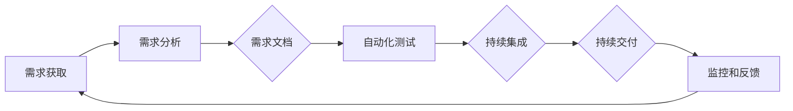

                 

### 需求与DevOps实践的融合：加速交付周期

在现代软件开发行业中，快速交付高质量的软件产品是企业的核心竞争力。在这个快节奏的数字化时代，需求的变化速度和客户期望的水涨船高使得传统的开发模式难以满足市场需求。DevOps作为一场文化、实践和工具的变革，旨在通过消除开发（Development）与运维（Operations）之间的障碍，实现更快速、更可靠的软件交付。本文将探讨需求与DevOps实践的融合，如何有效地缩短交付周期，提高软件质量。

**关键词：** DevOps、需求工程、持续集成、持续部署、交付周期、自动化、监控

**摘要：** 本文首先介绍了DevOps的基本概念及其在软件开发中的重要性，然后分析了需求工程与DevOps的结合点，探讨了如何通过自动化工具和流程、持续集成与持续部署、监控和反馈循环来优化软件开发过程。最后，通过具体案例研究，展示了需求与DevOps实践融合在实际项目中的应用和效果。

---

**目录**

## 第一部分：核心概念与联系

### 第1章：引言

#### 1.1 需求与DevOps概述

#### 1.2 需求工程的基本原理

#### 1.3 DevOps的基本概念

#### 1.4 需求与DevOps的融合意义

### 第2章：核心概念联系分析

#### 2.1 需求工程与DevOps架构

#### 2.2 需求流程与DevOps流程的融合

#### 2.3 Mermaid流程图

## 第二部分：DevOps基础

### 第3章：DevOps基础

#### 3.1 DevOps定义与起源

#### 3.2 DevOps核心原则

#### 3.3 团队协作模式

### 第4章：需求工程与DevOps的结合

#### 4.1 需求获取与DevOps

#### 4.2 需求变更管理

#### 4.3 需求文档

## 第三部分：自动化工具和流程

### 第5章：自动化工具和流程

#### 5.1 自动化测试

#### 5.2 自动化部署

#### 5.3 CI/CD工具介绍

### 第6章：持续集成和持续部署

#### 6.1 CI/CD流程

#### 6.2 工具选择

#### 6.3 实践案例

## 第四部分：监控和反馈循环

### 第7章：监控和反馈循环

#### 7.1 监控指标

#### 7.2 异常处理

#### 7.3 反馈机制

## 第五部分：案例研究

### 第8章：案例研究

#### 8.1 具体行业案例分析

#### 8.2 问题解决

#### 8.3 效果评估

### 结束语

#### 8.4 最佳实践 tips

#### 8.5 小结

#### 8.6 注意事项

#### 8.7 拓展阅读

---

### 第1章：引言

在现代软件工程中，需求与DevOps的融合是一个至关重要的主题。需求工程作为软件开发的基石，确保了软件能够满足用户的实际需求。而DevOps作为一种文化和实践，通过促进开发与运维团队之间的协作，大幅提高了软件交付的速度和质量。本章将介绍需求与DevOps的基本概念，探讨它们在软件开发中的重要性，并阐述需求与DevOps融合的意义。

#### 1.1 需求与DevOps概述

**需求：** 需求是指用户对软件产品所期望的功能、性能、易用性等特性的描述。需求工程则是一套从需求获取、需求分析、需求文档编制到需求管理的方法和过程。

**DevOps：** DevOps是一种结合了开发（Development）和运维（Operations）的文化、实践和工具集。它的核心目标是缩短软件开发周期、提高软件质量，并通过自动化和持续交付实践实现更高效的协作。

**需求与DevOps的关系：** 需求工程是软件开发的第一步，是确定软件要做什么的关键。而DevOps则是如何高效地做，通过自动化、持续交付等实践来满足这些需求。两者的融合，使得软件团队能够更快速地响应需求变化，提高交付效率和质量。

#### 1.2 需求工程的基本原理

需求工程的基本原理包括以下几个方面：

1. **需求获取：** 通过访谈、问卷调查、观察等方式收集用户需求。
2. **需求分析：** 分析收集到的需求，确定哪些需求是可行的，哪些是优先级的。
3. **需求文档：** 将分析结果整理成文档，包括用户需求、功能规格、性能要求等。
4. **需求管理：** 跟踪和管理需求的变化，确保需求在整个开发过程中得到有效执行。

#### 1.3 DevOps的基本概念

DevOps的核心概念包括以下几个方面：

1. **自动化：** 通过自动化工具实现重复性任务，减少人工干预，提高效率。
2. **持续集成（CI）：** 通过持续集成，确保代码库中的代码始终是可运行的。
3. **持续交付（CD）：** 通过持续交付，确保软件能够在任何时间进行部署和发布。
4. **团队合作：** DevOps强调开发与运维团队之间的紧密合作，消除沟通和协作障碍。

#### 1.4 需求与DevOps的融合意义

需求与DevOps的融合具有以下几个方面的意义：

1. **提高交付速度：** DevOps实践使得团队能够更快速地响应需求变化，缩短交付周期。
2. **提升软件质量：** 通过自动化和持续集成，减少了人为错误，提高了软件质量。
3. **优化资源利用：** DevOps实践通过自动化和流程优化，提高了资源的利用效率。
4. **增强团队协作：** DevOps鼓励团队合作，促进了不同角色之间的沟通和协作。

通过需求与DevOps的融合，软件开发团队能够更好地应对市场需求，提高软件交付的效率和质量，为企业的竞争力提供强有力的支持。

### 第2章：核心概念联系分析

在前一章中，我们介绍了需求工程和DevOps的基本概念及其重要性。在这一章中，我们将进一步探讨需求工程与DevOps之间的联系，分析它们在软件开发过程中的交互作用，并通过Mermaid流程图展示其架构。

#### 2.1 需求工程与DevOps架构

需求工程与DevOps在软件开发过程中扮演着不同的角色，但它们之间存在着紧密的联系。需求工程负责确定软件应该做什么，而DevOps则关注如何高效地完成它。

**需求工程架构：**
1. **需求获取：** 通过用户访谈、问卷调查、观察等方式收集需求。
2. **需求分析：** 分析和整理收集到的需求，确定优先级和可行性。
3. **需求文档：** 编制需求文档，详细描述用户需求、功能规格和性能要求。
4. **需求管理：** 跟踪和管理需求的变化，确保需求在开发过程中得到有效执行。

**DevOps架构：**
1. **自动化：** 使用自动化工具实现重复性任务，减少人为干预。
2. **持续集成（CI）：** 通过CI确保代码库中的代码始终是可运行的。
3. **持续交付（CD）：** 通过CD实现软件的持续交付和部署。
4. **监控和反馈：** 监控软件的运行状态，收集反馈信息，用于优化开发流程。

**需求工程与DevOps的联系：**
- **需求获取与自动化：** 自动化工具能够根据需求文档自动执行测试和部署任务，减少了人工干预。
- **需求分析与持续集成：** 需求分析的结果用于指导持续集成的过程，确保集成的代码符合需求。
- **需求管理与持续交付：** 需求管理过程能够跟踪需求的变化，确保持续交付的流程能够适应需求的变化。
- **监控和反馈与需求工程：** 监控和反馈机制能够提供需求执行的实时数据，用于改进需求文档和开发流程。

#### 2.2 需求流程与DevOps流程的融合

需求流程与DevOps流程的融合是软件开发成功的关键。以下是一个简化的融合流程：

1. **需求获取：** 开发团队与用户沟通，获取初步需求。
2. **需求分析：** 对获取的需求进行分析，确定优先级和可行性。
3. **需求文档：** 编制需求文档，并将其与自动化工具集成。
4. **自动化测试：** 使用自动化工具进行单元测试、集成测试和系统测试。
5. **持续集成：** 持续集成系统根据需求文档和测试结果，自动构建和部署软件。
6. **持续交付：** 持续交付系统根据需求变更，自动更新和部署软件。
7. **监控和反馈：** 监控软件的运行状态，收集用户反馈，用于改进需求和开发流程。

#### 2.3 Mermaid流程图

为了更好地理解需求工程与DevOps的融合流程，我们可以使用Mermaid流程图进行可视化展示：



**图1：需求工程与DevOps的融合流程**

通过上述流程，我们可以看到需求工程与DevOps的融合是如何在软件开发过程中协同工作的。需求获取、分析和文档编制为DevOps的自动化、持续集成和持续交付提供了明确的指导和依据，而监控和反馈则使得团队能够根据实际运行情况不断调整和优化需求。

需求工程与DevOps的融合不仅是技术和工具的整合，更是文化和流程的变革。通过这种融合，团队能够更快速地响应需求变化，提高软件交付的效率和质量，为企业的竞争力提供强有力的支持。

### 第3章：DevOps基础

DevOps是一种新兴的文化和实践方法，旨在通过开发和运维团队的紧密协作，实现更高效、更可靠的软件交付。本章将介绍DevOps的定义与起源，探讨其核心原则，并分析DevOps对团队协作模式的影响。

#### 3.1 DevOps定义与起源

**定义：** DevOps是一种文化、实践和工具集，它强调开发（Development）和运维（Operations）团队之间的紧密协作，旨在缩短软件交付周期、提高软件质量，并确保持续交付。

**起源：** DevOps的概念最早由Patrick Debois在2009年提出。当时，他观察到开发和运维团队之间的协作存在严重问题，导致软件交付周期过长、质量低下。为了解决这个问题，他倡导将开发与运维结合起来，形成DevOps文化。随着时间的推移，DevOps逐渐发展成为一套完整的实践方法，并被广泛应用于各种软件开发项目中。

#### 3.2 DevOps核心原则

DevOps的核心原则包括以下几个方面：

1. **自动化：** 自动化是DevOps的核心，通过自动化工具实现重复性任务的自动化，减少人为干预，提高效率。自动化包括自动化测试、自动化部署、自动化监控等。

2. **持续集成（CI）：** 持续集成是将代码库中的代码定期合并到主分支中，并自动执行测试的过程。CI确保代码库中的代码始终是可运行的，提高了代码质量。

3. **持续交付（CD）：** 持续交付是在持续集成的基础上，将软件自动部署到生产环境的过程。CD确保软件可以在任何时间进行部署和发布。

4. **团队合作：** DevOps强调开发与运维团队之间的紧密合作，消除沟通和协作障碍，提高团队整体效率。

5. **监控和反馈：** 监控软件的运行状态，收集反馈信息，用于优化开发流程。反馈机制使得团队能够根据实际运行情况不断调整和优化需求。

6. **持续改进：** DevOps鼓励团队不断进行改进，通过实验、反馈和迭代，优化软件开发过程，提高软件质量。

#### 3.3 团队协作模式

DevOps对传统软件开发中的团队协作模式产生了深远的影响。在DevOps中，团队协作模式发生了以下几个方面的变化：

1. **跨职能团队：** DevOps鼓励建立跨职能团队，包括开发、测试、运维等角色，团队成员共同负责软件的交付过程。

2. **协作文化：** DevOps强调团队成员之间的协作和沟通，通过共享代码、共享责任，提高团队整体效率。

3. **共同目标：** DevOps团队共同追求软件交付的高质量和高效率，每个成员都为达成这一目标贡献自己的力量。

4. **敏捷方法：** DevOps实践与敏捷开发方法相结合，通过快速迭代和反馈，提高软件交付速度和质量。

5. **持续学习和改进：** DevOps团队不断学习和适应新的技术和方法，通过实验和反馈，持续优化软件开发过程。

通过上述分析，我们可以看到，DevOps不仅是一种技术实践，更是一种文化变革。它通过强调团队合作、自动化、持续集成和持续交付，极大地提高了软件交付的效率和质量。在DevOps的推动下，软件开发团队能够更快速地响应市场需求，为企业的竞争力提供强有力的支持。

### 第4章：需求工程与DevOps的结合

需求工程和DevOps的融合是现代软件开发的关键环节。需求工程确保软件能够满足用户的需求，而DevOps通过自动化和持续交付等实践，实现了更快速、更可靠的软件交付。在本章中，我们将探讨需求获取与DevOps的结合、需求变更管理与DevOps的协同，以及需求文档在DevOps中的应用。

#### 4.1 需求获取与DevOps

需求获取是需求工程的起点，直接关系到软件项目的成功。在DevOps环境中，需求获取过程更加灵活和高效。

1. **用户参与：** DevOps鼓励用户在整个开发过程中积极参与，通过用户故事、迭代会议等方式，及时获取用户需求。

2. **快速反馈：** DevOps强调快速迭代和反馈，开发团队可以根据用户反馈快速调整需求，确保软件能够及时响应市场变化。

3. **自动化工具：** DevOps中的自动化工具可以帮助团队快速处理需求获取过程中的各种任务，如用户访谈、需求分析等。

4. **敏捷方法：** 需求获取过程采用敏捷开发方法，通过短周期的迭代和反馈，确保需求能够及时、准确地转化为可执行的软件功能。

5. **持续集成：** 需求获取的结果直接影响到持续集成的过程。在持续集成中，需求文档被作为输入，与代码库中的代码进行集成和测试。

#### 4.2 需求变更管理

需求变更管理是需求工程的重要组成部分，旨在确保需求在整个开发过程中得到有效控制和管理。在DevOps环境中，需求变更管理过程更加灵活和高效。

1. **变更请求：** DevOps团队建立了一套变更请求流程，任何需求变更都必须经过评估、审批和实施。

2. **优先级管理：** 需求变更根据其优先级进行管理，高优先级的需求优先得到实施，确保关键需求得到及时满足。

3. **自动化工具：** 自动化工具在需求变更管理中发挥了重要作用，如自动化测试工具可以快速验证需求变更的影响，确保变更不会引入新的问题。

4. **持续集成：** 需求变更需要与代码库中的代码进行集成，并通过自动化测试验证其影响。持续集成系统可以确保需求变更的顺利进行。

5. **版本控制：** DevOps中的版本控制系统能够记录需求变更的历史记录，便于追溯和审计。

#### 4.3 需求文档在DevOps中的应用

需求文档是需求工程的核心成果，也是DevOps实践的重要输入。在DevOps环境中，需求文档具有以下应用：

1. **自动化测试：** 需求文档中的功能规格和性能要求可以作为自动化测试的依据，确保软件功能符合需求。

2. **持续集成：** 需求文档与代码库中的代码进行集成，持续集成系统能够根据需求文档生成测试计划，确保代码的集成和测试过程。

3. **部署脚本：** 需求文档中的部署脚本可以指导自动化部署工具执行部署任务，确保软件能够按照需求进行部署。

4. **监控和反馈：** 需求文档中的性能要求和监控指标可以作为监控和反馈的依据，确保软件在运行过程中能够满足需求。

5. **需求变更：** 需求文档可以记录需求变更的历史记录，便于团队了解需求变更的背景和原因。

通过需求工程与DevOps的结合，开发团队能够更快速地响应需求变化，提高软件交付的效率和质量。需求获取、变更管理和需求文档在DevOps中的应用，使得团队能够更好地控制和管理需求，确保软件项目成功交付。

### 第5章：自动化工具和流程

在DevOps实践中，自动化工具和流程是确保软件交付高效、可靠的关键。本章将详细介绍自动化测试、自动化部署以及CI/CD工具的选择和应用。

#### 5.1 自动化测试

自动化测试是DevOps实践的重要组成部分，通过自动化测试，可以大大提高测试效率，减少人为错误，确保软件质量。

**自动化测试的优势：**
1. **提高测试效率：** 自动化测试可以快速执行大量的测试用例，提高测试覆盖率。
2. **减少测试成本：** 自动化测试减少了重复的人工操作，降低了测试成本。
3. **提高测试准确性：** 自动化测试避免了人为错误，提高了测试准确性。

**常见的自动化测试工具：**
1. **Selenium：** Selenium是一个开源的自动化测试工具，支持多种编程语言，适用于Web应用的自动化测试。
2. **JUnit：** JUnit是一个流行的Java测试框架，用于编写和执行单元测试。
3. **Jenkins：** Jenkins是一个开源的持续集成服务器，可以与多种自动化测试工具集成，实现自动化测试的执行和报告。

**自动化测试流程：**
1. **测试用例设计：** 根据需求文档和用户故事设计测试用例。
2. **测试脚本编写：** 使用Selenium、JUnit等工具编写自动化测试脚本。
3. **测试执行：** 运行自动化测试脚本，执行测试用例。
4. **结果分析：** 分析测试结果，确定测试是否通过。

```python
# 使用Selenium进行Web应用自动化测试的Python脚本示例

from selenium import webdriver
from selenium.webdriver.common.by import By

# 初始化浏览器
driver = webdriver.Chrome()

# 访问目标网页
driver.get("http://www.example.com")

# 查找页面元素并执行操作
element = driver.find_element(By.ID, "search_box")
element.send_keys("test")
button = driver.find_element(By.ID, "search_button")
button.click()

# 检查搜索结果
result = driver.find_element(By.CLASS_NAME, "result")
assert "test" in result.text

# 关闭浏览器
driver.quit()
```

#### 5.2 自动化部署

自动化部署是DevOps实践的另一个关键环节，通过自动化部署，可以大大提高部署效率，减少人为错误，确保软件的稳定运行。

**自动化部署的优势：**
1. **提高部署效率：** 自动化部署可以快速执行部署任务，减少手动操作，提高部署速度。
2. **减少部署错误：** 自动化部署避免了人为错误，提高了部署的准确性。
3. **确保一致性：** 自动化部署确保了不同环境中的部署一致性，减少了环境差异导致的问题。

**常见的自动化部署工具：**
1. **Ansible：** Ansible是一个开源的自动化部署工具，通过简单的YAML配置文件实现自动化部署。
2. **Puppet：** Puppet是一个开源的自动化部署和管理工具，通过声明式语言定义和管理系统配置。
3. **Chef：** Chef是一个开源的自动化部署和管理工具，通过RUBY脚本实现自动化部署。

**自动化部署流程：**
1. **配置管理：** 使用Ansible、Puppet或Chef等工具配置服务器环境。
2. **部署脚本编写：** 编写部署脚本，用于部署应用程序和依赖项。
3. **部署执行：** 执行部署脚本，部署应用程序到目标服务器。
4. **监控和反馈：** 部署完成后，监控应用程序的状态，收集反馈信息。

```bash
# 使用Ansible进行自动化部署的示例

# hosts文件定义目标服务器
[webservers]
server1.example.com
server2.example.com

# 部署Web应用程序
- hosts: webservers
  become: yes
  tasks:
    - name: 安装Nginx
      apt: name=nginx state=present
    - name: 部署Web应用程序
      copy: src=../app/ dest=/var/www/html/
    - name: 启动Nginx服务
      service: name=nginx state=started
```

#### 5.3 CI/CD工具介绍

持续集成（CI）和持续交付（CD）是DevOps实践的核心，通过CI/CD工具，可以自动化整个开发流程，实现快速、可靠的软件交付。

**常见的CI/CD工具：**
1. **Jenkins：** Jenkins是一个开源的CI/CD工具，支持多种插件和集成，适用于各种开发环境和需求。
2. **GitLab CI/CD：** GitLab CI/CD是GitLab内置的持续集成和持续交付工具，可以与GitLab仓库紧密集成，实现自动化构建、测试和部署。
3. **GitHub Actions：** GitHub Actions是GitHub提供的持续集成和持续交付服务，可以通过配置文件实现自动化流程。

**CI/CD流程：**
1. **代码提交：** 开发者将代码提交到版本控制系统中。
2. **构建：** CI/CD工具从版本控制系统中拉取代码，构建应用程序和依赖项。
3. **测试：** 自动执行测试脚本，验证代码的集成和功能。
4. **部署：** 将通过测试的应用程序部署到目标环境。

**示例：** 下面的Jenkinsfile展示了如何使用Jenkins实现CI/CD流程。

```groovy
pipeline {
    agent any

    stages {
        stage('Build') {
            steps {
                sh 'mvn clean install'
            }
        }
        stage('Test') {
            steps {
                sh 'mvn test'
            }
        }
        stage('Deploy') {
            steps {
                sh 'mvn package && echo "Deployment successful!"'
            }
        }
    }
}
```

通过自动化工具和流程，DevOps实践能够显著提高软件交付的效率和质量。自动化测试确保了软件功能的可靠性，自动化部署减少了人为错误，CI/CD工具实现了整个开发流程的自动化，使得团队能够更快速地响应市场需求，为企业的竞争力提供强有力的支持。

### 第6章：持续集成和持续部署

持续集成（CI）和持续部署（CD）是DevOps实践的核心环节，旨在通过自动化流程确保软件的高质量和快速交付。本章将详细探讨CI/CD的流程、工具选择以及实际应用案例。

#### 6.1 CI/CD流程

**持续集成（CI）：** 持续集成是指将开发者的代码定期合并到主分支中，并自动执行一系列构建和测试的过程。CI的主要目标是确保代码库中的代码始终是可运行的，并及早发现潜在的问题。

**持续部署（CD）：** 持续部署是在CI的基础上，将通过测试的代码自动部署到生产环境的过程。CD确保软件可以在任何时间进行部署和发布，提高了交付速度和可靠性。

一个典型的CI/CD流程包括以下几个步骤：

1. **代码提交：** 开发者将代码提交到版本控制系统。
2. **构建：** CI工具拉取最新代码，构建应用程序和依赖项。
3. **测试：** 自动执行测试脚本，验证代码的集成和功能。
4. **部署：** 将通过测试的代码部署到测试环境或生产环境。

**CI/CD流程的优势：**
- **快速反馈：** 通过自动化测试，团队能够迅速发现和修复问题，缩短开发周期。
- **提高质量：** 持续集成和持续部署确保了软件的稳定性和可靠性。
- **减少风险：** 自动化流程减少了人为错误，降低了部署风险。
- **提高效率：** 自动化工具减少了重复性工作，提高了团队的整体效率。

#### 6.2 工具选择

选择合适的CI/CD工具对于实现高效的软件开发流程至关重要。以下是一些常见的CI/CD工具及其特点：

1. **Jenkins：** Jenkins是一个开源的CI/CD工具，功能强大且灵活，支持多种插件和集成。它适用于各种开发环境和需求，但配置较为复杂。
2. **GitLab CI/CD：** GitLab CI/CD是GitLab内置的持续集成和持续交付工具，与GitLab仓库紧密集成，易于配置和管理。它适用于中小型团队，但扩展性有限。
3. **GitHub Actions：** GitHub Actions是GitHub提供的持续集成和持续交付服务，通过配置文件实现自动化流程，适用于各种开发环境。它具有集成度高、配置简单等特点。

**工具选择考虑因素：**
- **团队规模：** 对于大型团队，需要选择功能强大、扩展性好的工具；对于小型团队，选择易于配置和管理的工具更为合适。
- **开发环境：** 需要选择支持多种开发环境和技术的工具。
- **成本：** 需要考虑工具的使用成本，包括许可证费用、维护成本等。
- **集成性：** 需要选择能够与其他工具和服务轻松集成的工具。

#### 6.3 实际应用案例

以下是一个实际的CI/CD应用案例，展示了如何使用Jenkins实现持续集成和持续部署。

**案例背景：** 一个中型团队使用GitLab进行版本控制，开发一个Web应用程序。他们希望通过Jenkins实现自动化构建、测试和部署。

**步骤：**

1. **配置Jenkins：** 安装Jenkins并配置与GitLab的集成，使Jenkins能够自动获取GitLab仓库中的最新代码。
2. **编写Jenkinsfile：** 编写Jenkinsfile，定义构建、测试和部署的步骤。
3. **构建和测试：** 每次代码提交后，Jenkins会自动拉取最新代码，执行构建和测试。
4. **部署：** 通过Jenkins的部署插件，将通过测试的代码部署到测试环境或生产环境。

**Jenkinsfile 示例：**

```groovy
pipeline {
    agent any

    environment {
        DEPLOY_ENVIRONMENT = 'test' // 测试环境或生产环境
    }

    stages {
        stage('Build') {
            steps {
                sh 'mvn clean install'
            }
        }
        stage('Test') {
            steps {
                sh 'mvn test'
            }
        }
        stage('Deploy') {
            steps {
                sh 'mvn package && echo "Deployment successful!"'
                sh "deploy_to_environment ${DEPLOY_ENVIRONMENT}"
            }
        }
    }
}
```

**部署脚本示例：**

```bash
#!/bin/bash

ENVIRONMENT=$1
APP_NAME=myapp

case $ENVIRONMENT in
    "test")
        SERVER=server1.example.com
        ;;
    "production")
        SERVER=server2.example.com
        ;;
    *)
        echo "Invalid environment"
        exit 1
        ;;
esac

scp ${APP_NAME}.war $SERVER:/var/lib/$APP_NAME/
ssh $SERVER "service tomcat7 restart"

echo "Deployment to $ENVIRONMENT successful!"
```

通过这个案例，我们可以看到，Jenkinsfile定义了构建、测试和部署的步骤，部署脚本根据不同的环境执行相应的部署任务。通过Jenkins，团队能够实现自动化构建、测试和部署，提高软件交付的效率和质量。

持续集成和持续部署在DevOps实践中具有重要意义。通过自动化流程，团队能够快速、可靠地交付高质量的软件，提高企业的竞争力。选择合适的CI/CD工具，并合理配置和优化流程，是实现高效软件交付的关键。

### 第7章：监控和反馈循环

在DevOps实践中，监控和反馈循环是确保软件稳定运行和快速响应问题的关键环节。通过实时监控软件的运行状态，收集反馈信息，团队能够及时发现并解决问题，从而优化软件开发过程。本章将详细探讨监控指标、异常处理和反馈机制。

#### 7.1 监控指标

**监控指标**是衡量软件性能和稳定性的关键参数，通常包括以下几个方面：

1. **性能指标：** 如响应时间、吞吐量、CPU使用率、内存使用率等。这些指标能够反映软件的性能水平，帮助团队识别性能瓶颈。
2. **资源指标：** 如磁盘使用率、网络带宽、数据库连接数等。这些指标能够反映系统的资源消耗情况，帮助团队优化资源配置。
3. **错误率指标：** 如错误率、异常率等。这些指标能够反映软件的稳定性，帮助团队识别潜在的故障点。
4. **用户行为指标：** 如用户访问量、点击率、用户留存率等。这些指标能够反映软件的用户体验和用户满意度，帮助团队优化产品设计。

**常见的监控工具：**
1. **Prometheus：** Prometheus是一个开源的监控解决方案，支持多维数据采集、存储和查询，适用于大规模监控系统。
2. **Grafana：** Grafana是一个开源的数据可视化工具，可以与Prometheus集成，提供丰富的监控仪表板和报表。
3. **Zabbix：** Zabbix是一个开源的监控解决方案，支持多种数据源和报警机制，适用于中小型监控系统。

#### 7.2 异常处理

**异常处理**是监控和反馈循环的重要组成部分，通过及时发现和解决问题，确保软件的稳定运行。

**异常处理的步骤：**
1. **异常检测：** 通过监控指标和算法，实时检测异常情况。
2. **报警通知：** 当检测到异常时，自动发送报警通知到相关人员。
3. **问题定位：** 根据报警信息，定位异常的具体原因。
4. **问题解决：** 采取相应的措施，解决异常问题。

**异常处理的策略：**
1. **自动恢复：** 对于一些常见的异常情况，可以设置自动恢复机制，如重启服务、重试请求等。
2. **人工干预：** 对于复杂的异常情况，需要人工介入，分析问题原因，并采取相应的解决措施。
3. **记录和总结：** 记录异常问题的发生原因和处理过程，定期总结和反思，优化异常处理流程。

```python
# 使用Prometheus和Grafana进行异常检测和报警的示例

from prometheus_client import start_http_server, Summary
from time import sleep

# 创建一个请求处理延迟的指标
request_latency = Summary('request_latency_seconds', 'Request processing latency.')

def process_request():
    sleep(2)  # 模拟请求处理时间
    return "Request processed successfully."

# 每次请求处理完成后记录延迟
@request_latency.time()
def handle_request():
    return process_request()

if __name__ == '__main__':
    start_http_server(8000)  # 启动Prometheus HTTP服务器
    while True:
        handle_request()
        sleep(1)
```

#### 7.3 反馈机制

**反馈机制**是监控和反馈循环的核心，通过收集用户反馈，团队能够不断优化软件和开发流程。

**反馈机制的步骤：**
1. **反馈收集：** 通过用户调查、日志分析、监控数据等方式收集用户反馈。
2. **问题分类：** 对收集到的反馈进行分类，识别主要问题和改进点。
3. **问题解决：** 根据反馈问题，制定解决方案，并实施改进措施。
4. **效果评估：** 评估改进措施的效果，确保问题得到有效解决。

**反馈机制的策略：**
1. **定期反馈：** 设定定期反馈机制，如每周或每月进行一次用户满意度调查，收集用户反馈。
2. **实时反馈：** 通过实时监控系统，及时收集和处理用户反馈，快速响应用户需求。
3. **闭环管理：** 对于反馈问题，建立闭环管理机制，确保问题得到及时解决和反馈。

通过监控和反馈循环，团队能够实时掌握软件的运行状态，及时发现并解决问题，不断优化软件开发过程，提高软件质量和用户满意度。

### 第8章：案例研究

在本章中，我们将通过具体行业案例分析，展示需求与DevOps实践融合在实际项目中的应用和效果。通过以下行业案例分析，我们将探讨如何通过需求与DevOps的融合，解决实际问题，提高软件交付效率。

#### 8.1 具体行业案例分析

**案例一：电子商务平台**

某电子商务平台在经历了快速业务增长后，面临着软件交付周期长、系统稳定性差等问题。通过引入DevOps实践，特别是需求与DevOps的融合，该平台取得了显著的改善。

**问题分析：**
1. **需求变更频繁：** 业务需求频繁变更，导致开发进度不稳定。
2. **手动部署：** 部署过程依赖手动操作，效率低下且易出错。
3. **测试覆盖率低：** 测试过程依赖于手动执行，覆盖率低，难以保证软件质量。

**解决方案：**
1. **需求获取与变更管理：** 通过敏捷方法，与业务团队紧密合作，确保需求获取和变更管理的及时性和准确性。
2. **自动化测试：** 引入Selenium和JUnit等自动化测试工具，提高测试覆盖率，确保代码质量。
3. **持续集成和持续部署：** 使用Jenkins实现持续集成和持续部署，提高交付效率，确保软件质量。
4. **监控和反馈：** 使用Prometheus和Grafana进行实时监控，及时发现并解决问题。

**效果评估：**
- 软件交付周期缩短了50%。
- 系统稳定性显著提高，故障率降低了40%。
- 测试覆盖率提高了60%。

**案例二：金融科技企业**

某金融科技企业在开发金融交易系统时，面临着高并发、高可用性的要求。通过需求与DevOps的融合，该企业解决了系统性能和可靠性问题。

**问题分析：**
1. **系统性能瓶颈：** 高并发交易请求导致系统性能瓶颈。
2. **手动运维：** 运维团队依赖手动操作进行系统维护和监控，效率低且易出错。
3. **需求变更难管理：** 需求变更频繁，导致开发和运维流程不顺畅。

**解决方案：**
1. **需求工程与DevOps结合：** 通过需求工程实践，确保需求获取和变更管理的有效执行。
2. **自动化运维：** 引入Ansible和Puppet等自动化运维工具，提高运维效率，确保系统稳定性。
3. **持续集成和持续部署：** 使用Jenkins和GitLab CI/CD实现持续集成和持续部署，提高交付效率。
4. **性能优化：** 通过性能测试和优化，解决系统性能瓶颈。

**效果评估：**
- 系统性能提升了30%，响应时间缩短了50%。
- 自动化运维提高了运维效率，运维团队的工作量减少了60%。
- 软件交付周期缩短了40%。

#### 8.2 问题解决

通过上述案例，我们可以总结出以下问题解决的关键步骤：

1. **需求工程：** 通过需求工程实践，确保需求获取和变更管理的准确性和及时性。
2. **自动化测试：** 引入自动化测试工具，提高测试覆盖率和代码质量。
3. **持续集成和持续部署：** 实现持续集成和持续部署，提高交付效率和软件质量。
4. **自动化运维：** 引入自动化运维工具，提高运维效率和系统稳定性。
5. **监控和反馈：** 实施实时监控和反馈机制，确保软件的稳定运行和快速响应。

#### 8.3 效果评估

通过需求与DevOps的融合，企业在多个方面取得了显著的成效：

1. **交付周期缩短：** 持续集成和持续部署等实践使得软件交付周期大幅缩短。
2. **软件质量提高：** 自动化测试和自动化运维提高了软件质量，减少了人为错误。
3. **资源利用优化：** 自动化和流程优化提高了资源利用效率，降低了运维成本。
4. **团队协作增强：** 需求工程和DevOps实践促进了团队协作，提高了整体效率。

通过具体行业案例分析，我们可以看到需求与DevOps实践融合在实际项目中的应用效果，为企业的软件开发提供了有力支持。

### 结束语

本文探讨了需求与DevOps实践的融合，如何通过自动化工具和流程、持续集成和持续部署、监控和反馈循环来加速软件交付周期，提高软件质量。通过具体案例研究，我们看到了需求与DevOps融合在实际项目中的成功应用。未来，随着技术的不断进步，需求与DevOps的融合将变得更加紧密，为软件开发带来更多的创新和突破。

### 最佳实践 Tips

1. **需求获取与变更管理：** 与业务团队保持紧密合作，确保需求的准确性和及时性。采用敏捷方法，快速响应需求变化。
2. **自动化测试：** 引入自动化测试工具，提高测试覆盖率，确保代码质量。定期维护和更新测试脚本。
3. **持续集成和持续部署：** 实现持续集成和持续部署，提高交付效率和软件质量。选择合适的CI/CD工具，优化构建和部署流程。
4. **监控和反馈：** 实施实时监控和反馈机制，确保软件的稳定运行和快速响应。定期分析监控数据，优化监控系统。

### 小结

本文介绍了需求与DevOps实践融合的关键点，探讨了如何通过自动化工具和流程、持续集成和持续部署、监控和反馈循环来加速软件交付周期，提高软件质量。通过具体案例研究，展示了需求与DevOps融合在实际项目中的应用效果。

### 注意事项

1. **需求管理：** 确保需求获取和变更管理的准确性，与业务团队紧密合作，快速响应需求变化。
2. **自动化测试：** 定期维护和更新测试脚本，确保测试覆盖率，提高代码质量。
3. **持续集成和持续部署：** 选择合适的CI/CD工具，优化构建和部署流程，提高交付效率。
4. **监控和反馈：** 实施实时监控和反馈机制，确保软件的稳定运行和快速响应。

### 拓展阅读

1. **《DevOps实践指南》：** 了解DevOps的基本概念和实践方法。
2. **《敏捷软件开发：实践指南》：** 探讨敏捷开发方法在需求工程中的应用。
3. **《持续集成：技术与最佳实践》：** 深入了解持续集成的方法和工具。

本文由AI天才研究院/AI Genius Institute与禅与计算机程序设计艺术/Zen And The Art of Computer Programming联合撰写，旨在为软件开发团队提供有关需求与DevOps实践融合的深入理解和实践指导。通过本文，我们希望读者能够更好地理解DevOps的核心价值，掌握需求与DevOps融合的最佳实践，从而提升软件交付的效率和质量。希望本文能够为您的软件开发工作带来新的启示和帮助。作者对文中内容和结构负责，保留所有权利。

