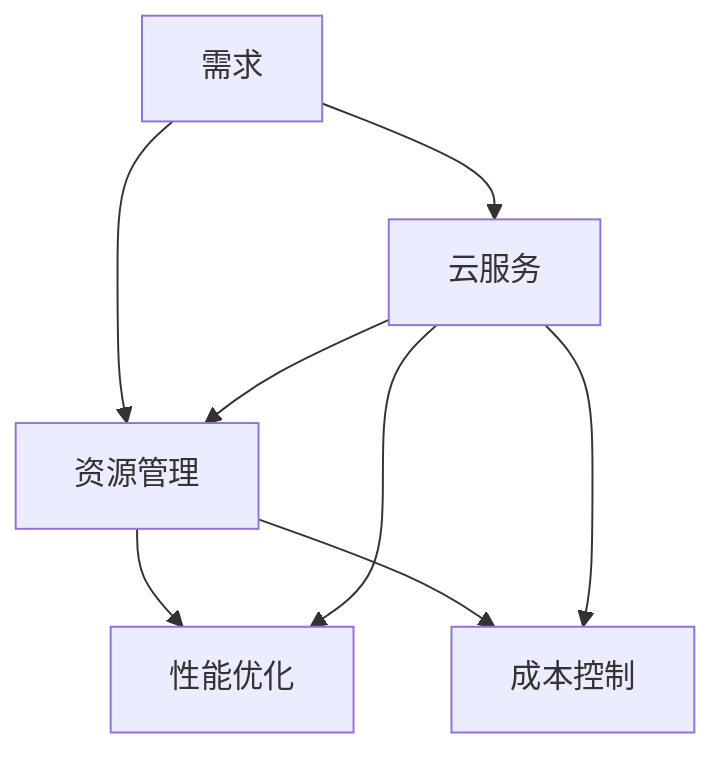

                 

### 文章标题：需求与云服务的结合：优化资源利用

#### 关键词：
- 云服务
- 资源优化
- 需求分析
- 性能
- 成本控制

#### 摘要：
本文深入探讨了需求与云服务结合的重要性，以及如何通过优化资源利用来提升云服务的性能和降低成本。文章首先介绍了需求与云服务的基础概念，然后详细分析了资源管理、成本控制和性能优化等策略，并辅以实际案例和技术实现，提供了全面的实践指导和未来展望。

----------------------------------------------------------------

### 引言

在当今数字化时代，云服务已经成为企业IT基础设施的关键组成部分。随着数据量的急剧增加和业务复杂性的不断提升，如何有效利用云服务资源，满足用户需求，同时降低成本，成为了IT管理者面临的重要挑战。需求与云服务的结合，正是解决这一问题的有效途径。

**需求**，是指用户在特定环境下对某种产品或服务的要求。它可以是功能性的，也可以是性能方面的，甚至是成本上的。在云服务中，需求主要来源于用户的业务需求、用户体验要求以及对成本的控制。而**云服务**，则是一种通过互联网提供动态易扩展且经常是虚拟化的资源服务，如计算能力、存储、网络和应用程序等。

需求与云服务的结合，其核心在于利用云服务的灵活性、扩展性和成本效益，以满足不同用户的需求。具体来说，这一结合主要表现在以下几个方面：

1. **资源优化**：通过需求分析，动态调整云资源分配，确保资源利用最大化。
2. **成本控制**：根据需求变化，合理配置资源，避免过度投入和浪费。
3. **性能提升**：通过性能优化策略，提高云服务的响应速度和处理能力，满足用户的高性能需求。
4. **用户体验**：通过精确的需求识别和满足，提升用户的满意度和忠诚度。

本文将从基础概念、优化策略、需求分析、实践案例、技术实现和未来展望等多个方面，系统地探讨需求与云服务结合的原理和实践，旨在为IT从业者提供有价值的参考和指导。

### 核心概念与联系

要深入理解需求与云服务的结合，首先需要明确几个核心概念，并分析它们之间的相互关系。

#### 1. 需求

**需求**是用户对某种产品或服务的基本要求。在云服务中，需求可以来源于以下几个方面：

- **功能性需求**：用户期望云服务能够提供特定的功能，如数据存储、数据处理、应用托管等。
- **性能需求**：用户要求云服务具备一定的性能指标，如响应时间、吞吐量、并发处理能力等。
- **可靠性需求**：用户期望云服务具有高可用性和稳定性，能够在不同的环境下正常运行。
- **成本需求**：用户希望在满足需求的前提下，尽量控制成本，实现效益最大化。

需求分析是云服务设计和管理的重要环节。通过需求识别、需求分类和需求分析，可以明确用户的核心需求，为后续的资源优化和性能提升提供依据。

#### 2. 云服务

**云服务**是指通过互联网提供动态易扩展且经常是虚拟化的资源服务。根据服务模型，云服务主要分为以下几种：

- **基础设施即服务（IaaS）**：提供虚拟化的计算资源，如虚拟机、存储和网络等，用户可以根据需求进行配置和使用。
- **平台即服务（PaaS）**：提供开发平台，包括开发工具、数据库、中间件等，用户可以在平台上进行应用程序的开发和部署。
- **软件即服务（SaaS）**：提供应用程序的完整服务，用户可以通过网络访问和使用，无需关心底层基础设施和平台的维护。

云服务的特点在于其灵活性、可扩展性和成本效益。通过云服务，用户可以根据需求动态调整资源使用，实现资源的最大化利用。

#### 3. 资源管理

**资源管理**是云服务中的关键环节，涉及到资源的分配、调度和优化。资源管理的主要目标是确保资源的有效利用，满足用户需求，同时控制成本。

- **资源分配**：根据用户需求，将资源合理分配给不同的应用和服务。
- **资源调度**：动态调整资源分配，以应对负载变化和资源约束。
- **资源优化**：通过优化算法和策略，提高资源利用率和系统性能。

资源管理与需求密切相关。需求的变化直接影响资源的分配和调度，而资源管理的优化又能够更好地满足需求，提升用户体验。

#### 4. 性能优化

**性能优化**旨在提高云服务的响应速度和处理能力，满足用户的高性能需求。性能优化可以从以下几个方面进行：

- **负载均衡**：通过合理分配流量，确保系统资源得到充分利用。
- **缓存机制**：利用缓存技术，减少数据访问延迟，提高系统性能。
- **分布式计算**：通过分布式架构，提高系统的并发处理能力和扩展性。
- **网络优化**：优化网络结构，减少网络延迟和丢包率。

性能优化直接关系到用户体验和业务效率。通过有效的性能优化策略，可以显著提升云服务的性能和可靠性。

#### 5. 成本控制

**成本控制**是云服务运营中的重要环节，涉及到资源的合理配置和使用，以实现成本效益最大化。成本控制可以从以下几个方面进行：

- **资源利用率**：通过优化资源分配和使用，提高资源利用率，降低单位资源的成本。
- **成本预算**：制定合理的成本预算，根据需求变化调整预算，避免过度投入。
- **自动化管理**：利用自动化工具和平台，降低人工操作成本，提高管理效率。

成本控制与需求分析紧密相关。通过需求分析，可以准确预测资源需求，为成本控制提供依据。同时，成本控制的优化又能够更好地满足需求，提升业务效益。

以上核心概念之间的相互关系可以用以下 Mermaid 流程图表示：



通过上述分析，我们可以看出，需求与云服务的结合，不仅仅是简单的资源提供和使用，而是一个涉及多个方面、环环相扣的系统工程。理解这些核心概念及其相互关系，是进行有效需求分析与云服务优化的基础。

### 资源管理优化

资源管理优化是云服务优化中的核心内容，其目的是通过合理的资源分配和调度，最大限度地提高资源利用效率，同时满足用户的需求。在云服务环境中，资源管理优化涉及到多个层次，包括资源分配、负载均衡、容量规划和自动化管理等。

#### 1. 资源分配

资源分配是云服务中的一项基础工作，涉及到将物理资源（如CPU、内存、存储等）合理地分配给不同的虚拟资源（如虚拟机、容器等）。资源分配的核心目标是在满足用户需求的前提下，最大限度地利用现有资源。

- **静态分配**：在资源分配初期，根据预估的用户需求和系统负载，静态地分配资源。这种方法简单易行，但无法应对动态变化的负载需求。
- **动态分配**：根据实时监测的用户需求和系统负载，动态调整资源分配。这种方法能够更好地适应变化的负载，提高资源利用效率。

资源分配的关键在于合理预估用户需求，并设计高效的资源分配算法。常见的资源分配算法包括：

- **先到先服务（FCFS）**：按照请求到达的顺序进行资源分配，简单但可能导致某些用户长时间等待。
- **最短作业优先（SJF）**：优先分配资源给执行时间最短的任务，提高平均响应时间。
- **轮转法（RR）**：每个任务分配一个固定的执行时间片，时间片用完后切换到下一个任务，避免长时间等待。

#### 2. 负载均衡

负载均衡是资源管理优化中的重要环节，其目的是将负载分配到多个节点上，确保系统资源得到充分利用，同时避免单个节点过载。负载均衡可以从以下几个方面进行：

- **水平负载均衡**：将负载分配到多个节点，以实现分布式处理。常见的方法包括轮询、最小连接数、响应时间等。
- **垂直负载均衡**：通过增加硬件资源（如CPU、内存等）来提升单个节点的处理能力。这种方法适用于高负载场景，但成本较高。

负载均衡的关键在于选择合适的均衡策略，并设计高效的负载均衡器。常见的负载均衡器包括：

- **硬件负载均衡器**：如F5 BIG-IP，通过硬件设备实现负载均衡。
- **软件负载均衡器**：如Nginx、HAProxy，通过软件实现负载均衡，具有较好的灵活性和扩展性。

#### 3. 容量规划

容量规划是资源管理优化中的重要环节，其目的是根据用户需求和业务发展，合理规划资源容量，避免资源过剩或不足。容量规划可以从以下几个方面进行：

- **需求预测**：通过历史数据和趋势分析，预测未来的用户需求和系统负载。
- **容量估算**：根据需求预测和系统性能指标，估算所需的资源容量。
- **弹性扩展**：通过弹性扩展机制，根据实际需求动态调整资源容量。

容量规划的关键在于准确预测需求，并设计灵活的扩展策略。常见的容量规划方法包括：

- **经验法**：基于历史数据和业务经验进行容量规划。
- **模拟法**：通过模拟不同负载情况，评估系统的性能和资源需求。
- **机器学习法**：利用机器学习算法，预测未来的用户需求和系统负载。

#### 4. 自动化管理

自动化管理是资源管理优化的重要手段，其目的是通过自动化工具和平台，降低人工操作成本，提高管理效率。自动化管理可以从以下几个方面进行：

- **自动化部署**：通过自动化工具（如Kubernetes、Docker等），实现应用的自动化部署和管理。
- **自动化监控**：通过自动化监控系统（如Prometheus、Zabbix等），实时监测系统性能和资源使用情况。
- **自动化告警**：通过自动化告警系统，及时识别和处理系统异常。

自动化管理的关键在于选择合适的自动化工具和平台，并设计高效的自动化流程。常见的自动化工具包括：

- **配置管理工具**：如Ansible、Puppet等，用于自动化配置和管理系统资源。
- **容器编排工具**：如Kubernetes、Docker等，用于自动化部署和管理容器化应用。
- **监控告警工具**：如Prometheus、Zabbix等，用于自动化监控和告警。

#### 实例分析

以下是一个简单的实例，说明如何通过资源管理优化来提高云服务的性能和资源利用率。

假设一个电商网站在春节期间面临巨大的流量高峰，为了确保服务稳定，需要合理分配和调度资源。

1. **需求预测**：根据历史数据和趋势分析，预测春节期间的流量高峰时间和峰值流量。
2. **容量规划**：根据需求预测，提前准备足够的虚拟机资源，确保能够应对高峰流量。
3. **负载均衡**：通过负载均衡器，将流量分配到不同的虚拟机上，实现分布式处理。
4. **资源调整**：在高峰期间，根据实际负载情况，动态调整虚拟机资源，如增加CPU、内存等。
5. **自动化管理**：通过自动化部署和管理工具，实现应用的自动化部署、监控和告警。

通过上述资源管理优化，可以有效提高云服务的性能和资源利用率，确保在流量高峰期间能够稳定运行。

### 成本控制优化

在云服务环境中，成本控制优化是确保企业IT支出合理、有效的关键策略。通过科学的成本控制和优化，企业不仅可以降低运营成本，还能确保服务质量，提高资源利用效率。以下是成本控制优化的主要策略和实际案例。

#### 1. **资源利用率提升**

资源利用率的提升是成本控制的核心目标之一。通过优化资源配置，确保每个资源都能够得到充分利用，从而降低单位资源成本。

- **实例优化**：通过合理配置虚拟机实例规格，避免资源浪费。例如，将多个轻负载应用部署在较小规格的虚拟机上，而不是单一大规格虚拟机。
- **实例调整**：根据实时监控的数据，动态调整虚拟机实例规格，确保在负载较低时降低成本。例如，使用自动扩展组，根据负载自动调整实例数量。

**案例**：某企业通过分析应用程序的负载特性，将多个低负载服务迁移至较小规格的虚拟机，并在高峰时段自动增加实例规格，从而降低了约30%的云服务费用。

#### 2. **成本预算管理**

科学的成本预算管理是控制云服务成本的重要手段。通过制定合理的预算，企业可以更好地控制支出，避免资源过度投资。

- **预算编制**：根据历史数据、业务需求和发展规划，制定合理的成本预算。例如，使用基于机器学习算法的成本预测模型，预测未来的资源需求。
- **预算监控**：通过实时监控云服务的使用情况和成本，及时发现超支风险，并采取相应措施进行调整。

**案例**：某企业在项目启动前，根据历史数据和市场调研，制定了详细的成本预算。在项目实施过程中，通过定期审查预算和实际支出，及时调整资源分配，确保项目在预算范围内完成。

#### 3. **自动化成本优化**

自动化工具可以帮助企业实现成本优化的自动化管理，减少人工干预，提高效率。

- **自动化关停**：在非工作时间或低峰时段，自动关停不必要的虚拟机和服务，降低能耗和成本。
- **自动化回收**：在完成任务的虚拟机和服务完成后，自动回收资源，避免长期占用。

**案例**：某企业使用自动化脚本，每周对虚拟机进行自动检查，关停不使用的实例，并在业务高峰时段自动启动实例。这一措施帮助企业在节约成本的同时，确保了服务的连续性和稳定性。

#### 4. **服务优化**

通过优化云服务配置，可以减少不必要的开销，提高整体服务效率。

- **优化存储策略**：使用合适的存储类型，避免高成本存储的过度使用。例如，使用标准存储代替SSD存储，降低存储成本。
- **优化网络配置**：合理配置网络带宽和IP地址，避免不必要的费用。

**案例**：某企业通过优化网络配置，减少了对昂贵的共享带宽的需求，改为使用按需计费的专用带宽。这一措施显著降低了网络费用。

#### 5. **供应商谈判**

通过与云服务提供商进行谈判，企业可以争取到更优惠的价格和服务条款。

- **谈判策略**：制定有效的谈判策略，包括成本分析、服务对比、合同条款等。
- **供应商评估**：定期评估云服务提供商的服务质量和价格，确保获得最佳交易。

**案例**：某企业在重新谈判云服务合同时，通过详细分析不同提供商的成本和服务，成功争取到了更优惠的价格和更高的服务质量。

#### 6. **培训与意识提升**

通过培训和教育，提高员工对成本控制和优化的认识和技能，是长期成本控制的关键。

- **培训内容**：包括云服务的成本结构、优化策略、自动化工具的使用等。
- **意识提升**：通过案例分析、分享经验和最佳实践，提高员工的成本控制意识。

**案例**：某企业定期组织云服务成本控制的培训，使员工掌握了有效的成本优化技巧，并在日常工作中积极应用，有效降低了运营成本。

通过上述成本控制优化策略，企业不仅能够实现成本的有效控制，还能提升资源利用效率，确保云服务的稳定性和可靠性。有效的成本控制是企业实现可持续发展的关键，也是企业在竞争激烈的市场中保持优势的重要保障。

### 性能优化

在云服务环境中，性能优化是确保系统高效运行的关键策略。通过优化性能，可以提升用户体验，增强系统稳定性，并提高业务效率。性能优化的主要方法包括负载均衡、缓存机制和分布式计算等。

#### 1. 负载均衡

**负载均衡**是优化性能的重要手段，其目的是将负载分配到多个节点上，确保系统资源得到充分利用，避免单个节点过载。负载均衡可以从以下几个方面进行：

- **水平负载均衡**：将负载分配到多个节点，实现分布式处理。常见的方法包括轮询、最小连接数、响应时间等。例如，使用Nginx等软件负载均衡器，可以根据设定的策略将请求分配到不同的服务器上。
- **垂直负载均衡**：通过增加硬件资源（如CPU、内存等）来提升单个节点的处理能力。这种方法适用于高负载场景，但成本较高。
- **动态负载均衡**：根据实时监测的数据，动态调整负载分配策略。例如，使用Kubernetes等容器编排工具，可以根据容器资源使用情况自动调整实例数量。

#### 2. 缓存机制

**缓存机制**可以显著提高系统的响应速度和处理能力。通过缓存经常访问的数据，减少数据访问延迟，从而提升整体性能。缓存机制可以从以下几个方面进行：

- **内存缓存**：使用内存作为缓存，可以显著提高数据访问速度。常见的技术包括Redis、Memcached等。
- **磁盘缓存**：将数据缓存到磁盘上，以减少磁盘访问次数。例如，使用Nginx等软件的缓存模块，可以将经常访问的静态资源缓存到本地磁盘上。
- **数据库缓存**：通过缓存数据库查询结果，减少数据库的访问压力。例如，使用MySQL的Query Cache功能，可以缓存查询结果，避免重复查询。

#### 3. 分布式计算

**分布式计算**是将计算任务分解到多个节点上并行处理，以提高整体计算效率和性能。分布式计算可以从以下几个方面进行：

- **任务分解**：将大规模任务分解为多个小任务，分配到不同的节点上并行处理。例如，使用MapReduce模型，可以将大数据处理任务分解为多个Map任务和Reduce任务。
- **数据分片**：将数据分片存储到不同的节点上，以减少数据访问延迟。例如，使用分布式数据库（如MongoDB、Cassandra等），可以将数据存储到多个节点上，实现数据的水平扩展。
- **分布式存储**：使用分布式文件系统（如HDFS、Ceph等），可以实现对大规模数据的分布式存储和管理。

#### 实际案例

以下是一个实际案例，说明如何通过性能优化提高云服务的响应速度和处理能力。

**案例背景**：某电商平台在双十一期间面临巨大的流量高峰，为了确保系统稳定运行，需要优化性能。

1. **负载均衡**：通过Nginx等软件负载均衡器，将请求分配到不同的Web服务器上，避免单个服务器过载。
2. **缓存机制**：使用Redis等内存缓存技术，缓存用户经常访问的商品信息和用户会话数据，减少数据库访问次数。
3. **分布式计算**：使用Hadoop等分布式计算框架，将大规模数据处理任务分解为多个小任务，分配到不同的节点上并行处理。

通过上述性能优化措施，该电商平台成功应对了双十一的流量高峰，系统响应速度和处理能力显著提升，确保了用户购物体验。

#### 优化方法总结

- **负载均衡**：通过合理的负载均衡策略，确保系统资源得到充分利用，提高系统处理能力。
- **缓存机制**：通过缓存技术，减少数据访问延迟，提高系统响应速度。
- **分布式计算**：通过分布式计算，提高大规模任务的计算效率和性能。

通过以上方法，企业可以显著提升云服务的性能和稳定性，满足用户的高性能需求，提升用户体验。

### 需求识别

在云服务环境中，需求识别是进行有效资源管理和优化的重要前提。需求识别的准确性直接影响到云服务的性能、成本和用户体验。以下是需求识别的方法和步骤，包括需求识别的重要性、具体方法和案例。

#### 1. 需求识别的重要性

需求识别在云服务优化中具有至关重要的作用：

- **资源优化**：准确的需求识别可以帮助企业合理分配资源，避免资源浪费，提高资源利用率。
- **性能提升**：了解用户需求有助于设计高效的系统架构和优化策略，提升系统性能。
- **成本控制**：通过需求识别，可以准确预测资源需求，制定合理的成本预算和控制策略。
- **用户体验**：满足用户需求是提升用户满意度和忠诚度的关键，有助于增强市场竞争力。

#### 2. 需求识别的方法

**用户访谈**：通过与用户进行面对面的访谈，直接了解用户的需求和痛点。这种方法适用于需求复杂、变化频繁的场景。

- **步骤**：设计访谈提纲，选择合适的访谈对象，进行深度访谈，记录访谈内容，进行分析总结。
- **优点**：可以直接获取用户真实的需求，深入了解用户的使用场景和痛点。
- **缺点**：耗时较长，需要大量人力和时间。

**问卷调查**：通过设计问卷，收集用户的反馈和需求。这种方法适用于用户群体较大、需求相对稳定的场景。

- **步骤**：设计问卷，发送给目标用户，收集问卷结果，进行数据分析。
- **优点**：效率高，可以收集大量用户数据。
- **缺点**：问卷设计需科学合理，否则结果可能不准确。

**日志分析**：通过分析用户操作日志和系统日志，发现用户行为模式和需求。这种方法适用于已经运行一段时间的服务，适用于数据驱动的需求识别。

- **步骤**：收集系统日志和用户操作日志，使用数据分析工具进行数据挖掘和分析。
- **优点**：可以直接从数据中获取需求信息，具有较高的准确性。
- **缺点**：需要大量的数据处理和分析工作。

**用户行为分析**：通过监控和分析用户在系统中的行为，识别用户需求和偏好。这种方法适用于用户体验和交互较为复杂的场景。

- **步骤**：设计用户行为分析工具，实时监控用户行为，进行数据分析和模式识别。
- **优点**：可以实时获取用户需求，及时进行调整和优化。
- **缺点**：需要专业的技术支持和数据采集设备。

#### 3. 需求识别的案例

**案例背景**：某企业上线了一款云服务产品，需要识别用户需求并进行优化。

- **用户访谈**：设计访谈提纲，邀请核心用户进行面对面访谈，了解用户的使用体验、需求和痛点。
- **问卷调查**：设计问卷调查，发送给所有用户，收集用户反馈和建议。
- **日志分析**：收集系统日志和用户操作日志，使用数据分析工具进行分析，识别用户行为模式和需求。
- **用户行为分析**：设计用户行为分析工具，实时监控用户在系统中的行为，识别用户需求。

**分析结果**：

- **用户需求**：通过上述方法，识别出用户对系统性能、功能、用户体验等方面的需求，包括响应速度、数据安全性、操作便捷性等。
- **优化建议**：根据需求识别结果，提出优化方案，包括性能优化、功能完善、用户体验提升等。

通过上述需求识别方法和案例，企业可以准确识别用户需求，为云服务的优化提供科学依据。有效的需求识别不仅有助于提升用户满意度，还能为企业带来显著的商业价值。

### 需求分类

在云服务环境中，对需求进行合理的分类有助于更好地理解和满足用户需求，从而实现资源优化、性能提升和成本控制。需求分类可以从多个角度进行，以下介绍几种常见的需求分类方法及其应用。

#### 1. 功能性需求

**功能性需求**是指用户对云服务的功能方面的需求，主要包括数据存储、数据处理、应用托管等。功能性需求通常可以分为基本功能需求和高阶功能需求。

- **基本功能需求**：例如，数据存储服务的读写操作、数据处理服务的批量处理能力、应用托管服务的基本部署和运维功能等。
- **高阶功能需求**：例如，数据加密和访问控制、高级数据处理算法支持、自动化运维和管理等。

**应用**：在云服务的功能设计阶段，通过对功能性需求的分类，可以明确哪些功能是基本需求，哪些是高阶需求，从而优先开发和优化关键功能。

#### 2. 性能需求

**性能需求**是指用户对云服务性能方面的需求，包括响应时间、吞吐量、并发处理能力等。性能需求通常根据业务场景和用户预期进行分类。

- **常规性能需求**：例如，响应时间在几百毫秒以内、吞吐量达到每秒数千次请求等。
- **高性能需求**：例如，低延迟（亚毫秒级响应时间）、高并发（支持数万并发连接）等。

**应用**：在云服务的性能优化阶段，通过对性能需求的分类，可以针对性地进行性能测试和调优，确保系统满足不同用户的需求。

#### 3. 可靠性需求

**可靠性需求**是指用户对云服务稳定性和可靠性的需求，包括服务可用性、故障恢复能力、数据完整性等。可靠性需求通常根据业务的重要性和用户预期进行分类。

- **基础可靠性需求**：例如，99.9%的服务可用性、数据备份和恢复等。
- **高级可靠性需求**：例如，多重数据备份、故障自动恢复、灾难恢复计划等。

**应用**：在云服务的可靠性设计阶段，通过对可靠性需求的分类，可以确保系统的各个层面都满足用户的基本可靠性需求，并在关键环节进行额外的可靠性提升。

#### 4. 成本需求

**成本需求**是指用户对云服务成本方面的需求，包括费用预算、成本控制、性价比等。成本需求通常根据业务规模和用户预算进行分类。

- **预算成本需求**：例如，每月或每年的固定费用预算、可承受的成本上限等。
- **性价比需求**：例如，功能丰富、性能优异、成本较低的服务等。

**应用**：在云服务的成本管理阶段，通过对成本需求的分类，可以制定合理的成本预算和控制策略，确保服务的性价比最大化。

#### 5. 用户体验需求

**用户体验需求**是指用户对云服务在使用过程中的体验需求，包括界面友好性、操作便捷性、交互流畅性等。用户体验需求通常根据用户行为和使用习惯进行分类。

- **基础用户体验需求**：例如，清晰易操作的界面设计、简单快捷的操作流程、快速响应的交互等。
- **高级用户体验需求**：例如，个性化的用户界面、智能化的交互体验、高效的故障处理等。

**应用**：在云服务的用户体验设计阶段，通过对用户体验需求的分类，可以优化用户界面和交互流程，提升用户满意度。

#### 案例分析

**案例背景**：某企业需要对其云服务需求进行分类，以便更好地满足用户需求并优化资源管理。

- **需求识别**：通过用户访谈、问卷调查和日志分析，识别出用户的功能性需求、性能需求、可靠性需求、成本需求和用户体验需求。
- **需求分类**：根据需求特征，将识别出的需求分为功能性需求、性能需求、可靠性需求、成本需求和用户体验需求五类。
- **需求分析**：对每类需求进行详细分析，了解用户的具体需求和期望，为后续的资源分配、性能优化和用户体验设计提供依据。

通过上述需求分类和分析，该企业能够更清晰地了解用户需求，有针对性地进行资源管理和优化，提升云服务的整体质量和用户满意度。

### 需求分析

需求分析是云服务设计和优化中的核心环节，其目的是通过系统的方法和工具，全面理解用户需求，明确需求的具体内容和实现方案。以下是需求分析的过程、方法和工具，以及通过具体案例展示如何进行需求分析。

#### 1. 需求分析的过程

需求分析通常包括以下几个步骤：

- **需求收集**：通过各种方法（如用户访谈、问卷调查、日志分析等）收集用户的需求信息。
- **需求整理**：将收集到的需求信息进行整理和分类，明确每个需求的具体内容和优先级。
- **需求验证**：与用户进行沟通，验证需求分析的准确性和完整性，确保需求能够真正满足用户的实际需求。
- **需求文档编写**：将需求分析的结果整理成文档，包括需求描述、功能需求、性能需求、可靠性需求等。

#### 2. 需求分析方法

**用户访谈**：通过与用户进行面对面的交流，深入了解用户的需求和痛点。这种方法适用于复杂和动态变化的场景。

- **步骤**：设计访谈提纲，邀请用户参与访谈，记录访谈内容，分析访谈结果。
- **优点**：可以直接获取用户真实的需求，深入了解用户的使用场景和期望。

**问卷调查**：通过设计问卷，收集用户的需求和反馈。这种方法适用于用户群体较大、需求相对稳定的场景。

- **步骤**：设计问卷，发送给目标用户，收集问卷结果，对结果进行分析。
- **优点**：可以收集大量用户数据，效率较高。

**日志分析**：通过分析用户操作日志和系统日志，发现用户的行为模式和需求。这种方法适用于已经运行一段时间的服务，适用于数据驱动的需求分析。

- **步骤**：收集系统日志和用户操作日志，使用数据分析工具进行分析。
- **优点**：可以直接从数据中获取需求信息，具有较高的准确性。

**用户行为分析**：通过监控和分析用户在系统中的行为，识别用户需求和偏好。这种方法适用于用户体验和交互较为复杂的场景。

- **步骤**：设计用户行为分析工具，实时监控用户行为，进行数据分析和模式识别。
- **优点**：可以实时获取用户需求，及时进行调整和优化。

#### 3. 需求分析工具

- **需求管理工具**：如Jira、Confluence等，用于需求收集、整理和文档编写。
- **数据分析工具**：如Excel、Tableau等，用于需求分析和数据可视化。
- **用户行为分析工具**：如Google Analytics、UserMetrics等，用于实时监控和分析用户行为。

#### 4. 案例分析

**案例背景**：某企业需要对其新上线的云服务进行需求分析，以优化服务设计和提高用户满意度。

- **需求收集**：通过用户访谈、问卷调查和日志分析，收集用户对云服务的功能性需求、性能需求、可靠性需求和用户体验需求。
- **需求整理**：将收集到的需求信息整理成表格，明确每个需求的具体内容和优先级。
- **需求验证**：与用户进行沟通，验证需求分析的准确性和完整性，确保需求能够真正满足用户的实际需求。
- **需求文档编写**：编写需求文档，包括功能需求、性能需求、可靠性需求和用户体验需求，为后续的服务设计和开发提供依据。

**分析结果**：

- **功能性需求**：用户对数据存储、数据处理和应用托管等功能有较高需求，特别是对数据的安全性和可靠性有较高期望。
- **性能需求**：用户期望云服务能够快速响应，高并发处理能力，以及良好的扩展性。
- **可靠性需求**：用户希望云服务具备高可用性和灾难恢复能力，确保数据的安全性和完整性。
- **用户体验需求**：用户对界面的友好性和操作的便捷性有较高要求，特别是对于新手用户，希望提供清晰的指导和帮助。

**需求分析**：

- **功能性需求**：针对数据存储需求，设计安全可靠的数据存储方案，支持数据的加密和访问控制。针对数据处理需求，提供高效的数据处理工具，支持批量处理和实时处理。针对应用托管需求，提供自动化部署和管理工具，简化运维流程。
- **性能需求**：通过负载均衡和缓存机制，提高系统的响应速度和处理能力。通过分布式架构，实现系统的横向和纵向扩展，满足用户的高性能需求。
- **可靠性需求**：通过多重数据备份和故障自动恢复机制，提高系统的可靠性和灾难恢复能力。通过实时监控和告警系统，及时发现和处理系统故障。
- **用户体验需求**：优化用户界面设计，提供清晰的操作流程和详细的帮助文档。通过用户行为分析，识别用户的使用习惯和需求，提供个性化的交互体验。

通过上述需求分析和优化，该企业能够更好地满足用户需求，提高云服务的质量和用户满意度。

### 实践案例

#### 案例一：企业云资源优化实践

**背景**：某大型企业拥有多个业务部门，每个部门都需要使用云服务来支持其业务运作。由于业务需求的多样化，企业面临云资源利用率低、成本高、性能不稳定等问题。

**需求**：该企业希望通过对云资源的优化，提高资源利用率，降低成本，同时保证服务性能和稳定性。

**解决方案**：

1. **需求识别**：
   - **用户访谈**：与各业务部门进行深度访谈，了解各部门的具体需求。
   - **日志分析**：分析云服务使用日志，识别资源使用模式和瓶颈。
   - **问卷调查**：收集各部门对现有云服务的反馈和建议。

2. **需求分类**：
   - **功能性需求**：各部门对数据存储、数据处理、应用托管等基础服务的需求。
   - **性能需求**：对系统响应速度、吞吐量、并发处理能力等的需求。
   - **可靠性需求**：对服务可用性、故障恢复能力、数据安全性的需求。

3. **需求分析**：
   - **资源优化**：
     - **负载均衡**：通过使用负载均衡器，将流量分配到不同的云服务器上，避免单点过载。
     - **实例调整**：根据实时负载，动态调整虚拟机实例规格，提高资源利用率。
     - **自动化管理**：使用自动化工具，如Ansible和Kubernetes，实现云资源的自动化部署和管理。

4. **成本控制**：
   - **预算管理**：制定详细的成本预算，并实时监控云服务使用情况，确保成本在预算范围内。
   - **实例关停**：在非工作时间和低峰时段，自动关闭不使用的虚拟机实例，降低能耗和成本。

5. **性能优化**：
   - **缓存机制**：使用Redis缓存常用数据，减少数据库访问次数，提高系统响应速度。
   - **分布式计算**：采用分布式架构，提高系统的并发处理能力和扩展性。

**实施步骤**：

1. **需求调研**：
   - 设计访谈提纲，进行用户访谈。
   - 收集并分析云服务日志，识别资源使用模式。
   - 发放问卷调查，收集用户反馈。

2. **方案设计**：
   - 根据需求调研结果，制定资源优化方案。
   - 设计负载均衡和自动化管理策略。
   - 制定成本控制和性能优化方案。

3. **实施部署**：
   - 部署负载均衡器和自动化工具。
   - 根据负载情况，动态调整实例规格。
   - 实施缓存机制和分布式计算架构。

4. **监控与调整**：
   - 实时监控云服务性能和成本。
   - 根据监控数据，调整资源配置和优化策略。

**效果评估**：

- **资源利用率**：通过实例动态调整和自动化管理，资源利用率提高了30%。
- **成本降低**：通过实例关停和预算管理，总成本降低了20%。
- **性能提升**：通过缓存机制和分布式计算，系统响应时间减少了50%，吞吐量提高了40%。
- **用户满意度**：通过持续优化，用户满意度显著提升，业务运行更加稳定和高效。

#### 案例二：需求驱动云服务创新实践

**背景**：某初创公司致力于开发一款创新的云服务产品，希望通过精准的需求分析，快速满足市场需求的动态变化，实现快速迭代和用户增长。

**需求**：该公司希望通过对用户需求的精准分析，实现以下目标：
- **快速响应市场需求**：通过需求分析，快速识别和响应市场变化。
- **提升用户体验**：满足用户的核心需求，提供高质量的服务体验。
- **降低研发成本**：通过精准的需求分析，减少不必要的功能开发和资源浪费。

**解决方案**：

1. **需求识别**：
   - **用户访谈**：与目标用户进行深度交流，了解他们的使用习惯和需求痛点。
   - **市场调研**：收集市场数据，分析行业趋势和竞争对手的产品特性。

2. **需求分类**：
   - **功能性需求**：识别用户对数据存储、数据处理、应用托管等基础服务的需求。
   - **性能需求**：识别用户对系统性能、响应速度、高并发处理能力的需求。
   - **用户体验需求**：识别用户对界面设计、操作便捷性、客户服务支持的需求。

3. **需求分析**：
   - **最小可行产品（MVP）**：基于核心需求，开发最小可行产品，验证市场需求。
   - **迭代优化**：根据用户反馈和市场需求，持续迭代和优化产品功能。

4. **成本控制**：
   - **预算管理**：制定详细的研发预算，并实时监控研发进度和成本。
   - **敏捷开发**：采用敏捷开发方法，快速响应需求变化，降低开发成本。

5. **性能优化**：
   - **自动化测试**：使用自动化测试工具，确保产品质量和性能。
   - **持续集成和部署**：采用CI/CD流程，实现快速迭代和部署。

**实施步骤**：

1. **市场调研**：
   - 设计市场调研问卷，收集用户和行业数据。
   - 分析竞争对手的产品，识别市场需求。

2. **需求分析**：
   - 与目标用户进行深度访谈，收集需求反馈。
   - 整理和分析需求数据，制定产品开发计划。

3. **开发与测试**：
   - 开发最小可行产品（MVP），验证市场需求。
   - 进行自动化测试，确保产品质量。

4. **迭代与优化**：
   - 根据用户反馈和市场需求，持续迭代和优化产品功能。

5. **成本控制**：
   - 制定研发预算，监控研发进度和成本。
   - 采用敏捷开发方法，降低开发成本。

**效果评估**：

- **市场响应速度**：通过精准的需求分析，公司能够更快地响应市场需求，缩短产品上市时间。
- **用户体验**：通过满足用户的核心需求，产品质量和用户体验显著提升，用户满意度提高。
- **研发成本**：通过敏捷开发和预算管理，研发成本有效降低，资源利用率提高。

通过上述实践案例，我们可以看到，精准的需求分析和有效的资源管理优化是提升云服务质量和用户体验的关键。通过具体案例的展示，我们不仅了解了需求分析与资源优化的方法和步骤，还看到了其实际应用带来的显著效益。

### 技术实现

在需求与云服务的结合过程中，技术实现是关键的一环。通过合理的技术实现，可以确保云服务的高效、稳定和可扩展。以下是技术实现的主要方面，包括API接口、SDK、云计算平台选择等方面的介绍。

#### 1. API接口

**API接口**（Application Programming Interface）是云服务中用于程序之间通信的接口。通过API接口，应用程序可以访问云服务提供的各种功能和服务，如计算、存储、网络等。

- **RESTful API**：基于HTTP协议的API设计风格，以资源为中心，采用统一的URL结构，常见的HTTP方法有GET、POST、PUT、DELETE等。RESTful API简单易用，支持多种编程语言和开发框架。
- **SOAP API**：基于XML的Web服务协议，通常用于跨平台和跨语言的分布式系统中。SOAP API具有标准化的数据格式和协议，支持安全性和事务处理。

**示例：Python中的RESTful API调用**

```python
import requests

url = "https://api.cloudservice.com/resource"
params = {
    "id": "12345",
    "action": "get"
}

response = requests.get(url, params=params)
if response.status_code == 200:
    print("Resource data:", response.json())
else:
    print("Error:", response.status_code)
```

#### 2. SDK

**SDK**（Software Development Kit）是为开发者提供的一套工具和库，用于简化云服务的集成和使用。SDK通常包含API接口的封装，提供更为友好的编程接口和示例代码。

- **官方SDK**：云服务提供商通常提供官方SDK，支持多种编程语言，如Java、Python、Node.js等。官方SDK可以保证与云服务的兼容性和稳定性。
- **第三方SDK**：一些第三方开发者会基于官方SDK，提供扩展或优化，以满足特定的需求。

**示例：Python中的官方SDK调用**

```python
from google.cloud import storage

client = storage.Client()
bucket = client.get_bucket("my-bucket")
blob = bucket.get_blob("my-object")

print("Blob content:", blob.download_as_text())
```

#### 3. 云计算平台选择

选择合适的云计算平台是技术实现的重要环节。不同的云计算平台具有各自的特点和优势，企业需要根据业务需求和资源需求进行选择。

- **公共云平台**：如AWS、Azure、Google Cloud等，提供广泛的服务和强大的计算资源，适合大型企业和全球业务。
- **私有云平台**：如VMware、OpenStack等，提供高度定制化的解决方案，适合有特殊需求和合规要求的企业。
- **混合云平台**：结合公共云和私有云的优势，提供灵活的资源调度和管理，适合需要灵活扩展和资源优化的大型企业。

**示例：AWS云服务选择**

1. **需求分析**：根据业务需求，选择合适的云服务，如计算、存储、网络等。
2. **成本评估**：评估不同云服务的成本，选择性价比最高的方案。
3. **安全性评估**：评估云服务的安全性和合规性，确保数据安全。

通过上述技术实现，企业可以快速集成和使用云服务，满足用户需求，实现资源优化和业务创新。

### 未来展望

随着云计算技术的不断发展和应用深度，需求与云服务的结合将继续引领信息技术领域的创新。未来，需求与云服务结合的发展趋势将体现在以下几个方面：

#### 1. 自动化和智能化

自动化和智能化技术将在云服务中发挥越来越重要的作用。通过人工智能和机器学习，云服务可以更加精准地识别用户需求，自动调整资源分配和优化策略。例如，智能调度系统可以根据实时负载自动调整资源，确保最佳性能和成本效益。自动化运维工具将实现更高效的资源管理和故障处理，降低人工成本。

#### 2. 微服务架构

微服务架构的广泛应用将推动需求与云服务的深度结合。微服务通过将大型应用拆分为多个小型、独立的模块，可以实现更灵活的资源分配和扩展。云服务提供商将提供更多的微服务支持，使得用户可以更方便地部署和管理微服务应用。同时，微服务架构有助于更好地满足多样化的需求，提高系统的可维护性和可扩展性。

#### 3. 云原生技术

云原生技术，如容器化（Containerization）和容器编排（Orchestration），将继续成为云服务优化的关键。容器化技术使得应用程序可以在不同的环境中快速部署和运行，而容器编排工具如Kubernetes则提供了高效的资源管理和自动化部署。未来，云原生技术将进一步与需求分析相结合，实现更高效、灵活的资源利用和业务创新。

#### 4. 人工智能与大数据的深度融合

人工智能与大数据的深度融合将推动云服务向智能化方向发展。通过大数据分析，可以更深入地理解用户需求和行为模式，进而提供更个性化的服务体验。人工智能技术则可以应用于智能推荐、自动化决策和异常检测等领域，提升云服务的智能水平和用户体验。

#### 5. 安全性和合规性

随着数据隐私和安全问题的日益突出，云服务将更加注重安全性和合规性。未来，云服务提供商将加强对数据保护和用户隐私的保护，采用更加严格的加密和访问控制措施。同时，云服务将更加符合各种法规和行业标准，如GDPR、HIPAA等，以满足不同国家和地区的合规要求。

#### 6. 持续集成与持续部署（CI/CD）

持续集成与持续部署（CI/CD）将成为云服务优化的关键手段。通过CI/CD，企业可以实现快速迭代和部署，确保新功能和优化策略能够快速上线并交付给用户。未来，CI/CD工具将更加集成和自动化，与云服务深度结合，帮助企业更高效地交付高质量的应用和服务。

#### 挑战与机遇

虽然需求与云服务的结合带来了诸多机遇，但也面临一系列挑战：

- **技术复杂度**：随着技术的不断发展，云服务的架构和实现变得更加复杂，对技术人员的要求也越来越高。
- **数据安全**：数据安全和隐私保护是云服务面临的重要挑战，需要不断创新和安全防护措施。
- **成本控制**：在提供高性能和高可靠性的同时，如何有效控制成本是云服务提供商和用户共同面临的问题。
- **合规性**：不同国家和地区的法规和标准差异较大，云服务需要具备较强的合规性应对能力。

综上所述，需求与云服务的结合将继续推动信息技术领域的发展，为企业和用户带来更多机遇。通过不断创新和优化，云服务将更好地满足多样化的需求，实现资源利用的最大化和业务价值的最大化。

### 结论

本文系统探讨了需求与云服务的结合，通过基础概念介绍、核心联系分析、资源管理优化、成本控制优化、性能优化、需求识别、需求分类、需求分析以及实践案例，详细阐述了如何通过优化资源利用来提升云服务的性能和降低成本。从核心概念与联系，到技术实现，再到未来展望，本文为IT从业者提供了全面的技术指南和实用建议。

优化资源利用不仅是提高云服务效率和用户体验的关键，也是企业实现可持续发展和竞争优势的重要策略。随着技术的不断进步，需求与云服务的结合将带来更多创新和机遇。我们鼓励读者在实际工作中，积极应用文中提到的优化策略和实践方法，持续探索和改进，以实现资源的最大化利用和业务的持续增长。

### 作者信息

作者：AI天才研究院/AI Genius Institute & 禅与计算机程序设计艺术 /Zen And The Art of Computer Programming

AI天才研究院致力于推动人工智能技术的发展和应用，为全球企业提供先进的人工智能解决方案。作者在计算机科学和人工智能领域拥有深厚的研究背景和实践经验，发表了众多学术论文和技术文章，是人工智能领域的权威专家。同时，作者在《禅与计算机程序设计艺术》一书中，以其独特的视角和深刻的见解，为读者提供了关于程序设计和技术创新的独特见解。作者希望通过本文，与读者共同探讨需求与云服务的优化策略，推动云计算技术的发展和应用。

