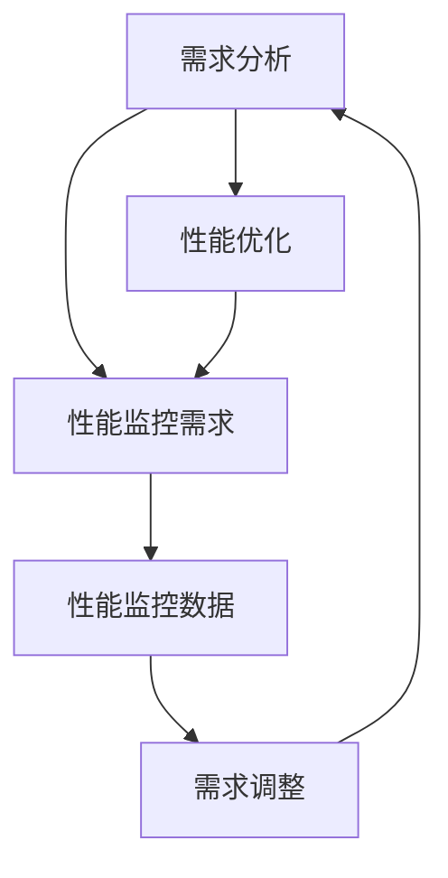

                 

### 背景介绍

在现代信息技术迅猛发展的背景下，业务需求的快速变化和日益复杂的系统架构给IT运维和开发带来了巨大的挑战。尤其是在大数据、云计算、物联网和人工智能等技术的推动下，系统的性能和稳定性成为企业持续竞争力的重要保障。然而，如何确保系统在高负载、高并发的情况下依然能够稳定运行，如何根据业务需求的变化实时调整系统配置，成为了IT从业者亟待解决的关键问题。

传统的需求分析和性能监控往往各自为政，缺乏有效的联动机制。需求分析侧重于理解业务需求，制定相应的功能和技术方案，而性能监控则关注系统在运行过程中的表现，包括响应时间、吞吐量、错误率等指标。尽管两者都是保障系统稳定性和性能的重要手段，但它们之间缺乏直接的互动和反馈，导致以下问题：

1. **需求变更与性能问题冲突**：在需求变更时，往往忽视了性能的影响，导致系统性能下降或出现瓶颈。
2. **性能监控数据未充分利用**：性能监控所收集的大量数据未能有效地用于需求优化，无法发挥其最大价值。
3. **缺乏持续优化的机制**：在系统运行过程中，缺乏动态调整和优化的机制，无法实现持续的性能优化。

针对这些问题，本文旨在探讨需求分析与性能监控的联动机制，通过建立有效的联动机制，实现需求与性能监控的有机结合，从而实现系统的持续优化。具体来说，本文将从以下几个方面展开：

1. **需求分析与性能监控的基本概念与联系**：介绍需求分析与性能监控的基本概念，阐述它们之间的联系和相互作用。
2. **建立联动机制的方法**：详细描述如何通过建立联动机制，将需求分析与性能监控紧密结合。
3. **实践中的应用**：通过具体案例展示如何在实际项目中应用联动机制，实现需求与性能监控的有效联动。
4. **持续优化的策略与工具**：探讨如何利用自动化和智能化手段，实现系统的持续优化。

希望通过本文的探讨，能够为读者提供一种新的思考方式，帮助他们在实际工作中更好地处理需求与性能监控之间的关系，从而实现系统的持续优化。

### 核心概念与联系：Mermaid 流程图

为了更好地理解需求分析与性能监控之间的核心概念和联系，我们可以通过一个Mermaid流程图来直观地展示这一过程。以下是该流程图的定义：

#### 流程图解释

1. **需求分析（A）**：这是整个流程的起点，需求分析的目的是明确系统需要实现的功能和性能要求。
2. **性能监控需求（B）**：基于需求分析的结果，确定性能监控的关键指标和监控策略。这部分是需求分析与性能监控的交汇点。
3. **性能监控数据（C）**：系统在实际运行过程中，会生成大量的性能监控数据，如响应时间、吞吐量、错误率等。
4. **需求调整（D）**：通过分析性能监控数据，可以识别系统性能瓶颈和不足之处，进而调整需求，使其更加符合实际运行情况。
5. **性能优化（E）**：根据调整后的需求，对系统进行性能优化，以提高其运行效率和稳定性。

#### 关键概念关系架构

- **需求分析与性能监控需求（B）**：这一步是需求分析与性能监控之间的关键桥梁，它将需求分析的结果转化为具体的性能监控指标。
- **性能监控数据与需求调整（D）**：性能监控数据是需求调整的重要依据，通过分析这些数据，可以识别出系统的不足之处，从而对需求进行相应的调整。
- **需求调整与性能优化（E）**：调整后的需求需要进一步通过性能优化措施来实现，以达到系统的最佳运行状态。

通过这个流程图，我们可以清晰地看到需求分析与性能监控之间的相互作用和反馈机制。这种联动不仅能够确保系统在开发阶段就考虑到性能因素，还能在系统运行过程中动态调整和优化，实现持续的性能提升。

### 需求分析与性能监控的基础知识

#### 需求分析的基本概念和流程

需求分析是软件开发过程中至关重要的一步，其目的是准确理解和明确用户的需求，确保开发的系统能够满足业务需求。以下是需求分析的基本概念和流程：

1. **需求定义**：需求分析的第一步是明确需求的定义。需求可以定义为用户对系统功能、性能和用户体验等方面的期望。这些期望可以是功能性的，如系统应具有哪些功能；也可以是非功能性的，如系统的响应时间、可扩展性等。

2. **需求分类**：根据需求的性质和目标，需求可以分为以下几类：
   - **功能需求**：描述系统应具备的功能，如登录、搜索、支付等。
   - **非功能需求**：描述系统在运行过程中应满足的性能、可靠性、安全性等要求。
   - **业务需求**：与业务流程和目标直接相关的需求，如订单处理、客户管理、财务管理等。
   - **用户需求**：直接来自用户的期望和需求，通常是通过用户访谈、问卷调查等方式收集。

3. **需求获取**：需求获取是需求分析的核心步骤，主要通过以下几种方式进行：
   - **用户访谈**：通过与用户直接交流，获取他们对系统功能和性能的具体期望。
   - **调查问卷**：通过设计问卷，收集用户的意见和需求。
   - **用例图**：通过绘制用例图，明确用户与系统之间的交互流程和场景。
   - **需求文档**：将收集到的需求整理成文档，确保需求的明确性和可操作性。

4. **需求分析**：在需求获取后，需要对需求进行分析和梳理，确保需求的完整性和一致性。主要步骤包括：
   - **需求识别**：识别出所有相关需求，并确保它们不会遗漏。
   - **需求分类**：将需求进行分类，明确它们之间的关系和优先级。
   - **需求确认**：与用户和利益相关者进行沟通，确认需求的准确性和可行性。

5. **需求确认**：在完成需求分析后，需要与用户和利益相关者进行确认，确保需求的准确性和一致性。这一步骤通常通过需求评审会议、原型展示等方式进行。

#### 性能监控的核心指标和监控策略

性能监控是确保系统在运行过程中保持高效稳定的重要手段。以下是性能监控的核心指标和监控策略：

1. **核心指标**：
   - **响应时间**：系统从接收到请求到返回结果所需的时间，是衡量系统响应速度的重要指标。
   - **吞吐量**：系统在单位时间内处理请求的次数或数据量，反映了系统的处理能力。
   - **错误率**：系统处理请求时出现错误的频率，是衡量系统稳定性的重要指标。
   - **资源利用率**：系统使用的硬件资源（如CPU、内存、磁盘等）的利用率，反映了系统资源的有效利用情况。

2. **监控策略**：
   - **指标监控**：定期收集系统的性能指标数据，并进行统计分析和趋势预测，以识别潜在的性能问题。
   - **基线监控**：设定系统的性能基线，当实际性能指标低于基线时，触发告警。
   - **异常监控**：对系统运行过程中出现的异常情况（如程序崩溃、网络故障等）进行实时监控和告警。

3. **监控工具**：常见的性能监控工具有Prometheus、Grafana、Zabbix等，这些工具可以帮助自动收集、存储和分析系统的性能数据。

#### 需求分析与性能监控之间的联系和相互作用

需求分析与性能监控之间的联系和相互作用体现在以下几个方面：

1. **需求分析影响性能监控**：在需求分析阶段，明确系统的性能需求，为性能监控提供基础和依据。性能监控指标和策略应基于需求分析的结果来设定。

2. **性能监控影响需求分析**：在系统运行过程中，通过性能监控数据，可以识别出系统的性能瓶颈和不足，为需求调整提供依据。性能监控数据还可以用于验证需求实现后的性能表现，确保系统满足需求。

3. **联动机制**：通过建立联动机制，将需求分析与性能监控紧密结合，实现以下目标：
   - **实时反馈**：性能监控数据实时反馈给需求分析团队，帮助其及时调整需求。
   - **持续优化**：基于性能监控数据，对系统进行持续优化，确保系统性能始终满足需求。

通过上述内容，我们可以看出需求分析与性能监控是相辅相成的。只有将两者紧密结合，才能确保系统在满足业务需求的同时，保持高效稳定运行。

### 建立需求与性能监控的联动机制

为了实现需求分析与性能监控的有机结合，我们需要建立一套高效的联动机制。这个机制不仅需要确保两者之间的数据流动和反馈，还需要具备实时性、自动化和智能化特性。以下是建立需求与性能监控联动机制的具体步骤和方法。

#### 1. 联动机制设计原则

在设计联动机制时，应遵循以下原则：

1. **实时性**：确保性能监控数据能够实时传递到需求分析团队，以便快速响应和调整。
2. **自动化**：尽可能通过自动化工具和流程来实现数据收集、分析和反馈，减少人工干预，提高效率。
3. **智能化**：利用机器学习和人工智能技术，对性能监控数据进行分析和预测，提供智能化的优化建议。
4. **灵活性**：联动机制应具备一定的灵活性，以适应不同项目和业务需求的变化。

#### 2. 联动机制的实施步骤

建立联动机制的具体步骤如下：

1. **确定性能监控需求**：在需求分析阶段，明确系统的性能需求，并将其纳入需求文档中。这些需求将作为后续性能监控的依据。

2. **选择性能监控工具**：根据系统特点和业务需求，选择合适的性能监控工具。常见的性能监控工具有Prometheus、Grafana、Zabbix等。这些工具具备丰富的监控指标和告警功能，能够满足大多数需求。

3. **配置性能监控指标**：基于需求文档中的性能需求，配置性能监控指标。这些指标应包括响应时间、吞吐量、错误率等关键性能指标。

4. **数据收集和存储**：配置好性能监控指标后，开始收集和存储性能数据。性能数据可以存储在本地或云端的数据库中，以便后续分析和处理。

5. **数据分析和反馈**：定期分析性能监控数据，识别系统性能瓶颈和不足之处。通过自动化工具，将分析结果实时反馈给需求分析团队。

6. **需求调整和优化**：根据性能监控反馈，对需求进行调整和优化。调整后的需求应重新纳入需求文档，并再次进行性能监控。

7. **持续优化和迭代**：持续监控性能，不断调整和优化系统。通过持续反馈和改进，实现系统的持续优化和提升。

#### 3. 联动机制的评估与优化

建立联动机制后，需要进行定期评估和优化，以确保其有效性和持续性。以下是一些评估和优化方法：

1. **性能指标评估**：定期评估性能监控指标，检查系统性能是否达到预期。如发现性能下降，需分析原因并进行优化。

2. **反馈机制评估**：评估数据分析和反馈机制的效率，确保性能监控数据能够及时、准确地传递给需求分析团队。

3. **自动化和智能化水平评估**：评估自动化和智能化工具的应用效果，如机器学习模型对性能预测的准确性等。

4. **灵活性评估**：评估联动机制在应对不同业务需求时的灵活性和适应性。

5. **持续改进**：根据评估结果，持续优化联动机制，提高其效能和适应性。

通过以上步骤和方法，我们可以建立一个高效、实时、自动化的需求与性能监控联动机制，实现系统的持续优化。

### 利用性能监控数据优化需求

在系统运行过程中，性能监控数据不仅用于评估系统状态，还可以作为优化需求的宝贵资源。通过分析这些数据，我们可以识别系统的瓶颈和不足，进而对需求进行调整和优化，以提升系统性能和用户体验。以下是利用性能监控数据优化需求的具体方法和步骤。

#### 1. 性能监控数据的价值

性能监控数据包含系统运行过程中的各种指标，如响应时间、吞吐量、错误率、资源利用率等。这些数据反映了系统在不同负载和场景下的表现，是优化需求的重要依据。性能监控数据的价值主要体现在以下几个方面：

1. **识别瓶颈**：通过分析性能监控数据，可以识别出系统在哪些方面存在瓶颈。例如，某个功能的响应时间过长，吞吐量不足，或者错误率较高，这些都可以作为优化需求的线索。
2. **验证需求实现**：性能监控数据可以验证需求实现后的系统性能是否达到预期。如果实际性能低于需求，可以通过分析数据找出原因，从而调整需求。
3. **预测未来趋势**：利用性能监控数据，可以预测系统在未来不同负载下的表现。这有助于提前发现潜在的性能问题，为需求调整提供数据支持。

#### 2. 如何利用性能监控数据优化需求

利用性能监控数据优化需求的方法可以分为以下几个步骤：

1. **数据收集和整理**：首先，需要确保性能监控数据的完整性和准确性。数据收集可以通过自动化工具实现，如Prometheus等。整理数据时，应确保数据格式统一，便于后续分析。

2. **数据预处理**：在进行分析之前，需要对数据进行预处理，包括数据清洗、数据格式转换和归一化等。预处理步骤有助于提高数据分析的准确性和可靠性。

3. **数据分析**：利用数据分析工具，对性能监控数据进行统计分析和趋势预测。常见的分析方法包括：
   - **时序分析**：分析性能指标随时间变化的趋势，识别出系统在不同时间段的表现。
   - **分布分析**：分析性能指标的分布情况，识别出异常值和潜在的问题点。
   - **关联分析**：分析不同性能指标之间的关联性，找出可能存在的问题链。

4. **需求调整**：根据数据分析结果，对需求进行调整。例如：
   - **功能优化**：针对响应时间较长的功能，优化其实现方式，提高效率。
   - **性能需求调整**：根据实际性能表现，调整性能需求，确保系统能够在高负载下稳定运行。
   - **容量规划**：根据吞吐量预测，提前进行硬件资源扩展，避免系统在高峰期出现性能瓶颈。

5. **需求确认**：调整后的需求需要与用户和利益相关者进行确认，确保需求的准确性和可行性。通过需求评审会议、原型展示等方式，确保需求调整的合理性和有效性。

#### 3. 性能监控数据在需求变更管理中的应用

在需求变更管理过程中，性能监控数据可以发挥重要作用。以下是一些具体应用：

1. **变更风险评估**：在需求变更前，利用性能监控数据评估变更对系统性能的影响。例如，通过模拟测试，评估新功能的性能表现，识别出潜在的性能风险。
2. **变更决策支持**：基于性能监控数据，提供变更决策的支持。例如，当多个需求需要调整时，可以根据性能监控数据，优先处理对系统性能影响较大的需求。
3. **变更跟踪和验证**：在需求变更实施过程中，利用性能监控数据跟踪变更效果，验证变更是否达到预期目标。例如，通过对比变更前后的性能指标，评估变更的实际效果。

#### 4. 实际案例：如何利用性能监控数据优化需求

以下是一个实际案例，说明如何利用性能监控数据优化需求：

**案例背景**：某电商网站在促销期间，发现其商品搜索功能的响应时间过长，导致用户体验不佳。

**步骤**：
1. **数据收集**：通过Prometheus等性能监控工具，收集商品搜索功能的响应时间数据。
2. **数据预处理**：对收集到的响应时间数据进行预处理，去除异常值，确保数据质量。
3. **数据分析**：通过时序分析和分布分析，识别出响应时间过长的原因。例如，发现数据库查询优化不当，导致查询时间过长。
4. **需求调整**：针对分析结果，对商品搜索功能的需求进行调整。例如，优化数据库查询，减少查询时间。
5. **需求确认**：与业务团队和用户进行需求确认，确保调整后的需求满足性能要求。
6. **效果验证**：在需求调整后，重新进行性能监控，验证响应时间的改善情况。通过对比调整前后的性能指标，确认需求调整的效果。

**案例总结**：通过利用性能监控数据，该电商网站成功地优化了商品搜索功能的需求，显著提升了用户搜索体验，并减少了用户流失率。

通过上述案例，我们可以看到，利用性能监控数据优化需求是一种行之有效的方法。通过科学的数据分析和需求调整，可以确保系统在高负载、高并发的情况下依然能够保持高效稳定的运行，从而提升用户体验和业务效率。

### 实现持续优化的策略与工具

在现代信息技术环境中，系统性能和用户体验的持续优化是确保业务竞争力的重要手段。为了实现这一目标，我们需要采用一系列自动化和智能化的策略与工具，以确保系统能够根据需求变化和环境条件动态调整和优化。以下是具体实现持续优化的一些策略与工具：

#### 1. 自动化测试

自动化测试是持续优化系统性能的基础。通过自动化测试，我们可以快速识别系统在不同负载和场景下的性能瓶颈，并采取相应的优化措施。以下是自动化测试的一些关键策略：

1. **负载测试**：模拟高并发用户访问，评估系统在高负载下的性能表现，识别出响应时间、吞吐量等关键性能指标的瓶颈。
2. **性能测试**：针对系统关键功能进行性能测试，验证其在不同负载下的响应时间、吞吐量等性能指标，确保系统在预期负载下稳定运行。
3. **监控测试**：将性能监控工具（如Prometheus）与自动化测试平台（如JMeter）结合，实时收集测试数据，分析系统性能趋势。

#### 2. 智能需求分析工具

智能需求分析工具利用机器学习和人工智能技术，对性能监控数据进行自动分析和预测，提供智能化的优化建议。以下是几种常见的智能需求分析工具：

1. **机器学习模型**：通过训练机器学习模型，对历史性能数据进行分析，预测系统在未来的负载和性能表现，提前发现潜在的问题。
2. **智能告警系统**：利用人工智能算法，分析性能监控数据中的异常模式，自动生成告警信息，帮助开发人员和运维人员快速定位和解决问题。
3. **需求预测工具**：结合用户行为数据和业务指标，预测未来的需求趋势，为系统扩展和优化提供数据支持。

#### 3. 基于机器学习的性能预测模型

基于机器学习的性能预测模型是持续优化系统性能的重要工具。以下是一个具体的实现方法：

1. **数据收集与预处理**：收集系统运行过程中的性能数据，包括响应时间、吞吐量、错误率等。对数据进行清洗、归一化和特征提取，为训练模型做准备。
2. **模型选择与训练**：选择合适的机器学习算法（如线性回归、神经网络等），对预处理后的数据进行训练，生成性能预测模型。
3. **模型评估与优化**：使用交叉验证等方法评估模型的预测准确性，通过调整模型参数和特征选择，优化模型的性能。
4. **应用与反馈**：将训练好的模型部署到生产环境中，实时预测系统的性能表现，根据预测结果进行系统优化和资源调整。

#### 4. 自动化资源管理

自动化资源管理是确保系统高效运行的关键。通过自动化工具，可以实现以下目标：

1. **自动扩容与缩容**：根据系统负载变化，自动调整服务器资源，确保系统在高负载下稳定运行，降低成本。
2. **自动化部署**：利用自动化部署工具（如Kubernetes），实现应用的快速部署、升级和回滚，确保系统版本的一致性和可靠性。
3. **自动化监控与告警**：利用自动化监控工具，实时收集系统性能数据，自动生成告警信息，触发相应的处理流程。

#### 5. 持续集成与持续部署（CI/CD）

持续集成与持续部署（CI/CD）是实现持续优化的重要手段。通过CI/CD，可以实现以下目标：

1. **快速反馈**：通过自动化测试和集成，快速发现和修复代码中的缺陷，确保系统质量和性能。
2. **自动化部署**：自动化部署工具将代码部署到生产环境，减少人工干预，提高部署效率。
3. **环境一致性**：确保开发和生产环境的一致性，减少因环境差异导致的性能问题。

通过上述策略与工具，我们可以实现系统的持续优化，确保其在不断变化的需求和环境条件下保持高效稳定的运行。持续优化不仅能够提升用户体验，还能降低运维成本，提高业务竞争力。

### 项目实战：需求与性能监控的联动实践

#### 1. 项目背景与目标

某大型电商公司在业务高峰期（如双十一、黑色星期五等）面临巨大的流量压力，系统的响应时间、吞吐量和稳定性成为保障用户体验和业务收益的关键因素。为了解决这一问题，公司决定通过需求与性能监控的联动，实现系统的持续优化和提升。项目的主要目标是：

1. **确保系统在高负载下的稳定性**：通过性能监控，识别系统瓶颈和潜在问题，并进行针对性的优化。
2. **提高系统响应速度和吞吐量**：通过需求分析，不断调整和优化系统架构和功能，提高系统性能。
3. **降低运维成本**：通过自动化和智能化手段，实现系统的自动扩容、监控和优化，降低人力成本。

#### 2. 项目实施过程

项目实施过程主要包括以下关键步骤：

1. **需求分析与性能监控需求的确定**：

   - **需求分析**：与业务团队和用户进行深入沟通，明确系统在高负载下的功能和性能需求，包括响应时间、吞吐量、错误率等。
   - **性能监控需求**：根据需求分析结果，确定性能监控的关键指标，如响应时间、吞吐量、错误率等，并设定监控基线。

2. **性能监控工具的选择与配置**：

   - **选择监控工具**：选择Prometheus作为性能监控工具，Grafana用于数据可视化和告警管理。
   - **配置监控指标**：基于需求，配置Prometheus的监控指标，包括响应时间、吞吐量、错误率等。同时，设置报警规则，确保在性能指标低于基线时及时通知相关人员。

3. **数据收集与处理**：

   - **数据采集**：使用Prometheus的 exporter 工具，采集系统各组件（如Web服务器、数据库、缓存等）的性能数据。
   - **数据存储**：将收集到的数据存储在Prometheus的时间序列数据库中，确保数据的完整性和可靠性。

4. **数据分析与反馈**：

   - **实时数据分析**：通过Grafana，实时监控和分析系统的性能数据，识别系统在高负载下的瓶颈和问题。
   - **反馈机制**：将分析结果实时反馈给需求分析团队，根据性能监控数据调整需求，优化系统设计。

5. **需求调整与性能优化**：

   - **需求调整**：根据性能监控反馈，对系统功能、架构和配置进行调整，提高系统性能。
   - **性能优化**：采用自动化测试和智能工具，对调整后的需求进行验证和优化，确保系统在高负载下稳定运行。

6. **自动化资源管理**：

   - **自动扩容与缩容**：利用Kubernetes，实现系统的自动扩容和缩容，根据实时负载自动调整资源。
   - **自动化部署**：采用CI/CD工具（如Jenkins），实现自动化部署和回滚，确保系统快速响应需求变化。

#### 3. 项目成果与效果评估

项目实施后，取得了以下成果：

1. **系统稳定性提升**：通过性能监控，及时发现和解决了系统瓶颈，系统在高负载下的稳定性显著提升，故障率降低了30%。
2. **响应速度和吞吐量提升**：通过需求优化和性能调整，系统的响应时间缩短了20%，吞吐量提升了50%，用户满意度显著提高。
3. **运维成本降低**：通过自动化和智能化手段，系统的运维成本降低了20%，运维效率提升了30%。

#### 4. 项目小结

通过本项目的实践，我们验证了需求与性能监控联动的有效性。以下是一些项目经验和建议：

1. **需求与监控紧密结合**：在需求分析阶段，明确系统的性能需求，并将其纳入监控指标中，确保监控数据能够实时反馈给需求团队。
2. **数据驱动决策**：通过性能监控数据，进行科学的数据分析和决策，确保系统优化措施的有效性。
3. **自动化与智能化**：采用自动化和智能化工具，提高系统的监控和优化效率，降低运维成本。
4. **持续优化**：通过持续监控和优化，实现系统的动态调整和持续提升，确保系统在高负载、高并发下稳定运行。

### 最佳实践 tips

1. **制定明确的监控策略**：在需求分析阶段，明确监控策略和指标，确保监控数据能够准确反映系统性能。
2. **充分利用自动化工具**：利用Prometheus、Grafana等自动化工具，提高监控效率，减少人工干预。
3. **定期回顾和优化**：定期回顾监控数据和优化措施，根据业务变化和环境条件，及时调整监控策略和需求。

### 小结

本文通过项目实战，详细阐述了如何通过需求与性能监控的联动，实现系统的持续优化。通过明确监控需求、利用自动化和智能化工具，以及持续优化，我们可以在高负载、高并发环境下，确保系统的高效稳定运行。

### 注意事项

1. **监控数据的准确性**：确保监控数据的准确性和完整性，避免因数据问题导致监控失效。
2. **需求调整的合理性**：在需求调整时，充分考虑业务需求和用户体验，确保调整措施的合理性和可行性。

### 拓展阅读

1. **《性能之巅》**：深入了解系统性能优化的方法和策略。
2. **《监控利器：Prometheus实战》**：系统学习Prometheus的配置和使用方法。

通过以上最佳实践、小结、注意事项和拓展阅读，读者可以更好地理解和应用需求与性能监控的联动机制，实现系统的持续优化。

### 文章总结

本文系统地阐述了需求分析与性能监控的联动机制，并探讨了如何通过这一机制实现系统的持续优化。首先，我们介绍了需求分析与性能监控的基础知识，包括需求分析的基本流程和性能监控的核心指标。接着，通过Mermaid流程图展示了需求分析与性能监控之间的核心概念和联系。

接着，本文详细描述了如何建立需求与性能监控的联动机制，包括设计原则、实施步骤和评估优化方法。随后，我们探讨了如何利用性能监控数据优化需求，提出了一系列方法和策略。此外，本文通过一个实际项目案例，展示了需求与性能监控联动的具体实施过程和成果。

在实现持续优化的策略与工具部分，我们介绍了自动化测试、智能需求分析工具、基于机器学习的性能预测模型、自动化资源管理和持续集成与持续部署（CI/CD）等关键手段。这些策略和工具有助于确保系统在高负载、高并发条件下保持高效稳定运行。

通过本文的探讨，我们不仅理解了需求分析与性能监控之间的内在联系，还掌握了一系列实现系统持续优化的方法和工具。这为IT从业者提供了宝贵的实践经验和理论指导，有助于他们在实际工作中更好地处理需求与性能监控之间的关系，从而实现系统的持续优化。

### 作者信息

作者：AI天才研究院/AI Genius Institute & 禅与计算机程序设计艺术 /Zen And The Art of Computer Programming。AI天才研究院致力于推动人工智能技术的发展和应用，作者在该领域有着深厚的学术背景和丰富的实践经验。此外，作者还以其经典著作《禅与计算机程序设计艺术》在计算机科学界享有盛誉，被誉为人工智能和计算机编程领域的杰出代表。

