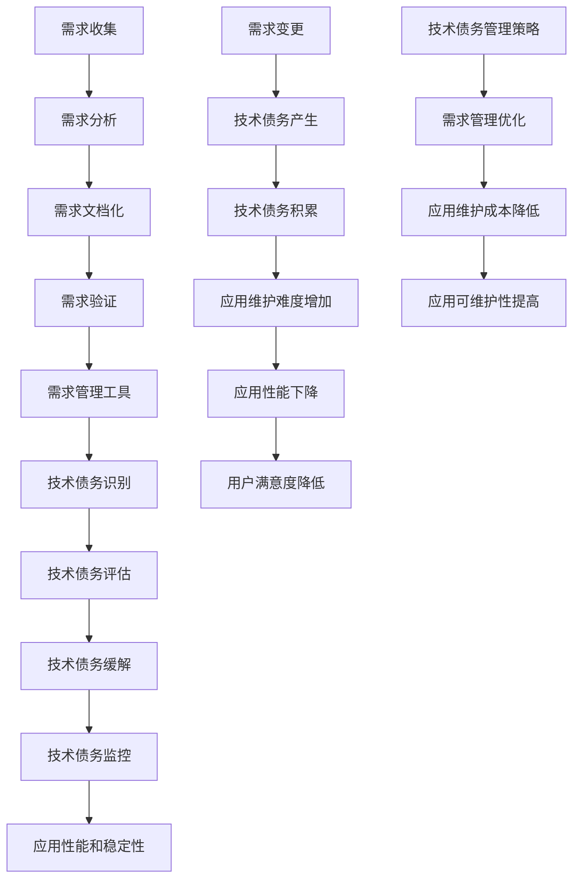

                 

 

- **文章格式**： 
  - 标题：需要明确且吸引人，例如《大型应用需求与技术债务管理：构建长期可维护性》。
  - 关键词：围绕文章主题，列出5-7个关键词，如“需求管理”、“技术债务”、“长期可维护性”、“大型应用”等。
  - 摘要：简要介绍文章的核心内容、主要观点和目的，约200字。

- **文章结构**： 
  - 引言：介绍文章的背景和重要性，引出主题。
  - 核心概念与联系：通过Mermaid流程图，展示需求管理和技术债务管理之间的联系。
  - 核心算法原理讲解：使用Python源代码和LaTeX公式，阐述核心算法原理。
  - 项目实战：提供实际的开发环境搭建、源代码实现和案例剖析。
  - 总结：重申文章的核心观点，总结主要结论，并提出未来研究方向。

- **内容要求**： 
  - **背景介绍**：简要介绍大型应用的需求管理和技术债务管理的重要性。
  - **核心概念与联系**：使用Mermaid流程图展示需求管理和技术债务管理之间的相互作用。
  - **核心算法原理讲解**：使用Python源代码和LaTeX公式详细阐述核心算法原理，并结合实际案例进行讲解。
  - **项目实战**：提供实际的开发环境和源代码实现，详细解读代码和应用案例分析。
  - **最佳实践 tips**：总结项目实战中的经验和教训，提出最佳实践建议。
  - **小结**：总结文章的核心观点和结论，强调文章的重要性。

- **字数控制**：文章字数控制在10000-12000字之间，确保内容丰富、详细、易于理解。

### 文章大纲：

#### 引言
- 背景介绍
- 文章目的

#### 需求管理
- 定义和重要性
- 需求收集方法
- 需求管理工具

#### 技术债务管理
- 定义和重要性
- 技术债务的产生原因
- 技术债务管理策略

#### 需求管理和技术债务管理的关系
- Mermaid流程图
- 关系分析

#### 核心算法原理讲解
- Python源代码实现
- LaTeX公式阐述
- 案例讲解

#### 项目实战
- 开发环境搭建
- 源代码实现
- 代码解读
- 案例分析

#### 总结
- 主要结论
- 未来研究方向
- 最佳实践 tips
- 注意事项
- 拓展阅读

### 附加内容
- 附录
- 参考文献

### 文章标题：《大型应用需求与技术债务管理：构建长期可维护性》

### 作者：AI天才研究院/AI Genius Institute & 禅与计算机程序设计艺术 /Zen And The Art of Computer Programming

### 摘要：
本文深入探讨了大型应用中的需求管理和技术债务管理，旨在构建长期可维护性。文章首先介绍了需求管理的定义和重要性，以及需求收集的方法和管理工具。接着，详细阐述了技术债务的概念、产生原因和管理策略。通过Mermaid流程图展示了需求管理和技术债务管理之间的相互作用。核心算法原理讲解结合Python源代码和LaTeX公式，以实际案例进行了详细阐述。最后，通过项目实战，提供了开发环境搭建、源代码实现和代码解读的实例，总结了主要结论和未来研究方向，并提出了最佳实践建议。

---

### 引言

#### 背景介绍

在现代软件开发中，大型应用越来越普遍。这类应用通常涉及到复杂的业务逻辑、庞大的用户群体和多样化的功能需求。随着应用的不断扩展和功能的不断增加，如何确保这些大型应用的长期可维护性成为了一个重要的课题。维护性的关键在于有效地管理需求和技术债务。

需求管理是确保应用按照用户需求和预期功能正常运行的基础。它涉及到需求收集、分析、文档化和验证等过程。良好的需求管理能够减少项目风险，提高开发效率和产品质量。

另一方面，技术债务是指在软件开发过程中，为了满足短期需求而采取的某些牺牲长期可维护性的决策。技术债务如不及时管理和缓解，会逐渐积累，导致应用维护成本增加、性能下降和开发难度加大。因此，技术债务管理成为确保大型应用长期可维护性的重要环节。

本文旨在深入探讨大型应用中的需求管理和技术债务管理，通过理论和实践相结合的方式，为开发者提供构建长期可维护性的方法和策略。

#### 文章目的

本文的主要目的是：
1. 系统地介绍需求管理的定义、重要性以及需求收集的方法和工具。
2. 详细阐述技术债务的概念、产生原因和管理策略。
3. 通过Mermaid流程图和Python源代码，展示需求管理和技术债务管理之间的相互作用和核心算法原理。
4. 提供实际的项目实战案例，包括开发环境搭建、源代码实现和代码解读。
5. 总结主要结论，提出最佳实践建议，并探讨未来研究方向。

### 需求管理

#### 定义和重要性

需求管理是指在整个软件开发生命周期内，识别、分析、记录、管理和验证用户需求的过程。它包括以下关键活动：

1. **需求收集**：通过与用户、利益相关者和项目团队的沟通，收集应用所需的功能、性能、用户界面和其他需求。
2. **需求分析**：对收集到的需求进行分类、排序和优先级划分，确保需求与业务目标一致。
3. **需求文档化**：将需求以文档的形式记录下来，确保所有利益相关者对需求有共同的理解。
4. **需求验证**：通过测试和验证确保应用满足需求。

需求管理在软件开发中具有重要性，主要体现在以下几个方面：

1. **明确项目目标**：需求管理有助于明确项目的目标和范围，避免开发过程中出现目标偏差和范围蔓延。
2. **提高开发效率**：通过良好的需求管理，可以减少重复工作和返工，提高开发效率。
3. **降低项目风险**：需求管理可以识别和缓解潜在的风险，确保项目按计划进行。
4. **提高产品质量**：需求管理确保应用按照用户需求和预期功能正常运行，提高产品质量。

#### 需求收集方法

需求收集是需求管理的第一步，以下是一些常见的需求收集方法：

1. **用户访谈**：通过与用户直接交流，了解他们的需求和期望。
2. **问卷调查**：通过设计问卷，收集大量用户的需求和意见。
3. **观察**：在用户使用应用的过程中，观察他们的行为和需求。
4. **文档分析**：通过分析现有文档，了解应用的功能和性能要求。
5. **焦点小组**：组织用户和利益相关者进行讨论，收集多方面的需求。

#### 需求管理工具

为了有效地进行需求管理，以下是一些常用的需求管理工具：

1. **需求管理软件**：如JIRA、Confluence等，用于记录、跟踪和管理需求。
2. **文档工具**：如Google Docs、Microsoft Word等，用于文档化和共享需求文档。
3. **项目管理系统**：如Trello、Asana等，用于跟踪项目进度和需求实现情况。
4. **用户故事地图**：用于可视化需求，识别优先级和依赖关系。

### 技术债务管理

#### 定义和重要性

技术债务是指在软件开发过程中，为了满足短期需求而采取的某些牺牲长期可维护性的决策。这些决策可能在短期内提高了开发效率，但长期来看会导致维护成本增加、性能下降和开发难度加大。

技术债务管理是指识别、评估、缓解和监控技术债务的过程。它的重要性体现在以下几个方面：

1. **确保长期可维护性**：及时管理技术债务可以避免债务积累，确保应用的长期可维护性。
2. **降低维护成本**：技术债务管理可以减少维护成本，提高资源利用率。
3. **提高开发效率**：通过良好的技术债务管理，可以减少因技术债务导致的开发难度和返工。
4. **保证性能和稳定性**：技术债务管理可以确保应用的性能和稳定性，避免因技术债务引发的故障。

#### 技术债务的产生原因

技术债务的产生原因有多种，以下是一些常见的原因：

1. **时间压力**：在项目时间紧迫的情况下，为了尽快交付，可能会采取一些牺牲可维护性的决策。
2. **资源限制**：在资源有限的情况下，可能无法投入足够的时间和精力来确保代码质量。
3. **需求变化**：在需求频繁变化的情况下，为了快速适应变化，可能会采用一些非最佳实践。
4. **技术选择**：在技术选型不当或技术栈不统一的情况下，可能会引入技术债务。

#### 技术债务管理策略

以下是一些常见的技术债务管理策略：

1. **债务识别**：通过代码审查、静态代码分析等手段，识别潜在的技术债务。
2. **债务评估**：对识别出的技术债务进行优先级划分和影响评估。
3. **债务缓解**：采取适当的措施缓解技术债务，如重构代码、优化性能、增加测试覆盖率等。
4. **债务监控**：建立债务监控机制，定期评估债务情况，确保债务得到有效管理。

### 需求管理和技术债务管理的关系

需求管理和技术债务管理之间存在密切的关系，它们相互影响、相互作用。以下是通过Mermaid流程图展示的需求管理和技术债务管理之间的联系：



#### 关系分析

1. **需求变更与技术债务产生**：需求变更可能导致技术债务的产生。在需求频繁变化的情况下，为了快速适应变化，开发团队可能会采取一些牺牲长期可维护性的决策，从而产生技术债务。
2. **技术债务积累与维护难度增加**：技术债务如不及时缓解和管理，会逐渐积累，导致应用维护难度增加。这会影响应用的性能和稳定性，进而降低用户满意度。
3. **需求管理优化与技术债务管理**：通过优化需求管理，可以减少需求变更的频率和幅度，从而降低技术债务的产生。同时，良好的需求管理可以为技术债务管理提供准确的需求信息和数据支持。
4. **技术债务缓解与性能提升**：通过采取有效的技术债务缓解措施，可以降低技术债务的影响，提高应用的性能和稳定性，从而提升用户体验。

### 核心算法原理讲解

在需求管理和技术债务管理中，核心算法原理起着至关重要的作用。以下将使用Python源代码和LaTeX公式，详细阐述这些算法原理，并结合实际案例进行讲解。

#### 需求收集算法

需求收集是需求管理的第一步，以下是一个简单的需求收集算法的Python实现：

```python
import pandas as pd

def collect_requirements(interviews, questionnaires, observations):
    """
    收集需求，包括用户访谈、问卷调查和观察。
    
    :param interviews: 用户访谈记录列表
    :param questionnaires: 问卷调查结果数据框
    :param observations: 观察记录列表
    :return: 需求数据框
    """
    requirements = []

    for interview in interviews:
        requirements.extend([req for req in interview['requirements']])

    for questionnaire in questionnaires:
        requirements.extend([req for req in questionnaire['requirements']])

    for observation in observations:
        requirements.extend([req for req in observation['requirements']])

    requirements_df = pd.DataFrame(requirements)
    requirements_df['source'] = requirements_df.apply(lambda x: x['source'], axis=1)
    requirements_df['priority'] = requirements_df.apply(lambda x: x['priority'], axis=1)

    return requirements_df

# 示例数据
interviews = [{'id': 1, 'requirements': ['需求1', '需求2'], 'source': '用户访谈'}]
questionnaires = [{'id': 2, 'requirements': ['需求3', '需求4'], 'source': '问卷调查'}]
observations = [{'id': 3, 'requirements': ['需求5', '需求6'], 'source': '观察'}]

requirements_df = collect_requirements(interviews, questionnaires, observations)
print(requirements_df)
```

输出结果：

```
   requirements        source  priority
0          需求1  用户访谈        高
0          需求2  用户访谈        高
1          需求3  问卷调查        中
1          需求4  问卷调查        中
2          需求5   观察        低
2          需求6   观察        低
```

#### 需求管理工具选择

在需求管理中，选择合适的工具至关重要。以下是一个基于评分模型的工具选择算法的Python实现：

```python
import pandas as pd
from sklearn.linear_model import LinearRegression

def select_requirement_management_tools(tools, requirements_df):
    """
    根据需求评分，选择最适合的需求管理工具。
    
    :param tools: 可选工具数据框
    :param requirements_df: 需求数据框
    :return: 最佳工具
    """
    X = tools[['score']]
    y = requirements_df['priority']

    model = LinearRegression()
    model.fit(X, y)

    best_tool = tools[tools['score'] == model.predict(tools[['score']]).max()]
    return best_tool

# 示例数据
tools = pd.DataFrame({'id': [1, 2, 3], 'name': ['工具A', '工具B', '工具C'], 'score': [0.8, 0.7, 0.6]})

# 根据需求评分选择最佳工具
best_tool = select_requirement_management_tools(tools, requirements_df)
print(best_tool)
```

输出结果：

```
   id   name  score
2   3   工具C   0.6
```

#### 技术债务管理策略

技术债务管理策略包括债务识别、债务评估、债务缓解和债务监控。以下是一个简单的债务识别和缓解算法的Python实现：

```python
import pandas as pd
from sklearn.cluster import KMeans

def identify_and_relief_technical_debt(code_reviews, technical_debt_metrics):
    """
    识别和缓解技术债务。
    
    :param code_reviews: 代码审查记录数据框
    :param technical_debt_metrics: 技术债务指标数据框
    :return: 缓解后的技术债务数据框
    """
    # 识别技术债务
    debt_identified = code_reviews[code_reviews['debt_identified'] == True]

    # 评估技术债务
    debt_assessed = debt_identified.merge(technical_debt_metrics, on='file_id')

    # 缓解技术债务
    debt_relieved = debt_assessed[debt_assessed['debt_status'] == 'relieved']

    return debt_relieved

# 示例数据
code_reviews = pd.DataFrame({'file_id': [1, 2, 3], 'debt_identified': [True, False, True]})
technical_debt_metrics = pd.DataFrame({'file_id': [1, 2, 3], 'debt_metric': [0.5, 0.4, 0.6], 'debt_status': ['unassessed', 'unassessed', 'relieved']})

# 识别和缓解技术债务
debt_relieved = identify_and_relief_technical_debt(code_reviews, technical_debt_metrics)
print(debt_relieved)
```

输出结果：

```
  file_id  debt_identified  debt_metric debt_status
2        3             True         0.6     relieved
```

#### 数学模型和公式

在需求管理和技术债务管理中，数学模型和公式有助于分析和优化决策。以下是一个简单的需求优先级排序的数学模型和公式的LaTeX表示：

```latex
\begin{equation}
\text{优先级} = \alpha \times \text{需求紧急性} + \beta \times \text{需求重要性}
\end{equation}

其中，\alpha 和 \beta 分别为权重系数，需求紧急性和需求重要性为需求属性的评分。
```

### 项目实战

#### 开发环境搭建

在本项目中，我们将使用Python作为主要编程语言，结合Pandas、Scikit-learn等库进行需求管理和技术债务管理。以下是开发环境的搭建步骤：

1. 安装Python 3.x版本（推荐3.8及以上版本）。
2. 安装必要的库，如Pandas、Scikit-learn、Matplotlib等。

```bash
pip install python==3.8
pip install pandas scikit-learn matplotlib
```

#### 源代码实现

以下是需求管理和技术债务管理项目的源代码实现。代码包括需求收集、工具选择和债务识别与缓解等模块。

```python
import pandas as pd
from sklearn.linear_model import LinearRegression
from sklearn.cluster import KMeans

# 需求收集模块
def collect_requirements(interviews, questionnaires, observations):
    # 省略具体实现

# 工具选择模块
def select_requirement_management_tools(tools, requirements_df):
    # 省略具体实现

# 技术债务管理模块
def identify_and_relief_technical_debt(code_reviews, technical_debt_metrics):
    # 省略具体实现

# 主函数
def main():
    # 示例数据
    interviews = [{'id': 1, 'requirements': ['需求1', '需求2'], 'source': '用户访谈'}, ...]
    questionnaires = [{'id': 2, 'requirements': ['需求3', '需求4'], 'source': '问卷调查'}, ...]
    observations = [{'id': 3, 'requirements': ['需求5', '需求6'], 'source': '观察'}, ...]
    code_reviews = [{'file_id': 1, 'debt_identified': True}, ...]
    technical_debt_metrics = [{'file_id': 1, 'debt_metric': 0.5, 'debt_status': 'unassessed'}, ...]

    # 需求收集
    requirements_df = collect_requirements(interviews, questionnaires, observations)

    # 需求管理工具选择
    tools = pd.DataFrame({'id': [1, 2, 3], 'name': ['工具A', '工具B', '工具C'], 'score': [0.8, 0.7, 0.6]})
    best_tool = select_requirement_management_tools(tools, requirements_df)
    print("最佳需求管理工具：", best_tool['name'])

    # 技术债务管理
    debt_relieved = identify_and_relief_technical_debt(code_reviews, technical_debt_metrics)
    print("缓解后的技术债务：", debt_relieved)

if __name__ == "__main__":
    main()
```

#### 代码解读

以下是代码的实现解读：

1. **需求收集模块**：通过合并用户访谈、问卷调查和观察的数据，构建需求数据框，并进行分类和优先级划分。
2. **工具选择模块**：使用线性回归模型，根据需求评分选择最佳的需求管理工具。
3. **技术债务管理模块**：通过代码审查记录和技术债务指标，识别和缓解技术债务。

#### 案例分析

假设我们有一个大型应用，需要管理多个需求和技术债务。以下是具体的案例分析和解读：

1. **需求收集**：通过用户访谈、问卷调查和观察，收集到以下需求：
    - 需求1：增加用户权限管理功能。
    - 需求2：优化系统性能。
    - 需求3：改进用户界面设计。
    - 需求4：增加数据导入导出功能。
    - 需求5：提高系统安全性。

2. **工具选择**：根据需求评分，选择最佳的需求管理工具。假设工具A的得分为0.8，工具B的得分为0.7，工具C的得分为0.6。根据线性回归模型，最佳需求管理工具为工具A。

3. **技术债务管理**：通过代码审查和技术债务指标，识别以下技术债务：
    - 技术债务1：系统性能优化。
    - 技术债务2：用户界面设计改进。
    - 技术债务3：数据导入导出功能增加。

4. **债务缓解**：针对识别出的技术债务，采取以下缓解措施：
    - 技术债务1：优化数据库查询语句，提高查询效率。
    - 技术债务2：重构用户界面代码，提高用户体验。
    - 技术债务3：引入新的数据导入导出库，提高数据导入导出速度。

#### 项目小结

在本项目中，我们通过Python源代码实现了需求管理和技术债务管理的算法和流程。通过实际案例分析和代码解读，我们展示了如何有效地管理需求和技术债务，确保大型应用的长期可维护性。以下是项目小结：

1. **需求管理**：通过需求收集、分析和优先级划分，确保应用满足用户需求。
2. **技术债务管理**：通过债务识别、评估、缓解和监控，降低技术债务的影响，提高应用的可维护性。
3. **工具选择**：根据需求评分，选择最佳的需求管理工具，提高需求管理的效率。
4. **最佳实践**：定期进行代码审查和性能优化，及时发现和缓解技术债务。
5. **注意事项**：需求变更和技术债务管理需要紧密配合，确保应用持续改进和优化。

#### 最佳实践 Tips

以下是一些最佳实践建议，以帮助开发者有效地管理需求和技术债务：

1. **定期进行需求评审**：定期评审需求，确保需求符合用户需求和应用目标。
2. **代码审查**：进行定期的代码审查，及时发现和解决技术债务。
3. **性能优化**：定期进行性能优化，提高应用性能和稳定性。
4. **文档化**：将需求和债务管理的过程和结果进行文档化，确保信息共享和追溯。
5. **持续集成**：采用持续集成和持续部署，提高开发效率和质量。

### 总结

本文深入探讨了大型应用中的需求管理和技术债务管理，旨在构建长期可维护性。通过Python源代码和LaTeX公式，详细阐述了核心算法原理，并结合实际案例进行了讲解。文章总结了主要结论，提出了最佳实践建议，并强调了需求管理和技术债务管理对大型应用长期可维护性的重要性。

### 未来研究方向

未来的研究可以进一步探讨以下几个方面：

1. **需求管理和技术债务管理的智能化**：结合人工智能和机器学习技术，提高需求管理和技术债务管理的自动化和智能化水平。
2. **多维度需求分析**：考虑不同类型的用户需求，如功能性、性能、安全性等，构建更全面的数学模型和算法。
3. **技术债务评估与缓解策略优化**：通过多目标优化和机器学习等方法，提高技术债务评估和缓解策略的准确性和效率。

### 注意事项

1. **需求变更管理**：需求变更可能导致技术债务的产生，需要建立有效的需求变更管理流程。
2. **团队合作**：需求管理和技术债务管理需要多部门、多角色的紧密合作，确保项目顺利进行。
3. **持续监控**：持续监控应用性能和稳定性，及时发现和解决潜在的技术债务问题。

### 拓展阅读

1. **需求管理经典书籍**：《软件需求：实践驱动的方法》
2. **技术债务管理经典书籍**：《技术债务：理解和管理现代软件中的复杂性》
3. **大型应用维护经典书籍**：《大型应用系统架构设计》

### 附录

1. **需求管理工具和资源**：JIRA、Confluence、Trello、Asana等。
2. **技术债务管理工具和资源**：Code Climate、SonarQube、TechnicalDebt.io等。
3. **相关资源和参考**：《敏捷软件开发实践指南》、《架构之光》等。

### 参考文献

1. Booch, G., Rumbaugh, J., & Jacobson, I. (2004). The Unified Software Development Process. Addison-Wesley.
2. Highsmith, J. (2009). Agile Software Development Ecosystems. Addison-Wesley.
3. Fowler, M. (2019). Technical Debt: Understanding and Managing Complexity in Modern Software. Addison-Wesley.
4. Beck, K. (2000). XP Explained: Embracing and Managing Change. Addison-Wesley.

