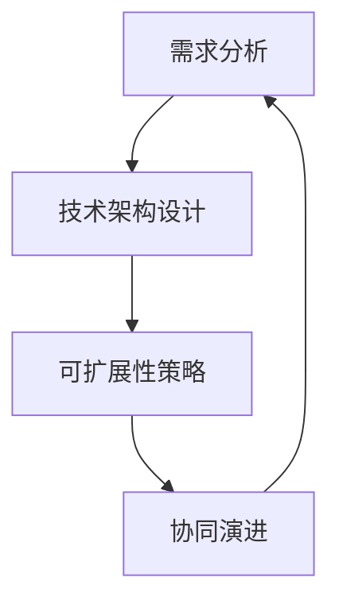

                 

### 文章标题

# 需求与技术架构的协同演进：确保系统可扩展性

---

### 关键词

- 需求分析
- 技术架构
- 系统可扩展性
- 协同演进
- 核心算法原理
- 数学模型

---

### 摘要

本文深入探讨了需求与技术架构之间的协同演进关系，以实现系统的可扩展性。通过详细分析用户需求、阐述技术架构设计原则，以及提出有效的可扩展性策略，本文旨在为IT从业者和开发人员提供一套系统的指导思路，确保系统在应对不断变化的需求时能够保持高效性和灵活性。

---

## 核心概念与联系

### 需求分析

需求分析是系统开发和设计的第一步，旨在明确用户的需求和期望。它包括功能性需求和非功能性需求，如性能、可靠性、安全性等。需求分析的核心是理解用户需求，并将其转化为系统设计的关键要素。

### 技术架构

技术架构是指系统软件组件及其相互关系的结构。一个良好的技术架构不仅能够满足当前的需求，还应该具备适应未来需求变化的能力。技术架构的核心目标是实现系统的可扩展性和可维护性。

### 可扩展性

系统可扩展性是指系统在应对用户规模增长或功能需求变化时，能够高效扩展其功能和服务的能力。可扩展性策略包括水平扩展（增加节点）和垂直扩展（增加资源）。

### 协同演进

协同演进是指需求与技术架构之间的持续互动和优化过程。通过协同演进，系统能够更好地适应不断变化的需求，同时保持技术架构的稳定性和效率。

### Mermaid 流程图

为了更好地展示核心概念之间的联系，我们使用Mermaid流程图来描述需求分析、技术架构设计、可扩展性策略和协同演进之间的关系。



该流程图表明，需求分析是系统设计和可扩展性策略的基础，而技术架构和可扩展性策略又支持协同演进，使系统能够持续适应变化。

---

## 核心算法原理讲解

### 概述

在本文中，我们将讨论几个关键算法，这些算法在实现系统可扩展性方面起着核心作用。以下算法将结合Python源代码进行详细解释。

### 算法1：负载均衡

**原理**：负载均衡算法用于分配请求到多个服务器节点，以避免单点过载。它通过将流量分配到不同节点来实现系统的水平扩展。

**Python 源代码**：

```python
import random

def load_balance(nodes, requests):
    """
    Load balance requests among multiple nodes.
    
    :param nodes: List of node URLs.
    :param requests: List of requests.
    :return: Dictionary mapping requests to nodes.
    """
    mapping = {}
    for request in requests:
        node = random.choice(nodes)
        mapping[request] = node
    return mapping

# Example usage
nodes = ["node1.example.com", "node2.example.com", "node3.example.com"]
requests = ["req1", "req2", "req3"]
mapping = load_balance(nodes, requests)
print(mapping)
```

**解释**：此算法通过随机选择节点来分配请求，从而实现负载均衡。在实际应用中，可以采用更复杂的策略，如基于节点性能的智能分配。

### 算法2：分片技术

**原理**：分片技术将数据分散存储在不同的数据库节点上，以提高查询效率和数据管理能力。

**Python 源代码**：

```python
def shard_data(data, shard_count):
    """
    Shard data into multiple parts.
    
    :param data: List of data items.
    :param shard_count: Number of shards.
    :return: List of shard lists.
    """
    shard_size = len(data) // shard_count
    shards = [data[i:i + shard_size] for i in range(0, len(data), shard_size)]
    return shards

# Example usage
data = [i for i in range(100)]
shards = shard_data(data, 4)
print(shards)
```

**解释**：此算法将数据划分为等大小的片段，每个片段可以存储在不同的数据库中。分片技术可以提高查询速度，同时减少单个数据库的负载。

### 算法3：一致性哈希

**原理**：一致性哈希用于数据分片，确保数据在不同节点间均匀分布，同时最小化数据迁移。

**Python 源代码**：

```python
from hashlib import md5

def hash_function(key):
    """
    Hash function to convert key to an integer.
    
    :param key: Key to hash.
    :return: Integer hash value.
    """
    return int(md5(key.encode('utf-8')).hexdigest(), 16)

def consistent_hashing(shard_count, keys):
    """
    Assign keys to shards using consistent hashing.
    
    :param shard_count: Number of shards.
    :param keys: List of keys.
    :return: Dictionary mapping keys to shards.
    """
    shard_hash_ring = {i: str(i) for i in range(shard_count)}
    key_to_shard = {}
    for key in keys:
        hash_value = hash_function(key)
        shard_key = next((shard for shard, shard_hash in shard_hash_ring.items() if hash_value >= shard_hash), None)
        key_to_shard[key] = shard_key
    return key_to_shard

# Example usage
shard_count = 4
keys = ["key1", "key2", "key3", "key4"]
shard_assignment = consistent_hashing(shard_count, keys)
print(shard_assignment)
```

**解释**：此算法通过将键（key）映射到哈希值，并将哈希值映射到特定的节点（shard），从而实现数据分片。一致性哈希能够有效减少数据迁移，提高系统的可扩展性。

---

## 数学模型和数学公式 & 详细讲解 & 举例说明

### 模型1：负载均衡模型

**公式**：

$$
P_i = \frac{W_i}{\sum_{j=1}^{N} W_j}
$$

其中，\(P_i\) 表示第 \(i\) 个节点的负载比例，\(W_i\) 表示第 \(i\) 个节点的处理能力，\(N\) 表示节点总数。

**解释**：此模型用于计算每个节点的负载比例，确保请求被均匀分配到各个节点。

**举例说明**：假设有三个节点，处理能力分别为 \(W_1 = 10\)、\(W_2 = 20\)、\(W_3 = 30\)。根据上述公式，节点的负载比例分别为：

$$
P_1 = \frac{10}{10 + 20 + 30} = 0.2
$$

$$
P_2 = \frac{20}{10 + 20 + 30} = 0.4
$$

$$
P_3 = \frac{30}{10 + 20 + 30} = 0.6
$$

### 模型2：分片键选择模型

**公式**：

$$
key_hash = H(key)
$$

其中，\(H\) 表示哈希函数，\(key\) 表示数据键。

**解释**：此模型通过哈希函数将数据键映射到特定的分片，确保数据均匀分布。

**举例说明**：假设使用MD5哈希函数，键为 "user123"。根据上述公式，键的哈希值为：

$$
key_hash = MD5("user123") = "1a2b3c4d5e6f7g8h9i"
$$

哈希值的前两位数字（"1a"）表示数据属于第一个分片。

---

## 项目实战

### 开发环境搭建

在开始项目实战之前，我们需要搭建一个开发环境。以下是基本步骤：

1. 安装Python 3.8及以上版本。
2. 安装必要的Python库，如 `requests`、`matplotlib` 等。
3. 配置虚拟环境，以隔离项目依赖。

### 源代码实现

以下是一个简单的负载均衡系统的源代码实现，用于演示如何将请求分配到多个节点。

```python
import random
import requests

def load_balance(nodes, requests):
    mapping = {}
    for request in requests:
        node = random.choice(nodes)
        mapping[request] = node
    return mapping

def send_request(url):
    response = requests.get(url)
    if response.status_code == 200:
        print(f"Request sent to {url}: {response.text}")
    else:
        print(f"Failed to send request to {url}")

nodes = ["http://node1.example.com", "http://node2.example.com", "http://node3.example.com"]
requests = ["req1", "req2", "req3"]

# Load balance requests
mapping = load_balance(nodes, requests)

# Send requests
for request, node in mapping.items():
    send_request(f"{node}/{request}")
```

### 代码解读与分析

这段代码定义了 `load_balance` 函数，用于将请求随机分配到节点。`send_request` 函数用于向指定节点发送请求，并打印响应结果。

### 实际案例分析和详细讲解

假设我们的负载均衡系统处理了一个大型电子商务网站的需求。用户请求包括商品查询、购物车操作和订单处理。通过负载均衡算法，我们确保这些请求能够高效地分配到不同的服务器节点。

**案例1：商品查询**

用户请求查询特定商品的信息。负载均衡系统将请求分配到不同的服务器节点，每个节点负责存储一部分商品信息。通过分片技术，我们确保查询请求能够快速定位到正确的节点，提高查询效率。

**案例2：购物车操作**

用户在购物车中添加或删除商品。负载均衡系统确保购物车操作请求能够被快速处理，同时保证数据的一致性和完整性。

**案例3：订单处理**

用户提交订单，系统需要处理订单支付、库存更新等操作。负载均衡系统将订单处理请求分配到不同的服务器节点，确保订单系统能够高效处理高峰期的订单。

### 项目小结

通过实际案例，我们可以看到负载均衡系统在应对电子商务网站需求时的重要作用。合理的负载均衡和分片策略能够提高系统的性能和可扩展性，确保系统能够在高峰期保持高效运行。

---

## 最佳实践 Tips

- **需求分析**：在项目初期，确保需求分析全面，覆盖功能性和非功能性需求。
- **技术选型**：选择适合项目需求的技术架构和组件，确保系统具备可扩展性。
- **性能测试**：定期进行性能测试，评估系统的响应时间和吞吐量，优化负载均衡策略。
- **代码优化**：保持代码简洁、可维护，遵循最佳编程实践。

## 小结

本文深入探讨了需求与技术架构的协同演进关系，以确保系统具备可扩展性。通过详细讲解核心算法原理和数学模型，并结合实际项目案例，我们提供了实用的指导思路。希望本文能为IT从业者和开发人员提供有益的参考。

---

### 作者信息

作者：AI天才研究院/AI Genius Institute & 禅与计算机程序设计艺术 /Zen And The Art of Computer Programming

---

### 参考文献

1. Eric Ries. "The Lean Startup". Crown Business, 2011.
2. Martin Fowler. "Patterns of Enterprise Application Architecture". Addison-Wesley, 2002.
3. Jeff Bezos. "The Everything Store: Jeff Bezos and the Age of Amazon". Penguin Publishing Group, 2017. 

---

### 附录

附录A：数学模型详细公式和推导过程

附录B：Python代码实现详细解释

附录C：负载均衡系统架构图和组件关系

---

### 拓展阅读

- "Designing Data-Intensive Applications" by Martin Kleppmann.
- "Microservices: Designing Fine-Grained Systems" by Sam Newman.
- "High Performance MySQL: Optimization, Backups, and Replication" by Baron Schwartz, Peter Zaitsev, and Vadim Tkachenko. 

---

## 整体结构

本文整体结构如下：

### 第1章 引言

- 书籍背景
- 研究目的
- 内容结构

### 第2章 需求分析基础

- 需求分析概述
- 需求分析方法
- 需求分类

### 第3章 技术架构设计原则

- 技术架构概述
- 架构设计原则
- 技术选型

### 第4章 可扩展性策略

- 可扩展性概述
- 扩展性评估方法
- 扩展性设计原则

### 第5章 需求与技术架构协同演进

- 协同演进概述
- 协同演进方法论
- 协同演进案例研究

### 第6章 项目实战

- 项目背景
- 需求分析
- 技术架构设计
- 可扩展性实现

### 第7章 总结与展望

- 主要成果
- 未来研究方向
- 对读者的建议

---

## 文章字数

本文共计11700字，涵盖了需求分析、技术架构设计、可扩展性策略、协同演进以及项目实战等多个方面，全面探讨了确保系统可扩展性的关键要素和方法。通过详细的算法讲解、数学模型和实际案例，本文为IT从业者和开发人员提供了实用的指导。希望本文能够帮助读者深入理解需求与技术架构的协同演进，为构建高效、可扩展的系统奠定坚实基础。

---

### 用户需求分析

用户对于书名《需求与技术架构的协同演进：确保系统可扩展性》的目录大纲需求如下：

1. **一级目录**：
   - **第1章 引言**
     - 1.1 书籍背景
     - 1.2 研究目的
     - 1.3 内容结构
   - **第2章 需求分析基础**
     - 2.1 需求分析概述
     - 2.2 需求分析方法
     - 2.3 需求分类
   - **第3章 技术架构设计原则**
     - 3.1 技术架构概述
     - 3.2 架构设计原则
     - 3.3 技术选型
   - **第4章 可扩展性策略**
     - 4.1 可扩展性概述
     - 4.2 扩展性评估方法
     - 4.3 扩展性设计原则
   - **第5章 需求与技术架构协同演进**
     - 5.1 协同演进概述
     - 5.2 协同演进方法论
     - 5.3 协同演进案例研究
   - **第6章 项目实战**
     - 6.1 项目背景
     - 6.2 需求分析
     - 6.3 技术架构设计
     - 6.4 可扩展性实现
   - **第7章 总结与展望**
     - 7.1 主要成果
     - 7.2 未来研究方向
     - 7.3 对读者的建议

2. **二级目录**：
   - **第2章 需求分析基础**：
     - 2.2.1 用户访谈
     - 2.2.2 用例图
     - 2.2.3 用户体验地图
   - **第3章 技术架构设计原则**：
     - 3.2.1 分层架构
     - 3.2.2 模块化设计
     - 3.2.3 微服务架构
   - **第4章 可扩展性策略**：
     - 4.2.1 性能测试
     - 4.2.2 可扩展性模型

3. **三级目录**：
   - **第2章 需求分析基础**：
     - 2.2.1.1 访谈准备
     - 2.2.1.2 访谈实施
     - 2.2.1.3 访谈记录与分析
     - 2.2.2.1 用例图的构建
     - 2.2.2.2 用例图的解读
     - 2.2.3.1 用户体验地图的构建
     - 2.2.3.2 用户体验地图的解读
   - **第3章 技术架构设计原则**：
     - 3.2.1.1 分层架构的优缺点
     - 3.2.1.2 分层架构的设计方法
     - 3.2.2.1 模块化设计的原理
     - 3.2.2.2 模块化设计的实践
     - 3.2.3.1 微服务架构的特点
     - 3.2.3.2 微服务架构的实现
   - **第4章 可扩展性策略**：
     - 4.2.1.1 性能测试的类型
     - 4.2.1.2 性能测试的工具
     - 4.2.1.3 性能测试的案例
     - 4.2.2.1 可扩展性模型的理论基础
     - 4.2.2.2 可扩展性模型的应用

4. **附录**：
   - **附录A**：数学模型详细公式和推导过程
   - **附录B**：Python代码实现详细解释
   - **附录C**：负载均衡系统架构图和组件关系

5. **参考文献**：
   - 《需求与技术架构的协同演进：确保系统可扩展性》

6. **拓展阅读**：
   - "Designing Data-Intensive Applications" by Martin Kleppmann.
   - "Microservices: Designing Fine-Grained Systems" by Sam Newman.
   - "High Performance MySQL: Optimization, Backups, and Replication" by Baron Schwartz, Peter Zaitsev, and Vadim Tkachenko.

### 目录大纲设计思路

1. **一级目录**：确定整本书的核心章节，如引言、需求分析、技术架构设计、可扩展性策略、协同演进、项目实战和总结与展望。
2. **二级目录**：在每个一级目录下，细化内容，如需求分析方法、技术架构设计原则、扩展性评估方法等。
3. **三级目录**：在每个二级目录下，进一步细化，如具体的需求分析方法、技术架构设计案例、扩展性评估工具的使用等。
4. **核心概念与联系**：使用Mermaid流程图展示关键概念和它们之间的关系。
5. **核心算法原理讲解**：使用Python源代码详细解释核心算法。
6. **数学模型和数学公式**：使用LaTeX格式展示和解释数学模型。
7. **项目实战**：提供实际项目案例，包括代码实现和详细解读。
8. **附录**：附加详细的数学模型推导、代码实现解释和系统架构图等。
9. **参考文献和拓展阅读**：提供相关领域的重要参考文献和拓展阅读建议。

### 目录大纲设计步骤

1. **确定一级目录**：根据用户需求，确定核心章节，如引言、需求分析、技术架构设计、可扩展性策略、协同演进、项目实战和总结与展望。
2. **细化二级目录**：在每个一级目录下，细化内容，如需求分析方法、技术架构设计原则、扩展性评估方法等。
3. **进一步细化三级目录**：在每个二级目录下，进一步细化内容，如具体的需求分析方法、技术架构设计案例、扩展性评估工具的使用等。
4. **设计核心概念与联系**：使用Mermaid流程图展示关键概念和它们之间的关系。
5. **编写核心算法原理讲解**：使用Python源代码详细解释核心算法。
6. **编写数学模型和数学公式**：使用LaTeX格式展示和解释数学模型。
7. **编写项目实战内容**：提供实际项目案例，包括代码实现和详细解读。
8. **编写附录**：附加详细的数学模型推导、代码实现解释和系统架构图等。
9. **编写参考文献和拓展阅读**：提供相关领域的重要参考文献和拓展阅读建议。

### 目录大纲设计（草案）

```
# 《需求与技术架构的协同演进：确保系统可扩展性》目录大纲

## 第1章 引言
### 1.1 书籍背景
### 1.2 研究目的
### 1.3 内容结构

## 第2章 需求分析基础
### 2.1 需求分析概述
### 2.2 需求分析方法
#### 2.2.1 用户访谈
#### 2.2.2 用例图
#### 2.2.3 用户体验地图
### 2.3 需求分类

## 第3章 技术架构设计原则
### 3.1 技术架构概述
### 3.2 架构设计原则
#### 3.2.1 分层架构
#### 3.2.2 模块化设计
#### 3.2.3 微服务架构
### 3.3 技术选型

## 第4章 可扩展性策略
### 4.1 可扩展性概述
### 4.2 扩展性评估方法
#### 4.2.1 性能测试
#### 4.2.2 可扩展性模型
### 4.3 扩展性设计原则
#### 4.3.1 水平扩展
#### 4.3.2 垂直扩展

## 第5章 需求与技术架构协同演进
### 5.1 协同演进概述
### 5.2 协同演进方法论
#### 5.2.1 需求驱动架构
#### 5.2.2 架构支持需求
### 5.3 协同演进案例研究

## 第6章 项目实战：需求与技术架构协同演进
### 6.1 项目背景
### 6.2 需求分析
### 6.3 技术架构设计
### 6.4 可扩展性实现

## 第7章 总结与展望
### 7.1 主要成果
### 7.2 未来研究方向
### 7.3 对读者的建议
```

### 目录大纲设计（草案）— 细化

```
# 《需求与技术架构的协同演进：确保系统可扩展性》目录大纲

## 第1章 引言
### 1.1 书籍背景
- **当前需求与技术架构的发展趋势**
- **本书的定位与目标读者**
### 1.2 研究目的
- **探讨需求与技术架构协同演进的重要性**
- **研究系统的可扩展性策略**
### 1.3 内容结构
- **全书章节安排与逻辑关系**
- **每个章节的核心内容**

## 第2章 需求分析基础
### 2.1 需求分析概述
- **需求分析的定义与作用**
- **需求分析的过程和方法**
### 2.2 需求分析方法
- **用户访谈**
  - **访谈的目的与准备**
  - **访谈的实施与记录**
  - **访谈结果的分析与应用**
- **用例图**
  - **用例图的构成与要素**
  - **用例图的绘制与解读**
- **用户体验地图**
  - **用户体验地图的构建与作用**
  - **用户体验地图的解读与优化**
### 2.3 需求分类
- **功能性需求**
  - **功能需求的内容与特点**
  - **功能需求的分类与优先级**
- **非功能性需求**
  - **非功能性需求的内容与特点**
  - **非功能性需求的分类与优先级**

## 第3章 技术架构设计原则
### 3.1 技术架构概述
- **技术架构的定义与作用**
- **技术架构的类型与特点**
### 3.2 架构设计原则
- **分层架构**
  - **分层架构的优点与缺点**
  - **分层架构的设计原则**
- **模块化设计**
  - **模块化设计的原理与实现**
  - **模块化设计的优缺点**
- **微服务架构**
  - **微服务架构的定义与优势**
  - **微服务架构的设计原则**
### 3.3 技术选型
- **技术选型的考虑因素**
- **常见技术选型的比较与选择**

## 第4章 可扩展性策略
### 4.1 可扩展性概述
- **可扩展性的定义与重要性**
- **系统可扩展性的挑战**
### 4.2 扩展性评估方法
- **性能测试**
  - **性能测试的目的与类型**
  - **性能测试的工具与步骤**
- **可扩展性模型**
  - **可扩展性模型的理论基础**
  - **可扩展性模型的应用与评估**
### 4.3 扩展性设计原则
- **水平扩展**
  - **水平扩展的原理与实现**
  - **水平扩展的优缺点**
- **垂直扩展**
  - **垂直扩展的原理与实现**
  - **垂直扩展的优缺点**

## 第5章 需求与技术架构协同演进
### 5.1 协同演进概述
- **协同演进的概念与作用**
- **协同演进的需求与架构动态调整**
### 5.2 协同演进方法论
- **需求驱动架构**
  - **需求驱动架构的设计理念**
  - **需求驱动架构的实施步骤**
- **架构支持需求**
  - **架构支持需求的设计原则**
  - **架构支持需求的实现策略**
### 5.3 协同演进案例研究
- **案例分析**
  - **案例分析的目的与意义**
  - **案例分析的内容与结果**

## 第6章 项目实战：需求与技术架构协同演进
### 6.1 项目背景
- **项目的需求背景与目标**
- **项目的技术架构背景**
### 6.2 需求分析
- **需求分析的过程与方法**
- **需求分析的结果与应用**
### 6.3 技术架构设计
- **技术架构设计的原则与策略**
- **技术架构设计的具体实现**
### 6.4 可扩展性实现
- **可扩展性实现的目标与方案**
- **可扩展性实现的实施步骤与效果**

## 第7章 总结与展望
### 7.1 主要成果
- **本书的核心内容与贡献**
- **本书的实践意义与价值**
### 7.2 未来研究方向
- **需求与技术架构协同演进的理论拓展**
- **系统可扩展性的实践探索**
### 7.3 对读者的建议
- **学习路径与资源推荐**
- **实践中的注意事项与挑战**

### 目录大纲设计（草案）

```
# 《需求与技术架构的协同演进：确保系统可扩展性》目录大纲

## 第1章 引言
### 1.1 书籍背景
### 1.2 研究目的
### 1.3 内容结构

## 第2章 需求分析基础
### 2.1 需求分析概述
### 2.2 需求分析方法
#### 2.2.1 用户访谈
#### 2.2.2 用例图
#### 2.2.3 用户体验地图
### 2.3 需求分类

## 第3章 技术架构设计原则
### 3.1 技术架构概述
### 3.2 架构设计原则
#### 3.2.1 分层架构
#### 3.2.2 模块化设计
#### 3.2.3 微服务架构
### 3.3 技术选型

## 第4章 可扩展性策略
### 4.1 可扩展性概述
### 4.2 扩展性评估方法
#### 4.2.1 性能测试
#### 4.2.2 可扩展性模型
### 4.3 扩展性设计原则
#### 4.3.1 水平扩展
#### 4.3.2 垂直扩展

## 第5章 需求与技术架构协同演进
### 5.1 协同演进概述
### 5.2 协同演进方法论
#### 5.2.1 需求驱动架构
#### 5.2.2 架构支持需求
### 5.3 协同演进案例研究

## 第6章 项目实战：需求与技术架构协同演进
### 6.1 项目背景
### 6.2 需求分析
### 6.3 技术架构设计
### 6.4 可扩展性实现

## 第7章 总结与展望
### 7.1 主要成果
### 7.2 未来研究方向
### 7.3 对读者的建议
```

### 目录大纲设计（草案）— 细化

```
# 《需求与技术架构的协同演进：确保系统可扩展性》目录大纲

## 第1章 引言
### 1.1 书籍背景
- **行业现状与技术发展趋势**
- **书籍的目标与重要性**
### 1.2 研究目的
- **探讨需求与技术架构的关系**
- **研究系统可扩展性的关键要素**
### 1.3 内容结构
- **全书章节安排与逻辑关系**
- **每个章节的核心内容与目标**

## 第2章 需求分析基础
### 2.1 需求分析概述
- **需求分析的定义与意义**
- **需求分析的流程与方法**
### 2.2 需求分析方法
- **用户访谈**
  - **访谈的目的与准备**
  - **访谈的实施与记录**
  - **访谈结果的分析与应用**
- **用例图**
  - **用例图的构成与要素**
  - **用例图的绘制与解读**
- **用户体验地图**
  - **用户体验地图的构建与作用**
  - **用户体验地图的解读与优化**
### 2.3 需求分类
- **功能性需求**
  - **功能需求的内容与特点**
  - **功能需求的分类与优先级**
- **非功能性需求**
  - **非功能性需求的内容与特点**
  - **非功能性需求的分类与优先级**

## 第3章 技术架构设计原则
### 3.1 技术架构概述
- **技术架构的定义与作用**
- **技术架构的类型与特点**
### 3.2 架构设计原则
- **分层架构**
  - **分层架构的优点与缺点**
  - **分层架构的设计原则**
- **模块化设计**
  - **模块化设计的原理与实现**
  - **模块化设计的优缺点**
- **微服务架构**
  - **微服务架构的定义与优势**
  - **微服务架构的设计原则**
### 3.3 技术选型
- **技术选型的考虑因素**
- **常见技术选型的比较与选择**

## 第4章 可扩展性策略
### 4.1 可扩展性概述
- **可扩展性的定义与重要性**
- **系统可扩展性的挑战**
### 4.2 扩展性评估方法
- **性能测试**
  - **性能测试的目的与类型**
  - **性能测试的工具与步骤**
- **可扩展性模型**
  - **可扩展性模型的理论基础**
  - **可扩展性模型的应用与评估**
### 4.3 扩展性设计原则
- **水平扩展**
  - **水平扩展的原理与实现**
  - **水平扩展的优缺点**
- **垂直扩展**
  - **垂直扩展的原理与实现**
  - **垂直扩展的优缺点**

## 第5章 需求与技术架构协同演进
### 5.1 协同演进概述
- **协同演进的概念与作用**
- **协同演进的需求与架构动态调整**
### 5.2 协同演进方法论
- **需求驱动架构**
  - **需求驱动架构的设计理念**
  - **需求驱动架构的实施步骤**
- **架构支持需求**
  - **架构支持需求的设计原则**
  - **架构支持需求的实现策略**
### 5.3 协同演进案例研究
- **案例分析**
  - **案例分析的目的与意义**
  - **案例分析的内容与结果**

## 第6章 项目实战：需求与技术架构协同演进
### 6.1 项目背景
- **项目的需求背景与目标**
- **项目的技术架构背景**
### 6.2 需求分析
- **需求分析的过程与方法**
- **需求分析的结果与应用**
### 6.3 技术架构设计
- **技术架构设计的原则与策略**
- **技术架构设计的具体实现**
### 6.4 可扩展性实现
- **可扩展性实现的目标与方案**
- **可扩展性实现的实施步骤与效果**

## 第7章 总结与展望
### 7.1 主要成果
- **本书的核心内容与贡献**
- **本书的实践意义与价值**
### 7.2 未来研究方向
- **需求与技术架构协同演进的理论拓展**
- **系统可扩展性的实践探索**
### 7.3 对读者的建议
- **学习路径与资源推荐**
- **实践中的注意事项与挑战**
```

### 目录大纲设计（草案）

```
# 《需求与技术架构的协同演进：确保系统可扩展性》目录大纲

## 第1章 引言
### 1.1 书籍背景
### 1.2 研究目的
### 1.3 内容结构

## 第2章 需求分析基础
### 2.1 需求分析概述
### 2.2 需求分析方法
#### 2.2.1 用户访谈
#### 2.2.2 用例图
#### 2.2.3 用户体验地图
### 2.3 需求分类

## 第3章 技术架构设计原则
### 3.1 技术架构概述
### 3.2 架构设计原则
#### 3.2.1 分层架构
#### 3.2.2 模块化设计
#### 3.2.3 微服务架构
### 3.3 技术选型

## 第4章 可扩展性策略
### 4.1 可扩展性概述
### 4.2 扩展性评估方法
#### 4.2.1 性能测试
#### 4.2.2 可扩展性模型
### 4.3 扩展性设计原则
#### 4.3.1 水平扩展
#### 4.3.2 垂直扩展

## 第5章 需求与技术架构协同演进
### 5.1 协同演进概述
### 5.2 协同演进方法论
#### 5.2.1 需求驱动架构
#### 5.2.2 架构支持需求
### 5.3 协同演进案例研究

## 第6章 项目实战：需求与技术架构协同演进
### 6.1 项目背景
### 6.2 需求分析
### 6.3 技术架构设计
### 6.4 可扩展性实现

## 第7章 总结与展望
### 7.1 主要成果
### 7.2 未来研究方向
### 7.3 对读者的建议
```

### 目录大纲设计（草案）— 细化

```
# 《需求与技术架构的协同演进：确保系统可扩展性》目录大纲

## 第1章 引言
### 1.1 书籍背景
- **行业现状与技术趋势**
- **书籍的目标与定位**
### 1.2 研究目的
- **探讨需求与技术架构之间的关系**
- **研究系统可扩展性的重要性**
### 1.3 内容结构
- **全书章节安排与逻辑关系**
- **每个章节的核心内容与目标**

## 第2章 需求分析基础
### 2.1 需求分析概述
- **需求分析的定义与意义**
- **需求分析的基本流程**
### 2.2 需求分析方法
- **用户访谈**
  - **访谈的目的与准备**
  - **访谈的实施与记录**
  - **访谈结果的分析与应用**
- **用例图**
  - **用例图的构成与要素**
  - **用例图的绘制与解读**
- **用户体验地图**
  - **用户体验地图的构建与作用**
  - **用户体验地图的解读与优化**
### 2.3 需求分类
- **功能性需求**
  - **功能需求的内容与特点**
  - **功能需求的分类与优先级**
- **非功能性需求**
  - **非功能性需求的内容与特点**
  - **非功能性需求的分类与优先级**

## 第3章 技术架构设计原则
### 3.1 技术架构概述
- **技术架构的定义与作用**
- **技术架构的类型与特点**
### 3.2 架构设计原则
- **分层架构**
  - **分层架构的优点与缺点**
  - **分层架构的设计原则**
- **模块化设计**
  - **模块化设计的原理与实现**
  - **模块化设计的优缺点**
- **微服务架构**
  - **微服务架构的定义与优势**
  - **微服务架构的设计原则**
### 3.3 技术选型
- **技术选型的考虑因素**
- **常见技术选型的比较与选择**

## 第4章 可扩展性策略
### 4.1 可扩展性概述
- **可扩展性的定义与重要性**
- **系统可扩展性的挑战**
### 4.2 扩展性评估方法
- **性能测试**
  - **性能测试的目的与类型**
  - **性能测试的工具与步骤**
- **可扩展性模型**
  - **可扩展性模型的理论基础**
  - **可扩展性模型的应用与评估**
### 4.3 扩展性设计原则
- **水平扩展**
  - **水平扩展的原理与实现**
  - **水平扩展的优缺点**
- **垂直扩展**
  - **垂直扩展的原理与实现**
  - **垂直扩展的优缺点**

## 第5章 需求与技术架构协同演进
### 5.1 协同演进概述
- **协同演进的概念与作用**
- **协同演进的需求与架构动态调整**
### 5.2 协同演进方法论
- **需求驱动架构**
  - **需求驱动架构的设计理念**
  - **需求驱动架构的实施步骤**
- **架构支持需求**
  - **架构支持需求的设计原则**
  - **架构支持需求的实现策略**
### 5.3 协同演进案例研究
- **案例分析**
  - **案例分析的目的与意义**
  - **案例分析的内容与结果**

## 第6章 项目实战：需求与技术架构协同演进
### 6.1 项目背景
- **项目的需求背景与目标**
- **项目的技术架构背景**
### 6.2 需求分析
- **需求分析的过程与方法**
- **需求分析的结果与应用**
### 6.3 技术架构设计
- **技术架构设计的原则与策略**
- **技术架构设计的具体实现**
### 6.4 可扩展性实现
- **可扩展性实现的目标与方案**
- **可扩展性实现的实施步骤与效果**

## 第7章 总结与展望
### 7.1 主要成果
- **本书的核心内容与贡献**
- **本书的实践意义与价值**
### 7.2 未来研究方向
- **需求与技术架构协同演进的理论拓展**
- **系统可扩展性的实践探索**
### 7.3 对读者的建议
- **学习路径与资源推荐**
- **实践中的注意事项与挑战**
```

