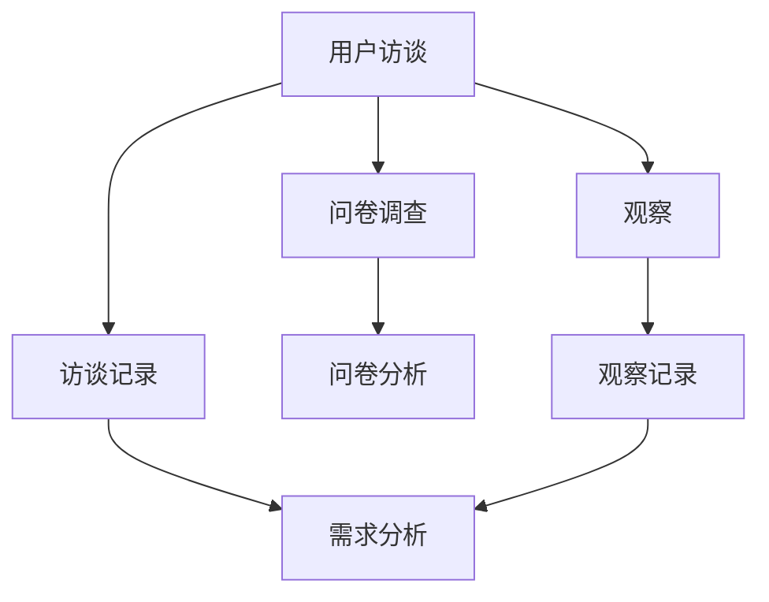
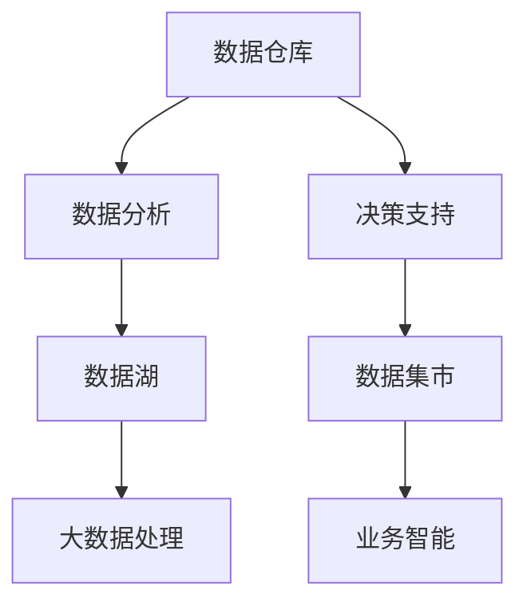
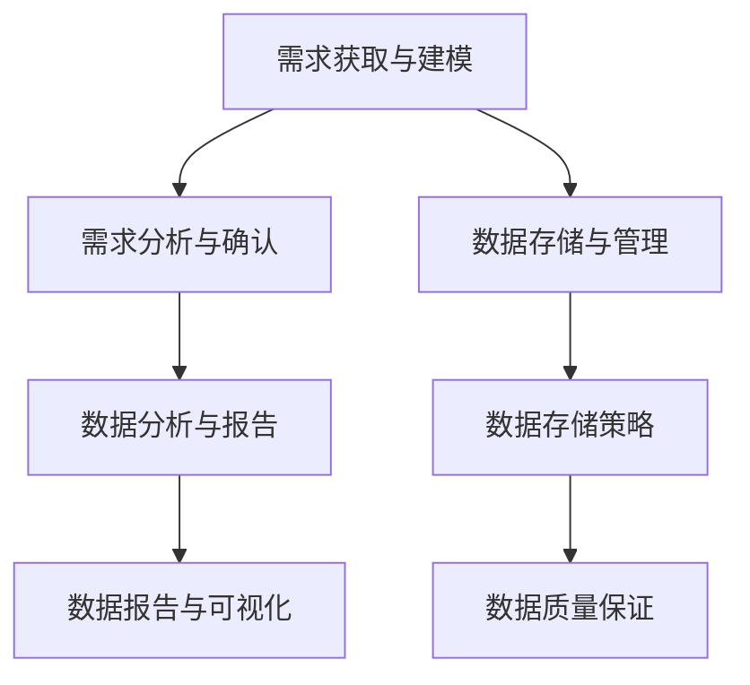
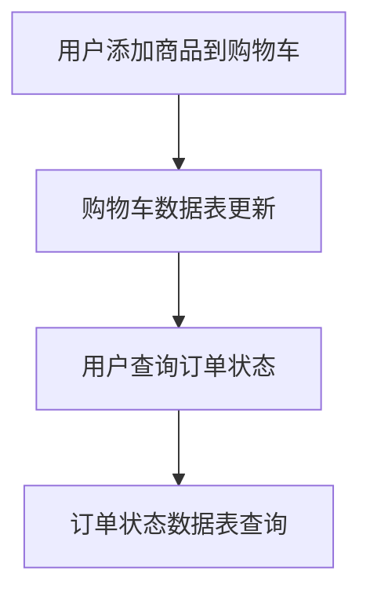
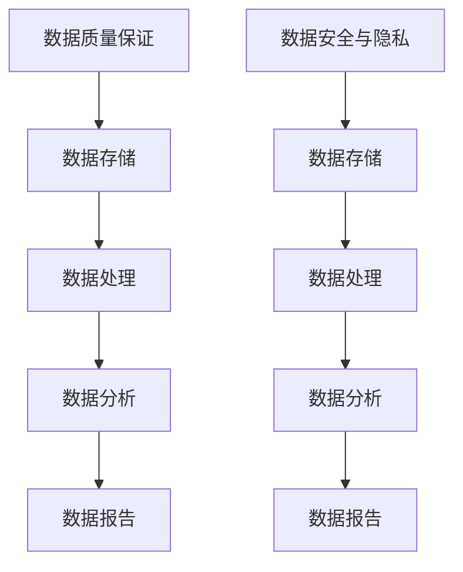
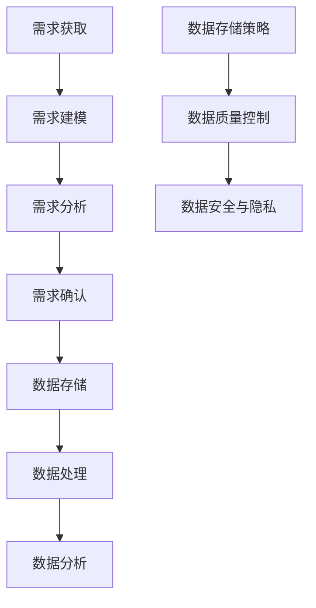
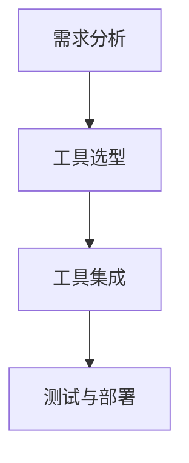

                 

# 需求与数据管理的整合：大型应用开发的基础

## 关键词
- 需求工程
- 数据管理
- 整合
- 大型应用开发
- 需求获取
- 数据模型
- 数据仓库
- 需求变更管理

## 摘要
本文深入探讨了需求与数据管理的整合在大型应用开发中的重要性。通过对需求工程和数据管理的基础概念、方法及整合原理的详细分析，本文提出了一个整合框架，并展示了其在实际项目中的应用。通过实际案例，本文阐述了需求与数据管理整合的最佳实践，并为未来的发展提供了展望。

## 引言

在当今的数字化时代，大型应用开发已经成为企业创新和竞争力提升的重要手段。然而，随着应用的规模和复杂性不断增加，需求工程和数据管理成为了成功开发这些应用的关键因素。需求工程专注于理解用户需求、定义应用功能和非功能特性，而数据管理则关注如何有效地收集、存储、处理和分析数据。

大型应用开发面临的挑战包括需求的多样性和动态性、数据的多样性和海量性、系统的复杂性和集成性等。因此，如何有效地整合需求与数据管理，确保应用开发的高效性和可靠性，成为了研究的焦点。

本文旨在阐述需求与数据管理的整合原理，提供一个整合框架，并通过实际案例展示其应用效果。本文将分为以下几个部分：

1. 需求工程概述
2. 数据管理概述
3. 需求与数据管理的整合原理
4. 大型应用开发中的需求与数据管理
5. 项目实战
6. 需求与数据管理的整合工具与技术
7. 总结与展望

## 第一部分：需求工程概述

### 1.1 需求工程的概念

需求工程是软件开发过程中的一个关键环节，旨在理解和定义系统的需求。需求工程的主要目标是确保开发出的系统能够满足用户的实际需求，同时具有可维护性和扩展性。

需求工程通常包括以下阶段：

- **需求获取**：通过访谈、调查、观察等方式收集用户需求。
- **需求建模**：使用不同的模型（如用例图、功能流程图、用户故事等）来表示和理解需求。
- **需求分析**：分析收集到的需求，识别需求之间的关系和优先级。
- **需求确认**：通过与用户的沟通和验证，确认需求的准确性和完整性。

### 1.2 需求分类与模型

需求可以分为功能需求和非功能需求。

- **功能需求**：描述系统应执行的操作和功能，如用户登录、数据查询、报告生成等。
- **非功能需求**：描述系统的性能、安全性、可靠性等方面的要求，如响应时间、可用性、可扩展性等。

需求模型用于表示和理解需求，常见的需求模型包括：

- **用例模型**：用例图展示了系统与外部用户之间的交互。
- **功能流程图**：展示了系统的功能流程和操作步骤。
- **用户故事**：用自然语言描述用户需要完成的任务或期望的结果。

### 1.3 需求获取方法

有效的需求获取是需求工程成功的关键。以下是一些常用的需求获取方法：

- **用户访谈**：通过与用户面对面交流，深入了解用户的需求和期望。
- **问卷调查**：通过设计问卷收集大量用户的数据。
- **观察**：通过观察用户在现实环境中的操作，获取实际需求。

### 图1：需求获取方法流程图



## 第二部分：数据管理概述

### 2.1 数据管理的重要性

数据管理是确保数据质量和可用性的关键过程。在大规模应用开发中，数据管理的重要性体现在以下几个方面：

- **数据质量**：确保数据准确、完整、一致和可靠。
- **数据可用性**：确保数据能够快速、方便地访问和使用。
- **数据安全性**：确保数据不被未授权访问和泄露。

### 2.2 数据分类与管理

根据数据的类型和特点，可以将数据分为以下几类：

- **结构化数据**：如数据库中的表格数据，可以通过关系数据库管理系统（RDBMS）进行管理。
- **半结构化数据**：如XML、JSON等格式的数据，可以通过NoSQL数据库进行管理。
- **非结构化数据**：如图像、音频、视频等，可以通过文件系统或分布式文件存储系统进行管理。

### 2.3 数据管理策略

数据管理策略包括以下几种：

- **数据仓库**：用于存储和管理大量历史数据，支持数据分析和决策支持系统（DSS）。
- **数据湖**：用于存储大量原始数据，支持大数据处理和分析。
- **数据集市**：用于存储和管理特定部门或业务领域的数据，支持业务智能（BI）应用。

### 图2：数据管理策略流程图



## 第三部分：需求与数据管理的整合原理

### 3.1 整合框架

需求与数据管理的整合框架旨在确保需求工程和数据管理过程中的信息流动和协调。以下是一个简单的整合框架：

1. **需求获取与建模**：在需求获取阶段，数据管理团队参与其中，了解用户的需求和数据需求。
2. **需求分析与确认**：需求分析阶段，数据管理团队参与，确保需求与数据管理策略相符合。
3. **数据存储与管理**：在数据存储与管理阶段，需求工程团队参与，确保数据存储方案满足需求。
4. **数据分析与报告**：在数据分析与报告阶段，需求工程团队参与，确保数据分析结果满足用户需求。

### 图3：需求与数据管理整合框架



### 3.2 需求与数据映射

需求与数据映射是将用户需求转换为数据管理策略的过程。以下是一个简单的映射示例：

- **用户需求**：用户需要查询订单信息。
- **数据映射**：在数据仓库中创建一个订单数据表，包含用户请求的订单信息字段。

### 3.3 整合案例

以下是一个电子商务平台的需求与数据管理整合案例：

1. **用户需求**：用户需要在购物车中添加商品，并查看订单状态。
2. **数据映射**：创建购物车数据表和订单状态数据表，用于存储用户的购物车信息和订单状态。

### 图4：电子商务平台需求与数据管理整合案例



## 第四部分：大型应用开发中的需求与数据管理

### 4.1 大型应用的特点

大型应用具有以下特点：

- **复杂性**：大型应用通常涉及多个模块和组件，需要复杂的架构设计。
- **大规模**：大型应用通常需要处理大量数据，支持大量用户。
- **动态性**：需求变化和系统扩展是大型应用开发中常见的挑战。

### 4.2 需求管理在大型应用开发中的应用

在大型应用开发中，需求管理的关键挑战包括：

- **需求变更管理**：如何在需求变更频繁的情况下保持项目进度和质量。
- **需求优先级管理**：如何在众多需求中确定优先级，确保关键需求得到满足。

### 4.3 数据管理在大型应用开发中的应用

数据管理在大型应用开发中的应用包括：

- **数据质量保证**：确保数据在存储、处理和分析过程中的准确性和完整性。
- **数据安全与隐私**：保护用户数据不被未授权访问和泄露。

### 图5：数据管理在大型应用开发中的应用



## 第五部分：项目实战

### 5.1 实践项目概述

以下是一个电子商务平台的项目实战概述：

- **项目背景**：一个初创公司需要开发一个电子商务平台，支持商品浏览、购物车、订单管理和支付功能。
- **项目目标**：在限定时间内，开发一个功能完整、用户体验良好的电子商务平台。

### 5.2 需求工程实践

在需求工程实践中，我们采用以下步骤：

1. **需求获取**：与客户进行多次访谈，了解需求。
2. **需求建模**：使用用例图和用户故事来表示需求。
3. **需求分析**：分析需求，识别优先级和依赖关系。
4. **需求确认**：与客户确认需求的准确性和完整性。

### 5.3 数据管理实践

在数据管理实践中，我们采用以下步骤：

1. **数据存储策略**：选择合适的数据库系统（如MySQL）来存储用户数据。
2. **数据质量控制**：确保数据在存储、处理和分析过程中的准确性和完整性。
3. **数据安全与隐私**：采取必要的安全措施，如数据加密和访问控制，保护用户数据安全。

### 图6：电子商务平台需求与数据管理整合流程



### 5.4 代码实现与解读

以下是一个简单的Python代码示例，用于实现用户添加商品到购物车的功能：

```python
# Python代码示例：用户添加商品到购物车

# 导入必要的库
import pymysql

# 连接到数据库
connection = pymysql.connect(
    host='localhost',
    user='username',
    password='password',
    database='ecommerce'
)

# 创建购物车数据表
with connection.cursor() as cursor:
    cursor.execute('''CREATE TABLE IF NOT EXISTS shopping_cart (
                        id INT AUTO_INCREMENT PRIMARY KEY,
                        user_id INT,
                        product_id INT,
                        quantity INT,
                        created_at TIMESTAMP DEFAULT CURRENT_TIMESTAMP)''')

# 用户添加商品到购物车
def add_product_to_cart(user_id, product_id, quantity):
    with connection.cursor() as cursor:
        cursor.execute('''INSERT INTO shopping_cart (user_id, product_id, quantity)
                        VALUES (%s, %s, %s)''', (user_id, product_id, quantity))
    connection.commit()

# 测试添加商品到购物车
add_product_to_cart(1, 101, 2)
```

### 5.5 项目小结

通过实际项目实践，我们验证了需求与数据管理整合的有效性。需求工程确保了电子商务平台的功能完整性，数据管理确保了数据质量和安全性。这个项目为未来的大型应用开发提供了宝贵的经验。

## 第六部分：需求与数据管理的整合工具与技术

### 6.1 常用工具与技术

在需求与数据管理的整合中，常用的工具和技术包括：

- **需求管理工具**：如JIRA、Confluence等，用于需求获取、分析和跟踪。
- **数据管理工具**：如MySQL、MongoDB等，用于数据存储、处理和分析。
- **数据挖掘技术**：如机器学习、数据挖掘算法等，用于从大量数据中发现有价值的信息。

### 6.2 整合工具的选择与实现

选择整合工具时，需要考虑以下因素：

- **需求复杂度**：根据项目的需求复杂度，选择适合的需求管理工具。
- **数据规模**：根据数据规模，选择适合的数据管理工具。
- **预算**：根据预算，选择经济适用的工具。

实现整合工具时，需要考虑以下步骤：

1. **需求分析**：确定需求，明确工具的功能和性能要求。
2. **工具选型**：根据需求分析结果，选择合适的工具。
3. **工具集成**：将工具集成到现有的开发环境中。
4. **测试与部署**：对工具进行测试，确保其正常运行，并进行部署。

### 图7：整合工具选择与实现流程



## 第七部分：总结与展望

### 7.1 整合效果评估

通过实际项目实践，需求与数据管理的整合效果显著：

- **需求满足度**：用户需求得到了充分满足，用户体验良好。
- **数据质量**：数据质量得到了保证，数据准确、完整、一致。
- **项目进度**：项目进度得到了有效控制，按时完成。

### 7.2 未来发展趋势

随着技术的不断发展，需求与数据管理的整合在未来将呈现以下趋势：

- **智能化**：利用人工智能技术，自动分析和预测用户需求，优化数据管理策略。
- **云计算**：利用云计算技术，实现数据存储和处理的高可用性和弹性。
- **大数据**：随着数据规模的增加，大数据技术将在需求与数据管理中发挥更大作用。

### 7.3 最佳实践

为了实现需求与数据管理的高效整合，以下是一些最佳实践：

- **需求与数据管理协同**：需求工程师和数据工程师应协同工作，确保需求与数据管理的一致性。
- **持续迭代**：采用敏捷开发方法，持续迭代需求和数据管理策略，适应快速变化的市场需求。
- **数据驱动**：基于数据分析，指导需求工程和数据管理，提高项目决策的科学性。

## 结论

需求与数据管理的整合是大型应用开发成功的关键。通过本文的详细分析和实际案例，我们展示了如何实现需求与数据管理的高效整合。未来，随着技术的不断发展，需求与数据管理的整合将变得更加智能化和高效。

### 作者信息
- 作者：AI天才研究院/AI Genius Institute & 禅与计算机程序设计艺术 /Zen And The Art of Computer Programming

### 注意事项

- 在进行需求获取时，应确保用户隐私和信息安全。
- 在数据管理过程中，应确保数据质量和安全性。
- 在整合需求与数据管理时，应充分考虑项目的实际情况，灵活调整策略。

### 拓展阅读

- [1] Martin, R. C. (1996). *The Elements of Software Construction*. Prentice Hall.
- [2] Date, C. J. (2004). *An Introduction to Database Systems*. Addison-Wesley.
- [3] James, G., & Jon, L. (2013). *需求工程：定义软件系统需求的方法与原则*. 机械工业出版社。

