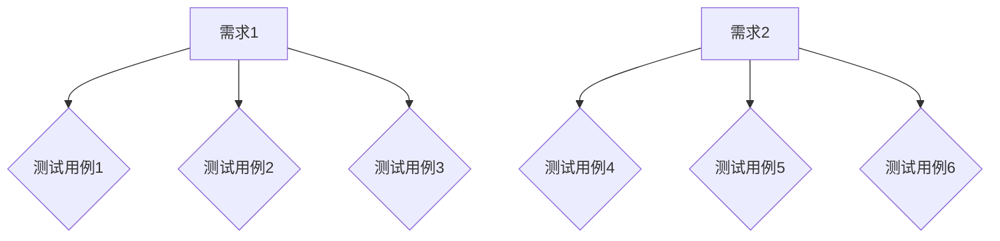
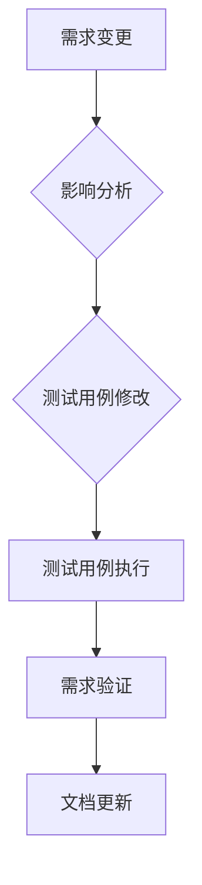
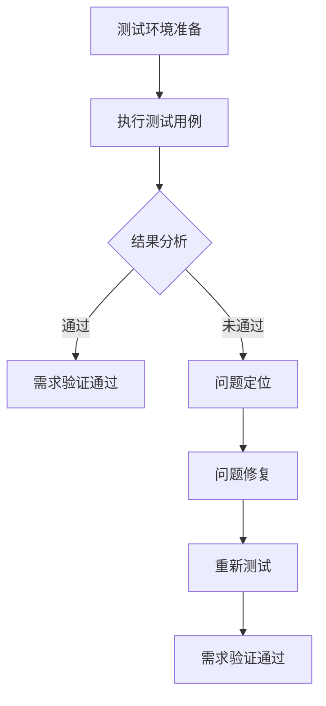
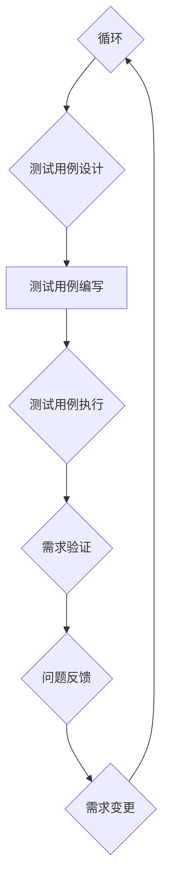

                 

### 需求与测试用例的联动：确保大型应用质量

> 关键词：需求分析、测试用例设计、大型应用、质量保证、测试策略

> 摘要：本文旨在探讨需求与测试用例在确保大型应用质量中的联动关系。通过对需求与测试用例的深入分析，以及其在实际项目中的应用，本文阐述了如何通过有效的联动来提升大型应用的质量和稳定性。

---

## 第1章 引言

### 1.1 大型应用质量的重要性

在当今信息化社会，大型应用系统已经成为各个行业运行的核心。这些系统不仅承载了大量的业务逻辑，还处理着海量的数据，其质量直接影响着企业的运营效率和用户体验。因此，确保大型应用质量至关重要。

大型应用质量的重要性主要体现在以下几个方面：

1. **用户体验**：高质量的应用系统能够提供稳定、高效、易用的功能，从而提升用户体验，增强用户满意度。
2. **业务连续性**：高质量的应用系统可以减少系统故障和停机时间，保障业务的连续性和稳定性。
3. **投资回报率**：高质量的应用系统可以降低维护成本，提高系统运行效率，从而实现更好的投资回报率。

### 1.2 需求与测试用例在质量保证中的作用

需求是软件项目开发的基础，而测试用例则是确保需求正确实现的保障。在大型应用质量保证过程中，需求与测试用例起到了关键作用。

1. **需求分析**：需求分析是理解用户需求的过程，其结果形成的需求文档为后续的测试用例设计提供了明确的指导。
2. **测试用例设计**：测试用例设计是根据需求文档创建测试用例的过程，通过测试用例可以验证需求的正确性和完整性。
3. **需求变更管理**：在实际开发过程中，需求可能发生变更，需求变更管理能够确保测试用例与需求的一致性，避免因需求变更导致的质量问题。

本文将从需求分析、测试用例设计、需求与测试用例的联动、大型应用测试策略等方面进行详细探讨，以期为大家提供一套完整的大型应用质量保证方案。

## 第2章 需求分析

### 2.1 需求分析的基本概念

需求分析是软件工程中一个至关重要的环节，它涉及从用户角度获取需求、分析需求并最终形成需求文档的过程。需求分析的基本概念包括以下几个方面：

1. **需求**：需求是用户或客户对软件系统功能、性能、行为和约束的期望。
2. **需求分类**：需求可以分为功能需求和非功能需求。功能需求描述软件系统应该实现的具体功能，非功能需求则描述软件系统的质量属性，如性能、安全性、可靠性等。
3. **需求文档**：需求文档是需求分析的结果，它详细描述了需求的内容、范围、优先级等，是后续设计和实现的基础。

### 2.2 需求获取与需求管理

需求获取是需求分析的关键步骤，它涉及与用户、利益相关者的沟通和交流，以获取他们的需求。需求获取的方法包括：

1. **访谈**：通过与用户和利益相关者进行面对面的访谈，深入了解他们的需求和期望。
2. **问卷调查**：通过设计问卷收集用户的需求信息。
3. **观察**：在现场观察用户的操作行为，以获取真实的需求。

需求管理是对需求进行跟踪和控制的过程，包括以下几个方面：

1. **需求变更管理**：在开发过程中，需求可能会发生变化，需求变更管理确保变更得到合理的评估和控制。
2. **需求优先级管理**：根据需求的紧急程度和重要性，对需求进行优先级排序，确保重要的需求得到优先处理。
3. **需求文档维护**：随着项目的进展，需求文档需要不断更新和维护，以确保其与实际情况的一致性。

### 2.3 需求变更管理

需求变更管理是需求管理的一个重要方面，它确保需求变更得到适当的处理和控制，以避免对项目造成不必要的风险和影响。需求变更管理包括以下步骤：

1. **变更请求**：当用户或利益相关者提出需求变更时，需提交变更请求，详细说明变更的内容和理由。
2. **变更评估**：对变更请求进行评估，分析变更的影响，包括时间、成本、风险等。
3. **变更批准**：根据评估结果，决定是否批准变更，如果批准，需更新需求文档和项目计划。
4. **变更实施**：实施已批准的变更，并进行相应的测试和验证，以确保变更不会对现有系统造成负面影响。
5. **变更记录**：记录变更的详细情况，包括变更请求、评估结果、批准情况、实施过程等，以备后续查询和审计。

通过有效的需求变更管理，可以确保项目需求的稳定性和一致性，减少因需求变更导致的项目风险。

### 2.4 需求分析与测试用例设计的关系

需求分析是测试用例设计的基石，两者之间存在紧密的联系。具体来说：

1. **需求驱动测试**：测试用例设计是基于需求文档进行的，需求的分析和获取决定了测试用例的内容和范围。
2. **需求变更影响测试**：需求变更会直接影响测试用例的设计和执行，因此需要及时调整测试计划，以确保测试覆盖度的完整性。

在实际项目中，需求分析与测试用例设计通常是一个迭代过程，需求的分析和获取不断进行，测试用例也随之不断调整和完善，以确保需求的全面覆盖和正确实现。

## 第3章 测试用例设计

### 3.1 测试用例设计的基本原则

测试用例设计是确保软件系统质量的关键步骤，其目的是验证软件功能是否按照需求文档的要求正常工作。一个良好的测试用例设计应该遵循以下基本原则：

1. **完整性**：测试用例应该覆盖所有的需求点，确保所有的功能点都得到了测试。
2. **准确性**：测试用例应该准确地描述测试的目标和预期结果，避免模糊不清或错误的信息。
3. **一致性**：测试用例应该使用统一的标准和格式，以便于测试的执行和管理。
4. **可重复性**：测试用例应该在相同的环境下可重复执行，确保测试结果的一致性。
5. **可维护性**：测试用例应该易于理解和修改，以便在需求变更时能够快速响应。

### 3.2 功能测试用例设计

功能测试用例设计是测试用例设计中最常见的一种，其主要目标是验证软件系统的功能是否符合需求规格说明书。功能测试用例设计包括以下步骤：

1. **需求分析**：首先对需求文档进行详细分析，理解每个功能的具体要求和限制。
2. **场景识别**：根据需求描述，识别出不同的测试场景，每个场景代表一个功能点的测试任务。
3. **输入数据设计**：为每个测试场景设计输入数据，包括正常输入和异常输入，以覆盖各种情况。
4. **预期结果设计**：为每个测试场景设计预期结果，包括正常结果和异常结果，以便在执行测试时进行验证。
5. **测试步骤设计**：详细描述执行测试的步骤，确保测试执行人员能够按照设计进行操作。
6. **测试用例评审**：对设计完成的测试用例进行评审，确保其满足完整性、准确性、一致性等原则。

### 3.3 非功能测试用例设计

非功能测试用例设计主要关注软件系统的非功能性需求，如性能、安全性、可靠性等。与功能测试不同，非功能测试用例设计需要关注系统的整体行为和性能。非功能测试用例设计包括以下类型：

1. **性能测试用例**：用于验证系统在特定负载下的响应时间和吞吐量，包括负载测试、压力测试和容量测试等。
   - **测试步骤**：设计特定的负载场景，模拟用户操作，记录系统的响应时间和吞吐量。
   - **性能指标**：包括响应时间、吞吐量、并发用户数、系统资源使用情况等。

2. **安全性测试用例**：用于验证系统的安全措施，包括漏洞扫描、渗透测试和漏洞修复验证等。
   - **测试步骤**：模拟各种攻击行为，如SQL注入、XSS攻击等，验证系统是否能够抵御攻击并恢复正常。
   - **安全指标**：包括安全漏洞数量、响应时间、恢复时间等。

3. **可靠性测试用例**：用于验证系统的稳定性和可靠性，包括故障恢复测试、长期运行测试等。
   - **测试步骤**：在模拟故障条件下，验证系统是否能够自动恢复并继续正常运行。
   - **可靠性指标**：包括故障次数、恢复时间、运行时长等。

### 3.4 测试用例编写规范

为了确保测试用例的质量和可维护性，编写测试用例时需要遵循一定的规范：

1. **格式规范**：测试用例应采用统一格式，包括测试编号、测试名称、测试目的、测试步骤、预期结果等。
2. **命名规范**：测试用例的名称应简明扼要，能够清晰地描述测试的内容和目标。
3. **步骤详细**：测试步骤应详细描述操作流程，确保测试执行人员能够按照步骤准确执行。
4. **预期结果明确**：预期结果应明确、具体，便于测试执行时进行验证。
5. **注释清晰**：在测试用例中添加必要的注释，说明测试的目的、关键点和注意事项。
6. **版本控制**：测试用例应进行版本控制，记录每次修改的版本和修改内容，确保历史记录的完整性。

通过遵循这些规范，可以提高测试用例的质量和可维护性，确保测试活动的顺利进行。

### 3.5 测试用例设计的最佳实践

在实际项目中，为了确保测试用例设计的有效性和全面性，可以遵循以下最佳实践：

1. **尽早开始**：在需求分析阶段就开始设计测试用例，与开发团队紧密合作，确保测试用例与需求的一致性。
2. **迭代进行**：测试用例设计是一个迭代过程，随着项目进展和需求变更，测试用例也应不断调整和完善。
3. **自动化测试**：对于重复性的测试用例，可以采用自动化测试工具进行执行，提高测试效率和覆盖度。
4. **评审和复审**：在测试用例设计完成后，组织评审和复审，确保其满足质量要求和实际需求。
5. **文档化**：将测试用例文档化，便于后续的测试执行、跟踪和管理。

通过遵循这些最佳实践，可以确保测试用例设计的高效性和准确性，为项目质量提供有力保障。

## 第4章 需求与测试用例的联动

### 4.1 需求与测试用例联动的意义

需求与测试用例的联动是确保软件系统质量的关键环节，其意义主要体现在以下几个方面：

1. **确保需求实现**：通过联动，确保测试用例能够覆盖所有需求点，验证需求是否正确实现。
2. **提高测试效率**：联动可以减少测试用例的设计时间和工作量，通过需求的明确指导，测试用例可以更高效地完成。
3. **降低测试风险**：联动可以提前发现需求中的潜在问题，减少因需求不明确或不完整导致的测试失败和缺陷遗漏。
4. **保障系统质量**：联动有助于确保软件系统在各个层面都满足质量要求，提高系统的稳定性、可靠性和用户体验。

### 4.2 需求与测试用例的对应关系

需求与测试用例之间的对应关系是确保测试覆盖度和系统质量的重要基础。建立对应关系的方法有多种，以下是几种常见的方法：

1. **关键字匹配法**：通过识别需求文档中的关键字和测试用例中的关键字，建立需求与测试用例的对应关系。
2. **功能分解法**：将需求分解为不同的功能模块，为每个功能模块设计相应的测试用例，建立功能与测试用例的对应关系。
3. **矩阵法**：使用矩阵图将需求与测试用例对应起来，直观地展示两者之间的关系，便于分析和跟踪。

以下是一个使用Mermaid流程图表示需求与测试用例对应关系的示例：

在这个示例中，每个需求都与多个测试用例对应，确保需求的全面覆盖。

### 4.3 需求变更对测试用例的影响

需求变更在软件开发过程中是不可避免的，但需求变更会对测试用例产生影响。因此，需要建立有效的需求变更管理流程，以确保测试用例的及时更新和调整。

1. **变更请求**：当需求发生变更时，需提交变更请求，详细说明变更的内容和原因。
2. **影响分析**：对变更的影响进行分析，评估变更对测试用例的影响范围和程度。
3. **测试用例调整**：根据变更的影响，对受影响的测试用例进行修改或补充，确保测试用例与变更后的需求一致。
4. **测试执行**：对修改后的测试用例进行执行，验证变更后的需求是否正确实现。
5. **文档更新**：更新测试文档，记录变更的详细信息，确保变更的透明性和可追溯性。

以下是一个使用Mermaid流程图表示需求变更对测试用例影响的分析流程：

通过这个流程，可以确保需求变更得到有效管理和控制，测试用例与变更后的需求保持一致。

### 4.4 测试用例执行与需求验证

测试用例执行是验证需求实现的关键步骤，其目的是通过实际执行测试用例，检查系统功能是否满足需求。测试用例执行包括以下步骤：

1. **测试环境准备**：准备测试环境，包括安装软件、配置数据库、创建测试数据等。
2. **执行测试用例**：按照测试用例的步骤执行测试，记录测试结果。
3. **结果分析**：对比预期结果和实际结果，分析测试用例是否通过。

以下是一个使用Mermaid流程图表示测试用例执行与需求验证的过程：

通过这个流程，可以确保测试用例的执行与需求验证的紧密联动，及时发现和解决需求实现中的问题。

### 4.5 联动过程中常见问题与解决方法

在需求与测试用例的联动过程中，可能会遇到一些常见问题，如需求不明确、测试用例设计不合理、测试用例执行不彻底等。以下是针对这些问题的一些解决方法：

1. **需求不明确**：定期与用户和利益相关者进行沟通，确保需求清晰明确。对于模糊的需求，可以采用原型设计、用户故事等方法进行澄清。
2. **测试用例设计不合理**：加强测试用例设计过程中的评审和复审，确保测试用例的完整性和准确性。可以采用自动化测试工具进行辅助，提高测试用例的覆盖度和可靠性。
3. **测试用例执行不彻底**：制定详细的测试计划和执行策略，确保测试用例的全面执行。对于重要的测试用例，可以采用手动和自动化测试相结合的方法，提高测试的覆盖度和效率。

通过解决这些问题，可以确保需求与测试用例的联动更加顺畅和有效，提高大型应用的质量和稳定性。

### 4.6 联动效果评估与持续改进

在需求与测试用例的联动过程中，需要定期对联动效果进行评估，以发现和解决潜在的问题，并持续改进联动过程。以下是评估联动效果的方法和持续改进的策略：

1. **评估方法**：可以采用以下方法对联动效果进行评估：
   - **测试覆盖率评估**：计算测试用例对需求的覆盖率，评估测试用例的完整性。
   - **缺陷发现率评估**：分析测试过程中发现的缺陷数量和质量，评估测试的有效性。
   - **测试效率评估**：分析测试用例执行的时间和质量，评估测试的效率。

2. **持续改进策略**：
   - **定期评审**：定期对需求、测试用例和测试过程进行评审，发现潜在问题，提出改进建议。
   - **反馈机制**：建立反馈机制，收集用户和利益相关者的意见和建议，及时调整需求和管理测试过程。
   - **培训与学习**：组织测试团队进行培训和学习，提高测试技能和团队合作能力。
   - **工具优化**：不断优化测试工具和流程，提高测试效率和质量。

通过评估联动效果和持续改进，可以不断提高需求与测试用例的联动效果，确保大型应用的质量和稳定性。

### 4.7 需求与测试用例联动的实践案例

以下是一个需求与测试用例联动实践案例，以帮助读者更好地理解联动过程。

#### 项目背景

某电商平台的购物车功能需要进行需求变更，将原有的单商品购买功能扩展为多商品购买功能。该功能的需求如下：

1. 用户可以添加多个商品到购物车。
2. 用户可以修改购物车中商品的数量。
3. 用户可以删除购物车中的商品。
4. 购物车中的商品可以按照价格从低到高排序。

#### 需求分析

根据需求文档，对购物车功能进行详细分析，确定需要测试的场景和关键点。

#### 测试用例设计

根据需求分析，设计以下测试用例：

1. **测试用例1：添加商品到购物车**
   - **测试步骤**：用户选择商品，点击“加入购物车”按钮。
   - **预期结果**：商品成功添加到购物车。

2. **测试用例2：修改购物车中商品的数量**
   - **测试步骤**：用户选择商品，修改数量为2，点击“更新”按钮。
   - **预期结果**：商品数量成功更新为2。

3. **测试用例3：删除购物车中的商品**
   - **测试步骤**：用户选择商品，点击“删除”按钮。
   - **预期结果**：商品成功从购物车中删除。

4. **测试用例4：购物车商品排序**
   - **测试步骤**：用户点击“价格从低到高”按钮。
   - **预期结果**：购物车中的商品按照价格从低到高排序。

#### 测试执行与需求验证

1. **测试环境准备**：搭建测试环境，安装电商平台软件，配置数据库和测试数据。

2. **执行测试用例**：按照设计好的测试用例执行测试，记录测试结果。

3. **结果分析**：对比预期结果和实际结果，分析测试用例是否通过。

4. **需求验证**：通过测试用例的执行，验证购物车功能的实现是否符合需求。

#### 联动效果评估

通过测试执行和需求验证，发现以下问题：

1. 测试用例1中的商品添加功能在某些情况下会出现异常，需要进行修复。
2. 测试用例4中的购物车商品排序功能在某些数据情况下无法正确排序，需要进行优化。

#### 持续改进

针对发现的问题，进行以下改进：

1. 修复商品添加功能中的异常。
2. 优化购物车商品排序功能，确保正确排序。

通过以上实践案例，可以清晰地看到需求与测试用例的联动过程，以及如何通过测试用例设计、测试执行和需求验证来确保大型应用的质量。

### 4.8 联动需求与测试用例的流程图

以下是需求与测试用例联动的流程图，展示了从需求分析到测试用例设计、测试执行和需求验证的完整过程。

通过这个流程图，可以直观地了解需求与测试用例联动的各个步骤和相互关系。

## 第5章 大型应用测试策略

### 5.1 测试策略概述

测试策略是确保大型应用质量的关键，它定义了测试的目标、范围、方法和工具。一个良好的测试策略应该考虑以下几个方面：

1. **测试目标**：明确测试的目标，如功能测试、性能测试、安全性测试等。
2. **测试范围**：确定测试的范围，包括功能模块、用户场景、系统接口等。
3. **测试方法**：选择合适的测试方法，如黑盒测试、白盒测试、自动化测试等。
4. **测试工具**：选择适合的测试工具，如自动化测试工具、性能测试工具等。
5. **资源分配**：合理分配测试资源，包括人员、时间、设备等。

### 5.2 测试阶段的划分

大型应用的测试通常分为以下几个阶段：

1. **单元测试**：在开发过程中，对单个模块或组件进行测试，验证其功能是否正确。
   - **目的**：发现代码中的逻辑错误和边界问题。
   - **方法**：使用测试框架，如JUnit、PyTest等，编写测试用例。

2. **集成测试**：在模块集成后，对模块之间的接口和交互进行测试。
   - **目的**：发现模块之间的兼容性问题。
   - **方法**：使用模拟环境或测试工具，如Postman、Selenium等，执行接口测试。

3. **系统测试**：对整个系统进行全面测试，验证系统功能、性能和稳定性。
   - **目的**：发现系统级的缺陷和性能瓶颈。
   - **方法**：设计功能测试用例和性能测试用例，使用自动化测试工具执行。

4. **验收测试**：在项目交付前，由用户或利益相关者对系统进行测试，确保系统满足需求。
   - **目的**：验证系统是否符合用户需求和业务场景。
   - **方法**：制定验收测试计划，执行用户故事和场景测试。

### 5.3 测试工具的选择

选择合适的测试工具是确保测试效率和效果的关键。以下是一些常用的测试工具：

1. **自动化测试工具**：如Selenium、JUnit、PyTest等，用于自动化执行测试用例，提高测试效率。
2. **性能测试工具**：如LoadRunner、JMeter等，用于模拟高负载环境，测试系统的性能。
3. **接口测试工具**：如Postman、Swagger等，用于测试API接口的响应和交互。
4. **代码审查工具**：如SonarQube、Checkstyle等，用于静态分析代码质量，发现潜在问题。
5. **持续集成工具**：如Jenkins、Travis CI等，用于自动化构建和测试，确保代码质量。

### 5.4 测试计划与执行

测试计划和执行是确保测试活动有序进行的关键。以下是测试计划和执行的基本步骤：

1. **制定测试计划**：根据项目需求和资源，制定详细的测试计划，包括测试目标、测试范围、测试方法、测试工具和资源分配。
2. **设计测试用例**：根据测试计划，设计功能测试用例和性能测试用例，确保测试用例的完整性和准确性。
3. **执行测试**：按照测试计划执行测试，记录测试结果，分析缺陷和性能问题。
4. **缺陷管理**：记录和管理发现的缺陷，进行优先级和严重性评估，制定修复计划。
5. **测试报告**：编写测试报告，总结测试结果、缺陷情况和改进建议。

### 5.5 测试策略的持续优化

测试策略不是一成不变的，需要根据项目进展和实际情况进行持续优化。以下是一些优化策略：

1. **反馈机制**：建立反馈机制，收集用户、开发人员和测试人员的意见和建议，持续改进测试策略。
2. **过程改进**：定期回顾测试过程，分析测试效率和质量，发现潜在问题，提出改进措施。
3. **自动化测试**：逐步引入自动化测试，减少手工测试的工作量，提高测试效率。
4. **培训与学习**：组织测试团队进行培训和学习，提高测试技能和知识水平。
5. **工具优化**：不断优化测试工具和流程，提高测试效率和效果。

通过持续优化测试策略，可以确保测试活动的顺利进行，提高大型应用的质量和稳定性。

## 第6章 测试环境搭建

### 6.1 测试环境需求分析

测试环境是进行软件测试的基础设施，其需求分析是确保测试活动顺利开展的关键步骤。以下是测试环境需求分析的主要内容：

1. **硬件需求**：根据测试工具和被测软件的性能要求，选择合适的硬件设备，包括服务器、网络设备、存储设备等。
2. **软件需求**：安装必要的操作系统、数据库、Web服务器等软件，确保测试环境的稳定性和兼容性。
3. **网络需求**：配置测试网络，确保网络连接稳定、带宽充足，满足测试需求。
4. **数据需求**：准备测试数据，包括用户数据、业务数据等，确保数据的完整性和真实性。
5. **工具需求**：安装测试工具，如自动化测试工具、性能测试工具、代码审查工具等，确保测试工作的顺利进行。

### 6.2 测试环境搭建步骤

以下是测试环境搭建的基本步骤：

1. **硬件采购与安装**：根据需求分析，采购合适的硬件设备，并安装配置。
2. **软件安装**：在硬件设备上安装操作系统、数据库、Web服务器等软件，确保软件之间的兼容性。
3. **网络配置**：配置测试网络，包括IP地址分配、子网划分、路由配置等，确保网络连接稳定。
4. **数据准备**：导入测试数据，包括用户数据、业务数据等，确保数据的完整性和真实性。
5. **工具部署**：安装测试工具，配置测试工具的参数，确保测试工具能够正常运行。
6. **环境验证**：验证测试环境是否满足测试需求，包括硬件性能、软件稳定性、网络连接等。

### 6.3 测试数据管理

测试数据管理是确保测试数据完整性和真实性的关键。以下是测试数据管理的主要内容：

1. **数据备份**：定期备份测试数据，防止数据丢失或损坏。
2. **数据隔离**：为每个测试项目创建独立的测试数据库，确保测试数据不会与其他项目冲突。
3. **数据清理**：在测试结束后，清理测试数据，防止遗留数据影响后续测试。
4. **数据安全**：确保测试数据的安全，防止数据泄露或被恶意使用。
5. **数据共享**：建立测试数据共享机制，方便测试人员和开发人员之间的数据交流。

通过有效的测试数据管理，可以确保测试数据的完整性和真实性，提高测试效率和准确性。

## 第7章 测试报告与质量评估

### 7.1 测试报告的编写

测试报告是总结测试过程和结果的重要文档，其编写应遵循以下原则：

1. **完整性**：测试报告应包含所有测试活动的详细记录，确保信息的全面性。
2. **准确性**：测试报告应准确描述测试结果，避免模糊不清或错误的信息。
3. **及时性**：测试报告应在测试完成后及时编写，以便于问题的及时反馈和解决。
4. **可读性**：测试报告应使用清晰的格式和语言，便于读者理解和阅读。

测试报告的主要内容包括：

1. **概述**：简要介绍测试目标、范围和策略。
2. **测试结果**：详细记录测试用例的执行情况，包括通过数、失败数和未执行数。
3. **缺陷分析**：列出发现的缺陷，包括缺陷的严重性、优先级和影响范围。
4. **性能数据**：记录系统的性能数据，如响应时间、吞吐量、并发用户数等。
5. **测试结论**：总结测试结果，评估系统质量，提出改进建议。

### 7.2 质量评估方法

质量评估是确保软件系统满足质量要求的重要步骤。以下是一些常用的质量评估方法：

1. **缺陷密度评估**：计算缺陷密度，评估软件质量。缺陷密度 = 缺陷数 / 代码行数。
2. **覆盖率评估**：计算代码覆盖率，评估测试用例的覆盖程度。常见的覆盖率包括语句覆盖率、分支覆盖率和路径覆盖率。
3. **性能评估**：评估系统的性能指标，如响应时间、吞吐量、并发用户数等，确保系统在预期负载下能够正常运行。
4. **用户满意度评估**：通过用户满意度调查，评估系统的用户体验和满意度。
5. **同行评审**：组织同行评审，评估代码质量和设计合理性。

### 7.3 质量改进措施

在质量评估过程中，如果发现质量不满足要求，应采取以下质量改进措施：

1. **缺陷修复**：及时修复发现的缺陷，确保软件质量。
2. **测试用例优化**：针对未覆盖的需求，优化测试用例，提高测试覆盖度。
3. **性能优化**：对系统性能进行优化，提高系统的响应速度和稳定性。
4. **代码重构**：对代码进行重构，提高代码质量和可维护性。
5. **过程改进**：分析测试过程，发现潜在问题，提出改进措施，提高测试效率和质量。

通过实施质量改进措施，可以不断提高软件质量，满足用户需求和期望。

### 7.4 测试报告与质量评估的实践案例

以下是一个测试报告与质量评估的实践案例，以帮助读者更好地理解相关概念。

#### 项目背景

某电商平台项目在系统测试阶段，通过测试报告和质

