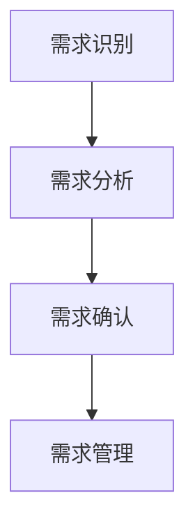
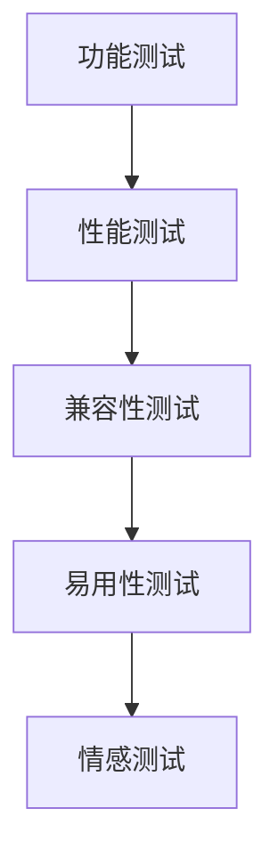

                 

# 需求与用户体验测试的整合：提升产品质量

## 关键词
- 需求分析
- 用户体验测试
- 产品质量提升
- 整合流程
- 跨部门协作

## 摘要
本文探讨了需求分析与用户体验测试在提升产品质量中的关键作用，并详细介绍了需求分析与用户体验测试的基础理论、整合实践以及提升产品质量的实战策略。通过实际案例分析和详细讲解，为IT行业的质量保障提供了有益的参考。

## 第一部分：需求与用户体验测试的基础理论

### 第1章：需求分析的基本概念

#### 1.1 需求的定义与分类

需求是软件项目开发中核心的概念，它定义了系统必须实现的功能和性能标准。需求可以分为以下几类：

1. **功能需求**：描述系统必须实现的具体功能，如用户注册、数据查询等。
2. **性能需求**：描述系统在各种负载条件下的性能表现，如响应时间、并发用户数等。
3. **可靠性需求**：描述系统在长时间运行中的稳定性和故障恢复能力。
4. **安全性需求**：描述系统在防止非法访问、数据泄露等方面的保护措施。
5. **其他需求**：包括法律法规、行业标准等非功能性的需求。

#### 1.2 需求分析的过程与方法

需求分析的过程通常包括以下几个步骤：

1. **需求收集**：通过与用户、利益相关者进行沟通，了解他们对系统的期望和需求。
2. **需求筛选**：对收集到的需求进行筛选和分类，确保需求的可行性和一致性。
3. **需求建模**：使用不同的建模技术（如UML图、流程图等）对需求进行可视化表示。
4. **需求确认**：与利益相关者一起验证和确认需求，确保需求符合预期和实际需求。
5. **需求管理**：对需求进行版本控制、变更管理，确保需求的持续更新和一致性。

需求分析的方法包括：

1. **访谈法**：通过与用户直接交流，获取第一手的需求信息。
2. **问卷调查**：通过设计问卷，广泛收集用户的需求和意见。
3. **观察法**：在用户的实际工作环境中观察，了解用户的需求和习惯。
4. **文档分析**：分析已有的文档，如业务流程、用户手册等，提取需求信息。

#### 1.3 需求文档编写指南

编写高质量的需求文档是需求分析的关键。以下是编写需求文档的一些指南：

1. **明确文档目的**：确保文档的目的明确，便于读者理解和使用。
2. **结构清晰**：将需求按照功能、性能、可靠性等分类，结构化地组织文档内容。
3. **详细描述**：对每个需求进行详细描述，包括需求来源、功能说明、性能指标等。
4. **一致性和完整性**：确保需求的一致性和完整性，避免需求和实现之间的冲突。
5. **可追溯性**：为每个需求设置唯一标识，方便后续的需求管理和变更控制。
6. **文档评审**：组织利益相关者对需求文档进行评审，确保文档的准确性和可理解性。

### 第2章：用户体验测试的理论基础

#### 2.1 用户体验的概念与构成

用户体验（User Experience，简称UX）是用户在使用产品过程中的感受和体验。用户体验的构成包括以下几个方面：

1. **可用性**：产品是否易于使用，用户能否快速完成任务。
2. **易用性**：产品的界面设计和交互流程是否合理，用户是否能够轻松上手。
3. **满意度**：用户在使用产品过程中的整体感受，是否感到满意。
4. **品牌印象**：产品给用户留下的品牌形象和印象。
5. **情感反应**：用户在使用产品过程中的情感反应，如愉悦、焦虑等。

#### 2.2 用户体验测试的目标与类型

用户体验测试的目标是验证产品的用户体验是否符合预期和用户需求。用户体验测试的类型包括：

1. **功能测试**：验证产品功能是否正常运行，是否满足需求。
2. **性能测试**：评估产品的性能表现，如响应时间、并发用户数等。
3. **兼容性测试**：检查产品在不同平台、浏览器和设备上的兼容性。
4. **易用性测试**：评估产品的易用性和用户体验，收集用户反馈。
5. **情感测试**：通过心理学方法，评估用户在使用产品过程中的情感反应。

#### 2.3 用户体验测试的方法与工具

用户体验测试的方法包括：

1. **用户访谈**：通过与用户进行面对面或在线访谈，了解他们的需求和反馈。
2. **问卷调查**：通过设计问卷，收集用户的反馈和意见。
3. **可用性测试**：邀请用户参与实际操作，观察并记录他们的行为和反馈。
4. **A/B测试**：将产品分为两组，对比不同设计或功能的用户体验。

用户体验测试的工具包括：

1. **用户调研工具**：如UserTesting、Qualaroo等，用于收集用户反馈。
2. **可用性测试工具**：如Optimizely、UsabilityHub等，用于设计和执行可用性测试。
3. **性能测试工具**：如LoadRunner、JMeter等，用于评估产品的性能表现。
4. **情感测试工具**：如Affectiva、Meetrics等，用于分析用户情感反应。

## 第二部分：需求与用户体验测试的整合实践

### 第3章：需求与用户体验测试的整合流程

#### 3.1 整合流程的设计与规划

需求与用户体验测试的整合流程设计主要包括以下几个步骤：

1. **需求分析**：通过访谈、问卷等方式收集用户需求，并进行分析和分类。
2. **需求确认**：与利益相关者一起验证和确认需求，确保需求的一致性和完整性。
3. **用户体验测试计划**：根据需求分析结果，设计用户体验测试的计划，包括测试目标、测试类型、测试工具等。
4. **测试执行**：按照测试计划执行用户体验测试，收集用户反馈和数据。
5. **测试报告**：对测试结果进行分析和总结，形成测试报告，为产品优化提供依据。

#### 3.2 需求与用户体验测试的协同工作

需求与用户体验测试的协同工作主要包括以下几个方面：

1. **需求传递**：需求分析团队将需求传递给用户体验测试团队，确保测试团队对需求有充分的了解。
2. **测试反馈**：用户体验测试团队将测试结果和用户反馈及时反馈给需求分析团队，为需求调整和优化提供依据。
3. **沟通与协作**：需求分析团队和用户体验测试团队之间保持密切的沟通与协作，确保双方对需求和测试有共同的理解和目标。
4. **风险管理**：识别和评估需求与用户体验测试过程中的风险，制定相应的应对策略。

#### 3.3 整合流程中的关键角色与职责

在需求与用户体验测试的整合流程中，关键角色及其职责包括：

1. **需求分析经理**：负责需求分析的设计和规划，确保需求的一致性和完整性。
2. **用户体验测试经理**：负责用户体验测试的计划和执行，确保测试目标的达成。
3. **需求分析师**：负责需求的分析、分类和确认，为用户体验测试提供需求基础。
4. **用户体验测试工程师**：负责用户体验测试的执行和数据分析，为产品优化提供依据。
5. **项目经理**：负责整合流程的协调和监督，确保整体项目进度和质量。

### 第4章：需求与用户体验测试的整合工具

#### 4.1 常用需求管理工具介绍

以下是一些常用的需求管理工具：

1. **JIRA**：用于需求收集、管理、跟踪和版本控制。
2. **Confluence**：用于编写和存储需求文档，支持协作和知识共享。
3. **Asana**：用于任务管理和进度跟踪，支持跨团队协作。
4. **Trello**：用于任务看板管理，支持可视化任务跟踪。

#### 4.2 用户体验测试工具的使用与选择

以下是一些常用的用户体验测试工具：

1. **UserTesting**：提供在线用户调研和可用性测试服务。
2. **Optimizely**：提供A/B测试和性能测试工具，支持产品优化。
3. **JMeter**：用于负载测试和性能测试，支持多平台和多种协议。
4. **Selenium**：用于自动化测试，支持多种浏览器和操作系统。

选择用户体验测试工具时，需要考虑以下因素：

1. **测试类型**：根据测试需求选择合适的测试工具。
2. **可扩展性**：工具是否支持扩展和定制，满足不同项目的需求。
3. **易用性**：工具是否易于使用，降低测试人员的学习成本。
4. **集成性**：工具是否与其他需求管理和开发工具集成，提高工作效率。

#### 4.3 需求与用户体验测试工具的集成

需求与用户体验测试工具的集成可以通过以下方式实现：

1. **API集成**：通过接口将需求管理和用户体验测试工具连接起来，实现数据的自动同步和传递。
2. **插件集成**：使用插件将需求管理和用户体验测试工具与开发工具（如JIRA、Confluence等）集成，提高协同效率。
3. **自动化脚本**：编写自动化脚本，将需求管理和用户体验测试工具与持续集成和持续部署工具（如Jenkins、GitLab等）集成，实现自动化测试和部署。
4. **数据可视化**：通过数据可视化工具，将需求管理和用户体验测试工具的数据进行可视化展示，便于分析和决策。

### 第5章：实际案例：需求与用户体验测试的整合应用

#### 5.1 案例背景与分析

案例背景：某电商公司正在开发一款在线购物平台，旨在提高用户体验和销售转化率。公司面临的需求包括功能需求、性能需求和用户体验需求。公司希望通过需求分析与用户体验测试的整合，确保产品的高质量和用户满意度。

案例分析：电商平台的开发涉及多个团队，包括产品、开发、测试、运营等。需求分析与用户体验测试的整合需要跨团队的协作，确保各方对需求和用户体验有共同的理解和目标。

#### 5.2 案例实施与过程

案例实施过程包括以下几个步骤：

1. **需求分析**：产品团队与利益相关者进行沟通，了解用户需求和期望。通过访谈、问卷和观察等方法，收集用户需求，并进行分类和筛选。
2. **需求确认**：与利益相关者一起验证和确认需求，确保需求的一致性和完整性。
3. **用户体验测试计划**：根据需求分析结果，设计用户体验测试的计划，包括测试目标、测试类型、测试工具等。测试计划包括功能测试、性能测试、兼容性测试和易用性测试。
4. **测试执行**：按照测试计划执行用户体验测试，收集用户反馈和数据。测试过程中，使用UserTesting和JMeter等工具，进行在线用户调研和性能测试。
5. **测试报告**：对测试结果进行分析和总结，形成测试报告，为产品优化提供依据。测试报告包括测试覆盖率、测试通过率、用户反馈等数据。

#### 5.3 案例效果评估与反思

案例效果评估：

1. **需求满足度**：通过用户访谈和问卷调查，评估用户对需求满足度的满意度。结果显示，用户对功能需求、性能需求和用户体验需求的满足度较高。
2. **性能表现**：通过性能测试，评估产品的性能表现。结果显示，产品在响应时间、并发用户数和兼容性方面达到预期标准。
3. **用户满意度**：通过用户反馈和情感测试，评估用户对产品的满意度。结果显示，用户对产品的满意度较高，品牌形象和情感反应积极。

案例反思：

1. **需求与用户体验测试的整合**：需求与用户体验测试的整合提高了产品的质量，降低了风险。但在实施过程中，发现部分需求与用户体验之间存在冲突，需要进一步优化和协调。
2. **跨部门协作**：跨部门协作是成功的关键。但在案例中，部分团队成员之间的沟通不畅，导致需求传递和测试执行出现延误。未来需要加强团队间的沟通与协作，提高工作效率。
3. **测试工具的选择**：案例中使用了多种测试工具，提高了测试的覆盖率和准确性。但同时也增加了学习和使用成本。未来需要根据项目需求和资源情况，选择合适的测试工具，提高测试效率。

## 第三部分：提升产品质量的实战策略

### 第6章：基于整合测试的产品质量提升策略

#### 6.1 产品质量的概念与评价标准

产品质量是指产品满足用户需求和期望的能力。评价产品质量的标准包括以下几个方面：

1. **功能性**：产品是否实现了所有需求，功能是否完善。
2. **可靠性**：产品在长时间运行中的稳定性和故障恢复能力。
3. **性能**：产品的性能表现，如响应时间、并发用户数等。
4. **易用性**：产品的界面设计和交互流程是否合理，用户是否能够轻松上手。
5. **安全性**：产品在防止非法访问、数据泄露等方面的保护措施。
6. **可用性**：产品是否易于使用，用户能否快速完成任务。
7. **品牌印象**：产品给用户留下的品牌形象和印象。

#### 6.2 需求与用户体验测试在质量提升中的作用

需求与用户体验测试在质量提升中发挥着重要作用：

1. **验证需求实现**：通过需求测试，验证产品是否满足了用户的需求，确保功能性和可靠性。
2. **评估用户体验**：通过用户体验测试，评估产品的易用性、可用性和品牌印象，提高用户满意度。
3. **发现潜在问题**：通过测试发现产品中的缺陷和问题，及时修复，防止问题扩大和影响产品质量。
4. **优化产品设计**：通过用户反馈和测试结果，为产品设计提供改进方向，提高产品的竞争力。

#### 6.3 实施质量提升策略的步骤与建议

实施质量提升策略的步骤如下：

1. **制定质量目标**：明确产品质量的目标和标准，确保质量提升策略有明确的方向。
2. **需求分析与确认**：进行全面的需求分析，确保需求的一致性和完整性，为后续测试提供基础。
3. **制定测试计划**：根据需求分析结果，制定详细的测试计划，包括测试类型、测试工具、测试时间等。
4. **执行测试**：按照测试计划执行测试，收集测试数据和用户反馈。
5. **分析测试结果**：对测试结果进行分析，识别问题和改进机会。
6. **实施改进措施**：根据分析结果，对产品进行改进，提高产品质量。
7. **持续监控与优化**：建立质量监控体系，持续跟踪产品质量，确保质量提升策略的持续有效。

以下是一些建议，以帮助实施质量提升策略：

1. **建立跨部门协作机制**：确保需求分析、用户体验测试和开发等团队之间的沟通与协作，提高工作效率。
2. **引入质量管理工具**：使用需求管理、测试管理和缺陷跟踪工具，提高质量管理的效率。
3. **定期进行质量评审**：定期组织质量评审会议，评估质量提升策略的实施效果，调整和优化策略。
4. **培养质量意识**：加强团队成员的质量意识培训，提高整体质量管理水平。
5. **持续改进**：持续关注产品质量，不断改进和优化产品设计、开发和测试流程。

### 第7章：跨部门协作与质量保障

#### 7.1 跨部门协作的重要性

跨部门协作在软件项目中至关重要，主要体现在以下几个方面：

1. **提高工作效率**：跨部门协作可以打破部门壁垒，实现资源的共享和信息的流通，提高整体工作效率。
2. **确保质量**：跨部门协作可以确保需求分析、用户体验测试和开发等各个环节之间的协同，提高产品质量。
3. **减少风险**：跨部门协作可以及时发现和解决问题，降低项目风险。
4. **增强团队凝聚力**：跨部门协作可以增进团队成员之间的沟通与交流，提高团队凝聚力。

#### 7.2 跨部门协作的障碍与解决方案

跨部门协作可能面临以下障碍：

1. **信息不对称**：部门间信息传递不畅，导致沟通障碍。
2. **目标不一致**：部门间目标不一致，导致协作困难。
3. **资源冲突**：部门间资源分配不合理，导致协作受阻。
4. **沟通方式差异**：部门间沟通方式差异，导致理解偏差。

以下是一些解决方案：

1. **建立统一的信息平台**：使用统一的沟通和协作工具，确保信息流通。
2. **明确共同目标**：制定共同的目标和指标，确保部门间目标一致。
3. **合理分配资源**：根据项目需求和资源情况，合理分配资源，确保部门间资源协调。
4. **加强沟通与培训**：定期进行沟通与培训，提高部门间的理解与合作。

#### 7.3 质量保障体系的建立与维护

质量保障体系是确保产品质量的重要手段。建立和维护质量保障体系包括以下几个方面：

1. **制定质量标准**：根据项目需求和行业规范，制定质量标准和评价标准。
2. **质量计划**：制定质量计划，明确质量保障的目标、方法和资源。
3. **质量控制**：实施质量控制措施，确保项目过程符合质量标准。
4. **质量评审**：定期进行质量评审，评估质量保障体系的有效性，及时调整和优化。
5. **持续改进**：关注质量改进，持续优化质量保障体系。

以下是一些质量保障体系的最佳实践：

1. **全员参与**：鼓励全员参与质量保障，提高整体质量管理水平。
2. **过程控制**：重视过程控制，确保每个环节的质量。
3. **持续改进**：持续关注质量改进，不断优化质量保障体系。
4. **数据驱动**：基于数据分析和反馈，制定和调整质量保障策略。

## 附录

### 附录A：需求与用户体验测试的常用工具与资源

#### A.1 需求管理工具介绍

1. **JIRA**：用于需求收集、管理、跟踪和版本控制，支持多种项目管理和协作功能。
2. **Confluence**：用于编写和存储需求文档，支持协作和知识共享。
3. **Asana**：用于任务管理和进度跟踪，支持跨团队协作。
4. **Trello**：用于任务看板管理，支持可视化任务跟踪。

#### A.2 用户体验测试工具推荐

1. **UserTesting**：提供在线用户调研和可用性测试服务。
2. **Optimizely**：提供A/B测试和性能测试工具，支持产品优化。
3. **JMeter**：用于负载测试和性能测试，支持多平台和多种协议。
4. **Selenium**：用于自动化测试，支持多种浏览器和操作系统。

#### A.3 开源测试资源与社区链接

1. **TestProject**：开源自动化测试平台，支持多种编程语言和浏览器。
2. **Cypress**：开源前端自动化测试框架，提供快速、可靠的测试体验。
3. **JUnit**：开源Java单元测试框架，支持多种测试方法和断言。
4. **GitLab**：开源的持续集成和持续部署工具，支持代码审查、项目管理和自动化测试。

## 图表与算法

### 图1-1：需求分析流程图（Mermaid）



### 图2-1：用户体验测试的类型（Mermaid）



### 算法1-1：需求分类算法伪代码

```python
def classifyRequirement(Requirement):
    if Requirement == "功能需求":
        return "功能需求"
    elif Requirement == "性能需求":
        return "性能需求"
    elif Requirement == "可靠性需求":
        return "可靠性需求"
    elif Requirement == "安全性需求":
        return "安全性需求"
    else:
        return "其他需求"
```

### 算法2-1：用户体验测试评估模型（伪代码）

```python
def testAssessment(Testsuite):
    score = 0
    for test in Testsuite:
        if test.passed:
            score += 1
    return score / len(Testsuite)
```

### 数学公式

#### 需求满意度（\( \text{Satisfaction} \)）计算公式

$$
\text{Satisfaction} = \frac{\text{满足的需求总数}}{\text{总需求数}}
$$

#### 用户满意度（\( \text{Customer Satisfaction} \)）计算公式

$$
\text{Customer Satisfaction} = \frac{\text{满意的用户数}}{\text{总用户数}}
$$

#### 测试覆盖率（\( \text{Test Coverage} \)）计算公式

$$
\text{Test Coverage} = \frac{\text{测试覆盖的需求数}}{\text{总需求数}}
$$

## 结论

本文通过详细分析需求与用户体验测试的基础理论、整合实践以及提升产品质量的实战策略，为IT行业的产品质量保障提供了有益的参考。通过实际案例分析和详细讲解，读者可以更好地理解需求与用户体验测试的整合应用，提高产品质量和用户满意度。未来，随着技术的发展和市场的变化，需求与用户体验测试将不断演进，为软件项目带来更高的价值。作者：AI天才研究院/AI Genius Institute & 禅与计算机程序设计艺术 /Zen And The Art of Computer Programming。

