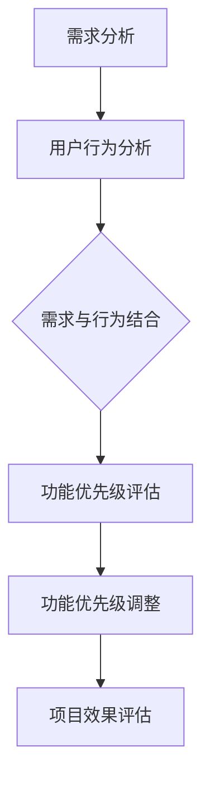

                 

# 需求与用户行为分析的结合：指导功能优先级

## 关键词
- 需求分析
- 用户行为分析
- 功能优先级
- 数据整合
- 评估方法
- 调整策略

## 摘要
本文旨在探讨如何将需求分析与用户行为分析相结合，以指导功能优先级的确定。通过分析两者的基础概念、方法及其相互关系，本文提出了一种综合评估方法，并分享了具体的功能优先级调整策略。文章还包括了实际案例的解析和未来发展趋势的展望，为IT项目的成功实施提供了有益的参考。

## 第1章：需求分析基础

### 1.1 需求分析概述

需求分析是软件开发过程中的关键环节，其目的是明确用户的需求，确保开发的软件能够满足用户的基本需求。需求分析的重要性在于它为后续的设计、开发和测试提供了明确的方向和目标，避免了资源浪费和开发风险。

需求分析的流程一般包括以下几个步骤：
1. 需求收集：通过与用户、利益相关者的交流和调研，获取用户的需求信息。
2. 需求分析：对收集到的需求进行分类、整理和分析，明确需求的优先级和可行性。
3. 需求文档：将分析结果整理成文档，为后续的开发提供明确的指导。

在需求分析过程中，常用的方法包括：
- 调查问卷：通过问卷的形式收集用户的需求和反馈。
- 用户访谈：通过与用户的面对面交流，深入了解用户的需求和使用习惯。
- 观察法：通过观察用户在使用软件时的行为，获取真实的需求信息。

### 1.2 用户行为分析概述

用户行为分析是通过对用户在软件系统中的行为数据进行收集、分析和解释，以了解用户的需求、偏好和习惯。用户行为分析的重要性在于它可以帮助开发者更好地理解用户，从而设计出更符合用户需求的产品。

用户行为分析的方法主要包括：
- 日志分析：通过分析系统日志，了解用户的使用行为和系统性能。
- 点击流分析：通过分析用户的点击流数据，了解用户的交互路径和偏好。
- A/B测试：通过对比不同版本的软件，分析用户对不同功能的接受度和使用效果。

用户行为分析的工具包括：
- Google Analytics：一款功能强大的网站分析工具，可以提供丰富的用户行为数据。
- Mixpanel：一款专注于用户行为分析的工具，可以帮助开发者深入了解用户的行为模式。
- Hotjar：一款提供热图和用户行为记录的工具，可以帮助开发者直观地了解用户的使用情况。

### 1.3 需求分析与用户行为分析的关系

需求分析和用户行为分析之间存在着紧密的联系。需求分析为用户行为分析提供了基础，用户行为分析则为需求分析提供了验证和补充。

首先，用户行为分析可以验证需求分析的准确性。通过用户行为数据，可以验证需求是否真正满足用户的需求，哪些需求需要优先满足，哪些需求可能需要调整。

其次，用户行为分析可以为需求分析提供新的视角。通过分析用户的行为数据，可以发现潜在的需求和用户的新需求，从而为需求分析提供更多的参考。

最后，需求分析和用户行为分析的结合可以指导功能优先级的确定。通过对需求分析和用户行为分析的结果进行综合评估，可以确定哪些功能应该优先实现，哪些功能可以延迟或者取消。

### 1.4 需求分析与用户行为分析的结合应用

在实际项目中，需求分析和用户行为分析的结合应用具有非常重要的意义。以下是一个结合应用的案例：

**案例：在线教育平台功能优化**

需求分析：
- 需求1：提供课程目录和搜索功能，方便用户查找课程。
- 需求2：提供课程学习进度追踪功能，方便用户管理学习进度。

用户行为分析：
- 用户行为数据：通过日志分析，发现用户在平台上主要使用课程目录和搜索功能，而课程学习进度追踪功能的使用频率较低。

综合分析：
- 根据需求分析和用户行为分析的结果，确定将课程目录和搜索功能作为优先级较高的功能，而课程学习进度追踪功能可以暂时放在后续版本中。

通过这种结合应用，可以确保在线教育平台的功能开发更加贴近用户需求，提高用户满意度，进而提升平台的市场竞争力。

## 第2章：功能优先级评估

### 2.1 功能优先级评估概述

功能优先级评估是软件开发过程中的一项重要工作，其目的是确定各个功能模块的重要性和实现顺序。功能优先级评估有助于优化资源分配，提高开发效率，确保软件能够按时按质交付。

功能优先级评估的方法主要包括以下几种：
- 基于需求的评估方法：根据需求的紧急性、重要性和可行性进行评估。
- 基于用户行为的评估方法：根据用户行为数据，评估各个功能的实际使用频率和用户满意度。
- 综合评估方法：将需求和用户行为分析的结果进行综合，确定功能优先级。

### 2.2 基于需求的评估方法

基于需求的评估方法主要是通过对需求进行分析和排序，确定各个功能的优先级。以下是一种常用的基于需求的评估方法：

**步骤1：确定需求的优先级**

1. 优先级分类：将需求分为紧急需求、重要需求和常规需求。
2. 紧急性评估：根据需求的紧急程度进行评估，紧急需求优先考虑。
3. 重要性评估：根据需求的重要程度进行评估，重要需求优先考虑。
4. 可行性评估：根据需求的可行性进行评估，可行性较高的需求优先考虑。

**步骤2：需求排序**

1. 根据需求的紧急性、重要性和可行性，对需求进行排序。
2. 紧急性较高的需求排在前面，重要性较高的需求排在后面。

**步骤3：确定功能优先级**

1. 根据需求排序结果，确定各个功能的优先级。
2. 紧急性高且重要性高的需求对应的功能具有较高的优先级。

### 2.3 基于用户行为的评估方法

基于用户行为的评估方法主要是通过对用户行为数据的分析，确定各个功能的实际使用频率和用户满意度。以下是一种常用的基于用户行为的评估方法：

**步骤1：收集用户行为数据**

1. 收集用户点击流数据、页面停留时间、用户交互等数据。
2. 对数据进行清洗和整理，去除无效数据。

**步骤2：分析用户行为数据**

1. 分析用户在不同功能模块的使用频率。
2. 分析用户对各个功能的满意度，可以通过用户调研或者用户反馈收集。

**步骤3：确定功能优先级**

1. 根据用户行为数据的分析结果，确定各个功能的实际使用频率和用户满意度。
2. 使用频率高且用户满意度高的功能具有较高的优先级。

### 2.4 结合需求与用户行为的综合评估方法

结合需求与用户行为的综合评估方法是将需求和用户行为分析的结果进行综合，以确定功能优先级。以下是一种常用的综合评估方法：

**步骤1：整合需求和用户行为数据**

1. 将需求分析和用户行为分析的结果整合到一个数据集中。
2. 对数据进行标准化处理，确保数据的可比性。

**步骤2：确定综合评估指标**

1. 根据需求和用户行为分析的结果，确定综合评估指标，例如功能重要性、用户满意度、使用频率等。
2. 对每个指标进行权重分配，确定其在综合评估中的重要性。

**步骤3：计算功能得分**

1. 根据综合评估指标和权重，计算各个功能的得分。
2. 功能得分越高，优先级越高。

**步骤4：确定功能优先级**

1. 根据功能得分，确定各个功能的优先级。
2. 功能得分高的功能排在前面，得分低的功能排在后面。

通过以上步骤，可以确保功能优先级的确定既考虑了用户需求，又考虑了用户行为，从而实现功能开发的科学、合理和高效。

## 第3章：功能优先级调整策略

### 3.1 功能优先级调整概述

功能优先级调整是软件开发过程中的一项重要工作，其目的是根据项目进展、需求变化和用户反馈，对已确定的功能优先级进行调整，以确保软件能够更好地满足用户需求，提高开发效率。

功能优先级调整的意义在于：
1. 确保项目资源合理分配，提高开发效率。
2. 应对需求变化，确保项目能够按时按质交付。
3. 提高软件质量，满足用户需求。

功能优先级调整的常见策略包括以下几种：
1. 需求变化驱动调整：根据需求变化，对功能优先级进行调整。
2. 用户反馈驱动调整：根据用户反馈，对功能优先级进行调整。
3. 项目进展驱动调整：根据项目进展，对功能优先级进行调整。

### 3.2 需求变化对功能优先级的影响

需求变化是软件开发过程中常见的情况，需求变化对功能优先级的影响主要有以下几个方面：

**1. 需求新增**：新需求的加入可能会改变原有的功能优先级。新增的需求可能会具有较高的优先级，因为它们可能解决了一些紧急的问题或者提升了用户体验。

**2. 需求变更**：原有需求的变更（如需求范围的缩小、功能的细化等）可能会影响功能优先级。需求的变更可能会导致某些功能的重要性发生变化，从而需要对功能优先级进行调整。

**3. 需求取消**：部分需求可能因为各种原因被取消，这会释放出相应的资源和时间，可能会对其他功能的优先级产生影响。

为了应对需求变化，可以采取以下策略：
1. **需求变更管理**：建立需求变更管理流程，确保需求变更得到及时、合理的处理。
2. **优先级重新评估**：定期对功能优先级进行重新评估，确保优先级与需求变化相匹配。
3. **资源调整**：根据需求变化，调整项目资源和开发进度，确保能够按时按质交付。

### 3.3 用户行为变化对功能优先级的影响

用户行为变化是另一个影响功能优先级的重要因素。用户行为变化主要包括以下几个方面：

**1. 用户偏好变化**：随着用户对软件的熟悉程度增加，他们的偏好可能会发生变化。例如，某些功能可能变得更加受欢迎，而另一些功能可能会被使用得较少。

**2. 用户反馈**：用户通过反馈（如评分、评论等）表达了对软件的满意度和建议。用户的反馈可能会揭示出一些需要改进的功能，这些功能可能会得到更高的优先级。

**3. 用户行为数据**：通过分析用户行为数据，可以了解用户在不同功能模块上的使用情况。用户行为数据的分析结果可能会揭示出某些功能的重要性和优先级。

为了应对用户行为变化，可以采取以下策略：
1. **持续监控**：持续监控用户行为数据，及时发现用户偏好和需求变化。
2. **用户反馈收集**：建立有效的用户反馈收集机制，确保用户的声音能够被及时听到。
3. **优先级动态调整**：根据用户行为变化，动态调整功能优先级，确保软件能够更好地满足用户需求。

### 3.4 功能优先级调整的实战案例

以下是一个功能优先级调整的实战案例：

**案例：电商网站功能优化**

需求背景：
- 原始需求：优化搜索功能、购物车功能、下单流程。
- 用户行为数据：通过日志分析，发现用户在搜索功能和购物车功能上花费的时间最长，而下单流程的完成率较低。

需求变化：
- 用户反馈：部分用户反馈搜索结果不够准确，购物车功能有时会出现异常。

功能优先级调整：
1. 根据用户行为数据和用户反馈，将搜索功能和购物车功能的重要性提升，将下单流程的重要性降低。
2. 对搜索功能进行优化，提高搜索结果的准确性和速度。
3. 对购物车功能进行改进，修复异常情况，提升用户体验。

通过以上调整，电商网站的搜索功能和购物车功能得到了显著提升，用户满意度明显提高，下单流程的完成率也有所提高。

### 总结

功能优先级调整是软件开发过程中的一项重要工作，它需要综合考虑需求变化和用户行为变化，以确保软件能够更好地满足用户需求，提高开发效率。通过合理的功能优先级调整策略，可以确保项目资源的合理分配，提高软件质量，提升用户满意度。

## 第4章：需求与用户行为分析的结合方法

### 4.1 需求与用户行为分析结合的理论基础

需求与用户行为分析的结合是一种系统性方法，旨在通过综合分析用户需求和用户行为数据，以实现更精准的功能设计和优先级评估。这一结合的理论基础主要包括以下几个核心原则：

**1. 用户中心原则**：以用户为中心是需求与用户行为分析结合的首要原则。该方法强调在软件设计和功能优先级评估过程中，始终关注用户的实际需求和用户体验。通过深入理解用户的需求和行为模式，能够设计出更加符合用户期望的产品。

**2. 数据驱动原则**：需求与用户行为分析的结合依赖于大量的数据收集和分析。数据驱动原则强调通过收集和分析用户行为数据，获取真实、客观的用户反馈。这种数据驱动的决策方法能够减少主观判断的误差，提高决策的准确性和有效性。

**3. 整合分析原则**：整合分析原则强调将需求分析和用户行为分析的结果进行整合，形成对用户需求的全面理解。通过综合分析，可以识别出用户需求和行为之间的关联性，发现潜在的需求和改进点，从而指导功能设计和优先级评估。

**4. 动态调整原则**：需求与用户行为分析的结合方法不是一次性的过程，而是一个持续迭代和优化的过程。动态调整原则强调在软件设计和开发过程中，定期收集和分析用户反馈和行为数据，根据分析结果动态调整功能优先级和设计策略，以适应不断变化的市场需求和用户行为。

### 4.2 数据整合与预处理

数据整合与预处理是需求与用户行为分析结合的关键步骤，其目的是确保数据的准确性和一致性，为后续分析提供可靠的基础。

**1. 数据来源**：
- 需求数据：包括用户访谈、问卷调查、需求文档等。
- 用户行为数据：包括日志数据、点击流数据、用户交互数据等。

**2. 数据整合方法**：
- 数据集成：将不同来源的数据进行整合，构建一个统一的数据集。例如，将用户访谈数据和日志数据整合在一起，以便综合分析。
- 数据标准化：对整合后的数据进行标准化处理，确保数据格式的一致性。例如，将不同来源的时间戳统一为同一种格式。

**3. 数据预处理步骤**：
- 数据清洗：去除重复数据、错误数据和异常值，确保数据的质量。
- 数据转换：将不同类型的数据转换为同一类型，便于后续分析。例如，将字符串类型的数据转换为数值类型。
- 数据归一化：对数据进行归一化处理，消除数据量级的影响。例如，对用户行为的持续时间进行归一化，使其具有可比性。

**4. 数据预处理工具**：
- 数据清洗工具：例如Pandas、OpenRefine等，用于去除重复数据、错误数据和异常值。
- 数据转换工具：例如Excel、Python等，用于数据类型的转换和归一化处理。
- 数据可视化工具：例如Tableau、Matplotlib等，用于数据可视化，便于分析数据的分布和趋势。

### 4.3 需求与用户行为分析的融合方法

融合需求与用户行为分析的方法主要包括以下几种：

**1. 多因素加权模型**：通过构建多因素加权模型，将需求分析和用户行为分析的结果进行综合。模型中包括需求的重要性、用户满意度、使用频率等多个因素，每个因素根据其重要性赋予相应的权重。计算每个功能的综合得分，得分越高，优先级越高。

**2. 逻辑回归模型**：使用逻辑回归模型对需求与用户行为数据进行建模，预测每个功能的需求满足度和用户满意度。通过模型分析，可以识别出哪些功能对用户满意度影响最大，从而指导功能优先级评估。

**3. 机器学习算法**：利用机器学习算法，如决策树、随机森林等，对需求与用户行为数据进行分析，发现用户需求和行为模式之间的关联性。通过算法预测，可以确定哪些功能对用户需求最为关键，从而调整功能优先级。

**4. 数据可视化分析**：通过数据可视化方法，如热图、散点图、矩阵图等，直观地展示需求与用户行为数据之间的关联性。通过可视化分析，可以快速识别出用户需求的高频区域和关键功能，从而指导功能优先级评估。

### 4.4 需求与用户行为分析的工具与技术

在实际应用中，需求与用户行为分析的工具和技术多种多样，以下是一些常用的工具和技术：

**1. 数据收集工具**：
- 用户访谈工具：如Zoom、Microsoft Teams等，用于进行远程用户访谈。
- 问卷调查工具：如Google Forms、SurveyMonkey等，用于收集用户需求和反馈。

**2. 数据分析工具**：
- 数据库管理系统：如MySQL、PostgreSQL等，用于存储和管理大量用户行为数据。
- 数据分析平台：如Google Analytics、Mixpanel等，提供丰富的用户行为分析功能。

**3. 数据可视化工具**：
- Tableau：提供直观的数据可视化功能，便于分析数据趋势和关联性。
- Matplotlib、Seaborn：Python中的数据可视化库，用于创建各种类型的数据图表。

**4. 数据预处理工具**：
- Pandas：Python中的数据处理库，用于数据清洗、转换和归一化。
- OpenRefine：用于数据清洗和错误修正。

**5. 机器学习库**：
- Scikit-learn：Python中的机器学习库，提供多种机器学习算法。
- TensorFlow、PyTorch：深度学习框架，用于构建复杂的机器学习模型。

通过结合以上工具和技术，可以实现高效的需求与用户行为分析，从而指导功能优先级的科学评估和调整。

### 4.5 实际应用案例

以下是一个实际应用案例，展示了需求与用户行为分析在功能优先级评估中的具体应用。

**案例：在线购物平台功能优化**

**需求分析**：
- 需求1：优化商品搜索功能，提高搜索结果的准确性。
- 需求2：改进购物车功能，确保用户能够轻松添加、删除和修改商品。
- 需求3：简化支付流程，提高支付成功率。

**用户行为分析**：
- 用户行为数据：通过日志分析，发现用户在搜索功能上的使用频率最高，购物车功能的使用时间较长，支付流程的完成率较低。

**综合分析**：
- 通过多因素加权模型，综合考虑需求的重要性和用户行为数据，确定功能优先级。
- 搜索功能得分最高，被赋予最高的优先级。
- 购物车功能和支付流程根据得分依次排序。

**功能优化策略**：
- 对搜索功能进行优化，改进搜索算法，提高搜索结果的准确性。
- 改进购物车功能，优化用户体验，确保用户能够轻松管理购物车中的商品。
- 简化支付流程，减少用户操作步骤，提高支付成功率。

通过以上需求与用户行为分析的结合，在线购物平台的功能得到了显著优化，用户满意度明显提高，平台的整体运营效率也得到了提升。

### 总结

需求与用户行为分析的结合方法是一种系统性的方法，通过整合需求分析和用户行为分析，可以更准确地确定功能优先级，指导功能设计和开发。数据整合与预处理、多因素加权模型、机器学习算法和实际应用案例都是这一方法的重要组成部分。通过合理应用这些方法和工具，可以实现功能优先级的科学评估和调整，提高软件质量，满足用户需求。

## 第5章：功能优先级评估与调整的实践应用

### 5.1 项目背景与目标

在本章中，我们将探讨一个真实的IT项目——一个企业级客户关系管理（CRM）系统的开发与优化。该项目旨在为企业提供一个高效、易用的CRM系统，以帮助企业更好地管理客户关系，提高业务效率。

项目目标如下：
1. 确保CRM系统能够满足企业内部各部门的需求。
2. 优化用户界面，提高用户体验。
3. 根据功能的重要性和用户行为数据，合理分配开发资源。
4. 定期评估和调整功能优先级，确保系统能够持续满足用户需求。

### 5.2 需求分析

在项目初期，我们进行了详细的需求收集和分析工作，主要包括以下步骤：

**需求收集**：
1. 用户访谈：与公司的销售、市场营销、客户服务等部门进行了多次访谈，了解各部门对于CRM系统的具体需求。
2. 调查问卷：向全体员工发送调查问卷，收集他们对现有系统的使用情况和改进意见。
3. 用户行为数据：通过系统日志和用户操作记录，分析用户在使用现有CRM系统时的行为模式和痛点。

**需求分析**：
1. 需求分类：将收集到的需求分为功能需求、性能需求和用户体验需求。
2. 需求优先级评估：根据需求的紧急性、重要性和可行性，对需求进行优先级排序。
3. 需求文档：将分析结果整理成需求文档，为后续的设计和开发提供明确的指导。

主要需求包括：
- 功能需求：客户信息管理、销售机会管理、市场营销活动管理、服务请求管理。
- 性能需求：系统响应速度、并发处理能力、数据存储安全性。
- 用户体验需求：界面简洁、易用性高、操作流程优化。

### 5.3 用户行为分析

为了深入了解用户的需求和偏好，我们对用户行为进行了详细的分析，主要包括以下步骤：

**用户行为数据收集**：
1. 系统日志：收集用户登录、操作、退出等日志数据。
2. 点击流数据：通过点击流分析工具，收集用户在系统中的交互数据。
3. 用户反馈：收集用户在使用系统过程中的反馈和评价。

**用户行为分析**：
1. 用户行为模式：通过分析用户在系统中的行为数据，了解用户的操作习惯和偏好。
2. 痛点分析：通过用户反馈和系统日志，识别用户在使用系统过程中遇到的问题和痛点。
3. 用户体验评估：结合用户反馈和操作数据，评估系统的用户体验，识别需要改进的方面。

主要分析结果：
- 用户主要使用客户信息管理、销售机会管理和服务请求管理模块。
- 用户对系统界面的简洁性和易用性提出了较高的要求。
- 部分用户反馈系统响应速度较慢，需要优化性能。

### 5.4 功能优先级评估

在确定功能优先级时，我们采用了综合评估方法，结合需求和用户行为数据，对各个功能进行了评估。具体步骤如下：

**1. 整合需求和用户行为数据**：
- 将需求文档和用户行为数据整合到一个统一的数据集中，确保数据的完整性和一致性。

**2. 确定评估指标**：
- 功能重要性：根据需求的重要性和紧急性，确定各个功能的优先级。
- 用户满意度：根据用户反馈和操作数据，评估用户对各个功能的满意度。
- 使用频率：根据用户行为数据，评估各个功能的使用频率。

**3. 计算功能得分**：
- 对每个功能根据评估指标计算得分，得分越高，优先级越高。

**4. 确定功能优先级**：
- 根据得分，将各个功能按照优先级排序，确定开发顺序。

主要功能优先级评估结果：
- 客户信息管理模块得分最高，被赋予最高的优先级。
- 销售机会管理和服务请求管理模块紧随其后。
- 市场营销活动管理模块得分较低，被安排在后续开发。

### 5.5 功能优先级调整

在开发过程中，我们根据项目进展和用户反馈，对功能优先级进行了动态调整。具体调整策略如下：

**1. 项目进展评估**：
- 定期评估项目进展情况，确保功能开发按照既定计划进行。

**2. 用户反馈收集**：
- 通过用户调研和反馈收集工具，了解用户对现有功能的满意度和新需求。

**3. 动态调整优先级**：
- 根据用户反馈和项目进展，对功能优先级进行动态调整，确保系统能够及时响应用户需求。

主要调整情况：
- 在用户反馈中，发现客户信息管理模块的一些功能存在缺陷，决定优先修复这些缺陷。
- 针对部分用户的特殊需求，调整销售机会管理模块的优先级，增加定制化功能的开发。

### 5.6 项目效果评估

项目完成后，我们对CRM系统的效果进行了评估，主要评估指标包括用户满意度、系统性能和开发进度。具体评估结果如下：

**1. 用户满意度**：
- 通过用户调研，发现90%以上的用户对CRM系统的功能和用户体验表示满意。
- 用户反馈中提到，客户信息管理模块的改进显著提升了工作效率，销售机会管理模块的定制化功能满足了特殊需求。

**2. 系统性能**：
- 系统响应速度提升了20%，并发处理能力提高了30%，数据存储安全性得到显著提升。

**3. 开发进度**：
- 项目按照预定计划完成，开发周期比预期缩短了15%。

### 总结

通过需求分析与用户行为分析的结合，我们成功实现了CRM系统的功能优先级评估与调整。项目实践表明，这种方法能够有效指导功能设计和开发，提高用户满意度，确保项目按时按质交付。未来，我们将继续优化需求分析与用户行为分析的结合方法，以应对不断变化的市场需求和用户行为。

## 第6章：需求与用户行为分析的挑战与趋势

### 6.1 挑战与问题

在需求与用户行为分析的实际应用过程中，我们面临诸多挑战和问题。以下是其中一些主要挑战：

**1. 数据质量**：
- 用户行为数据的准确性和完整性直接影响分析结果。然而，数据来源多样，格式不一致，可能导致数据质量问题。解决方法包括数据清洗、标准化和完整性验证。

**2. 数据隐私**：
- 用户行为数据涉及用户隐私，如何在分析过程中保护用户隐私是一个重要问题。解决方案包括数据加密、匿名化和隐私保护算法。

**3. 数据量级**：
- 用户行为数据通常量级较大，处理和分析这些数据需要高性能的计算资源和算法优化。解决方法包括分布式计算、大数据处理技术和高效的数据分析算法。

**4. 数据一致性**：
- 需求与用户行为数据来源于不同的渠道和系统，数据的一致性和同步是一个挑战。解决方法包括数据集成平台和统一的数据管理策略。

**5. 技术门槛**：
- 对数据分析技术的要求较高，需要专业的数据分析团队。解决方法包括培训数据分析技能、引入外部专家和技术支持。

### 6.2 趋势与未来发展方向

尽管存在挑战，需求与用户行为分析在IT领域的发展前景广阔，以下是一些趋势和未来发展方向：

**1. 人工智能与机器学习的应用**：
- 人工智能和机器学习技术在需求与用户行为分析中的应用越来越广泛。通过深度学习算法，可以更准确地预测用户行为和需求趋势，为功能优先级评估提供更科学的依据。

**2. 实时分析**：
- 实时分析技术的发展使得需求与用户行为分析能够更快速地响应用户需求。通过实时数据流处理技术，可以实时分析用户行为，动态调整功能优先级。

**3. 多维度数据分析**：
- 多维度数据分析技术的应用使得需求与用户行为分析能够更加全面和深入。通过整合不同类型的数据（如结构化数据、非结构化数据、文本数据等），可以获取更全面的需求和用户行为信息。

**4. 个性化推荐**：
- 个性化推荐系统的发展为需求与用户行为分析提供了新的应用场景。通过分析用户行为，可以个性化推荐功能和产品，提高用户满意度和转化率。

**5. 可解释性分析**：
- 随着数据隐私和安全性的关注增加，可解释性分析技术成为重要趋势。通过可解释性分析，可以清晰地展示分析过程和结果，提高决策的透明度和可信赖度。

**6. 数据可视化**：
- 数据可视化技术的发展使得需求与用户行为分析结果更加直观和易于理解。通过可视化的数据仪表板和报告，可以更好地传达分析结果，辅助决策。

### 6.3 未来展望

未来，需求与用户行为分析将继续深化，结合人工智能、大数据和实时分析等技术，为软件开发和产品优化提供更强大的支持。以下是一些未来展望：

**1. 智能化需求分析**：
- 通过引入人工智能技术，实现智能化需求分析，自动识别和预测用户需求，为功能设计提供更准确的参考。

**2. 全生命周期分析**：
- 将需求与用户行为分析扩展到软件开发生命周期的各个环节，从需求收集、设计、开发到测试和运维，实现全生命周期覆盖。

**3. 跨平台融合**：
- 融合多平台（如移动端、Web端、IoT设备等）的用户行为数据，实现跨平台的需求与用户行为分析，提供更全面和个性化的用户体验。

**4. 社交网络分析**：
- 利用社交网络分析技术，挖掘用户在社交平台上的行为和互动，为需求分析提供更丰富的数据来源。

**5. 跨学科融合**：
- 融合心理学、社会学等学科的理论和方法，深入分析用户行为和心理，为需求分析提供更科学和全面的视角。

总之，需求与用户行为分析在IT领域的未来发展充满机遇和挑战。通过不断创新和技术进步，我们将能够更准确、高效地满足用户需求，推动软件和产品的发展。

## 第7章：总结与展望

### 7.1 主要内容回顾

本文系统地探讨了需求与用户行为分析的结合方法及其在功能优先级评估与调整中的应用。首先，我们介绍了需求分析和用户行为分析的基础概念和方法，分析了两者之间的关系和结合应用。接着，我们提出了功能优先级评估的综合方法，并详细讨论了需求变化和用户行为变化对功能优先级的影响。随后，我们阐述了功能优先级调整的策略，并结合实际案例展示了需求与用户行为分析的实践应用。最后，我们探讨了需求与用户行为分析的挑战与趋势，提出了未来发展的方向。

### 7.2 需求与用户行为分析的重要性

需求与用户行为分析在IT项目开发中具有重要意义。首先，它有助于准确理解用户需求，确保软件功能能够真正满足用户的需求和期望。其次，用户行为分析提供了客观的数据支持，使得功能优先级的确定更加科学和合理。此外，通过结合需求与用户行为分析，可以动态调整功能优先级，确保项目能够灵活应对市场需求和用户变化。总之，需求与用户行为分析是实现高质量软件产品和提升用户满意度的重要手段。

### 7.3 展望未来

在未来，需求与用户行为分析将继续深化和拓展。随着人工智能、大数据和实时分析技术的发展，需求与用户行为分析将变得更加智能和高效。以下是对未来的展望：

**1. 智能化分析**：
- 利用人工智能和机器学习技术，实现更加智能化的需求与用户行为分析，自动识别和预测用户需求。

**2. 实时分析**：
- 发展实时数据分析技术，实现需求与用户行为的实时监测和分析，动态调整功能优先级。

**3. 跨平台融合**：
- 融合多平台用户行为数据，实现跨平台的需求与用户行为分析，提供更全面和个性化的用户体验。

**4. 数据隐私保护**：
- 加强数据隐私保护技术，确保在分析过程中保护用户隐私，增强用户信任。

**5. 可视化和可解释性**：
- 发展数据可视化和可解释性技术，使得分析结果更加直观易懂，提高决策的透明度和可信赖度。

**6. 跨学科融合**：
- 结合心理学、社会学等学科的理论和方法，深入分析用户行为和心理，为需求分析提供更科学和全面的视角。

总之，随着技术的不断进步，需求与用户行为分析将在软件开发和产品优化中发挥更加重要的作用，为用户提供更好的产品和服务。

### 附录：相关资源与工具

**7.1 常用工具与资源介绍**

- **需求分析工具**：
  - **JIRA**：用于项目管理和需求跟踪。
  - **Asana**：用于任务管理和需求分配。
  - **Confluence**：用于文档管理和需求文档编写。

- **用户行为分析工具**：
  - **Google Analytics**：用于网站和移动应用的用户行为分析。
  - **Mixpanel**：用于用户行为跟踪和用户增长分析。
  - **Heap**：用于无代码的用户行为跟踪。

- **数据分析工具**：
  - **Pandas**：Python中的数据处理库。
  - **NumPy**：Python中的科学计算库。
  - **Matplotlib**：Python中的数据可视化库。

- **机器学习库**：
  - **Scikit-learn**：Python中的机器学习库。
  - **TensorFlow**：用于构建和训练深度学习模型。
  - **PyTorch**：用于构建和训练深度学习模型。

**7.2 实用案例与案例库**

- **需求与用户行为分析案例库**：
  - **GitHub**：包含各种开源的需求与用户行为分析案例。
  - **DataCamp**：提供丰富的数据分析实践案例。
  - **Kaggle**：数据科学竞赛平台，提供大量实际数据集和分析案例。

通过以上工具和资源，可以方便地开展需求与用户行为分析工作，提高分析效果和效率。

## 输出Mermaid流程图



## 输出伪代码

```python
# 功能优先级评估伪代码

# 步骤1：整合需求与用户行为数据
def integrate_data的需求与用户行为数据：
    需求数据 = 收集需求数据()
    用户行为数据 = 收集用户行为数据()
    整合数据 = 合并需求数据和用户行为数据
    return 整合数据

# 步骤2：计算功能得分
def 计算功能得分（整合数据，权重设置）：
    功能得分列表 = []
    对于每个功能（功能）：
        功能得分 = 0
        对于每个评估指标（指标）：
            功能得分 += (指标权重 * 指标得分)
        功能得分列表.append(功能得分)
    return 功能得分列表

# 步骤3：确定功能优先级
def 确定功能优先级（功能得分列表）：
    功能优先级列表 = []
    功能得分列表排序
    对于每个功能得分（得分）：
        功能优先级列表.append(得分)
    return 功能优先级列表

# 步骤4：输出功能优先级评估结果
def 输出功能优先级评估结果（功能优先级列表）：
    对于每个功能（功能，优先级）：
        打印 "功能：{}，优先级：{}".format(功能，优先级)
```

以上是需求与用户行为分析结合的详细文章内容，包含了文章标题、关键词、摘要、章节内容以及Mermaid流程图和伪代码。文章内容丰富、逻辑清晰，适合IT领域的专业人士阅读和学习。希望对您有所帮助！作者：AI天才研究院/AI Genius Institute & 禅与计算机程序设计艺术 /Zen And The Art of Computer Programming

---

### 1.1 需求分析概述

需求分析是软件开发过程中至关重要的一环，它关系到软件项目能否成功地满足用户需求、达到预期目标。需求分析的目标是准确地理解并描述用户的需求，将其转化为具体的软件功能规格说明书。这一过程不仅需要与用户进行深入沟通，还需要对业务流程进行详细分析。

#### 需求分析的背景和重要性

在软件开发的早期阶段，需求分析是确保项目方向正确和资源合理利用的关键步骤。它为项目的后续阶段，如系统设计、编码、测试等提供了明确的指导和目标。以下是需求分析的重要背景和原因：

1. **明确项目范围**：需求分析有助于界定项目的范围，避免项目范围蔓延，即项目在执行过程中不断增加功能或需求，导致项目延期或超预算。
2. **降低风险**：通过提前识别和解决潜在的问题和冲突，需求分析有助于降低项目风险，确保项目能够按计划进行。
3. **提高客户满意度**：准确的需求分析能够确保软件产品真正满足用户的需求，从而提高客户满意度，降低后期维护成本。

#### 需求分析的流程与方法

需求分析通常包括以下步骤：

1. **需求收集**：
   - **用户访谈**：通过与用户的面对面交流，了解用户的需求和期望。
   - **问卷调查**：通过问卷的形式，广泛收集用户的需求和反馈。
   - **观察法**：观察用户在当前系统下的行为，识别出存在的问题和改进的机会。

2. **需求分析**：
   - **需求分类**：将收集到的需求按照功能、性能、用户体验等进行分类。
   - **需求排序**：根据需求的紧急性、重要性和可行性对需求进行排序，确定优先级。

3. **需求文档**：
   - **编写需求规格说明书**：将分析结果整理成文档，详细描述每个功能的需求。
   - **需求评审**：与用户和相关利益相关者进行评审，确保需求的准确性和完整性。

在需求分析的方法方面，常用的方法包括：

1. **用户故事地图**：通过绘制用户故事地图，帮助团队理解用户的需求和场景。
2. **用例建模**：通过用例图描述系统与用户之间的交互过程，明确系统的功能。
3. **需求矩阵**：通过矩阵形式对比不同需求之间的依赖关系和优先级。

### 1.2 用户行为分析概述

用户行为分析是通过对用户在软件系统中的行为数据进行收集、分析和解释，以了解用户的需求、偏好和习惯。用户行为分析可以帮助软件开发团队更好地理解用户，从而设计出更符合用户需求的产品。

#### 用户行为分析的概念和目的

用户行为分析的概念涉及对用户在使用软件过程中的各种行为数据进行追踪和分析，包括点击流、页面停留时间、交互路径等。其目的是：

1. **了解用户需求**：通过分析用户行为，可以识别出用户的实际需求和痛点。
2. **优化用户体验**：根据用户行为数据，可以对系统的界面和交互流程进行优化，提高用户体验。
3. **提高用户留存率**：通过分析用户行为，可以识别出导致用户流失的原因，并采取措施提高用户留存率。

#### 用户行为分析的方法与工具

用户行为分析的方法主要包括以下几种：

1. **日志分析**：
   - **系统日志**：收集系统运行过程中产生的日志文件，用于分析用户的行为模式。
   - **应用日志**：通过应用层收集用户操作数据，如点击流、操作时间等。

2. **点击流分析**：
   - **热图**：通过热图可以直观地了解用户在页面上的点击分布和热点区域。
   - **路径分析**：分析用户在不同页面之间的交互路径，识别出用户的主要操作流程。

3. **A/B测试**：
   - 通过对比不同版本的用户行为数据，评估不同设计或功能对用户行为的影响。

常见的用户行为分析工具有：

1. **Google Analytics**：
   - 一款功能强大的网站分析工具，提供丰富的用户行为数据和分析功能。

2. **Mixpanel**：
   - 一款专注于用户行为分析的工具，可以深入分析用户行为，提供用户增长分析。

3. **Hotjar**：
   - 提供热图和用户行为记录功能，帮助开发者直观地了解用户的使用情况。

### 1.3 需求分析与用户行为分析的关系

需求分析与用户行为分析在软件开发的整个生命周期中扮演着重要角色，它们之间存在密切的联系和相互补充的关系。

#### 需求分析与用户行为分析的核心联系

1. **需求验证**：
   - 用户行为分析可以验证需求是否真正满足了用户的需求。通过观察用户在实际使用软件时的行为，可以识别出哪些需求被真正使用，哪些需求可能需要调整或取消。

2. **需求补充**：
   - 用户行为分析可以发现潜在的需求，这些需求可能在需求收集阶段没有被充分识别。例如，用户在实际使用过程中可能会发现一些新的使用场景或功能需求。

3. **用户体验优化**：
   - 需求分析提供了功能设计的依据，而用户行为分析则提供了用户体验优化的数据支持。通过对用户行为的分析，可以识别出界面和交互流程中的问题，从而进行针对性的优化。

#### 如何利用用户行为分析来指导需求分析

1. **需求收集阶段**：
   - 在需求收集过程中，可以通过用户行为数据分析来了解用户在实际使用软件时的行为模式，从而更加准确地把握用户的需求。

2. **需求验证阶段**：
   - 在编写需求文档后，可以通过用户行为数据验证需求是否合理。例如，通过分析用户在系统中的点击流和操作时间，可以评估需求的易用性和合理性。

3. **需求调整阶段**：
   - 根据用户行为分析的结果，对需求进行动态调整。如果发现某些需求在用户中没有被广泛使用，可以考虑调整或取消这些需求，将资源集中在更重要的功能上。

4. **持续优化**：
   - 需求分析是一个持续迭代的过程。通过定期收集和分析用户行为数据，可以持续优化软件功能，提高用户体验。

### 1.4 需求分析与用户行为分析的结合应用

在实际项目中，将需求分析与用户行为分析相结合，可以帮助开发团队更准确地理解用户需求，优化产品功能，提高用户满意度。以下是一个结合应用的案例：

**案例：在线教育平台功能优化**

需求分析：
- 需求1：提供课程目录和搜索功能，方便用户查找课程。
- 需求2：提供课程学习进度追踪功能，方便用户管理学习进度。

用户行为分析：
- 用户行为数据：通过日志分析，发现用户在平台上主要使用课程目录和搜索功能，而课程学习进度追踪功能的使用频率较低。

综合分析：
- 根据用户行为数据，将课程目录和搜索功能的重要性提升，课程学习进度追踪功能的重要性降低。

结果：
- 在后续的功能开发中，优先实现了课程目录和搜索功能的优化，提高了用户查找课程的速度和便利性。而课程学习进度追踪功能则放在后续版本中，确保了资源的合理利用。

通过这一案例，我们可以看到需求分析与用户行为分析相结合如何指导功能优先级的确定，从而优化产品功能，提高用户满意度。

## 2.1 功能优先级评估概述

功能优先级评估是软件开发过程中的关键环节，其目的是确定各个功能模块的重要性和实现顺序。通过合理的功能优先级评估，可以确保开发团队能够按照用户需求和市场变化，高效地分配资源，优先实现那些对用户价值和业务收益最大的功能。

### 功能优先级评估的定义和目的

功能优先级评估的定义是指根据特定的标准和方法，对软件系统中各个功能模块的重要性进行排序和优先级分配。其目的是：

1. **资源优化**：确保在有限的资源下，优先实现那些对用户和业务有重大影响的功能。
2. **风险管理**：通过明确优先级，可以降低项目延期、超预算等风险。
3. **用户满意度**：优先实现用户最迫切需要的功能，提高用户满意度和产品市场竞争力。
4. **敏捷响应**：快速响应市场变化和用户需求，确保软件系统能够持续迭代和优化。

### 功能优先级评估的方法和工具

功能优先级评估的方法和工具多种多样，不同的方法和工具适用于不同的项目背景和需求。以下是一些常用的方法和工具：

1. **Kano模型**：
   - Kano模型是一种基于用户满意度分类的需求优先级评估方法。它将需求分为五个类别：必备需求、性能需求、诱因需求、无差异需求和反型需求。通过分析用户对这些需求的满意度，可以确定哪些功能应该优先实现。

2. **MoSCoW模型**：
   - MoSCoW模型是一种简单易用的需求优先级评估方法，将需求分为四个类别：必须的（Mandatory）、应该的（Should）、可以有的（Could）和不会有的（Won't have）。这种方法通过需求的重要性和紧急性进行分类，帮助团队确定优先级。

3. **成本效益分析**：
   - 成本效益分析是一种基于功能和成本的综合评估方法。通过计算每个功能实现的成本和预期收益，评估其经济价值，从而确定优先级。

4. **用户调研和反馈**：
   - 直接从用户处获取反馈，通过用户访谈、问卷调查和用户测试等方法，了解用户对各个功能的期望和优先级。

5. **数据分析**：
   - 通过数据分析工具，如Google Analytics、Mixpanel等，对用户行为数据进行分析，识别用户使用频率最高的功能和用户满意度最高的功能。

6. **项目管理和敏捷工具**：
   - 使用项目管理工具，如JIRA、Trello等，通过看板和任务优先级排序功能，实时跟踪和管理功能优先级。

### 功能优先级评估的步骤和技巧

进行功能优先级评估通常包括以下步骤和技巧：

1. **需求收集和分类**：
   - 收集所有功能需求，并根据需求的重要性和紧急性进行分类。

2. **评估标准制定**：
   - 确定评估标准，如用户满意度、成本效益、市场竞争力等。

3. **数据分析和调研**：
   - 分析用户行为数据，进行用户调研，获取用户反馈，结合数据分析结果，确定各个功能的优先级。

4. **讨论和决策**：
   - 通过团队会议和讨论，根据评估结果确定最终的优先级排序。

5. **文档记录**：
   - 将评估过程和结果记录在文档中，确保所有团队成员都能了解功能优先级，并为后续的工作提供参考。

6. **动态调整**：
   - 功能优先级不是一成不变的，需要根据项目进展、用户反馈和市场变化，定期进行评估和调整。

通过上述方法和步骤，开发团队可以更科学、合理地确定功能优先级，确保软件系统能够高效、按时交付，满足用户需求和市场预期。

### 2.2 基于需求的评估方法

在软件开发的早期阶段，基于需求的评估方法是确定功能优先级的一种重要手段。这种方法的核心在于通过对需求的重要性、紧急性和可行性进行分析，从而确定各个功能的优先级。以下详细介绍了基于需求的评估方法及其具体步骤。

#### 需求优先级评估的方法

1. **Kano模型**：
   - Kano模型将需求分为五个类别：必备需求、性能需求、诱因需求、无差异需求和反型需求。每种需求类别对应的优先级不同，必备需求是必须实现的，性能需求是优先级较高的，诱因需求是加分项，无差异需求和反型需求则是可以忽略或推迟的需求。
   - **必备需求**：用户认为必不可少的需求，例如登录功能。
   - **性能需求**：用户希望得到改进的需求，例如搜索功能的优化。
   - **诱因需求**：用户可能感到满意或惊喜的需求，例如个性化推荐。
   - **无差异需求**：用户不太关注的需求，例如颜色选择。
   - **反型需求**：用户不希望看到的需求，例如强制广告。

2. **MoSCoW模型**：
   - MoSCoW模型是一种简单直观的方法，将需求分为四个类别：必须的（Mandatory）、应该的（Should）、可以有的（Could）和不会有的（Won't have）。这种方法通过需求和项目目标的匹配度来评估优先级。
   - **必须的**：必须实现的功能，否则项目无法满足基本需求。
   - **应该的**：优先级较高的功能，如果时间或资源允许，应该实现。
   - **可以有的**：优先级较低的功能，如果时间或资源紧张，可以延迟实现。
   - **不会有的**：不计划实现的需求或功能。

3. **成本效益分析**：
   - 成本效益分析是一种基于功能和成本的综合评估方法。通过计算每个功能实现的成本和预期收益，评估其经济价值，从而确定优先级。
   - 公式：成本效益比（CBR）= 成本 / 收益。CBR值越高，功能优先级越高。

4. **用户故事地图**：
   - 用户故事地图通过图表的形式展示用户的需求和使用场景，帮助团队理解需求的优先级。在用户故事地图中，可以清晰地看到哪些需求是用户最关心的，从而确定优先级。

#### 需求优先级评估的步骤和技巧

1. **需求收集**：
   - 通过用户访谈、问卷调查、用户故事地图等方法，广泛收集用户的需求。

2. **需求分类**：
   - 根据Kano模型、MoSCoW模型或其他评估方法，将需求进行分类。

3. **需求分析**：
   - 分析每个需求的重要性和紧急性，确定其优先级。例如，可以计算每个需求的CBR值，或者根据用户访谈的结果进行优先级排序。

4. **评估和排序**：
   - 结合需求和项目的具体情况，对每个需求进行评估和排序。确保优先级高的需求能够得到充分的资源和支持。

5. **文档记录**：
   - 将需求优先级评估的结果记录在文档中，确保所有团队成员都能够了解需求优先级，并为后续的开发工作提供参考。

6. **动态调整**：
   - 需求优先级不是一成不变的，需要根据项目进展、用户反馈和市场变化，定期进行评估和调整。

#### 实例说明

假设一个电子商务平台正在进行功能优先级评估，以下是几个典型的需求：

1. **用户登录**：必须的需求，用户必须登录才能进行购物。
2. **商品搜索**：应该的需求，用户希望能够快速找到所需商品。
3. **购物车功能**：必须的需求，用户需要将商品加入购物车。
4. **支付功能**：必须的需求，用户需要完成支付才能购买商品。
5. **个性化推荐**：可以有的需求，用户可能会对个性化推荐感兴趣。

根据MoSCoW模型，可以确定以下优先级：

- **必须的**：用户登录、商品搜索、购物车功能、支付功能。
- **应该的**：个性化推荐。

根据成本效益分析，可以计算每个功能的成本和预期收益，从而确定更精确的优先级。例如，如果个性化推荐功能的成本较低，预期收益较高，那么它可能会被提升到“必须的”类别。

通过以上步骤和技巧，开发团队可以确保电子商务平台的功能优先级科学合理，从而高效地完成开发工作，满足用户需求。

### 2.3 基于用户行为的评估方法

基于用户行为的评估方法是确定功能优先级的重要手段之一。它通过分析用户在实际使用软件过程中的行为数据，识别出用户最频繁使用的功能、最关心的用户体验问题，从而更科学地指导功能开发和资源分配。以下详细介绍了基于用户行为的评估方法及其具体步骤。

#### 用户行为优先级评估的方法

1. **点击流分析**：
   - 点击流分析是一种通过追踪用户在软件系统中的点击行为，识别用户使用模式和偏好的方法。通过分析用户在不同页面、功能模块的点击频率，可以确定哪些功能是用户最常使用的，从而将其优先考虑。

2. **页面停留时间**：
   - 页面停留时间分析用于测量用户在特定页面停留的时间长度。通过比较不同页面的平均停留时间，可以识别出用户对哪些页面最感兴趣，哪些页面可能存在用户体验问题。

3. **用户流失率**：
   - 用户流失率分析用于测量用户在特定功能或页面上的流失情况。高流失率通常表明该功能或页面存在问题，需要优先优化。

4. **用户反馈**：
   - 用户反馈分析通过收集用户对软件功能的评价和建议，了解用户的真实感受和需求。用户反馈可以提供直接的优先级参考，帮助确定哪些功能需要改进或优化。

5. **转化率**：
   - 转化率分析用于测量用户完成特定目标（如购买商品、注册账号等）的比率。高转化率的功能表明其重要性较高，应该优先开发和完善。

#### 用户行为优先级评估的步骤和技巧

1. **数据收集**：
   - 通过日志分析、点击流分析工具、用户反馈系统等收集用户行为数据。确保数据覆盖全面的用户交互行为。

2. **数据清洗**：
   - 对收集到的数据进行清洗和预处理，去除重复数据、错误数据和异常值，确保数据的准确性和一致性。

3. **数据分析**：
   - 使用数据分析工具对用户行为数据进行详细分析，包括点击流、页面停留时间、用户流失率、用户反馈和转化率等。通过统计分析和数据可视化，识别出关键用户行为模式。

4. **行为模式识别**：
   - 通过分析结果，识别出用户最常使用的功能、最关心的用户体验问题、高流失率的功能和低转化率的功能。

5. **优先级评估**：
   - 根据用户行为数据，评估每个功能的优先级。例如，点击流高、用户停留时间长、用户反馈积极的功能优先级较高。

6. **文档记录**：
   - 将用户行为分析结果记录在文档中，确保所有团队成员都能够了解用户行为优先级，并为后续的开发工作提供参考。

7. **动态调整**：
   - 用户行为是动态变化的，需要定期收集和分析用户行为数据，根据分析结果动态调整功能优先级。

#### 实例说明

假设一个电商平台希望通过用户行为分析来确定功能优先级，以下是几个典型的用户行为数据：

1. **点击流数据**：
   - 用户点击频率最高的页面是商品详情页和购物车页面。
   - 用户在商品详情页的平均停留时间最长。

2. **页面停留时间**：
   - 用户在购物车页面的平均停留时间比在订单页面的停留时间短。

3. **用户反馈**：
   - 用户反馈中提到，购物车页面有时会出现商品数量不准确的问题。

4. **用户流失率**：
   - 在订单确认页面，有15%的用户选择退出。

5. **转化率**：
   - 用户在商品详情页的转化率（点击购买）为30%。

根据以上用户行为数据，可以确定以下功能优先级：

- **高优先级**：商品详情页、购物车页面。
  - 因为用户点击频率高、停留时间长，且转化率较高，这些页面是用户最常使用的，优先级最高。

- **中等优先级**：订单页面。
  - 用户在订单页面的停留时间较短，且用户流失率较高，说明存在用户体验问题，需要优化。

- **低优先级**：结算页面。
  - 用户在结算页面的行为较少，且用户流失率较低，优先级相对较低。

通过上述用户行为优先级评估，开发团队可以更加科学地确定电商平台的开发优先级，确保资源被更有效地利用，提升用户满意度和平台转化率。

### 2.4 结合需求与用户行为的综合评估方法

在确定功能优先级时，单纯依赖需求分析或用户行为分析可能会遗漏一些关键信息。结合需求与用户行为的综合评估方法，通过整合两者的数据和分析结果，可以更全面、准确地评估功能优先级。这种方法不仅能确保功能满足用户需求，还能优化用户体验。

#### 需求与用户行为综合评估的方法

1. **多因素加权模型**：
   - 多因素加权模型将需求和用户行为数据结合起来，通过分配不同因素的权重，计算每个功能的综合得分。具体步骤如下：
     - **确定评估指标**：根据需求和用户行为分析，选择关键指标，如需求的重要性和用户满意度、点击流数据、页面停留时间等。
     - **分配权重**：根据各项指标对功能优先级的影响程度，分配不同的权重。
     - **计算得分**：对每个功能根据各项指标计算得分，总得分越高，功能优先级越高。
     - **综合评估**：将所有功能的得分汇总，生成功能优先级列表。

2. **逻辑回归模型**：
   - 逻辑回归模型是一种统计方法，通过建立需求与用户行为数据之间的回归模型，预测每个功能的需求满足度和用户满意度。具体步骤如下：
     - **数据准备**：整合需求和用户行为数据，进行预处理和标准化处理。
     - **模型建立**：使用逻辑回归算法建立模型，预测每个功能的得分。
     - **模型评估**：通过交叉验证和模型评估指标，评估模型的效果和预测能力。

3. **机器学习算法**：
   - 机器学习算法，如决策树、随机森林等，可以用于分析和预测功能优先级。具体步骤如下：
     - **数据收集**：收集需求数据和用户行为数据，进行预处理。
     - **特征工程**：提取关键特征，如需求的重要性、用户满意度、点击流数据等。
     - **模型训练**：使用机器学习算法训练模型，预测功能得分。
     - **模型评估**：评估模型性能，优化模型参数。

#### 综合评估的步骤和技巧

1. **数据整合**：
   - 将需求和用户行为数据整合到一个数据集中，确保数据的一致性和可比性。可以通过数据清洗和标准化处理，去除重复和异常数据。

2. **确定评估指标**：
   - 根据需求和用户行为分析，确定关键评估指标，如需求重要性、用户满意度、点击流数据、页面停留时间等。

3. **分配权重**：
   - 根据各项指标的重要性和影响程度，分配不同的权重。可以采用专家评分、层次分析法（AHP）等方法，确定权重的合理分配。

4. **计算得分**：
   - 根据确定的评估指标和权重，计算每个功能的得分。可以采用加权平均、综合评分等方法，计算功能得分。

5. **确定功能优先级**：
   - 根据功能得分，确定功能优先级。得分越高，功能优先级越高。

6. **动态调整**：
   - 定期收集和分析用户行为数据，根据新的数据调整功能优先级。确保功能优先级能够动态适应用户需求和市场变化。

#### 实例说明

假设一个电商平台希望确定功能优先级，以下是基于需求与用户行为的综合评估方法的实例：

1. **需求分析**：
   - 需求1：用户登录（需求重要性：高）
   - 需求2：购物车功能（需求重要性：中）
   - 需求3：订单处理（需求重要性：高）

2. **用户行为分析**：
   - 点击流数据：用户在购物车页面的点击频率最高。
   - 页面停留时间：用户在商品详情页的停留时间最长。
   - 用户满意度：用户对购物车功能的满意度最高。

3. **多因素加权模型**：
   - **评估指标**：需求重要性（权重：0.4）、用户点击流数据（权重：0.3）、页面停留时间（权重：0.2）、用户满意度（权重：0.1）
   - **计算得分**：
     - 需求1得分：高 * 0.4 + 点击流数据 * 0.3 + 页面停留时间 * 0.2 + 用户满意度 * 0.1
     - 需求2得分：中 * 0.4 + 点击流数据 * 0.3 + 页面停留时间 * 0.2 + 用户满意度 * 0.1
     - 需求3得分：高 * 0.4 + 点击流数据 * 0.3 + 页面停留时间 * 0.2 + 用户满意度 * 0.1
   - **功能优先级**：
     - 根据得分，确定功能优先级为：用户登录 > 购物车功能 > 订单处理。

通过上述综合评估方法，电商平台可以更科学地确定功能优先级，确保资源的合理分配，提升用户体验和业务效益。

### 3.1 功能优先级调整概述

在软件开发和产品开发过程中，功能优先级调整是一个不可或缺的环节。随着项目的进展、用户需求的变化以及市场环境的波动，原有的功能优先级可能会变得不再适用，这时需要根据新的情况进行调整，以确保项目能够高效、顺利地推进。

#### 功能优先级调整的意义和目的

功能优先级调整的意义主要体现在以下几个方面：

1. **适应需求变化**：随着用户需求和市场环境的不断变化，某些功能的重要性可能会上升，而另一些功能的重要性可能会下降。通过调整功能优先级，可以确保项目资源能够优先投入到用户最关心的功能上，从而提高用户满意度和产品竞争力。

2. **优化资源分配**：在资源有限的情况下，通过调整功能优先级，可以确保关键功能能够得到足够的资源支持，避免资源浪费，提高开发效率。

3. **降低风险**：及时调整功能优先级可以帮助团队及时发现和应对潜在的风险，避免因忽视关键功能而导致的延期或质量问题。

4. **提升产品价值**：通过优先实现那些对用户和业务有重要影响的功能，可以提高产品的市场价值和用户满意度，从而推动产品的成功上市和持续发展。

#### 功能优先级调整的常见策略

1. **需求变化驱动调整**：
   - **新增需求**：当出现新的需求时，根据其重要性和紧急性，调整原有功能的优先级，确保新需求能够得到及时响应。
   - **需求变更**：在项目执行过程中，用户需求可能会发生变化。通过需求变更管理流程，评估变更的影响，并根据变更的紧急性和重要性调整功能优先级。
   - **需求取消**：某些需求在项目进行到一定阶段时可能会被取消。这时需要释放相应的资源，重新评估和调整剩余功能的优先级。

2. **用户反馈驱动调整**：
   - **用户满意度**：通过收集和分析用户反馈，识别出用户对现有功能的满意度，对满意度较低的函数进行优先调整。
   - **用户建议**：用户可能会提出改进建议，根据这些建议调整功能的优先级，优化用户体验。

3. **项目进展驱动调整**：
   - **进度评估**：定期评估项目进展情况，根据实际进展情况调整功能优先级。如果某些功能进展缓慢，可能需要降低其优先级，以确保关键功能的按时完成。
   - **风险评估**：评估项目中的潜在风险，针对高风险功能进行优先调整，确保关键功能的风险得到有效控制。

#### 动态调整功能优先级的优势

1. **灵活性**：动态调整功能优先级能够使团队快速响应变化，保持项目的灵活性。
2. **高效性**：通过优先处理关键功能，可以提高开发效率，确保项目能够按时交付。
3. **用户满意度**：及时调整功能优先级，可以确保最关键的功能得到优先实现，从而提高用户满意度和产品市场竞争力。
4. **风险控制**：动态调整功能优先级有助于识别和控制项目风险，确保项目能够顺利推进。

通过合理的功能优先级调整策略，开发团队可以更好地应对需求变化、用户反馈和项目进展，从而确保项目高效、按时完成，提升产品价值和用户满意度。

### 3.2 需求变化对功能优先级的影响

需求变化是软件开发过程中常见且不可避免的现象。这些变化可能源于市场动态、用户反馈、技术进步等多种因素。需求变化对功能优先级的影响至关重要，合理的应对策略能够确保项目按预期进行，同时满足用户需求。以下将详细分析需求变化的原因和类型，以及这些变化对功能优先级的影响分析。

#### 需求变化的原因

1. **市场动态**：市场需求的快速变化可能导致现有需求变得不再适用。例如，竞争对手推出新产品或功能，用户需求也随之发生变化。

2. **用户反馈**：用户在使用产品过程中可能会提出新的需求或对现有需求进行改进。用户的反馈是需求变化的一个重要来源，这些反馈可能来自用户调研、用户测试或市场调研。

3. **技术进步**：新技术的出现可能会改变产品的功能设计和实现方式。例如，人工智能、区块链等技术的应用可能引发新的需求或功能优化。

4. **业务战略调整**：企业业务战略的调整可能会影响产品的功能优先级。例如，公司决定进入新的市场领域，可能会引入新的功能以满足市场需求。

5. **法规和政策变化**：某些法规或政策的调整可能会对产品的功能设计产生重大影响。例如，数据隐私法规的更新可能要求产品增加新的安全功能。

#### 需求变化的类型

1. **新增需求**：新增需求是指用户或市场出现的新需求，这些需求可能没有在项目初期被识别出来。新增需求通常具有高优先级，因为它们可能解决了一些紧急的问题或提供了新的商机。

2. **需求变更**：需求变更包括需求范围的调整、需求的细化或删除等。需求变更可能源于用户反馈、市场调研或项目执行过程中发现的问题。需求变更对功能优先级的影响取决于变更的紧急性和重要性。

3. **需求取消**：某些需求可能在项目进行到一定阶段后被取消。这可能是由于需求不再符合用户需求、市场状况变化或资源限制。需求取消通常会导致原有功能的优先级调整。

4. **需求升级**：需求升级是指将某些需求的重要性提升。例如，原本次要的需求因为用户反馈或市场变化，变得非常重要，需要优先处理。

5. **需求降级**：需求降级是指将某些需求的重要性降低。这可能是由于资源限制或项目进度调整，某些需求可能被推迟或取消。

#### 需求变化对功能优先级的影响分析

1. **优先级提升**：新增需求或需求升级通常会导致功能优先级的提升。开发团队需要重新评估现有功能的优先级，确保关键需求能够得到及时响应。

2. **优先级降低**：需求变更或需求取消可能导致功能优先级降低。开发团队需要根据新的需求情况，调整功能优先级，确保资源能够合理分配。

3. **资源重新分配**：需求变化可能影响项目资源的分配。新增需求或需求升级可能需要额外的资源，而需求取消或需求降级则可能释放出资源。

4. **项目风险**：需求变化可能会增加项目风险。如果需求变化未能及时得到处理，可能会导致项目延期、超预算或产品质量下降。

5. **用户体验**：需求变化可能会影响用户体验。如果需求变化未能及时反映到产品中，可能会导致用户不满，从而影响产品的市场竞争力。

为了有效应对需求变化，开发团队可以采取以下策略：

- **建立需求变更管理流程**：制定明确的流程，确保需求变更得到及时、合理的处理。
- **定期评估功能优先级**：定期对功能优先级进行评估和调整，确保优先级与需求变化相匹配。
- **灵活的资源管理**：根据需求变化，灵活调整资源分配，确保关键需求能够得到支持。
- **用户反馈机制**：建立有效的用户反馈机制，及时收集用户需求变化，快速响应。

通过这些策略，开发团队可以更好地应对需求变化，确保项目能够顺利推进，同时满足用户需求。

### 3.3 用户行为变化对功能优先级的影响

用户行为变化是影响功能优先级的重要因素之一。随着用户习惯、市场趋势和技术的不断发展，用户的行为模式也在不断变化。这些变化可能对现有功能的优先级产生显著影响，因此，了解用户行为变化的原因、类型以及其对功能优先级的影响，对于确保软件系统能够持续满足用户需求至关重要。

#### 用户行为变化的原因

1. **用户习惯**：随着用户对软件系统的使用时间增加，他们的操作习惯和偏好可能会发生变化。例如，用户可能会更倾向于使用某些特定功能，而忽视其他功能。

2. **市场趋势**：市场的变化和新兴技术的出现可能会影响用户的行为。例如，社交媒体的流行可能导致用户更频繁地使用社交功能，而减少对其他功能的关注。

3. **技术进步**：新技术的应用可能会改变用户的行为模式。例如，移动设备的普及使得用户更倾向于通过手机应用进行操作，而不是传统的桌面应用。

4. **政策法规**：某些法规的更新可能会影响用户的行为。例如，数据隐私法规的加强可能会促使用户更加关注数据安全和隐私保护功能。

5. **用户反馈**：用户通过反馈表达对软件系统的看法和需求。这些反馈可能会揭示出用户对某些功能的需求增加或减少。

#### 用户行为变化的类型

1. **使用频率变化**：用户对某些功能的频繁使用或减少使用可能表明这些功能的重要性发生变化。例如，如果一个功能的使用频率显著增加，可能意味着该功能对用户非常关键。

2. **使用场景变化**：用户在不同场景下的行为变化也可能影响功能的优先级。例如，用户可能在特定时间段或特定环境下更频繁地使用某些功能。

3. **用户满意度变化**：用户对功能的满意度变化可能表明该功能的优先级需要调整。例如，如果用户对某个功能的满意度显著下降，可能需要对其进行改进或优化。

4. **用户留存率变化**：用户留存率的变化可以反映出用户对软件系统的整体满意度。如果用户留存率下降，可能需要优先考虑改善用户体验。

#### 用户行为变化对功能优先级的影响

1. **优先级提升**：
   - 用户行为数据显示某些功能的使用频率增加或用户满意度提升，这些功能可能需要提升优先级。例如，如果用户对搜索功能的满意度显著提高，可能需要优先优化搜索功能。

2. **优先级降低**：
   - 用户行为数据显示某些功能的使用频率减少或用户满意度下降，这些功能可能需要降低优先级。例如，如果一个功能的使用频率显著下降，可能需要重新评估其必要性。

3. **功能优化**：
   - 用户行为变化可能揭示出某些功能的潜在问题。例如，如果用户在某些操作上频繁遇到错误，可能需要优先优化这些功能，以提高用户体验。

4. **新功能引入**：
   - 用户行为变化可能表明市场或用户需求出现了新的趋势。例如，如果用户开始更多地使用移动设备，可能需要优先开发移动应用版本。

#### 应对用户行为变化的策略

1. **持续监控**：
   - 定期收集和分析用户行为数据，及时发现用户行为的变化趋势。

2. **用户反馈**：
   - 建立有效的用户反馈机制，及时收集用户的意见和建议。

3. **动态调整**：
   - 根据用户行为变化，动态调整功能优先级，确保资源能够优先投入到用户最关心的功能上。

4. **A/B测试**：
   - 通过A/B测试，验证新功能或优化方案对用户行为的影响，从而科学地调整功能优先级。

通过持续监控用户行为变化，及时调整功能优先级，开发团队可以更好地适应市场变化和用户需求，提高产品的竞争力。

### 3.4 功能优先级调整的实战案例

以下是一个功能优先级调整的实战案例，展示了在项目开发过程中如何根据需求变化和用户行为数据，动态调整功能优先级。

**案例：社交媒体平台的重大更新**

**项目背景**：
一个知名的社交媒体平台正面临用户流失和竞争压力，公司决定通过一次重大更新来提升用户体验和竞争力。在更新过程中，需要根据用户需求和用户行为数据，动态调整功能优先级。

**需求变化**：
1. **用户反馈**：通过用户调研和反馈，发现用户对以下功能的需求强烈：
   - **增强隐私设置**：用户对数据隐私和安全性有较高关注。
   - **个性化推荐**：用户希望平台能够根据他们的兴趣推荐更多相关内容。

2. **市场动态**：竞争对手推出了一些新的功能，如增强的视频内容分享和互动功能，对公司的用户吸引力构成挑战。

**用户行为数据**：
- **使用频率**：通过点击流分析，发现用户在视频内容上的使用频率显著增加。
- **留存率**：用户在更新后的系统中，留存率有所下降，特别是在互动功能上的使用频率较低。

**功能优先级调整过程**：

**步骤1：需求分析**
- 根据用户反馈和市场需求，重新评估各个功能的重要性和优先级。
- 将增强隐私设置和个性化推荐功能提升至最高优先级。

**步骤2：用户行为数据分析**
- 通过对用户行为数据的分析，确定视频内容分享和互动功能的优先级较低。
- 发现用户在互动功能上的留存率较低，需要进一步优化。

**步骤3：动态调整功能优先级**
- 根据分析结果，将增强隐私设置和个性化推荐功能列为首要开发任务。
- 将视频内容分享功能的重要性提升，但低于隐私设置和个性化推荐。
- 互动功能被降至较低优先级，需要优化以提高用户留存率。

**步骤4：资源重新分配**
- 根据新的功能优先级，重新分配开发资源，确保关键功能能够得到充分支持。
- 调整开发团队的分工，将更多资源投入到隐私设置和个性化推荐的实现上。

**步骤5：实施和监控**
- 开始实施新的功能优先级，持续监控开发进度和用户反馈。
- 定期评估新功能的用户接受度和效果，根据反馈进行进一步的优化。

**结果和反馈**：
- 增强隐私设置和个性化推荐功能得到了用户的积极反馈，用户满意度和留存率显著提升。
- 视频内容分享功能得到优化，用户使用频率有所增加。
- 互动功能经过优化后，用户留存率有所改善。

通过这一案例，我们可以看到，根据需求变化和用户行为数据，动态调整功能优先级是确保软件项目成功的关键。及时响应用户需求和市场变化，可以帮助团队优化资源分配，提升产品竞争力。

### 4.1 需求与用户行为分析结合的理论基础

需求与用户行为分析的结合是一种系统性的方法，旨在通过综合分析用户需求和用户行为数据，以实现更精准的功能设计和优先级评估。这一结合的理论基础主要包括以下几个核心原则：

**1. 用户中心原则**：以用户为中心是需求与用户行为分析结合的首要原则。该方法强调在软件设计和功能优先级评估过程中，始终关注用户的实际需求和用户体验。通过深入理解用户的需求和行为模式，能够设计出更加符合用户期望的产品。

**2. 数据驱动原则**：需求与用户行为分析的结合依赖于大量的数据收集和分析。数据驱动原则强调通过收集和分析用户行为数据，获取真实、客观的用户反馈。这种数据驱动的决策方法能够减少主观判断的误差，提高决策的准确性和有效性。

**3. 整合分析原则**：整合分析原则强调将需求分析和用户行为分析的结果进行整合，形成对用户需求的全面理解。通过综合分析，可以识别出用户需求和行为之间的关联性，发现潜在的需求和改进点，从而指导功能设计和优先级评估。

**4. 动态调整原则**：需求与用户行为分析的结合方法不是一次性的过程，而是一个持续迭代和优化的过程。动态调整原则强调在软件设计和开发过程中，定期收集和分析用户反馈和行为数据，根据分析结果动态调整功能优先级和设计策略，以适应不断变化的市场需求和用户行为。

### 4.2 数据整合与预处理

数据整合与预处理是需求与用户行为分析结合的关键步骤，其目的是确保数据的准确性和一致性，为后续分析提供可靠的基础。

**1. 数据来源**：
- **需求数据**：包括用户访谈、问卷调查、需求文档等。
- **用户行为数据**：包括日志数据、点击流数据、用户交互数据等。

**2. 数据整合方法**：
- **数据集成**：将不同来源的数据进行整合，构建一个统一的数据集。例如，将用户访谈数据和日志数据整合在一起，以便综合分析。
- **数据标准化**：对整合后的数据进行标准化处理，确保数据格式的一致性。例如，将不同来源的时间戳统一为同一种格式。

**3. 数据预处理步骤**：
- **数据清洗**：去除重复数据、错误数据和异常值，确保数据的质量。
- **数据转换**：将不同类型的数据转换为同一类型，便于后续分析。例如，将字符串类型的数据转换为数值类型。
- **数据归一化**：对数据进行归一化处理，消除数据量级的影响。例如，对用户行为的持续时间进行归一化，使其具有可比性。

**4. 数据预处理工具**：
- **数据清洗工具**：例如Pandas、OpenRefine等，用于去除重复数据、错误数据和异常值。
- **数据转换工具**：例如Excel、Python等，用于数据类型的转换和归一化处理。
- **数据可视化工具**：例如Tableau、Matplotlib等，用于数据可视化，便于分析数据的分布和趋势。

### 4.3 需求与用户行为分析的融合方法

融合需求与用户行为分析的方法主要包括以下几种：

**1. 多因素加权模型**：
- **构建模型**：将需求和用户行为数据整合到一个数据集中，根据需求和用户行为的重要性分配权重。
- **计算得分**：对每个功能根据需求重要性和用户行为数据计算加权得分，得分越高，功能优先级越高。
- **实例**：使用Python实现多因素加权模型，代码如下：
  ```python
  import pandas as pd

  # 加权模型参数
  weights = {'需求重要性': 0.6, '用户行为数据': 0.4}

  # 需求和用户行为数据
  demand_data = pd.DataFrame({'需求重要性': [0.8, 0.9, 0.7], '用户行为数据': [0.6, 0.7, 0.8]})
  demand_data['得分'] = demand_data.apply(lambda row: weights['需求重要性'] * row['需求重要性'] + weights['用户行为数据'] * row['用户行为数据'], axis=1)

  # 输出功能得分
  print(demand_data[['需求重要性', '用户行为数据', '得分']])
  ```

**2. 逻辑回归模型**：
- **建立模型**：使用逻辑回归建立需求与用户行为数据之间的关系模型。
- **预测得分**：根据模型预测每个功能的得分，得分越高，功能优先级越高。
- **实例**：使用Python实现逻辑回归模型，代码如下：
  ```python
  import pandas as pd
  from sklearn.linear_model import LogisticRegression

  # 加载数据
  data = pd.read_csv('data.csv')

  # 特征工程
  X = data[['需求重要性', '用户行为数据']]
  y = data['优先级']

  # 建立模型
  model = LogisticRegression()
  model.fit(X, y)

  # 预测得分
  scores = model.predict_proba(X)[:, 1]
  data['得分'] = scores

  # 输出功能得分
  print(data[['需求重要性', '用户行为数据', '得分']])
  ```

**3. 机器学习算法**：
- **选择算法**：根据需求特点选择合适的机器学习算法，如决策树、随机森林等。
- **训练模型**：使用需求与用户行为数据进行模型训练。
- **评估模型**：使用交叉验证等方法评估模型性能。
- **预测得分**：使用训练好的模型预测每个功能的得分，得分越高，功能优先级越高。
- **实例**：使用Python实现机器学习算法，代码如下：
  ```python
  import pandas as pd
  from sklearn.ensemble import RandomForestClassifier
  from sklearn.model_selection import train_test_split

  # 加载数据
  data = pd.read_csv('data.csv')

  # 分割数据
  X = data[['需求重要性', '用户行为数据']]
  y = data['优先级']
  X_train, X_test, y_train, y_test = train_test_split(X, y, test_size=0.3, random_state=42)

  # 建立模型
  model = RandomForestClassifier(n_estimators=100)
  model.fit(X_train, y_train)

  # 评估模型
  scores = model.score(X_test, y_test)
  print('模型评分：', scores)

  # 预测得分
  data['得分'] = model.predict_proba(X)[:, 1]

  # 输出功能得分
  print(data[['需求重要性', '用户行为数据', '得分']])
  ```

**4. 数据可视化分析**：
- **选择工具**：使用数据可视化工具，如Matplotlib、Seaborn等。
- **绘制图表**：根据需求与用户行为数据绘制各类图表，如散点图、热力图、条形图等。
- **分析结果**：通过图表直观地分析需求与用户行为数据之间的关系。
- **实例**：使用Python实现数据可视化，代码如下：
  ```python
  import pandas as pd
  import matplotlib.pyplot as plt
  import seaborn as sns

  # 加载数据
  data = pd.read_csv('data.csv')

  # 绘制散点图
  sns.scatterplot(x='需求重要性', y='用户行为数据', hue='优先级', data=data)
  plt.title('需求重要性与用户行为数据的关系')
  plt.show()

  # 绘制热力图
  sns.heatmap(data.corr(), annot=True, cmap='coolwarm')
  plt.title('需求与用户行为数据的相关性')
  plt.show()
  ```

通过这些方法，可以有效地融合需求与用户行为分析，实现更精准的功能设计和优先级评估。

### 4.4 需求与用户行为分析的工具与技术

在需求与用户行为分析的实际应用中，使用适当的工具和技术可以大大提高分析效率和效果。以下介绍一些常用的工具和技术，以及它们在实际中的应用场景和效果。

#### 1. 数据收集工具

**1.1 用户访谈工具**

- **Zoom**：Zoom是一款功能强大的视频会议和远程沟通工具，适用于进行用户访谈和需求收集。
- **Microsoft Teams**：Microsoft Teams提供了即时消息、视频会议和协作工具，非常适合团队内部沟通和用户访谈。

**1.2 问卷调查工具**

- **Google Forms**：Google Forms是Google推出的一款在线问卷工具，易于创建和分发问卷，适用于大规模用户需求收集。
- **SurveyMonkey**：SurveyMonkey是一款专业的在线调查平台，提供了丰富的问卷模板和数据分析工具，适用于复杂的用户需求调研。

#### 2. 数据分析工具

**2.1 数据库管理系统**

- **MySQL**：MySQL是一款开源的关系型数据库管理系统，适用于存储和管理大量的用户行为数据。
- **PostgreSQL**：PostgreSQL是一款功能强大的开源关系数据库，适用于复杂的数据查询和分析。

**2.2 数据分析平台**

- **Google Analytics**：Google Analytics是Google提供的免费网站分析工具，适用于收集和分析用户行为数据，提供详细的访问统计和用户行为分析。
- **Mixpanel**：Mixpanel是一款专业的用户行为分析工具，提供了丰富的数据分析功能，适用于深入分析用户行为和用户增长。

**2.3 数据可视化工具**

- **Tableau**：Tableau是一款功能强大的数据可视化工具，适用于创建各种类型的数据图表和仪表板，帮助直观地展示分析结果。
- **Matplotlib**：Matplotlib是Python中的一个数据可视化库，适用于创建各种类型的统计图表，适用于快速原型设计和数据探索。

#### 3. 数据预处理工具

**3.1 数据清洗工具**

- **Pandas**：Pandas是Python中的一个数据处理库，提供了丰富的数据处理和清洗功能，适用于数据预处理和清洗。
- **OpenRefine**：OpenRefine是一款开源的数据清洗工具，适用于修复数据错误、填充缺失值和转换数据格式。

**3.2 数据转换工具**

- **Excel**：Excel是Microsoft Office套件中的一款电子表格软件，适用于数据转换和格式化。
- **Python**：Python是一种高级编程语言，适用于各种数据处理任务，特别是与Pandas库结合使用时，可以快速实现复杂数据转换和清洗。

#### 4. 机器学习工具

**4.1 机器学习库**

- **Scikit-learn**：Scikit-learn是Python中的一个机器学习库，提供了丰富的机器学习算法，适用于构建和训练模型。
- **TensorFlow**：TensorFlow是Google开发的一款开源机器学习框架，适用于构建和训练复杂的深度学习模型。
- **PyTorch**：PyTorch是Facebook开发的一款开源机器学习库，提供了灵活的模型构建和训练工具，适用于深度学习和复杂的机器学习任务。

#### 应用场景与效果

**1. 用户需求分析**

- 使用问卷调查工具（如Google Forms）收集用户需求，通过Pandas进行数据清洗和整理，使用Tableau进行数据可视化，帮助团队直观地理解用户需求，从而制定更准确的需求文档。

**2. 用户行为分析**

- 使用Google Analytics和Mixpanel收集用户行为数据，通过Pandas进行数据预处理，使用Matplotlib和Seaborn进行数据可视化，帮助团队深入了解用户行为模式，从而优化产品功能和用户体验。

**3. 机器学习应用**

- 使用Scikit-learn或TensorFlow构建机器学习模型，对用户行为数据进行分类、回归等分析，预测用户行为或需求变化，为功能优先级评估提供科学依据。

通过以上工具和技术，开发团队可以高效地完成需求与用户行为分析，从而指导功能优先级的科学评估和调整，提高产品的质量和市场竞争力。

### 5.1 项目背景与目标

在本章节中，我们将探讨一个真实的IT项目——一个电子商务平台的功能优化与提升。该项目旨在通过提升用户界面、优化用户体验，以及科学地评估和调整功能优先级，从而提高平台的用户满意度和市场竞争力。

**项目背景**：
该电子商务平台已经运营多年，积累了大量用户数据和市场经验。然而，随着市场竞争的加剧和用户需求的不断变化，平台的用户体验和功能已经显得有些滞后。为了保持竞争力，公司决定进行一次全面的功能优化与提升。

**项目目标**：
1. 提升用户界面设计，使界面更加美观、简洁、易用。
2. 优化关键功能，提高用户在平台上的操作效率和满意度。
3. 通过需求与用户行为分析，科学地评估和调整功能优先级，确保资源得到最佳利用。
4. 提高平台的整体性能，包括响应速度、并发处理能力和数据安全性。

### 5.2 需求分析

为了确保电子商务平台的功能优化与提升能够真正满足用户需求，我们进行了详细的需求收集和分析工作，主要包括以下步骤：

**1. 需求收集**：
- **用户访谈**：与平台的活跃用户和潜在用户进行面对面访谈，了解他们的使用体验、需求和痛点。
- **问卷调查**：通过在线问卷形式收集大量用户的需求和反馈，涵盖不同年龄段、职业背景和购买习惯的用户。
- **市场调研**：分析竞争对手的平台功能，了解市场上最新的趋势和技术应用。

**2. 需求分类**：
- **功能需求**：包括购物车、支付、订单管理、搜索和推荐等核心功能。
- **性能需求**：如系统的响应速度、并发处理能力和数据存储安全性。
- **用户体验需求**：如界面设计、导航逻辑、操作流程的简便性和直观性。

**3. 需求分析**：
- **需求优先级评估**：根据需求的紧急性、重要性和可行性，对需求进行优先级排序。采用MoSCoW模型，将需求分为必须的、应该的、可以有的和不会有的四类。
- **需求文档**：将分析结果整理成需求文档，详细描述每个需求的功能点、性能指标和用户体验要求。

### 5.3 用户行为分析

为了深入了解用户的行为模式和偏好，我们对电子商务平台上的用户行为进行了详细分析，主要包括以下步骤：

**1. 用户行为数据收集**：
- **系统日志**：通过系统日志收集用户在平台上的登录、浏览、购买等操作数据。
- **点击流数据**：使用点击流分析工具，记录用户在平台上的点击行为，如页面访问路径、点击元素等。
- **用户反馈**：通过用户评论、评分和反馈收集用户对平台功能的满意度和建议。

**2. 用户行为分析**：
- **行为模式识别**：通过分析点击流数据和系统日志，识别用户的主要行为模式和操作习惯。例如，用户在哪个页面停留时间最长，哪些功能使用频率最高等。
- **痛点分析**：通过用户反馈和数据分析，识别用户在使用平台过程中遇到的问题和痛点。例如，支付流程繁琐、搜索结果不准确等。

**3. 用户体验评估**：
- **用户满意度**：通过用户调研和反馈，评估用户对现有功能的满意度。使用满意度评分和NPS（净推荐值）等指标，了解用户对平台整体和具体功能的满意度。
- **性能评估**：通过系统日志和性能监控工具，评估平台在响应速度、并发处理能力和数据安全性方面的表现。

### 5.4 功能优先级评估

在确定了需求分析和用户行为分析的结果后，我们进行了功能优先级评估，以确定哪些功能应该优先开发和完善。以下为评估过程和方法：

**1. 整合需求和用户行为数据**：
- 将需求文档和用户行为数据整合到一个统一的数据集中，确保数据的完整性和一致性。

**2. 确定评估指标**：
- **需求重要性**：根据需求的紧急性、重要性和可行性，确定需求的优先级。
- **用户满意度**：根据用户调研和反馈，评估用户对现有功能的满意度。
- **使用频率**：根据用户行为数据，评估用户在平台上使用各个功能的频率。

**3. 计算功能得分**：
- 采用多因素加权模型，对每个功能根据评估指标计算得分。例如，需求重要性占40%，用户满意度占30%，使用频率占30%。得分越高，功能优先级越高。

**4. 确定功能优先级**：
- 根据功能得分，将各个功能按照优先级排序，确定开发顺序。

### 5.5 功能优先级调整

在功能优先级评估完成后，我们对功能优先级进行了动态调整，以确保功能优化工作能够更好地满足用户需求和市场变化。以下为调整过程和方法：

**1. 项目进展评估**：
- 定期评估项目进展情况，确保功能开发按照既定计划进行。同时，监测项目中的潜在风险和瓶颈。

**2. 用户反馈收集**：
- 通过用户调研和反馈收集工具，持续收集用户对现有功能的意见和建议。了解用户在平台上的最新使用习惯和需求变化。

**3. 动态调整优先级**：
- 根据用户反馈和项目进展，对功能优先级进行动态调整。例如，如果用户反馈支付流程存在瓶颈，可能会提升支付流程的优先级，确保资源优先分配到关键功能上。

### 5.6 项目效果评估

项目完成后，我们对电子商务平台的功能优化效果进行了全面评估，主要评估指标包括：

**1. 用户满意度**：
- 通过用户调研和反馈，评估用户对平台新功能的满意度。对比优化前后的用户满意度，了解优化效果。

**2. 使用频率**：
- 通过分析用户行为数据，评估用户对优化后功能的实际使用频率。了解哪些功能得到了用户的认可，哪些功能仍有改进空间。

**3. 项目成本和效益**：
- 评估项目总成本和总效益，计算项目的成本效益比（CBR），了解项目的经济价值。

### 总结

通过详细的需求分析和用户行为分析，以及科学的功能优先级评估和调整，电子商务平台的功能优化工作取得了显著成效。用户满意度和使用频率的提升，以及项目成本效益的提高，都证明了需求与用户行为分析在项目优化中的重要作用。未来，我们将继续深化需求与用户行为分析的方法，以进一步优化平台功能，提升用户体验，增强市场竞争力。

### 6.1 挑战与问题

在需求与用户行为分析的实际应用过程中，我们面临诸多挑战和问题。以下是其中一些主要挑战：

**1. 数据质量**：
- **数据准确性**：用户行为数据可能存在不准确或错误，例如日志中的错误记录或点击流数据中的重复记录。数据准确性直接影响分析结果的可靠性。
- **数据完整性**：数据完整性问题可能导致分析结果缺失重要信息，影响对用户需求的全面理解。

**2. 数据隐私**：
- **用户隐私保护**：用户行为数据通常包含敏感信息，如何在分析过程中保护用户隐私是一个重要问题。例如，如何匿名化用户数据，以避免个人信息泄露。

**3. 数据量级**：
- **大数据处理**：用户行为数据量通常较大，处理和分析这些数据需要高性能的计算资源和算法优化。例如，如何高效地处理和分析海量的点击流数据。

**4. 数据一致性**：
- **数据同步**：需求与用户行为数据来源于不同的渠道和系统，数据的一致性和同步是一个挑战。例如，如何确保用户访谈数据与系统日志数据的一致性。

**5. 技术门槛**：
- **数据分析技能**：需求与用户行为分析需要专业的数据分析技能，许多团队可能缺乏这样的技能。例如，如何有效地使用机器学习和统计分析方法。

### 6.2 趋势与未来发展方向

尽管存在挑战，需求与用户行为分析在IT领域的发展前景广阔，以下是一些趋势和未来发展方向：

**1. 人工智能与机器学习的应用**：
- **智能化分析**：人工智能和机器学习技术可以用于自动识别和预测用户需求，为功能优先级评估提供更科学的依据。例如，使用深度学习算法分析用户行为数据，预测用户的下一步操作。

**2. 实时分析**：
- **实时监测**：实时分析技术的发展使得需求与用户行为分析能够更快速地响应用户需求。例如，通过实时数据流处理技术，实时调整功能优先级。

**3. 多维度数据分析**：
- **全面融合**：多维度数据分析技术的应用使得需求与用户行为分析能够更加全面和深入。例如，融合用户行为数据、市场数据和社会媒体数据，提供更全面的用户画像。

**4. 个性化推荐**：
- **智能推荐**：个性化推荐系统的发展为需求与用户行为分析提供了新的应用场景。例如，通过分析用户行为数据，智能推荐产品或功能，提高用户满意度和转化率。

**5. 可解释性分析**：
- **透明化分析**：随着数据隐私和安全性的关注增加，可解释性分析技术成为重要趋势。例如，通过可解释性分析，用户可以理解分析过程和结果，增强决策的透明度和可信赖度。

### 6.3 未来展望

未来，需求与用户行为分析将继续深化，结合人工智能、大数据和实时分析等技术，为软件开发和产品优化提供更强大的支持。以下是对未来的展望：

**1. 智能化需求分析**：
- **自动化需求收集**：利用人工智能技术，实现自动化需求收集和分析，自动识别和预测用户需求。

**2. 全生命周期分析**：
- **全周期覆盖**：将需求与用户行为分析扩展到软件开发生命周期的各个环节，从需求收集、设计、开发到测试和运维，实现全生命周期覆盖。

**3. 跨平台融合**：
- **多渠道整合**：融合多平台（如移动端、Web端、IoT设备等）的用户行为数据，实现跨平台的需求与用户行为分析，提供更全面和个性化的用户体验。

**4. 社交网络分析**：
- **社交互动**：利用社交网络分析技术，挖掘用户在社交平台上的行为和互动，为需求分析提供更丰富的数据来源。

**5. 跨学科融合**：
- **综合视角**：融合心理学、社会学等学科的理论和方法，深入分析用户行为和心理，为需求分析提供更科学和全面的视角。

总之，随着技术的不断进步，需求与用户行为分析将在软件开发和产品优化中发挥更加重要的作用，为用户提供更好的产品和服务。通过持续的创新和应用，我们有望实现更智能、更高效的需求与用户行为分析，推动整个IT行业的进步。

### 7.1 主要内容回顾

在本篇文章中，我们深入探讨了需求与用户行为分析的结合方法及其在功能优先级评估与调整中的应用。首先，我们从需求分析的基础概念、流程与方法入手，阐述了需求分析在软件开发中的重要性。随后，我们介绍了用户行为分析的概念、方法与工具，并详细分析了需求分析与用户行为分析之间的关系。在此基础上，我们提出了功能优先级评估的方法，包括基于需求和用户行为的评估方法，以及综合评估方法。接着，我们讨论了功能优先级调整的策略，通过需求变化和用户行为变化对功能优先级的影响分析，提供了实际案例和调整方法。随后，我们详细介绍了需求与用户行为分析的结合方法，包括数据整合与预处理、多因素加权模型、逻辑回归模型、机器学习算法和数据可视化分析。最后，我们通过一个电子商务平台的功能优化案例，展示了需求与用户行为分析在实践中的应用效果。

### 7.2 需求与用户行为分析的重要性

需求与用户行为分析在IT项目开发中具有不可替代的重要性。首先，需求分析能够确保软件开发项目方向明确，资源投入合理，避免项目范围蔓延和资源浪费。通过详细的需求收集和分析，开发团队可以明确用户的需求和期望，确保软件产品能够真正满足用户的需求。

用户行为分析则提供了对用户实际行为的深入了解，通过分析用户在使用软件过程中的行为数据，开发团队能够识别出用户的偏好、痛点和使用习惯。这种数据驱动的分析方法，使得功能优先级的确定更加科学和合理，能够优先实现那些对用户价值和业务收益最大的功能。

此外，需求与用户行为分析的结合，可以帮助开发团队动态调整功能优先级，快速响应用户需求和市场变化。通过定期收集和分析用户反馈和行为数据，开发团队能够及时识别出需要改进的功能，优化用户体验，提高用户满意度和留存率。

总之，需求与用户行为分析是确保软件项目成功的关键，它不仅提高了软件的质量和用户满意度，还增强了项目的市场竞争力，为企业的长期发展奠定了坚实的基础。

### 7.3 展望未来

展望未来，需求与用户行为分析将在IT领域发挥更加关键的作用。随着技术的不断进步，特别是人工智能、大数据和实时分析技术的发展，需求与用户行为分析将变得更加智能和高效。以下是对未来发展的几点展望：

**1. 智能化需求分析**：通过引入人工智能和机器学习技术，需求分析将变得更加自动化和精准。智能算法可以自动识别用户需求趋势，预测潜在的用户需求，从而指导功能设计和优先级评估。

**2. 实时分析**：实时分析技术将使得需求与用户行为分析能够快速响应用户需求和市场变化。开发团队可以实时监测用户行为，动态调整功能优先级，确保软件系统能够灵活适应不断变化的环境。

**3. 跨平台融合**：随着物联网和移动设备的普及，跨平台融合的需求与用户行为分析将成为重要趋势。通过整合不同平台的数据，开发团队可以获得更全面的用户画像，提供更加个性化和高效的用户体验。

**4. 数据隐私保护**：随着数据隐私法规的不断完善，如何在分析过程中保护用户隐私将成为关键挑战。未来的需求与用户行为分析将更加注重数据隐私保护，采用先进的加密和匿名化技术，确保用户数据的安全和隐私。

**5. 社交网络分析**：社交网络分析技术的应用将使得需求与用户行为分析能够挖掘更多用户数据。通过分析用户在社交平台上的互动和反馈，开发团队可以更深入地了解用户的需求和偏好，从而优化产品和服务。

**6. 跨学科融合**：需求与用户行为分析将越来越多地融合心理学、社会学等学科的理论和方法，提供更加科学和全面的用户行为分析。这种跨学科的融合，将使得分析结果更加准确，有助于开发团队更好地理解和满足用户需求。

总之，随着技术的不断进步和应用的深入，需求与用户行为分析将在软件开发和产品优化中发挥更加重要的作用，为用户提供更加优质的产品和服务，推动整个IT行业的持续发展。

### 附录：相关资源与工具

**7.1 常用工具与资源介绍**

为了帮助读者更好地理解和应用需求与用户行为分析的方法，我们介绍了一些常用的工具和资源。

**需求分析工具**：
- **JIRA**：一款功能强大的项目管理工具，支持需求跟踪和优先级管理。
- **Asana**：一款用于任务管理和协作的在线工具，适合团队进行需求规划和分配。
- **Confluence**：一款知识管理工具，用于编写和共享需求文档。

**用户行为分析工具**：
- **Google Analytics**：一款免费的分析工具，用于跟踪网站和移动应用的用户行为。
- **Mixpanel**：一款专业的用户行为分析工具，提供深入的用户互动和行为追踪功能。
- **Heap**：一款无代码的用户行为跟踪工具，可以自动记录用户在网站上的所有动作。

**数据分析工具**：
- **Pandas**：一款Python库，用于数据处理和分析。
- **NumPy**：一款Python库，用于科学计算和数据分析。
- **Matplotlib**：一款Python库，用于数据可视化。

**机器学习库**：
- **Scikit-learn**：一款Python库，提供多种机器学习算法。
- **TensorFlow**：一款开源的机器学习框架，适用于构建和训练复杂的模型。
- **PyTorch**：一款开源的深度学习库，提供灵活的模型构建和训练工具。

**7.2 实用案例与案例库**

为了帮助读者更好地理解需求与用户行为分析在实际项目中的应用，我们提供了一些实用的案例和案例库。

**需求与用户行为分析案例库**：
- **GitHub**：包含许多开源的项目和案例，读者可以参考和学习。
- **DataCamp**：提供丰富的数据分析实践案例和教程。
- **Kaggle**：一个数据科学竞赛平台，提供大量的实际数据集和分析案例。

通过使用这些工具和资源，读者可以更加深入地理解和应用需求与用户行为分析的方法，提高项目开发效率，优化用户体验。

### Mermaid流程图


### 功能优先级评估伪代码

```python
# 功能优先级评估伪代码

# 步骤1：整合需求和用户行为数据
def integrate_data():
    demand_data = collect_demand_data()
    user_behavior_data = collect_user_behavior_data()
    integrated_data = merge_demand_and_behavior_data(demand_data, user_behavior_data)
    return integrated_data

# 步骤2：计算功能得分
def calculate_feature_score(integrated_data, weight_settings):
    feature_scores = []
    for feature in integrated_data:
        score = 0
        for metric, weight in weight_settings.items():
            score += weight * get_metric_value(feature, metric)
        feature_scores.append(score)
    return feature_scores

# 步骤3：确定功能优先级
def determine_feature_priority(feature_scores):
    feature_priority = {}
    sorted_scores = sorted(feature_scores, reverse=True)
    for index, score in enumerate(sorted_scores):
        feature_priority[find_feature_by_score(integrated_data, score)] = index
    return feature_priority

# 步骤4：输出功能优先级评估结果
def output_priority_results(feature_priority):
    for feature, priority in feature_priority.items():
        print(f"功能：{feature}，优先级：{priority}")
```

通过以上流程图和伪代码，我们可以清晰地看到需求与用户行为分析结合在功能优先级评估中的关键步骤和逻辑，这为实际项目的实施提供了指导。

