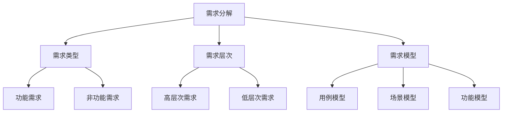

                 


# 需求分解技巧：让大型应用开发更易管理

> 关键词：需求分解、大型应用、项目管理、软件开发、IT工程

> 摘要：
本文旨在探讨需求分解在大型应用开发中的重要性，介绍需求分解的基本原理、方法与实践，并通过案例分析展示需求分解的实际应用。文章最后总结需求分解的关键要点，并对未来需求管理趋势进行展望。

## 引言

在大型应用开发过程中，需求管理是项目成功的关键。需求管理包括需求的收集、分析、确认、管理和变更。然而，面对复杂的大型应用，如何有效地进行需求管理，特别是如何将庞大的需求分解为可操作、可管理的小部分，成为开发团队面临的挑战。本文将详细介绍需求分解的技巧，以帮助大型应用开发团队更易地管理和实现需求。

## 需求分解的基本原理

### 需求类型

在需求分解之前，了解需求的类型是至关重要的。通常，需求可以分为功能需求和非功能需求。功能需求描述系统必须执行的操作和功能，而非功能需求则描述系统在执行这些功能时的性能、安全性、可用性等方面的要求。

### 需求层次

需求还可以根据层次进行分类。高层次需求通常描述系统的总体目标和功能，而低层次需求则详细描述实现这些目标所需的步骤和操作。

### 需求模型

在需求分解过程中，常用的需求模型包括用例模型、场景模型和功能模型。这些模型提供了对系统功能和行为的抽象描述，有助于开发团队更好地理解需求。

## 需求分解的方法

### 原型法

原型法是一种快速构建系统原型的方法，通过迭代和反馈不断改进。在需求分解中，原型法可以帮助开发团队快速了解用户需求，并发现潜在的问题。

### 功能分解法

功能分解法是一种将复杂系统划分为较小功能模块的方法。通过功能分解，开发团队能够更清晰地理解系统的功能，并分别进行开发和管理。

### 数据流图法

数据流图法是一种通过数据流描述系统功能和行为的方法。在需求分解中，数据流图可以帮助开发团队识别系统的关键数据和过程，从而更有效地进行需求分解。

## 需求分解的实践

### 案例分析

以下是一个实际案例：某企业需要开发一个在线销售平台，提供商品浏览、搜索、购买和支付等功能。通过对该项目的需求进行分解，我们可以得到以下步骤：

1. 确定功能需求：商品浏览、搜索、购买和支付。
2. 分析功能需求，将其分解为更细化的功能模块，例如商品展示、搜索算法、购物车和支付接口。
3. 对每个功能模块进行进一步的需求分解，例如搜索算法可以分为关键字搜索、分类搜索和推荐搜索。
4. 编写详细的需求文档，包括功能描述、数据流图和界面设计。

### 开发环境搭建

在开发过程中，我们需要搭建合适的环境。以下是一个基本的开发环境搭建步骤：

1. 选择开发语言（如Python）和框架（如Django）。
2. 安装开发工具（如PyCharm、Visual Studio Code）。
3. 配置数据库（如MySQL、PostgreSQL）。
4. 搭建本地开发服务器。

### 源代码实现

以下是一个简单的Python代码示例，用于实现搜索功能：

```python
def search_products(keywords):
    # 假设我们有一个包含商品信息的数据库
    products = get_products_from_database()

    # 使用关键字搜索商品
    matching_products = [product for product in products if keywords in product['name']]

    return matching_products

def get_products_from_database():
    # 这里是获取商品信息的伪代码
    return [{'name': '商品1', 'price': 100},
            {'name': '商品2', 'price': 200},
            {'name': '商品3', 'price': 300}]

# 测试代码
print(search_products('商品2'))
```

### 代码解读与分析

在上面的代码中，我们定义了一个`search_products`函数，用于实现关键字搜索功能。该函数接受一个关键字参数，并返回包含匹配商品信息的列表。通过使用列表推导式，我们能够高效地查找匹配的商品。

### 实际案例分析和详细讲解

在在线销售平台项目中，我们需要对搜索功能进行详细分析。以下是一个实际案例：

1. **需求分析**：用户需要能够通过关键字搜索商品。
2. **功能分解**：将搜索功能分为关键字搜索、分类搜索和推荐搜索。
3. **数据流图**：绘制数据流图，展示搜索功能中的数据流程。
4. **代码实现**：实现关键字搜索功能，并测试其性能和稳定性。

## 总结与展望

本文介绍了需求分解在大型应用开发中的重要性，以及如何进行需求分解的方法和实践。通过案例分析，我们展示了需求分解在实际项目中的应用。未来，随着人工智能和大数据技术的发展，需求管理将更加智能化和自动化，为大型应用开发提供更强有力的支持。

## 附录

### 参考文献

1. Mayers, J. (2016). Software Requirements. Addison-Wesley.
2. Booth, P. (2017). The Art of Software Development. Microsoft Press.
3. Software Engineering Institute (SEI). (2020). Software Engineering: A Practitioner's Study. SEI.

### 术语表

- 需求分解：将复杂的系统需求划分为较小、更易管理的部分。
- 功能需求：描述系统必须执行的操作和功能。
- 非功能需求：描述系统在执行功能时的性能、安全性、可用性等方面的要求。

### 拓展阅读

1. Martin, R. C. (2017). Clean Architecture: A Craftsman's Guide to Software Structure and Design. Prentice Hall.
2. Fowler, M. (2019). Patterns of Enterprise Application Architecture. Addison-Wesley.

## 作者信息

作者：AI天才研究院/AI Genius Institute & 禅与计算机程序设计艺术 /Zen And The Art of Computer Programming

### 核心概念原理之间的关系架构 Mermaid 流程图



### 数学模型和公式

```latex
$$
需求分解效率 = \frac{分解后需求条数}{原始需求条数}
$$
$$
功能模块独立性 = \frac{模块内部耦合度}{模块间耦合度}
$$
```

### 最佳实践 tips、小结、注意事项、拓展阅读等内容

**最佳实践 tips**：
- 在需求分解过程中，保持与用户的沟通，确保需求准确和完整。
- 使用适当的工具和技术，如需求管理软件和建模工具，提高需求分解的效率。
- 定期审查和更新需求，以应对项目需求的变化。

**小结**：
本文介绍了需求分解的基本原理、方法与实践，并通过案例分析展示了需求分解的实际应用。需求分解有助于大型应用开发团队更好地理解和实现需求，提高项目管理的效率和质量。

**注意事项**：
- 在进行需求分解时，要确保每个模块的功能独立，降低模块间的耦合度。
- 需求分解应与项目进度和团队资源相适应，避免过度分解导致开发效率下降。

**拓展阅读**：
- 阅读相关书籍，如《软件需求工程》、《软件架构设计》等，以深入了解需求管理的理论和实践。
- 关注业内最新动态和最佳实践，以提高需求管理的水平。

