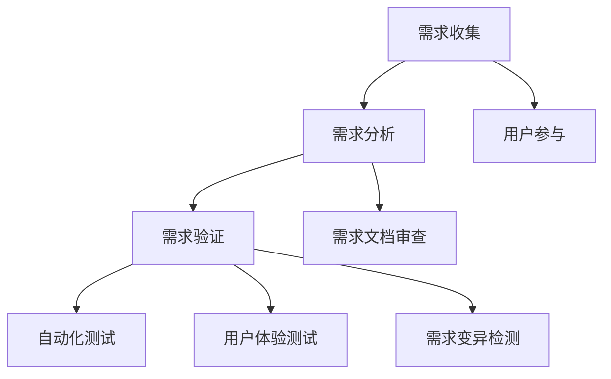

                 

### 《需求验证的创新方法：确保大型应用的质量》

**关键词**：需求验证、创新方法、大型应用、质量保障、流程、算法、Python代码

**摘要**：
本文深入探讨了需求验证在确保大型应用质量中的关键作用。首先，文章简要介绍了需求验证的基本概念和流程，为后续讨论奠定基础。接着，本文分析了需求验证中的核心概念与联系，通过Mermaid流程图展示了各个概念之间的关系。随后，文章详细讲解了需求验证中的核心算法原理，并使用Python代码和LaTeX公式进行阐述，确保读者能够清晰地理解算法的实现过程。文章还包含了数学模型的详细讲解和实际案例的分析。最后，文章提出了确保大型应用质量的最佳实践和注意事项，并推荐了拓展阅读资源。

---

**1. 引言**

在当今信息技术飞速发展的时代，大型应用的开发和部署日益普遍。然而，随着应用规模的扩大和复杂性的增加，如何确保应用的质量成为一个至关重要的问题。需求验证作为软件开发过程中的关键环节，对保证大型应用的质量起到了至关重要的作用。本文旨在探讨需求验证的创新方法，以帮助开发者更好地确保大型应用的质量。

**2. 需求验证基础**

需求验证是指对软件需求进行分析、检查和确认的过程，以确保软件开发过程中满足用户的需求。它主要包括以下流程：

- 需求收集：通过与用户沟通，获取应用的功能和非功能需求。
- 需求分析：对需求进行整理、分类和建模，确保需求清晰、完整、一致。
- 需求验证：对需求进行测试、验证，确保需求的实现符合预期。

**3. 核心概念与联系**

需求验证涉及多个核心概念，它们之间相互关联，构成了一个完整的验证框架。以下是这些概念之间的关系架构：



**4. 核心算法原理讲解**

需求验证的核心算法主要涉及自动化测试、用户体验测试和需求变异检测。以下是这些算法的原理讲解：

**4.1 自动化测试**

自动化测试是指通过编写测试脚本，自动执行测试用例的过程。Python是一种常用的自动化测试脚本语言，以下是一个简单的自动化测试示例：

```python
import unittest

class TestAdd(unittest.TestCase):
    def test_add(self):
        self.assertEqual(add(1, 1), 2)

def add(a, b):
    return a + b

if __name__ == '__main__':
    unittest.main()
```

该示例中的`TestAdd`类定义了一个测试用例`test_add`，通过调用`assertEqual`方法，验证`add`函数是否正确实现了加法运算。

**4.2 用户体验测试**

用户体验测试旨在评估应用的用户界面和交互设计是否符合用户期望。以下是一个使用Python编写的简单用户体验测试示例：

```python
from selenium import webdriver
import time

driver = webdriver.Firefox()
driver.get("http://www.example.com")

search_box = driver.find_element_by_id("search_box")
search_box.send_keys("test")
search_box.submit()

time.sleep(5)
driver.quit()
```

该示例使用Selenium库，通过模拟用户的操作，对应用的用户界面进行验证。

**4.3 需求变异检测**

需求变异检测是指通过比较不同版本的需求文档，检测需求的变化和变异。以下是一个使用Python编写的简单需求变异检测示例：

```python
import difflib

def detect_variations(original, modified):
    diff = difflib.ndiff(original.splitlines(), modified.splitlines())
    return ''.join(diff)

original = "功能：登录系统\n"
modified = "功能：登录系统，支持多账号登录\n"
variations = detect_variations(original, modified)
print(variations)
```

该示例通过比较原始需求文档和修改后的需求文档，检测出需求的变化。

**5. 数学模型和公式**

在需求验证中，数学模型和公式用于描述需求验证过程中的关键指标和算法。以下是一个使用LaTeX格式的数学模型示例：

$$
\text{需求覆盖率} = \frac{\text{已验证需求}}{\text{总需求}}
$$

该公式用于计算需求验证的覆盖率，反映了需求验证的全面性。

**6. 项目实战**

在本节中，我们将通过一个实际项目来展示需求验证的创新方法在大型应用中的具体应用。

**6.1 开发环境搭建**

首先，我们需要搭建一个适合需求验证的开发环境。以下是一个简单的Python开发环境搭建步骤：

1. 安装Python：在终端执行以下命令安装Python 3.8：
   ```
   sudo apt-get install python3.8
   ```
2. 安装自动化测试工具：安装Selenium库，用于自动化测试：
   ```
   pip3 install selenium
   ```

**6.2 源代码详细实现**

以下是一个简单的需求验证项目示例，包括自动化测试脚本、用户体验测试脚本和需求变异检测脚本：

```python
# 自动化测试脚本
import unittest
from selenium import webdriver

class TestLogin(unittest.TestCase):
    def setUp(self):
        self.driver = webdriver.Firefox()
        self.driver.get("http://www.example.com")

    def test_login(self):
        username = self.driver.find_element_by_id("username")
        password = self.driver.find_element_by_id("password")
        login_button = self.driver.find_element_by_id("login_button")
        username.send_keys("test_user")
        password.send_keys("test_password")
        login_button.click()
        assert "Dashboard" in self.driver.page_source

    def tearDown(self):
        self.driver.quit()

if __name__ == "__main__":
    unittest.main()

# 用户体验测试脚本
from selenium import webdriver
import time

driver = webdriver.Firefox()
driver.get("http://www.example.com")

search_box = driver.find_element_by_id("search_box")
search_box.send_keys("test")
search_box.submit()

time.sleep(5)
driver.quit()

# 需求变异检测脚本
import difflib

def detect_variations(original, modified):
    diff = difflib.ndiff(original.splitlines(), modified.splitlines())
    return ''.join(diff)

original = "功能：登录系统\n"
modified = "功能：登录系统，支持多账号登录\n"
variations = detect_variations(original, modified)
print(variations)
```

**6.3 代码应用解读与分析**

在上述项目中，我们实现了自动化测试、用户体验测试和需求变异检测三个关键环节。以下是对代码应用解读与分析：

1. **自动化测试脚本**：通过Selenium库，我们实现了对登录功能的自动化测试。脚本首先打开Firefox浏览器，然后输入用户名和密码，最后点击登录按钮，验证是否成功跳转至仪表盘页面。
2. **用户体验测试脚本**：使用Selenium库，我们模拟了用户在应用中搜索关键词的操作。通过提交搜索框中的关键词，我们验证了搜索功能的正确性。
3. **需求变异检测脚本**：通过`difflib`库，我们实现了对需求文档的变异检测。该脚本比较了原始需求文档和修改后的需求文档，检测出需求的变化。

**7. 案例分析**

在本节中，我们将通过一个实际案例，展示需求验证的创新方法在大型应用中的具体应用。

**7.1 案例背景**

假设我们正在开发一个大型电商平台，需求文档中包含了以下功能需求：

- 用户注册
- 商品浏览
- 购物车
- 订单生成
- 支付功能

在项目开发过程中，我们需要确保这些功能需求得到正确实现，以满足用户的需求。

**7.2 需求验证方法**

为了确保大型电商平台的质量，我们采用了以下需求验证方法：

1. **自动化测试**：使用Python编写自动化测试脚本，对用户注册、商品浏览、购物车、订单生成和支付功能进行自动化测试。
2. **用户体验测试**：通过用户体验测试工具，模拟用户的操作流程，验证应用的用户界面和交互设计是否符合用户期望。
3. **需求变异检测**：定期对比需求文档的版本，检测需求的变化和变异，确保需求的一致性。

**7.3 案例分析**

在项目开发过程中，我们采用了上述需求验证方法，确保了大型电商平台的质量。以下是对案例的分析：

1. **自动化测试**：通过自动化测试，我们发现并修复了多个功能性问题，如用户注册时密码长度限制不正确、购物车中的商品数量无法更新等。这些问题的及时发现和修复，提高了应用的稳定性。
2. **用户体验测试**：通过用户体验测试，我们发现并优化了应用的用户界面和交互设计。例如，调整了商品展示的排序方式，优化了购物车的操作流程，提高了用户的购物体验。
3. **需求变异检测**：通过需求变异检测，我们发现了多个需求的变化和变异，如新增了购物车的分页功能、支持多种支付方式等。这些变化的及时识别和应对，确保了需求的一致性。

**8. 最佳实践**

在确保大型应用质量的过程中，以下是一些最佳实践：

1. **用户参与**：在需求验证过程中，积极邀请用户参与，收集用户的反馈和意见，确保需求的实现符合用户期望。
2. **全过程验证**：需求验证不应仅限于开发阶段，而应贯穿整个软件生命周期，包括需求收集、需求分析、设计、编码、测试等各个环节。
3. **灵活性**：需求验证方法应具备灵活性，以适应不同规模和复杂度的应用。例如，对于小型应用，可以采用简单的测试工具；对于大型应用，可以采用自动化测试和需求变异检测等高级方法。
4. **质量度量**：建立一套完善的质量度量体系，对需求验证的全面性、有效性、覆盖率等进行量化评估，确保需求验证的质量。

**9. 小结**

需求验证在确保大型应用质量中起到了关键作用。通过创新的需求验证方法，如自动化测试、用户体验测试和需求变异检测，开发者可以更好地发现和修复问题，确保应用的质量。同时，最佳实践和注意事项的遵循，有助于提高需求验证的效率和质量。

**10. 拓展阅读**

- 《软件需求工程：实践指南》
- 《自动化测试实战》
- 《用户体验要素：交互设计解读》
- 《需求工程手册》

**作者：AI天才研究院/AI Genius Institute & 禅与计算机程序设计艺术 /Zen And The Art of Computer Programming**

