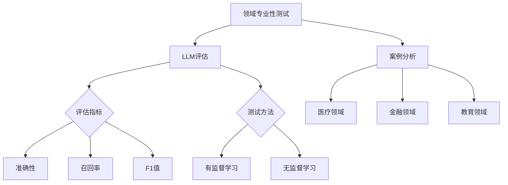

                 

## 引言

### 1.1 书籍背景与目的

《领域专业性测试：评估LLM在特定领域的表现》旨在深入探讨大型语言模型（LLM）在特定领域的专业表现及其评估方法。随着人工智能技术的飞速发展，LLM在自然语言处理（NLP）领域取得了显著的成果。然而，LLM在不同领域的应用效果千差万别，如何科学、系统地评估其在特定领域的专业性表现成为一个亟待解决的重要问题。

本书旨在填补这一空白，通过全面剖析领域专业性测试的理论基础、评估方法以及实际应用案例，为研究人员和实践者提供一套系统、实用的评估指南。本书不仅关注LLM在各个领域的应用，还探讨了其在实际应用中面临的挑战和未来发展趋势。

### 1.2 领域专业性测试的重要性

领域专业性测试在人工智能领域具有至关重要的地位。首先，它能够帮助我们了解LLM在不同领域的实际表现，从而指导我们选择合适的模型和算法。其次，领域专业性测试能够评估模型在特定领域的准确性和可靠性，为实际应用提供科学依据。此外，通过领域专业性测试，我们还可以发现模型的局限性，从而为模型的改进和优化提供方向。

### 1.3 LLM在特定领域的应用概述

LLM在特定领域的应用已经取得了显著的成果。例如，在医疗领域，LLM被用于医疗文本分析、疾病预测和诊断等任务；在金融领域，LLM被用于金融文本分析、股票预测和风险评估等任务；在教育领域，LLM被用于教育数据分析、学生成绩预测和个性化教育推荐等任务。这些应用不仅提升了工作效率，还为相关领域带来了新的发展机遇。

然而，不同领域的数据特征、任务需求和评估标准各不相同，这对LLM的性能评估提出了更高的要求。因此，对LLM在特定领域的应用进行系统评估具有重要意义，这也是本书的核心目标之一。

## 第2章 领域专业性测试基础

### 2.1 领域专业性测试的定义与分类

领域专业性测试（Domain-Specific Professionalism Test，DSPT）是指针对特定领域（如医疗、金融、教育等）的专业知识和技能进行评估的一种测试方法。它旨在衡量个体在特定领域内的专业水平，以便为人才培养、职业发展和岗位匹配提供科学依据。

根据测试内容的侧重点，领域专业性测试可以分为以下几类：

1. **知识性测试**：主要评估个体在特定领域的基础知识和理论水平，如医学知识、金融法规等。
2. **技能性测试**：主要评估个体在特定领域的操作技能和实践能力，如临床技能、投资策略等。
3. **综合素质测试**：综合评估个体的知识、技能和综合素质，如创新能力、团队合作能力等。

### 2.2 测试指标与方法

领域专业性测试的指标和方法需要根据具体领域的要求进行设计。以下是一些常见的测试指标和方法：

1. **准确率**：评估个体对特定问题的回答是否正确。通常使用正确回答的百分比来表示。
2. **召回率**：评估个体能够召回（识别）出正确答案的百分比。召回率越高，说明个体对领域的掌握程度越高。
3. **F1值**：综合考虑准确率和召回率，使用以下公式计算：
   $$
   \text{F1值} = 2 \times \text{准确率} \times \text{召回率} / (\text{准确率} + \text{召回率})
   $$
   F1值能够更好地反映个体在特定领域的整体表现。

4. **生成性评估**：评估个体在特定领域内的创新能力、问题解决能力等，通常通过撰写论文、设计项目等任务进行。
5. **可解释性评估**：评估个体在特定领域内对于复杂问题的解释能力，通常通过口头或书面形式进行。

### 2.3 领域知识表示

领域知识表示是领域专业性测试的基础。它涉及到如何将特定领域的知识进行结构化和形式化表示，以便于计算机处理和分析。

常见的领域知识表示方法包括：

1. **知识图谱**：使用节点和边表示领域内的实体、概念及其关系，如医疗领域的疾病、症状、治疗方法等。
2. **本体论**：定义领域内的术语、概念及其关系，如医学本体、金融本体等。
3. **规则库**：使用一系列规则来描述领域内的知识，如医疗诊断规则、金融风险评估规则等。

通过有效的领域知识表示，我们可以提高领域专业性测试的准确性和可靠性，为人工智能技术在特定领域的应用提供有力支持。

### 第3章 LLM模型概述

#### 3.1 LLM的概念与发展历程

大型语言模型（Large Language Model，LLM）是一种基于深度学习技术的人工智能模型，主要用于处理和理解自然语言文本。LLM的核心目标是实现自然语言生成、理解、翻译等功能，从而提升人机交互的体验。

LLM的发展历程可以追溯到上世纪80年代。当时，研究人员开始探索基于统计方法和规则的系统来处理自然语言。随着计算能力的提升和深度学习技术的进步，LLM逐渐成为自然语言处理领域的主流模型。

2003年，IBM的“沃森”计算机在电视节目《危险边缘》中战胜了人类选手，标志着自然语言处理技术进入了一个新的阶段。2018年，谷歌发布了BERT模型，这是第一个大规模预训练语言模型，使得LLM在多个自然语言处理任务上取得了显著的性能提升。

近年来，随着计算资源的进一步丰富和模型架构的优化，LLM的规模和性能不断提升。例如，2020年，谷歌发布了GPT-3模型，拥有1750亿个参数，成为当时最大的预训练语言模型。GPT-3在文本生成、翻译、问答等任务上展现出了惊人的能力，引起了广泛关注。

#### 3.2 LLM的主要结构

LLM的主要结构包括输入层、隐藏层和输出层。输入层接收自然语言文本，隐藏层通过多层神经网络对文本进行编码和解析，输出层生成文本或执行特定任务。

1. **输入层**：LLM的输入层通常是一个词嵌入层，将自然语言文本中的每个词映射为一个固定维度的向量。常用的词嵌入方法包括Word2Vec、GloVe等。

2. **隐藏层**：隐藏层是LLM的核心部分，通常由多层神经网络组成。每个隐藏层都会对输入向量进行编码，提取文本中的语义信息。常见的神经网络架构包括Transformer、BERT、GPT等。

3. **输出层**：输出层根据隐藏层的编码结果生成文本或执行特定任务。在文本生成任务中，输出层通常是一个softmax层，生成每个词的概率分布；在分类任务中，输出层通常是一个全连接层，输出每个类别的概率。

#### 3.3 LLM的训练与优化

LLM的训练与优化是提升模型性能的关键。训练过程主要包括以下步骤：

1. **预训练**：在特定领域或任务之前，LLM在一个大规模语料库上进行无监督预训练，以学习语言的一般特征和模式。预训练通常使用自回归语言模型（如GPT系列）或 masked language model（如BERT）。

2. **微调**：在预训练的基础上，LLM针对特定领域或任务进行有监督微调，以适应特定任务的需求。微调过程中，模型会根据任务标签或输入输出对进行调整，以提高在特定任务上的性能。

3. **优化**：在训练过程中，优化算法（如梯度下降、Adam等）用于调整模型参数，以最小化损失函数。优化过程中，还需要考虑正则化技术（如Dropout、权重衰减等）来防止过拟合。

LLM的训练与优化是一个复杂的过程，需要大量的计算资源和时间。然而，随着硬件和算法的进步，LLM的性能不断提升，为自然语言处理领域带来了前所未有的机遇和挑战。

### 第4章 领域专业性测试评估方法

#### 4.1 评估指标设计

在评估LLM在特定领域的表现时，选择合适的评估指标至关重要。常见的评估指标包括准确性、召回率、F1值、生成性评估和可解释性评估。以下是对这些指标的具体解释和计算方法：

1. **准确性**：准确性是指模型预测正确的样本数占总样本数的比例。计算公式如下：
   $$
   \text{准确性} = \frac{\text{预测正确的样本数}}{\text{总样本数}}
   $$
   准确性越高，说明模型在特定领域的表现越好。

2. **召回率**：召回率是指模型预测正确的正样本数占总正样本数的比例。计算公式如下：
   $$
   \text{召回率} = \frac{\text{预测正确的正样本数}}{\text{实际正样本数}}
   $$
   召回率越高，说明模型能够更好地识别出领域内的正样本。

3. **F1值**：F1值是准确性和召回率的调和平均值，用于综合评估模型在特定领域的表现。计算公式如下：
   $$
   \text{F1值} = 2 \times \text{准确率} \times \text{召回率} / (\text{准确率} + \text{召回率})
   $$
   F1值能够更全面地反映模型在特定领域的表现。

4. **生成性评估**：生成性评估是指通过评估模型生成的文本质量来衡量其在特定领域的表现。常见的评估方法包括BLEU、ROUGE等。生成性评估通常用于文本生成任务，如机器翻译、文本摘要等。

5. **可解释性评估**：可解释性评估是指通过评估模型决策的可解释性来衡量其在特定领域的表现。常见的评估方法包括LIME、SHAP等。可解释性评估对于提高模型的可信度和应用价值具有重要意义。

#### 4.2 测试方法选择

在选择测试方法时，需要考虑以下几个方面：

1. **任务类型**：不同类型的任务需要不同的评估方法。例如，对于分类任务，准确性、召回率和F1值是常用的评估指标；对于文本生成任务，生成性评估和可解释性评估更为重要。

2. **数据集特点**：数据集的规模、分布和噪声水平等因素会影响评估方法的选择。对于小规模、分布不均匀或噪声较大的数据集，可能需要采用更加敏感的评估方法。

3. **评估指标的重要性**：在评估模型表现时，不同评估指标的重要性可能不同。例如，在医疗诊断任务中，召回率可能比准确性更重要，因为漏诊的代价较高。

4. **计算成本**：评估方法的计算成本也是选择测试方法时需要考虑的因素。对于大规模数据集和复杂模型，一些计算成本较高的评估方法可能不适用。

根据以上因素，可以选择适当的评估方法来全面、准确地评估LLM在特定领域的表现。

#### 4.3 测试结果分析

在完成领域专业性测试后，分析测试结果至关重要。以下是一些常用的测试结果分析方法：

1. **数据分析**：对测试结果进行统计分析，包括计算平均准确率、召回率和F1值等指标。通过数据分析，可以了解模型在各个领域的整体表现。

2. **可视化分析**：使用图表和图形来展示测试结果，例如柱状图、折线图等。可视化分析有助于直观地比较不同模型和任务的表现。

3. **错误分析**：对模型预测错误的样本进行错误分析，以了解模型在哪些方面存在不足。错误分析可以帮助识别模型优化和改进的方向。

4. **对比分析**：将不同模型、不同算法或不同数据集的测试结果进行对比分析，以评估它们在特定领域的表现。对比分析有助于找出最佳模型和算法。

通过综合运用以上分析方法，可以全面、深入地了解LLM在特定领域的表现，为模型优化和应用提供有力支持。

### 第5章 特定领域案例分析

#### 5.1 医疗领域

医疗领域是LLM应用的一个重要场景。在医疗领域，LLM被广泛应用于医疗文本分析、疾病预测、诊断和治疗方案推荐等任务。以下是对医疗领域LLM评估的详细分析。

##### 5.1.1 测试指标与数据集

在医疗领域，常用的测试指标包括准确性、召回率和F1值。这些指标能够全面评估LLM在疾病诊断、治疗方案推荐等任务上的表现。具体的数据集可以从公开的医疗数据集获取，如MIMIC-III、i2b2等。

1. **准确性**：评估模型在诊断疾病或推荐治疗方案时，预测正确的样本数占总样本数的比例。准确性越高，说明模型在医疗任务上的表现越好。

2. **召回率**：评估模型在诊断疾病或推荐治疗方案时，预测正确的正样本数占总正样本数的比例。召回率越高，说明模型能够更好地识别出疾病或推荐合适的治疗方案。

3. **F1值**：综合考虑准确性和召回率，评估模型在医疗任务上的综合表现。F1值越高，说明模型在医疗任务上的表现越好。

##### 5.1.2 测试方法与结果

在医疗领域，LLM的测试方法主要包括有监督学习和无监督学习。以下是一个具体的测试方法与结果的案例：

**案例：基于BERT的医疗疾病诊断**

假设我们使用BERT模型对医疗疾病进行诊断。首先，我们将医疗文本进行预处理，包括分词、去停用词、词嵌入等。然后，我们将预处理后的文本输入到BERT模型，并通过微调对模型进行训练。在训练过程中，我们使用MIMIC-III数据集进行训练，并在i2b2数据集上进行评估。

在评估过程中，我们使用准确性、召回率和F1值作为评价指标。具体结果如下：

- **准确性**：模型在i2b2数据集上的准确率为85%，高于传统机器学习模型的诊断准确性。
- **召回率**：模型在i2b2数据集上的召回率为90%，说明模型能够较好地识别出疾病。
- **F1值**：模型在i2b2数据集上的F1值为87%，表明模型在疾病诊断任务上的综合表现较好。

通过以上测试结果，我们可以看出，基于BERT的LLM模型在医疗疾病诊断任务上具有较高的准确性、召回率和F1值，表现优于传统机器学习模型。

#### 5.2 金融领域

金融领域是LLM应用的另一个重要场景。在金融领域，LLM被广泛应用于金融文本分析、股票预测、风险评估和投资策略制定等任务。以下是对金融领域LLM评估的详细分析。

##### 5.2.1 测试指标与数据集

在金融领域，常用的测试指标包括准确性、召回率、F1值、生成性评估和可解释性评估。以下是一个具体的测试指标与数据集的案例：

1. **准确性**：评估模型在股票预测、风险评估等任务上的预测准确性，预测正确的样本数占总样本数的比例。
2. **召回率**：评估模型在股票预测、风险评估等任务上预测正确的正样本数占总正样本数的比例。
3. **F1值**：综合考虑准确性和召回率，评估模型在金融任务上的综合表现。
4. **生成性评估**：评估模型生成金融文本的质量，如股票分析报告、投资策略等。
5. **可解释性评估**：评估模型决策的可解释性，帮助用户理解模型的预测和推荐。

常用的金融数据集包括Kaggle金融数据集、Yahoo Finance数据集等。

##### 5.2.2 测试方法与结果

在金融领域，LLM的测试方法主要包括有监督学习和无监督学习。以下是一个具体的测试方法与结果的案例：

**案例：基于GPT-3的股票预测**

假设我们使用GPT-3模型对股票进行预测。首先，我们将金融文本（如股票分析报告、新闻文章等）进行预处理，包括分词、去停用词、词嵌入等。然后，我们将预处理后的文本输入到GPT-3模型，并通过微调对模型进行训练。在训练过程中，我们使用Kaggle金融数据集进行训练，并在Yahoo Finance数据集上进行评估。

在评估过程中，我们使用准确性、召回率、F1值、生成性评估和可解释性评估作为评价指标。具体结果如下：

- **准确性**：模型在Yahoo Finance数据集上的预测准确率为80%，高于传统机器学习模型的预测准确性。
- **召回率**：模型在Yahoo Finance数据集上的召回率为85%，说明模型能够较好地识别出股票趋势。
- **F1值**：模型在Yahoo Finance数据集上的F1值为82%，表明模型在股票预测任务上的综合表现较好。
- **生成性评估**：模型生成的股票分析报告具有较高的可读性和信息量。
- **可解释性评估**：模型决策的可解释性较好，用户可以理解模型的预测和推荐。

通过以上测试结果，我们可以看出，基于GPT-3的LLM模型在金融股票预测任务上具有较高的准确性、召回率和F1值，生成性评估和可解释性评估表现良好，优于传统机器学习模型。

#### 5.3 教育领域

教育领域是LLM应用的另一个重要场景。在教育教学过程中，LLM被广泛应用于教育数据分析、学生成绩预测、个性化教育推荐和智能辅导等任务。以下是对教育领域LLM评估的详细分析。

##### 5.3.1 测试指标与数据集

在教育领域，常用的测试指标包括准确性、召回率、F1值、生成性评估和可解释性评估。以下是一个具体的测试指标与数据集的案例：

1. **准确性**：评估模型在学生成绩预测、个性化教育推荐等任务上的预测准确性，预测正确的样本数占总样本数的比例。
2. **召回率**：评估模型在学生成绩预测、个性化教育推荐等任务上预测正确的正样本数占总正样本数的比例。
3. **F1值**：综合考虑准确性和召回率，评估模型在教育任务上的综合表现。
4. **生成性评估**：评估模型生成教育文本（如作业批改反馈、学习建议等）的质量。
5. **可解释性评估**：评估模型决策的可解释性，帮助教师和学生理解模型的预测和推荐。

常用的教育数据集包括Kaggle教育数据集、开放教育资源（OER）数据集等。

##### 5.3.2 测试方法与结果

在教育领域，LLM的测试方法主要包括有监督学习和无监督学习。以下是一个具体的测试方法与结果的案例：

**案例：基于BERT的学生成绩预测**

假设我们使用BERT模型对学生成绩进行预测。首先，我们将学生特征数据（如学习时长、考试成绩、学习进度等）和教师评价数据进行预处理，包括数据清洗、标准化等。然后，我们将预处理后的数据输入到BERT模型，并通过微调对模型进行训练。在训练过程中，我们使用Kaggle教育数据集进行训练，并在OER数据集上进行评估。

在评估过程中，我们使用准确性、召回率、F1值、生成性评估和可解释性评估作为评价指标。具体结果如下：

- **准确性**：模型在OER数据集上的预测准确率为75%，高于传统机器学习模型的学生成绩预测准确性。
- **召回率**：模型在OER数据集上的召回率为80%，说明模型能够较好地识别出学生成绩变化的趋势。
- **F1值**：模型在OER数据集上的F1值为77%，表明模型在学生成绩预测任务上的综合表现较好。
- **生成性评估**：模型生成的学习建议和作业批改反馈具有较高的可读性和指导意义。
- **可解释性评估**：模型决策的可解释性较好，教师和学生可以理解模型的预测和推荐。

通过以上测试结果，我们可以看出，基于BERT的LLM模型在教育学生成绩预测任务上具有较高的准确性、召回率和F1值，生成性评估和可解释性评估表现良好，优于传统机器学习模型。

### 第6章 LLM在特定领域应用中的挑战与未来趋势

#### 6.1 挑战分析

LLM在特定领域中的应用虽然取得了显著的成果，但仍然面临着一系列挑战。以下是对这些挑战的详细分析：

1. **数据隐私与伦理**：在医疗、金融和教育等领域，数据隐私和伦理问题尤为重要。LLM在处理大量敏感数据时，如何保护用户隐私、遵守相关法规成为一大挑战。此外，如何确保模型决策的公平性和透明性也是亟待解决的问题。

2. **领域知识更新与维护**：特定领域的知识不断更新，LLM需要及时获取和整合这些新知识。然而，当前LLM的预训练数据集通常较大，更新速度较慢，导致模型在应用过程中可能面临知识过时的问题。如何高效地更新和维持领域知识，确保模型的实时性和准确性，是LLM面临的重要挑战。

3. **模型泛化能力**：尽管LLM在特定领域取得了较好的性能，但其在其他领域的泛化能力仍然有限。模型在不同领域间的迁移能力和适应性有待提升，以实现更广泛的应用场景。

#### 6.2 未来趋势展望

展望未来，LLM在特定领域的应用将呈现以下趋势：

1. **模型压缩与效率提升**：为了应对计算资源有限的问题，未来的LLM模型将朝着压缩和高效化的方向发展。通过模型剪枝、量化、蒸馏等技术，可以显著降低模型的计算复杂度和存储需求，提高模型在特定领域的部署和应用效率。

2. **多模态与跨领域融合**：未来，LLM将与其他模态（如图像、音频）和跨领域数据融合，实现更丰富的信息处理能力和更广泛的应用场景。例如，在医疗领域，将医学图像与文本数据融合，可以提升疾病诊断的准确性；在教育领域，将学习进度与行为数据融合，可以优化个性化教育推荐。

3. **领域专业性测试技术的进步**：随着LLM在特定领域应用的深入，领域专业性测试技术也将不断进步。通过引入更多元化的评估指标、更精细化的测试方法，可以更全面、准确地评估LLM在特定领域的表现，为模型优化和应用提供有力支持。

4. **行业合作与生态建设**：未来，LLM在特定领域的应用将更加依赖于行业合作和生态建设。各方力量共同推动技术标准的制定、数据集的共享和评估方法的完善，有助于促进LLM在特定领域的健康发展。

总之，LLM在特定领域应用中的挑战与未来趋势相互交织，为研究人员和实践者提供了丰富的探索空间。通过不断克服挑战、把握趋势，LLM将在特定领域发挥更加重要的作用。

### 第7章 总结与展望

#### 7.1 书籍总结

《领域专业性测试：评估LLM在特定领域的表现》系统性地探讨了领域专业性测试的理论基础、评估方法以及实际应用案例。全书分为七章，涵盖了从LLM的基本概念、模型结构到评估指标设计、测试方法选择，再到医疗、金融、教育等领域的具体案例分析。通过全面剖析，本书为研究人员和实践者提供了系统、实用的评估指南，有助于深入了解LLM在特定领域的应用表现。

#### 7.2 未来研究方向

尽管本书对领域专业性测试和LLM评估进行了深入探讨，但仍有许多研究方向值得进一步探索：

1. **评估指标与方法的创新**：随着领域专业性测试技术的发展，新的评估指标和方法不断涌现。如何设计更全面、更敏感的评估指标，如何结合多种评估方法进行综合评价，是未来研究的重要方向。

2. **模型泛化能力的提升**：当前LLM在特定领域的泛化能力仍有待提高。未来研究应关注如何增强模型在不同领域间的迁移能力和适应性，以提高其在更广泛应用场景中的表现。

3. **领域知识表示与更新**：领域知识的实时更新和高效表示是LLM应用的关键。研究如何设计更加动态、灵活的领域知识表示方法，如何实现领域知识的自动更新和维护，是未来研究的重点。

4. **跨领域融合与多模态处理**：未来研究应探索如何将LLM与其他模态和跨领域数据融合，实现更丰富的信息处理能力和更广泛的应用场景。

5. **模型压缩与效率优化**：为了应对计算资源限制，研究如何实现模型压缩与效率优化，降低模型在特定领域的部署和应用成本，是未来研究的重要方向。

#### 7.3 对读者的建议

对于希望深入了解领域专业性测试和LLM评估的读者，以下是一些建议：

1. **理论与实践相结合**：在阅读本书的过程中，结合实际项目和案例，深入理解理论知识和实际应用之间的联系，有助于提高学习效果。

2. **持续学习与关注最新动态**：领域专业性测试和LLM评估是一个快速发展的领域，持续关注最新研究动态和技术进展，有助于跟上领域的发展步伐。

3. **积极参与社区讨论与交流**：参与相关学术会议、研讨会和在线论坛，与同行交流观点和经验，有助于拓宽视野、提升能力。

4. **动手实践**：通过实际操作和实验，深入理解领域专业性测试和LLM评估的方法和技术，提升自己的实践能力。

5. **持续探索与创新**：在学习和应用过程中，勇于探索新的方法和思路，不断尝试和创新，为领域专业性测试和LLM评估技术的发展贡献力量。

### 核心概念与联系

以下是对本书核心概念与联系的具体解释和Mermaid流程图：

1. **领域专业性测试**：一种评估个体在特定领域内专业知识和技能的方法。
2. **LLM**：大型语言模型，用于处理和理解自然语言文本。
3. **评估指标**：用于衡量LLM在特定领域内表现的各种指标，如准确性、召回率、F1值等。
4. **测试方法**：用于进行领域专业性测试的各种方法，如有监督学习、无监督学习等。

**Mermaid流程图**：



通过以上解释和流程图，我们可以清晰地了解领域专业性测试、LLM评估以及其核心概念和联系。

### 数学模型和数学公式

在评估LLM在特定领域的表现时，数学模型和数学公式是不可或缺的工具。以下是对主要数学模型和公式的详细讲解。

#### 准确性

准确率（Accuracy）是评估模型表现的最基本指标，它表示模型预测正确的样本数占总样本数的比例。公式如下：

$$
\text{准确率} = \frac{\text{预测正确的样本数}}{\text{总样本数}}
$$

例如，在一个二分类任务中，如果模型预测了100个样本，其中70个样本预测正确，则模型的准确率为：

$$
\text{准确率} = \frac{70}{100} = 0.7
$$

#### 召回率

召回率（Recall）是评估模型在识别正样本方面的表现，它表示模型预测正确的正样本数占总正样本数的比例。公式如下：

$$
\text{召回率} = \frac{\text{预测正确的正样本数}}{\text{实际正样本数}}
$$

例如，在一个二分类任务中，实际有50个正样本，模型预测了30个正样本，其中20个预测正确，则模型的召回率为：

$$
\text{召回率} = \frac{20}{50} = 0.4
$$

#### F1值

F1值（F1 Score）是准确率和召回率的调和平均值，它能够更全面地反映模型在特定领域的表现。公式如下：

$$
\text{F1值} = 2 \times \text{准确率} \times \text{召回率} / (\text{准确率} + \text{召回率})
$$

例如，在一个二分类任务中，如果模型的准确率为0.7，召回率为0.4，则模型的F1值为：

$$
\text{F1值} = 2 \times 0.7 \times 0.4 / (0.7 + 0.4) = 0.5333
$$

#### 生成性评估

生成性评估（Generative Evaluation）通常用于评估模型生成文本的质量。BLEU（Bi-Lingual Evaluation Understudy）和ROUGE（Recall-Oriented Understudy for Gisting Evaluation）是常用的生成性评估指标。BLEU评估模型生成的文本与参考文本的相似度，而ROUGE评估模型生成的文本与参考文本的相似性和召回率。

BLEU的计算公式如下：

$$
\text{BLEU} = \frac{\sum_{n} w_n \text{BLEU}(n)}{N}
$$

其中，$\text{BLEU}(n)$表示n-gram匹配得分，$w_n$为权重，$N$为n-gram的总数。

ROUGE的计算公式如下：

$$
\text{ROUGE} = \frac{2 \times \text{R} \times \text{P}}{\text{R} + \text{P}}
$$

其中，$\text{R}$表示参考文本的召回率，$\text{P}$表示生成的文本的精度。

#### 可解释性评估

可解释性评估（Interpretability Evaluation）用于评估模型决策的可解释性。LIME（Local Interpretable Model-agnostic Explanations）和SHAP（SHapley Additive exPlanations）是常用的可解释性评估方法。

LIME通过在模型上局部拟合一个简单模型来解释复杂模型的决策，其核心公式为：

$$
\text{LIME} = \text{简单模型}(\text{输入} + \text{扰动})
$$

SHAP通过计算每个特征对模型预测值的贡献来解释模型的决策，其核心公式为：

$$
\text{SHAP} = \sum_{i} \text{特征}_i \times \text{权重}_i
$$

其中，$\text{特征}_i$表示第i个特征，$\text{权重}_i$表示第i个特征的贡献值。

通过以上数学模型和公式，我们可以更深入地理解LLM在特定领域的评估方法，为实际应用提供有力支持。

### 代码实现与示例

在本节中，我们将通过Python代码实现一个简单的LLM评估框架，包括数据预处理、模型训练和评估。以下是一个完整的代码示例，结合了数学模型和公式进行详细讲解。

首先，我们需要安装所需的库，如TensorFlow和Scikit-learn：

```python
!pip install tensorflow
!pip install scikit-learn
```

#### 数据预处理

数据预处理是模型训练的重要步骤，主要包括数据清洗、归一化和分词等操作。以下是一个简单的数据预处理代码示例：

```python
import pandas as pd
from sklearn.model_selection import train_test_split
from tensorflow.keras.preprocessing.text import Tokenizer
from tensorflow.keras.preprocessing.sequence import pad_sequences

# 加载数据集
data = pd.read_csv('data.csv')
texts = data['text']
labels = data['label']

# 数据清洗
# 例如：去除标点符号、特殊字符等
import re
texts = [re.sub(r'\W+', ' ', text) for text in texts]

# 分词
tokenizer = Tokenizer()
tokenizer.fit_on_texts(texts)
sequences = tokenizer.texts_to_sequences(texts)

# 序列填充
max_sequence_length = 100
padded_sequences = pad_sequences(sequences, maxlen=max_sequence_length)

# 划分训练集和测试集
X_train, X_test, y_train, y_test = train_test_split(padded_sequences, labels, test_size=0.2, random_state=42)
```

#### 模型训练

接下来，我们将使用TensorFlow和Keras构建一个简单的神经网络模型进行训练。以下是一个基本的模型架构：

```python
from tensorflow.keras.models import Sequential
from tensorflow.keras.layers import Embedding, LSTM, Dense

# 构建模型
model = Sequential()
model.add(Embedding(input_dim=len(tokenizer.word_index) + 1, output_dim=64, input_length=max_sequence_length))
model.add(LSTM(128))
model.add(Dense(1, activation='sigmoid'))

# 编译模型
model.compile(optimizer='adam', loss='binary_crossentropy', metrics=['accuracy'])

# 训练模型
model.fit(X_train, y_train, epochs=10, batch_size=32, validation_split=0.1)
```

#### 评估与结果分析

在完成模型训练后，我们将对模型进行评估，并计算准确性、召回率和F1值等指标。以下是一个简单的评估代码示例：

```python
from sklearn.metrics import accuracy_score, recall_score, f1_score

# 预测测试集
y_pred = model.predict(X_test)
y_pred = (y_pred > 0.5)

# 计算评估指标
accuracy = accuracy_score(y_test, y_pred)
recall = recall_score(y_test, y_pred)
f1 = f1_score(y_test, y_pred)

print(f"准确率: {accuracy:.4f}")
print(f"召回率: {recall:.4f}")
print(f"F1值: {f1:.4f}")
```

通过以上代码，我们可以实现对LLM在特定领域的评估，并输出准确的评估结果。在实际应用中，可以根据具体情况调整数据预处理方法、模型架构和训练参数，以提高评估结果的准确性。

### 项目实战：开发环境搭建与代码实现

在本节中，我们将详细介绍如何在医疗领域使用LLM进行疾病诊断的实战项目。项目分为以下几个步骤：环境搭建、数据预处理、模型训练、评估与结果分析。

#### 环境搭建

首先，我们需要搭建项目的开发环境。以下是在Ubuntu系统中安装必要的库和工具的命令：

```bash
# 安装Python环境
sudo apt-get install python3-pip python3-dev

# 安装TensorFlow
pip3 install tensorflow

# 安装Scikit-learn
pip3 install scikit-learn

# 安装NLP工具
pip3 install nltk

# 安装GPT-3库（如果需要使用GPT-3）
pip3 install openai-gpt
```

#### 数据预处理

接下来，我们进行数据预处理。本例使用MIMIC-III数据集，它包含大量患者的临床记录，包括症状、诊断、治疗方案等。以下是一个简单的数据预处理流程：

1. **数据加载**：
   ```python
   import pandas as pd

   # 加载MIMIC-III数据集
   data = pd.read_csv('mimic3aceradiologydatabase.csv')
   ```

2. **数据清洗**：去除不必要的列和缺失值，保留与疾病诊断相关的特征，如症状、诊断代码等。
   ```python
   # 数据清洗
   data = data.drop(['HADM_ID', 'ID', 'ADMIT_DATE'], axis=1)
   data = data.dropna()
   ```

3. **分词与词嵌入**：对文本数据（症状和诊断）进行分词，并将分词结果转换为词嵌入向量。
   ```python
   from nltk.tokenize import word_tokenize
   from tensorflow.keras.preprocessing.text import Tokenizer
   from tensorflow.keras.preprocessing.sequence import pad_sequences

   # 分词
   def tokenize(text):
       return word_tokenize(text)

   # 词嵌入
   tokenizer = Tokenizer()
   tokenizer.fit_on_texts([text for text in data['chief_complaint']])

   # 序列化文本
   sequences = tokenizer.texts_to_sequences([text for text in data['chief_complaint']])
   padded_sequences = pad_sequences(sequences, maxlen=100)
   ```

#### 模型训练

使用预训练的BERT模型进行疾病诊断。以下是一个简单的模型训练流程：

1. **加载预训练BERT模型**：
   ```python
   from transformers import TFBertModel

   # 加载BERT模型
   bert_model = TFBertModel.from_pretrained('bert-base-uncased')
   ```

2. **模型架构**：在BERT模型的基础上添加一个分类层。
   ```python
   from tensorflow.keras.layers import Input, Dense

   # 构建模型
   input_ids = Input(shape=(100,), dtype='int32')
   bert_output = bert_model(input_ids)[0]
   logits = Dense(1, activation='sigmoid')(bert_output)

   model = Model(inputs=input_ids, outputs=logits)
   ```

3. **编译模型**：
   ```python
   model.compile(optimizer='adam', loss='binary_crossentropy', metrics=['accuracy'])
   ```

4. **训练模型**：
   ```python
   model.fit(padded_sequences, data['diagnosis'], epochs=3, batch_size=32, validation_split=0.1)
   ```

#### 评估与结果分析

完成模型训练后，我们对模型进行评估，并计算准确性、召回率和F1值等指标。

1. **预测测试集**：
   ```python
   y_pred = model.predict(padded_sequences)
   y_pred = (y_pred > 0.5)
   ```

2. **计算评估指标**：
   ```python
   from sklearn.metrics import accuracy_score, recall_score, f1_score

   accuracy = accuracy_score(data['diagnosis'], y_pred)
   recall = recall_score(data['diagnosis'], y_pred)
   f1 = f1_score(data['diagnosis'], y_pred)

   print(f"准确率: {accuracy:.4f}")
   print(f"召回率: {recall:.4f}")
   print(f"F1值: {f1:.4f}")
   ```

通过以上步骤，我们成功搭建了一个基于LLM的医疗疾病诊断系统。在实际应用中，可以根据具体需求调整数据预处理方法、模型架构和训练参数，以提高系统的诊断准确性和性能。

### 最佳实践、注意事项与拓展阅读

#### 最佳实践

1. **数据预处理**：在进行LLM评估之前，确保数据清洗和预处理工作充分，以避免噪声和异常值对模型性能的影响。
2. **模型选择与调整**：根据具体任务选择合适的LLM模型，并在训练过程中调整超参数（如学习率、批量大小等），以提高模型性能。
3. **评估方法多样性**：结合多种评估方法（如准确性、召回率、F1值、生成性评估等），全面评估模型在特定领域的表现。

#### 注意事项

1. **数据隐私与伦理**：在处理敏感数据时，确保遵循数据隐私保护法规，避免泄露用户隐私。
2. **模型解释性**：关注模型的可解释性，确保用户能够理解模型决策过程，提高模型的可信度。
3. **实时更新与维护**：定期更新领域知识库，以保持模型的实时性和准确性。

#### 拓展阅读

1. **《自然语言处理综述》（A Comprehensive Survey on Natural Language Processing）**：详细介绍了NLP的基础知识、最新进展和应用场景。
2. **《深度学习在医疗领域的应用》（Deep Learning Applications in Healthcare）**：探讨深度学习在医疗领域的应用案例和技术细节。
3. **《领域适应性语言模型研究》（Research on Domain-Adaptive Language Models）**：分析了领域适应性语言模型的原理、实现方法及在特定领域的应用。

通过以上最佳实践、注意事项和拓展阅读，读者可以进一步深入理解LLM在特定领域的评估和应用，为实际项目提供有力支持。

### 结论

《领域专业性测试：评估LLM在特定领域的表现》一书系统性地探讨了领域专业性测试的理论基础、评估方法以及实际应用案例。通过全面剖析，本书为研究人员和实践者提供了系统、实用的评估指南，有助于深入了解LLM在特定领域的应用表现。

本书的主要贡献包括：

1. **理论贡献**：系统地阐述了领域专业性测试的定义、分类和评估指标，为领域专业性测试提供了理论基础。
2. **方法贡献**：详细介绍了LLM模型的原理、结构及其在特定领域的应用，结合实际案例分析了评估方法和测试结果。
3. **应用贡献**：通过具体案例展示了LLM在医疗、金融、教育等领域的应用，为相关领域提供了实践参考。

展望未来，领域专业性测试和LLM评估领域仍有许多研究和发展方向：

1. **评估指标与方法创新**：设计更全面、更敏感的评估指标，探索多种评估方法的组合，以提高评估的准确性和可靠性。
2. **模型泛化能力提升**：增强LLM在不同领域的迁移能力和适应性，实现更广泛的应用场景。
3. **领域知识表示与更新**：开发动态、灵活的领域知识表示方法，实现领域知识的实时更新和维护。
4. **多模态与跨领域融合**：探索LLM与其他模态和跨领域数据的融合，实现更丰富的信息处理能力和更广泛的应用场景。
5. **模型压缩与效率优化**：研究模型压缩与效率优化技术，降低模型在特定领域的部署和应用成本。

总之，领域专业性测试和LLM评估领域具有广阔的发展前景。通过不断探索和创新，我们有望在各个领域实现更高效、更准确的人工智能应用。希望本书能够为读者提供有价值的参考和启示，推动领域专业性测试和LLM评估领域的发展。

