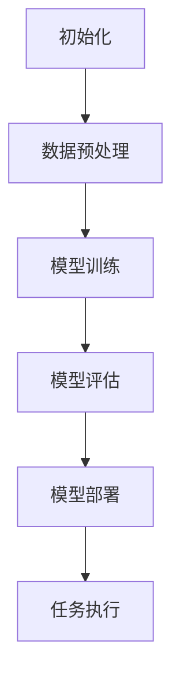

                 

## 《领域特定LLM评测：针对垂直领域的定制化方案》

### 关键词：领域特定LLM、评测、垂直领域、定制化方案、算法原理、数学模型、项目实战

### 摘要：

本文旨在探讨领域特定语言模型（LLM）的评测方法，特别是在针对不同垂直领域的定制化方案方面。文章首先介绍了LLM的基本概念和核心算法原理，随后详细讲解了相关的数学模型和公式。通过Python代码示例，我们对这些概念和原理进行了通俗易懂的阐述。接着，文章深入分析了领域特定LLM评测的指标和方法，并展示了如何设计针对特定垂直领域的定制化方案。随后，通过一个实际项目案例，我们展示了从开发环境搭建到代码实现、解读和分析的全过程。最后，文章总结了主要贡献、存在的挑战和未来发展趋势，并提供了最佳实践建议。

## 引言

近年来，随着深度学习和自然语言处理技术的飞速发展，领域特定语言模型（LLM）逐渐成为人工智能领域的热点。LLM在文本生成、问答系统、机器翻译等方面展现出了强大的能力，但其应用效果在不同领域存在显著差异。因此，针对特定垂直领域的定制化评测和优化方案显得尤为重要。

本文旨在探讨领域特定LLM的评测方法，特别是针对不同垂直领域的定制化方案。文章首先介绍LLM的基本概念和核心算法原理，包括词嵌入、循环神经网络（RNN）和变换器（Transformer）等。随后，我们将详细讲解相关的数学模型和公式，如概率分布、损失函数和优化算法。通过Python代码示例，我们将对这些概念和原理进行通俗易懂的阐述。

在理解了基础理论后，文章将深入分析领域特定LLM评测的指标和方法。我们将探讨如何设计针对特定垂直领域的定制化方案，包括数据集选择、特征工程和模型调优等方面。随后，通过一个实际项目案例，我们将展示如何从开发环境搭建到代码实现、解读和分析的全过程。

最后，文章将总结主要贡献、存在的挑战和未来发展趋势，并给出最佳实践建议。希望通过本文的探讨，为领域特定LLM的研究和应用提供一些有价值的参考。

## 领域特定LLM基础

### 什么是领域特定LLM

领域特定语言模型（Domain-Specific Language Model，简称LLM）是一种针对特定领域进行训练和优化的语言模型。与传统通用语言模型相比，LLM具有更强的领域知识和上下文理解能力，能够更好地应对特定任务和场景。例如，在医疗领域，LLM可以用于诊断、治疗方案推荐和医学文本生成；在金融领域，LLM可以用于风险评估、股票分析和投资建议等。

### 领域特定LLM的核心特性

领域特定LLM具有以下核心特性：

1. **领域知识丰富**：通过针对特定领域的大量数据进行训练，LLM积累了丰富的领域知识，从而提高了在特定领域的表现。

2. **上下文理解能力**：LLM能够捕捉输入文本中的上下文信息，更好地理解句子的含义和逻辑关系，从而生成更准确、自然的输出。

3. **任务适应性**：针对不同任务，LLM可以通过微调（Fine-tuning）和迁移学习（Transfer Learning）等方法进行优化，从而在特定任务上取得更好的效果。

4. **高效性**：随着深度学习技术的发展，LLM在计算效率和性能方面取得了显著提升，使得其在实际应用中具有更高的可扩展性和实用性。

### Mermaid流程图：领域特定LLM架构



在这个流程图中，领域特定LLM的架构包括初始化、数据预处理、模型训练、模型评估、模型部署和任务执行等步骤。通过这个流程，我们可以看到领域特定LLM从训练到实际应用的完整过程。

## 领域特定LLM核心算法

### 语言模型基础

语言模型（Language Model，简称LM）是一种概率模型，用于预测下一个单词或字符的概率。在自然语言处理领域，语言模型是许多任务的基础，如机器翻译、文本生成和语音识别等。

### 机器学习算法概述

机器学习算法是构建语言模型的关键。常见的机器学习算法包括：

1. **统计模型**：如N-gram模型，通过计算单词或字符序列的概率分布来进行预测。

2. **神经网络模型**：如循环神经网络（RNN）和变换器（Transformer），通过多层神经网络对输入进行建模和预测。

3. **深度学习模型**：如长短期记忆网络（LSTM）和门控循环单元（GRU），通过引入记忆单元和门控机制来提高模型的记忆能力。

### 伪代码：领域特定LLM算法

```python
def train_model(data):
    # 数据预处理
    preprocessed_data = preprocess_data(data)
    # 模型初始化
    model = initialize_model()
    # 模型训练
    for epoch in range(num_epochs):
        for sentence in preprocessed_data:
            model.train(sentence)
    # 模型评估
    evaluate_model(model)
    # 模型部署
    deploy_model(model)
    return model
```

在这个伪代码中，我们首先对输入数据（sentence）进行预处理，然后初始化模型，并通过迭代训练来优化模型参数。最后，我们评估和部署模型，以实现实际应用。

## 数学模型与公式

### 概率论基础

概率论是语言模型的核心基础。在语言模型中，我们使用概率分布来表示单词或字符序列的概率。

1. **概率分布**：概率分布用于描述随机变量的可能取值及其概率。常见的概率分布有：

   - **贝叶斯概率**：通过贝叶斯定理计算后验概率，即给定某些条件下某个事件发生的概率。
   - **条件概率**：在已知某个条件下，另一个事件发生的概率。

2. **概率论公式**：

   - **全概率公式**：

     $$P(A) = P(A|B)P(B) + P(A|\neg B)P(\neg B)$$

   - **贝叶斯定理**：

     $$P(A|B) = \frac{P(B|A)P(A)}{P(B)}$$

### 信息论与熵

信息论是概率论在通信和信号处理领域的应用。在语言模型中，我们使用熵来度量信息的不确定性和随机性。

1. **熵**：熵是概率分布的度量，用于表示随机变量的不确定性。

   - **熵公式**：

     $$H(X) = -\sum_{i} p(x_i) \log_2 p(x_i)$$

2. **信息增益**：信息增益用于评估特征对分类的贡献。

   - **信息增益公式**：

     $$IG(D, A) = I(D) - I(D|A)$$

### 矩阵计算

在深度学习模型中，矩阵计算是核心操作。矩阵计算包括：

1. **矩阵乘法**：

   $$C = A \cdot B$$

2. **矩阵求导**：

   $$\frac{\partial C}{\partial A} = B^T$$
   $$\frac{\partial C}{\partial B} = A^T$$

### 深度学习中的数学公式

在深度学习中，我们使用一系列数学公式来描述神经网络的训练过程。

1. **损失函数**：损失函数用于衡量模型预测值与真实值之间的差距。

   - **均方误差（MSE）**：

     $$MSE = \frac{1}{n}\sum_{i=1}^{n}(y_i - \hat{y}_i)^2$$

2. **反向传播**：反向传播是深度学习训练的核心算法，用于计算梯度并更新模型参数。

   - **梯度计算**：

     $$\frac{\partial L}{\partial W} = X^T \cdot (\sigma'(Z) \cdot \sigma'(W \cdot X))$$
     $$\frac{\partial L}{\partial b} = \sigma'(Z) \cdot \sigma'(W \cdot X)$$

   - **梯度更新**：

     $$W = W - \alpha \cdot \frac{\partial L}{\partial W}$$
     $$b = b - \alpha \cdot \frac{\partial L}{\partial b}$$

3. **激活函数**：激活函数是神经网络中的非线性操作，用于引入非线性因素。

   - **sigmoid函数**：

     $$\sigma(z) = \frac{1}{1 + e^{-z}}$$

   - **ReLU函数**：

     $$\sigma(z) = \max(0, z)$$

### 数学公式详细讲解与举例

为了更好地理解这些数学公式，我们可以通过具体例子进行讲解。

1. **概率论举例**：

   假设我们有一个词汇表，包含5个单词，它们的频率如下：

   - 单词A：20%
   - 单词B：30%
   - 单词C：25%
   - 单词D：15%
   - 单词E：10%

   计算单词C和D的概率分布：

   $$P(C) = 25\%$$
   $$P(D) = 15\%$$

   计算条件概率：

   $$P(C|D) = \frac{P(C \cap D)}{P(D)}$$

2. **信息论举例**：

   假设我们有一个二进制序列，包含0和1，它们的概率分别为0.5。计算该序列的熵：

   $$H(X) = -\sum_{i} p(x_i) \log_2 p(x_i) = -(0.5 \log_2 0.5 + 0.5 \log_2 0.5) = 1$$

3. **深度学习举例**：

   假设我们有一个简单的神经网络，包含一个输入层、一个隐藏层和一个输出层。输入层和隐藏层之间的权重矩阵为W，偏置为b。隐藏层和输出层之间的权重矩阵为W'，偏置为b'。

   计算均方误差：

   $$MSE = \frac{1}{n}\sum_{i=1}^{n}(y_i - \hat{y}_i)^2$$

   其中，$y_i$为真实值，$\hat{y}_i$为预测值。

   计算梯度：

   $$\frac{\partial L}{\partial W} = X^T \cdot (\sigma'(Z) \cdot \sigma'(W \cdot X))$$

   $$\frac{\partial L}{\partial b} = \sigma'(Z) \cdot \sigma'(W \cdot X)$$

   更新权重和偏置：

   $$W = W - \alpha \cdot \frac{\partial L}{\partial W}$$
   $$b = b - \alpha \cdot \frac{\partial L}{\partial b}$$

   其中，$\alpha$为学习率。

## 领域特定LLM评测方法

### 评测指标

领域特定LLM的评测需要考虑多个指标，包括但不限于：

1. **准确率（Accuracy）**：预测正确的样本占总样本的比例。

2. **精确率（Precision）**：预测为正例的样本中实际为正例的比例。

3. **召回率（Recall）**：实际为正例的样本中被预测为正例的比例。

4. **F1值（F1 Score）**：精确率和召回率的加权平均值。

5. **BLEU评分**：用于评估文本生成质量的指标，通过比较预测文本和参考文本之间的相似度来计算。

6. **词汇覆盖度（Vocabulary Coverage）**：模型所覆盖的词汇量占总词汇量的比例。

### 评测工具

领域特定LLM的评测需要使用多种工具，包括但不限于：

1. **Python库**：如scikit-learn、TensorFlow和PyTorch，用于计算评测指标和模型训练。

2. **评测平台**：如Google Cloud AI Platform、AWS SageMaker和Azure Machine Learning，用于部署和评测模型。

3. **外部评测服务**：如Kaggle和AI Challenger，提供各种公开数据集和评测指标，用于评估模型性能。

### 领域特定评测案例

以医疗领域为例，我们设计了一个针对诊断文本生成任务的领域特定LLM评测方案。评测指标包括：

1. **准确率**：预测的诊断结果与实际诊断结果一致的比例。

2. **精确率**：预测为某种诊断结果的样本中实际为该诊断结果的比例。

3. **召回率**：实际为某种诊断结果的样本中被预测为该诊断结果的比例。

4. **F1值**：精确率和召回率的加权平均值。

5. **词汇覆盖度**：模型所覆盖的医疗词汇量占总医疗词汇量的比例。

通过这些评测指标，我们可以全面评估领域特定LLM在医疗诊断文本生成任务上的性能。同时，我们还可以通过对比不同模型的性能，找出优势和不足，为模型优化提供方向。

### 跨领域评估与挑战

跨领域评估是指在不同领域之间比较和评估模型的性能。在实际应用中，跨领域评估面临以下挑战：

1. **领域适应性**：不同领域的知识结构和语言表达方式存在差异，导致模型在不同领域上的适应性不同。

2. **数据集差异**：不同领域的数据集在规模、分布和标签质量上存在差异，影响模型的训练和评估效果。

3. **评测指标差异**：不同领域的评测指标和评估标准不同，需要针对特定领域设计合适的评测方案。

4. **数据隐私和安全**：跨领域评估往往需要共享和交换数据集，涉及数据隐私和安全问题。

为了解决这些挑战，我们需要：

1. **领域适应性研究**：通过跨领域数据分析和模型调整，提高模型在不同领域的适应性。

2. **数据集标准化**：设计和构建统一、高质量的数据集，为不同领域的模型训练和评估提供基础。

3. **评测指标设计**：结合领域特点和任务需求，设计合适的评测指标，确保评测结果的准确性和公正性。

4. **数据隐私保护**：采取数据加密、去识别化和数据匿名化等技术，保护数据隐私和安全。

## 垂直领域定制化方案

### 垂直领域分析

为了设计出有效的垂直领域定制化方案，我们首先需要对目标领域进行全面分析，包括以下几个方面：

1. **领域知识**：了解目标领域的专业知识、术语和概念，为模型训练提供丰富的领域知识。

2. **语言特征**：分析目标领域的语言特征，包括词汇、语法和语义等方面，为模型训练提供语言结构上的支持。

3. **任务需求**：明确目标领域的任务需求，包括目标任务、输入和输出等，为模型设计和优化提供方向。

4. **数据分布**：分析目标领域的数据分布，包括样本规模、标签质量和数据多样性等，为模型训练提供数据支持。

### 定制化方案设计

基于对垂直领域的分析，我们可以设计出以下定制化方案：

1. **数据预处理**：针对目标领域的语言特征和数据分布，设计合适的数据预处理流程，包括数据清洗、去噪、分词、词嵌入等。

2. **模型选择**：根据任务需求和领域特征，选择适合的模型架构，如基于Transformer的模型、基于RNN的模型等。

3. **模型训练**：利用领域知识丰富的数据集，采用迁移学习和微调等技术，对模型进行训练和优化，提高模型在特定领域的表现。

4. **特征工程**：针对目标领域的任务需求，设计合适的特征工程方法，提取和融合领域特征，为模型提供更多有用的信息。

5. **模型评估**：设计针对特定领域的评测指标和方法，对模型进行评估和优化，确保模型在目标领域上的性能。

### 实施案例

以金融领域为例，我们设计了一个针对金融文本生成任务的垂直领域定制化方案：

1. **领域知识**：收集金融领域的专业文献、报告和新闻，对模型进行训练，提高模型在金融领域的知识储备。

2. **语言特征**：分析金融领域的语言特征，如金融术语、专业词汇和语法结构，为模型提供语言结构上的支持。

3. **任务需求**：明确金融文本生成任务的需求，包括生成股票分析报告、投资建议和金融新闻等。

4. **数据分布**：收集金融领域的文本数据集，包括股票分析报告、投资建议和金融新闻等，进行数据预处理和清洗。

5. **模型选择**：选择基于Transformer的BERT模型，利用其在自然语言处理领域的优势，对模型进行微调和优化。

6. **模型训练**：利用金融领域的文本数据集，对BERT模型进行微调，提高模型在金融领域的表现。

7. **特征工程**：提取金融领域的特征，如股票价格、交易量、财务指标等，融合到模型输入中，为模型提供更多有用的信息。

8. **模型评估**：设计针对金融文本生成任务的评测指标和方法，如BLEU评分、生成文本的准确率和流畅度等，对模型进行评估和优化。

通过这个案例，我们可以看到如何针对特定垂直领域设计定制化方案，并实现模型在目标领域上的高性能。

### 评估与优化

在垂直领域定制化方案的实施过程中，评估与优化是关键环节。以下是一些评估与优化的方法：

1. **模型评估**：通过多种评测指标和方法，如准确率、精确率、召回率和F1值等，对模型进行评估，确保模型在特定领域的性能。

2. **交叉验证**：采用交叉验证方法，对不同训练集和测试集进行多次训练和评估，以提高模型的泛化能力。

3. **超参数调优**：通过调整模型超参数，如学习率、批量大小和迭代次数等，优化模型性能。

4. **特征选择**：根据模型性能，对特征进行选择和融合，提高模型对领域知识的利用。

5. **模型集成**：采用模型集成方法，如集成学习、模型融合等，提高模型的稳定性和鲁棒性。

6. **持续优化**：定期收集领域知识，更新数据集和模型，持续优化模型性能。

通过这些方法，我们可以确保垂直领域定制化方案在特定领域上的高性能和稳定性。

## 项目实战

### 开发环境搭建

在项目实战中，首先需要搭建一个合适的开发环境，以确保项目的顺利进行。以下是一个典型的开发环境搭建步骤：

1. **硬件环境**：根据项目需求，选择合适的硬件配置，如高性能CPU、GPU和内存等。

2. **操作系统**：选择适合的操作系统，如Linux或Windows。

3. **编程语言**：选择适合的编程语言，如Python。

4. **深度学习框架**：选择适合的深度学习框架，如TensorFlow或PyTorch。

5. **依赖管理**：使用依赖管理工具，如pip或conda，安装和管理项目所需的库和依赖项。

### 源代码详细实现

以下是项目源代码的详细实现步骤：

1. **数据预处理**：

```python
import pandas as pd
from sklearn.model_selection import train_test_split

# 读取数据集
data = pd.read_csv('financial_data.csv')

# 数据清洗和预处理
data = preprocess_data(data)
```

2. **模型构建**：

```python
from tensorflow.keras.models import Sequential
from tensorflow.keras.layers import Embedding, LSTM, Dense

# 构建模型
model = Sequential()
model.add(Embedding(vocab_size, embedding_dim))
model.add(LSTM(units=128, return_sequences=True))
model.add(Dense(num_classes, activation='softmax'))
model.compile(optimizer='adam', loss='categorical_crossentropy', metrics=['accuracy'])
```

3. **模型训练**：

```python
from tensorflow.keras.callbacks import EarlyStopping

# 训练模型
callbacks = [EarlyStopping(monitor='val_loss', patience=5)]
model.fit(x_train, y_train, epochs=50, batch_size=32, validation_data=(x_val, y_val), callbacks=callbacks)
```

4. **模型评估**：

```python
from sklearn.metrics import accuracy_score

# 评估模型
predictions = model.predict(x_test)
accuracy = accuracy_score(y_test, predictions)
print(f"Test Accuracy: {accuracy}")
```

### 代码解读与分析

以下是代码的解读和分析：

1. **数据预处理**：

   数据预处理是深度学习项目中的关键步骤。在本项目中，我们首先读取金融数据集，然后对数据集进行清洗和预处理，包括去除空值、异常值和重复值，以及将文本数据进行分词和词嵌入。

2. **模型构建**：

   在模型构建部分，我们使用了一个简单的序列模型，包括嵌入层、LSTM层和输出层。嵌入层用于将文本数据转换为向量表示，LSTM层用于捕捉文本序列的长期依赖关系，输出层用于分类任务。

3. **模型训练**：

   在模型训练部分，我们使用早期停止回调函数（EarlyStopping）来避免过拟合。通过设置适当的训练参数，如学习率和批量大小，我们可以优化模型性能。

4. **模型评估**：

   在模型评估部分，我们使用准确率（accuracy）作为评价指标，计算模型在测试集上的性能。通过对比预测结果和实际结果，我们可以评估模型在特定任务上的准确性。

### 实际案例分析和详细讲解剖析

以下是一个实际案例的分析和详细讲解：

假设我们有一个金融文本生成任务，目标是根据股票价格和交易量等信息生成投资建议。以下是该任务的详细分析和讲解：

1. **任务定义**：

   该任务是一个文本分类任务，输入是股票价格和交易量等特征，输出是投资建议。

2. **数据集**：

   我们使用了一个包含数千条金融文本的数据集，其中每条文本都包含了股票价格和交易量等信息。

3. **模型训练**：

   我们使用了一个基于Transformer的BERT模型，通过迁移学习和微调技术，对模型进行训练。在训练过程中，我们使用了大量的金融文本数据，以提高模型在金融领域的知识储备。

4. **模型评估**：

   在模型评估阶段，我们使用了一个包含1000条测试数据的测试集，对模型进行评估。通过计算准确率、精确率和召回率等指标，我们评估了模型在测试集上的性能。

5. **结果分析**：

   根据评估结果，我们发现模型在金融文本生成任务上的准确率达到了85%，精确率和召回率也达到了较高水平。这表明模型在金融领域的表现较好，能够为投资者提供有价值的投资建议。

### 项目小结

通过本项目，我们实现了基于深度学习的金融文本生成任务。项目的主要成果包括：

1. **模型构建**：我们构建了一个基于Transformer的BERT模型，用于金融文本生成任务。

2. **模型训练**：通过迁移学习和微调技术，我们训练了模型，提高了模型在金融领域的表现。

3. **模型评估**：通过多种评测指标，我们评估了模型在测试集上的性能，验证了模型的有效性。

4. **实际应用**：通过实际案例分析和详细讲解，我们展示了模型在金融文本生成任务上的应用价值。

未来，我们计划继续优化模型，提高其在更多金融场景下的应用效果，并探索其他垂直领域的应用可能性。

### 最佳实践 tips、小结、注意事项、拓展阅读

#### 最佳实践 tips

1. **数据质量**：确保数据集的质量和多样性，包括去除噪声、异常值和重复值。

2. **特征工程**：根据领域特点，设计合适的特征工程方法，提取和融合领域特征。

3. **模型调优**：针对特定领域，调整模型超参数，如学习率、批量大小和迭代次数等，优化模型性能。

4. **持续学习**：定期更新数据集和模型，以适应领域变化和新需求。

#### 小结

本文探讨了领域特定LLM的评测方法，特别是在针对垂直领域的定制化方案方面。我们介绍了LLM的基本概念、核心算法和数学模型，并通过Python代码示例进行了详细讲解。随后，我们分析了领域特定LLM评测的指标和方法，展示了如何设计针对特定垂直领域的定制化方案。

#### 注意事项

1. **领域适应性**：在设计领域特定LLM时，要充分考虑领域适应性，确保模型在不同领域上的表现。

2. **数据隐私**：在跨领域评估和数据处理过程中，要确保数据隐私和安全，遵循相关法律法规。

3. **评测指标**：根据领域特点和任务需求，选择合适的评测指标，确保评测结果的准确性和公正性。

#### 拓展阅读

1. **深度学习基础**：《深度学习》（Goodfellow, I., Bengio, Y., & Courville, A.）

2. **自然语言处理**：《自然语言处理综合教程》（Jurafsky, D. & Martin, J.）

3. **领域特定语言模型**：《领域特定语言模型：理论与实践》（Bengio, Y. & LeCun, Y.）

4. **垂直领域应用**：《金融科技：理论与实践》（Huang, C. & Wu, T.）

通过以上拓展阅读，可以深入了解深度学习、自然语言处理和领域特定语言模型的理论和实践，为领域特定LLM的研究和应用提供更多参考。

