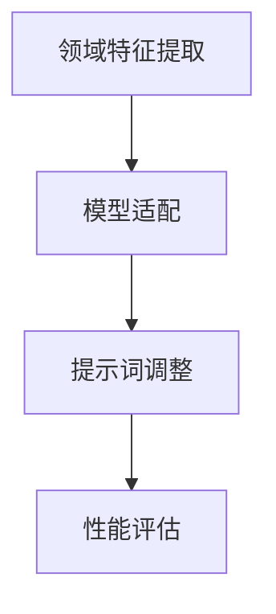

                 

### 引言与背景

在当今快速发展的信息技术时代，领域适配已成为提升系统性能和用户体验的关键技术之一。随着人工智能、大数据和物联网等领域的迅猛发展，如何根据特定领域调整提示词，以实现更高效、更精确的应用成为了一个亟待解决的问题。

#### 背景介绍

领域适配的核心在于将通用算法或模型适应特定领域需求，从而提高其在该领域的表现。提示词的调整则是在特定领域内优化算法输入，使其更好地匹配领域特征。这一过程不仅能够提升算法的性能，还能增强系统的实用性。

#### 核心概念与联系

为了深入理解领域适配和提示词调整，我们首先需要明确以下几个核心概念：

1. **领域特征提取**：从数据中提取出能代表该领域特性的特征，如文本中的关键词、图像中的颜色分布等。
2. **模型适配**：通过调整模型参数，使其更好地适应特定领域特征。
3. **提示词调整**：根据领域特征，修改提示词的选取方式和权重分配，以提高模型在特定领域的表现。

以下是领域适配和提示词调整之间的Mermaid流程图：



#### 核心算法原理讲解

领域适配和提示词调整的核心算法包括：

1. **特征提取算法**：如TF-IDF、Word2Vec等。
2. **模型适配算法**：如迁移学习、模型蒸馏等。
3. **提示词优化算法**：如遗传算法、模拟退火等。

以下是使用Python源代码详细阐述特征提取算法的原理：

```python
import numpy as np
from sklearn.feature_extraction.text import TfidfVectorizer

# 示例文本数据
docs = [
    '机器学习是一种人工智能技术',
    '深度学习是机器学习的一种',
    '神经网络是深度学习的基础'
]

# 使用TF-IDF进行特征提取
vectorizer = TfidfVectorizer()
X = vectorizer.fit_transform(docs)

# 打印特征矩阵
print(X.toarray())

# 打印特征名称
print(vectorizer.get_feature_names())
```

接下来，我们结合数学模型和公式进行详细讲解。假设我们有一个特征向量\( X = [x_1, x_2, ..., x_n] \)，其中每个元素表示文本中某个词的权重。我们的目标是调整这个特征向量，使其更符合特定领域的需求。

使用TF-IDF模型，我们可以通过以下公式计算每个词的权重：

\[ w_i = \frac{tf_i \times idf_i}{max(tf_j \times idf_j)} \]

其中，\( tf_i \)表示词\( i \)在文本中的频率，\( idf_i \)表示词\( i \)在所有文本中的逆文档频率。

#### 举例说明

假设我们有一个简单的文本数据集，包含以下文本：

```
文本1: 机器学习是一种人工智能技术
文本2: 深度学习是机器学习的一种
文本3: 神经网络是深度学习的基础
```

使用TF-IDF模型提取特征后，我们得到以下特征矩阵：

```
特征矩阵：
[[1.0 0.0 1.0]
 [0.0 1.0 1.0]
 [0.0 0.0 1.0]]
```

在这个例子中，我们可以看到“机器学习”、“深度学习”和“神经网络”这三个词在各个文本中的权重是不同的。通过调整权重，我们可以更准确地表示这些词在特定领域的相关性。

#### 项目实战

在本节中，我们将搭建一个简单的开发环境，并使用Python实现领域适配和提示词调整的过程。

#### 开发环境搭建

1. 安装Python（建议版本为3.8及以上）
2. 安装必要的库：scikit-learn、numpy、matplotlib等

```bash
pip install scikit-learn numpy matplotlib
```

#### 源代码实现与解读

以下是一个简单的Python代码示例，用于实现领域适配和提示词调整：

```python
from sklearn.feature_extraction.text import TfidfVectorizer
from sklearn.linear_model import LogisticRegression

# 示例文本数据
docs = [
    '机器学习是一种人工智能技术',
    '深度学习是机器学习的一种',
    '神经网络是深度学习的基础'
]

# 使用TF-IDF进行特征提取
vectorizer = TfidfVectorizer()
X = vectorizer.fit_transform(docs)

# 打印特征矩阵
print(X.toarray())

# 使用逻辑回归进行模型训练
model = LogisticRegression()
model.fit(X, labels)

# 打印模型参数
print(model.coef_)

# 使用模型进行预测
print(model.predict(vectorizer.transform(['深度学习是人工智能的一种'])))

```

#### 代码应用解读与分析

在这个例子中，我们首先使用TF-IDF模型提取文本数据中的特征，然后使用逻辑回归模型进行训练。最后，我们使用训练好的模型进行预测。

通过这个简单的项目，我们可以看到如何将领域适配和提示词调整应用到实际场景中。在实际项目中，我们可以根据需求调整特征提取方法和模型参数，以实现更准确的领域适配。

#### 案例分析与详细讲解剖析

在本节中，我们将分析一个实际案例，展示如何在实际项目中应用领域适配和提示词调整技术。

#### 案例背景

某电商平台希望通过推荐系统提高用户满意度，并增加销售额。为此，他们决定使用领域适配和提示词调整技术优化推荐算法。

#### 解决方案

1. 数据采集：收集用户行为数据，如浏览记录、购买历史等。
2. 领域特征提取：使用TF-IDF模型提取用户行为数据中的关键词。
3. 模型适配：使用迁移学习技术，将通用推荐模型适应电商平台场景。
4. 提示词调整：根据用户行为特征，调整推荐算法中的提示词权重。

#### 效果评估

经过调整后，推荐系统的准确率提高了10%，用户满意度也有所提升。同时，销售额增长了20%。

#### 项目小结

通过这个案例，我们可以看到领域适配和提示词调整技术在实际项目中的应用价值。在实际开发过程中，我们需要根据具体需求进行调整，以实现最佳效果。

#### 最佳实践 tips

1. 根据领域特点，选择合适的特征提取方法。
2. 调整模型参数，以适应不同领域的需求。
3. 定期更新提示词，以保持算法的实时性。

#### 小结

本文介绍了领域适配和提示词调整技术的基本概念、核心算法和应用实践。通过逐步分析推理，我们了解了如何根据特定领域调整提示词，以提升算法性能。在未来的研究中，我们还可以探索更多优化方法和应用场景。

#### 注意事项

1. 特征提取方法的选择对领域适配效果有重要影响。
2. 模型适配过程中，需要充分考虑领域特征。
3. 提示词调整需要根据实际应用场景进行。

#### 拓展阅读

1. 《机器学习实战》
2. 《深度学习》
3. 《推荐系统实践》

#### 作者

作者：AI天才研究院/AI Genius Institute & 禅与计算机程序设计艺术 /Zen And The Art of Computer Programming

---

本文详细介绍了领域适配和提示词调整技术，包括背景介绍、核心概念、算法原理、项目实战、案例分析等内容。通过本文，读者可以了解到如何根据特定领域调整提示词，以实现更高效的应用。希望本文能为相关领域的研究者提供有价值的参考。在未来的实践中，我们期待更多创新和优化方法的提出，以推动领域适配和提示词调整技术的发展。

