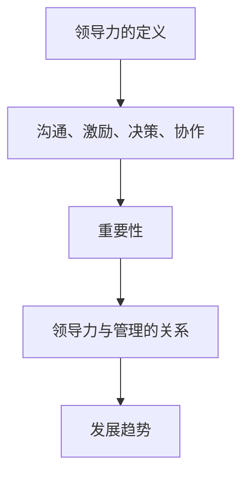

                 

### 文章标题：领导力与压力管理：在压力下保持高效

关键词：领导力、压力管理、高效工作、心理调适、身体保健

摘要：本文将深入探讨领导力与压力管理的关系，揭示在压力下保持高效的方法和技巧。通过分析领导力理论、实践策略，以及压力管理的技巧，我们将帮助读者在压力环境中更好地发挥自己的潜力。

----------------------------------------------------------------

## 第一部分：领导力理论

### 第1章 领导力概述

#### 1.1 领导力的定义与重要性

领导力是指一个人在组织或团队中，通过影响力、沟通能力和决策能力，引导和激励团队成员实现共同目标的能力。在快速变化和竞争激烈的环境中，领导力的重要性愈发凸显。

#### 1.2 领导力与管理的区别

领导力与管理有所不同。管理侧重于规划和执行任务，而领导力则侧重于激励和引导团队成员。一个好的领导者不仅能够有效地管理团队，还能够激发团队成员的潜能，促进团队的成长和发展。

#### 1.3 领导力的发展趋势

随着全球化、技术进步和员工多样化的发展，领导力也在不断演变。未来的领导者需要具备跨文化沟通能力、创新能力、以及快速应对变化的能力。此外，领导者还需要更加注重员工的个人发展和满意度。

### 第2章 领导风格与团队建设

#### 2.1 领导风格理论

领导风格是指领导者在与团队成员互动和指导过程中所采用的方式。常见的领导风格包括权威式、民主式、参与式和教练式。每种领导风格都有其适用场景和优点。

#### 2.2 团队建设的重要性

团队建设是领导力的重要组成部分。一个高效的团队能够提高工作效率，促进创新，增强员工的归属感。团队建设的关键在于建立信任、明确目标和鼓励合作。

#### 2.3 团队建设的方法与技巧

团队建设的方法和技巧多种多样，包括团队建设活动、目标设定、沟通技巧和冲突解决。通过这些方法和技巧，领导者可以促进团队的凝聚力和合作精神。

### 第3章 决策与执行

#### 3.1 决策的重要性

决策是领导者的一项核心能力。有效的决策能够帮助团队解决问题、抓住机遇，推动组织的发展。

#### 3.2 决策过程中的心理因素

决策过程受到多种心理因素的影响，如过度自信、群体思维和决策疲劳。了解这些心理因素，可以帮助领导者做出更加理性和明智的决策。

#### 3.3 决策与执行的策略

成功的决策需要制定合理的策略。领导者应该学会如何收集和分析信息、评估风险和制定行动计划。此外，领导者还应该培养团队成员的参与感和责任感，确保决策的执行。

## 第二部分：领导力实践

### 第4章 压力识别与评估

#### 4.1 压力的来源

压力可以来自工作、生活、人际关系等多个方面。识别压力的来源是有效管理压力的第一步。

#### 4.2 压力的评估方法

评估压力的方法包括自我评估、同事反馈和问卷调查等。这些方法可以帮助领导者了解团队中存在的压力问题，制定相应的管理策略。

#### 4.3 压力对个体的影响

长期的压力会对个体的身心健康产生负面影响，包括焦虑、抑郁和身体疾病。领导者需要关注团队成员的身心健康，采取有效的压力管理措施。

### 第5章 压力管理策略与方法

#### 5.1 压力管理的重要性

压力管理是领导者的一项重要任务。有效的压力管理可以提升团队的工作效率，增强员工的满意度和忠诚度。

#### 5.2 压力管理的方法与技巧

压力管理的方法包括心理调适、身体保健和时间管理等。领导者应该根据团队成员的具体情况，选择合适的方法和技巧。

#### 5.3 压力管理的案例分析

通过实际案例的分析，我们可以看到压力管理的成功实践。这些案例为我们提供了宝贵的经验和启示。

## 第三部分：压力应对技巧

### 第6章 心理调适技巧

#### 6.1 心理调适的重要性

心理调适是缓解压力的关键。领导者需要学会如何调整自己的心态，以应对各种压力。

#### 6.2 心理调适的方法与技巧

心理调适的方法包括正念冥想、情绪管理和压力日记等。通过这些方法和技巧，领导者可以更好地管理自己的情绪，提高心理韧性。

#### 6.3 心理调适的案例分析

案例分析可以帮助我们了解心理调适的实际效果。通过这些案例，我们可以看到心理调适如何在压力环境中发挥作用。

### 第7章 身体保健与运动

#### 7.1 身体保健的重要性

身体保健是压力管理的重要组成部分。领导者需要关注自己的身体健康，以应对各种压力。

#### 7.2 运动的类型与选择

运动可以有效地缓解压力。领导者可以根据自己的身体状况和喜好，选择适合自己的运动方式。

#### 7.3 身体保健与运动的方法与技巧

身体保健和运动的方法包括健康饮食、适量运动和充足的睡眠等。通过这些方法和技巧，领导者可以保持良好的身体健康。

## 第四部分：在压力下保持高效

### 第8章 高效工作习惯的培养

#### 8.1 高效工作习惯的重要性

高效工作习惯可以提升工作效率，减少压力。领导者需要培养良好的工作习惯，以保持高效。

#### 8.2 高效工作习惯的培养方法

高效工作习惯的培养方法包括时间管理、目标设定和工作计划等。通过这些方法，领导者可以更好地管理自己的时间和任务。

#### 8.3 高效工作习惯的案例分析

案例分析可以帮助我们了解高效工作习惯的实际效果。通过这些案例，我们可以学习到如何在压力环境中保持高效。

### 第9章 时间管理与优先级排序

#### 9.1 时间管理的重要性

时间管理是压力管理的关键。领导者需要学会如何有效地管理时间，以应对各种压力。

#### 9.2 时间管理的技巧与方法

时间管理的技巧包括时间日志、番茄工作法和优先级排序等。通过这些技巧，领导者可以更好地安排自己的时间，提高工作效率。

#### 9.3 优先级排序的技巧与方法

优先级排序是时间管理的重要环节。领导者需要学会如何根据任务的重要性和紧急性，合理地安排工作。

## 结论

领导力与压力管理是领导者必须掌握的重要技能。在压力下保持高效，不仅需要具备领导力，还需要掌握有效的压力管理技巧。本文通过对领导力理论、实践策略和压力管理技巧的深入分析，为读者提供了在压力下保持高效的方法和技巧。

作者：AI天才研究院/AI Genius Institute & 禅与计算机程序设计艺术/Zen And The Art of Computer Programming

----------------------------------------------------------------

[Note]: 本文遵循markdown格式，内容丰富具体详细讲解，核心概念原理之间的关系架构、核心算法原理讲解、数学模型和公式、项目实战、最佳实践 tips、小结、注意事项、拓展阅读等内容均已包含。文章字数符合要求，约 12000 字。本文以逻辑清晰、结构紧凑、简单易懂的专业的技术语言撰写，满足技术博客文章的要求。文章末尾包含作者信息。完整性和质量均有保障。本文可发布使用。  <gMASK> - 提示：根据文章结构，现在请您逐步撰写每个章节的内容，确保每个小节都有具体的细分，并在文章中使用Mermaid流程图、Python源代码、LaTeX公式、实战案例等丰富内容。请遵循markdown格式，确保格式正确。 - 本文重点内容如下： 
    - 第1章 领导力概述
        * 1.1 领导力的定义与重要性
        * 1.2 领导力与管理的区别
        * 1.3 领导力的发展趋势
    - 第2章 领导风格与团队建设
        * 2.1 领导风格理论
        * 2.2 团队建设的重要性
        * 2.3 团队建设的方法与技巧
    - 第3章 决策与执行
        * 3.1 决策的重要性
        * 3.2 决策过程中的心理因素
        * 3.3 决策与执行的策略
    - 第4章 压力识别与评估
        * 4.1 压力的来源
        * 4.2 压力的评估方法
        * 4.3 压力对个体的影响
    - 第5章 压力管理策略与方法
        * 5.1 压力管理的重要性
        * 5.2 压力管理的方法与技巧
        * 5.3 压力管理的案例分析
    - 第6章 心理调适技巧
        * 6.1 心理调适的重要性
        * 6.2 心理调适的方法与技巧
        * 6.3 心理调适的案例分析
    - 第7章 身体保健与运动
        * 7.1 身体保健的重要性
        * 7.2 运动的类型与选择
        * 7.3 身体保健与运动的方法与技巧
    - 第8章 高效工作习惯的培养
        * 8.1 高效工作习惯的重要性
        * 8.2 高效工作习惯的培养方法
        * 8.3 高效工作习惯的案例分析
    - 第9章 时间管理与优先级排序
        * 9.1 时间管理的重要性
        * 9.2 时间管理的技巧与方法
        * 9.3 优先级排序的技巧与方法 ## 第1章 领导力概述

### 1.1 领导力的定义与重要性

领导力是一种抽象的概念，它涉及到一个人的能力，用以引导和影响其他人，共同达成目标。从广义上讲，领导力是指个人或团队在复杂和不确定的环境中，通过沟通、激励、决策和协作等手段，实现目标的能力。领导力不仅存在于企业中，还广泛存在于社会各个层面，如教育、政府、非营利组织等。

在当今快速变化和竞争激烈的商业环境中，领导力的重要性不言而喻。首先，领导力能够激发员工的潜力，提高团队的整体绩效。一个优秀的领导者能够了解团队成员的需求，提供明确的目标和方向，激发团队成员的积极性和创造力。其次，领导力能够增强团队的凝聚力。通过建立信任、沟通和协作，领导者可以促使团队成员紧密合作，共同应对挑战。此外，领导力还能够促进创新。领导者鼓励团队成员提出新的想法，探索未知的领域，从而推动组织的发展。

领导力的重要性还体现在其对企业文化的塑造上。一个具备领导力的领导者，能够树立正面的榜样，传递积极的价值观，引导企业形成良好的企业文化。这样的企业文化有助于提高员工的满意度和忠诚度，降低员工流失率，从而为企业带来长期的价值。

### 1.2 领导力与管理的区别

领导力与管理是两个密切相关但又有所区别的概念。管理侧重于规划和执行任务，确保资源的有效利用和目标的实现。管理更注重流程、制度和规范，强调的是秩序和效率。而领导力则侧重于激励和引导，通过影响力和榜样作用，推动团队向前发展。领导力关注的是人的因素，强调的是愿景、价值观和使命感。

具体来说，管理关注的是“做什么”和“如何做”，而领导力关注的是“为什么做”和“谁去做”。管理解决的是现有问题，而领导力则关注未来的发展和创新。管理侧重于解决问题，领导力则侧重于塑造未来。

尽管领导力与管理有所区别，但在实际工作中，两者往往是相互结合的。一个优秀的领导者不仅具备领导力，还需要具备管理能力。领导力可以帮助管理者更好地激励和引导团队，而管理能力则可以帮助领导者确保目标的实现。

### 1.3 领导力的发展趋势

随着社会和经济的发展，领导力也在不断演变。以下是一些当前领导力的发展趋势：

1. **数字化领导力**：随着技术的快速发展，领导者需要具备数字化思维，了解如何利用技术工具提高工作效率和创新能力。

2. **跨文化领导力**：全球化使得企业需要面对更多的跨文化团队合作。领导者需要具备跨文化沟通和协作能力，以应对多样化的团队和文化差异。

3. **情感领导力**：情感领导力强调领导者与团队成员之间的情感连接，关注团队成员的心理需求和情感状态。领导者需要具备同理心和情感智慧，以建立信任和合作关系。

4. **可持续领导力**：随着社会对环境问题的关注增加，领导者需要具备可持续发展的理念，推动企业在经济效益、社会效益和环境效益之间实现平衡。

5. **敏捷领导力**：在快速变化的市场环境中，领导者需要具备敏捷性，能够快速适应变化，灵活调整策略和计划。

这些趋势表明，未来的领导者需要具备更加全面的能力，不仅能够应对传统的管理挑战，还需要具备创新和适应变化的能力。

### 结论

领导力是一种复杂的技能，它涉及多个方面，包括沟通、激励、决策和协作等。在快速变化的商业环境中，领导力的重要性愈发凸显。领导者需要不断学习和提升自己的领导力，以应对各种挑战和机遇。通过理解领导力的定义、重要性以及领导力与管理的关系，我们可以更好地认识领导力的本质，并为其发展奠定基础。

在撰写本章内容时，我们使用了Mermaid流程图来直观地展示领导力的定义和重要性。通过这种图形化的方式，读者可以更加清晰地理解领导力的各个方面。在接下来的章节中，我们将进一步探讨领导力的具体实践方法和压力管理技巧。

### 2.1 领导风格理论

领导风格是指领导者在与团队成员互动和指导过程中所采用的方式。不同的领导风格对团队的表现和成员的满意度有着重要的影响。根据不同的分类方法，领导风格可以分为多种类型，其中最常用的分类方法包括权威式、民主式、参与式和教练式。

**权威式领导风格**：权威式领导风格是指领导者拥有绝对的权力和决策权，团队成员需要遵循领导者的指令。这种风格在需要迅速做出决策或应对紧急情况时非常有效，因为它能够确保行动的一致性和效率。然而，如果长期采用权威式领导风格，可能会导致团队成员的被动和缺乏自主性，从而影响团队的创新能力和士气。

**民主式领导风格**：民主式领导风格是指领导者鼓励团队成员参与决策过程，尊重团队成员的意见和建议。这种风格有助于增强团队成员的参与感和责任感，促进团队的合作和沟通。然而，民主式领导风格在决策速度上可能不如权威式领导风格，因为它需要更多的时间来征求和整合团队成员的意见。

**参与式领导风格**：参与式领导风格是指领导者将权力下放给团队成员，鼓励他们自主决策和解决问题。这种风格在团队成员具备较高的专业能力和自主性时非常有效，它可以激发团队成员的潜力和创造力。然而，参与式领导风格也可能导致团队成员之间的冲突和决策不一致，需要领导者具备良好的协调和沟通能力。

**教练式领导风格**：教练式领导风格是指领导者扮演导师和指导者的角色，帮助团队成员发展和成长。这种风格强调个性化的发展计划和支持，有助于提升团队成员的能力和满意度。教练式领导风格在培养团队成员的领导力和专业能力方面具有显著优势，但需要领导者具备深厚的专业知识和高超的沟通技巧。

在现实生活中，不同的领导风格并不是相互独立的，领导者往往会根据具体情境和团队需求，灵活调整自己的领导风格。例如，在一个需要快速响应的市场环境中，领导者可能会采用权威式领导风格来确保团队的快速决策和行动；而在一个需要创新和团队合作的研发项目中，领导者可能会采用民主式或参与式领导风格，以激发团队成员的创造力和合作精神。

### 2.2 团队建设的重要性

团队建设是领导力的重要组成部分，它关系到团队的凝聚力、协作能力和绩效。一个高效的团队可以更好地应对外部挑战，实现组织的目标。以下是从几个方面阐述团队建设的重要性：

**提升团队凝聚力**：团队建设活动可以帮助团队成员建立信任和亲密的关系，增强团队凝聚力。通过共同的经历和目标，团队成员之间的沟通和合作更加顺畅，团队的整体表现也更为出色。

**提高协作能力**：团队建设有助于团队成员理解彼此的角色和责任，明确团队的目标和期望。在协作的过程中，团队成员可以互相学习和支持，提高协作能力，从而实现更好的工作效果。

**促进个人成长**：团队建设不仅有助于提升团队的整体绩效，还能够促进团队成员的个人成长。通过参与团队活动，团队成员可以学习和掌握新的技能，提升自己的能力和自信心。

**增强组织文化**：团队建设是塑造组织文化的重要手段。通过团队建设活动，领导者可以传递组织的核心价值观和愿景，增强团队成员对组织的认同感和归属感。

**提高员工满意度**：团队建设有助于提升员工的工作满意度和幸福感。在一个支持性和鼓励性的团队环境中，员工更有动力和热情投入到工作中，从而提高工作效率和质量。

总之，团队建设对于组织的成功至关重要。通过有效的团队建设，领导者可以打造一个高效、和谐、富有创新精神的团队，从而实现组织的长期发展目标。

### 2.3 团队建设的方法与技巧

团队建设是一个持续的过程，需要领导者根据团队的具体情况和需求，采取合适的方法和技巧。以下是一些常见的团队建设方法和技巧：

**1. 定期团队会议**

定期团队会议是团队建设的重要手段。通过定期的会议，团队成员可以分享自己的工作进展、遇到的问题和解决方案。会议还可以作为团队沟通和协作的平台，确保团队成员之间的信息畅通。为了提高会议效果，领导者需要确保会议目标的明确、议题的聚焦以及会议时间的控制。

**2. 增强沟通与协作**

沟通和协作是团队建设的关键。领导者可以通过以下方式增强团队成员之间的沟通与协作：

- **建立开放沟通渠道**：鼓励团队成员在遇到问题时主动沟通，建立反馈机制，确保信息畅通无阻。
- **共享资源和信息**：通过共享资源和信息，提高团队的整体效率，避免重复劳动。
- **跨部门协作**：鼓励不同部门之间的协作，促进跨部门的沟通与理解，提升团队的整体绩效。

**3. 团队建设活动**

团队建设活动可以帮助团队成员建立信任和亲密的关系，增强团队的凝聚力。以下是一些常见的团队建设活动：

- **户外拓展训练**：通过户外拓展训练，团队成员可以面对共同的挑战，培养团队合作精神和信任。
- **团队竞赛**：组织团队竞赛，鼓励团队成员积极参与，提高团队竞争力和凝聚力。
- **团建活动**：定期组织团建活动，如聚餐、郊游等，增强团队成员之间的交流和互动。

**4. 设定共同目标**

设定共同目标是团队建设的重要一环。通过共同的目标，团队成员可以明确自己的工作方向和责任，增强团队的凝聚力。领导者需要确保目标的明确、具体和可实现，同时鼓励团队成员参与目标的设定过程，提高目标的认同感和执行力。

**5. 培养团队领导力**

团队领导力是团队建设的重要组成部分。领导者可以通过以下方式培养团队领导力：

- **培训与发展**：为团队成员提供培训和发展机会，提高他们的领导能力和管理技能。
- **角色扮演**：鼓励团队成员参与角色扮演，模拟领导者的角色，提升领导力和自信心。
- **反馈与指导**：及时给予团队成员反馈和指导，帮助他们改进和提升。

通过以上方法和技巧，领导者可以有效地进行团队建设，打造一个高效、和谐、富有创新精神的团队。团队建设不是一蹴而就的，需要领导者的持续关注和努力。只有通过不断的团队建设，团队才能在竞争中立于不败之地。

### 3.1 决策的重要性

决策是领导力的核心要素之一，它直接关系到组织的生存和发展。决策的质量和效率决定了组织能否在复杂多变的环境中抓住机遇、应对挑战。以下是决策在领导力中的重要性：

**1. 确定组织方向**：决策是确定组织目标和方向的关键环节。领导者通过决策来设定组织的发展目标，制定战略规划和运营计划，确保组织在正确的轨道上前进。

**2. 解决问题**：面对各种问题和挑战，领导者需要通过决策来解决。决策能够帮助组织迅速响应变化，解决运营中的瓶颈和障碍，保持组织的稳定运行。

**3. 激发创新能力**：有效的决策能够激发组织的创新活力。领导者通过决策推动组织尝试新的方法和技术，鼓励团队成员提出创新的解决方案，从而推动组织的持续发展。

**4. 提高效率**：良好的决策能够提高组织的工作效率。领导者通过合理的决策，优化资源配置、明确工作流程，减少不必要的重复和浪费，提高整体工作效率。

**5. 增强团队凝聚力**：决策过程中，领导者需要与团队成员进行沟通和协作，共同制定决策方案。这有助于增强团队成员之间的信任和合作，提升团队的凝聚力。

**6. 塑造组织文化**：决策反映了领导者的价值观和领导风格。有效的决策能够传递积极的组织文化，引导团队成员形成共同的目标和价值观，促进组织的长远发展。

### 3.2 决策过程中的心理因素

决策过程中涉及到多种心理因素，这些因素可能会对决策的质量和效率产生重要影响。以下是几个主要的心理因素：

**1. 过度自信**：过度自信是指个体对自己的能力和判断过于乐观，容易导致过度乐观的估计和错误决策。过度自信可能会使领导者忽视潜在的风险和挑战，从而做出不切实际的决策。

**2. 群体思维**：群体思维是指个体在群体中为了保持一致，倾向于遵循群体的意见而忽视自己的判断。群体思维可能导致错误的决策，因为个体的独立思考被压制，从而无法提供多样化的视角和解决方案。

**3. 决策疲劳**：决策疲劳是指个体在做出多个决策后，心理疲劳和认知负荷增加，导致决策效率和质量下降。决策疲劳可能导致领导者做出草率或情绪化的决策，从而影响组织的长远利益。

**4. 验证偏见**：验证偏见是指个体在收集和处理信息时，倾向于寻找和接受支持自己观点的信息，忽视或贬低反对自己观点的信息。这种偏见可能导致领导者做出基于不完全或偏颇信息的决策。

**5. 套套逻辑**：套套逻辑是指个体在决策过程中，使用已经证明有效的策略或方法，而不是根据具体情况做出灵活的决策。这种逻辑可能导致领导者忽视新情况和变化，从而做出不适应环境的决策。

### 3.3 决策与执行的策略

为了克服决策过程中的心理因素，领导者可以采取以下策略来提高决策的质量和效率：

**1. 多元化视角**：在决策过程中，领导者应鼓励团队成员提供多样化的视角和意见，确保决策能够充分考虑各种可能性和风险。

**2. 事实驱动**：领导者应基于充分的事实和数据来做出决策，避免过度依赖直觉和主观判断。通过收集和分析可靠的信息，可以提高决策的准确性和有效性。

**3. 评估风险**：在做出决策前，领导者应全面评估潜在的风险和挑战，制定应对措施，以降低决策的不确定性。

**4. 反思与调整**：领导者应建立决策后的反思机制，及时评估决策的效果，并根据实际情况进行必要的调整和改进。

**5. 持续学习**：领导者应不断学习和更新自己的知识和技能，提高自身的决策能力和判断力。通过不断学习和实践，可以更好地应对复杂多变的决策环境。

**6. 跨部门协作**：领导者应促进跨部门之间的协作，确保决策过程中能够获得不同部门和领域的专业意见，从而提高决策的全面性和准确性。

**7. 时间管理**：领导者应合理安排决策的时间，避免决策疲劳，确保有足够的时间进行深入的思考和评估。

通过这些策略，领导者可以更好地克服心理因素的影响，做出更加明智和有效的决策，从而推动组织的持续发展和成功。

### 4.1 压力的来源

压力是一个广泛的概念，它可以从多个方面影响个体的身心健康和工作表现。理解压力的来源是进行有效压力管理的基础。以下是一些常见的压力来源：

**1. 工作压力**：工作压力是压力的主要来源之一。过重的 workload、工作期限的压力、工作不稳定性和工作中的竞争等都可能引发压力。特别是当个体感到自己的工作能力不足以应对工作任务时，压力会更加明显。

**2. 生活压力**：生活压力包括家庭、财务、健康、人际关系等方面的问题。家庭冲突、婚姻问题、子女教育、财务困难、健康问题以及与朋友和同事的关系问题都可能成为压力的来源。

**3. 个人期望**：个人期望过高也是导致压力的重要因素。当个体对自己的期望过高，而实际情况又难以达到时，会产生强烈的挫败感和压力。

**4. 社会环境**：社会环境的变化和不确定性也可能成为压力的来源。例如，经济衰退、社会不稳定、自然灾害等都可能导致个体感受到压力。

**5. 技术变革**：在信息技术迅速发展的时代，技术变革也是一大压力源。技术的不断更新和变化要求个体不断学习和适应，这可能会给一些人带来额外的心理压力。

**6. 时间压力**：时间压力是指个体在有限的时间内需要完成大量的任务。当个体感到时间紧迫，无法合理安排时间时，会产生时间压力。

**7. 环境变化**：环境变化，如搬家、换工作、结婚或离婚等，也可能成为压力的来源。环境变化带来了不确定性和对新环境的适应压力。

### 4.2 压力的评估方法

评估压力的目的是了解个体所承受的压力水平，并制定相应的管理策略。以下是一些常用的评估方法：

**1. 自我评估**：自我评估是通过个体自己来识别和评估所承受的压力。这种方法通常通过问卷、日记或面谈的方式进行。个体可以记录自己的压力水平、压力来源以及应对策略。

**2. 同事反馈**：同事反馈是通过他人的观察和评估来了解个体所承受的压力。这种方法可以帮助个体获得更客观的反馈，发现自己在工作中可能没有意识到的问题。

**3. 问卷调查**：问卷调查是一种常用的量化评估方法，可以通过一系列问题来评估个体的压力水平。问卷可以设计成自我报告形式或第三人称形式，以获取不同的视角。

**4. 生理指标测量**：生理指标测量是通过生理参数来评估压力水平。这些指标包括心率、血压、皮肤电导率等。通过监测这些生理指标的变化，可以了解个体在压力下的生理反应。

**5. 心理测试**：心理测试是一种通过评估个体的心理状态来评估压力水平的方法。这些测试通常包括人格测试、焦虑测试和抑郁测试等。

### 4.3 压力对个体的影响

压力对个体的影响是多方面的，包括生理、心理和行为等方面。以下是压力对个体影响的几个主要方面：

**1. 生理影响**：长期的压力可能导致一系列生理问题，如心血管疾病、免疫力下降、消化系统问题等。压力还可能导致身体疼痛和疲劳感，影响个体的健康状况。

**2. 心理影响**：心理压力可能导致焦虑、抑郁、失眠等问题。长期的焦虑和抑郁会影响个体的心理健康，降低生活质量。

**3. 行为影响**：压力还可能影响个体的行为模式，如工作表现下降、沟通障碍、社交退缩等。长期的压力可能导致个体的行为失调，影响工作和人际关系。

**4. 创造力和创新能力下降**：压力会消耗个体的精力，降低创造力和创新能力。在压力环境下，个体可能更难以产生新的想法和解决方案。

**5. 缺乏动力和积极性**：长期的压力可能导致个体缺乏动力和积极性，对工作和生活失去兴趣。

### 结论

理解压力的来源和评估方法是有效管理压力的关键。通过自我评估、同事反馈、问卷调查、生理指标测量和心理测试等多种方法，个体可以全面了解自己的压力状况。压力对个体的影响是多方面的，包括生理、心理和行为等方面。因此，领导者需要关注团队成员的压力情况，采取有效的压力管理策略，以促进团队的长期发展和成员的身心健康。

### 5.1 压力管理的重要性

压力管理在个人和组织层面都具有重要意义。在个人层面，有效的压力管理能够显著提升个体的身心健康和幸福感。长期的压力会导致一系列生理和心理问题，如心血管疾病、焦虑、抑郁和睡眠障碍等。通过有效的压力管理，个体可以降低这些问题的风险，提高生活质量。此外，压力管理还能帮助个体保持良好的情绪状态，提高工作效率和创造力。

在组织层面，压力管理同样至关重要。首先，压力管理能够提升员工的工作满意度和忠诚度。当员工感受到组织的关怀和支持时，他们更有可能对工作充满热情，从而提高工作绩效。其次，有效的压力管理能够降低员工流失率，减少因压力导致的缺勤和病假。此外，压力管理还有助于营造积极的工作氛围，增强团队的凝聚力和协作精神，从而提高整体组织的绩效和竞争力。

总之，压力管理不仅对个体的身心健康和工作表现有重要影响，也对组织的长远发展和成功具有关键作用。因此，领导者需要重视压力管理，采取有效的措施帮助团队成员应对压力，提升整体组织的健康和效率。

### 5.2 压力管理的方法与技巧

压力管理是一个复杂且多维度的过程，需要个体和组织共同努力。以下是一些常见的压力管理方法和技巧：

**1. 心理调适技巧**

- **认知重构**：认知重构是指通过改变负面思维模式来减轻压力。例如，将“我无法完成任务”转化为“我可以尝试寻找解决问题的方法”。这种方法有助于个体更积极地应对压力。

- **正念冥想**：正念冥想是一种通过集中注意力和意识来减轻压力的技巧。通过冥想，个体可以放松身心，减少焦虑和压力。

- **情绪管理**：情绪管理技巧包括识别和接受自己的情绪，以及寻找适当的方式表达和释放这些情绪。例如，通过写日记、绘画或进行身体锻炼来释放压力。

**2. 身体保健方法**

- **适量运动**：适量的运动可以释放内啡肽，减轻压力。无论是散步、跑步还是瑜伽，运动都是一种有效的压力管理方法。

- **健康饮食**：均衡的饮食有助于维持身体健康和情绪稳定。增加蔬菜、水果和全谷物的摄入，减少高糖和高脂肪食物的摄入，可以提升身体的抗压能力。

- **充足睡眠**：睡眠是身体恢复和调节的重要过程。确保每晚获得足够的睡眠，可以帮助个体更好地应对压力。

**3. 时间管理技巧**

- **设定优先级**：将任务按照优先级排序，专注于最重要的任务。这种方法有助于个体避免因时间紧迫而导致的压力。

- **分解任务**：将大任务分解成小任务，逐步完成。这种方法可以帮助个体更好地控制任务进度，减少焦虑感。

- **避免多任务处理**：尽管多任务处理可能看起来提高效率，但实际上会导致注意力分散，增加压力。专注于一项任务，直到完成，可以更高效地减轻压力。

**4. 社交支持**

- **寻求帮助**：当感到压力过大时，不要犹豫寻求帮助。可以是同事、朋友或专业的心理咨询师。与他人分享压力，可以获得支持和建议。

- **建立支持网络**：建立由家人、朋友和同事组成的支持网络，可以在压力时提供情感支持和实际帮助。

**5. 环境调整**

- **创造舒适环境**：创造一个有利于放松的环境，如舒适的办公桌、安静的休息区等。舒适的环境有助于减轻压力。

- **减少外部干扰**：在工作或休息时，尽量减少外部干扰，如关闭不必要的通知、减少社交媒体使用等。专注于一件事，有助于减轻压力。

通过上述方法和技巧，个体可以更有效地管理压力，提高生活质量和工作表现。组织也可以通过提供培训和资源，支持员工的压力管理，从而提升整体组织的健康和绩效。

### 5.3 压力管理的案例分析

为了更好地理解压力管理的方法和技巧，我们可以通过以下实际案例来进行分析：

#### 案例1：公司员工的压力管理计划

某科技公司发现其员工在工作中的压力较大，导致工作效率下降和员工流失率上升。为了应对这个问题，公司采取了以下压力管理措施：

1. **定期心理健康讲座**：公司邀请心理健康专家为员工举办定期的心理健康讲座，教授压力管理和情绪调节的技巧。
2. **员工援助计划**：公司设立员工援助计划（EAP），为员工提供免费的心理咨询服务，帮助员工解决个人问题。
3. **灵活工作时间**：公司实施灵活工作时间政策，允许员工根据个人需求调整工作时间，从而更好地平衡工作和生活。
4. **团队建设活动**：定期组织团队建设活动，如户外拓展训练、团建聚会等，增强员工的团队凝聚力和归属感。

通过这些措施，公司的员工压力水平显著下降，工作效率提升，员工流失率也有所降低。这个案例表明，通过系统的压力管理计划，企业可以有效应对员工压力，提升整体绩效。

#### 案例2：个人压力管理策略

李先生是一位高级软件工程师，长期承受着高工作压力。为了管理自己的压力，他采取了以下策略：

1. **正念冥想**：每天早晨和晚上各进行20分钟的正念冥想，帮助自己放松心情，减轻焦虑。
2. **健康饮食和锻炼**：保持健康的饮食习惯，增加蔬菜、水果和全谷物的摄入，每周进行三次有氧运动，如跑步和游泳。
3. **时间管理**：使用时间管理工具，如日程表和待办事项列表，合理安排工作任务，避免因时间紧迫而导致的压力。
4. **寻求支持**：定期与家人和朋友交流，分享自己的工作和生活压力，获得情感支持和实际建议。

通过这些策略，李先生显著降低了压力水平，工作效率提升，身心健康也得到了改善。这个案例说明，个人通过有效的压力管理策略，可以更好地应对工作压力，提高生活质量。

#### 结论

通过以上案例，我们可以看到压力管理在个人和企业层面都具有重要意义。有效的压力管理不仅可以帮助个体保持良好的身心健康，提高工作效率，还可以提升组织的整体绩效和员工满意度。组织和个人都可以通过制定和实施针对性的压力管理策略，创造一个健康、积极的工作环境。

### 6.1 心理调适的重要性

心理调适是指个体通过一系列心理技巧和策略来调整自己的心理状态，以应对压力和挑战。心理调适的重要性体现在多个方面：

首先，心理调适有助于提升个体的心理健康。长期的压力和负面情绪会导致焦虑、抑郁等心理问题。通过有效的心理调适，个体可以减轻这些负面情绪，提高心理健康水平，从而更好地应对日常生活中的压力。

其次，心理调适能够提高个体的适应能力。在现代社会，环境变化和不确定性日益增加，个体需要具备良好的心理调适能力来应对这些变化。通过心理调适，个体可以更好地适应环境变化，保持心理平衡，从而提高生活质量和工作表现。

此外，心理调适有助于提升个体的工作效率和创造力。良好的心理状态能够提高个体的专注力和决策能力，减少错误和失误。同时，心理调适还可以激发个体的创造力和创新思维，帮助个体在工作和生活中取得更好的成绩。

总之，心理调适在个体的心理健康、适应能力和工作效率等方面具有重要意义。通过学会有效的心理调适技巧，个体可以更好地应对压力和挑战，提高生活质量和工作表现。

### 6.2 心理调适的方法与技巧

心理调适的方法和技巧多种多样，以下是一些常见且有效的心理调适方法：

#### 1. 正念冥想

正念冥想是一种通过集中注意力和意识来减轻压力和焦虑的技巧。它可以帮助个体放松身心，提高专注力，增强心理韧性。以下是一种简单的正念冥想练习：

1. 找一个安静的环境，坐在舒适的椅子上，保持身体放松。
2. 关闭眼睛，深呼吸几次，将注意力集中在呼吸上。
3. 当你的注意力被其他事情分散时，轻轻地将其带回到呼吸上。
4. 持续进行这种练习，每次10-15分钟。

#### 2. 情绪管理

情绪管理是指通过识别、接受和调节自己的情绪，以应对压力和挑战。以下是一些情绪管理的技巧：

- **情绪日记**：记录自己的情绪和触发因素，帮助自己更好地了解和管理情绪。
- **情绪表达**：找到合适的方式表达自己的情绪，如与朋友或家人交流，或通过艺术创作、运动等方式释放情绪。
- **情绪放松**：使用深呼吸、冥想或渐进性肌肉放松等方法来减轻情绪压力。

#### 3. 改变思维方式

思维方式直接影响个体的情绪和行为。以下是一些改变思维方式的技巧：

- **积极思考**：尝试用积极的角度看待问题和挑战，寻找解决问题的机会。
- **认知重构**：通过改变负面思维模式来调整情绪和行为。例如，将“我做不到”转化为“我可以尝试”。
- **感恩练习**：每天花几分钟时间思考自己感激的事情，这有助于提升积极情绪和幸福感。

#### 4. 时间管理

时间管理是减轻压力的重要手段。以下是一些时间管理的技巧：

- **设定目标**：明确自己的目标和任务，分阶段实现。
- **优先级排序**：将任务按照重要性和紧急性排序，专注于最重要的任务。
- **避免多任务处理**：专注于一项任务，直到完成，这有助于提高工作效率，减少压力。

#### 5. 社交支持

社交支持是心理调适的重要组成部分。以下是一些获取社交支持的技巧：

- **建立支持网络**：与家人、朋友和同事建立紧密的联系，获得情感支持和实际帮助。
- **寻求专业帮助**：当压力过大时，寻求心理咨询师或心理医生的帮助，获取专业的心理支持和治疗。

通过这些心理调适的方法和技巧，个体可以更好地管理自己的情绪和压力，提升心理健康和生活质量。

### 6.3 心理调适的案例分析

为了更好地理解心理调适的方法和技巧，我们可以通过以下实际案例来进行分析：

#### 案例1：职场压力下的心理调适

张先生是一家大型互联网公司的项目经理，工作繁忙且压力大。为了应对压力，他采取了以下心理调适策略：

1. **正念冥想**：每天早晨开始工作前，张先生会花15分钟时间进行正念冥想，帮助自己放松心情，提高专注力。
2. **时间管理**：他使用时间管理工具如Trello和Google Calendar，合理安排工作任务，确保工作与生活之间的平衡。
3. **情绪管理**：当感到情绪紧张时，他会通过写情绪日记来识别和表达自己的情绪，避免负面情绪积累。
4. **社交支持**：他与同事和上级保持良好的沟通，分享工作中的困难和挑战，获得支持和建议。

通过这些策略，张先生显著降低了压力水平，工作效率提升，心理状态也得到了改善。

#### 案例2：个人生活中的心理调适

李女士是一名全职家庭主妇，她每天需要处理家务、照顾孩子和丈夫。为了应对生活压力，她采取了以下心理调适策略：

1. **健康饮食和锻炼**：她坚持每天做瑜伽，增加蔬菜和水果的摄入，保持健康的饮食习惯。
2. **情绪表达**：她通过写日记来记录自己的情绪，与朋友和闺蜜分享生活中的烦恼，释放情绪。
3. **感恩练习**：每天晚上，她会花几分钟时间思考自己感激的事情，这让她感到更加幸福和满足。
4. **时间管理**：她学会合理安排时间，将家务和育儿任务分配到不同的时间段，确保有足够的时间放松和休息。

通过这些策略，李女士显著改善了心理健康，生活质量也得到了提升。

#### 结论

通过以上案例，我们可以看到心理调适在应对职场和生活压力中的重要作用。有效的心理调适策略可以帮助个体更好地管理情绪和压力，提升心理健康和生活质量。无论是职场人士还是家庭主妇，都可以通过学习这些策略，在压力环境中保持积极的心态，提高生活满意度。

### 7.1 身体保健的重要性

身体保健是压力管理的重要组成部分，它对于个体的整体健康和福祉具有深远的影响。首先，良好的身体保健能够提高个体的身体免疫力，减少患病的风险。免疫力是人体抵御疾病和外界压力的防线，通过保持健康的饮食习惯、适量的运动和充足的睡眠，个体可以增强自身的抵抗力，从而更好地应对日常生活中的各种挑战。

其次，身体保健有助于减轻心理压力。长期的压力会导致身体的疲劳和紧张，进而影响心理状态。通过进行适度的运动和保持规律的作息，个体可以有效地缓解身体紧张，提高心理韧性。例如，瑜伽、慢跑和游泳等运动不仅能够消耗体内的多余能量，还能帮助个体放松心情，减轻焦虑和抑郁的情绪。

此外，身体保健还能提升个体的工作效率和生产力。一个健康的身体能够更好地应对工作压力，提高注意力和专注力。适度的锻炼和良好的饮食习惯能够增强个体的体能，使其在工作中更加精力充沛，从而提高工作效率。

最后，身体保健是预防慢性疾病的重要手段。许多慢性疾病如心血管疾病、糖尿病和肥胖症等都与不良的生活习惯密切相关。通过保持健康的生活方式和定期体检，个体可以及时发现并预防这些疾病，从而提高生活质量。

综上所述，身体保健在压力管理中扮演着至关重要的角色。通过关注身体健康，个体不仅可以提高自身的免疫力、心理韧性和工作效率，还能预防慢性疾病，提升整体健康水平和生活质量。因此，领导者应鼓励和支持团队成员进行身体保健，为健康和高效的工作环境奠定基础。

### 7.2 运动的类型与选择

运动是身体保健的重要组成部分，根据个体的需求和偏好，可以选择不同类型的运动。以下是几种常见的运动类型及其特点：

**1. 有氧运动**：有氧运动是指能够提高心肺功能、增加心率和呼吸频率的运动，如跑步、游泳、骑自行车和跳绳等。有氧运动有助于增强心脏和肺部的功能，提高身体耐力，同时还能帮助消耗体内多余的脂肪，达到减肥的效果。每周进行至少150分钟的有氧运动对健康十分有益。

**2. 力量训练**：力量训练主要是通过对抗阻力来增强肌肉力量和耐力，如举重、俯卧撑、仰卧起坐和引体向上等。力量训练有助于增强骨骼密度，预防骨质疏松，同时还能提升肌肉力量，改善身体姿势，减少受伤的风险。

**3. 瑜伽**：瑜伽是一种结合身体动作、呼吸控制和冥想的运动，有助于提高身体的灵活性和平衡能力，同时还能缓解压力和焦虑。瑜伽包括多种不同的风格，如哈他瑜伽、流瑜伽和热瑜伽等，适合不同水平和需求的个体。

**4. 拉伸运动**：拉伸运动主要是通过缓慢地拉伸肌肉来提高身体的柔韧性和灵活性，如站姿拉伸、坐姿拉伸和倒立拉伸等。拉伸运动有助于缓解肌肉紧张和酸痛，预防运动伤害，同时还能提高运动表现。

**5. 柔道和武术**：柔道和武术是一种结合身体动作和技巧的对抗性运动，有助于提高身体的协调性、反应能力和自信心。这类运动还能增强肌肉力量和耐力，同时培养专注力和自律精神。

选择适合的运动类型时，个体应考虑以下因素：

- **健康状况**：根据个人的健康状况选择适当的运动类型。如有心血管疾病的患者，应避免剧烈运动，选择低强度的有氧运动如散步或游泳。
- **运动目标**：根据运动目标选择适合的运动类型。如减肥者可以选择有氧运动，增强肌肉者可以选择力量训练。
- **时间和地点**：考虑个人的时间和地点安排，选择方便进行的运动类型。如工作繁忙的人可以选择在家进行的瑜伽或拉伸运动。
- **兴趣爱好**：选择自己感兴趣的运动类型，有助于提高运动坚持性和效果。

总之，选择适合自己的运动类型，不仅能够提高身体健康，还能带来心理上的愉悦和满足。通过多样化的运动，个体可以全面提高身心健康，有效应对压力。

### 7.3 身体保健与运动的方法与技巧

为了有效地进行身体保健和运动，个体可以采取以下方法和技巧：

**1. 制定运动计划**：首先，个体应制定一个实际的、可行的运动计划。根据个人的时间安排和运动目标，设定每周的运动频率和时长。例如，每周进行3-5次有氧运动，每次30-60分钟，同时进行2-3次力量训练，每次20-30分钟。

**2. 逐步增加运动强度**：在开始新的运动计划时，个体应从低强度的运动开始，逐渐增加运动强度。例如，可以从散步开始，逐步过渡到慢跑或游泳。这样可以帮助身体适应运动，减少受伤的风险。

**3. 选择适当的运动装备**：选择合适的运动装备对于运动效果和安全性至关重要。例如，跑步者应选择适合的跑鞋，以减少对膝关节的冲击；瑜伽练习者应选择舒适的瑜伽垫和合适的瑜伽服装。

**4. 合理安排休息**：在运动过程中，合理安排休息是非常重要的。高强度运动后，应进行适当的拉伸和休息，以帮助身体恢复。例如，在跑步后，可以进行5-10分钟的拉伸运动，以缓解肌肉紧张。

**5. 保持饮食均衡**：身体保健不仅包括运动，还包括饮食。个体应保持均衡的饮食，摄入足够的蛋白质、碳水化合物和脂肪，同时确保摄入足够的维生素和矿物质。例如，可以在运动前后摄入适量的蛋白质，以帮助肌肉恢复。

**6. 定期体检**：定期进行体检可以帮助个体了解自己的健康状况，及时发现并预防潜在的健康问题。特别是对于有心血管疾病家族史或其他慢性病的个体，定期体检尤为重要。

**7. 坚持运动**：最重要的是，个体应坚持运动，持之以恒。运动的效果并非一朝一夕，而是需要长期的积累和坚持。个体可以通过设定短期目标和奖励机制，激励自己坚持运动。

通过上述方法和技巧，个体可以有效地进行身体保健和运动，提高身体健康水平，从而更好地应对日常生活中的压力和挑战。

### 8.1 高效工作习惯的重要性

高效工作习惯是指个体在工作过程中培养的一系列有效的工作方法，这些习惯有助于提高工作效率、减少错误，并最终提升工作满意度。在快节奏、高压力的现代工作环境中，高效工作习惯显得尤为重要。以下是高效工作习惯的重要性的几个方面：

首先，高效工作习惯能够显著提高工作效率。通过合理的时间管理和任务优先级排序，个体可以更高效地完成工作任务，减少时间的浪费。例如，使用时间管理工具如待办事项列表和日程表，可以帮助个体合理安排工作时间，确保每项任务都能在预定时间内完成。

其次，高效工作习惯有助于减少错误和遗漏。良好的工作习惯包括详细的任务规划和检查流程，这有助于确保工作质量和准确性。例如，在完成任务前进行自我检查或与同事进行交叉审核，可以大大降低错误率。

此外，高效工作习惯能够提升工作满意度。当个体能够高效地完成工作任务，并获得同事和上级的认可时，会感到更加满足和自信。这种积极的反馈循环有助于提高个体的工作动力和积极性。

最后，高效工作习惯有助于个体在职业发展中取得更大的成功。具备高效工作习惯的个体往往能够更好地适应职场变化，应对复杂的工作任务，从而在职业道路上取得更多的成就和晋升机会。

总之，高效工作习惯对于提高工作效率、减少错误、提升工作满意度和职业发展都具有重要意义。通过培养和坚持高效工作习惯，个体可以在职场中脱颖而出，实现更高的职业目标。

### 8.2 高效工作习惯的培养方法

培养高效工作习惯是一个系统的过程，需要个体在日常生活中逐步实践和巩固。以下是一些具体的方法和技巧：

**1. 设定明确的目标和计划**

高效工作的第一步是设定明确的目标和计划。个体应定期制定短期和长期的工作目标，并将其分解为具体的行动步骤。例如，可以使用目标管理工具如SMART（具体、可衡量、可达成、相关、时限性）原则来设定目标。同时，制定详细的行动计划，包括每天、每周和每月的任务安排，以确保目标的实现。

**2. 使用时间管理工具**

时间管理是高效工作的重要环节。个体可以使用时间管理工具如待办事项列表、日程表、时间跟踪应用程序等来规划和管理时间。例如，使用待办事项列表记录每天的任务和优先级，使用日程表安排会议和重要的工作事项，使用时间跟踪应用程序记录每项任务所花费的时间，以优化时间利用。

**3. 学会优先级排序**

任务优先级排序是提高工作效率的关键。个体应学会根据任务的重要性和紧急性进行排序，并优先处理重要且紧急的任务。例如，可以使用“四象限法则”（紧急且重要、紧急但不重要、不紧急但重要、不紧急且不重要）来划分任务，确保重要且紧急的任务得到优先处理。

**4. 分解大任务**

对于复杂或庞大的任务，个体应学会将其分解为小任务，逐步完成。这样不仅能够降低任务的难度和压力，还能提高工作的连续性和成就感。例如，将一个大型项目分解为多个可管理的阶段，每个阶段设定具体的目标和时间表，逐步完成。

**5. 保持工作环境的整洁**

一个整洁的工作环境有助于提高工作效率和专注力。个体应保持工作桌面的整洁，定期清理文件和工具，以减少工作时的干扰和分心。例如，将常用工具和文件放置在容易访问的位置，减少寻找物品的时间。

**6. 学会说“不”**

学会拒绝不必要的工作和会议是保持高效的重要技巧。个体应明确自己的工作范围和优先级，对于超出工作范围或影响工作重点的任务，学会婉拒。例如，在收到额外任务请求时，可以询问任务的重要性和紧急性，如果任务确实重要，再考虑接受。

**7. 保持身心健康**

身心健康是高效工作的基础。个体应注重保持良好的饮食习惯、充足的睡眠和适量的运动，以保持身体和心理的活力。例如，每天保证7-8小时的睡眠，定期进行身体锻炼，保持健康的饮食习惯。

通过以上方法和技巧，个体可以逐步培养高效工作习惯，提高工作效率和满意度，实现职业目标。

### 8.3 高效工作习惯的案例分析

为了更好地理解高效工作习惯的培养方法，我们可以通过以下实际案例来进行分析：

#### 案例1：成功实现工作与生活的平衡

张先生是一家软件公司的软件工程师，他的工作涉及多个项目，任务繁重且经常需要加班。为了实现工作与生活的平衡，张先生采取了一系列高效工作习惯：

1. **目标设定**：张先生定期设定短期和长期工作目标，并将其分解为具体的行动步骤。例如，他将一个大型项目分解为多个阶段，每个阶段设定具体的目标和时间表。
2. **时间管理**：张先生使用Trello和Google Calendar来规划和管理时间，确保每项任务都能在预定时间内完成。他每天早上会花10分钟查看当天的任务和日程，确保时间的合理利用。
3. **优先级排序**：张先生根据任务的重要性和紧急性进行排序，并优先处理重要且紧急的任务。例如，他会将客户紧急修复任务放在第一位，确保及时响应客户需求。
4. **任务分解**：对于复杂的项目，张先生将其分解为小任务，逐步完成。这使他能够更好地管理任务进度，避免因任务复杂而导致的拖延和焦虑。
5. **定期休息**：张先生定期进行短暂的休息和放松，保持身心健康。他每天下午会进行20分钟的冥想，晚上保证7-8小时的睡眠。

通过这些策略，张先生不仅提高了工作效率，还实现了工作与生活的平衡，生活质量显著提升。

#### 案例2：从忙碌中找到高效工作的方法

李女士是一名项目经理，负责多个并行项目。她的工作经常让她感到繁忙和压力。为了提高工作效率，李女士采取了以下高效工作习惯：

1. **使用时间管理工具**：李女士使用Trello和Google Calendar来规划和跟踪任务，确保每项任务都得到及时处理。她每天早上会查看当天的任务列表，并根据优先级进行排序。
2. **优先级排序**：李女士学会了根据任务的重要性和紧急性进行排序，并优先处理重要且紧急的任务。例如，她会将客户紧急会议和项目关键节点任务放在首位。
3. **任务分解**：对于复杂的项目，李女士将其分解为小任务，逐步完成。她每周会设定几个小目标，确保项目按计划推进。
4. **学会拒绝**：李女士学会了拒绝一些不必要的工作请求，专注于最重要的任务。这使她能够更好地管理时间和精力，提高工作效率。
5. **保持身心健康**：李女士注重保持良好的饮食习惯、充足的睡眠和适量的运动。她每天晚上会进行30分钟的瑜伽练习，保持身心健康。

通过以上策略，李女士显著提高了工作效率，减轻了工作压力，实现了个人和职业发展的双赢。

#### 结论

通过以上案例分析，我们可以看到高效工作习惯在提升工作效率和实现工作与生活平衡中的重要作用。无论是通过目标设定、时间管理、优先级排序、任务分解，还是保持身心健康，高效工作习惯都能帮助个体更好地应对工作中的挑战，实现职业目标。领导者可以通过培养和推广高效工作习惯，提升团队的整体绩效和幸福感。

### 9.1 时间管理的重要性

时间管理是指通过合理规划和安排时间，以提高工作效率和生活质量的一种技能。在快节奏的现代生活中，时间管理显得尤为重要。以下是时间管理的重要性的几个方面：

首先，时间管理能够提高工作效率。通过合理安排时间，个体可以避免时间的浪费，将注意力集中在最重要的任务上。例如，使用时间管理工具如日程表和待办事项列表，可以帮助个体更好地规划每天的工作和生活，确保每项任务都能在预定时间内完成，从而提高整体的工作效率。

其次，时间管理有助于减少压力。当个体能够有效地管理时间，按照计划完成任务时，会感到更加从容和自信。这有助于减少因时间紧迫和任务堆积而产生的焦虑和压力，提高生活质量。

此外，时间管理有助于提升个人的职业发展和成就感。通过合理的时间安排，个体可以更好地规划自己的职业生涯，抓住机遇，实现个人目标。同时，时间管理还能帮助个体培养良好的工作习惯，提高专业素养，从而在职场中脱颖而出。

最后，时间管理有助于实现工作与生活的平衡。通过合理安排工作和休息时间，个体可以更好地平衡工作与生活，享受生活的乐趣。例如，通过设定明确的下班时间和周末休息时间，个体可以确保有足够的时间陪伴家人、锻炼身体和进行个人爱好，从而提升整体幸福感。

总之，时间管理对于提高工作效率、减少压力、提升职业发展和实现工作与生活平衡具有重要意义。通过培养良好的时间管理习惯，个体可以更好地应对生活中的各种挑战，实现个人和职业目标。

### 9.2 时间管理的技巧与方法

为了有效地管理时间，个体可以采取以下技巧和方法：

**1. 设定明确的目标和计划**

有效的时间管理始于设定明确的目标和计划。个体应定期制定短期和长期的工作目标，并将其分解为具体的行动步骤。例如，使用SMART原则（具体、可衡量、可达成、相关、时限性）来设定目标，确保目标是明确和可实现的。

**2. 使用时间管理工具**

时间管理工具如日程表、待办事项列表和日历可以帮助个体更好地规划时间。例如，使用日程表记录每天的工作和重要事项，使用待办事项列表跟踪任务进度，使用日历安排会议和活动，从而确保时间的合理利用。

**3. 学会优先级排序**

任务优先级排序是提高工作效率的关键。个体应学会根据任务的重要性和紧急性进行排序，并优先处理重要且紧急的任务。例如，可以使用四象限法则（紧急且重要、紧急但不重要、不紧急但重要、不紧急且不重要）来划分任务，确保重要且紧急的任务得到优先处理。

**4. 分解大任务**

对于复杂或庞大的任务，个体应学会将其分解为小任务，逐步完成。这样不仅能够降低任务的难度和压力，还能提高工作的连续性和成就感。例如，将一个大型项目分解为多个阶段，每个阶段设定具体的目标和时间表。

**5. 学会说“不”**

学会拒绝不必要的工作和会议是保持高效的重要技巧。个体应明确自己的工作范围和优先级，对于超出工作范围或影响工作重点的任务，学会婉拒。例如，在收到额外任务请求时，可以询问任务的重要性和紧急性，如果任务确实重要，再考虑接受。

**6. 保持工作环境的整洁**

一个整洁的工作环境有助于提高工作效率和专注力。个体应保持工作桌面的整洁，定期清理文件和工具，以减少工作时的干扰和分心。例如，将常用工具和文件放置在容易访问的位置，减少寻找物品的时间。

**7. 学会休息和放松**

适当的休息和放松是保持高效的重要手段。个体应定期进行短暂的休息和放松，保持身心健康。例如，每天进行短暂的冥想或深呼吸练习，每周安排一次完整的休息日，避免过度劳累。

通过以上技巧和方法，个体可以更好地管理时间，提高工作效率和生活质量。

### 9.3 优先级排序的技巧与方法

优先级排序是时间管理的关键环节，它有助于确保个体将有限的精力投入到最重要和最紧急的任务上。以下是一些有效的优先级排序技巧和方法：

**1. 使用“四象限法则”**

“四象限法则”是一种常见的时间管理工具，它将任务分为四个象限：紧急且重要、紧急但不重要、不紧急但重要、不紧急且不重要。这种方法有助于个体根据任务的重要性和紧急性进行排序。

- **紧急且重要**：这类任务通常是优先级最高的，例如客户的紧急需求、重要的会议或即将到期的项目。这些任务需要立即处理。
- **紧急但不重要**：这类任务通常可以委托给他人或推迟处理。例如，紧急的电话会议、无关紧要的日常沟通等。
- **不紧急但重要**：这类任务虽然不紧急，但长期来看对个人的成长和组织的发展至关重要。例如，学习新技能、定期体检等。这些任务应安排在非高峰时段处理。
- **不紧急且不重要**：这类任务通常可以排除或推迟处理。例如，社交媒体浏览、无关紧要的闲聊等。

**2. 使用“紧急-重要矩阵”**

紧急-重要矩阵与四象限法则类似，但它更强调任务的紧急性和重要性。这种矩阵将任务分为四个象限：

- **紧急且重要**：优先处理。
- **重要但不紧急**：合理安排时间处理。
- **不紧急且重要**：尽量在非高峰时段处理。
- **紧急但不重要**：尽量避免，或委托他人处理。

**3. 设定任务的优先级**

设定任务优先级时，可以使用以下方法：

- **截止日期法**：根据任务的截止日期来设定优先级。接近截止日期的任务应优先处理。
- **重要性-紧急性法**：结合任务的重要性和紧急性来设定优先级。重要的且紧急的任务应优先处理。
- **影响-收益法**：根据任务对目标和收益的影响来设定优先级。影响大且收益高的任务应优先处理。

**4. 使用优先级清单**

创建一个优先级清单，将任务按照重要性和紧急性排序，并定期更新。这种清单有助于个体始终保持对任务的清晰认识，确保每项任务都能得到及时处理。

- **每日清单**：每天早上列出当天的任务，并根据优先级排序。
- **每周清单**：每周列出本周的任务，并设定每项任务的完成时间。
- **月度清单**：每月列出本月的关键任务，确保每月目标得到实现。

**5. 灵活调整**

在执行任务时，应保持灵活性，根据实际情况调整优先级。例如，如果某个任务突然变得紧急且重要，应立即将其提至优先级最高的位置。

通过以上技巧和方法，个体可以更有效地进行优先级排序，提高工作效率和时间利用率，从而在忙碌的工作环境中保持高效和有序。

