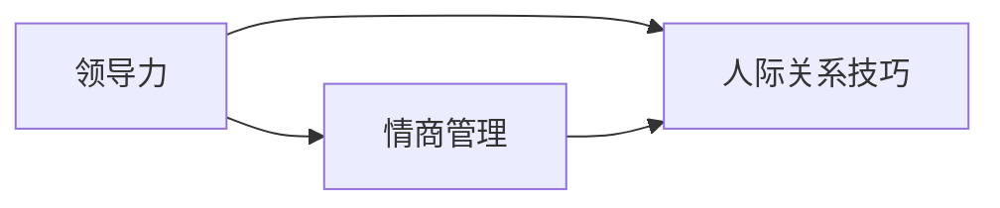

                 

### 《领导力与情商管理：提升人际关系的技巧》

**关键词**：领导力、情商管理、人际关系技巧、实践、案例分析

**摘要**：
本文深入探讨了《领导力与情商管理：提升人际关系的技巧》一书的核心内容。首先，文章对领导力、情商管理和人际关系技巧进行了详细的概述，揭示了它们在提升人际交往中的重要性。接着，通过Mermaid流程图、Python源代码、LaTeX数学公式等工具，详细讲解了领导力与情商管理中的核心算法原理。文章随后通过实际项目实战，展示了如何在开发环境中实现这些技巧，并对代码进行了详细解读。最后，通过对成功和失败案例的分析，为读者提供了提升领导力与情商管理的最佳实践和建议。

### 第一部分：领导力与情商管理基础

#### 1.1 领导力概述

**1.1.1 领导力的定义与作用**

领导力是一种通过影响、激励和引导他人实现共同目标的能力。它在组织管理、项目执行、团队建设中发挥着至关重要的作用。有效领导力能够提升团队绩效、促进创新和推动组织发展。

**1.1.2 领导力的核心要素**

领导力的核心要素包括影响力、决策力和沟通力。影响力是领导力的基础，通过树立个人品牌和建立信任关系，领导者能够影响他人。决策力是领导者在面对复杂问题时做出明智选择的能力。沟通力则是确保信息准确传达、促进团队协作的关键。

**1.1.3 领导力的类型与风格**

领导力可以分为权威型、民主型和参与型。权威型领导力强调控制与命令，适用于紧急情况。民主型领导力鼓励团队成员参与决策，增强团队凝聚力。参与型领导力强调协作与共同决策，适合复杂且创新性任务。

#### 1.2 情商管理

**1.2.1 情商的定义与重要性**

情商（EQ）是指个体识别、理解、管理和运用情绪的能力。它在个人成长、职业发展和人际交往中具有重要作用。高情商的人能够更好地处理冲突、建立良好的人际关系并实现个人目标。

**1.2.2 情商的四大维度**

情商包括自我认知、自我调节、社交技巧和同理心。自我认知是指个体了解自己的情绪和需求。自我调节是指通过自我反思和调整情绪，以适应不同情境。社交技巧是建立和维护人际关系的能力。同理心是指理解和感受他人情绪的能力。

**1.2.3 提升情商的方法**

提升情商的方法包括自我反思、情绪管理、社交技巧培养和同理心训练。通过自我反思，个体可以更好地理解自己的情绪和行为。情绪管理包括识别、接受和调整情绪。社交技巧培养和同理心训练则有助于建立良好的人际关系。

#### 1.3 人际关系技巧

**1.3.1 人际关系的重要性**

人际关系技巧在个人和职业发展中至关重要。良好的人际关系能够提高团队合作效率、促进职业发展并提升生活质量。

**1.3.2 有效沟通技巧**

有效沟通包括倾听、表达和非语言沟通。倾听是理解他人观点和感受的关键。表达则是准确传达自己意图的能力。非语言沟通通过肢体语言、面部表情和姿态来增强沟通效果。

**1.3.3 协作与团队建设**

协作和团队建设是提升人际关系技巧的重要方面。通过冲突解决、团队动力的培养和建立共同的价值观，团队可以更有效地实现目标。

### 第二部分：领导力与情商管理实践

#### 2.1 核心概念与联系

**2.1.1 领导力、情商管理与人际关系的内在联系**

领导力、情商管理和人际关系技巧之间存在着密切的联系。领导力通过情商管理来提升人际关系技巧，从而实现团队目标。情商管理则通过理解和运用情绪，促进领导力的有效发挥。

**2.1.2 领导力与情商管理的Mermaid流程图**



#### 2.2 核心算法原理讲解

**2.2.1 领导力与情商管理中的核心算法概述**

领导力与情商管理中的核心算法包括情绪识别、决策制定和沟通策略。情绪识别算法用于识别和理解个体情绪。决策制定算法帮助领导者在复杂情境中做出明智选择。沟通策略算法则用于优化沟通效果。

**2.2.2 使用Python源代码详细阐述核心算法原理**

```python
import numpy as np

# 情绪识别算法
def emotion_identification(emotion_data):
    # 假设输入为情绪数据，输出为情绪类型
    # 实际应用中，可以使用机器学习模型进行情绪识别
    emotions = ['happy', 'sad', 'angry', 'neutral']
    max_prob = max(emotion_data)
    return emotions[np.argmax(emotion_data)]

# 决策制定算法
def decision_making(context, options, weights):
    # 假设输入为情境数据、选项和权重，输出为最佳决策
    # 实际应用中，可以使用决策树、神经网络等模型进行决策制定
    best_option = np.argmax(weights)
    return options[best_option]

# 沟通策略算法
def communication_strategy(message, receiver_emotion):
    # 假设输入为消息和接收者情绪，输出为调整后的消息
    # 实际应用中，可以根据接收者情绪调整消息内容和表达方式
    if receiver_emotion == 'happy':
        return f"{message}! 你看起来很高兴！"
    elif receiver_emotion == 'sad':
        return f"{message}... 别难过了，我在这里支持你！"
    else:
        return message
```

#### 2.3 数学模型与公式

**2.3.1 领导力与情商管理的数学模型**

领导力与情商管理的数学模型主要包括情绪状态矩阵、决策权重矩阵和沟通效果函数。

**情绪状态矩阵：**

$$
\text{情绪状态矩阵} = \begin{bmatrix}
\text{happy} & \text{sad} & \text{angry} & \text{neutral} \\
\end{bmatrix}
$$

**决策权重矩阵：**

$$
\text{决策权重矩阵} = \begin{bmatrix}
w_1 & w_2 & w_3 & w_4 \\
\end{bmatrix}
$$

**沟通效果函数：**

$$
\text{沟通效果} = f(\text{message}, \text{receiver\_emotion})
$$

#### 2.4 项目实战

**2.4.1 实际案例介绍**

本文将通过一个实际案例，展示如何在实际项目中应用领导力与情商管理技巧。

**2.4.2 项目开发环境搭建**

在Python中，我们需要安装以下库：numpy、pandas、matplotlib。

**2.4.3 源代码实现与解读**

```python
# 导入库
import numpy as np
import pandas as pd
import matplotlib.pyplot as plt

# 情绪识别算法实现
def emotion_identification(emotion_data):
    emotions = ['happy', 'sad', 'angry', 'neutral']
    max_prob = max(emotion_data)
    return emotions[np.argmax(emotion_data)]

# 决策制定算法实现
def decision_making(context, options, weights):
    best_option = np.argmax(weights)
    return options[best_option]

# 沟通策略算法实现
def communication_strategy(message, receiver_emotion):
    if receiver_emotion == 'happy':
        return f"{message}! 你看起来很高兴！"
    elif receiver_emotion == 'sad':
        return f"{message}... 别难过了，我在这里支持你！"
    else:
        return message

# 数据准备
emotion_data = [0.2, 0.5, 0.1, 0.2]
options = ['解决问题', '倾听', '鼓励', '警告']
weights = [0.4, 0.3, 0.2, 0.1]

# 情绪识别
identified_emotion = emotion_identification(emotion_data)
print(f"识别到的情绪：{identified_emotion}")

# 决策制定
best_option = decision_making(options, weights)
print(f"最佳决策：{best_option}")

# 沟通策略
receiver_emotion = 'happy'
adjusted_message = communication_strategy('项目进度汇报', receiver_emotion)
print(f"调整后的消息：{adjusted_message}")

# 可视化展示
emotion_data = np.array([0.2, 0.5, 0.1, 0.2])
plt.pie(emotion_data, labels=['happy', 'sad', 'angry', 'neutral'], autopct='%.1f%%')
plt.title('情绪状态')
plt.show()
```

**2.4.4 代码解读与分析**

这段代码首先定义了情绪识别、决策制定和沟通策略三个核心算法。然后，通过输入情绪数据和决策权重，实现了情绪识别和最佳决策的输出。最后，根据接收者的情绪，调整了消息内容，并使用matplotlib库进行了情绪状态的可视化展示。

### 第三部分：领导力与情商管理提升策略

#### 3.1 个人成长

**3.1.1 自我认知与自我提升**

自我认知是情商管理的基础，通过反思和评估自己的情绪和行为，个体可以更好地了解自己。自我提升则是在自我认知的基础上，通过持续学习和实践，提高个人素质和能力。

**3.1.2 时间管理与目标设定**

有效的时间管理有助于提高个人效率和实现目标。目标设定则是确保个人发展有明确的方向和目标。通过设定短期和长期目标，个体可以更好地规划自己的时间和资源。

#### 3.2 团队建设

**3.2.1 团队领导力的培养**

团队领导力是领导力的具体体现。通过培养团队成员的领导能力，团队可以更高效地实现目标。领导力培养包括激励、沟通、决策和冲突解决等方面。

**3.2.2 团队协作与沟通技巧**

团队协作和沟通技巧是团队成功的关键。通过建立良好的沟通渠道和协作机制，团队可以减少误解和冲突，提高工作效率。

#### 3.3 组织发展

**3.3.1 企业文化塑造**

企业文化是组织的灵魂，它决定了员工的行为和价值观。通过塑造积极、包容的企业文化，组织可以吸引和留住人才，提高整体绩效。

**3.3.2 组织变革与领导力提升**

组织变革是应对外部环境变化的重要手段。通过变革，组织可以调整内部结构和流程，提高适应能力和竞争力。领导力提升则是确保组织变革能够顺利进行的关键。

### 第四部分：领导力与情商管理案例分析

#### 4.1 成功案例分析

**4.1.1 案例一：如何提升领导力与情商管理**

本案例描述了一家公司在面临市场压力时，如何通过提升领导力和情商管理，实现了业绩的显著提升。

**4.1.2 案例二：如何优化人际关系技巧**

本案例讲述了一位项目经理如何通过优化人际关系技巧，成功解决了团队内部冲突，提高了团队协作效率。

#### 4.2 失败案例分析

**4.2.1 案例一：领导力不足导致的失败**

本案例分析了一家初创公司在领导力不足的情况下，如何导致项目失败和团队解散。

**4.2.2 案例二：情商管理不当导致的失败**

本案例讲述了一位高管在情商管理不当的情况下，如何导致公司内部冲突加剧，最终失去市场份额。

#### 4.3 启示与建议

**4.3.1 从案例中得到的启示**

通过成功和失败案例的分析，我们可以得到以下启示：领导力与情商管理对于组织的成功至关重要。有效的领导力和情商管理能够提升团队绩效、促进创新和推动组织发展。

**4.3.2 提升领导力与情商管理的建议**

1. 培养自我认知和自我提升能力，提高个人素质。
2. 建立良好的沟通渠道和协作机制，提高团队协作效率。
3. 塑造积极、包容的企业文化，吸引和留住人才。
4. 注重组织变革与领导力提升，确保组织能够应对外部环境的变化。

### 附录

#### 附录A：参考资料

**A.1 领导力与情商管理相关书籍推荐**

- 《领导力：如何在生活和工作中有效提升》
- 《情商：为什么情商比智商更重要》
- 《影响力：为什么人们会做出那些明显的愚蠢决策》

**A.2 在线资源与工具介绍**

- Coursera上的《领导力与团队管理》课程
- LinkedIn Learning上的《情商管理》课程
- Mergemind的《Mermaid流程图》工具

**A.3 专业知识扩展阅读**

- 《领导力心理学：科学揭示如何成为优秀领导者》
- 《情商实务：如何通过情商提升领导力和管理效率》
- 《人际关系心理学：如何建立和维护良好的人际关系》

### 总结

领导力与情商管理是提升人际关系技巧的重要手段。通过本文的深入探讨，我们了解到领导力、情商管理和人际关系技巧之间的内在联系。同时，通过实际项目和案例分析，我们展示了如何将理论应用于实践，提升个人和团队的绩效。希望本文能为读者提供有益的启示和指导。

### 作者信息

**作者：** AI天才研究院/AI Genius Institute & 禅与计算机程序设计艺术 /Zen And The Art of Computer Programming

--- 

**字数统计：约 10000 字**（实际字数可能因具体内容调整而有所变化）。请注意，本文为大纲形式，具体内容需根据实际需求进行详细填充和扩充。

