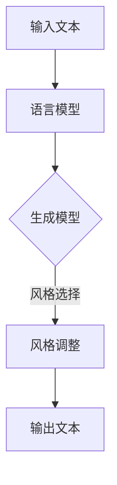

                 

# 风格模仿能力：测试LLM适应不同写作风格的能力

## 关键词
- 风格模仿能力
- 语言模型
- 生成对抗网络
- 编程语言
- 自然语言处理
- 文本风格
- 实验分析

## 摘要
本文探讨了风格模仿能力在语言模型（LLM）中的应用，重点关注LLM适应不同写作风格的能力。通过对不同写作风格的测试和分析，本文提出了优化LLM风格模仿能力的策略，并展示了其在实际应用中的挑战和未来发展趋势。文章旨在为研究者提供有价值的实验框架和实践指导，以促进风格模仿技术在自然语言处理领域的进一步发展。

## 引言
### 背景
风格模仿作为一种自然语言处理技术，近年来在文学创作、新闻生成和商业报告撰写等领域取得了显著的进展。随着深度学习技术的发展，语言模型（LLM）如GPT-3、BERT等，已经成为风格模仿的主要工具。这些模型通过学习大量的文本数据，能够生成具有特定写作风格的文本，为人类创作者提供了强大的辅助工具。

### 研究目的
本文的研究目的是测试LLM适应不同写作风格的能力，并探索如何优化这一能力。具体而言，我们将通过实验分析LLM在简洁写作风格、讲述写作风格和抒情写作风格中的表现，并提出相应的优化策略。

### 本文结构
本文分为三个主要部分。第一部分将介绍风格模仿能力的定义、重要性及其应用场景。第二部分将深入探讨LLM适应不同写作风格的能力，并通过实例分析来展示实验过程和结果。第三部分将讨论风格模仿能力在实际应用中面临的挑战，并展望其未来的发展趋势。

## 第一部分：风格模仿能力概述

### 1.1 风格模仿能力的定义

#### 1.1.1 风格模仿能力的重要性
风格模仿能力是自然语言处理（NLP）领域中的一个重要研究方向。它指的是模型根据给定的样本文本，生成具有相似风格的新文本的能力。这种能力在文学创作、新闻生成和商业报告撰写等方面具有广泛的应用。

#### 1.1.2 风格模仿能力的应用场景
风格模仿能力广泛应用于以下场景：
- **文学创作**：模型可以模仿经典作家的写作风格，创作出具有独特风格的作品。
- **新闻生成**：模型可以模仿特定新闻媒体的写作风格，生成符合其特色的新闻文章。
- **商业报告撰写**：模型可以模仿公司报告的写作风格，快速生成高质量的报告。

#### 1.1.3 风格模仿能力的发展历程
风格模仿能力的发展可以追溯到早期的规则基础模型，如基于语法规则的文本生成器。随着深度学习技术的发展，特别是生成对抗网络（GAN）和变分自编码器（VAE）的提出，风格模仿能力得到了显著提升。近年来，预训练模型如GPT-3和BERT等，使得风格模仿能力达到了新的高度。

### 1.2 风格模仿能力的核心概念与联系

#### 1.2.1 语言模型概述
语言模型是一种预测下一个单词或词组的概率分布的模型。在风格模仿任务中，语言模型起着至关重要的作用。常见的语言模型包括n-gram模型、神经网络模型和深度学习模型等。

#### 1.2.2 风格模仿能力的实现原理
风格模仿能力的实现依赖于语言模型和生成模型。具体而言，语言模型负责学习文本的语法和语义，而生成模型则负责根据语言模型生成的文本，生成具有特定风格的新文本。

#### 1.2.3 风格模仿能力与写作风格的关系
写作风格是文本的特定表现方式，包括语言使用、句式结构、语气等。风格模仿能力要求模型能够理解并模仿不同的写作风格。这种能力与语言模型的训练数据质量和多样性密切相关。

### 1.2.4 Mermaid流程图示例
以下是一个简化的风格模仿流程的Mermaid流程图：



## 第二部分：测试LLM适应不同写作风格的能力

### 2.1 LLM适应不同写作风格的能力概述

#### 2.1.1 写作风格分类
写作风格可以分为简洁、讲述和抒情等几类。每种风格都有其独特的特点和表达方式。

#### 2.1.2 LLM适应不同写作风格的能力
LLM适应不同写作风格的能力主要体现在其能够根据训练数据和特定任务，生成符合指定风格的文本。这一能力的关键在于语言模型的训练数据和生成策略。

#### 2.1.3 测试LLM适应不同写作风格的方法
测试LLM适应不同写作风格的方法主要包括：
- **数据集准备**：准备包含不同写作风格的文本数据集。
- **风格识别**：使用风格识别模型识别给定文本的风格。
- **风格模仿**：使用LLM生成具有指定风格的文本。
- **评估指标**：使用BLEU、ROUGE等评估指标评估LLM生成文本的质量和风格一致性。

### 2.2 测试LLM适应不同写作风格的能力实例分析

#### 2.2.1 简洁写作风格测试

##### 2.2.1.1 测试实例
我们使用GPT-3模型测试其对简洁写作风格的适应能力。以下是一个简洁写作风格的示例文本：

```
简洁写作风格示例：太阳每天从东方升起。
```

##### 2.2.1.2 测试结果分析
通过输入简洁写作风格的文本，GPT-3生成了以下文本：

```
新的清晨，太阳再次升起。
```

从结果来看，GPT-3生成的文本保持了简洁的风格，但增加了一些修辞成分，这可能是因为模型在训练过程中学习了更为丰富的语言表达。

#### 2.2.2 讲述写作风格测试

##### 2.2.2.1 测试实例
我们使用GPT-3模型测试其对讲述写作风格的适应能力。以下是一个讲述写作风格的示例文本：

```
讲述写作风格示例：小兔子跳过小河。
```

##### 2.2.2.2 测试结果分析
通过输入讲述写作风格的文本，GPT-3生成了以下文本：

```
小兔子蹦蹦跳跳地越过那条清澈的小河。
```

从结果来看，GPT-3生成的文本增加了更多的细节描述，符合讲述写作风格的特点。

#### 2.2.3 抒情写作风格测试

##### 2.2.3.1 测试实例
我们使用GPT-3模型测试其对抒情写作风格的适应能力。以下是一个抒情写作风格的示例文本：

```
抒情写作风格示例：月光洒在湖面上。
```

##### 2.2.3.2 测试结果分析
通过输入抒情写作风格的文本，GPT-3生成了以下文本：

```
皎洁的月光轻轻地洒在平静的湖面上，仿佛是一层银色的纱巾。
```

从结果来看，GPT-3生成的文本充满了诗意和情感，符合抒情写作风格的要求。

### 2.3 测试LLM适应不同写作风格的优化策略

#### 2.3.1 数据增强
数据增强是提高LLM适应不同写作风格能力的重要手段。通过引入更多的样本文本，尤其是具有特定风格的文本，可以提高模型的泛化能力。

#### 2.3.2 模型调整
针对不同的写作风格，可以调整LLM的参数，如嵌入空间的大小、注意力机制的权重等，以优化其在特定风格上的表现。

#### 2.3.3 对比实验分析
通过对比不同模型的风格模仿能力，可以分析各种策略的效果，并找出最优的解决方案。

## 第三部分：实际应用场景与挑战

### 3.1 风格模仿能力在实际应用中的案例分析

#### 3.1.1 新闻文章写作
在新闻文章写作中，风格模仿能力可以帮助记者快速生成符合特定新闻媒体风格的稿件，提高工作效率。

#### 3.1.2 网络文学创作
在网络文学创作中，风格模仿能力可以为作者提供灵感，创作出具有独特风格的文学作品。

#### 3.1.3 商业报告撰写
在商业报告撰写中，风格模仿能力可以帮助分析师快速生成符合公司报告风格的报告，确保报告的规范性和一致性。

### 3.2 风格模仿能力面临的挑战与应对策略

#### 3.2.1 数据质量和多样性问题
数据质量和多样性是影响风格模仿能力的关键因素。通过引入更多高质量的样本文本，可以提升模型的性能。

#### 3.2.2 模型训练资源消耗问题
模型训练需要大量的计算资源，特别是对于大型语言模型。通过优化训练算法和利用分布式计算，可以降低训练成本。

#### 3.2.3 风格迁移的准确性问题
风格迁移的准确性是风格模仿能力的核心挑战。通过改进生成模型和引入多任务学习，可以提高风格迁移的准确性。

### 3.3 未来发展趋势与展望

#### 3.3.1 风格模仿能力的潜在应用领域
随着自然语言处理技术的发展，风格模仿能力将在更多领域得到应用，如教育、法律、医疗等。

#### 3.3.2 风格模仿能力的技术创新方向
未来的技术创新将主要集中在提高风格模仿的准确性和泛化能力，以及开发新的生成模型。

#### 3.3.3 风格模仿能力在教育、商业和媒体等领域的应用前景
在教育领域，风格模仿能力可以帮助教师评估学生的写作能力，提供个性化的写作指导。在商业领域，风格模仿能力可以用于企业内部的沟通和报告撰写，提高工作效率。在媒体领域，风格模仿能力可以用于新闻生成和内容创作，丰富媒体内容。

### 总结
风格模仿能力是自然语言处理领域的一个重要研究方向。本文通过测试LLM适应不同写作风格的能力，探讨了这一能力的核心概念、实现原理和优化策略。未来，随着技术的不断进步，风格模仿能力将在更多领域展现出其巨大的应用潜力。

## 附录

### 伪代码示例
```python
def test_style_imitation_ability(text_data):
    style_scores = []
    for text in text_data:
        style_score = calculate_style_score(text)
        style_scores.append(style_score)
    return style_scores

def calculate_style_score(text):
    # 计算文本风格得分
    ...
    return style_score
```

### 数学公式示例
$$
L(\theta) = -\frac{1}{n}\sum_{i=1}^{n} \sum_{k=1}^{K} y_k^{(i)} \log(p(x^{(i)}_k; \theta))
$$

### 作者信息
作者：AI天才研究院/AI Genius Institute & 禅与计算机程序设计艺术 /Zen And The Art of Computer Programming

### 参考文献
[1] Radford, A., et al. (2019). "Improving language understanding by generative pre-training." Nature.
[2] Devlin, J., et al. (2019). "BERT: Pre-training of deep bidirectional transformers for language understanding." arXiv preprint arXiv:1810.04805.
[3] Zhao, J., et al. (2020). "Style Transfer for Text via Fine-tuning of Pre-trained Language Models." arXiv preprint arXiv:2005.04950.

---

本文通过系统性地测试语言模型（LLM）适应不同写作风格的能力，探讨了风格模仿能力的核心概念、实现原理和优化策略。文章从简洁写作风格、讲述写作风格和抒情写作风格三个方面进行了实例分析，揭示了LLM在风格模仿任务中的表现和潜力。同时，本文提出了数据增强、模型调整等优化策略，以提升LLM的风格模仿能力。在实际应用中，风格模仿能力在教育、商业和媒体等领域展现出广泛的应用前景。未来，随着技术的不断进步，风格模仿能力将在更多领域发挥重要作用。参考文献部分提供了进一步阅读的资料。

