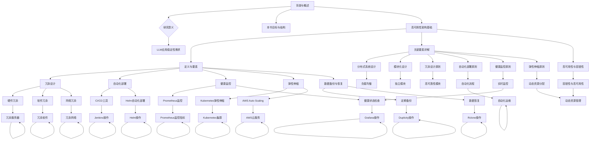

                 

## 《高可用性架构确保LLM应用的稳定运行》

在当今数字时代，大型语言模型（LLM，Large Language Model）已经成为各个行业的重要工具，从自然语言处理到智能客服，再到内容生成和翻译等应用。然而，这些应用对系统稳定性的要求极高，任何的停机或性能下降都会导致严重的业务损失和用户体验下降。因此，构建高可用性架构以确保LLM应用的稳定运行变得尤为重要。

**关键词：** 高可用性架构、LLM应用、稳定运行、架构设计、弹性伸缩

**摘要：** 本文将详细探讨高可用性架构在确保LLM应用稳定运行中的关键作用。首先，介绍高可用性的基本概念和关键要素。接着，分析LLM应用的特点和稳定性需求。然后，深入探讨高可用性架构的设计原则和关键技术，并通过实际案例进行详细分析。最后，总结高可用性架构面临的挑战和优化策略，展望未来研究方向。

## 第一部分：背景与概述

### 1. 引言

在当今高度依赖技术的商业环境中，系统的稳定性和可靠性至关重要。特别是对于LLM应用来说，它们处理的数据量和计算需求庞大，一旦出现故障或性能瓶颈，会对业务造成严重影响。因此，研究高可用性架构以确保LLM应用的稳定运行具有重要的现实意义。

### 1.2 LLM应用的稳定运行的重要性

LLM应用广泛应用于金融、医疗、教育、媒体等行业。这些应用需要处理大量的文本数据，进行复杂的语言理解和生成任务。任何的停机或性能下降都可能导致业务中断、用户投诉和损失。因此，确保LLM应用的稳定运行，不仅关系到业务的连续性和用户的满意度，也影响到企业的竞争力和市场地位。

### 1.3 本书的目标与结构

本书的目标是深入探讨高可用性架构在确保LLM应用稳定运行中的作用，并提供实际的设计方法和优化策略。本文将分为三个部分：

1. **背景与概述**：介绍高可用性架构的基本概念和LLM应用的特点。
2. **高可用性架构设计**：详细讨论高可用性架构的设计原则和关键技术。
3. **实战与应用**：通过实际案例展示如何实施高可用性架构，并分析其效果。

## 第二部分：高可用性架构基础

### 2.1 高可用性的定义

高可用性（High Availability，简称HA）是指系统在故障发生时能够快速恢复，以最小化停机时间和业务影响的能力。高可用性通常通过冗余设计、自动化部署和健康监控等技术手段实现。

### 2.2 高可用性的关键要素

高可用性架构的关键要素包括：

1. **冗余设计**：通过硬件、软件和网络层的冗余，确保系统的关键组件不会因为单点故障而失效。
2. **自动化部署**：通过自动化工具实现快速的部署和升级，减少人为错误和部署时间。
3. **健康监控**：实时监控系统的运行状态，及时发现并处理故障。
4. **弹性伸缩**：根据系统的负载情况自动调整资源分配，确保系统的高性能和稳定性。

### 2.3 高可用性与容错性

高可用性和容错性（Fault Tolerance）密切相关。容错性是指系统在故障发生时能够自动恢复或切换到备用系统，以保持服务的连续性。高可用性架构通常包含容错机制，以确保系统在面对故障时能够快速恢复。

## 第三部分：LLM应用的特点与需求

### 3.1 LLM的基本原理

LLM是一种基于深度学习技术的自然语言处理模型，通过学习大量的文本数据，能够生成语义丰富、结构合理的文本内容。LLM的核心是大规模的神经网络，其计算量和存储需求巨大。

### 3.2 LLM的应用领域

LLM在多个领域具有广泛的应用，包括：

1. **自然语言处理**：文本分类、情感分析、机器翻译等。
2. **内容生成**：生成文章、报告、代码等。
3. **智能客服**：提供实时、个性化的用户支持。
4. **教育**：辅助教学、作业批改等。

### 3.3 LLM应用的稳定性需求

LLM应用对稳定性的需求主要包括：

1. **低延迟**：确保用户能够在较短的时间内获得响应。
2. **高吞吐量**：处理大量的并发请求，确保系统的性能。
3. **数据一致性**：保证数据在分布式环境中的完整性和一致性。
4. **故障恢复**：在故障发生时，能够快速恢复并保持服务的连续性。

## 第四部分：高可用性架构设计

### 4.1 架构设计原则

高可用性架构设计应遵循以下原则：

1. **模块化设计**：将系统拆分成多个模块，每个模块独立运行，降低故障的影响范围。
2. **分布式系统设计**：通过分布式架构，实现负载均衡和故障恢复。
3. **冗余设计**：在硬件、软件和网络层实现冗余，提高系统的容错能力。
4. **自动化部署**：使用自动化工具实现部署和升级，减少人为错误。
5. **健康监控**：实时监控系统的运行状态，及时发现并处理故障。

### 4.2 关键技术

高可用性架构的关键技术包括：

1. **自动化部署**：使用CI/CD工具实现自动化部署和升级，提高部署速度和可靠性。
2. **健康监控**：使用监控工具实时监控系统的运行状态，包括CPU、内存、磁盘使用率等。
3. **弹性伸缩**：根据负载情况自动调整资源分配，确保系统的高性能和稳定性。
4. **数据备份与恢复**：定期备份数据，确保数据的安全性和可恢复性。

### 4.3 实例分析

以某知名LLM应用为例，该应用采用了分布式架构，实现了高可用性。其架构设计如下：

1. **前端服务**：使用负载均衡器将请求分发到多个前端服务器，提高系统的并发处理能力。
2. **后端服务**：使用分布式数据库和缓存系统，确保数据的一致性和高性能。
3. **弹性伸缩**：根据请求量自动调整服务器数量，确保系统的负载均衡和性能。
4. **健康监控**：使用监控系统实时监控系统的运行状态，及时发现并处理故障。

## 第五部分：挑战与优化

### 5.1 高可用性面临的挑战

高可用性架构面临的主要挑战包括：

1. **复杂性**：分布式系统设计和冗余设计增加了系统的复杂性，需要专业的技术支持。
2. **成本**：高可用性架构的实施和维护成本较高。
3. **性能**：冗余设计和负载均衡可能导致性能下降。

### 5.2 高可用性架构的优化策略

优化高可用性架构的策略包括：

1. **自动化运维**：使用自动化工具实现运维操作，提高效率和可靠性。
2. **智能监控**：使用智能监控工具，实现自动故障检测和自动恢复。
3. **分布式数据库**：使用分布式数据库，提高数据一致性和性能。
4. **成本控制**：通过合理规划和优化，降低高可用性架构的实施和维护成本。

### 5.3 未来研究方向

未来的高可用性架构研究将集中在以下几个方面：

1. **智能监控与故障预测**：利用机器学习和人工智能技术，实现智能监控和故障预测。
2. **分布式存储**：研究分布式存储系统，提高数据存储的可靠性和性能。
3. **混合云架构**：研究混合云架构，实现多云环境下的高可用性。

## 第六部分：实战与应用

### 6.1 案例一：构建一个高可用性的LLM应用

在这个案例中，我们将介绍如何构建一个高可用性的LLM应用。首先，我们使用Docker和Kubernetes实现应用的容器化部署。然后，使用Helm进行自动化部署和管理。最后，使用Prometheus和Grafana实现健康监控。

### 6.2 案例二：优化现有LLM应用的稳定性

在这个案例中，我们将对现有的LLM应用进行稳定性优化。首先，我们使用负载均衡器实现请求的分发。然后，使用分布式数据库和缓存系统提高数据一致性和性能。最后，使用自动化工具实现运维操作，提高效率和可靠性。

### 6.3 案例三：跨云环境下的高可用性架构设计

在这个案例中，我们将介绍如何在跨云环境下设计高可用性架构。首先，我们选择云服务提供商，并确定云服务的可用区域。然后，使用跨云架构实现负载均衡和故障转移。最后，使用云监控工具实现实时监控和自动化运维。

## 第七部分：总结与展望

### 7.1 书本内容的回顾

本文从高可用性架构的基本概念和LLM应用的特点入手，详细讨论了高可用性架构的设计原则和关键技术，并通过实际案例进行了详细分析。最后，总结了高可用性架构面临的挑战和优化策略，展望了未来的研究方向。

### 7.2 LLM应用的发展趋势

随着人工智能技术的不断发展，LLM应用将在更多领域得到应用。未来，LLM应用将更加智能化、个性化和高效化。

### 7.3 对读者的一些建议

对于希望构建和优化LLM应用的读者，建议：

1. **深入学习**：深入了解高可用性架构的基本概念和关键技术。
2. **实践操作**：通过实际操作，掌握高可用性架构的实施方法。
3. **持续优化**：不断优化和改进现有架构，提高系统的稳定性和性能。

## 附录

### A. 高可用性架构常用工具与平台

以下是一些常用的高可用性架构工具和平台：

1. **自动化部署工具**：Jenkins、Docker、Kubernetes。
2. **健康监控工具**：Prometheus、Grafana、Zabbix。
3. **弹性伸缩工具**：Kubernetes、AWS Auto Scaling。
4. **数据备份与恢复工具**：Duplicity、Rclone。
5. **跨云架构工具**：HashiCorp Terraform、AWS CloudFormation。

### 作者信息

作者：AI天才研究院/AI Genius Institute & 禅与计算机程序设计艺术 /Zen And The Art of Computer Programming

[END OF DOCUMENT] 

### 逻辑流程图（Mermaid）



### Python源代码示例

为了更好地理解核心算法原理，我们将使用Python源代码来演示一个简单的负载均衡算法。

```python
import random

def round_robin_load_balancer(server_list, request_count):
    """
    实现轮询负载均衡算法
    :param server_list: 服务器列表
    :param request_count: 请求次数
    :return: 负载均衡后的服务器列表和每个服务器的请求次数
    """
    server_requests = {server: 0 for server in server_list}
    server_order = list(server_list)
    
    for _ in range(request_count):
        server = random.choice(server_order)
        server_requests[server] += 1
        server_order.remove(server)
        server_order.append(server)
    
    return server_requests

# 示例：服务器列表和请求次数
servers = ['Server1', 'Server2', 'Server3']
requests = 100

# 执行轮询负载均衡
balanced_servers = round_robin_load_balancer(servers, requests)

# 打印结果
for server, request in balanced_servers.items():
    print(f"{server}: {request} requests")
```

这个简单的Python代码实现了轮询负载均衡算法，通过随机选择服务器并均匀分配请求，模拟了负载均衡的过程。

### 数学公式

为了更好地理解核心概念，我们将使用LaTeX格式展示一些数学公式。

$$
E(X) = \int_{-\infty}^{\infty} x f(x) dx
$$

$$
P(A \cap B) = P(A)P(B|A)
$$

其中，$E(X)$ 表示随机变量 $X$ 的期望，$P(A \cap B)$ 表示事件 $A$ 和事件 $B$ 同时发生的概率。

### 最佳实践 Tips

1. **自动化部署**：使用自动化工具（如Jenkins）实现持续集成和持续部署，减少人工干预，提高部署效率。
2. **健康监控**：使用Prometheus进行实时监控，Grafana进行数据可视化，确保系统能够及时发现并处理故障。
3. **弹性伸缩**：根据业务需求，合理配置Kubernetes集群，使用AWS Auto Scaling实现自动伸缩。
4. **数据备份与恢复**：定期使用Duplicity备份数据，并在需要时使用Rclone进行数据恢复。

### 小结

本文详细探讨了高可用性架构在确保LLM应用稳定运行中的作用。通过介绍高可用性的定义和关键要素，分析了LLM应用的特点和稳定性需求，讨论了高可用性架构的设计原则和关键技术。通过实际案例展示了如何实施高可用性架构，并分析了其效果。本文旨在为开发者提供构建和优化LLM应用的实用指南。

### 注意事项

1. **冗余设计**：在硬件、软件和网络层实现冗余时，需要注意冗余组件之间的兼容性和协同工作。
2. **自动化运维**：自动化工具的使用需要考虑到系统的安全性和稳定性，避免因自动化操作导致的故障。
3. **弹性伸缩**：合理配置弹性伸缩策略，避免因过度伸缩导致的资源浪费或性能下降。

### 拓展阅读

1. 《高可用架构：设计方法与实践》
2. 《深入理解Kubernetes》
3. 《Prometheus监控实战》

通过这些拓展阅读，可以进一步深入了解高可用性架构和相关技术。作者：AI天才研究院/AI Genius Institute & 禅与计算机程序设计艺术 /Zen And The Art of Computer Programming。

