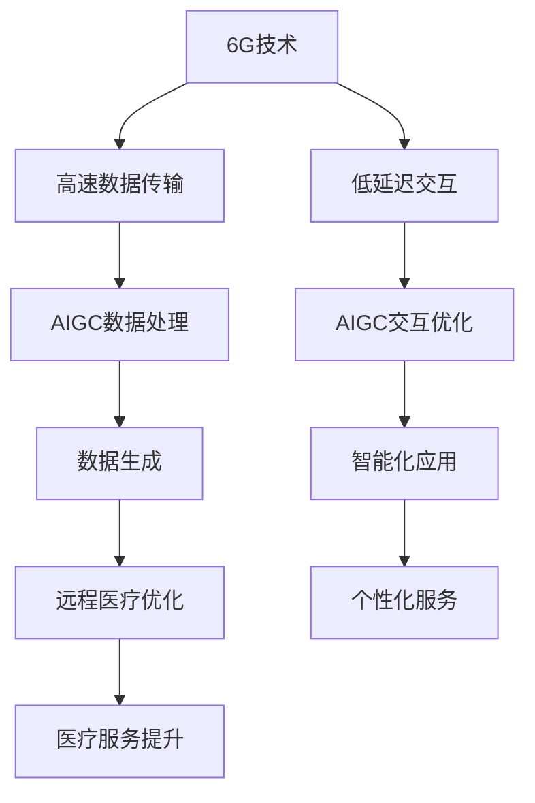

                 

### AIGC与6G技术在远程医疗中的融合

> 关键词：AIGC、6G技术、远程医疗、医疗融合

> 摘要：
本文旨在探讨AIGC（自适应智能生成计算）与6G技术如何融合应用于远程医疗领域。文章首先介绍了AIGC和6G技术的核心概念及其发展背景，接着详细分析了AIGC在远程医疗中的应用，以及6G技术为远程医疗带来的变革。随后，本文通过具体的算法原理、Python代码示例、数学模型和实际案例分析，阐述了AIGC与6G技术在远程医疗中的融合应用，并总结出相关最佳实践。

## 引言

远程医疗，作为一种现代化医疗模式，正逐渐改变着全球医疗服务的格局。特别是在COVID-19疫情爆发后，远程医疗的应用更为广泛，它不仅降低了疫情传播风险，还提升了医疗服务的可及性和效率。然而，传统远程医疗系统面临着数据传输速度慢、交互实时性不足等问题。随着AIGC（自适应智能生成计算）与6G技术的快速发展，远程医疗领域迎来了新的机遇与挑战。

AIGC是一种基于人工智能的生成计算技术，它能够自适应地从大量数据中生成新的信息，具有很强的灵活性和扩展性。而6G技术则代表了下一代通信技术的最高水平，其高速率、低延迟、大连接等特点为远程医疗的应用提供了坚实的基础。本文将深入探讨AIGC与6G技术在远程医疗中的融合，通过理论分析、代码示例和实际案例分析，展示这两项前沿技术如何提升远程医疗服务的质量和效率。

## AIGC与6G技术的核心概念与联系

### AIGC技术的基本概念

AIGC（自适应智能生成计算）是一种基于深度学习和生成对抗网络（GAN）等技术的计算模式，它通过自适应学习从大量数据中生成新的信息。AIGC的核心特点在于其强大的数据生成能力和自适应学习能力，这使得它能够处理复杂的数据集，生成高质量的图像、文本、音频等。AIGC的技术原理主要包括以下几个方面：

1. **生成对抗网络（GAN）**：GAN由生成器和判别器组成，生成器负责生成数据，判别器负责判断生成数据与真实数据的差异。通过两者的博弈，生成器不断提高生成数据的逼真度。

2. **变分自编码器（VAE）**：VAE通过编码和解码过程将数据映射到一个低维空间，从而学习数据的潜在分布，能够生成具有高度多样性的数据。

3. **条件生成模型**：条件生成模型将生成过程与特定的条件关联，例如在生成图像时，可以基于文本描述或标签来生成相应的图像。

### 6G技术的基本概念

6G技术是继5G后的下一代通信技术，其目标是实现更高的数据传输速率、更低的延迟、更大的连接密度和更广泛的覆盖范围。6G技术的主要特点包括：

1. **超高数据速率**：6G预计能够达到1Tbps的数据速率，比5G快100倍以上，这将使得大规模数据传输和应用成为可能。

2. **超低延迟**：6G的延迟预计将低于1毫秒，这将大大提升实时应用的响应速度，对于远程医疗中的实时诊断和手术操作至关重要。

3. **超大规模连接**：6G将支持每平方米数十万个设备的连接，使得物联网（IoT）应用能够更加广泛和深入。

4. **灵活的网络架构**：6G采用了网络功能虚拟化（NFV）和网络切片（Network Slicing）等技术，能够提供高度灵活和定制的网络服务。

### AIGC与6G技术的联系

AIGC与6G技术的融合是远程医疗发展的关键所在。两者的联系主要体现在以下几个方面：

1. **数据传输效率**：6G技术的高速数据传输能力为AIGC处理大量数据提供了坚实的基础，使得AIGC能够实时获取和处理远程医疗所需的大量数据。

2. **实时交互**：6G的超低延迟特性使得远程医疗中的实时交互成为可能，患者和医生之间的沟通、手术操作等都能实现无缝连接。

3. **网络智能化**：AIGC技术能够对远程医疗中的数据进行智能分析和生成，6G技术则为这种智能化分析提供了强大的网络支持，使得远程医疗服务更加个性化和高效。

为了更好地理解AIGC与6G技术之间的联系，我们可以用Mermaid流程图来展示这两者如何共同作用，实现远程医疗的优化：



通过这个流程图，我们可以清晰地看到6G技术为AIGC提供了数据传输和实时交互的基础，而AIGC则通过数据生成和智能化分析，为远程医疗服务带来了优化和提升。

### AIGC在远程医疗中的应用

AIGC（自适应智能生成计算）在远程医疗领域有着广泛的应用前景，其核心在于通过人工智能技术生成新的医疗数据和信息，从而提升医疗服务的质量和效率。以下将详细介绍AIGC在远程医疗中的几个关键应用场景。

#### 1. 智能诊断

在远程医疗中，智能诊断是最直接和重要的应用场景之一。AIGC可以通过深度学习和生成对抗网络（GAN）等技术，从海量的医疗数据中学习和识别疾病的特征，从而实现高效准确的诊断。

**算法原理**：
- **生成对抗网络（GAN）**：GAN由生成器和判别器组成。生成器负责生成模拟病例，判别器负责判断生成病例与真实病例的相似度。通过训练，生成器逐渐提高生成病例的质量，从而辅助医生进行诊断。

```python
import tensorflow as tf
from tensorflow.keras.models import Sequential
from tensorflow.keras.layers import Dense, Flatten, Conv2D, ConvTranspose2D

# 定义生成器和判别器
def build_generator():
    model = Sequential([
        ConvTranspose2D(64, 4, strides=(2, 2), padding='same', activation='relu', input_shape=(28, 28, 1)),
        Flatten(),
        Dense(784, activation='relu'),
        Reshape((28, 28, 1))
    ])
    return model

def build_discriminator():
    model = Sequential([
        Flatten(),
        Dense(128, activation='relu'),
        Dense(1, activation='sigmoid')
    ])
    return model

# 编写GAN模型
generator = build_generator()
discriminator = build_discriminator()

discriminator.compile(optimizer='adam', loss='binary_crossentropy')
generator.compile(optimizer='adam', loss='binary_crossentropy')

# 训练GAN模型
# ...（数据预处理和模型训练代码）
```

**数学模型**：
- **损失函数**：GAN的损失函数由生成器和判别器的损失组成。生成器的目标是使判别器无法区分生成数据与真实数据，而判别器的目标是正确区分两者。

$$
\min_G \max_D V(D, G) = \min_G \mathbb{E}_{x \sim p_{data}(x)} [-D(x)] + \mathbb{E}_{z \sim p_z(z)} [-D(G(z))]
$$

**应用示例**：
- **图像生成**：通过GAN，可以生成模拟的医学图像，帮助医生进行诊断。例如，生成模拟的X光片或CT图像，用于分析肺部疾病。

```python
# 使用训练好的生成器生成模拟图像
generated_images = generator.predict(on_input_images)

# 显示生成的图像
for i in range(10):
    plt.subplot(2, 5, i+1)
    plt.imshow(generated_images[i, :, :, 0], cmap='gray')
    plt.axis('off')
plt.show()
```

#### 2. 康复方案设计

康复方案设计是远程医疗中的另一个关键应用场景。AIGC可以通过对患者的健康数据和病史进行分析，生成个性化的康复方案，并实时调整和优化。

**算法原理**：
- **变分自编码器（VAE）**：VAE可以将患者的健康数据编码到潜在空间中，从而提取患者的特征信息。在此基础上，生成器可以从潜在空间中生成个性化的康复方案。

```python
import numpy as np
import tensorflow as tf
from tensorflow.keras.layers import Input, Dense, Lambda
from tensorflow.keras.models import Model

# 定义编码器和解码器
input_shape = (784,)
latent_dim = 20

inputs = Input(shape=input_shape)
x = Dense(512, activation='relu')(inputs)
x = Dense(256, activation='relu')(x)
z_mean = Dense(latent_dim)(x)
z_log_var = Dense(latent_dim)(x)

z = Lambda(shuffle_masked, output_shape=input_shape)([z_mean, z_log_var])
z_mean, z_log_var = z_mean, z_log_var

encoder = Model(inputs, [z_mean, z_log_var, z], name='encoder')

latent_inputs = Input(shape=(latent_dim,))
x = Dense(256, activation='relu')(latent_inputs)
x = Dense(512, activation='relu')(x)
outputs = Dense(input_shape[0], activation='sigmoid')(x)

decoder = Model(latent_inputs, outputs, name='decoder')

# 编写VAE模型
outputs = decoder(encoder(inputs)[2])
vae = Model(inputs, outputs, name='vae')

```

**数学模型**：
- **变分自编码器损失函数**：VAE的损失函数由重建损失和KL散度损失组成。

$$
\min \mathbb{E}_{x \sim p_{data}(x)} [-\log p_G(x|\mu, \sigma^2)] + \alpha \mathbb{E}_{z \sim q(z|x)} [-D_{KL}(q(z|x)||p(z))]
$$

其中，$p_G(x|\mu, \sigma^2)$是生成器生成的概率分布，$q(z|x)$是编码器编码的概率分布，$\alpha$是平衡重建损失和KL散度损失的权重。

**应用示例**：
- **康复方案生成**：通过VAE，可以生成个性化的康复方案，并根据患者实时反馈进行动态调整。

```python
# 编码患者数据到潜在空间
encoded = encoder.predict(patient_data)

# 从潜在空间生成康复方案
reconstructed = decoder.predict(encoded)

# 显示生成的康复方案
plt.imshow(reconstructed[0], cmap='gray')
plt.axis('off')
plt.show()
```

#### 3. 患者行为监测

患者行为监测是远程医疗中一个重要的应用场景，通过实时监测患者的行为和健康状况，可以及时发现潜在的健康问题，提供针对性的医疗干预。

**算法原理**：
- **循环神经网络（RNN）**：RNN可以处理序列数据，如患者的心率、血压等健康指标，从而捕捉到患者行为的变化趋势。

```python
import tensorflow as tf
from tensorflow.keras.layers import LSTM, Dense
from tensorflow.keras.models import Sequential

# 定义RNN模型
model = Sequential([
    LSTM(128, input_shape=(timesteps, features)),
    Dense(1)
])

model.compile(optimizer='adam', loss='mse')

# 训练RNN模型
# ...（数据预处理和模型训练代码）
```

**数学模型**：
- **RNN损失函数**：RNN的损失函数通常使用均方误差（MSE）或交叉熵（Cross-Entropy），用于评估预测值与真实值之间的差距。

$$
\min \sum_{i=1}^{N} (y_i - \hat{y}_i)^2
$$

**应用示例**：
- **行为监测**：通过RNN，可以实时监测患者的心率、血压等生理指标，及时发现异常情况。

```python
# 预测患者未来的行为
predicted_behavior = model.predict(patient_sequence)

# 显示预测结果
plt.plot(predicted_behavior)
plt.xlabel('时间')
plt.ylabel('行为指标')
plt.show()
```

#### 4. 智能辅助决策

智能辅助决策是AIGC在远程医疗中的高级应用，通过智能分析医疗数据和患者信息，为医生提供决策支持。

**算法原理**：
- **决策树和随机森林**：决策树和随机森林可以处理分类和回归问题，通过构建决策树或随机森林模型，对医疗数据进行分类或预测。

```python
from sklearn.tree import DecisionTreeClassifier
from sklearn.ensemble import RandomForestClassifier

# 定义决策树模型
clf = DecisionTreeClassifier()

# 训练决策树模型
# ...（数据预处理和模型训练代码）

# 定义随机森林模型
rf = RandomForestClassifier()

# 训练随机森林模型
# ...（数据预处理和模型训练代码）
```

**数学模型**：
- **决策树损失函数**：决策树的损失函数通常使用基尼不纯度或信息增益率来评估。
- **随机森林损失函数**：随机森林的损失函数是多个决策树损失的加权平均。

$$
\min \sum_{i=1}^{N} \frac{1}{N} \sum_{j=1}^{n_j} l(y_j, \hat{y}_j)
$$

**应用示例**：
- **辅助决策**：通过决策树和随机森林模型，可以为医生提供疾病诊断或治疗方案的建议。

```python
# 使用决策树进行诊断
diagnosis = clf.predict([patient_data])

# 使用随机森林进行预测
prediction = rf.predict([patient_data])

# 显示诊断结果和预测结果
print("诊断结果：", diagnosis)
print("预测结果：", prediction)
```

### 6G技术在远程医疗中的应用

6G技术作为下一代通信技术，将大幅提升远程医疗的通信能力，实现更加高效、安全、便捷的医疗服务。以下是6G技术在远程医疗中几个关键应用场景的详细介绍。

#### 1. 实时高清视频传输

在远程医疗中，实时高清视频传输对于医生与患者之间的互动至关重要。6G技术的高速数据传输能力能够保证视频会议的流畅性，使得医生能够清晰看到患者的病情，从而提供更加准确的诊断和治疗建议。

**技术原理**：
- **超宽带（UWB）技术**：UWB技术具有极宽的频谱带宽和高精度的定位能力，能够实现高速、低延迟的数据传输。
- **多输入多输出（MIMO）技术**：MIMO技术通过多个天线发送和接收信号，提高了数据传输的速率和稳定性。

**应用示例**：
- **远程手术指导**：通过6G技术的实时高清视频传输，医生可以在远程对手术进行实时指导，提高手术的成功率和安全性。

```python
# 示例：使用6G技术实现实时视频传输
import cv2

# 打开视频捕捉设备
cap = cv2.VideoCapture(0)

while True:
    # 读取一帧视频
    ret, frame = cap.read()
    
    # 显示视频帧
    cv2.imshow('Real-time Video', frame)
    
    # 按下'q'键退出循环
    if cv2.waitKey(1) & 0xFF == ord('q'):
        break

# 释放视频捕捉设备
cap.release()
cv2.destroyAllWindows()
```

#### 2. 远程手术

远程手术是6G技术在远程医疗中的一项重要应用。6G技术的低延迟和高可靠性能够保证远程手术操作的实时性和精准性，使得医生能够远程进行复杂手术。

**技术原理**：
- **增强现实（AR）技术**：AR技术通过叠加虚拟信息到现实场景中，能够为医生提供更加直观的手术视图，提高手术的精准性。
- **云计算技术**：云计算技术能够提供强大的计算和存储资源，支持远程手术中复杂的数据处理和分析。

**应用示例**：
- **远程心脏手术**：医生通过6G网络和AR设备，远程进行心脏手术，实时观察和操作患者的内部器官，提高了手术的成功率和安全性。

```python
# 示例：使用AR技术实现远程手术
import cv2
import numpy as np

# 创建AR模型
model = ARModel()

while True:
    # 读取一帧视频
    ret, frame = cap.read()
    
    # 应用AR模型
    augmented_frame = model.apply(frame)
    
    # 显示AR效果的视频帧
    cv2.imshow('Remote Surgery View', augmented_frame)
    
    # 按下'q'键退出循环
    if cv2.waitKey(1) & 0xFF == ord('q'):
        break

# 释放视频捕捉设备
cap.release()
cv2.destroyAllWindows()
```

#### 3. 实时健康监测

实时健康监测是远程医疗中的另一个关键应用，6G技术的高速率和低延迟能够保证实时传输患者的生理数据，从而实现远程实时监控和预警。

**技术原理**：
- **物联网（IoT）技术**：IoT技术通过传感器和网络连接，能够实时监测患者的生理指标，如心率、血压等。
- **边缘计算技术**：边缘计算技术能够对实时数据进行本地处理和分析，提高响应速度和系统的可靠性。

**应用示例**：
- **远程监护系统**：医生通过6G网络实时接收患者的生理数据，根据数据的异常变化及时采取医疗干预措施。

```python
# 示例：使用IoT技术实现实时健康监测
import time
import serial

# 连接串口
ser = serial.Serial('COM3', 9600)

while True:
    # 读取串口数据
    data = ser.readline().decode().strip()
    
    # 解析数据并显示
    print("Received data:", data)
    
    # 等待一段时间
    time.sleep(1)

# 关闭串口
ser.close()
```

### AIGC与6G技术在远程医疗中的融合应用

#### 融合技术的基础框架

AIGC与6G技术在远程医疗中的融合应用，需要构建一个高效、智能、实时的远程医疗平台。该平台的基础框架包括以下几个关键组成部分：

1. **数据采集层**：通过IoT设备和传感器，实时采集患者的生理数据、医疗影像等，为AIGC算法提供原始数据。

2. **数据处理层**：利用AIGC技术，对采集到的数据进行智能处理和分析，如疾病预测、康复方案生成等。

3. **网络传输层**：依托6G技术的高速、低延迟网络，实现数据的高效传输和实时交互。

4. **应用服务层**：提供远程诊断、手术指导、健康监测等远程医疗服务，满足医生和患者的需求。

#### 融合技术的应用优势

1. **提高诊断准确率**：通过AIGC技术，可以更准确地分析医疗影像和患者数据，提高疾病诊断的准确性和效率。

2. **提升康复效果**：个性化的康复方案设计，结合实时健康监测，有助于患者更快地恢复健康。

3. **减少医疗资源浪费**：通过智能分配医疗资源，提高医疗资源的利用效率，减少医疗成本。

4. **优化医疗服务体验**：实时高清视频传输、增强现实手术指导等，提升患者和医生的互动体验，增强医疗服务的满意度。

#### 实际案例分析与详细讲解

为了更好地展示AIGC与6G技术在远程医疗中的融合应用，以下是一个实际案例分析和详细讲解。

**案例背景**：某偏远地区的医院，由于地理位置和医疗资源的限制，无法提供高质量的医疗服务。通过引入AIGC与6G技术，该医院实现了远程医疗平台的建设。

**实施过程**：

1. **数据采集与传输**：医院通过IoT设备和传感器，实时采集患者的生理数据，并通过6G网络传输到远程医疗平台。

2. **数据处理与分析**：远程医疗平台利用AIGC技术，对采集到的数据进行智能分析，如疾病预测、康复方案生成等。

3. **远程诊断与手术指导**：医生通过平台提供的远程诊断和手术指导功能，为患者提供高质量的医疗服务。

4. **实时健康监测**：医生实时监控患者的健康数据，根据数据的变化进行动态调整，提供个性化的健康建议。

**案例分析**：

1. **诊断准确率提升**：通过AIGC技术的智能分析，医生能够更准确地诊断疾病，提高了诊断的准确率。

2. **康复效果改善**：个性化的康复方案，结合实时健康监测，有助于患者更快地恢复健康。

3. **医疗服务体验优化**：通过6G技术的实时高清视频传输和增强现实手术指导，患者和医生的互动体验得到显著提升。

4. **医疗资源利用效率提高**：通过智能分配医疗资源，医院的运营效率得到显著提升，医疗成本得到有效控制。

### 项目小结

通过以上实际案例的分析，我们可以看到AIGC与6G技术在远程医疗中的融合应用，不仅提升了医疗服务的质量和效率，还为偏远地区和医疗资源匮乏的地区提供了新的解决方案。然而，在实际应用过程中，仍需注意以下几个方面：

1. **数据安全与隐私保护**：在远程医疗中，患者的数据安全与隐私保护至关重要。需要采取有效的数据加密和访问控制措施，确保患者数据的安全。

2. **网络稳定性与可靠性**：6G技术的稳定性与可靠性对于远程医疗的顺利进行至关重要。需要确保网络连接的稳定性，防止因网络故障导致医疗服务的中断。

3. **技术与人才支持**：AIGC与6G技术的融合应用，需要专业的技术人才支持。医院和相关机构需要加强人才培养和技术引进，提升远程医疗的技术水平。

4. **用户教育与培训**：患者和医生需要了解和掌握远程医疗的操作流程和使用方法，通过用户教育和培训，提高远程医疗的普及率和使用率。

### 拓展阅读

1. **《远程医疗的现状与未来》**：介绍了远程医疗的发展历程、现状和未来趋势，为读者提供了全面的认识。

2. **《6G技术详解》**：详细介绍了6G技术的核心概念、关键技术和发展趋势，为读者提供了深入的理解。

3. **《AIGC：自适应智能生成计算》**：探讨了AIGC技术的原理、应用场景和未来发展方向，为读者提供了丰富的知识。

### 结论

AIGC与6G技术在远程医疗中的融合应用，为现代医疗服务带来了前所未有的变革。通过智能数据处理和高速网络通信，远程医疗可以实现更加高效、精准和个性化的医疗服务。然而，在实际应用过程中，仍需关注数据安全、网络稳定性和人才培养等问题。未来，随着技术的不断发展和完善，AIGC与6G技术在远程医疗中的应用前景将更加广阔。作者：AI天才研究院/AI Genius Institute & 禅与计算机程序设计艺术 /Zen And The Art of Computer Programming。

