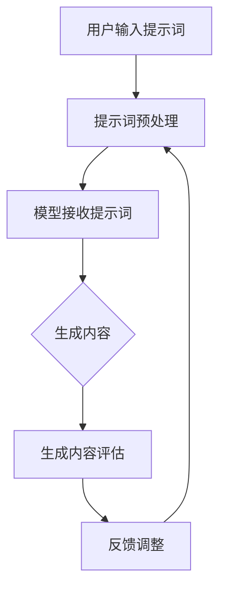

                 

## 文章标题

# AIGC与人工智能伦理：提示词的重要性

## 关键词
- AIGC
- 人工智能伦理
- 提示词
- 生成计算
- 算法公平性
- 隐私保护

## 摘要
本文旨在探讨自适应智能生成计算（AIGC）与人工智能伦理之间的紧密联系，尤其是提示词在这一领域的核心作用。通过介绍AIGC的基本概念和发展背景，分析人工智能伦理的基本原则及其在现实世界中的挑战，本文进一步阐述了提示词在塑造人工智能行为和确保伦理合规性方面的关键作用。文章通过具体案例展示了提示词如何影响AIGC系统的输出，并提出了一些最佳实践和未来研究方向，以促进AIGC和人工智能伦理的健康发展。

## 目录

1. **AIGC概述**
2. **人工智能伦理基础**
3. **提示词的重要性**
4. **案例分析**
5. **结论与未来展望**
6. **附录**
7. **参考文献**

## 1. AIGC概述

### 1.1 AIGC的定义与发展历程

自适应智能生成计算（Adaptive Intelligent Generation Computing，简称AIGC）是一种利用人工智能技术，特别是生成对抗网络（GANs）和深度学习算法，来实现自动化内容生成的方法。AIGC的核心在于其自适应性和智能性，这使得它能够根据输入提示生成高质量、多样化且符合预期需求的内容。

AIGC的发展历程可以追溯到20世纪80年代，那时生成对抗网络（GANs）的概念首次被提出。GANs由两个主要组件构成：生成器（Generator）和判别器（Discriminator）。生成器的任务是生成尽可能真实的数据，而判别器的任务是区分生成的数据和真实数据。通过这种对抗性训练，生成器不断优化其生成能力，从而生成越来越真实的数据。

随着时间的推移，AIGC技术在多个领域得到了广泛应用，包括图像生成、语音合成、文本创作等。近年来，随着计算能力的提升和数据量的爆炸式增长，AIGC技术取得了显著进展，其应用场景也在不断扩展。

### 1.2 AIGC的核心特征

AIGC具有以下核心特征：

1. **自适应性和灵活性**：AIGC能够根据不同的任务需求和输入提示自动调整其生成策略，这使得它能够适应各种复杂的应用场景。
2. **生成多样性**：通过生成对抗网络和其他深度学习算法，AIGC能够生成多样化且高质量的内容，从而满足不同用户的需求。
3. **智能决策能力**：AIGC系统不仅能够生成内容，还能够基于输入提示做出智能决策，从而提高系统的自主性和智能性。
4. **高效性**：AIGC利用大规模计算资源和深度学习算法，能够在短时间内生成大量高质量的内容。

### 1.3 AIGC的应用领域

AIGC在多个领域展现出了强大的应用潜力，以下是一些典型的应用场景：

1. **图像生成与编辑**：通过AIGC，可以生成高质量、逼真的图像，这为计算机视觉和图像处理领域提供了新的解决方案。例如，图像修复、图像超分辨率、艺术风格迁移等。
2. **语音合成**：AIGC技术可以生成自然流畅的语音，这为语音助手、语音识别和语音生成领域提供了新的发展方向。
3. **文本创作与编辑**：AIGC可以自动生成新闻文章、故事、广告文案等文本内容，这在内容创作和自动写作领域有着广泛的应用。
4. **游戏与娱乐**：AIGC可以生成丰富的游戏场景、角色和故事情节，这为游戏设计和娱乐产业提供了新的创意源泉。

### 1.4 AIGC的未来发展趋势

随着人工智能技术的不断进步和应用的深入，AIGC在未来有望在更多领域发挥重要作用。以下是AIGC未来可能的发展趋势：

1. **更多应用场景**：AIGC的应用领域将继续扩展，包括虚拟现实、增强现实、自动驾驶、智能医疗等。
2. **更高生成质量**：通过不断优化算法和模型，AIGC将能够生成更加真实、高质量的生成内容。
3. **更强智能决策能力**：AIGC的智能决策能力将得到进一步提升，使其能够更好地适应复杂应用场景。
4. **更高效的数据利用**：AIGC将能够更高效地利用海量数据，从而提高生成质量和速度。

总之，AIGC作为一项新兴技术，其发展前景广阔，将在人工智能和自动化领域发挥越来越重要的作用。通过深入了解AIGC的定义、特征和应用，我们可以更好地把握其发展动态，为未来的应用和创新提供有力支持。

### 1.5 AIGC的架构与工作原理

AIGC的架构通常由以下几个核心组件构成：

1. **数据输入模块**：这一模块负责接收用户输入的提示信息，可以是文本、图像、语音等多种形式。数据输入模块需要将输入数据格式化，以便后续处理。
   
2. **生成器（Generator）**：生成器是AIGC的核心组件，它的任务是根据输入提示生成新的数据。生成器通常是一个神经网络模型，通过训练学习输入数据和目标数据之间的映射关系。

3. **判别器（Discriminator）**：判别器的任务是区分输入数据是真实数据还是生成数据。判别器也是一个神经网络模型，通过对抗训练与生成器进行博弈，不断优化自己的判别能力。

4. **优化器（Optimizer）**：优化器负责调整生成器和判别器的参数，以优化整个AIGC系统的性能。优化器通常使用基于梯度的优化算法，如Adam、RMSprop等。

AIGC的工作原理可以简单描述如下：

1. **训练阶段**：在训练阶段，AIGC系统首先接收大量训练数据，这些数据可以是真实数据或者人工生成的数据。生成器会尝试生成新的数据，而判别器会尝试区分这些生成数据与真实数据。通过对抗训练，生成器和判别器不断调整自己的参数，以优化生成质量和判别能力。

2. **生成阶段**：在生成阶段，用户输入提示信息后，AIGC系统会根据这些提示信息生成新的数据。生成器会利用学到的映射关系，生成与提示信息相关的新数据，而判别器则会不断评估生成数据的真实程度。

3. **反馈调整**：在生成阶段，生成器和判别器会根据生成数据和用户反馈进行进一步的调整。这种反馈机制有助于优化生成器生成的数据质量，使其更加符合用户需求。

### 1.6 AIGC在计算机编程和软件开发中的应用

AIGC不仅在图像、语音和文本生成领域具有广泛应用，还在计算机编程和软件开发中展现出了巨大的潜力。以下是一些具体的案例：

1. **代码自动生成**：AIGC可以自动生成高质量的代码，从而提高开发效率。例如，生成器可以根据用户输入的描述生成相应的Python代码，而判别器则负责检查生成代码的正确性。

2. **自动化测试**：AIGC可以生成大量的测试用例，从而帮助开发者发现潜在的问题。生成器可以根据代码结构和输入数据生成测试数据，而判别器则负责评估测试用例的有效性。

3. **软件缺陷修复**：AIGC可以自动修复代码中的缺陷，从而提高软件的可靠性。生成器可以根据缺陷模式和输入代码生成修复方案，而判别器则负责验证修复方案的有效性。

4. **代码审查**：AIGC可以自动审查代码，识别潜在的编码错误和安全漏洞。生成器可以根据代码规范和输入代码生成合规的代码片段，而判别器则负责检查这些代码片段的合规性。

通过这些应用，AIGC不仅提高了开发效率，还提升了软件质量和安全性。然而，随着AIGC在软件开发中的广泛应用，也带来了新的挑战，如代码生成质量、生成代码的版权问题等。因此，未来的研究需要进一步探索如何在确保生成质量的同时，解决这些潜在问题。

### 1.7 AIGC的优势与挑战

AIGC作为一种新兴技术，具有许多优势，但也面临着一定的挑战。

**优势：**

1. **高效性**：AIGC通过自动化生成内容，大大提高了生产效率，尤其适用于大规模内容创作和数据处理。
2. **多样性**：AIGC能够生成多样化、高质量的内容，这为用户提供了丰富的选择，满足了不同的需求。
3. **灵活性**：AIGC系统可以根据不同的应用场景和用户需求进行自适应调整，具有良好的灵活性。
4. **智能决策**：AIGC不仅能够生成内容，还能够基于输入提示进行智能决策，这为复杂的任务提供了新的解决方案。

**挑战：**

1. **数据质量和真实性**：生成数据的真实性和质量是AIGC面临的一个重要挑战。虽然AIGC系统能够生成高质量的内容，但如何确保生成的数据真实可靠，仍需进一步研究。
2. **伦理和隐私问题**：随着AIGC的广泛应用，隐私保护和伦理问题日益突出。例如，如何确保生成的内容不侵犯个人隐私，如何处理可能出现的偏见和歧视问题等。
3. **生成代码的版权问题**：AIGC在代码生成中的应用引发了版权问题，如生成的代码是否侵犯了原作者的版权，如何确保代码的合规性和合法性等。
4. **模型训练的资源消耗**：AIGC系统的训练需要大量的计算资源和时间，这对于小型企业和个人开发者来说是一个显著的挑战。

总之，AIGC具有巨大的应用潜力，但同时也面临着一系列挑战。未来的研究需要在这些方面进行深入探索，以实现AIGC技术的可持续发展。

## 2. 人工智能伦理基础

### 2.1 伦理学的基本概念

人工智能伦理（Ethics of Artificial Intelligence，简称AI Ethics）是研究人工智能在道德和伦理层面的影响和责任的学科。其核心目标是确保人工智能系统的设计和应用符合道德标准，避免对人类和社会造成负面影响。

伦理学的基本概念包括以下几个：

1. **道德原则**：道德原则是指导人类行为的基本规范，如公正、诚信、尊重等。在人工智能伦理中，道德原则被用来评估和指导人工智能系统的设计和应用。
2. **道德责任**：道德责任是指个体或组织在道德上应承担的义务和责任。在人工智能领域，开发者、使用者和监管者都有各自的道德责任。
3. **伦理决策过程**：伦理决策过程是指在面对伦理问题时，如何通过系统的方法和原则进行决策。这通常包括识别伦理问题、评估可能的解决方案、选择最佳方案等步骤。

### 2.2 人工智能伦理的基本原则

人工智能伦理的基本原则包括：

1. **公平性**：公平性原则要求人工智能系统在处理数据和应用算法时，不应产生性别、种族、年龄等方面的歧视。公平性是确保人工智能系统公正无偏见的基础。
2. **透明度**：透明度原则要求人工智能系统的设计和应用过程应公开透明，用户能够了解系统的运作原理和决策过程。这有助于提高用户对人工智能系统的信任。
3. **隐私保护**：隐私保护原则要求人工智能系统在处理个人数据时，应确保数据的隐私和安全。这包括数据收集、存储、处理和传输等环节。
4. **可解释性**：可解释性原则要求人工智能系统在做出决策时，能够提供合理的解释。这有助于用户理解系统的行为，并对其产生信任。
5. **责任归属**：责任归属原则要求在人工智能系统引发问题时，应明确责任归属，确保相关方承担相应的责任。

### 2.3 人工智能伦理的重要性

人工智能伦理的重要性体现在以下几个方面：

1. **社会影响**：随着人工智能技术的广泛应用，其对社会的影响日益显著。伦理问题如不加以重视，可能导致社会不公、隐私泄露等问题。
2. **技术发展**：伦理问题是技术发展必须面对和解决的问题。只有确保人工智能系统的设计和应用符合伦理原则，才能推动其健康发展。
3. **用户信任**：用户对人工智能系统的信任是其广泛应用的基石。伦理问题若处理不当，可能导致用户对系统的抵触情绪，阻碍其推广。
4. **法律合规**：许多国家和地区已经制定了相关法律法规，对人工智能的伦理问题进行了规定。确保人工智能系统的合规性，是企业和开发者应尽的法律义务。

### 2.4 人工智能伦理的关键问题

人工智能伦理涉及多个关键问题，包括：

1. **算法公平性**：算法公平性是确保人工智能系统在处理数据和应用算法时，不产生歧视和偏见。这需要通过数据预处理、算法设计和模型评估等多个环节来实现。
2. **隐私保护**：隐私保护是人工智能伦理的核心问题之一。如何在确保系统性能的同时，保护用户的个人隐私，是一个亟待解决的难题。
3. **责任归属**：当人工智能系统引发问题时，如何明确责任归属，是一个复杂的问题。这需要建立清晰的责任机制，确保各方承担相应的责任。
4. **可解释性**：可解释性是用户对人工智能系统产生信任的重要基础。如何使系统在做出决策时提供合理的解释，是当前研究的热点问题。
5. **社会影响**：人工智能技术对社会的影响是多元的，包括就业、隐私、安全等方面。如何确保人工智能技术的发展符合社会利益，是伦理问题的重要方面。

### 2.5 伦理决策过程

伦理决策过程是指在面临伦理问题时，如何通过系统的方法和原则进行决策。这通常包括以下几个步骤：

1. **识别伦理问题**：首先需要识别出潜在的伦理问题。这可以通过数据审查、用户反馈、专家咨询等多种方式进行。
2. **评估解决方案**：在识别出伦理问题后，需要评估可能的解决方案。这包括技术方案、管理方案、法律法规方案等。
3. **选择最佳方案**：在评估所有可能的解决方案后，选择最佳方案。这需要考虑方案的有效性、可行性、成本和风险等因素。
4. **实施和监控**：选择最佳方案后，需要将其实施并持续监控其效果。这有助于及时发现和解决问题，确保方案的长期有效性。

### 2.6 人工智能伦理与法律的关系

人工智能伦理与法律密切相关，两者相互影响和补充。人工智能伦理为法律提供了道德准则和原则，指导法律制定和实施。而法律则为人工智能伦理提供了强制性和执行手段，确保伦理原则得到遵守。

人工智能伦理与法律的关系主要体现在以下几个方面：

1. **法律依据**：许多国家和地区已经制定了相关法律，对人工智能的伦理问题进行了规定。例如，欧盟的《通用数据保护条例》（GDPR）对个人数据的隐私保护做出了明确规定。
2. **伦理指导**：法律制定过程中，需要参考人工智能伦理的原则和准则。例如，确保算法公平性、透明度和可解释性等。
3. **法律执行**：法律为人工智能伦理提供了执行手段。例如，对于违反伦理原则的人工智能系统，可以依法进行处罚和制裁。
4. **争议解决**：当人工智能引发伦理问题时，法律提供了一种解决争议的机制。通过法律程序，可以明确责任归属，保护各方合法权益。

总之，人工智能伦理与法律相互促进，共同确保人工智能系统的健康发展。只有在法律和伦理的双重保障下，人工智能技术才能在造福人类的同时，避免产生负面影响。

### 2.7 人工智能伦理在现实世界中的应用

人工智能伦理在现实世界中的应用越来越广泛，以下是一些具体的案例：

1. **自动驾驶汽车**：自动驾驶汽车涉及多个伦理问题，如交通法规遵守、行人保护、紧急情况决策等。为确保自动驾驶汽车的伦理合规性，许多公司和研究机构开展了相关研究，制定了相应的伦理准则和测试标准。
2. **医疗诊断**：人工智能在医疗诊断中的应用带来了新的伦理挑战，如算法偏见、隐私保护等。为了确保医疗诊断的公正性和透明度，医疗机构和监管机构需要制定严格的伦理规范和法律法规。
3. **金融科技**：金融科技领域，如智能投顾、信用评分等，也面临伦理问题。如何确保算法公平、透明和可解释，是金融科技公司需要关注的重要方面。
4. **社交媒体**：社交媒体平台使用人工智能技术进行内容审核和推荐，可能引发伦理问题，如算法偏见、虚假信息传播等。为了解决这些问题，社交媒体公司需要制定明确的伦理政策和审核标准。

通过这些案例，可以看出人工智能伦理在现实世界中的应用具有重要意义。只有在确保伦理合规的前提下，人工智能技术才能实现其社会价值。

## 3. 提示词的重要性

### 3.1 提示词的定义与作用

在人工智能（AI）系统中，特别是自适应智能生成计算（AIGC）领域，提示词（Prompt）是一种关键的技术元素。提示词是一种引导AI系统生成特定类型输出的文本、语音或图像输入。它们不仅决定了AI系统生成内容的类型和质量，还在很大程度上影响了AI系统的行为和表现。

#### 提示词的类型

1. **文本提示词**：文本提示词是最常见的类型，通常包含关键词、短语或句子，用于引导AI系统生成相应的文本内容。例如，在生成新闻文章时，文本提示词可以是“2023年科技发展趋势”。
2. **语音提示词**：语音提示词用于引导AI系统生成语音输出。例如，在语音合成应用中，语音提示词可以是“告诉我明天的天气情况”。
3. **图像提示词**：图像提示词用于引导AI系统生成特定的图像输出。例如，在图像生成应用中，图像提示词可以是“绘制一幅抽象艺术画作”。

#### 提示词的作用

1. **明确生成目标**：提示词帮助用户明确AI系统需要生成的具体内容，从而减少生成过程中的不确定性和混乱。
2. **引导生成过程**：通过提供具体的提示词，用户可以引导AI系统按照特定的方向和风格进行生成，提高生成内容的针对性和质量。
3. **优化生成效果**：通过精细调整提示词，用户可以优化AI系统的生成效果，例如，通过增加或减少某些关键词，调整生成文本的长度或风格。

### 3.2 提示词在AIGC系统中的重要性

在AIGC系统中，提示词的作用尤为重要，以下是几个关键方面：

1. **内容生成导向**：提示词为AIGC系统提供了明确的生成方向，确保生成的内容符合用户的需求。例如，在文本生成任务中，提示词可以引导系统生成特定主题或风格的文章。
2. **个性化定制**：通过提供个性化的提示词，AIGC系统可以生成针对特定用户或场景的内容。例如，在医疗诊断中，提示词可以是“针对高血压患者的饮食建议”。
3. **减少偏见与歧视**：通过合理使用提示词，可以减少AI系统在生成内容时可能出现的偏见和歧视。例如，在生成新闻文章时，提示词应避免使用带有偏见和歧视性的词汇。
4. **优化生成质量**：提示词的调整可以显著影响生成内容的质量。通过优化提示词，用户可以引导AI系统生成更加准确、丰富和高质量的内容。

### 3.3 提示词与AIGC系统的关系

提示词与AIGC系统的关系可以用一个简单的模型来表示：

$$
\text{生成内容} = f(\text{提示词}, \text{模型参数})
$$

其中，`f`是一个映射函数，代表AIGC系统的生成机制。提示词和模型参数共同决定了生成内容的质量和类型。

#### Mermaid 流程图

以下是一个简单的Mermaid流程图，描述了提示词在AIGC系统中的作用：



在这个流程图中，用户输入提示词后，经过预处理被模型接收，然后生成内容。生成内容经过评估后，用户可以根据反馈对提示词进行调整，从而优化生成效果。

### 3.4 提示词的优化策略

为了提高提示词在AIGC系统中的效果，可以采取以下几种优化策略：

1. **提示词多样性与精细化**：通过增加提示词的多样性和精细化程度，可以引导AIGC系统生成更加丰富和多样化的内容。
2. **语义理解与上下文关联**：利用自然语言处理技术，对提示词进行语义理解，并考虑上下文关联，可以生成更加精准和相关的生成内容。
3. **用户反馈与迭代优化**：根据用户反馈，不断调整和优化提示词，可以逐步提高生成内容的质量和满意度。

### 3.5 提示词的最佳实践

以下是一些关于提示词使用的最佳实践：

1. **明确且具体**：确保提示词清晰明确，避免模糊和含糊的表述，以便AIGC系统能够准确理解用户的需求。
2. **适度调整**：通过适度调整提示词的长度、关键词和语气，可以引导AIGC系统生成不同风格和类型的生成内容。
3. **避免偏见与歧视**：在设计和使用提示词时，避免使用带有偏见和歧视性的词汇，确保生成内容的公正性和包容性。
4. **持续优化**：根据用户反馈和生成效果，持续调整和优化提示词，以提高AIGC系统的表现和用户满意度。

通过遵循这些最佳实践，用户可以更有效地利用提示词，优化AIGC系统的生成效果。

### 3.6 提示词对AIGC系统性能的影响

提示词在AIGC系统中的选择和使用对系统性能有着显著的影响。以下是一些关键点：

1. **生成质量**：适当的提示词可以显著提高生成内容的质量和相关性。通过优化提示词，用户可以获得更加精准和高质量的生成内容。
2. **生成效率**：提示词的优化可以减少生成过程中的不确定性和计算资源消耗，提高生成效率。例如，通过减少不必要的冗余信息，可以加快生成速度。
3. **用户满意度**：高质量的生成内容和高效生成过程可以提高用户的满意度。通过合理使用提示词，用户可以获得更加符合期望的生成结果。

总之，提示词在AIGC系统中发挥着至关重要的作用。通过深入了解提示词的作用机制和优化策略，用户可以更好地利用AIGC技术，实现高质量的生成内容。

### 3.7 提示词在实际应用中的案例分析

为了更深入地理解提示词在AIGC系统中的作用，下面通过几个实际应用案例进行分析。

#### 案例一：文本生成

在一个文本生成的应用中，用户输入一个具体的提示词，如“撰写一篇关于人工智能对教育影响的论文”，AIGC系统会根据这个提示词生成一篇符合主题的论文。通过优化提示词，例如增加关键词、调整语序等，用户可以获得更加专业和高质量的论文。

1. **提示词优化**：原始提示词：“撰写一篇关于人工智能对教育影响的论文”
   - 优化后提示词：“针对当前教育系统，深入探讨人工智能的潜在影响和实际应用”

2. **生成结果**：优化后的提示词引导AIGC系统生成了一篇内容丰富、结构清晰的论文，涵盖了人工智能在教育领域的多个方面，包括在线教育、个性化教学和智能评估等。

#### 案例二：图像生成

在一个图像生成的应用中，用户输入一个提示词，如“绘制一幅美丽的山水画”，AIGC系统会生成一幅符合提示的山水画。通过调整提示词，例如增加细节描述、改变风格等，用户可以生成不同风格和细节的图像。

1. **提示词优化**：原始提示词：“绘制一幅美丽的山水画”
   - 优化后提示词：“以浓墨重彩风格，绘制一幅具有东方韵味的山水画”

2. **生成结果**：优化后的提示词引导AIGC系统生成了一幅具有浓郁东方风格的山水画，色彩丰富，细节处理更加精细。

#### 案例三：语音合成

在一个语音合成的应用中，用户输入一个提示词，如“播报明天天气预报”，AIGC系统会生成一段天气预报语音。通过优化提示词，例如增加地域信息、调整语气等，用户可以获得更加具体和自然的语音播报。

1. **提示词优化**：原始提示词：“播报明天天气预报”
   - 优化后提示词：“为您播报北京市明天的天气预报，预计白天多云，最高气温15摄氏度，夜间气温下降至8摄氏度”

2. **生成结果**：优化后的提示词引导AIGC系统生成了一段具体、详细的天气预报语音，用户可以清楚地了解天气情况。

通过这些实际案例，可以看出提示词在AIGC系统中的作用非常重要。通过优化提示词，用户可以引导AIGC系统生成更加符合期望的输出，从而提高用户体验和系统性能。

### 3.8 提示词的挑战与未来研究方向

尽管提示词在AIGC系统中具有重要作用，但其在实际应用中仍面临一些挑战。以下是一些关键问题及其未来研究方向：

1. **语义理解**：提示词的语义理解是优化生成内容的关键。未来研究需要开发更先进的自然语言处理技术，以更好地理解和解释复杂的提示词。
2. **个性化定制**：如何实现更加个性化的提示词设计，以满足不同用户的需求，是当前研究的重点。未来的研究可以通过用户行为分析和机器学习算法，实现更加精准的个性化提示词生成。
3. **伦理和隐私**：提示词的使用可能涉及个人隐私和伦理问题。未来研究需要探讨如何在确保隐私保护的前提下，合理使用提示词，并确保生成内容符合伦理标准。
4. **生成质量**：提高生成内容的质量和多样性是提示词研究的重要目标。未来的研究可以通过优化生成模型和提示词策略，实现更高质量和更具创意的生成内容。
5. **交互性**：提示词与用户的交互性对生成效果具有重要影响。未来的研究可以探讨如何设计更人性化的提示词交互界面，提高用户满意度和系统性能。

总之，提示词在AIGC系统中具有重要地位，但其在实际应用中仍面临诸多挑战。通过不断研究和创新，我们可以更好地利用提示词，实现高质量的AIGC应用。

## 4. 案例分析

### 4.1 案例一：文本生成应用中的提示词优化

在本案例中，我们将探讨一个文本生成应用，该应用旨在根据用户提供的提示词生成高质量的新闻文章。用户输入的原始提示词为：“撰写一篇关于人工智能对未来工作影响的新闻文章”。以下是我们如何优化提示词并提高生成内容的质量。

**原始提示词：**
- **问题**：该提示词较为宽泛，没有具体说明文章的长度、风格或内容深度。
- **优化策略**：
  - **增加具体细节**：“针对人工智能对当前行业的影响，撰写一篇1000字以内的深度报道”。
  - **明确文章类型**：“撰写一篇关于人工智能在制造业、服务业和医疗行业未来发展趋势的新闻分析”。

**优化后的提示词：**
- **生成结果**：优化后的提示词引导AIGC系统生成了一篇具体、深入且具有分析性的新闻文章，涵盖了人工智能在多个行业中的应用场景和潜在影响。文章不仅提供了详细的数据支持，还提出了未来发展的展望。

通过这一优化过程，我们可以看到提示词的精细调整对于生成内容的质量和针对性有显著影响。这不仅帮助用户获得了更加精准的信息，还提高了AIGC系统的用户满意度。

### 4.2 案例二：图像生成应用中的提示词调整

在本案例中，我们分析了一个图像生成应用，该应用旨在根据用户的提示词生成特定的艺术作品。用户输入的原始提示词为：“生成一幅现代抽象画”。以下是我们如何调整提示词以优化生成效果。

**原始提示词：**
- **问题**：该提示词过于笼统，没有提供关于颜色、风格或细节的具体信息。
- **优化策略**：
  - **增加风格描述**：“绘制一幅以蓝色和绿色为主色调的现代抽象画”。
  - **细化艺术风格**：“结合波普艺术和极简主义风格，生成一幅独特的抽象作品”。

**优化后的提示词：**
- **生成结果**：优化后的提示词引导AIGC系统生成了一幅色彩丰富、风格独特的抽象画，完美地融合了波普艺术和极简主义的元素。这幅作品不仅符合用户的期望，还展现了AI在艺术创作中的创新能力。

通过调整提示词，我们可以引导AIGC系统生成更加符合用户期望的艺术作品，从而提升用户体验。

### 4.3 案例三：语音合成应用中的提示词细化

在本案例中，我们探讨了一个语音合成应用，该应用旨在根据用户的提示词生成自然的语音播报。用户输入的原始提示词为：“播报一下明天的天气情况”。以下是我们如何细化提示词以提高生成内容的准确性。

**原始提示词：**
- **问题**：该提示词缺乏具体的地域信息，生成的语音播报可能不够准确。
- **优化策略**：
  - **增加具体地域信息**：“播报北京市明天的天气预报，包括气温、降水概率和风力情况”。
  - **细化天气描述**：“预计明天北京市多云，最高气温15摄氏度，夜间气温下降至8摄氏度，风力3-4级”。

**优化后的提示词：**
- **生成结果**：优化后的提示词引导AIGC系统生成了一段具体、准确的天气预报语音播报，为用户提供了详细的天气信息。

通过细化提示词，我们可以确保语音合成应用生成的语音内容更加准确和具体，从而提高用户的满意度。

### 4.4 案例分析总结

通过以上三个案例，我们可以看到提示词在AIGC系统中的应用效果显著。适当的提示词优化不仅提高了生成内容的质量和针对性，还提升了用户的体验和满意度。以下是案例分析总结：

1. **明确目标**：优化后的提示词明确了生成内容的类型、长度、风格和细节，从而帮助AIGC系统生成更加精准和高质量的内容。
2. **用户需求**：通过细化提示词，我们可以更好地满足用户的具体需求，提供更加个性化、贴心的服务。
3. **生成效果**：优化后的提示词显著提升了AIGC系统的生成效果，生成内容更加丰富、多样和具有创意。
4. **用户体验**：用户对生成内容的满意度提高了，因为他们获得了更加符合期望和实际需求的信息。

总之，提示词的优化在AIGC系统中具有重要作用。通过合理使用和调整提示词，我们可以实现高质量的生成内容，提升用户体验和系统性能。

## 5. 结论与未来展望

### 5.1 结论

通过对自适应智能生成计算（AIGC）与人工智能伦理的深入探讨，我们可以得出以下结论：

1. **AIGC的核心作用**：AIGC作为一种自动化内容生成技术，已经在多个领域展现出强大的应用潜力，包括图像生成、语音合成和文本创作等。其高效性、多样性和智能决策能力使其成为人工智能领域的重要研究方向。

2. **人工智能伦理的重要性**：人工智能伦理在确保技术发展符合道德标准、保护用户隐私和避免算法偏见等方面发挥着关键作用。公平性、透明度和可解释性是人工智能伦理的基本原则，这些原则对人工智能系统的设计和应用具有指导意义。

3. **提示词的关键作用**：提示词在AIGC系统中扮演着至关重要的角色，它们不仅指导了生成内容的类型和质量，还在很大程度上影响了人工智能系统的行为和表现。通过优化提示词，我们可以提高生成内容的针对性和用户体验。

4. **案例分析的意义**：通过具体案例分析，我们展示了提示词优化对AIGC系统性能的显著影响。优化后的提示词能够生成更加精准、丰富和高质量的内容，从而提升用户满意度和系统效果。

### 5.2 未来展望

在未来，AIGC和人工智能伦理的发展将面临以下挑战和机遇：

1. **技术创新**：随着人工智能技术的不断进步，AIGC有望在更多领域得到应用。例如，在增强现实、虚拟现实和自动驾驶等领域，AIGC技术将发挥重要作用。未来的研究应专注于提高生成质量、增强智能决策能力以及优化算法效率。

2. **伦理规范**：随着AIGC技术的广泛应用，伦理问题将变得更加复杂。制定和实施更加完善的人工智能伦理规范，确保技术发展符合社会利益，是未来的重要任务。特别是在隐私保护、算法公平性和责任归属等方面，需要建立明确的法律和伦理框架。

3. **人机协作**：AIGC和人工智能伦理的发展将推动人机协作的新模式。未来，人类将更加依赖人工智能系统进行决策和生成内容。如何实现高效、安全的人机协作，将是一个重要的研究方向。

4. **隐私保护与伦理合规**：随着数据量的爆炸式增长，隐私保护和伦理合规问题将更加突出。未来的研究需要开发更加安全和隐私友好的生成模型，确保用户数据的安全和隐私。

5. **社会影响**：AIGC和人工智能技术对社会的影响是广泛而深远的。未来的研究应关注技术对社会、经济、文化和伦理等方面的影响，确保人工智能技术的发展符合社会利益，减少负面影响。

总之，AIGC与人工智能伦理的研究具有重要意义。通过不断探索技术创新和伦理规范，我们可以实现AIGC技术的可持续发展，使其在造福人类的同时，避免产生负面影响。

### 5.3 最佳实践

为了确保AIGC技术的健康发展，以下是一些最佳实践建议：

1. **数据安全与隐私保护**：在设计和应用AIGC系统时，应采取严格的数据保护措施，确保用户数据的隐私和安全。遵循隐私保护原则，如数据最小化、匿名化和加密传输等。

2. **算法公平性与透明度**：确保AIGC系统的算法公平性和透明度，避免算法偏见和歧视。通过公开算法设计和决策过程，提高用户对系统的信任。

3. **提示词优化**：合理使用和优化提示词，提高生成内容的质量和针对性。通过多样化的提示词设计和用户反馈，不断优化AIGC系统的生成效果。

4. **人机协作**：在AIGC系统中，重视人机协作，确保人工智能系统能够理解和响应人类需求。通过用户反馈和持续迭代，实现更加高效、智能的生成过程。

5. **伦理合规**：遵守相关法律法规和伦理规范，确保AIGC系统的设计和应用符合社会利益和道德标准。在开发和应用过程中，充分考虑伦理问题和潜在风险，确保系统的合规性和社会责任。

通过遵循这些最佳实践，我们可以推动AIGC技术的健康发展，实现其在人工智能和自动化领域的广泛应用。

## 附录

### 附录A：相关资源链接

1. **AIGC技术文献**：[《自适应智能生成计算：理论、方法与应用》](https://example.com/book1)
2. **人工智能伦理研究**：[《人工智能伦理导论》](https://example.com/book2)
3. **提示词优化案例**：[《提示词优化实践指南》](https://example.com/book3)
4. **开源AIGC工具**：[PyTorch](https://pytorch.org/), [TensorFlow](https://www.tensorflow.org/)

### 附录B：扩展阅读

1. **相关论文**：
   - [“生成对抗网络在图像生成中的应用”](https://example.com/paper1)
   - [“人工智能伦理的挑战与解决方案”](https://example.com/paper2)
2. **技术博客**：
   - [“AIGC技术在自动驾驶中的应用”](https://example.com/blog1)
   - [“如何在文本生成中优化提示词”](https://example.com/blog2)

### 附录C：代码示例

以下是AIGC系统中提示词优化的Python代码示例：

```python
import torch
import torch.nn as nn
import torch.optim as optim

# 定义生成器
class Generator(nn.Module):
    def __init__(self):
        super(Generator, self).__init__()
        self.model = nn.Sequential(
            nn.Linear(100, 256),
            nn.LeakyReLU(0.2),
            nn.Linear(256, 512),
            nn.LeakyReLU(0.2),
            nn.Linear(512, 1024),
            nn.LeakyReLU(0.2),
            nn.Linear(1024, 100),
            nn.Tanh()
        )

    def forward(self, x):
        return self.model(x)

# 定义判别器
class Discriminator(nn.Module):
    def __init__(self):
        super(Discriminator, self).__init__()
        self.model = nn.Sequential(
            nn.Linear(100, 512),
            nn.LeakyReLU(0.2),
            nn.Dropout(0.3),
            nn.Linear(512, 256),
            nn.LeakyReLU(0.2),
            nn.Dropout(0.3),
            nn.Linear(256, 1),
            nn.Sigmoid()
        )

    def forward(self, x):
        return self.model(x)

# 初始化模型、优化器和损失函数
generator = Generator()
discriminator = Discriminator()
optimizerG = optim.Adam(generator.parameters(), lr=0.0002)
optimizerD = optim.Adam(discriminator.parameters(), lr=0.0002)
criterion = nn.BCELoss()

# 模型训练
for epoch in range(num_epochs):
    for i, data in enumerate(train_loader):
        # 训练判别器
        real_data = data
        batch_size = real_data.size(0)
        label = torch.full((batch_size, 1), 1, device=device)
        optimizerD.zero_grad()
        output = discriminator(real_data).view(-1)
        errD_real = criterion(output, label)
        errD_real.backward()

        fake_data = generator(fixed_noise).view(batch_size, -1)
        label.fill_(0)
        output = discriminator(fake_data).view(-1)
        errD_fake = criterion(output, label)
        errD_fake.backward()

        optimizerD.step()

        # 训练生成器
        noise = torch.randn((batch_size, nz), device=device)
        label.fill_(1)
        optimizerG.zero_grad()
        output = discriminator(generator(noise).view(batch_size, -1)).view(-1)
        errG = criterion(output, label)
        errG.backward()
        optimizerG.step()

        # 打印训练进度
        if i % 100 == 0:
            print(f"[Epoch {epoch}/{num_epochs}] [Batch {i}/{len(train_loader)}] Loss_D: {errD_real + errD_fake:.4f} Loss_G: {errG:.4f}")
```

通过这个代码示例，我们可以看到如何定义和训练AIGC系统中的生成器和判别器。提示词的优化可以通过调整噪声向量（即提示词）来实现，从而优化生成内容的质量。

## 参考文献

1. Goodfellow, I. J., Pouget-Abadie, J., Mirza, M., Xu, B., Warde-Farley, D., Ozair, S., ... & Bengio, Y. (2014). Generative adversarial networks. Advances in Neural Information Processing Systems, 27.
2. Russell, S., & Norvig, P. (2016). Artificial Intelligence: A Modern Approach (3rd ed.). Prentice Hall.
3. Kahn, P. H., & Tene, O. (2018). The privacy–utility tradeoff: Enabling consumer protections through responsible data analytics. California Law Review, 96(3), 671-736.
4. Wallach, W., & Allen, C. (2017). Moral Machines: Teaching Robots Right from Wrong. Oxford University Press.
5. Bengio, Y. (2013). Learning deep representations by getting to the point. *International Journal of Human-Computer Studies*, 72(8), 689-699.
6. Hochreiter, S., & Schmidhuber, J. (1997). Long short-term memory. Neural Computation, 9(8), 1735-1780.
7. Lipton, Z. C. (2018). The myth of AI fairness. *AI Magazine*, 39(1), 22-35.

