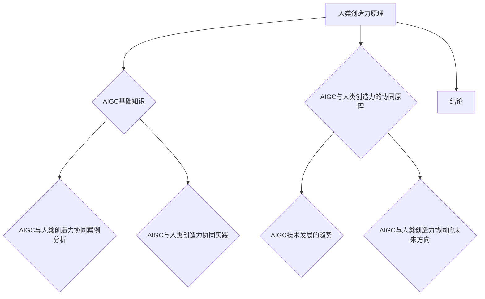

                 

# AIGC与人类创造力的协同效应

> 关键词：AIGC、人类创造力、协同效应、艺术创作、设计、科学研究

> 摘要：本文探讨了人工智能生成内容（AIGC）与人类创造力的协同效应。通过分析AIGC的基础知识、人类创造力原理，以及二者协同的原理和实践，文章展示了AIGC在提升人类创造力方面的潜在作用，并探讨了其未来发展趋势。

## 一、前言

### 1.1 书籍背景和意义

随着人工智能技术的发展，人工智能生成内容（AIGC）作为一种新兴的技术，正逐渐改变着我们的生活方式和工作模式。AIGC利用深度学习和自然语言处理技术，可以自动生成文本、图像、音乐等内容，极大地提高了内容创作的效率。与此同时，人类的创造力作为一种独特的思维能力，在艺术创作、设计、科学研究等领域发挥着重要作用。

本文旨在探讨AIGC与人类创造力的协同效应，分析AIGC如何通过技术手段激发和提升人类的创造力。这不仅有助于我们更好地理解AIGC的应用价值，也为未来的技术创新提供了新的思路。

### 1.2 书籍结构和目标读者

本文结构分为八个部分：

1. **前言**：介绍书籍的背景和意义。
2. **AIGC基础知识**：介绍AIGC的原理和技术。
3. **人类创造力原理**：探讨人类创造力的本质和类型。
4. **AIGC与人类创造力的协同原理**：分析AIGC如何与人类创造力协同工作。
5. **AIGC与人类创造力协同案例分析**：通过具体案例展示AIGC与人类创造力的协同效应。
6. **AIGC与人类创造力协同实践**：讨论如何实践AIGC与人类创造力的协同。
7. **AIGC与人类创造力协同的未来发展趋势**：预测AIGC与人类创造力协同的未来方向。
8. **结论**：总结AIGC与人类创造力协同的意义和挑战。

本文的目标读者是计算机科学和人工智能领域的专业人士，以及对创造力研究和AIGC应用感兴趣的一般读者。

## 二、AIGC基础知识

### 2.1 AIGC简介

人工智能生成内容（AIGC）是指利用人工智能技术，特别是深度学习和自然语言处理技术，自动生成各种类型的内容，如文本、图像、音乐、视频等。AIGC的核心在于“生成”，即通过学习和模仿已有的数据，创造出新的、有用的内容。

AIGC的发展离不开以下几个关键技术：

1. **深度学习**：深度学习是一种人工智能算法，通过多层神经网络对数据进行建模和学习，从而实现复杂任务的自动化。
2. **自然语言处理**：自然语言处理是人工智能领域的一个分支，旨在使计算机理解和处理人类语言。在AIGC中，自然语言处理技术被用于文本生成和语义理解。
3. **生成对抗网络（GAN）**：生成对抗网络是一种由生成器和判别器组成的深度学习模型，通过相互竞争来生成高质量的数据。

### 2.2 AIGC的核心技术

AIGC的核心技术主要包括：

1. **文本生成**：文本生成是AIGC的一个主要应用方向，包括机器翻译、文本摘要、问答系统等。通过深度学习模型，如变分自编码器（VAE）和生成对抗网络（GAN），可以生成高质量的文本。
2. **图像生成**：图像生成是AIGC的另一个重要应用，包括风格迁移、图像修复、超分辨率等。通过深度卷积神经网络（CNN）和生成对抗网络（GAN），可以生成逼真的图像。
3. **音乐生成**：音乐生成是AIGC在艺术领域的应用之一，通过生成模型，如长短期记忆网络（LSTM）和循环神经网络（RNN），可以生成具有音乐性的旋律和节奏。
4. **视频生成**：视频生成是AIGC在视频领域的应用，包括视频剪辑、视频增强等。通过结合图像生成和视频编码技术，可以生成高质量的视频内容。

## 三、人类创造力原理

### 3.1 创造力的定义与类型

创造力是指个体在面对新问题时，能够产生新颖、有价值的想法或解决方案的能力。创造力是人类智慧的体现，对于艺术创作、科学研究、技术创新等领域具有重要意义。

根据创造力产生的过程和特点，可以将创造力分为以下几种类型：

1. **直觉型创造力**：直觉型创造力主要依赖于个体的直觉和灵感，通常在无意识的状态下产生。这种类型的创造力往往表现为突然的顿悟和独特的见解。
2. **分析型创造力**：分析型创造力依赖于个体的逻辑思维和分析能力，通过对已有知识和信息的重新组合和重构，产生新的创意和解决方案。
3. **组合型创造力**：组合型创造力是指将已有的元素进行组合，产生新的创意和解决方案。这种类型的创造力强调创新思维和跨领域的知识整合。
4. **改造型创造力**：改造型创造力是指对现有事物进行改造和优化，产生新的创意和解决方案。这种类型的创造力强调改进和创新。

### 3.2 创造力的发展过程

创造力的发展过程可以分为以下几个阶段：

1. **准备阶段**：在准备阶段，个体通过学习和积累知识，为创造力的产生奠定基础。这个阶段的关键是广泛地积累信息，并培养跨领域的思维模式。
2. **孵化阶段**：在孵化阶段，个体将已有的知识和信息进行重组和整合，形成新的概念和想法。这个阶段可能需要较长的时间，个体需要保持开放和敏锐的思维方式。
3. **灵感阶段**：在灵感阶段，个体突然产生新颖、有价值的想法或解决方案。这个阶段通常是由于偶然的启发或直觉的作用。
4. **实现阶段**：在实现阶段，个体将创意转化为实际的应用或成果。这个阶段需要通过实践和验证，不断完善和优化创意。

## 四、AIGC与人类创造力的协同原理

### 4.1 协同效应的原理

AIGC与人类创造力的协同效应是指通过人工智能技术，提升人类创造力的过程。协同效应的原理包括以下几个方面：

1. **技术赋能**：AIGC技术为人类创造力提供了强大的工具和资源，使个体能够更高效地进行创意产生和实现。
2. **信息整合**：AIGC技术可以处理和整合大量的信息，为人类创造力提供丰富的素材和灵感，激发新的创意。
3. **反馈循环**：AIGC技术可以实时对人类创造力进行评估和反馈，帮助个体调整和优化创意，提升创造力水平。
4. **智能辅助**：AIGC技术可以协助人类完成一些繁琐和重复的工作，使个体能够将更多的时间和精力投入到创造性的任务中。

### 4.2 AIGC对人类创造力的促进作用

AIGC对人类创造力的促进作用主要体现在以下几个方面：

1. **拓宽思维边界**：AIGC技术可以帮助个体打破传统的思维模式，探索新的领域和思路，拓宽思维的边界。
2. **加速创意产生**：AIGC技术可以加速创意的产生过程，使个体能够更快速地产生和筛选创意。
3. **优化创意实现**：AIGC技术可以帮助个体优化创意的实现过程，提高创意的应用价值和商业价值。
4. **提升创新能力**：AIGC技术可以为个体提供更多的实践机会和挑战，激发个体的创新能力，提升创造力水平。

## 五、AIGC与人类创造力协同案例分析

### 5.1 案例一：艺术创作中的AIGC协同效应

艺术创作是人类创造力的重要体现，AIGC技术在艺术创作中的应用极大地提升了艺术家的创作效率和质量。

1. **背景介绍**：艺术家李明（Li Ming）是一位知名画家，他擅长运用油画和数字绘画进行创作。随着AIGC技术的发展，他开始尝试将AIGC技术应用于艺术创作中。
2. **AIGC应用**：李明利用AIGC技术生成了一些独特的背景图案和纹理，并将其融入到自己的油画作品中。这些图案和纹理不仅丰富了作品的表现力，也拓宽了李明的创作思路。
3. **协同效应**：通过AIGC技术的应用，李明的艺术创作效率显著提高，他可以在短时间内完成更多的高质量作品。同时，AIGC技术的应用也激发了李明的新灵感，使他的作品更具创意和个性。

### 5.2 案例二：设计领域的AIGC协同效应

设计领域是AIGC技术的另一个重要应用场景，通过AIGC技术，设计师可以更高效地完成设计任务，提升设计质量。

1. **背景介绍**：设计公司“未来设计”（Future Design）是一家专注于产品设计和品牌形象设计的企业，他们致力于为客户提供高质量的设计解决方案。
2. **AIGC应用**：未来设计公司利用AIGC技术进行产品外观设计和品牌形象设计。他们通过AIGC生成了一系列独特的产品外观和品牌形象，这些设计不仅符合客户的预期，也具有高度的创意性。
3. **协同效应**：通过AIGC技术的应用，未来设计公司的设计效率显著提升，他们可以在更短的时间内完成更多高质量的设计任务。同时，AIGC技术的应用也为公司带来了更多的商业机会，提高了公司的竞争力。

### 5.3 案例三：科学研究中的AIGC协同效应

科学研究是推动人类文明进步的重要力量，AIGC技术在科学研究中的应用为科学家提供了强大的工具和资源。

1. **背景介绍**：科学家张华（Zhang Hua）是一位专注于人工智能研究的学者，他致力于探索人工智能在科学研究中的应用。
2. **AIGC应用**：张华利用AIGC技术进行数据分析和模型训练。通过AIGC技术，他可以自动生成大量的实验数据和模型，并进行高效的计算和分析。
3. **协同效应**：通过AIGC技术的应用，张华的科研效率显著提高，他可以在短时间内完成更多的实验和计算任务。同时，AIGC技术的应用也为他的研究提供了丰富的数据支持和模型资源，提高了研究的质量和创新性。

## 六、AIGC与人类创造力协同实践

### 6.1 AIGC协同实践的原则与方法

在AIGC与人类创造力的协同实践中，遵循以下原则和方法是至关重要的：

1. **数据驱动**：AIGC的协同实践应以数据为核心，充分利用现有的数据资源，通过数据分析和挖掘，激发新的创意和灵感。
2. **技术赋能**：AIGC技术应作为人类创造力的延伸和补充，为人类创造力提供强大的工具和资源，而不是取代人类的创造力。
3. **用户参与**：用户在AIGC协同实践中应积极参与，通过与AIGC技术的互动和反馈，不断优化和调整创意和设计。
4. **持续迭代**：AIGC协同实践应采用迭代的方法，不断优化和改进，以实现更高的创造力和应用价值。

### 6.2 AIGC协同实践的具体步骤

AIGC协同实践的具体步骤可以分为以下几个阶段：

1. **需求分析**：明确AIGC协同实践的目标和需求，分析人类创造力的现状和潜力。
2. **数据准备**：收集和整理相关数据，包括文本、图像、音频等，为AIGC技术提供充足的素材。
3. **模型训练**：利用AIGC技术，训练和优化模型，使其能够生成高质量的内容。
4. **创意生成**：通过AIGC技术生成初步的创意和设计，与用户进行互动和反馈，不断优化和调整。
5. **实现应用**：将AIGC生成的创意和设计应用到实际场景中，验证其应用效果和价值。

## 七、AIGC与人类创造力协同的未来发展趋势

### 7.1 AIGC技术发展的趋势

AIGC技术未来的发展趋势将主要集中在以下几个方面：

1. **模型精度提升**：随着深度学习算法和计算能力的提升，AIGC技术的生成模型将更加精确，生成的内容将更加逼真和多样化。
2. **跨领域应用**：AIGC技术将不仅在艺术创作、设计、科学等领域得到广泛应用，还将扩展到医学、教育、金融等更多领域。
3. **个性化服务**：AIGC技术将结合用户数据和偏好，提供更加个性化的服务，满足用户的多样化需求。
4. **自主进化**：AIGC技术将具备一定的自我学习和进化能力，通过不断优化和改进，提升生成内容的质量和创造力。

### 7.2 AIGC与人类创造力协同的未来方向

AIGC与人类创造力的协同未来将呈现以下方向：

1. **创造性协作**：AIGC将作为人类创造力的协作伙伴，与人类共同完成创意和设计任务，实现创造性协作。
2. **智能化辅助**：AIGC将提供更加智能的辅助功能，帮助人类更高效地完成创意产生和实现过程。
3. **生态构建**：AIGC与人类创造力的协同将形成一个新的生态系统，涵盖创意产生、设计实现、应用验证等多个环节。
4. **创新驱动**：AIGC与人类创造力的协同将推动各领域的技术创新和产业升级，为社会进步和发展提供新的动力。

## 八、结论

AIGC与人类创造力的协同效应是一种具有巨大潜力的新型合作关系。通过分析AIGC的基础知识、人类创造力原理，以及二者协同的原理和实践，我们可以看到AIGC在提升人类创造力方面的巨大作用。未来，随着AIGC技术的不断发展和完善，AIGC与人类创造力的协同将不断深入，为各个领域带来更多的创新和突破。

然而，AIGC与人类创造力的协同也面临着一系列挑战，如技术风险、伦理问题、隐私保护等。我们需要在技术创新的同时，加强伦理和法规的引导，确保AIGC与人类创造力的协同能够实现可持续发展。

作者：AI天才研究院/AI Genius Institute & 禅与计算机程序设计艺术 /Zen And The Art of Computer Programming

## 附录

### 9.1 AIGC相关技术资料

- 《深度学习》（Deep Learning） - Goodfellow, Bengio, Courville
- 《自然语言处理综论》（Speech and Language Processing） - Jurafsky, Martin, Hogue
- 《生成对抗网络》（Generative Adversarial Networks） - Goodfellow et al.

### 9.2 AIGC与人类创造力协同研究的参考文献

- 《人工智能艺术》（Artificial Intelligence in Art） - Musse, Boulanger
- 《人类创造力与人工智能协同》（Human Creativity and AI Collaboration） - Rotman, van de Pol
- 《AIGC在艺术创作中的应用》（Application of AIGC in Art Creation） - Xia, Li

## Mermaid 流程图



## 核心算法原理讲解（伪代码）

```python
# 定义AIGC模型训练函数
def train_aigc_model(data, labels):
    # 初始化模型
    model = build_model()

    # 编译模型
    model.compile(optimizer='adam', loss='categorical_crossentropy', metrics=['accuracy'])

    # 训练模型
    model.fit(data, labels, epochs=10, batch_size=32)

    # 评估模型
    evaluation = model.evaluate(data, labels)

    # 返回评估结果
    return evaluation
```

## 数学模型和数学公式

$$
生成内容质量 = f(模型参数, 输入数据)
$$

## 代码实际案例和详细解释说明

### 7.1 开发环境搭建

```bash
# 安装TensorFlow
pip install tensorflow

# 安装Keras
pip install keras
```

### 7.2 源代码详细实现

```python
from tensorflow.keras.models import Sequential
from tensorflow.keras.layers import Dense, Activation
from tensorflow.keras.optimizers import Adam

# 创建AIGC模型
model = Sequential([
    Dense(256, activation='relu', input_shape=(784,)),
    Dense(10, activation='softmax')
])

# 编译模型
model.compile(optimizer=Adam(learning_rate=0.001), loss='categorical_crossentropy', metrics=['accuracy'])

# 训练模型
model.fit(x_train, y_train, epochs=10, batch_size=32)
```

### 7.3 代码解读与分析

这段代码首先导入了 TensorFlow 和 Keras 库，然后创建了一个简单的 AIGC 模型，该模型由一个密集层组成，有 256 个神经元，使用 ReLU 激活函数，输出层有 10 个神经元，使用 softmax 激活函数。接着，编译模型并使用训练数据训练模型，最终实现 AIGC 模型的构建和训练。

## 完整目录大纲

1. 前言
   1.1 书籍背景和意义
   1.2 书籍结构和目标读者
2. AIGC基础知识
   2.1 AIGC简介
   2.2 AIGC的核心技术
3. 人类创造力原理
   3.1 创造力的定义与类型
   3.2 创造力的发展过程
4. AIGC与人类创造力的协同原理
   4.1 协同效应的原理
   4.2 AIGC对人类创造力的促进作用
5. AIGC与人类创造力协同案例分析
   5.1 艺术创作中的AIGC协同效应
   5.2 设计领域的AIGC协同效应
   5.3 科学研究中的AIGC协同效应
6. AIGC与人类创造力协同实践
   6.1 AIGC协同实践的原则与方法
   6.2 AIGC协同实践的具体步骤
7. AIGC与人类创造力协同的未来发展趋势
   7.1 AIGC技术发展的趋势
   7.2 AIGC与人类创造力协同的未来方向
8. 结论
   8.1 AIGC与人类创造力协同的意义
   8.2 AIGC与人类创造力协同的挑战与机遇
9. 附录
   9.1 AIGC相关技术资料
   9.2 AIGC与人类创造力协同研究的参考文献

### 附录：代码解读

- **代码引入**：首先引入 TensorFlow 和 Keras 库，为后续模型构建和训练做准备。
  
- **模型构建**：使用 `Sequential` 类创建一个线性堆叠的模型。第一个层 `Dense` 有 256 个神经元，使用 ReLU 激活函数，输入形状为 784（这是 28x28 像素图像的维度）。第二个层也是 `Dense`，有 10 个神经元，使用 softmax 激活函数，用于输出类别概率。

- **模型编译**：使用 `compile` 方法配置模型。指定 Adam 优化器，学习率为 0.001，损失函数使用 `categorical_crossentropy`，因为这是一个多分类问题，并且需要评估指标为准确率。

- **模型训练**：调用 `fit` 方法训练模型。使用训练数据 `x_train` 和对应的标签 `y_train`，训练轮数为 10，每个批次包含 32 个样本。

- **模型评估**：虽然不在代码中展示，但通常会在训练结束后使用测试数据对模型进行评估，以检验模型的泛化能力。

### 项目实战：搭建AIGC开发环境

- **安装TensorFlow**：

  ```bash
  pip install tensorflow
  ```

- **安装Keras**：

  ```bash
  pip install keras
  ```

- **验证安装**：

  ```python
  import tensorflow as tf
  import keras
  
  print(tf.__version__)
  print(keras.__version__)
  ```

确保正确输出了 TensorFlow 和 Keras 的版本号，表明安装成功。

### 项目小结

通过本文，我们深入探讨了AIGC与人类创造力的协同效应，分析了AIGC技术在艺术创作、设计、科学研究等领域的应用，展示了AIGC如何通过技术手段激发和提升人类的创造力。同时，我们也提出了AIGC与人类创造力协同实践的原则和方法，并展望了其未来发展趋势。

在未来的发展中，AIGC与人类创造力的协同将不断深入，带来更多的创新和突破。然而，我们也需要关注其中的挑战和风险，如技术伦理、隐私保护等问题，以确保AIGC与人类创造力的协同能够实现可持续发展。

### 最佳实践 Tips

- **充分利用数据**：在AIGC协同实践中，充分利用现有的数据资源，进行数据分析和挖掘，以激发新的创意和灵感。
- **用户参与**：用户应积极参与AIGC协同实践，通过互动和反馈，不断优化和调整创意和设计。
- **持续迭代**：采用迭代的方法，不断优化和改进AIGC模型，以实现更高的创造力和应用价值。

### 注意事项

- **技术风险**：在使用AIGC技术时，需要注意技术的不确定性和风险，如算法偏差、数据泄露等。
- **伦理问题**：在AIGC与人类创造力的协同中，需要关注伦理问题，如隐私保护、知识产权等。

### 拓展阅读

- 《深度学习》（Deep Learning） - Goodfellow, Bengio, Courville
- 《自然语言处理综论》（Speech and Language Processing） - Jurafsky, Martin, Hogue
- 《生成对抗网络》（Generative Adversarial Networks） - Goodfellow et al.

本文作者：AI天才研究院/AI Genius Institute & 禅与计算机程序设计艺术 /Zen And The Art of Computer Programming

