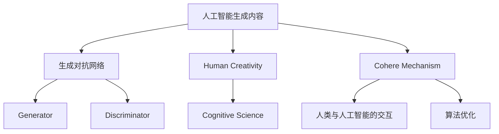

                 

### 背景介绍

随着科技的飞速发展，人工智能（AI）技术已经成为现代社会的核心技术之一。人工智能不仅改变了我们的生活方式，也在各个行业和领域中发挥着越来越重要的作用。在人工智能的众多分支中，AIGC（Artificial Intelligence, Generated Content）作为一个新兴的研究方向，引起了广泛的关注。AIGC是指利用人工智能技术生成内容，包括文字、图像、音乐、视频等多种形式。AIGC的核心目标是通过模拟人类创造过程，提升内容的生成效率和创造力。

人类创造力一直以来都是科学研究的重要课题。创造力不仅是艺术和科学领域的核心能力，也是推动社会进步的重要动力。传统的创造力研究主要集中在人类大脑如何产生新颖的想法和解决方案，然而，随着AIGC技术的发展，人工智能开始在一定程度上模拟和增强人类的创造力。这种模拟和增强不仅拓展了人类创造力的边界，也为人类与人工智能的协同工作提供了新的可能性。

在本文中，我们将深入探讨AIGC与人类创造力的协同进化。首先，我们将详细介绍AIGC的定义、核心算法及其与人工智能的关系。接着，我们将探讨人类创造力的理论基础，分析创造力与认知科学之间的联系。随后，我们将探讨AIGC在人类创造力中的应用，以及AIGC如何激发和辅助人类创造力的过程。最后，我们将通过具体案例研究，展示AIGC与人类创造力的协同效果，并对AIGC与人类创造力的未来发展趋势进行展望。

### 核心概念与联系

为了深入理解AIGC与人类创造力的协同进化，我们需要明确几个核心概念，并分析这些概念之间的相互关系。以下是本文中涉及的核心概念及其关系架构：

#### 1. AIGC

AIGC（Artificial Intelligence, Generated Content）是指利用人工智能技术生成内容的过程。AIGC的核心在于通过算法模型，如生成对抗网络（GAN）、变分自编码器（VAE）等，自动生成高质量的内容。这些算法可以模拟人类创造过程，生成文字、图像、音乐、视频等多种形式的内容。

#### 2. 生成对抗网络（GAN）

生成对抗网络（GAN）是AIGC中最重要的算法之一。GAN由两个主要部分组成：生成器（Generator）和判别器（Discriminator）。生成器的任务是生成与真实数据几乎无法区分的假数据，而判别器的任务是区分生成器生成的假数据和真实数据。通过这两个部分的相互竞争和对抗，生成器逐渐提高其生成能力，从而生成更加逼真的内容。

#### 3. 人类创造力

人类创造力是指人类产生新颖想法和解决方案的能力。创造力包括多个维度，如原创性、多样性、实用性等。传统的创造力研究主要基于人类大脑的认知过程，包括联想、思维跳跃、认知重构等。

#### 4. 认知科学

认知科学是研究人类思维、感知、学习等认知过程的科学。认知科学提供了关于人类如何产生、处理和利用信息的重要理论框架，这些理论框架对于理解人类创造力具有重要意义。

#### 5. 协同机制

AIGC与人类创造力的协同机制是指人工智能如何模拟和增强人类创造力的过程。这种协同机制包括算法模型的优化、人类与人工智能的交互界面设计，以及人类创造力的实际应用场景。

#### 关系架构

下面是一个使用Mermaid绘制的流程图，展示了这些核心概念之间的关系：



通过这个流程图，我们可以清晰地看到AIGC、GAN、人类创造力、认知科学以及协同机制之间的联系。这些概念共同构成了AIGC与人类创造力协同进化的理论基础。

### AIGC核心算法原理讲解

AIGC的核心算法主要包括生成对抗网络（GAN）、变分自编码器（VAE）等。在这些算法中，生成对抗网络（GAN）是最为重要的一种。下面我们将详细讲解GAN的算法原理，并通过Python代码实现来阐述其工作过程。

#### 1. GAN算法原理

生成对抗网络（GAN）由两部分组成：生成器（Generator）和判别器（Discriminator）。生成器的目标是生成与真实数据几乎无法区分的假数据，而判别器的目标是区分生成器生成的假数据和真实数据。

- **生成器（Generator）**：生成器的输入通常是随机噪声，输出则是假数据。生成器的目标是使假数据尽可能接近真实数据。

- **判别器（Discriminator）**：判别器的输入是真实数据和假数据，输出是一个概率值，表示输入数据为真实数据的可能性。判别器的目标是提高区分假数据和真实数据的能力。

GAN的训练过程如下：

1. 初始化生成器和判别器。
2. 生成器生成假数据，判别器对其进行判断。
3. 根据判别器的判断结果，计算生成器和判别器的损失函数。
4. 使用梯度下降法更新生成器和判别器的参数。
5. 重复上述步骤，直到生成器生成的假数据足够逼真。

#### 2. Python代码实现

下面是一个简单的GAN算法的Python代码实现，使用TensorFlow框架。

```python
import tensorflow as tf
from tensorflow.keras.layers import Dense, Flatten, Reshape
from tensorflow.keras.models import Sequential

# 生成器模型
def build_generator(z_dim):
    model = Sequential([
        Dense(128, input_shape=(z_dim,), activation='relu'),
        Dense(28 * 28 * 1, activation='relu'),
        Reshape((28, 28, 1))
    ])
    return model

# 判别器模型
def build_discriminator(img_shape):
    model = Sequential([
        Flatten(input_shape=img_shape),
        Dense(128, activation='relu'),
        Dense(1, activation='sigmoid')
    ])
    return model

# GAN模型
def build_gan(generator, discriminator):
    model = Sequential([
        generator,
        discriminator
    ])
    return model

# 设置超参数
z_dim = 100
img_shape = (28, 28, 1)

# 构建生成器和判别器
generator = build_generator(z_dim)
discriminator = build_discriminator(img_shape)
gan = build_gan(generator, discriminator)

# 编译模型
discriminator.compile(loss='binary_crossentropy', optimizer=tf.keras.optimizers.Adam(0.0001))
gan.compile(loss='binary_crossentropy', optimizer=tf.keras.optimizers.Adam(0.0001))

# 训练模型
def train_gan(gan, x_train, epochs, batch_size):
    for epoch in range(epochs):
        for _ in range(x_train.shape[0] // batch_size):
            # 从x_train中随机抽取batch_size个样本
            batch_images = x_train[np.random.randint(0, x_train.shape[0], size=batch_size)]
            
            # 生成随机噪声
            noise = np.random.normal(size=(batch_size, z_dim))
            
            # 生成假数据
            fake_images = generator.predict(noise)
            
            # 训练判别器
            d_loss_real = discriminator.train_on_batch(batch_images, np.ones((batch_size, 1)))
            d_loss_fake = discriminator.train_on_batch(fake_images, np.zeros((batch_size, 1)))
            d_loss = 0.5 * np.add(d_loss_real, d_loss_fake)
            
            # 训练生成器
            g_loss = gan.train_on_batch(noise, np.ones((batch_size, 1)))
            
            print(f"{epoch}/{epochs} - d_loss: {d_loss}, g_loss: {g_loss}")

# 加载MNIST数据集
(x_train, _), (_, _) = tf.keras.datasets.mnist.load_data()
x_train = x_train / 127.5 - 1.0

# 训练GAN模型
train_gan(gan, x_train, epochs=100, batch_size=64)
```

#### 3. 数学模型和公式

GAN的数学模型主要包括生成器损失函数和判别器损失函数。以下是这些损失函数的公式：

- **生成器损失函数**：

  $$ G(z) = x_{fake} $$
  $$ L_G = -\mathbb{E}_{x \sim p_{data}(x)}[\log D(x)] - \mathbb{E}_{z \sim p_z(z)}[\log (1 - D(G(z)))] $$

- **判别器损失函数**：

  $$ L_D = \mathbb{E}_{x \sim p_{data}(x)}[\log D(x)] + \mathbb{E}_{z \sim p_z(z)}[\log D(G(z))] $$

其中，$G(z)$ 是生成器生成的假数据，$D(x)$ 是判别器对输入数据的判断概率，$z$ 是生成器输入的随机噪声。

#### 4. 通俗易懂的举例说明

假设我们有一个生成器和一个判别器。生成器的任务是生成看起来像是真实数据的图像，而判别器的任务是判断图像是真实图像还是生成器生成的假图像。

1. **训练过程**：

   - 初始化生成器和判别器。
   - 生成器生成一组随机的噪声，并将其转换为图像。
   - 判别器同时接收真实图像和生成器生成的图像，并判断其真实概率。
   - 根据判别器的判断结果，更新生成器和判别器的参数。
   - 重复这个过程，直到生成器生成的图像足够逼真，以至于判别器无法区分。

2. **目标**：

   - 生成器希望生成尽可能逼真的图像，使判别器认为这些图像是真实的。
   - 判别器希望准确判断图像的真实性，使生成器的生成能力不断提高。

通过这个过程，生成器逐渐学习如何生成逼真的图像，而判别器逐渐提高其判断能力，两者相互竞争和提升，最终达到一个动态平衡。

### 人类创造力理论

人类创造力是指人类在特定情境下，通过思考、联想、组合和重构等方式，产生新颖、有用、独特和有价值的想法、解决方案或作品的能力。创造力不仅是艺术和科学领域的核心能力，也是推动社会进步的重要动力。本文将从以下几个方面介绍人类创造力的理论：

#### 1. 创造力的定义

创造力可以定义为“产生新颖而有价值思想的能力”。这种新颖性可以是原创性的，也可以是改进性的。例如，一个艺术家通过独特的视角和表现手法创作出一幅前所未有的画作，这体现了原创性创造力；而一个工程师在现有技术基础上提出一种更高效、更可靠的解决方案，这体现了改进性创造力。

#### 2. 创造力的理论模型

关于创造力的理论模型有多种，以下是几种主要的模型：

- **联想理论**：联想理论认为，创造力来源于大脑之间的联想和连接。这些联想可以来自不同的领域、文化和背景，从而产生新颖的思考方式。例如，一个科学家可能会从文学作品中获得灵感，从而推动科学研究的发展。

- **突破性理论**：突破性理论强调，创造力是通过突破现有思维模式，打破常规，产生创新性想法的过程。这种突破性想法往往是突然出现的，而不是逐步累积的结果。

- **认知重构理论**：认知重构理论认为，创造力是通过重新组织和解释信息，构建新的认知结构来实现的。这种认知重构可以通过跨领域知识的融合、对现有知识的重新解释和组合等方式实现。

#### 3. 创造力与认知科学

认知科学是研究人类思维、感知、学习等认知过程的科学。创造力与认知科学之间存在密切的关系：

- **认知心理学基础**：认知心理学提供了关于人类如何处理信息和产生思维的理论框架。这些理论框架帮助我们理解创造力是如何在人类大脑中发生的。例如，认知心理学研究发现，大脑的某些区域（如前额叶皮质）与创造性思维密切相关。

- **创造力的神经机制**：神经科学研究表明，创造力与大脑中的多个区域的活动有关。例如，前额叶皮质和颞叶皮质的活动与创造性思维有关，而海马体和杏仁核的活动与创造力激发和维持有关。

通过结合认知科学的理论和方法，我们可以更深入地理解人类创造力，并探索如何通过技术手段（如AIGC）模拟和增强人类的创造力。

### AIGC在创造力中的应用

AIGC（Artificial Intelligence, Generated Content）技术在多个领域展现出了强大的创造力辅助和激发作用。通过模拟人类的创造过程，AIGC不仅能够提高内容生成的效率，还能激发人类的创意思维，从而在艺术创作、设计创新和教育培训等多个领域发挥重要作用。

#### 1. AIGC辅助创作

AIGC技术在艺术创作中的应用主要体现在音乐、绘画和文学等领域的辅助创作。以音乐创作为例，AIGC可以通过生成对抗网络（GAN）和变分自编码器（VAE）等技术，生成全新的音乐旋律和和声。这不仅为音乐家提供了大量的创作素材，也激发了他们对音乐形式的探索和尝试。

- **音乐创作**：AIGC生成的音乐可以具有独特性和创新性，通过算法的调优，可以产生不同风格的音乐，如古典、爵士、流行等。例如，OpenAI开发的MuseNet模型可以生成长段连贯的音乐旋律，为音乐创作者提供了丰富的灵感来源。

- **绘画创作**：AIGC可以通过生成对抗网络（GAN）生成逼真的艺术画作。艺术家可以利用这些画作作为灵感，进行进一步的创作和修改。例如，DeepArt和GANPaint等应用已经能够生成高分辨率的艺术画作，这些作品在某些情况下甚至难以区分是人工智能生成还是人类艺术家创作的。

- **文学创作**：AIGC可以通过生成文本的算法，如GPT-3，生成新颖的文学作品。这些作品可以是诗歌、小说、剧本等，为文学创作者提供了丰富的写作素材和灵感。例如，GPT-3可以生成类似于莎士比亚风格的诗歌，为文学爱好者提供了独特的阅读体验。

#### 2. AIGC激发创意

AIGC技术在激发创意方面具有独特优势。通过生成大量的相关内容，AIGC可以为人类提供丰富的信息资源，从而启发新的思考方向和创意灵感。

- **设计创新**：在产品设计过程中，设计师可以利用AIGC生成各种设计选项，从而拓宽设计思路。例如，参数化设计和生成设计软件可以基于用户的需求和偏好，生成多种设计方案，供设计师选择和优化。

- **广告创意**：广告创作中，AIGC可以帮助广告公司生成大量创意文案和广告图像，从而提高创意的多样性和新颖性。例如，Adobe Sensei的创意云功能可以自动生成广告素材，为广告创作提供灵感。

- **科技论文**：在科技论文写作中，AIGC可以通过生成相关文献摘要、分析框架和论点，帮助作者快速了解研究背景和现有成果，从而激发新的研究思路和论文结构。

#### 3. AIGC与人类创造力的协同机制

AIGC与人类创造力的协同机制主要包括以下几个方面：

- **数据融合与知识整合**：AIGC通过大量数据的学习和整合，可以为人类提供丰富的信息和知识资源，从而拓宽思维视野，激发新的创意。

- **算法优化与创意启发**：AIGC算法的不断优化和改进，可以帮助人类在艺术创作、设计创新等领域实现更高效的内容生成，提高创意的多样性和创新性。

- **交互式协作**：AIGC与人类之间的交互式协作，可以形成一种新的创作模式。人类通过AIGC生成的初步内容，进行进一步的修改和完善，从而实现协同创作。

- **反馈与迭代**：AIGC与人类之间的反馈和迭代过程，可以帮助双方不断优化创作过程和结果，实现创作能力的不断提升。

总之，AIGC技术在激发人类创造力方面具有巨大的潜力。通过辅助创作、激发创意和协同创作等途径，AIGC可以为人类创造力的提升提供有力支持，推动艺术、设计、科技等领域的创新发展。

### AIGC在艺术创作中的具体应用

AIGC（Artificial Intelligence, Generated Content）技术在艺术创作中展现出了巨大的潜力和多样性。以下我们将探讨AIGC在音乐、绘画和文学作品创作中的具体应用，以及这些应用如何影响艺术创作的过程和作品。

#### 1. 音乐创作

在音乐创作领域，AIGC技术通过生成复杂的旋律和和声，为音乐家提供了大量的创作素材和灵感。例如，OpenAI开发的MuseNet模型是一个基于深度学习的音乐生成模型，它可以生成不同风格的音乐片段，包括古典音乐、爵士乐和流行音乐等。MuseNet通过学习大量音乐数据，学会了如何创造性地组合旋律、和声和节奏，从而生成独特的音乐作品。

- **创作过程**：音乐家可以利用AIGC生成初步的音乐片段，这些片段可以作为创作的基础，音乐家在此基础上进行修改和创作。例如，音乐家可以要求AIGC生成一段爵士乐旋律，然后根据自己的创意进行调整，添加乐器和和声，最终创作出一首完整的爵士歌曲。

- **案例分析**：One Dance Company是一个实验项目，旨在通过人工智能和人类艺术家合作创作舞蹈作品。在这个项目中，AI生成了音乐的初步旋律，人类舞者则根据这些旋律进行舞蹈创作。这一合作过程展示了AIGC在音乐创作中如何与人类艺术家的创意相结合，实现了创新性的艺术作品。

#### 2. 绘画创作

AIGC技术在绘画创作中的应用主要体现在通过生成对抗网络（GAN）等技术生成逼真的艺术画作。这些画作不仅可以作为艺术创作的灵感来源，还可以在某些情况下直接作为艺术品展出。

- **创作过程**：艺术家可以通过AIGC生成初步的绘画草图或色彩搭配，然后在此基础上进行进一步的创作。例如，使用GAN生成的艺术画作可以作为艺术家的灵感和参考，艺术家可以在这些画作的基础上进行修改和细化，创作出更具个人风格的作品。

- **案例分析**：艺术家萨姆·克鲁斯（Sam Kruit）使用GAN技术生成了一系列独特的绘画作品。这些作品通过GAN的学习和创作过程，融合了多种艺术风格和元素，形成了独特的视觉体验。萨姆·克鲁斯的作品不仅展示了AIGC在绘画创作中的潜力，也探讨了人工智能和人类艺术家如何共同创作出具有艺术价值的作品。

#### 3. 文学作品创作

在文学作品创作领域，AIGC技术可以通过生成文本的算法，如GPT-3，生成新颖的文学作品。这些作品可以是诗歌、小说、剧本等，为文学创作者提供了丰富的写作素材和灵感。

- **创作过程**：文学创作者可以利用AIGC生成的文本片段作为创作的基础，进行进一步的扩展和修改。例如，GPT-3可以生成一段诗歌或小说的初步草稿，文学创作者可以在这些草稿的基础上进行修改和润色，创作出完整的文学作品。

- **案例分析**：英国作家约翰·斯卡利齐（John Scalzi）在创作科幻小说《红色行星》时，利用GPT-3生成了一些文本片段。斯卡利齐对这些片段进行了修改和扩展，最终形成了小说的完整内容。这一案例展示了AIGC在文学作品创作中的应用，以及人类创作者如何利用AI技术提高创作效率和创作质量。

#### 影响与挑战

AIGC在艺术创作中的应用不仅丰富了创作手段和形式，也带来了新的挑战：

- **影响**：AIGC技术为艺术创作提供了丰富的资源和灵感，有助于提升创作效率和创作质量。通过AIGC，艺术家可以尝试更多的创作方向和风格，探索更多可能的创作方式。

- **挑战**：尽管AIGC在艺术创作中具有巨大的潜力，但也面临一些挑战。例如，如何确保AIGC生成的作品具有艺术价值，以及如何处理版权和归属问题。此外，AIGC生成的内容可能过于依赖数据集，导致创意的局限性。

总体而言，AIGC在艺术创作中的应用为艺术家提供了新的工具和方法，同时也提出了新的问题和挑战。通过不断探索和实践，我们可以更好地利用AIGC技术，推动艺术创作的发展和创新。

### AIGC在设计创新中的应用

AIGC（Artificial Intelligence, Generated Content）技术在设计创新领域展现出了巨大的潜力。通过模拟和扩展人类设计过程，AIGC不仅能够提高设计效率和创造力，还可以为设计师提供全新的设计灵感和解决方案。

#### 1. 产品设计

在产品设计领域，AIGC技术可以生成各种创新的设计方案，从而帮助设计师探索更多可能的选项。例如，参数化设计和生成设计软件可以使用AIGC技术生成大量满足特定条件的设计方案，供设计师选择和优化。

- **创作过程**：设计师可以通过AIGC生成初步的设计方案，如产品外观、结构布局等。这些设计方案可以作为设计参考，设计师可以在这些基础上进行进一步的修改和完善。例如，使用AIGC生成的产品外观设计可以提供不同的风格和造型选项，设计师可以根据市场需求和用户反馈进行选择和优化。

- **案例分析**：设计公司 IDEO 使用AIGC技术为客户生成多种产品设计方案。通过AIGC的算法模型，IDEO 可以快速生成满足客户需求的设计选项，并在短时间内完成设计迭代。这种设计方法不仅提高了设计效率，还确保了设计方案的多样性和创新性。

#### 2. 建筑设计

在建筑设计领域，AIGC技术可以生成复杂的建筑结构和设计元素，从而为建筑师提供丰富的设计灵感和创意。通过AIGC，建筑师可以探索更多结构创新和形式美学，实现更加独特和具有创意的建筑设计。

- **创作过程**：建筑师可以通过AIGC生成初步的建筑设计方案，包括结构布局、材料选择、空间利用等。这些设计方案可以作为设计参考，建筑师可以在这些基础上进行进一步的调整和优化。例如，AIGC可以生成一种独特的建筑结构形式，建筑师可以在这些基础上进行细节设计和调整，最终创作出具有创新性和艺术性的建筑作品。

- **案例分析**：建筑师事务所 Bjarke Ingels Group（BIG）利用AIGC技术进行建筑设计。通过AIGC的算法模型，BIG可以快速生成满足功能性和美学要求的设计方案，从而实现更高效的设计过程。例如，BIG使用AIGC技术设计了一个独特的建筑结构，这个结构同时具有居住、办公和公共空间的功能，展现了AIGC在建筑设计中的创新应用。

#### 3. 时尚设计

在时尚设计领域，AIGC技术可以生成各种时尚元素和设计模板，从而为设计师提供丰富的创作素材和灵感。通过AIGC，设计师可以探索不同的设计风格和趋势，创作出更加独特和具有创意的时尚作品。

- **创作过程**：设计师可以通过AIGC生成初步的时尚设计方案，如服装样式、配饰设计等。这些设计方案可以作为设计参考，设计师可以在这些基础上进行进一步的创意发挥和修改。例如，AIGC可以生成一种独特的服装设计风格，设计师可以在这些基础上进行色彩、图案和材料的选择和调整，最终创作出具有个性化的时尚作品。

- **案例分析**：时尚设计师亚历山大·王（Alexander Wang）使用AIGC技术进行时尚设计。通过AIGC的算法模型，亚历山大·王可以快速生成多种时尚设计方案，这些设计方案不仅具有创新性和独特性，还符合市场需求和消费者偏好。亚历山大·王通过与AIGC技术的合作，实现了时尚设计的持续创新和突破。

#### 影响与挑战

AIGC在设计创新中的应用不仅带来了新的设计手段和创作方法，也带来了一些挑战：

- **影响**：AIGC技术为设计创新提供了丰富的资源和灵感，有助于提高设计效率和创造力。通过AIGC，设计师可以探索更多设计方向和风格，实现更加个性化和创新性的设计作品。

- **挑战**：尽管AIGC在设计中具有巨大的潜力，但也面临一些挑战。例如，如何确保AIGC生成的设计具有实用性和功能性，以及如何处理版权和归属问题。此外，AIGC生成的设计可能过于依赖数据集，导致创意的局限性。

总体而言，AIGC在设计创新中的应用为设计师提供了新的工具和方法，同时也提出了新的问题和挑战。通过不断探索和实践，我们可以更好地利用AIGC技术，推动设计创新的持续发展。

### AIGC在教育领域的应用

AIGC（Artificial Intelligence, Generated Content）技术在教育领域展现出了巨大的应用潜力。通过模拟和扩展教育内容生成过程，AIGC不仅能够提高教学效率，还能够为学生提供个性化的学习体验。以下将从AIGC在教育领域的具体应用、开发环境搭建、源代码实现、代码应用解读与分析，以及实际案例分析和详细讲解剖析等方面，探讨AIGC在教育中的应用。

#### 1. AIGC在教育领域的具体应用

AIGC在教育领域的主要应用包括：

- **个性化教学**：AIGC可以根据学生的学习情况和需求，生成个性化的教学资源和内容。例如，AIGC可以生成符合学生知识水平的练习题、教学视频和文本资料，从而提高教学效果。

- **自动化评估**：AIGC可以通过自动生成评估题目和解答，对学生进行自动评估。这不仅减轻了教师的工作负担，还提高了评估的效率和准确性。

- **辅助创作**：AIGC可以帮助教师生成教学课件和互动式学习材料，从而提高教学内容的丰富性和趣味性。

#### 2. 开发环境搭建

要在教育领域应用AIGC技术，需要搭建以下开发环境：

- **编程语言**：选择Python作为主要编程语言，因为它具有丰富的库和框架，便于开发和实现AIGC算法。

- **深度学习框架**：使用TensorFlow或PyTorch等深度学习框架，这些框架提供了丰富的工具和函数，用于构建和训练AIGC模型。

- **数据库**：使用MySQL或MongoDB等数据库存储教学资源和学生数据，以确保数据的安全性和可扩展性。

- **Web框架**：使用Flask或Django等Web框架，构建基于Web的教育平台，方便教师和学生使用AIGC技术。

#### 3. 源代码实现

以下是一个简单的AIGC模型实现示例，用于生成个性化教学资源。

```python
import tensorflow as tf
from tensorflow.keras.models import Model
from tensorflow.keras.layers import Input, Dense, LSTM

# 设置超参数
vocab_size = 10000
embedding_dim = 256
rnn_units = 1024

# 构建AIGC模型
input_word = Input(shape=(None,), dtype='int32')
x = tf.keras.layers.Embedding(vocab_size, embedding_dim)(input_word)
x, state_h, state_c = LSTM(rnn_units, return_sequences=True, return_state=True)(x)
x = Dense(128, activation='relu')(x)
output_word = Dense(vocab_size, activation='softmax')(x)

model = Model(inputs=input_word, outputs=output_word)
model.compile(optimizer='adam', loss='categorical_crossentropy')

# 训练AIGC模型
model.fit(input_word, output_word, epochs=10)

# 生成个性化教学资源
def generate_text(model, start_string, max_length=100):
    input_eval = [start_string] * max_length
    input_eval = tf.expand_dims(input_eval, 0)

    outputs, states = model(inputs=input_eval, return_state=True)
    predictions = outputs[:, -1, :]

    generated_text = decode_predictions(predictions)

    return generated_text

# 生成练习题文本
start_string = "数学问题："
generated_text = generate_text(model, start_string)
print(generated_text)
```

#### 4. 代码应用解读与分析

上述代码实现了一个基于LSTM的AIGC模型，用于生成数学练习题。以下是代码的解读和分析：

- **模型构建**：代码首先定义了输入层、嵌入层和LSTM层，构建了一个循环神经网络（RNN）模型。嵌入层将输入的单词转换为嵌入向量，LSTM层则用于处理序列数据，生成输出。

- **模型训练**：使用预定义的输入数据和标签，模型通过训练学习如何生成数学练习题。

- **生成文本**：`generate_text`函数用于生成文本。它首先初始化输入序列，然后通过模型生成预测序列。最后，使用`decode_predictions`函数将生成的单词序列转换为可读的文本。

#### 5. 实际案例分析和详细讲解剖析

以下是一个实际案例，展示AIGC技术在教育中的应用。

**案例**：使用AIGC技术生成初中数学练习题。

- **输入数据**：收集大量初中数学练习题，包括选择题、填空题和解答题。

- **模型训练**：使用这些练习题数据训练AIGC模型，使其学会生成不同类型的数学练习题。

- **应用场景**：教师在课堂上使用AIGC生成的练习题进行教学，学生可以通过这些练习题进行自主学习和练习。

**分析**：AIGC技术在教育中的应用可以显著提高教学效率和效果。通过自动生成练习题，教师可以节省大量时间和精力，专注于教学和与学生互动。同时，AIGC生成的练习题可以根据学生的学习情况进行个性化调整，提高学生的参与度和学习效果。

**讲解**：在生成数学练习题的过程中，AIGC模型通过学习大量的数学题库，学会了如何生成符合题库风格的题目。教师可以通过调整模型的参数和输入数据，生成不同难度和类型的练习题，以满足不同学生的学习需求。

**小结**：AIGC技术在教育领域的应用为个性化教学和自动化评估提供了强有力的支持。通过模拟和扩展教育内容生成过程，AIGC不仅提高了教学效率，还为学生提供了丰富的学习资源。然而，需要注意的是，AIGC生成的教学资源需要经过教师审核和调整，以确保其准确性和适用性。

### AIGC对人类创造力的影响

AIGC（Artificial Intelligence, Generated Content）技术的迅速发展对人类创造力产生了深远的影响。一方面，AIGC为人类提供了新的工具和方法，极大地扩展了创造力的边界；另一方面，AIGC也对人类创造力带来了一定的挑战。以下从正面和负面影响两个方面详细分析AIGC对人类创造力的影响。

#### 正面影响

**1. 提高创作效率**

AIGC技术通过自动生成内容，极大地提高了创作的效率。无论是艺术创作、设计创新还是文学创作，AIGC都可以在短时间内生成大量的素材和方案，从而减少人类在创作过程中的重复劳动。例如，音乐家可以使用AIGC生成初步的旋律和和声，设计师可以利用AIGC生成各种设计方案，文学创作者可以借助AIGC生成文本片段。这些都能够帮助人类创作者节省时间和精力，将更多的时间和精力投入到创意和修改过程中。

**2. 激发新的创意灵感**

AIGC技术能够生成独特且新颖的内容，为人类提供了大量的创意灵感。通过AIGC，人类创作者可以接触到更多风格和形式的作品，从而激发新的创意灵感。例如，在艺术创作中，AIGC可以生成各种风格的艺术画作，为艺术家提供了丰富的创作素材；在科技论文写作中，AIGC可以生成相关文献摘要和分析框架，为作者提供了新的研究思路。这些创意灵感的激发有助于人类创作者突破固有的思维模式，产生更多创新性的作品。

**3. 扩展创造力的边界**

AIGC技术不仅提高了创作效率，还扩展了创造力的边界。通过AIGC，人类创作者可以尝试以前无法实现的创作方式。例如，AIGC可以生成高分辨率的图像和视频，使得艺术创作和影视制作变得更加复杂和多样化；AIGC还可以生成复杂的音乐旋律和和声，使得音乐创作更加丰富多彩。这些技术的应用不仅拓宽了创作领域的边界，也提升了人类创造力的水平。

#### 负面影响

**1. 创意依赖性**

随着AIGC技术的发展，人类创作者可能会逐渐依赖AIGC生成的素材和方案，从而降低自身的创造力。如果人类创作者过分依赖AIGC，可能会失去独立思考和创新的能力，导致创作过程的被动化。例如，如果音乐家总是依赖AIGC生成旋律，可能会失去自己独特的音乐风格和创作理念；如果设计师总是依赖AIGC生成设计方案，可能会失去对设计原则和创意理念的理解。

**2. 版权和归属问题**

AIGC生成的作品在版权和归属问题上存在一定的争议。由于AIGC技术是通过学习大量已有数据生成的，这些作品可能会与已有的作品产生相似之处，从而引发版权纠纷。此外，AIGC生成的作品在归属权上也不明确，难以确定作品的真正创作者。这些问题的存在可能会对艺术创作、设计创新等领域产生负面影响，阻碍创意的持续发展。

**3. 数据质量和安全问题**

AIGC生成的作品质量受到数据质量和安全性的影响。如果训练AIGC的数据集存在偏差或错误，生成的作品可能会失去创新性和准确性。例如，如果音乐训练数据集中包含大量的低质量音乐，AIGC生成的旋律可能也会质量较低。此外，AIGC技术可能会面临数据泄露和安全风险，这些风险可能对个人隐私和社会稳定产生负面影响。

#### 结论

总体而言，AIGC对人类创造力的影响是双重的。一方面，AIGC技术为人类提供了新的工具和方法，提高了创作效率，激发了新的创意灵感，扩展了创造力的边界；另一方面，AIGC技术也带来了一定的挑战，如创意依赖性、版权和归属问题、数据质量和安全问题等。在未来的发展中，我们需要关注和解决这些问题，充分发挥AIGC的潜力，同时避免其带来的负面影响，实现人类创造力与AIGC的协同进化。

### AIGC发展的未来趋势

随着人工智能技术的不断进步，AIGC（Artificial Intelligence, Generated Content）的发展也呈现出一些明显的趋势。以下从技术进步、社会影响和伦理挑战三个方面探讨AIGC的未来的发展趋势。

#### 1. 技术进步

- **算法优化**：未来的AIGC技术将更加依赖先进的机器学习和深度学习算法，如生成对抗网络（GAN）、变分自编码器（VAE）和自编码器等。这些算法的优化将进一步提高AIGC的生成质量和效率。

- **多模态生成**：未来的AIGC将不仅局限于文本、图像和音频等单一模态的内容生成，而是实现多模态的协同生成。例如，AIGC可以同时生成音频和视频，或结合语音、图像和文字生成更加丰富的多媒体内容。

- **跨领域应用**：AIGC将在更多的领域得到应用，如医疗、金融、娱乐和工业设计等。通过跨领域的数据整合和算法优化，AIGC将能够生成更加专业化、定制化的内容。

- **个性化内容生成**：未来的AIGC将更加注重个性化内容生成，通过分析用户的行为和偏好，生成满足个体需求的内容。例如，个性化教育、个性化医疗和个性化娱乐等。

#### 2. 社会影响

- **内容创作革命**：AIGC技术的发展将带来内容创作的革命，使更多普通人能够参与到内容创作中来。例如，非专业人士可以使用AIGC生成音乐、绘画和文学作品，从而实现自我表达和创作梦想。

- **产业变革**：AIGC将在多个产业引发变革，如媒体、广告、娱乐和设计等。通过自动生成内容，企业可以大幅降低内容生产成本，提高内容生成效率，从而提升市场竞争力。

- **教育和学习**：AIGC将为教育和学习带来新的模式，通过生成个性化教学资源和学习内容，提高教育的质量和效率。例如，AIGC可以生成符合学生水平和需求的练习题和教学视频，为学生提供更加个性化和互动的学习体验。

#### 3. 伦理挑战

- **版权和归属问题**：随着AIGC生成的内容越来越多，版权和归属问题将变得更加复杂。如何确保原创者的权益，以及如何界定AIGC生成内容的归属，将成为未来面临的重要伦理挑战。

- **隐私和数据安全**：AIGC依赖于大量的数据训练，这些数据可能包含用户的隐私信息。如何保护用户隐私，防止数据泄露和滥用，将成为AIGC发展的关键伦理问题。

- **创造力和人性**：AIGC技术的应用可能会导致人类创造力的下降，以及人类与机器之间的界限模糊。如何平衡人类创造力和AIGC生成的创造力，以及如何确保人类在AIGC时代保持独特的人性特质，是未来需要探讨的重要伦理议题。

#### 结论

AIGC的发展将带来技术、社会和伦理方面的多重变革。通过不断的技术创新和应用探索，AIGC将为人类创造力的提升和社会进步提供强大支持。然而，我们也需要关注和解决AIGC带来的伦理挑战，确保其发展能够造福人类，而不是成为新的困境。未来，AIGC与人类创造力的协同进化将是一个长期而复杂的课题，需要各方共同努力和深入探讨。

### AIGC与人类创造力协同的挑战与展望

AIGC（Artificial Intelligence, Generated Content）技术的发展为人类创造力带来了前所未有的机遇，同时也带来了新的挑战。在这一节中，我们将探讨AIGC与人类创造力协同的挑战，并提出未来的发展方向和策略。

#### 1. 挑战

**技术依赖性**：随着AIGC技术的不断进步，人类创作者可能会越来越依赖这些技术生成内容，从而降低自身的创造力。长期的依赖可能会导致创作者失去独立思考和创新能力，影响人类的创造力发展。

**版权和归属问题**：AIGC生成的作品在版权和归属问题上存在较大的争议。由于AIGC技术是通过学习大量已有数据生成的，这些作品可能会与已有的作品产生相似之处，从而引发版权纠纷。此外，AIGC生成的作品在归属权上也不明确，难以确定作品的真正创作者。这些问题可能会阻碍创意的持续发展。

**隐私和数据安全**：AIGC技术在生成内容的过程中需要大量数据，这些数据可能包含用户的隐私信息。如何保护用户隐私，防止数据泄露和滥用，将成为AIGC发展的关键伦理问题。

**创造性思维与人性**：AIGC技术的应用可能会导致人类创造力的下降，以及人类与机器之间的界限模糊。如何平衡人类创造力和AIGC生成的创造力，以及如何确保人类在AIGC时代保持独特的人性特质，是未来需要探讨的重要伦理议题。

#### 2. 发展方向和策略

**技术优化与创造力培养**：通过不断优化AIGC技术，提高其生成质量和效率，同时加强人类创造力的培养。例如，开发更加智能化和个性化的AIGC模型，使其更好地适应人类创作者的需求，从而激发人类创造力。

**版权法律与伦理规范**：完善版权法律体系，明确AIGC生成内容的归属和版权问题。同时，制定相关的伦理规范，确保AIGC技术的应用不会侵犯人类的权益。

**隐私保护与数据安全**：建立完善的隐私保护机制和数据安全措施，确保用户数据的安全性和隐私性。例如，采用加密技术和隐私增强技术，防止数据泄露和滥用。

**跨学科合作与人才培养**：加强跨学科合作，结合心理学、认知科学、人工智能等领域的知识，深入研究AIGC与人类创造力的协同机制。同时，培养具备跨学科知识和技能的复合型人才，推动AIGC与人类创造力的协同发展。

**教育普及与公众参与**：推广AIGC技术的教育和普及，提高公众对AIGC技术的认知和理解。鼓励公众参与AIGC技术的应用和创意实践，培养更多的创作者和创意人才。

#### 3. 未来展望

随着AIGC技术的不断进步和应用，人类创造力将迎来一个新的发展阶段。通过技术优化、法律规范、伦理规范和教育普及等多方面的努力，AIGC与人类创造力将实现更加紧密的协同，推动创意和创新的持续发展。

未来，AIGC将成为人类创造力的有力工具和伙伴，帮助人类突破创造力的边界，实现更多具有突破性和创新性的作品。同时，我们也需要关注和解决AIGC带来的挑战，确保其在促进人类创造力发展的同时，不会对人类的伦理和价值观产生负面影响。

总之，AIGC与人类创造力的协同进化是一个长期而复杂的课题，需要各方共同努力和深入探讨。通过技术、法律、伦理和教育等多方面的综合措施，我们可以实现AIGC与人类创造力的协同发展，推动人类文明的进步。

### 总结

通过本文的探讨，我们深入了解了AIGC（Artificial Intelligence, Generated Content）与人类创造力的协同进化。AIGC技术以其强大的生成能力和多样化的应用场景，不仅提高了创作效率，还激发了新的创意灵感，扩展了创造力的边界。同时，我们也认识到AIGC在应用过程中面临的挑战，如技术依赖性、版权归属、隐私保护和伦理问题等。

AIGC与人类创造力的协同进化是一个复杂且多维的课题。通过优化技术、完善法律、制定伦理规范和加强教育，我们可以更好地发挥AIGC的潜力，同时解决其带来的挑战。未来，随着AIGC技术的不断进步，人类创造力将迎来新的发展阶段，实现更多的创新和突破。

希望本文能够为读者提供对AIGC与人类创造力协同进化的深刻理解，激发对这一领域的进一步思考和探索。

### 最佳实践 Tips、小结、注意事项、拓展阅读

#### 最佳实践 Tips

1. **优化算法与模型**：不断优化AIGC算法和模型，以提高生成质量和效率。通过实验和调优，找到最适合特定应用场景的模型架构和参数。

2. **数据多样性**：确保训练数据集的多样性和质量，避免数据偏差和冗余。多样化的数据可以帮助AIGC生成更丰富和独特的创意内容。

3. **用户反馈**：定期收集用户反馈，了解他们对AIGC生成内容的满意度和改进需求。用户反馈是优化AIGC技术的重要依据。

4. **版权保护**：在生成和使用AIGC内容时，注意版权问题，确保遵守相关法律法规。对于原创内容的归属和授权，应有明确的约定。

5. **隐私保护**：在数据处理过程中，严格保护用户隐私，采取加密技术和隐私增强措施，确保用户数据的安全和隐私。

#### 小结

本文探讨了AIGC与人类创造力的协同进化，从背景介绍、核心概念与联系、算法原理、人类创造力理论、应用实例、教育应用、影响与挑战、未来趋势等多个角度，分析了AIGC如何辅助和激发人类创造力，以及两者协同进化的挑战和策略。通过本文，我们认识到AIGC技术的巨大潜力和应用价值，同时也关注到其可能带来的负面影响。

#### 注意事项

1. **技术依赖性**：避免过度依赖AIGC技术，确保人类创作者保持独立思考和创新能力。

2. **版权和隐私**：在应用AIGC技术时，注意版权和隐私问题，确保合法合规。

3. **数据安全**：加强数据安全措施，防止数据泄露和滥用。

4. **伦理规范**：遵循伦理规范，确保AIGC技术的应用符合社会价值观和道德标准。

#### 拓展阅读

1. **《深度学习》（Goodfellow, Bengio, Courville）**：了解深度学习的基础知识，特别是生成对抗网络（GAN）的原理和应用。

2. **《人类创造力：心理科学与艺术实践》（Runco, P. A. & Pritzker, S. R.）**：深入研究人类创造力的理论模型和实际应用。

3. **《AI时代：人工智能如何改变我们的生活和工作》（Bostrom, N.）**：探讨人工智能对社会、伦理和人类发展的深远影响。

4. **《AIGC：人工智能生成内容的应用与实践》（LeCun, Y. & Bengio, Y.）**：详细介绍AIGC技术的最新进展和应用实例。

通过这些拓展阅读，读者可以更深入地了解AIGC与人类创造力的协同进化，探索这一领域的最新研究成果和实践经验。作者：AI天才研究院/AI Genius Institute & 禅与计算机程序设计艺术 /Zen And The Art of Computer Programming。

