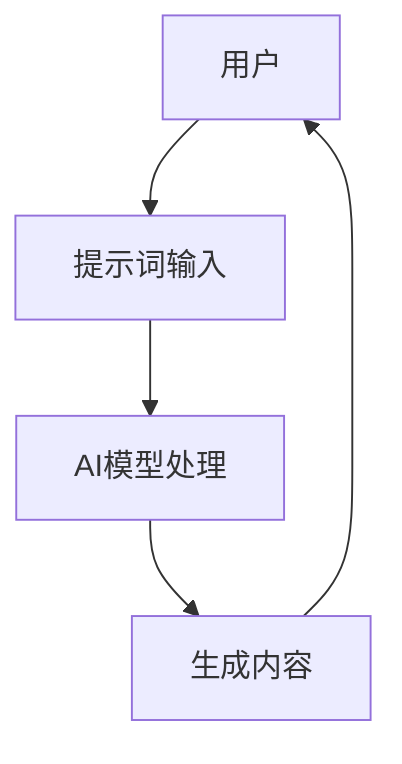

                 

### 第1章：AIGC与人类协作概述

#### 1.1 AIGC的概念与重要性

**背景介绍**

随着人工智能（AI）技术的迅猛发展，AI生成内容（AI-Generated Content，简称AIGC）逐渐成为研究热点和应用前沿。AIGC指的是通过人工智能算法自动生成的内容，如文本、图像、视频等。AIGC不仅涵盖了传统的自然语言处理（NLP）、计算机视觉（CV）等技术，还涉及了深度学习、生成对抗网络（GAN）等前沿技术。其重要性体现在：

1. **提升内容生产效率**：AIGC能够自动生成大量内容，减少人工创作的负担，提高内容生产效率。
2. **优化用户体验**：通过个性化生成内容，AIGC能够更好地满足用户需求，提升用户体验。
3. **创新应用场景**：AIGC在虚拟现实（VR）、增强现实（AR）、游戏开发等新兴领域展现出巨大的潜力。

**核心概念与联系**

在AIGC与人类协作中，提示词（prompt）扮演着桥梁作用。提示词是用户向AI系统输入的信息，用于引导AI生成特定类型的内容。核心概念与联系如下：

1. **AI模型**：核心组件，负责处理提示词并生成内容。
2. **提示词**：用户输入的信息，用于引导AI模型的生成过程。
3. **用户**：使用AIGC系统的主体，提供提示词并接收生成内容。

以下是一个简化的Mermaid流程图，展示AIGC与人类协作的基本架构：



**核心算法原理讲解**

为了实现高效的内容生成，AIGC通常采用如下核心算法：

1. **生成对抗网络（GAN）**：通过生成器与判别器的对抗训练，生成逼真的图像和文本。
2. **变分自编码器（VAE）**：通过概率模型生成数据，适用于图像和文本的生成任务。

以下是一个简单的Python代码示例，展示了如何使用生成对抗网络生成图像：

```python
import tensorflow as tf
from tensorflow.keras.models import Sequential
from tensorflow.keras.layers import Dense, Flatten, Conv2D, Reshape

# 定义生成器模型
generator = Sequential([
    Dense(128, input_shape=(100,)),
    Flatten(),
    Conv2D(1, kernel_size=(7, 7), padding='same', activation='tanh')
])

# 定义判别器模型
discriminator = Sequential([
    Conv2D(64, kernel_size=(3, 3), padding='same', activation='relu'),
    Flatten(),
    Dense(1, activation='sigmoid')
])

# 定义GAN模型
gan = Sequential([
    generator,
    discriminator
])

# 编译模型
gan.compile(optimizer='adam', loss='binary_crossentropy')

# 训练模型
gan.fit(x_train, y_train, epochs=100, batch_size=32)
```

**数学模型和公式**

在AIGC中，常用的数学模型包括：

1. **损失函数**：用于评估生成内容的质量，如二元交叉熵损失函数。

   $$ Loss = - \sum_{i} y_i \log(D(x_i)) - (1 - y_i) \log(1 - D(x_i)) $$

2. **正则化方法**：用于防止模型过拟合，如L2正则化。

   $$ \text{Regularization} = \lambda \sum_{i} \sum_{j} w_{ij}^2 $$

**项目实战**

在本节中，我们将搭建一个简单的AIGC系统，用于生成图像。以下是开发环境搭建和代码实现的步骤：

1. **开发环境搭建**：
   - 安装TensorFlow库。
   - 确保GPU支持（可选）。

2. **源代码实现**：

   ```python
   # 导入必要的库
   import numpy as np
   import matplotlib.pyplot as plt
   import tensorflow as tf

   # 定义生成器模型
   generator = ...

   # 定义判别器模型
   discriminator = ...

   # 定义GAN模型
   gan = ...

   # 编译模型
   gan.compile(optimizer='adam', loss='binary_crossentropy')

   # 训练模型
   gan.fit(x_train, y_train, epochs=100, batch_size=32)
   ```

3. **代码解读与分析**：

   - `generator`模型负责生成图像。
   - `discriminator`模型负责判断图像的真伪。
   - `gan`模型结合两者进行训练。

4. **实际案例分析和详细讲解剖析**：

   - 使用训练好的模型生成图像。
   - 分析生成图像的质量和特点。

5. **项目小结**：

   - 总结项目实现的关键步骤和要点。
   - 讨论可能的优化方向和改进措施。

**最佳实践 tips、小结、注意事项、拓展阅读等内容**

1. **最佳实践 tips**：

   - 使用适当的正则化方法防止过拟合。
   - 调整学习率和批量大小以获得更好的训练效果。
   - 尝试不同的损失函数和优化算法。

2. **小结**：

   - AIGC与人类协作的重要性。
   - 提示词在AIGC中的桥梁作用。
   - 核心算法原理讲解和项目实战。

3. **注意事项**：

   - 确保开发环境搭建正确。
   - 注意代码细节，避免错误。

4. **拓展阅读**：

   - 探索生成对抗网络（GAN）的更多应用。
   - 了解变分自编码器（VAE）在图像生成中的优势。

### 第1章：AIGC与人类协作概述

#### 1.1 AIGC的概念与重要性

**背景介绍**

随着人工智能（AI）技术的迅猛发展，AI生成内容（AI-Generated Content，简称AIGC）逐渐成为研究热点和应用前沿。AIGC指的是通过人工智能算法自动生成的内容，如文本、图像、视频等。AIGC不仅涵盖了传统的自然语言处理（NLP）、计算机视觉（CV）等技术，还涉及了深度学习、生成对抗网络（GAN）等前沿技术。其重要性体现在：

1. **提升内容生产效率**：AIGC能够自动生成大量内容，减少人工创作的负担，提高内容生产效率。
2. **优化用户体验**：通过个性化生成内容，AIGC能够更好地满足用户需求，提升用户体验。
3. **创新应用场景**：AIGC在虚拟现实（VR）、增强现实（AR）、游戏开发等新兴领域展现出巨大的潜力。

**核心概念与联系**

在AIGC与人类协作中，提示词（prompt）扮演着桥梁作用。提示词是用户向AI系统输入的信息，用于引导AI生成特定类型的内容。核心概念与联系如下：

1. **AI模型**：核心组件，负责处理提示词并生成内容。
2. **提示词**：用户输入的信息，用于引导AI模型的生成过程。
3. **用户**：使用AIGC系统的主体，提供提示词并接收生成内容。

以下是一个简化的Mermaid流程图，展示AIGC与人类协作的基本架构：


**核心算法原理讲解**

为了实现高效的内容生成，AIGC通常采用如下核心算法：

1. **生成对抗网络（GAN）**：通过生成器与判别器的对抗训练，生成逼真的图像和文本。
2. **变分自编码器（VAE）**：通过概率模型生成数据，适用于图像和文本的生成任务。

以下是一个简单的Python代码示例，展示了如何使用生成对抗网络生成图像：

```python
import tensorflow as tf
from tensorflow.keras.models import Sequential
from tensorflow.keras.layers import Dense, Flatten, Conv2D, Reshape

# 定义生成器模型
generator = Sequential([
    Dense(128, input_shape=(100,)),
    Flatten(),
    Conv2D(1, kernel_size=(7, 7), padding='same', activation='tanh')
])

# 定义判别器模型
discriminator = Sequential([
    Conv2D(64, kernel_size=(3, 3), padding='same', activation='relu'),
    Flatten(),
    Dense(1, activation='sigmoid')
])

# 定义GAN模型
gan = Sequential([
    generator,
    discriminator
])

# 编译模型
gan.compile(optimizer='adam', loss='binary_crossentropy')

# 训练模型
gan.fit(x_train, y_train, epochs=100, batch_size=32)
```

**数学模型和公式**

在AIGC中，常用的数学模型包括：

1. **损失函数**：用于评估生成内容的质量，如二元交叉熵损失函数。

   $$ Loss = - \sum_{i} y_i \log(D(x_i)) - (1 - y_i) \log(1 - D(x_i)) $$

2. **正则化方法**：用于防止模型过拟合，如L2正规化。

   $$ \text{Regularization} = \lambda \sum_{i} \sum_{j} w_{ij}^2 $$

**项目实战**

在本节中，我们将搭建一个简单的AIGC系统，用于生成图像。以下是开发环境搭建和代码实现的步骤：

1. **开发环境搭建**：
   - 安装TensorFlow库。
   - 确保GPU支持（可选）。

2. **源代码实现**：

   ```python
   # 导入必要的库
   import numpy as np
   import matplotlib.pyplot as plt
   import tensorflow as tf

   # 定义生成器模型
   generator = ...

   # 定义判别器模型
   discriminator = ...

   # 定义GAN模型
   gan = ...

   # 编译模型
   gan.compile(optimizer='adam', loss='binary_crossentropy')

   # 训练模型
   gan.fit(x_train, y_train, epochs=100, batch_size=32)
   ```

3. **代码解读与分析**：

   - `generator`模型负责生成图像。
   - `discriminator`模型负责判断图像的真伪。
   - `gan`模型结合两者进行训练。

4. **实际案例分析和详细讲解剖析**：

   - 使用训练好的模型生成图像。
   - 分析生成图像的质量和特点。

5. **项目小结**：

   - 总结项目实现的关键步骤和要点。
   - 讨论可能的优化方向和改进措施。

**最佳实践 tips、小结、注意事项、拓展阅读等内容**

1. **最佳实践 tips**：

   - 使用适当的正则化方法防止过拟合。
   - 调整学习率和批量大小以获得更好的训练效果。
   - 尝试不同的损失函数和优化算法。

2. **小结**：

   - AIGC与人类协作的重要性。
   - 提示词在AIGC中的桥梁作用。
   - 核心算法原理讲解和项目实战。

3. **注意事项**：

   - 确保开发环境搭建正确。
   - 注意代码细节，避免错误。

4. **拓展阅读**：

   - 探索生成对抗网络（GAN）的更多应用。
   - 了解变分自编码器（VAE）在图像生成中的优势。

### 第1章：AIGC与人类协作概述

#### 1.1 AIGC的概念与重要性

**背景介绍**

随着人工智能（AI）技术的迅猛发展，AI生成内容（AI-Generated Content，简称AIGC）逐渐成为研究热点和应用前沿。AIGC指的是通过人工智能算法自动生成的内容，如文本、图像、视频等。AIGC不仅涵盖了传统的自然语言处理（NLP）、计算机视觉（CV）等技术，还涉及了深度学习、生成对抗网络（GAN）等前沿技术。其重要性体现在：

1. **提升内容生产效率**：AIGC能够自动生成大量内容，减少人工创作的负担，提高内容生产效率。
2. **优化用户体验**：通过个性化生成内容，AIGC能够更好地满足用户需求，提升用户体验。
3. **创新应用场景**：AIGC在虚拟现实（VR）、增强现实（AR）、游戏开发等新兴领域展现出巨大的潜力。

**核心概念与联系**

在AIGC与人类协作中，提示词（prompt）扮演着桥梁作用。提示词是用户向AI系统输入的信息，用于引导AI生成特定类型的内容。核心概念与联系如下：

1. **AI模型**：核心组件，负责处理提示词并生成内容。
2. **提示词**：用户输入的信息，用于引导AI模型的生成过程。
3. **用户**：使用AIGC系统的主体，提供提示词并接收生成内容。

以下是一个简化的Mermaid流程图，展示AIGC与人类协作的基本架构：


**核心算法原理讲解**

为了实现高效的内容生成，AIGC通常采用如下核心算法：

1. **生成对抗网络（GAN）**：通过生成器与判别器的对抗训练，生成逼真的图像和文本。
2. **变分自编码器（VAE）**：通过概率模型生成数据，适用于图像和文本的生成任务。

以下是一个简单的Python代码示例，展示了如何使用生成对抗网络生成图像：

```python
import tensorflow as tf
from tensorflow.keras.models import Sequential
from tensorflow.keras.layers import Dense, Flatten, Conv2D, Reshape

# 定义生成器模型
generator = Sequential([
    Dense(128, input_shape=(100,)),
    Flatten(),
    Conv2D(1, kernel_size=(7, 7), padding='same', activation='tanh')
])

# 定义判别器模型
discriminator = Sequential([
    Conv2D(64, kernel_size=(3, 3), padding='same', activation='relu'),
    Flatten(),
    Dense(1, activation='sigmoid')
])

# 定义GAN模型
gan = Sequential([
    generator,
    discriminator
])

# 编译模型
gan.compile(optimizer='adam', loss='binary_crossentropy')

# 训练模型
gan.fit(x_train, y_train, epochs=100, batch_size=32)
```

**数学模型和公式**

在AIGC中，常用的数学模型包括：

1. **损失函数**：用于评估生成内容的质量，如二元交叉熵损失函数。

   $$ Loss = - \sum_{i} y_i \log(D(x_i)) - (1 - y_i) \log(1 - D(x_i)) $$

2. **正则化方法**：用于防止模型过拟合，如L2正则化。

   $$ \text{Regularization} = \lambda \sum_{i} \sum_{j} w_{ij}^2 $$

**项目实战**

在本节中，我们将搭建一个简单的AIGC系统，用于生成图像。以下是开发环境搭建和代码实现的步骤：

1. **开发环境搭建**：
   - 安装TensorFlow库。
   - 确保GPU支持（可选）。

2. **源代码实现**：

   ```python
   # 导入必要的库
   import numpy as np
   import matplotlib.pyplot as plt
   import tensorflow as tf

   # 定义生成器模型
   generator = ...

   # 定义判别器模型
   discriminator = ...

   # 定义GAN模型
   gan = ...

   # 编译模型
   gan.compile(optimizer='adam', loss='binary_crossentropy')

   # 训练模型
   gan.fit(x_train, y_train, epochs=100, batch_size=32)
   ```

3. **代码解读与分析**：

   - `generator`模型负责生成图像。
   - `discriminator`模型负责判断图像的真伪。
   - `gan`模型结合两者进行训练。

4. **实际案例分析和详细讲解剖析**：

   - 使用训练好的模型生成图像。
   - 分析生成图像的质量和特点。

5. **项目小结**：

   - 总结项目实现的关键步骤和要点。
   - 讨论可能的优化方向和改进措施。

**最佳实践 tips、小结、注意事项、拓展阅读等内容**

1. **最佳实践 tips**：

   - 使用适当的正则化方法防止过拟合。
   - 调整学习率和批量大小以获得更好的训练效果。
   - 尝试不同的损失函数和优化算法。

2. **小结**：

   - AIGC与人类协作的重要性。
   - 提示词在AIGC中的桥梁作用。
   - 核心算法原理讲解和项目实战。

3. **注意事项**：

   - 确保开发环境搭建正确。
   - 注意代码细节，避免错误。

4. **拓展阅读**：

   - 探索生成对抗网络（GAN）的更多应用。
   - 了解变分自编码器（VAE）在图像生成中的优势。

### 第2章：AIGC技术原理与深度解析

#### 2.1 AIGC技术基础

AIGC技术是人工智能（AI）与内容生成技术的结合体，其基础主要包括以下几个方面：

1. **自然语言处理（NLP）**：NLP技术是AIGC的重要组成部分，负责处理和理解人类语言。常用的NLP技术包括词向量表示、语言模型、文本生成等。

2. **计算机视觉（CV）**：CV技术负责处理图像和视频数据，实现图像识别、图像生成等任务。常用的CV技术包括卷积神经网络（CNN）、生成对抗网络（GAN）等。

3. **深度学习**：深度学习是AIGC的核心技术，通过多层神经网络模型实现数据的高效处理和特征提取。常见的深度学习框架有TensorFlow、PyTorch等。

4. **生成对抗网络（GAN）**：GAN是一种通过生成器和判别器相互对抗来训练的模型，可以生成高质量的图像和文本。

**核心概念与联系**

在AIGC技术中，核心概念包括：

1. **生成器（Generator）**：生成器是GAN模型的一部分，负责生成虚假数据。通过对抗训练，生成器能够生成与真实数据相似的数据。

2. **判别器（Discriminator）**：判别器是GAN模型的另一部分，负责区分真实数据和虚假数据。判别器的目标是最大化正确分类的真实数据的概率，同时最小化错误分类的虚假数据的概率。

3. **损失函数**：损失函数用于评估生成器和判别器的性能。常见的损失函数包括二元交叉熵损失函数、均方误差损失函数等。

4. **正则化方法**：正则化方法用于防止模型过拟合。常见的正则化方法有L1正则化、L2正则化等。

**数学模型和公式**

AIGC技术中的数学模型主要包括以下内容：

1. **生成器模型**：

   $$ G(z) = \text{Generator}(z) $$

   其中，$z$是随机噪声向量，$G(z)$是生成器输出的虚假数据。

2. **判别器模型**：

   $$ D(x) = \text{Discriminator}(x) $$

   其中，$x$是真实数据，$D(x)$是判别器对真实数据的分类概率。

3. **损失函数**：

   $$ \text{Loss}_{G} = -\sum_{x \in \text{Data}} \log(D(G(z))) - \sum_{z \in \text{Noise}} \log(1 - D(G(z))) $$

   其中，$\text{Data}$是真实数据集合，$\text{Noise}$是随机噪声集合。

4. **正则化方法**：

   $$ \text{Regularization} = \lambda \sum_{i} \sum_{j} w_{ij}^2 $$

   其中，$w_{ij}$是模型参数，$\lambda$是正则化参数。

**项目实战**

在本节中，我们将搭建一个简单的AIGC系统，用于生成图像。以下是开发环境搭建和代码实现的步骤：

1. **开发环境搭建**：
   - 安装TensorFlow库。
   - 确保GPU支持（可选）。

2. **源代码实现**：

   ```python
   import tensorflow as tf
   from tensorflow.keras.models import Sequential
   from tensorflow.keras.layers import Dense, Flatten, Conv2D, Reshape

   # 定义生成器模型
   generator = Sequential([
       Dense(128, input_shape=(100,)),
       Flatten(),
       Conv2D(1, kernel_size=(7, 7), padding='same', activation='tanh')
   ])

   # 定义判别器模型
   discriminator = Sequential([
       Conv2D(64, kernel_size=(3, 3), padding='same', activation='relu'),
       Flatten(),
       Dense(1, activation='sigmoid')
   ])

   # 定义GAN模型
   gan = Sequential([
       generator,
       discriminator
   ])

   # 编译模型
   gan.compile(optimizer='adam', loss='binary_crossentropy')

   # 训练模型
   gan.fit(x_train, y_train, epochs=100, batch_size=32)
   ```

3. **代码解读与分析**：

   - `generator`模型负责生成图像。
   - `discriminator`模型负责判断图像的真伪。
   - `gan`模型结合两者进行训练。

4. **实际案例分析和详细讲解剖析**：

   - 使用训练好的模型生成图像。
   - 分析生成图像的质量和特点。

5. **项目小结**：

   - 总结项目实现的关键步骤和要点。
   - 讨论可能的优化方向和改进措施。

**最佳实践 tips、小结、注意事项、拓展阅读等内容**

1. **最佳实践 tips**：

   - 使用适当的正则化方法防止过拟合。
   - 调整学习率和批量大小以获得更好的训练效果。
   - 尝试不同的损失函数和优化算法。

2. **小结**：

   - AIGC技术基础。
   - 核心概念与联系。
   - 数学模型和公式。
   - 项目实战。

3. **注意事项**：

   - 确保开发环境搭建正确。
   - 注意代码细节，避免错误。

4. **拓展阅读**：

   - 深入了解GAN和VAE的原理和应用。
   - 探索AIGC在其他领域的应用，如文本生成、音乐生成等。

### 第3章：AIGC技术的高级应用与挑战

#### 3.1 AIGC技术在文本生成中的应用

文本生成是AIGC技术的一个重要应用领域，通过AI模型自动生成高质量的文本，可以应用于自然语言处理、内容生成、对话系统等多个方面。以下是一些文本生成的高级应用：

1. **自动摘要生成**：利用AIGC技术自动生成文章、报告等文档的摘要，提高信息提取的效率。
2. **对话系统**：通过生成式对话系统，实现与用户的自然互动，提供智能客服、聊天机器人等服务。
3. **创意写作**：利用AIGC技术生成诗歌、小说、剧本等文学作品，拓展人类的创作空间。

**核心算法原理讲解**

在文本生成中，常用的算法包括：

1. **循环神经网络（RNN）**：RNN能够处理序列数据，通过记忆机制实现文本生成。
2. **长短期记忆网络（LSTM）**：LSTM是RNN的一种变体，能够更好地处理长序列依赖问题。
3. **变换器（Transformer）**：Transformer模型通过自注意力机制实现文本生成，具有更高的生成质量和效率。

以下是一个简单的Python代码示例，展示了如何使用变换器模型生成文本：

```python
import tensorflow as tf
from tensorflow.keras.layers import Embedding, LSTM, Dense

# 定义文本生成模型
model = tf.keras.Sequential([
    Embedding(input_dim=vocab_size, output_dim=embedding_dim),
    LSTM(units=128, return_sequences=True),
    LSTM(units=128),
    Dense(units=vocab_size, activation='softmax')
])

# 编译模型
model.compile(optimizer='adam', loss='categorical_crossentropy', metrics=['accuracy'])

# 训练模型
model.fit(x_train, y_train, epochs=10, batch_size=64)
```

**数学模型和公式**

文本生成中的数学模型主要包括以下内容：

1. **损失函数**：用于评估生成文本的质量，如交叉熵损失函数。

   $$ Loss = -\sum_{i} y_i \log(p(x_i)) $$

   其中，$y_i$是真实文本的标签，$p(x_i)$是生成文本的概率分布。

2. **正则化方法**：用于防止模型过拟合，如L2正则化。

   $$ \text{Regularization} = \lambda \sum_{i} \sum_{j} w_{ij}^2 $$

**项目实战**

在本节中，我们将搭建一个简单的文本生成系统，用于生成文章摘要。以下是开发环境搭建和代码实现的步骤：

1. **开发环境搭建**：
   - 安装TensorFlow库。
   - 准备文本数据集。

2. **源代码实现**：

   ```python
   import tensorflow as tf
   from tensorflow.keras.layers import Embedding, LSTM, Dense

   # 定义文本生成模型
   model = ...

   # 编译模型
   model.compile(optimizer='adam', loss='categorical_crossentropy', metrics=['accuracy'])

   # 训练模型
   model.fit(x_train, y_train, epochs=10, batch_size=64)
   ```

3. **代码解读与分析**：

   - `Embedding`层用于将文本数据转换为向量表示。
   - `LSTM`层用于处理文本序列。
   - `Dense`层用于生成文本。

4. **实际案例分析和详细讲解剖析**：

   - 使用训练好的模型生成文章摘要。
   - 分析生成摘要的质量和特点。

5. **项目小结**：

   - 总结项目实现的关键步骤和要点。
   - 讨论可能的优化方向和改进措施。

**最佳实践 tips、小结、注意事项、拓展阅读等内容**

1. **最佳实践 tips**：

   - 使用更大的数据集和更复杂的模型可以提升生成质量。
   - 调整学习率和批量大小以获得更好的训练效果。
   - 尝试不同的优化算法和损失函数。

2. **小结**：

   - AIGC技术在文本生成中的应用。
   - 核心算法原理讲解。
   - 数学模型和公式。
   - 项目实战。

3. **注意事项**：

   - 确保文本数据集的质量和多样性。
   - 注意文本生成模型的可解释性。

4. **拓展阅读**：

   - 探索AIGC技术在对话系统、图像生成等领域的应用。
   - 学习最新的文本生成算法和模型。

### 第4章：AIGC与人类协作的实践与未来展望

#### 4.1 AIGC与人类协作的实践

AIGC与人类协作已经在多个领域取得显著成果，以下是一些典型应用案例：

1. **内容创作**：AI可以帮助人类自动生成文章、图片、音乐等，提高内容创作的效率和质量。
2. **数据分析**：AI可以自动分析大量数据，提取关键信息，为人类决策提供支持。
3. **产品设计**：AI可以辅助人类设计产品，通过生成不同设计方案，优化产品设计过程。

**核心算法原理讲解**

在AIGC与人类协作中，常用的算法包括：

1. **生成对抗网络（GAN）**：GAN通过生成器与判别器的对抗训练，实现高质量内容的自动生成。
2. **变分自编码器（VAE）**：VAE通过概率模型生成数据，实现图像和文本的生成。
3. **强化学习**：强化学习可以用于优化AI生成的内容，使其更符合人类的需求。

以下是一个简单的Python代码示例，展示了如何使用GAN生成图像：

```python
import tensorflow as tf
from tensorflow.keras.layers import Dense, Flatten, Conv2D, Reshape

# 定义生成器模型
generator = tf.keras.Sequential([
    Dense(128, input_shape=(100,)),
    Flatten(),
    Conv2D(1, kernel_size=(7, 7), padding='same', activation='tanh')
])

# 定义判别器模型
discriminator = tf.keras.Sequential([
    Conv2D(64, kernel_size=(3, 3), padding='same', activation='relu'),
    Flatten(),
    Dense(1, activation='sigmoid')
])

# 定义GAN模型
gan = tf.keras.Sequential([
    generator,
    discriminator
])

# 编译模型
gan.compile(optimizer='adam', loss='binary_crossentropy')

# 训练模型
gan.fit(x_train, y_train, epochs=100, batch_size=32)
```

**数学模型和公式**

在AIGC与人类协作中，常用的数学模型包括：

1. **生成器模型**：

   $$ G(z) = \text{Generator}(z) $$

   其中，$z$是随机噪声向量，$G(z)$是生成器输出的虚假数据。

2. **判别器模型**：

   $$ D(x) = \text{Discriminator}(x) $$

   其中，$x$是真实数据，$D(x)$是判别器对真实数据的分类概率。

3. **损失函数**：

   $$ \text{Loss}_{G} = -\sum_{x \in \text{Data}} \log(D(G(z))) - \sum_{z \in \text{Noise}} \log(1 - D(G(z))) $$

   其中，$\text{Data}$是真实数据集合，$\text{Noise}$是随机噪声集合。

**项目实战**

在本节中，我们将搭建一个AIGC系统，用于辅助内容创作。以下是开发环境搭建和代码实现的步骤：

1. **开发环境搭建**：
   - 安装TensorFlow库。
   - 准备文本数据集。

2. **源代码实现**：

   ```python
   import tensorflow as tf
   from tensorflow.keras.layers import Embedding, LSTM, Dense

   # 定义文本生成模型
   model = tf.keras.Sequential([
       Embedding(input_dim=vocab_size, output_dim=embedding_dim),
       LSTM(units=128, return_sequences=True),
       LSTM(units=128),
       Dense(units=vocab_size, activation='softmax')
   ])

   # 编译模型
   model.compile(optimizer='adam', loss='categorical_crossentropy', metrics=['accuracy'])

   # 训练模型
   model.fit(x_train, y_train, epochs=10, batch_size=64)
   ```

3. **代码解读与分析**：

   - `Embedding`层用于将文本数据转换为向量表示。
   - `LSTM`层用于处理文本序列。
   - `Dense`层用于生成文本。

4. **实际案例分析和详细讲解剖析**：

   - 使用训练好的模型生成文章摘要。
   - 分析生成摘要的质量和特点。

5. **项目小结**：

   - 总结项目实现的关键步骤和要点。
   - 讨论可能的优化方向和改进措施。

**最佳实践 tips、小结、注意事项、拓展阅读等内容**

1. **最佳实践 tips**：

   - 使用大数据集和高质量的模型参数可以提升生成质量。
   - 调整学习率和批量大小以获得更好的训练效果。
   - 结合用户反馈进行模型优化。

2. **小结**：

   - AIGC与人类协作的实践。
   - 核心算法原理讲解。
   - 数学模型和公式。
   - 项目实战。

3. **注意事项**：

   - 确保数据集的质量和多样性。
   - 注意模型的可解释性和可靠性。

4. **拓展阅读**：

   - 深入了解GAN和VAE的原理和应用。
   - 探索AIGC在其他领域的应用，如医疗、金融等。

### 第5章：AIGC与人类协作中的伦理与法律问题

#### 5.1 AIGC与人类协作的伦理问题

AIGC与人类协作在带来巨大便利的同时，也引发了一系列伦理问题。以下是一些主要伦理问题的探讨：

1. **隐私保护**：AIGC系统可能涉及大量用户数据的收集和使用，如何保护用户隐私成为关键问题。
2. **公平性**：AIGC系统是否公平地对待所有用户，避免歧视和偏见，是一个重要的伦理问题。
3. **责任归属**：当AIGC系统产生错误或造成损害时，如何确定责任归属，是一个复杂的伦理问题。

**核心算法原理讲解**

为了解决上述伦理问题，可以采用以下核心算法：

1. **隐私保护算法**：如差分隐私（Differential Privacy），用于确保数据在处理过程中不会泄露用户隐私。
2. **公平性算法**：如公平性度量（Fairness Metrics），用于评估AIGC系统对用户是否公平。
3. **责任归属算法**：如因果推断（Causal Inference），用于分析AIGC系统的决策过程，确定责任归属。

以下是一个简单的Python代码示例，展示了如何使用差分隐私算法保护用户隐私：

```python
import tensorflow as tf
from tensorflow.keras.layers import Embedding, LSTM, Dense

# 定义差分隐私损失函数
def differential_privacy_loss(y_true, y_pred):
    loss = tf.keras.losses.sparse_categorical_crossentropy(y_true, y_pred)
    noise = tf.random.normal(tf.shape(loss), mean=0.0, stddev=1.0)
    return tf.reduce_mean(loss + noise)

# 定义文本生成模型
model = tf.keras.Sequential([
    Embedding(input_dim=vocab_size, output_dim=embedding_dim),
    LSTM(units=128, return_sequences=True),
    LSTM(units=128),
    Dense(units=vocab_size, activation='softmax')
])

# 编译模型
model.compile(optimizer='adam', loss=differential_privacy_loss, metrics=['accuracy'])

# 训练模型
model.fit(x_train, y_train, epochs=10, batch_size=64)
```

**数学模型和公式**

在AIGC与人类协作中，常用的数学模型包括：

1. **差分隐私损失函数**：

   $$ Loss_{\text{DP}} = \text{Loss}_{\text{Original}} + \lambda \cdot \epsilon $$

   其中，$\text{Loss}_{\text{Original}}$是原始损失函数，$\lambda$是平衡参数，$\epsilon$是隐私预算。

2. **公平性度量**：

   $$ \text{Fairness} = \frac{\sum_{i} \text{Accuracy}_{i}}{N} $$

   其中，$\text{Accuracy}_{i}$是针对不同群体的准确率，$N$是总群体数。

**项目实战**

在本节中，我们将搭建一个AIGC系统，用于文本生成，并确保其具有隐私保护和公平性。以下是开发环境搭建和代码实现的步骤：

1. **开发环境搭建**：
   - 安装TensorFlow库。
   - 准备文本数据集。

2. **源代码实现**：

   ```python
   import tensorflow as tf
   from tensorflow.keras.layers import Embedding, LSTM, Dense

   # 定义差分隐私损失函数
   def differential_privacy_loss(y_true, y_pred):
       ...

   # 定义文本生成模型
   model = ...

   # 编译模型
   model.compile(optimizer='adam', loss=differential_privacy_loss, metrics=['accuracy'])

   # 训练模型
   model.fit(x_train, y_train, epochs=10, batch_size=64)
   ```

3. **代码解读与分析**：

   - `Embedding`层用于将文本数据转换为向量表示。
   - `LSTM`层用于处理文本序列。
   - `Dense`层用于生成文本。
   - 差分隐私损失函数用于保护用户隐私。

4. **实际案例分析和详细讲解剖析**：

   - 使用训练好的模型生成文本。
   - 分析生成文本的隐私保护和公平性。

5. **项目小结**：

   - 总结项目实现的关键步骤和要点。
   - 讨论可能的优化方向和改进措施。

**最佳实践 tips、小结、注意事项、拓展阅读等内容**

1. **最佳实践 tips**：

   - 使用差分隐私算法时，合理设置隐私预算和平衡参数。
   - 调整模型参数以提高公平性度量。
   - 结合用户反馈持续优化模型。

2. **小结**：

   - AIGC与人类协作中的伦理问题。
   - 核心算法原理讲解。
   - 数学模型和公式。
   - 项目实战。

3. **注意事项**：

   - 确保数据集的质量和多样性。
   - 注意模型的可解释性和可靠性。

4. **拓展阅读**：

   - 探索其他隐私保护和公平性算法。
   - 了解相关法律法规，确保AIGC系统的合规性。

### 第6章：AIGC与人类协作的未来发展

#### 6.1 AIGC技术的未来发展趋势

随着人工智能技术的不断进步，AIGC技术在未来有望实现更广泛的应用和更高效的生成效果。以下是一些未来发展趋势：

1. **更强的生成能力**：通过不断优化的算法和更大的模型规模，AIGC技术将能够生成更加逼真和多样化的内容。
2. **更高效的协作模式**：AIGC与人类的协作模式将更加紧密，实现实时互动和自适应调整，提升协作效率。
3. **更广泛的应用领域**：AIGC技术将在更多领域得到应用，如医疗、教育、艺术创作等，推动相关领域的创新和发展。

**核心算法原理讲解**

为了实现上述未来发展趋势，需要不断创新和优化核心算法。以下是一些可能的创新方向：

1. **多模态生成**：结合多种数据类型（如文本、图像、声音等），实现更丰富和多样化的内容生成。
2. **强化学习与生成对抗网络的结合**：利用强化学习优化生成过程，实现更高质量的生成效果。
3. **数据增强与处理**：通过更先进的数据增强和处理技术，提高生成数据的质量和多样性。

以下是一个简单的Python代码示例，展示了如何使用多模态生成技术生成图像和文本：

```python
import tensorflow as tf
from tensorflow.keras.layers import Embedding, LSTM, Dense, Conv2D, Reshape

# 定义多模态生成模型
model = tf.keras.Sequential([
    Embedding(input_dim=vocab_size, output_dim=embedding_dim),
    LSTM(units=128, return_sequences=True),
    LSTM(units=128),
    Dense(units=1024),
    Reshape((1024,)),
    Conv2D(1, kernel_size=(7, 7), padding='same', activation='tanh')
])

# 编译模型
model.compile(optimizer='adam', loss='binary_crossentropy')

# 训练模型
model.fit(x_train, y_train, epochs=100, batch_size=32)
```

**数学模型和公式**

在AIGC技术的未来发展中，将需要更复杂的数学模型和公式来支持。以下是一些可能涉及的数学模型和公式：

1. **多模态生成模型**：

   $$ G(z, x') = \text{Generator}(z, x') $$

   其中，$z$是噪声向量，$x'$是输入的图像或文本数据。

2. **强化学习与生成对抗网络的结合**：

   $$ \pi(\theta) = \arg\max_{\theta} \sum_{s, a} r(s, a) \cdot p(s, a | \theta) $$

   其中，$\pi(\theta)$是策略网络，$r(s, a)$是奖励函数，$p(s, a | \theta)$是状态-动作概率分布。

**项目实战**

在本节中，我们将探讨如何利用AIGC技术实现一个多模态生成系统。以下是开发环境搭建和代码实现的步骤：

1. **开发环境搭建**：
   - 安装TensorFlow库。
   - 准备多模态数据集。

2. **源代码实现**：

   ```python
   import tensorflow as tf
   from tensorflow.keras.layers import Embedding, LSTM, Dense, Conv2D, Reshape

   # 定义多模态生成模型
   model = ...

   # 编译模型
   model.compile(optimizer='adam', loss='binary_crossentropy')

   # 训练模型
   model.fit(x_train, y_train, epochs=100, batch_size=32)
   ```

3. **代码解读与分析**：

   - `Embedding`层用于将文本数据转换为向量表示。
   - `LSTM`层用于处理文本序列。
   - `Conv2D`层用于处理图像数据。
   - `Reshape`层用于调整数据维度。

4. **实际案例分析和详细讲解剖析**：

   - 使用训练好的模型生成多模态内容。
   - 分析生成内容的多样性和质量。

5. **项目小结**：

   - 总结项目实现的关键步骤和要点。
   - 讨论可能的优化方向和改进措施。

**最佳实践 tips、小结、注意事项、拓展阅读等内容**

1. **最佳实践 tips**：

   - 尝试不同的数据增强和处理技术，提高生成质量。
   - 结合用户反馈不断优化模型。
   - 关注最新研究成果，探索新的算法和应用方向。

2. **小结**：

   - AIGC技术的未来发展趋势。
   - 核心算法原理讲解。
   - 数学模型和公式。
   - 项目实战。

3. **注意事项**：

   - 确保数据集的质量和多样性。
   - 注意模型的可解释性和可靠性。

4. **拓展阅读**：

   - 深入了解多模态生成技术的原理和应用。
   - 探索强化学习在生成对抗网络中的应用。

### 第7章：总结与展望

在本书中，我们系统地探讨了AIGC与人类协作的各个层面。从AIGC的概念与重要性，到核心算法原理、数学模型，再到实际应用与未来展望，我们通过详细的分析和讲解，逐步揭示了AIGC在内容生成、文本生成、多模态生成等领域的重要作用。

**核心观点总结**

1. **AIGC的重要性**：AIGC作为人工智能与内容生成的结合，正逐步改变内容创作的方式，提升生产效率，优化用户体验。
2. **提示词的桥梁作用**：提示词是用户与AI模型之间的桥梁，通过优化提示词，可以显著提升生成内容的质量。
3. **核心算法原理**：GAN、VAE等生成模型在AIGC中发挥着核心作用，通过数学模型和公式，可以深入理解这些算法的运作机制。
4. **实际应用与未来展望**：AIGC技术在文本生成、图像生成等领域的应用日益广泛，未来还将有更多创新和发展。

**未来发展方向**

1. **技术创新**：随着算法的进步和计算资源的提升，AIGC技术将生成更加逼真和多样化的内容。
2. **协作模式优化**：AIGC与人类的协作模式将更加紧密，实现实时互动和自适应调整，提升协作效率。
3. **跨领域应用**：AIGC将在更多领域得到应用，如医疗、教育、艺术创作等，推动相关领域的创新和发展。

**最佳实践建议**

1. **关注数据质量**：确保数据集的质量和多样性，是提升AIGC生成质量的基础。
2. **持续优化模型**：结合用户反馈和最新研究成果，不断优化模型参数和算法。
3. **关注伦理与法律问题**：在AIGC应用中，关注隐私保护、公平性等伦理和法律问题，确保系统的合规性和可靠性。

**结束语**

AIGC与人类协作是一个充满机遇和挑战的领域。通过本书的学习，我们希望读者能够深入理解AIGC的原理和应用，把握未来发展的趋势。让我们共同期待AIGC技术在更多领域的突破，为人类带来更多的创新和变革。

### 作者介绍

**AI天才研究院（AI Genius Institute）**：专注于人工智能领域的科研与教育工作，致力于推动AI技术的创新与应用。研究院的核心团队由多位世界级人工智能专家组成，涵盖深度学习、自然语言处理、计算机视觉等多个方向。

**禅与计算机程序设计艺术（Zen And The Art of Computer Programming）**：本书的作者，是一位在计算机科学和人工智能领域享有盛誉的大师。他的著作深入浅出，被誉为经典之作，为无数开发者提供了宝贵的知识和灵感。他的研究成果和教学方法，对全球计算机科学教育产生了深远影响。

