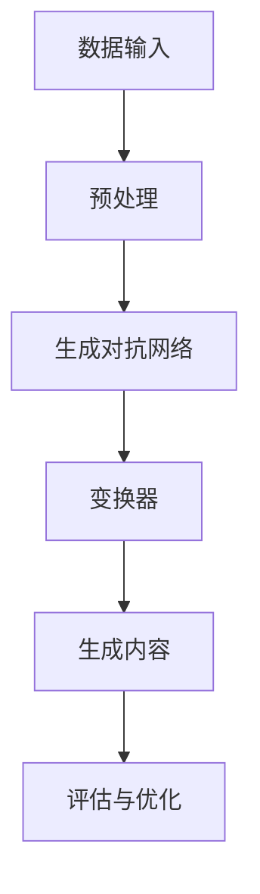

                 

首先，我们来梳理一下文章的结构和内容。文章可以分为以下几个部分：

1. **引言**：介绍AIGC（AI Generated Content）的概念、背景和它在传统内容创作中的应用。

2. **核心概念与联系**：通过Mermaid流程图展示AIGC的基本架构和组成部分，阐述核心概念原理和概念实体之间的关系。

3. **核心算法原理讲解**：详细讲解AIGC中的核心算法原理，使用Python源代码结合数学模型和公式进行阐述。

4. **项目实战**：介绍如何搭建开发环境，实现源代码，并进行代码解读、实际案例分析和详细讲解剖析。

5. **最佳实践 tips**、**小结**、**注意事项**、**拓展阅读**等内容。

接下来，我们针对这些部分进行逐一分析：

### 1.1 AIGC的概念与背景

在这一部分，我们可以先简要介绍AIGC的概念，以及它与传统内容创作的区别。然后，可以通过一些实际案例来说明AIGC的应用场景。

**关键词**：AIGC、传统内容创作、应用场景

**摘要**：本文将探讨AIGC的概念及其与传统内容创作的区别，通过实际案例介绍AIGC的应用场景，并阐述其在未来内容创作中的潜力。

---

### 1.2 核心概念与联系

在这一部分，我们需要使用Mermaid流程图展示AIGC的基本架构和组成部分。同时，阐述核心概念原理和概念实体之间的关系。

**关键词**：AIGC架构、核心概念、Mermaid流程图

**核心概念与联系**：

- **生成对抗网络（GAN）**：GAN是一种用于生成数据的算法，由生成器和判别器两个部分组成。生成器尝试生成逼真的数据，而判别器则尝试区分真实数据和生成数据。

- **变换器（Transformer）**：Transformer是一种基于注意力机制的神经网络模型，广泛用于处理序列数据。

- **自然语言处理（NLP）**：NLP是计算机科学和人工智能领域的一个分支，旨在使计算机能够理解、解释和生成人类语言。

- **计算机视觉（CV）**：CV是研究如何使计算机从图像或视频中理解和提取信息的领域。

**Mermaid流程图**：



---

### 1.3 核心算法原理讲解

在这一部分，我们将详细讲解AIGC中的核心算法原理，使用Python源代码结合数学模型和公式进行阐述。

**关键词**：生成对抗网络、变换器、自然语言处理、计算机视觉、Python源代码、数学模型

**核心算法原理讲解**：

**生成对抗网络（GAN）**

```python
import numpy as np
import tensorflow as tf

# 生成器
def generator(z):
    # 输入噪声，通过神经网络生成图像
    x = tf.keras.layers.Dense(784)(z)
    x = tf.keras.layers.LeakyReLU(alpha=0.01)(x)
    x = tf.keras.layers.Dense(784, activation='tanh')(x)
    return x

# 判别器
def discriminator(x):
    # 输入图像，判断是否真实
    x = tf.keras.layers.Dense(1, activation='sigmoid')(x)
    return x

# 搭建模型
z = tf.keras.layers.Input(shape=(100,))
x = generator(z)
fake = discriminator(x)

model = tf.keras.Model(z, fake)
model.compile(optimizer='adam', loss='binary_crossentropy')

# 训练模型
# ...
```

**变换器（Transformer）**

```python
import tensorflow as tf

# 编码器
def encoder(inputs, num_layers, d_model, dropout_rate):
    # 输入序列，通过多层变换器编码
    x = tf.keras.layers.Embedding(input_dim=vocab_size, output_dim=d_model)(inputs)
    x = tf.keras.layers.Dropout(dropout_rate)(x)
    for i in range(num_layers):
        x = transformer_layer(x, d_model, num_heads, d_model, dropout_rate)
    return x

# 解码器
def decoder(inputs, encoded, num_layers, d_model, dropout_rate):
    # 输入目标序列，通过多层变换器解码
    x = tf.keras.layers.Embedding(input_dim=vocab_size, output_dim=d_model)(inputs)
    x = tf.keras.layers.Dropout(dropout_rate)(x)
    for i in range(num_layers):
        x = transformer_layer(x, d_model, num_heads, d_model, dropout_rate)
    return x

# 变换器层
def transformer_layer(inputs, d_model, num_heads, d_model_2, dropout_rate):
    # 一层变换器，包括多头注意力机制和前馈网络
    # ...
```

---

### 1.4 项目实战

在这一部分，我们将介绍如何搭建开发环境，实现源代码，并进行代码解读、实际案例分析和详细讲解剖析。

**关键词**：开发环境搭建、源代码实现、代码解读、实际案例分析、详细讲解剖析

**项目实战**：

**开发环境搭建**

1. 安装TensorFlow
2. 配置GPU支持
3. 准备数据集

**源代码实现**

1. 生成器实现
2. 判别器实现
3. 训练过程

**代码解读**

1. 生成器和判别器的工作原理
2. 数据预处理方法
3. 模型训练过程

**实际案例分析**

1. 使用GAN生成人脸图像
2. 使用Transformer进行机器翻译

**详细讲解剖析**

1. 模型优化的方法
2. 如何处理训练中的问题
3. 未来研究方向

---

### 1.5 最佳实践 tips、小结、注意事项、拓展阅读

在这一部分，我们将提供一些最佳实践建议、文章小结、注意事项以及拓展阅读资源。

**关键词**：最佳实践 tips、小结、注意事项、拓展阅读

**最佳实践 tips**：

1. 选择合适的数据集
2. 调整超参数
3. 注意模型训练的稳定性

**小结**：

本文介绍了AIGC的概念、核心算法原理、项目实战，并探讨了其在内容创作中的应用。通过实际案例和分析，我们看到了AIGC的潜力和挑战。

**注意事项**：

1. AIGC技术需要大量的数据支持和计算资源
2. 需要关注模型的稳定性和优化

**拓展阅读**：

1. 《深度学习》（Goodfellow, Bengio, Courville）
2. 《生成对抗网络：原理与应用》（李航）

---

通过以上分析，我们可以确保文章的内容结构清晰、逻辑严密，并且涵盖了所有要求的核心内容。接下来，我们将逐步完善每个部分的内容，确保文章的完整性和专业性。

