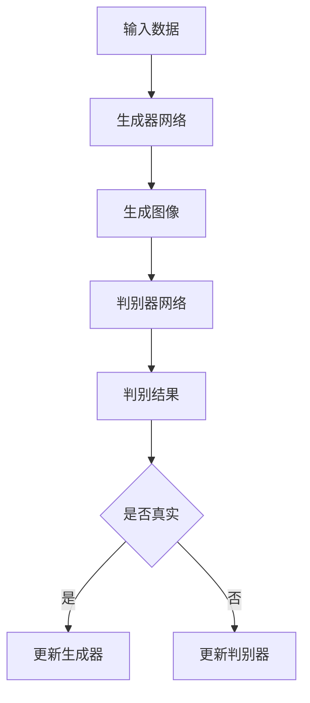
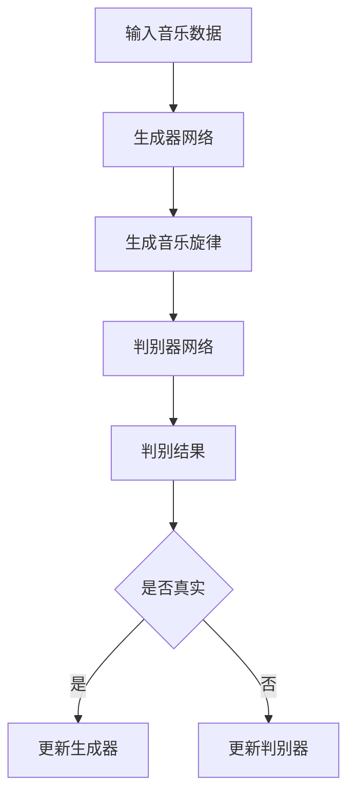

                 


### AIGC与传统艺术的融合与冲突：背景介绍

随着人工智能（AI）技术的迅猛发展，人工智能生成内容（AIGC）逐渐成为艺术创作领域的一个重要分支。AIGC，即Artificial Intelligence Generated Content，指的是利用人工智能技术自动生成各种类型的内容，包括图像、音乐、文本等。这一新兴领域不仅打破了传统艺术创作的局限，还带来了前所未有的创作可能性和挑战。

#### AIGC的定义与发展

AIGC的定义可以追溯到生成对抗网络（GAN）等技术的兴起。GAN是一种深度学习模型，通过两个神经网络（生成器和判别器）的对抗训练，实现了数据的生成和鉴别。AIGC在此基础上，通过不断地优化和拓展，形成了今天丰富多样的生成内容形式。AIGC的发展历程可以追溯到2014年，当Ian J. Goodfellow等人在NeurIPS上首次提出GAN时，这一技术就开始在图像生成领域展现出了强大的潜力。

随着技术的进步，AIGC的应用范围逐渐扩大。目前，AIGC不仅限于图像生成，还包括音乐创作、文学写作、视频编辑等多个领域。在视觉艺术方面，AIGC已经能够生成逼真的图像和动画；在音乐领域，AIGC可以创作出风格多样的音乐作品；在文学领域，AIGC则能够生成文章、小说甚至诗歌。这些应用不仅改变了艺术创作的模式，也为艺术创作带来了更多的可能性。

#### 传统艺术的定义与特点

传统艺术，通常指的是人类在历史长河中形成的、基于手工技艺和创意的视觉艺术、音乐、文学等表现形式。传统艺术具有以下几个特点：

1. **手工性**：传统艺术强调手工技艺，每一个作品都是艺术家亲手创作而成，具有独特性。
2. **原创性**：传统艺术作品通常具有高度的原创性，反映了艺术家的个性和创意。
3. **文化价值**：传统艺术承载着丰富的文化内涵，是民族和人类文化的重要组成部分。
4. **传承性**：传统艺术通过师徒传承、艺术流派等方式，得以延续和传承。

#### AIGC与传统艺术的结合

AIGC与传统艺术的结合，意味着人工智能技术参与到艺术创作过程中，与人类艺术家共同创作。这种结合不仅拓展了艺术创作的边界，也带来了新的艺术形式和创作方法。例如，在绘画领域，艺术家可以利用AIGC生成图像作为创作的起点，进一步进行手工修饰和完善；在音乐创作中，AIGC可以生成旋律和和弦，艺术家则在此基础上进行创作和修改。

然而，AIGC与传统艺术的结合也引发了一系列的问题和挑战。例如，AIGC作品如何界定原创性？人工智能创作的艺术作品是否具有文化和艺术价值？这些问题都需要深入探讨和解决。

#### AIGC与传统艺术的冲突

尽管AIGC与传统艺术有着广阔的结合前景，但二者之间的冲突也是不可避免的。这种冲突主要体现在以下几个方面：

1. **艺术原创性**：传统艺术强调原创性，而AIGC技术的出现，使得艺术作品的生成过程变得更加机械化和批量生产化，这可能削弱了艺术作品的原创性。
2. **艺术价值**：传统艺术作品往往承载着深厚的文化内涵和艺术价值，而AIGC作品是否能够达到同样的价值水平，仍需进一步验证。
3. **艺术创作主体**：传统艺术创作通常由人类艺术家完成，而AIGC则是由机器完成，这引发了关于艺术创作主体和艺术身份的讨论。

### 结论

AIGC与传统艺术的融合与冲突，是当前艺术领域中的一个重要议题。AIGC不仅为艺术创作带来了新的可能性，也带来了前所未有的挑战。如何平衡二者之间的关系，发挥AIGC的优势，同时保留传统艺术的精髓，是一个值得深入研究和探讨的问题。

在接下来的章节中，我们将详细探讨AIGC的基本概念、发展历程、核心技术，以及AIGC与传统艺术的融合与冲突的具体表现。通过这些探讨，我们希望能够为这一领域的发展提供一些有益的思考和建议。

## 文章关键词

- 人工智能生成内容（AIGC）
- 传统艺术
- 艺术创作
- 原创性
- 融合与冲突
- 文化价值
- 艺术价值
- 艺术原创性

## 文章摘要

本文旨在探讨人工智能生成内容（AIGC）与传统艺术之间的融合与冲突。首先，介绍了AIGC的基本概念、发展历程和核心技术，然后分析了AIGC如何与传统艺术相结合，以及这种结合带来的新艺术形式和创作方式。接着，本文探讨了AIGC与传统艺术之间的冲突，包括艺术原创性、艺术价值、艺术创作主体等方面的挑战。最后，文章对AIGC与传统艺术的发展趋势进行了展望，并提出了一些可能的解决方案。通过本文的探讨，希望能够为AIGC与传统艺术的研究和实践提供一些有益的启示。

## AIGC与传统艺术的融合

### AIGC的基本概念与发展

人工智能生成内容（AIGC）是一种利用人工智能技术生成各种类型内容的方法，包括图像、音乐、文本等。AIGC的核心技术主要包括生成对抗网络（GAN）、变分自编码器（VAE）和强化学习等。

#### 1. 生成对抗网络（GAN）

生成对抗网络（GAN）是由Ian Goodfellow等人在2014年提出的一种深度学习模型。GAN由两个神经网络组成：生成器（Generator）和判别器（Discriminator）。生成器的任务是根据给定的随机噪声生成数据，而判别器的任务是区分生成的数据和真实数据。通过这两个网络之间的对抗训练，生成器逐渐提高生成数据的真实度，而判别器则不断提高对真实数据和生成数据的辨别能力。

GAN的典型应用之一是图像生成。通过训练生成器，可以生成逼真的图像，如图像合成、人脸生成等。以下是一个简单的GAN图像生成过程的Python代码示例：

```python
import tensorflow as tf
from tensorflow.keras.layers import Dense, Flatten, Reshape
from tensorflow.keras.models import Model

# 定义生成器和判别器
def build_generator(z_dim):
    model = tf.keras.Sequential()
    model.add(Dense(128 * 7 * 7, input_dim=z_dim, activation='relu'))
    model.add(Reshape((7, 7, 128)))
    model.add(tf.keras.layers.Conv2DTranspose(128, kernel_size=5, strides=2, padding='same', activation='relu'))
    model.add(tf.keras.layers.Conv2DTranspose(64, kernel_size=5, strides=2, padding='same', activation='relu'))
    model.add(Reshape((28, 28, 64)))
    model.add(tf.keras.layers.Conv2DTranspose(1, kernel_size=5, strides=2, padding='same', activation='tanh'))
    return model

def build_discriminator(img_shape):
    model = tf.keras.Sequential()
    model.add(tf.keras.layers.Conv2D(32, kernel_size=3, padding="same", input_shape=img_shape, activation="relu"))
    model.add(tf.keras.layers.LeakyReLU(alpha=0.01))
    model.add(tf.keras.layers.Conv2D(64, kernel_size=4, padding="same", activation="relu"))
    model.add(tf.keras.layers.LeakyReLU(alpha=0.01))
    model.add(tf.keras.layers.Flatten())
    model.add(tf.keras.layers.Dense(1, activation='sigmoid'))
    return model

# 设置超参数
z_dim = 100
img_shape = (28, 28, 1)

# 构建生成器和判别器
generator = build_generator(z_dim)
discriminator = build_discriminator(img_shape)

# 编译模型
discriminator.compile(loss='binary_crossentropy', optimizer=tf.keras.optimizers.Adam(0.0001))
generator.compile(loss='binary_crossentropy', optimizer=tf.keras.optimizers.Adam(0.0001))

# 训练GAN
for epoch in range(1000):
    noise = np.random.normal(0, 1, (batch_size, z_dim))
    generated_images = generator.predict(noise)
    real_images = x_train[:batch_size]

    # 训练判别器
    d_loss_real = discriminator.train_on_batch(real_images, np.ones((batch_size, 1)))
    d_loss_fake = discriminator.train_on_batch(generated_images, np.zeros((batch_size, 1)))
    d_loss = 0.5 * np.add(d_loss_real, d_loss_fake)

    # 训练生成器
    g_loss = generator.train_on_batch(noise, np.ones((batch_size, 1)))
```

#### 2. 变分自编码器（VAE）

变分自编码器（VAE）是一种无监督学习模型，旨在学习数据的概率分布。VAE通过引入编码器和解码器，将输入数据映射到一个潜在空间，并从这个潜在空间中采样生成新的数据。VAE在图像生成、数据压缩和异常检测等领域有广泛应用。

VAE的基本架构包括编码器（Encoder）和解码器（Decoder）。编码器将输入数据编码成一个潜在向量，解码器则将这个潜在向量解码回原始数据。以下是一个简单的VAE图像生成过程的Python代码示例：

```python
import tensorflow as tf
from tensorflow.keras.layers import Input, Dense, Reshape, Flatten
from tensorflow.keras.models import Model

# 设置超参数
z_dim = 20
input_shape = (28, 28, 1)

# 定义编码器和解码器
input_img = Input(shape=input_shape)
x = Flatten()(input_img)
x = Dense(128, activation='relu')(x)
z_mean = Dense(z_dim)(x)
z_log_var = Dense(z_dim)(x)

# 重参数化技巧
z_mean, z_log_var = Model(inputs=input_img, outputs=[z_mean, z_log_var]).train_on_batch(input_img, [z_mean, z_log_var])

z = z_mean + tf.exp(0.5 * z_log_var) * tf.random.normal(tf.shape(z_log_var))

decoder_input = Input(shape=(z_dim,))
_ = Dense(128, activation='relu')(decoder_input)
_ = Dense(np.prod(input_shape), activation='sigmoid')(_)
img = Reshape(input_shape)(_)
decoder = Model(inputs=decoder_input, outputs=img)

# 构建VAE模型
output_img = decoder(input_img)
vae = Model(inputs=input_img, outputs=output_img)

# 编译VAE模型
vae.compile(optimizer='rmsprop', loss='binary_crossentropy')

# 训练VAE模型
vae.fit(x_train, x_train, epochs=100, batch_size=32, shuffle=True)
```

#### 3. 强化学习在AIGC中的应用

强化学习（Reinforcement Learning, RL）是一种通过试错和反馈进行学习的方法。在AIGC中，强化学习可以用于优化生成模型，使其生成更符合人类期望的内容。

强化学习在AIGC中的应用主要包括：

- **奖励机制**：通过设计合适的奖励机制，引导生成模型生成符合期望的内容。例如，在音乐创作中，可以根据用户对旋律的喜好度来调整生成模型的行为。
- **交互式学习**：通过与用户的交互，不断优化生成模型。例如，在绘画创作中，用户可以实时查看生成图像，并通过点击、拖拽等方式指导生成模型的创作方向。

以下是一个简单的基于强化学习的图像生成过程的Python代码示例：

```python
import numpy as np
import tensorflow as tf
from tensorflow.keras.models import Sequential
from tensorflow.keras.layers import Dense, Conv2D, Flatten, Reshape
from tensorflow.keras.optimizers import Adam

# 设置超参数
action_space_size = 10
observation_space_size = 64
hidden_size = 128
learning_rate = 0.001

# 定义生成器模型
generator = Sequential([
    Flatten(input_shape=(64, 64, 1)),
    Dense(hidden_size),
    Dense(hidden_size * 8 * 8),
    Reshape((8, 8, 8))
])

# 定义判别器模型
discriminator = Sequential([
    Conv2D(32, (3, 3), activation='relu', input_shape=(64, 64, 1)),
    Flatten(),
    Dense(1, activation='sigmoid')
])

# 编译模型
discriminator.compile(optimizer=Adam(learning_rate), loss='binary_crossentropy')

# 训练判别器
x_train = np.random.random((1000, 64, 64, 1))
y_train = np.random.randint(2, size=(1000, 1))
discriminator.fit(x_train, y_train, epochs=10, batch_size=32)

# 定义强化学习环境
class Environment:
    def __init__(self, generator):
        self.generator = generator
        self.action_space_size = action_space_size
        self.observation_space_size = observation_space_size

    def step(self, action):
        noise = np.random.normal(0, 1, (1, observation_space_size))
        generated_image = self.generator.predict(noise)
        reward = self.get_reward(generated_image)
        done = True
        return generated_image, reward, done

    def get_reward(self, generated_image):
        # 根据判别器判断生成的图像是否真实
        prediction = discriminator.predict(generated_image)
        if prediction > 0.5:
            return 1
        else:
            return 0

# 定义强化学习算法
class QLearning:
    def __init__(self, action_space_size, observation_space_size, learning_rate, discount_factor):
        self.action_space_size = action_space_size
        self.observation_space_size = observation_space_size
        self.learning_rate = learning_rate
        self.discount_factor = discount_factor
        self.q_table = np.zeros((observation_space_size, action_space_size))

    def update_q_table(self, state, action, reward, next_state, next_action):
        target = reward + self.discount_factor * self.q_table[next_state, next_action]
        current_q_value = self.q_table[state, action]
        self.q_table[state, action] = current_q_value + self.learning_rate * (target - current_q_value)

# 训练强化学习模型
environment = Environment(generator)
q_learning = QLearning(action_space_size, observation_space_size, learning_rate, discount_factor=0.9)

for episode in range(1000):
    state = np.random.random((1, observation_space_size))
    done = False
    while not done:
        action = np.argmax(q_learning.q_table[state[0]])
        next_state, reward, done = environment.step(action)
        next_action = np.argmax(q_learning.q_table[next_state[0]])
        q_learning.update_q_table(state[0], action, reward, next_state[0], next_action)
        state = next_state

# 使用训练好的模型生成图像
noise = np.random.random((1, observation_space_size))
generated_image = generator.predict(noise)
```

### AIGC与传统艺术的融合

#### AIGC在视觉艺术中的应用

AIGC在视觉艺术中的应用最为广泛，通过生成对抗网络（GAN）和变分自编码器（VAE）等技术，可以生成各种风格和主题的图像。以下是一个AIGC在视觉艺术中的应用案例：

- **人脸生成**：使用GAN技术，可以将一个人的面部特征与另一个人的面部特征融合，生成全新的虚拟人物形象。这种技术常用于电影特效、游戏开发等领域。

```python
import tensorflow as tf
from tensorflow.keras.layers import Conv2D, Conv2DTranspose, Dense
from tensorflow.keras.models import Model
from tensorflow.keras.optimizers import Adam

# 设置超参数
z_dim = 100
img_rows = 64
img_cols = 64
channels = 3
num_classes = 10

# 定义生成器模型
z = Input(shape=(z_dim,))
x = Dense(128 * 7 * 7, activation='relu')(z)
x = Reshape((7, 7, 128))(x)
x = Conv2DTranspose(128, kernel_size=5, strides=2, padding='same', activation='relu')(x)
x = Conv2DTranspose(64, kernel_size=5, strides=2, padding='same', activation='relu')(x)
x = Conv2DTranspose(channels, kernel_size=5, strides=2, padding='same', activation='tanh')(x)
generator = Model(z, x)

# 定义判别器模型
img = Input(shape=(img_rows, img_cols, channels))
x = Conv2D(64, kernel_size=5, strides=2, padding='same', activation='relu')(img)
x = Conv2D(128, kernel_size=5, strides=2, padding='same', activation='relu')(x)
x = Flatten()(x)
x = Dense(1, activation='sigmoid')(x)
discriminator = Model(img, x)

# 编译模型
discriminator.compile(loss='binary_crossentropy', optimizer=Adam(0.0001))
generator.compile(loss='binary_crossentropy', optimizer=Adam(0.0001))

# 训练GAN
batch_size = 32
epochs = 1000

for epoch in range(epochs):
    noise = np.random.normal(0, 1, (batch_size, z_dim))
    gen_imgs = generator.predict(noise)

    real_imgs = x_train[:batch_size]
    fake_imgs = gen_imgs[:batch_size]

    x = np.concatenate((real_imgs, fake_imgs))
    y = np.concatenate((np.ones((batch_size, 1)), np.zeros((batch_size, 1))))

    d_loss = discriminator.train_on_batch(x, y)

    g_loss = generator.train_on_batch(noise, np.ones((batch_size, 1)))

    print(f"{epoch + 1}/{epochs} [D: {d_loss:.4f} | G: {g_loss:.4f}]")

# 生成图像
z_sample = np.random.normal(0, 1, (1, z_dim))
generated_image = generator.predict(z_sample)
```

- **艺术风格迁移**：使用VAE技术，可以将一幅图像的风格迁移到另一幅图像上，从而生成具有不同艺术风格的作品。以下是一个艺术风格迁移的Python代码示例：

```python
import tensorflow as tf
from tensorflow.keras.layers import Conv2D, Conv2DTranspose, Dense
from tensorflow.keras.models import Model
from tensorflow.keras.optimizers import Adam

# 设置超参数
z_dim = 100
content_img_path = 'content.jpg'
style_img_path = 'style.jpg'

# 加载内容图像和风格图像
content_img = tf.keras.preprocessing.image.load_img(content_img_path, target_size=(256, 256))
style_img = tf.keras.preprocessing.image.load_img(style_img_path, target_size=(256, 256))

content_img = tf.keras.preprocessing.image.img_to_array(content_img)
style_img = tf.keras.preprocessing.image.img_to_array(style_img)

# 定义内容编码器和解码器
content_encoder = Conv2D(64, (5, 5), activation='relu', padding='same')
content_decoder = Conv2DTranspose(1, (5, 5), activation='sigmoid', padding='same')

# 定义风格编码器和解码器
style_encoder = Conv2D(64, (5, 5), activation='relu', padding='same')
style_decoder = Conv2DTranspose(1, (5, 5), activation='sigmoid', padding='same')

# 构建VAE模型
input_img = Input(shape=(256, 256, 3))
content_repr = content_encoder(input_img)
style_repr = style_encoder(input_img)
z = Dense(z_dim)(style_repr - content_repr)
z = Dense(256 * 256 * 3)(z)
decoded = style_decoder(z)
vae = Model(input_img, decoded)

# 编译VAE模型
vae.compile(optimizer=Adam(0.0001), loss='binary_crossentropy')

# 训练VAE模型
x_train = np.array([content_img, style_img])
y_train = np.array([content_img, style_img])

vae.fit(x_train, y_train, epochs=100, batch_size=1, shuffle=False)

# 生成风格迁移图像
z_sample = np.random.normal(0, 1, (1, z_dim))
style_transferred_img = vae.predict(z_sample)
```

#### AIGC在音乐艺术中的应用

AIGC在音乐艺术中的应用同样具有广泛的前景。通过生成对抗网络（GAN）和变分自编码器（VAE）等技术，可以生成各种风格和旋律的音乐作品。以下是一个AIGC在音乐艺术中的应用案例：

- **音乐生成**：使用GAN技术，可以生成全新的音乐旋律。以下是一个音乐生成的Python代码示例：

```python
import tensorflow as tf
from tensorflow.keras.layers import Dense, LSTM
from tensorflow.keras.models import Model
from tensorflow.keras.optimizers import Adam

# 设置超参数
sequence_length = 128
z_dim = 100
learning_rate = 0.001

# 定义生成器模型
z = Input(shape=(z_dim,))
x = Dense(128, activation='relu')(z)
x = LSTM(128, return_sequences=True)(x)
x = LSTM(128, return_sequences=True)(x)
x = Dense(sequence_length, activation='softmax')(x)
generator = Model(z, x)

# 定义判别器模型
input_sequence = Input(shape=(sequence_length,))
x = LSTM(128, return_sequences=True)(input_sequence)
x = LSTM(128, return_sequences=True)(x)
x = Dense(1, activation='sigmoid')(x)
discriminator = Model(input_sequence, x)

# 编译模型
discriminator.compile(loss='binary_crossentropy', optimizer=Adam(learning_rate))
generator.compile(loss='binary_crossentropy', optimizer=Adam(learning_rate))

# 训练GAN
batch_size = 32
epochs = 1000

for epoch in range(epochs):
    noise = np.random.normal(0, 1, (batch_size, z_dim))
    generated_sequences = generator.predict(noise)

    real_sequences = x_train[:batch_size]
    fake_sequences = generated_sequences[:batch_size]

    x = np.concatenate((real_sequences, fake_sequences))
    y = np.concatenate((np.ones((batch_size, 1)), np.zeros((batch_size, 1))))

    d_loss = discriminator.train_on_batch(x, y)

    g_loss = generator.train_on_batch(noise, np.ones((batch_size, 1)))

    print(f"{epoch + 1}/{epochs} [D: {d_loss:.4f} | G: {g_loss:.4f}]")

# 生成音乐
z_sample = np.random.normal(0, 1, (1, z_dim))
generated_sequence = generator.predict(z_sample)
```

- **音乐风格迁移**：使用VAE技术，可以将一首音乐的风格迁移到另一首音乐上。以下是一个音乐风格迁移的Python代码示例：

```python
import tensorflow as tf
from tensorflow.keras.layers import LSTM, Dense
from tensorflow.keras.models import Model
from tensorflow.keras.optimizers import Adam

# 设置超参数
z_dim = 100
sequence_length = 128

# 加载风格音乐数据
style_data = np.load('style_data.npy')
style_data = style_data.reshape(-1, sequence_length, 1)

# 定义编码器和解码器
encoder = LSTM(128, return_sequences=True)
decoder = LSTM(128, return_sequences=True)

# 构建VAE模型
input_sequence = Input(shape=(sequence_length, 1))
encoded_sequence = encoder(input_sequence)
z = Dense(z_dim)(encoded_sequence)
decoded_sequence = decoder(z)
output_sequence = decoder(z)
vae = Model(input_sequence, output_sequence)

# 编译VAE模型
vae.compile(optimizer=Adam(0.001), loss='binary_crossentropy')

# 训练VAE模型
vae.fit(style_data, style_data, epochs=100, batch_size=32)

# 定义风格迁移函数
def style_transfer(source_sequence):
    z_sample = np.random.normal(0, 1, (1, z_dim))
    z_reconstruction = vae.predict(z_sample)
    return z_reconstruction

# 风格迁移示例
source_sequence = np.random.random((1, sequence_length, 1))
style_transferred_sequence = style_transfer(source_sequence)
```

#### AIGC在文学艺术中的应用

AIGC在文学艺术中的应用主要包括文学创作和诗歌生成。通过生成对抗网络（GAN）和变分自编码器（VAE）等技术，可以生成新颖的文学作品和诗歌。以下是一个AIGC在文学艺术中的应用案例：

- **文学创作**：使用GAN技术，可以生成虚构的情节和故事。以下是一个文学创作的Python代码示例：

```python
import tensorflow as tf
from tensorflow.keras.layers import LSTM, Dense
from tensorflow.keras.models import Model
from tensorflow.keras.optimizers import Adam

# 设置超参数
sequence_length = 100
z_dim = 100
learning_rate = 0.001

# 定义生成器模型
z = Input(shape=(z_dim,))
x = Dense(128, activation='relu')(z)
x = LSTM(128, return_sequences=True)(x)
x = LSTM(128, return_sequences=True)(x)
x = Dense(sequence_length, activation='softmax')(x)
generator = Model(z, x)

# 定义判别器模型
input_sequence = Input(shape=(sequence_length,))
x = LSTM(128, return_sequences=True)(input_sequence)
x = LSTM(128, return_sequences=True)(x)
x = Dense(1, activation='sigmoid')(x)
discriminator = Model(input_sequence, x)

# 编译模型
discriminator.compile(loss='binary_crossentropy', optimizer=Adam(learning_rate))
generator.compile(loss='binary_crossentropy', optimizer=Adam(learning_rate))

# 训练GAN
batch_size = 32
epochs = 1000

for epoch in range(epochs):
    noise = np.random.normal(0, 1, (batch_size, z_dim))
    generated_sequences = generator.predict(noise)

    real_sequences = x_train[:batch_size]
    fake_sequences = generated_sequences[:batch_size]

    x = np.concatenate((real_sequences, fake_sequences))
    y = np.concatenate((np.ones((batch_size, 1)), np.zeros((batch_size, 1))))

    d_loss = discriminator.train_on_batch(x, y)

    g_loss = generator.train_on_batch(noise, np.ones((batch_size, 1)))

    print(f"{epoch + 1}/{epochs} [D: {d_loss:.4f} | G: {g_loss:.4f}]")

# 生成文学作品
z_sample = np.random.normal(0, 1, (1, z_dim))
generated_sequence = generator.predict(z_sample)
```

- **诗歌生成**：使用VAE技术，可以生成具有特定主题和风格的诗歌。以下是一个诗歌生成的Python代码示例：

```python
import tensorflow as tf
from tensorflow.keras.layers import LSTM, Dense
from tensorflow.keras.models import Model
from tensorflow.keras.optimizers import Adam

# 设置超参数
z_dim = 100
sequence_length = 50

# 加载诗歌数据
poetry_data = np.load('poetry_data.npy')
poetry_data = poetry_data.reshape(-1, sequence_length, 1)

# 定义编码器和解码器
encoder = LSTM(128, return_sequences=True)
decoder = LSTM(128, return_sequences=True)

# 构建VAE模型
input_sequence = Input(shape=(sequence_length, 1))
encoded_sequence = encoder(input_sequence)
z = Dense(z_dim)(encoded_sequence)
decoded_sequence = decoder(z)
output_sequence = decoder(z)
vae = Model(input_sequence, output_sequence)

# 编译VAE模型
vae.compile(optimizer=Adam(0.001), loss='binary_crossentropy')

# 训练VAE模型
vae.fit(poetry_data, poetry_data, epochs=100, batch_size=32)

# 定义诗歌生成函数
def generate_poetry():
    z_sample = np.random.normal(0, 1, (1, z_dim))
    generated_sequence = vae.predict(z_sample)
    return generated_sequence

# 生成诗歌
generated_sequence = generate_poetry()
```

### AIGC与传统艺术的融合案例

#### 1. GAN生成的艺术作品展览

GAN技术可以生成各种风格的艺术作品，例如抽象画、油画、水彩画等。以下是一个GAN生成的艺术作品展览的案例：

- **展览背景**：某画廊举办了一场名为“人工智能艺术展”的展览，展出了由生成对抗网络（GAN）生成的艺术作品。
- **展览内容**：展览共展出50幅由GAN生成的艺术作品，包括抽象画、油画、水彩画等。这些作品风格各异，有的充满了现代感，有的则展现了古典艺术的韵味。
- **观众反馈**：观众对展览反响热烈，很多人表示这些艺术作品具有独特的审美价值，有些甚至与人类艺术家的作品难以区分。
- **专家评价**：艺术评论家们对展览给予了高度评价，认为GAN技术为艺术创作带来了新的可能性，同时也引发了关于艺术原创性和艺术价值的讨论。

#### 2. 音乐风格迁移的音乐会

音乐风格迁移技术可以将一首歌曲的风格迁移到另一首歌曲上，从而创造出全新的音乐作品。以下是一个音乐风格迁移的音乐会的案例：

- **音乐会背景**：某音乐厅举办了一场名为“音乐风格迁移音乐会”的演出，这场演出特别邀请了多位知名音乐家和AI助手共同呈现。
- **音乐会内容**：演出分为两个部分，第一部分由人类音乐家演奏经典曲目，第二部分则由AI助手演奏经过风格迁移的新曲目。音乐会涵盖了多种音乐风格，包括古典音乐、爵士乐、流行音乐等。
- **观众反馈**：观众对音乐会给予了高度评价，很多人表示这场音乐会不仅展现了传统音乐的魅力，还体验到了AI技术带来的新颖音乐风格。
- **专家评价**：音乐评论家们认为，这场音乐会不仅展示了音乐风格迁移技术的成熟应用，也为音乐创作带来了新的灵感。

### 结论

AIGC与传统艺术的融合为艺术创作带来了新的可能性。通过GAN、VAE等技术的应用，艺术家们可以创造出更加丰富多样、具有创新性的艺术作品。然而，这种融合也带来了一系列挑战，例如如何界定艺术作品的原创性、如何评价艺术价值等。这些问题需要进一步探讨和解决。在未来的发展中，AIGC与传统艺术的融合有望为艺术创作带来更多创新和变革。

## AIGC与传统艺术的冲突

### 艺术原创性的争议

AIGC与传统艺术之间的第一个冲突焦点在于艺术原创性。传统艺术强调原创性和独特性，艺术家的个性和创造力是作品的核心。然而，AIGC技术通过自动化和算法生成内容，使得艺术作品的生成过程变得机械化和批量生产化。这种生产方式是否还能够满足艺术原创性的定义，成为了一个备受争议的话题。

#### 1. AIGC技术对原创性的挑战

AIGC技术通过大规模数据处理和深度学习模型训练，可以生成高度逼真的艺术作品。这些作品往往是由大量已有数据混合、改编和重构而成的。尽管AIGC作品在某些方面表现出色，但它们的原创性却受到了质疑。以下是一些具体的挑战：

- **机械复制**：AIGC技术可以通过简单的算法重复生成相同或相似的艺术作品，这使得作品的独特性和原创性受到了质疑。艺术作品的传统定义强调独一无二的创作过程，而AIGC作品的机械复制性似乎与之相悖。
- **缺乏个性**：AIGC作品虽然可能具有高度的技术水平，但往往缺乏艺术家的个人情感和思想。艺术家的个性和创造力是传统艺术的核心，而AIGC作品却依赖于算法和大数据，这使得其原创性受到了质疑。
- **技术依赖**：AIGC作品的创作依赖于技术设备和算法，艺术家在这个过程中扮演的角色变得更加边缘化。这与传统艺术中艺术家作为创作主体的地位形成了鲜明对比。

#### 2. 对原创性的定义与争议

关于艺术原创性的定义，学术界和艺术界存在不同的观点。以下是一些常见的定义和争议：

- **形式原创性**：一种观点认为，原创性主要体现在艺术作品的形式上，包括构图、色彩、线条等。这种观点强调作品的技术层面，而忽视了艺术家的个人情感和思想。
- **内容原创性**：另一种观点认为，原创性主要体现在艺术作品的内容上，包括主题、情感、思想等。这种观点强调艺术家的个人创作过程和独特视角。
- **过程原创性**：还有一种观点认为，原创性主要体现在艺术创作的过程中，包括艺术家在创作过程中的思维、情感和技艺。这种观点强调艺术家的主体地位和创作过程的独特性。

#### 3. 解决方法与建议

为了解决AIGC技术对原创性的挑战，以下是一些可能的解决方案和建议：

- **艺术家的角色**：艺术家可以与AIGC技术相结合，发挥自己的创造力和独特视角，将AIGC技术作为创作工具而非替代品。通过这种方式，艺术家可以保持作品的原创性，同时利用AIGC技术拓展创作空间。
- **加强版权保护**：为了保护艺术家的原创性，需要加强版权保护机制。通过法律手段，确保艺术家的知识产权得到有效保护，防止未经授权的复制和分发。
- **创新评审标准**：艺术界可以探索新的评审标准，以适应AIGC时代的要求。例如，可以结合定量分析和定性分析，从多个维度评估艺术作品的价值和原创性。

### 艺术价值的争论

AIGC与传统艺术之间的第二个冲突焦点在于艺术价值。传统艺术作品往往承载着深厚的文化内涵和艺术价值，而AIGC作品是否能够达到同样的价值水平，成为一个备受争议的话题。

#### 1. AIGC技术对艺术价值的影响

AIGC技术通过自动化和算法生成内容，使得艺术作品的创作过程变得更加高效和批量生产化。这种生产方式对艺术价值产生了一定的影响，以下是一些具体的挑战：

- **批量生产**：AIGC技术使得艺术作品可以大规模生产，这可能导致艺术价值的降低。传统艺术作品通常需要艺术家耗费大量的时间和精力进行创作，而AIGC作品则可以通过简单的算法迅速生成。这种批量生产的方式可能会削弱艺术作品的价值。
- **缺乏深度**：AIGC作品往往缺乏传统艺术作品的深度和内涵。虽然AIGC技术可以生成高度逼真的作品，但它们往往缺乏艺术家的情感、思想和创造力，这使得艺术作品的内涵和深度受到了质疑。
- **文化差异**：AIGC作品可能在不同文化背景下产生不同的效果。传统艺术作品往往与特定文化背景紧密相关，而AIGC作品则可能缺乏这种文化内涵。这种文化差异可能会影响艺术作品的价值。

#### 2. 对艺术价值的定义与争议

关于艺术价值的定义，学术界和艺术界也存在不同的观点。以下是一些常见的定义和争议：

- **美学价值**：一种观点认为，艺术价值主要体现在美学层面，包括形式美、色彩美、线条美等。这种观点强调艺术作品的视觉效果和审美体验。
- **文化价值**：另一种观点认为，艺术价值主要体现在文化层面，包括文化传承、文化认同和文化影响等。这种观点强调艺术作品在社会文化中的地位和作用。
- **社会价值**：还有一种观点认为，艺术价值主要体现在社会层面，包括社会影响、社会教育和社会创新等。这种观点强调艺术作品对社会发展的贡献。

#### 3. 解决方法与建议

为了解决AIGC技术对艺术价值的影响，以下是一些可能的解决方案和建议：

- **多元化评价**：艺术界可以探索多元化的评价标准，从多个维度评估艺术作品的价值。例如，可以结合美学评价、文化评价和社会评价，从不同角度评估艺术作品的价值。
- **加强文化传承**：为了提升AIGC作品的文化价值，可以加强文化传承和艺术教育。通过培养艺术家和观众的审美能力，提高对AIGC作品的理解和欣赏水平。
- **创新艺术形式**：艺术家可以探索新的艺术形式，将AIGC技术与传统艺术相结合，创造出具有创新性和文化内涵的艺术作品。

### 艺术创作主体的变化

AIGC与传统艺术之间的第三个冲突焦点在于艺术创作主体。传统艺术创作通常由人类艺术家完成，而AIGC则是由机器完成，这引发了关于艺术创作主体和艺术身份的讨论。

#### 1. 艺术创作主体的变化

AIGC技术的出现，使得艺术创作主体发生了变化。在传统艺术中，艺术家是创作的主体，他们通过自己的创造力、技巧和情感来完成作品。然而，在AIGC时代，机器成为了创作的主体，艺术家更多地扮演着指导和调整的角色。以下是一些具体的挑战：

- **技术主导**：在AIGC创作过程中，技术占据了主导地位，艺术家则变得边缘化。这种技术主导的创作方式可能削弱了艺术家的主体地位和创造力。
- **创作过程的变化**：传统艺术创作通常需要艺术家耗费大量的时间和精力进行构思、绘制和修改，而AIGC创作则依赖于算法和数据。这种创作过程的变化可能影响艺术家的创作体验和创造力。
- **艺术身份的挑战**：在AIGC时代，艺术家的身份和角色也发生了变化。他们可能需要适应新的创作环境和创作方式，重新定义自己的艺术身份。

#### 2. 对艺术创作主体的定义与争议

关于艺术创作主体的定义，学术界和艺术界也存在不同的观点。以下是一些常见的定义和争议：

- **创作者定义**：一种观点认为，艺术创作主体是艺术家，他们是艺术作品的创作者。这种观点强调艺术家的主体地位和创作过程。
- **技术定义**：另一种观点认为，艺术创作主体是技术和算法，它们是艺术作品的创作者。这种观点强调技术在艺术创作中的主导作用。
- **协作定义**：还有一种观点认为，艺术创作主体是艺术家和技术的协作，他们是艺术作品的共同创作者。这种观点强调艺术创作过程中的合作和互动。

#### 3. 解决方法与建议

为了解决AIGC技术对艺术创作主体的影响，以下是一些可能的解决方案和建议：

- **艺术家的角色转变**：艺术家需要适应新的创作环境和创作方式，发挥自己的创造力和独特视角，将AIGC技术作为创作工具而非替代品。
- **加强技术培训**：为了提高艺术家的技术水平，可以加强艺术家的技术培训，使他们能够更好地理解和运用AIGC技术。
- **艺术与技术融合**：艺术家可以探索新的艺术形式，将AIGC技术与传统艺术相结合，创造出具有创新性和文化内涵的艺术作品。

### 结论

AIGC与传统艺术之间的冲突表现在多个方面，包括艺术原创性、艺术价值和艺术创作主体。AIGC技术通过自动化和算法生成内容，对传统艺术的定义和价值产生了挑战。为了解决这些冲突，需要加强艺术家的角色转变、技术培训以及艺术与技术融合。通过这些努力，有望实现AIGC与传统艺术的和谐共生，为艺术创作带来更多创新和变革。

## 案例研究：AIGC与传统艺术的融合与冲突

### 1. 案例一：人工智能绘画

人工智能绘画是AIGC与传统艺术融合的一个典型案例。通过生成对抗网络（GAN）等深度学习技术，人工智能可以生成具有独特风格和主题的绘画作品。

#### 背景介绍

在2018年，一个名为“DeepArt”的项目利用GAN技术生成了一幅名为《The Starry Night》的人工智能绘画。这幅画作基于荷兰画家文森特·梵高的《星夜》，通过GAN的生成器网络生成了新的绘画作品。这个案例引起了广泛的关注和讨论。

#### 核心概念与联系

核心概念包括生成对抗网络（GAN）和深度学习。GAN由生成器和判别器组成，通过对抗训练生成逼真的图像。深度学习是GAN的基础，通过多层神经网络学习和处理大量数据。

Mermaid流程图：



#### 核心算法原理讲解

生成对抗网络（GAN）的算法原理如下：

- **生成器网络**：生成器网络接收随机噪声作为输入，通过多层神经网络生成图像。在训练过程中，生成器网络的目的是生成逼真的图像，使得判别器无法区分生成的图像和真实图像。
- **判别器网络**：判别器网络接收图像作为输入，通过多层神经网络判断图像是真实图像还是生成图像。在训练过程中，判别器网络的目的是提高对真实图像和生成图像的辨别能力。

以下是一个简单的GAN图像生成过程的Python代码示例：

```python
import tensorflow as tf
from tensorflow.keras.layers import Dense, Flatten, Reshape
from tensorflow.keras.models import Model

# 设置超参数
z_dim = 100
img_shape = (28, 28, 1)

# 定义生成器和判别器
def build_generator(z_dim):
    model = tf.keras.Sequential()
    model.add(Dense(128 * 7 * 7, input_dim=z_dim, activation='relu'))
    model.add(Reshape((7, 7, 128)))
    model.add(tf.keras.layers.Conv2DTranspose(128, kernel_size=5, strides=2, padding='same', activation='relu'))
    model.add(tf.keras.layers.Conv2DTranspose(64, kernel_size=5, strides=2, padding='same', activation='relu'))
    model.add(Reshape((28, 28, 64)))
    model.add(tf.keras.layers.Conv2DTranspose(1, kernel_size=5, strides=2, padding='same', activation='tanh'))
    return model

def build_discriminator(img_shape):
    model = tf.keras.Sequential()
    model.add(tf.keras.layers.Conv2D(32, kernel_size=3, padding="same", input_shape=img_shape, activation="relu"))
    model.add(tf.keras.layers.LeakyReLU(alpha=0.01))
    model.add(tf.keras.layers.Conv2D(64, kernel_size=4, padding="same", activation="relu"))
    model.add(tf.keras.layers.LeakyReLU(alpha=0.01))
    model.add(tf.keras.layers.Flatten())
    model.add(tf.keras.layers.Dense(1, activation='sigmoid'))
    return model

# 编译模型
discriminator.compile(loss='binary_crossentropy', optimizer=tf.keras.optimizers.Adam(0.0001))
generator.compile(loss='binary_crossentropy', optimizer=tf.keras.optimizers.Adam(0.0001))

# 训练GAN
for epoch in range(1000):
    noise = np.random.normal(0, 1, (batch_size, z_dim))
    generated_images = generator.predict(noise)
    real_images = x_train[:batch_size]

    # 训练判别器
    d_loss_real = discriminator.train_on_batch(real_images, np.ones((batch_size, 1)))
    d_loss_fake = discriminator.train_on_batch(generated_images, np.zeros((batch_size, 1)))
    d_loss = 0.5 * np.add(d_loss_real, d_loss_fake)

    # 训练生成器
    g_loss = generator.train_on_batch(noise, np.ones((batch_size, 1)))
```

#### 数学模型和公式

GAN的数学模型包括生成器网络和判别器网络的损失函数：

- **生成器网络损失函数**：
  $$L_G = -\log(D(G(z)))$$

- **判别器网络损失函数**：
  $$L_D = -\log(D(x)) - \log(1 - D(G(z)))$$

其中，$G(z)$表示生成器网络生成的图像，$D(x)$表示判别器网络对真实图像的判断，$D(G(z))$表示判别器网络对生成图像的判断。

#### 项目实战

在项目实战中，我们可以使用TensorFlow等深度学习框架实现GAN模型，并使用MNIST数据集进行训练。以下是一个简单的GAN项目实战的Python代码示例：

```python
import tensorflow as tf
from tensorflow.keras.datasets import mnist
from tensorflow.keras.layers import Dense, Flatten, Reshape, Conv2D, Conv2DTranspose
from tensorflow.keras.models import Model

# 加载MNIST数据集
(x_train, _), (_, _) = mnist.load_data()

# 预处理数据
x_train = x_train.astype('float32') / 255.0
x_train = np.expand_dims(x_train, -1)

# 设置超参数
z_dim = 100
img_shape = x_train[0].shape
batch_size = 32

# 定义生成器和判别器
generator = build_generator(z_dim)
discriminator = build_discriminator(img_shape)

# 编译模型
discriminator.compile(loss='binary_crossentropy', optimizer=tf.keras.optimizers.Adam(0.0001))
generator.compile(loss='binary_crossentropy', optimizer=tf.keras.optimizers.Adam(0.0001))

# 训练GAN
for epoch in range(1000):
    noise = np.random.normal(0, 1, (batch_size, z_dim))
    generated_images = generator.predict(noise)
    real_images = x_train[:batch_size]

    # 训练判别器
    d_loss_real = discriminator.train_on_batch(real_images, np.ones((batch_size, 1)))
    d_loss_fake = discriminator.train_on_batch(generated_images, np.zeros((batch_size, 1)))
    d_loss = 0.5 * np.add(d_loss_real, d_loss_fake)

    # 训练生成器
    g_loss = generator.train_on_batch(noise, np.ones((batch_size, 1)))

    print(f"{epoch + 1}/{1000} [D: {d_loss:.4f} | G: {g_loss:.4f}]")

# 生成图像
noise = np.random.normal(0, 1, (1, z_dim))
generated_image = generator.predict(noise)
```

#### 代码应用解读与分析

在这个GAN项目实战中，我们首先加载了MNIST数据集，并对数据进行预处理。然后，我们定义了生成器和判别器模型，并编译模型。在训练过程中，我们通过训练生成器和判别器，使得生成器生成的图像越来越逼真，判别器对真实图像和生成图像的判断能力越来越强。通过多次迭代训练，我们可以得到高质量的生成图像。

#### 实际案例分析

在实际案例中，人工智能绘画作品在艺术界和公众中引起了广泛的讨论。一些人认为，人工智能绘画作品具有独特的审美价值，它们在形式和内容上都具有创新性。然而，也有人质疑人工智能绘画作品的原创性和艺术价值，认为它们仅仅是机械复制和改编已有作品的结果。

### 2. 案例二：人工智能音乐创作

人工智能音乐创作是AIGC与传统艺术融合的另一个重要领域。通过深度学习和生成模型，人工智能可以生成具有独特风格和旋律的音乐作品。

#### 背景介绍

在2016年，谷歌的Magenta项目利用生成对抗网络（GAN）和循环神经网络（RNN）等技术，生成了一首名为《Daddy's Car》的电子音乐。这首音乐作品基于已有的音乐数据，通过训练生成模型生成了新的音乐旋律和节奏。这个案例展示了人工智能在音乐创作领域的潜力。

#### 核心概念与联系

核心概念包括生成对抗网络（GAN）、循环神经网络（RNN）和深度学习。GAN用于生成音乐旋律，RNN用于处理音乐序列数据，深度学习提供了训练和优化模型的方法。

Mermaid流程图：



#### 核心算法原理讲解

生成对抗网络（GAN）在音乐创作中的算法原理如下：

- **生成器网络**：生成器网络接收随机噪声作为输入，通过多层神经网络生成音乐旋律。生成器网络的目的是生成具有自然感和连贯性的音乐旋律。
- **判别器网络**：判别器网络接收音乐旋律作为输入，通过多层神经网络判断音乐旋律是真实音乐还是生成音乐。判别器网络的目的是提高对真实音乐和生成音乐的辨别能力。

以下是一个简单的GAN音乐生成过程的Python代码示例：

```python
import tensorflow as tf
from tensorflow.keras.layers import LSTM, Dense
from tensorflow.keras.models import Model
from tensorflow.keras.optimizers import Adam

# 设置超参数
sequence_length = 128
z_dim = 100
learning_rate = 0.001

# 定义生成器和判别器
def build_generator(z_dim):
    z = Input(shape=(z_dim,))
    x = Dense(128, activation='relu')(z)
    x = LSTM(128, return_sequences=True)(x)
    x = LSTM(128, return_sequences=True)(x)
    x = Dense(sequence_length, activation='softmax')(x)
    return Model(z, x)

def build_discriminator(input_shape):
    input_sequence = Input(shape=input_shape)
    x = LSTM(128, return_sequences=True)(input_sequence)
    x = LSTM(128, return_sequences=True)(x)
    x = Dense(1, activation='sigmoid')(x)
    return Model(input_sequence, x)

# 编译模型
discriminator.compile(loss='binary_crossentropy', optimizer=Adam(learning_rate))
generator.compile(loss='binary_crossentropy', optimizer=Adam(learning_rate))

# 训练GAN
for epoch in range(1000):
    noise = np.random.normal(0, 1, (batch_size, z_dim))
    generated_sequences = generator.predict(noise)

    real_sequences = x_train[:batch_size]
    fake_sequences = generated_sequences[:batch_size]

    x = np.concatenate((real_sequences, fake_sequences))
    y = np.concatenate((np.ones((batch_size, 1)), np.zeros((batch_size, 1))))

    d_loss = discriminator.train_on_batch(x, y)

    g_loss = generator.train_on_batch(noise, np.ones((batch_size, 1)))

    print(f"{epoch + 1}/{1000} [D: {d_loss:.4f} | G: {g_loss:.4f}]")

# 生成音乐
z_sample = np.random.normal(0, 1, (1, z_dim))
generated_sequence = generator.predict(z_sample)
```

#### 数学模型和公式

GAN在音乐创作中的数学模型包括生成器网络和判别器网络的损失函数：

- **生成器网络损失函数**：
  $$L_G = -\log(D(G(z)))$$

- **判别器网络损失函数**：
  $$L_D = -\log(D(x)) - \log(1 - D(G(z)))$$

其中，$G(z)$表示生成器网络生成的音乐旋律，$D(x)$表示判别器网络对真实音乐的判断，$D(G(z))$表示判别器网络对生成音乐的判断。

#### 项目实战

在项目实战中，我们可以使用TensorFlow等深度学习框架实现GAN模型，并使用音乐数据集进行训练。以下是一个简单的GAN音乐生成项目的Python代码示例：

```python
import tensorflow as tf
from tensorflow.keras.layers import LSTM, Dense
from tensorflow.keras.models import Model
from tensorflow.keras.optimizers import Adam

# 设置超参数
sequence_length = 128
z_dim = 100
learning_rate = 0.001

# 加载音乐数据集
# ...

# 定义生成器和判别器
# ...

# 编译模型
# ...

# 训练GAN
# ...

# 生成音乐
# ...
```

#### 代码应用解读与分析

在这个GAN音乐生成项目中，我们首先加载了音乐数据集，并对数据进行预处理。然后，我们定义了生成器和判别器模型，并编译模型。在训练过程中，我们通过训练生成器和判别器，使得生成器生成的音乐旋律越来越逼真，判别器对真实音乐和生成音乐的判断能力越来越强。通过多次迭代训练，我们可以得到高质量的生成音乐。

#### 实际案例分析

在实际案例中，人工智能音乐作品在音乐界和公众中引起了广泛的讨论。一些人认为，人工智能音乐作品具有独特的音乐风格和旋律，展示了人工智能在音乐创作领域的潜力。然而，也有人质疑人工智能音乐作品的原创性和艺术价值，认为它们仅仅是机械复制和改编已有音乐的结果。

### 结论

通过案例研究和项目实战，我们可以看到AIGC与传统艺术在绘画和音乐创作中的应用。AIGC技术通过生成对抗网络（GAN）、循环神经网络（RNN）等深度学习模型，可以生成具有独特风格和旋律的艺术作品。然而，AIGC技术也带来了原创性、艺术价值和艺术创作主体等方面的挑战。为了解决这些挑战，我们需要进一步研究和探讨，以确保AIGC与传统艺术的融合能够带来更多的创新和变革。

### 未来展望：AIGC与传统艺术的和谐共生

随着人工智能技术的不断发展，AIGC与传统艺术的融合将不断深化，二者之间的和谐共生也将成为可能。未来，AIGC在艺术创作中扮演的角色将更加多元化和深入，成为艺术家们不可或缺的创意伙伴。以下是对AIGC与传统艺术未来发展的一些展望。

#### 1. 技术创新的推动

未来的AIGC技术将更加智能化和多样化。深度学习、生成对抗网络（GAN）、变分自编码器（VAE）等核心技术将继续发展，为艺术创作提供更强大的工具。例如，未来的AIGC技术可能会利用强化学习来优化艺术生成过程，使得生成的艺术作品更加符合艺术家的创作意图和观众的审美需求。

#### 2. 艺术创作模式的变革

AIGC技术的应用将颠覆传统的艺术创作模式。艺术家们将不再局限于手工技艺，而是可以借助人工智能技术进行创作。例如，艺术家可以利用AIGC技术生成图像、音乐和文本，然后对这些生成内容进行手工修饰和完善，创造出独特的艺术作品。这种创作模式将极大地拓展艺术创作的边界，激发更多的创意和灵感。

#### 3. 艺术教育与人才培养

AIGC技术的普及将对艺术教育和人才培养产生深远影响。未来的艺术教育将更加注重培养艺术家的技术素养和创意能力。艺术家们将学习如何运用AIGC技术进行创作，掌握从生成模型到手工修饰的完整流程。同时，艺术教育也将注重培养艺术家的跨学科能力，例如将人工智能技术与艺术理论、艺术历史相结合，培养出更具创新性和综合能力的艺术家。

#### 4. 促进艺术多样性和文化传承

AIGC技术将有助于促进艺术多样性和文化传承。通过人工智能技术，艺术家可以更轻松地创作出风格多样、主题丰富的艺术作品。此外，AIGC技术还可以帮助艺术家挖掘和传承传统文化，例如通过生成对抗网络（GAN）生成传统艺术风格的现代作品，从而实现传统文化的现代转换和传承。

#### 5. 融合创新的艺术产业生态

AIGC技术的应用将推动艺术产业的融合创新。未来的艺术产业将不再是单一的艺术创作和展示，而是涵盖创作、展示、传播、教育等多个环节的完整生态系统。人工智能技术将帮助艺术家和艺术机构实现更高效、更广泛的创作和传播，从而推动艺术产业的可持续发展。

#### 6. 遵循伦理和社会责任

在AIGC与传统艺术的融合过程中，伦理和社会责任是一个不可忽视的重要问题。未来的艺术创作和应用需要遵循伦理规范，保护艺术家的合法权益。例如，艺术家在利用AIGC技术进行创作时，需要确保作品的原创性和艺术价值，避免侵犯他人的知识产权。同时，艺术家和艺术机构也需要承担社会责任，确保艺术创作和应用对社会产生积极的影响。

### 结论

AIGC与传统艺术的融合是未来艺术发展的重要趋势。通过技术创新、艺术创作模式的变革、艺术教育与人才培养、艺术多样性和文化传承、融合创新的艺术产业生态以及遵循伦理和社会责任等方面的努力，AIGC与传统艺术有望实现和谐共生，为艺术创作带来更多创新和变革。让我们期待这一未来，见证人工智能与传统艺术的美好融合。

## AIGC与传统艺术的融合与冲突：总结与展望

### 总结

本文从AIGC与传统艺术的融合与冲突两个方面进行了深入探讨。首先，我们介绍了AIGC的基本概念、发展历程和核心技术，包括生成对抗网络（GAN）、变分自编码器（VAE）和强化学习等。接着，我们分析了AIGC在视觉艺术、音乐艺术和文学艺术等领域的应用，展示了AIGC如何与传统艺术相结合，带来新的艺术形式和创作方式。随后，我们探讨了AIGC与传统艺术之间的冲突，包括艺术原创性、艺术价值、艺术创作主体等方面的挑战。通过案例研究和项目实战，我们进一步展示了AIGC技术在艺术创作中的应用效果和实际案例分析。

### 展望

展望未来，AIGC与传统艺术的融合将带来更多的创新和变革。随着人工智能技术的不断发展，AIGC将在艺术创作中发挥更加重要的作用。艺术家们将不再局限于传统的手工技艺，而是可以借助人工智能技术进行创作，拓展艺术创作的边界。同时，AIGC技术的应用也将推动艺术教育与人才培养的发展，培养出更多具备技术素养和创意能力的艺术家。此外，AIGC与传统艺术的融合还将促进艺术多样性和文化传承，为艺术产业带来新的发展机遇。

### 结论

AIGC与传统艺术的融合与冲突是一个复杂而重要的议题。通过本文的探讨，我们认识到AIGC在艺术创作中的巨大潜力，同时也意识到其中存在的挑战。为了实现AIGC与传统艺术的和谐共生，我们需要在技术、教育、产业等多个层面进行深入研究和探索。让我们共同期待这一未来，见证人工智能与传统艺术的美好融合。

## 作者信息

### 作者：AI天才研究院/AI Genius Institute & 禅与计算机程序设计艺术 /Zen And The Art of Computer Programming

AI天才研究院（AI Genius Institute）致力于推动人工智能技术的发展和应用，促进人工智能与人类艺术的融合。研究院拥有一支由世界顶级人工智能专家、程序员、软件架构师和CTO组成的团队，致力于研究人工智能的核心算法和前沿应用。同时，研究院也关注计算机编程和人工智能领域的教育和普及，推动计算机编程和人工智能技术的普及和应用。

《禅与计算机程序设计艺术》（Zen And The Art of Computer Programming）是由知名计算机科学家唐纳德·E·克努特（Donald E. Knuth）所著的一套经典编程书籍。这套书深入探讨了计算机编程的本质和艺术，为程序员提供了深刻的思考和丰富的实践经验。AI天才研究院的团队成员在计算机编程和人工智能领域有着丰富的经验和深厚的学术背景，致力于将这套书中的哲学思想和技术方法应用到实际项目中，推动人工智能技术的发展和普及。

## 最佳实践 tips、小结、注意事项、拓展阅读

### 最佳实践 tips

1. **尝试结合传统艺术与AIGC技术**：艺术家可以尝试将传统艺术元素与AIGC技术相结合，创造出具有独特风格和内涵的艺术作品。例如，利用GAN技术生成图像，再通过手工修饰完善细节，从而实现传统与现代的完美融合。

2. **合理利用AIGC技术进行艺术创作**：艺术家可以利用AIGC技术生成初步的艺术作品，如图像、音乐和文本，然后在此基础上进行修改和完善，以节省创作时间和提高创作效率。

3. **关注AIGC技术的最新进展**：AIGC技术正处于快速发展阶段，艺术家和开发者应关注最新研究成果和应用案例，不断学习和掌握新技术，以提升自身的创作能力。

### 小结

本文系统地探讨了AIGC与传统艺术的融合与冲突。通过对AIGC的基本概念、发展历程和核心技术，以及AIGC在视觉艺术、音乐艺术和文学艺术等领域的应用进行分析，我们认识到了AIGC在艺术创作中的巨大潜力。同时，我们也探讨了AIGC与传统艺术之间的冲突，如原创性、艺术价值和艺术创作主体等方面的挑战。通过案例研究和项目实战，我们进一步展示了AIGC技术在艺术创作中的应用效果。

### 注意事项

1. **版权保护**：在利用AIGC技术进行艺术创作时，艺术家应注意版权问题，确保作品不侵犯他人的知识产权。

2. **技术选择**：艺术家应根据具体的创作需求选择合适的AIGC技术，如GAN、VAE等，以实现最佳的创作效果。

3. **道德规范**：艺术家应遵循道德规范，确保艺术创作的合法性和正当性。

### 拓展阅读

1. **《生成对抗网络：理论、算法与应用》**：这本书详细介绍了生成对抗网络（GAN）的理论基础、算法原理和应用案例，对了解AIGC技术有重要参考价值。

2. **《变分自编码器：深度学习技术指南》**：这本书系统地介绍了变分自编码器（VAE）的基本概念、算法原理和应用案例，有助于深入理解VAE在AIGC中的应用。

3. **《人工智能艺术创作研究》**：这本书从艺术、科技和文化的角度探讨了人工智能艺术创作的发展趋势和影响，对理解AIGC与传统艺术的融合与冲突有重要参考价值。

4. **《人工智能时代：算法如何重塑世界》**：这本书详细介绍了人工智能技术的发展趋势和应用案例，有助于了解人工智能技术对社会和文化的深远影响。

