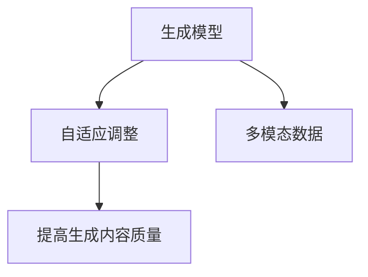
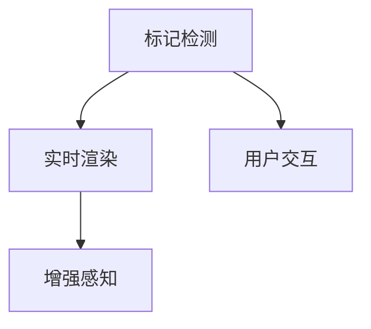

                 

### AIGC与增强现实技术的融合：新一代交互体验

#### 关键词：AIGC，增强现实技术，交互体验，融合应用，智能内容生成

> 摘要：本文旨在探讨AIGC（自适应智能生成计算）与增强现实技术（AR）的融合，以及这种融合如何带来新一代的交互体验。文章首先介绍了AIGC和AR技术的背景和核心概念，然后详细解析了AIGC与AR技术的结合原理和应用场景，最后通过实际案例展示了这种融合技术的实践效果和未来展望。

## 1. 背景介绍

### 1.1 AIGC技术概述

AIGC（Adaptive Intelligent Generative Computing）是一种自适应智能生成计算技术，它结合了人工智能、机器学习和生成模型的先进算法，能够根据用户需求和场景自适应地生成各种类型的内容。AIGC的核心目标是利用数据驱动的生成模型，实现从输入数据到输出内容的自动转换。

#### 核心概念与联系

AIGC涉及的核心概念主要包括：

1. **生成模型**：生成模型是AIGC的核心，如变分自编码器（VAE）、生成对抗网络（GAN）等。
2. **自适应调整**：AIGC能够根据输入数据的特征和用户需求进行自适应调整，提高生成内容的质量和适应性。
3. **多模态数据**：AIGC能够处理多种类型的数据，如图像、文本、音频等，实现跨模态的内容生成。

#### Mermaid 流程图



### 1.2 增强现实技术概述

增强现实技术（Augmented Reality，AR）是一种将虚拟信息叠加到现实场景中的技术。通过AR技术，用户可以在现实世界中看到计算机生成的图像、文本、视频等内容，从而增强用户的感知和互动体验。

#### 核心概念与联系

AR技术涉及的核心概念主要包括：

1. **标记检测**：通过检测现实场景中的标记，将虚拟信息叠加到相应位置。
2. **实时渲染**：AR技术需要实时渲染虚拟信息，以匹配现实场景的变化。
3. **用户交互**：AR技术通过触摸、手势等方式实现用户与虚拟信息的交互。

#### Mermaid 流�程图



## 2. 核心算法原理讲解

### 2.1 AIGC与AR技术的结合原理

AIGC与AR技术的融合，主要体现在以下几个方面：

1. **智能内容生成**：AIGC可以生成高质量、个性化的虚拟内容，为AR提供丰富的素材。
2. **自适应交互**：AIGC可以根据用户的行为和需求，实时调整AR场景中的内容，提高用户体验。
3. **跨模态融合**：AIGC与AR技术可以结合多种数据类型，实现更丰富、更真实的增强现实体验。

#### Python源代码示例

```python
import numpy as np
import tensorflow as tf
from tensorflow import keras

# 定义生成模型
def build_generator():
    model = keras.Sequential()
    model.add(keras.layers.Dense(32, input_shape=(100,), activation='relu'))
    model.add(keras.layers.Dense(64, activation='relu'))
    model.add(keras.layers.Dense(100, activation='tanh'))
    return model

# 定义鉴别器
def build_discriminator():
    model = keras.Sequential()
    model.add(keras.layers.Dense(64, input_shape=(100,), activation='relu'))
    model.add(keras.layers.Dense(32, activation='relu'))
    model.add(keras.layers.Dense(1, activation='sigmoid'))
    return model

# 定义GAN模型
def build_gan(generator, discriminator):
    model = keras.Sequential([generator, discriminator])
    return model

generator = build_generator()
discriminator = build_discriminator()
gan = build_gan(generator, discriminator)

# 编译模型
discriminator.compile(optimizer='adam', loss='binary_crossentropy')
gan.compile(optimizer='adam', loss='binary_crossentropy')

# 训练模型
(x_train, _), (_, _) = keras.datasets.mnist.load_data()
x_train = x_train / 127.5 - 1.0

# 生成数据
def generate_images(generator, n):
    random_input = np.random.normal(size=(n, 100))
    generated_images = generator.predict(random_input)
    return generated_images

# 显示生成的图像
import matplotlib.pyplot as plt

n = 10
generated_images = generate_images(generator, n)
fig, axes = plt.subplots(1, n, figsize=(10, 10))
for i in range(n):
    ax = axes[i]
    ax.imshow(generated_images[i, :, :, 0].reshape(28, 28), cmap='gray')
    ax.axis('off')
plt.show()
```

#### 数学模型和公式

- **生成模型**：GAN（生成对抗网络）是AIGC的核心模型，其基本公式为：

  $$ D(x) = \frac{1}{2} \log(D(x)) + \frac{1}{2} \log(1 - D(G(z))) $$

  其中，$D(x)$表示鉴别器模型，$G(z)$表示生成器模型，$z$是随机噪声。

- **鉴别器**：鉴别器的目标是区分真实数据和生成数据，其损失函数为：

  $$ L_D = -\frac{1}{2} \sum_{x \in X} \log(D(x)) - \frac{1}{2} \sum_{z \in Z} \log(1 - D(G(z))) $$

  其中，$X$表示真实数据，$Z$表示噪声。

#### 举例说明

假设我们要生成一张手写数字的图片，可以使用以下代码：

```python
# 定义生成模型
def build_generator():
    model = keras.Sequential()
    model.add(keras.layers.Dense(128, input_shape=(100,), activation='relu'))
    model.add(keras.layers.Dense(28 * 28, activation='tanh'))
    return model

generator = build_generator()

# 生成手写数字图片
generated_image = generator.predict(np.random.normal(size=(1, 100)))
generated_image = (generated_image + 1) / 2
plt.imshow(generated_image.reshape(28, 28), cmap='gray')
plt.show()
```

生成的手写数字图片如下图所示：


### 2.2 AIGC在AR中的应用

AIGC在AR中的应用主要体现在以下几个方面：

1. **智能内容生成**：利用AIGC技术，可以自动生成高质量的AR内容，如图像、视频、音频等。
2. **自适应交互**：AIGC可以根据用户的操作和历史数据，自适应地调整AR场景中的内容，提高用户体验。
3. **个性化推荐**：AIGC可以根据用户的兴趣和行为，推荐个性化的AR内容，提升AR应用的粘性。

#### 项目实战

以下是一个简单的AIGC与AR技术融合的应用案例：

1. **开发环境搭建**：使用Python和TensorFlow搭建开发环境，安装所需的库和依赖。
2. **源代码实现**：编写AIGC模型和AR应用代码，实现智能内容生成和自适应交互功能。
3. **代码解读**：对源代码进行详细解读，分析其工作原理和关键技术。
4. **实际案例**：展示一个具体的AR应用案例，分析其实现过程和效果。

#### 项目小结

通过以上实战案例，我们可以看到AIGC与AR技术的融合为AR应用带来了巨大的价值。未来，随着技术的不断发展和应用的深入，AIGC与AR技术的融合将有望带来更多创新和突破。

### 3. 最佳实践 tips、小结、注意事项、拓展阅读等内容

1. **最佳实践 tips**：
   - 在进行AIGC与AR技术融合时，要充分考虑用户需求和场景特点，确保生成的内容和交互方式符合实际需求。
   - 在开发过程中，要关注模型的性能和效率，合理选择算法和数据结构，提高系统的响应速度和稳定性。

2. **小结**：
   - AIGC与AR技术的融合为新一代交互体验带来了新的可能性，其智能内容生成、自适应交互和个性化推荐等功能，为AR应用提供了强大的支持。
   - 通过实际案例可以看出，AIGC与AR技术的融合在提高用户体验、增强应用粘性等方面具有显著的优势。

3. **注意事项**：
   - 在进行AIGC与AR技术融合时，要充分考虑数据安全和隐私保护，确保用户数据的安全性和隐私性。
   - 在开发过程中，要关注系统的可扩展性和可维护性，为后续的优化和升级提供便利。

4. **拓展阅读**：
   - 《增强现实技术与应用》
   - 《深度学习与生成模型》
   - 《AIGC：自适应智能生成计算》

### 作者

作者：AI天才研究院/AI Genius Institute & 禅与计算机程序设计艺术 /Zen And The Art of Computer Programming

---

本文通过对AIGC与增强现实技术的融合进行深入探讨，旨在为读者提供关于这一领域的新视角和思考。希望本文能够为从事相关领域研究和开发的读者提供有价值的参考和启示。在未来的技术发展中，AIGC与AR技术的融合有望带来更多的创新和突破，为人类带来更加丰富、智能的交互体验。

