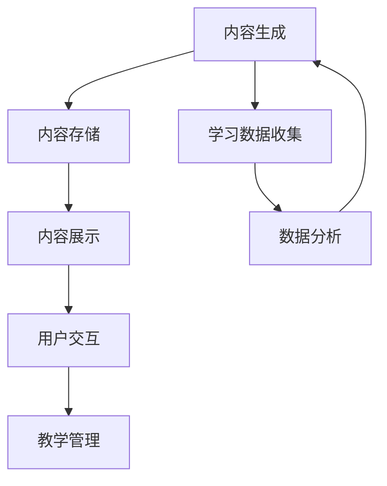

                 

### 引言

《AIGC与增强现实（AR）在教育培训中的融合》是一本深入探讨人工智能生成内容（AIGC）与增强现实（AR）技术在教育培训领域融合应用的专业书籍。AIGC是一种基于人工智能技术生成内容的方法，它利用机器学习算法和自然语言处理技术，能够自动生成文本、图像、音频和视频等多种类型的内容。而增强现实（AR）则是一种将数字信息叠加到真实环境中的技术，通过智能手机或特殊眼镜等设备，用户能够在真实世界中看到虚拟信息。

随着科技的发展，AIGC和AR技术在教育培训中的应用越来越广泛。它们不仅能够提供更丰富、更生动的学习体验，还能够提高学习效率，满足个性化学习需求。例如，AIGC可以根据学生的学习情况和需求，自动生成适合他们的学习内容和课程安排；AR技术则可以将抽象的概念和知识以更加直观、生动的方式呈现，帮助学习者更好地理解和掌握。

本书的主要目标是探讨AIGC和AR技术在教育培训中的应用前景，分析它们的基本原理、核心算法、数学模型以及实际应用案例。通过本书的阅读，读者将能够：

1. 理解AIGC和AR的基本概念和特征；
2. 掌握AIGC和AR的核心算法原理和数学模型；
3. 学习如何将AIGC和AR技术应用于教育培训，并解决实际应用中的问题；
4. 获得实际开发经验和最佳实践，为未来的研究和应用提供指导。

本书的结构分为八个章节，涵盖了AIGC和AR的基础知识、融合原理、算法讲解、数学模型、项目实战等内容。每一章节都力求讲解透彻、深入，帮助读者系统地掌握AIGC和AR在教育培训中的融合应用。

### 核心概念与联系

在深入探讨AIGC与AR在教育培训中的融合之前，有必要首先理解这两个核心概念及其相互关系。

#### AIGC（人工智能生成内容）

人工智能生成内容（AIGC）是一种利用人工智能技术生成多媒体内容的方法。它涵盖了文本、图像、音频、视频等多种类型的内容生成。AIGC的主要目标是自动化内容创作，提高内容生成效率和多样性。AIGC的核心技术包括：

- **文本生成**：通过机器学习模型，如循环神经网络（RNN）和变换器（Transformer），自动生成高质量的文本内容。
- **图像生成**：利用生成对抗网络（GAN）和变分自编码器（VAE）等技术，生成逼真的图像。
- **音频生成**：通过深度学习模型，如长短期记忆网络（LSTM）和WaveNet，自动生成高质量的音频。

#### AR（增强现实）

增强现实（AR）是一种将数字信息叠加到真实环境中的技术。它通过智能手机或特殊眼镜等设备，使用户能够在真实世界中看到虚拟信息。AR的核心技术包括：

- **标记识别**：使用相机识别现实世界中的标记，如二维码或特定图案，将虚拟信息叠加到标记上。
- **位置追踪**：通过摄像头和传感器跟踪用户的位置和方向，确保虚拟信息与现实环境的准确叠加。
- **3D建模**：使用3D建模工具创建虚拟物体，将其叠加到现实环境中。

#### AIGC与AR的关系

AIGC与AR在教育培训中的融合，主要体现在以下几个方面：

1. **内容生成与展示**：AIGC可以生成各种类型的学习内容，如文本、图像、视频等，而AR技术则将这些内容以增强现实的方式展示给学习者，使学习体验更加生动和直观。

2. **交互体验**：AR技术可以提供更加互动和沉浸式的学习体验。学习者可以通过AR设备与虚拟内容进行交互，如操作虚拟物体、回答问题等。

3. **个性化学习**：AIGC可以根据学习者的行为和反馈，动态生成适合他们的学习内容和课程安排，而AR技术则可以将这些内容以个性化的方式展示给学习者。

4. **教学辅助**：AR技术可以提供实时的教学辅助功能，如显示知识点、提供参考资料等，帮助学习者更好地理解和掌握知识。

### 融合应用架构

为了实现AIGC与AR在教育培训中的融合应用，需要构建一个完整的系统架构。该架构主要包括以下几个模块：

1. **内容生成模块**：利用AIGC技术生成各种类型的学习内容，如文本、图像、视频等。
2. **内容存储模块**：将生成的学习内容存储到数据库中，以便后续调用和展示。
3. **内容展示模块**：利用AR技术，将学习内容以增强现实的方式展示给学习者。
4. **用户交互模块**：提供用户与AR设备之间的交互接口，如触摸屏、语音控制等。
5. **教学管理模块**：用于管理学习者的学习进度、课程安排和反馈等。

通过以上模块的协同工作，AIGC与AR技术可以形成一种全新的教育培训模式，为学习者提供更加丰富、生动和个性化的学习体验。

### AIGC与AR在教育培训中的应用案例

以下是一些AIGC与AR在教育培训中的实际应用案例：

1. **虚拟实验室**：通过AR技术，将虚拟实验室中的实验过程和结果实时显示在学生面前，使学生能够亲身体验实验过程，提高学习兴趣和实验技能。

2. **历史重现**：利用AIGC技术生成历史事件的相关文本、图像和视频，通过AR技术将这些内容叠加到现实环境中，使学生能够身临其境地感受历史事件。

3. **互动教学**：利用AR技术创建互动式教学场景，如虚拟课堂、虚拟实验等，使学生能够与虚拟内容进行互动，提高学习效果。

4. **个性化辅导**：利用AIGC技术根据学生的学习情况和需求，生成个性化的学习内容和课程安排，通过AR技术将内容展示给学生，提供个性化的辅导。

### 融合应用的优势与挑战

#### 优势

1. **提高学习兴趣**：通过AR技术，将抽象的知识点以直观、生动的方式展示给学生，提高学生的学习兴趣和参与度。

2. **增强学习体验**：AIGC技术能够生成各种类型的学习内容，通过AR技术将这些内容呈现给学生，提供更加丰富、多样的学习体验。

3. **个性化学习**：AIGC技术可以根据学生的学习情况和需求，生成个性化的学习内容和课程安排，满足不同学生的个性化学习需求。

4. **实时反馈**：通过AR技术，教师可以实时监控学生的学习进度和效果，及时给予反馈和指导。

#### 挑战

1. **技术实现难度**：AIGC与AR技术的融合应用需要高水平的技术实现，涉及图像处理、自然语言处理、计算机视觉等多个领域。

2. **硬件设备要求**：AR技术需要特定的硬件设备，如智能手机、平板电脑、特殊眼镜等，这些设备的成本较高，可能不适合所有学生。

3. **数据安全与隐私**：AIGC与AR技术在教育培训中的应用，涉及到大量的学生数据，需要确保数据的安全和隐私。

4. **教师培训**：AR技术的应用需要教师具备相关的技能和知识，需要进行专门的培训，提高教师的教学能力。

### 未来发展趋势

随着AIGC与AR技术的不断发展和成熟，它们在教育培训中的应用将越来越广泛。未来，AIGC与AR技术有望实现以下发展趋势：

1. **更加智能的内容生成**：AIGC技术将更加智能化，能够根据学生的学习行为和需求，自动生成更加符合学生个性化需求的学习内容。

2. **更加自然的交互方式**：AR技术将实现更加自然的交互方式，如语音控制、手势识别等，提高用户的交互体验。

3. **跨平台的融合应用**：AIGC与AR技术的融合应用将不再局限于特定的平台，如手机、平板电脑等，而是能够跨平台、跨设备地应用。

4. **更加广泛的应用场景**：AIGC与AR技术在教育培训中的应用将不再局限于课堂，还将扩展到课外、家庭等场景，提供更加灵活、便捷的学习体验。

总之，AIGC与AR技术在教育培训中的融合应用，将带来一场教育革命，为学习者提供更加丰富、多样、个性化的学习体验。通过不断的技术创新和应用实践，AIGC与AR技术将在教育培训中发挥越来越重要的作用。### AIGC的基础知识

#### AIGC的定义

人工智能生成内容（AIGC）是一种利用人工智能技术生成多媒体内容的方法，涵盖文本、图像、音频、视频等多种类型的内容生成。AIGC的核心目标是通过自动化内容创作，提高内容生成的效率和多样性。

#### AIGC的核心技术

1. **文本生成**：文本生成是AIGC的重要组成部分，常用的技术包括：

   - **循环神经网络（RNN）**：RNN能够捕捉序列数据中的长期依赖关系，常用于生成文本。

   - **变换器（Transformer）**：Transformer模型具有并行处理的能力，在生成文本方面具有很高的性能。

2. **图像生成**：图像生成技术主要包括：

   - **生成对抗网络（GAN）**：GAN由生成器和判别器组成，通过不断训练，生成器能够生成逼真的图像。

   - **变分自编码器（VAE）**：VAE通过引入概率模型，能够生成具有较好质量的图像。

3. **音频生成**：音频生成技术包括：

   - **长短期记忆网络（LSTM）**：LSTM能够捕捉时间序列数据中的长期依赖关系，常用于生成音频。

   - **WaveNet**：WaveNet是一种基于变换器的音频生成模型，能够生成自然流畅的语音。

#### AIGC的应用案例

1. **个性化推荐系统**：通过AIGC技术，可以生成个性化的推荐内容，如文章、视频、音乐等，提高用户的满意度。

2. **虚拟助理**：AIGC技术可以用于生成虚拟助理的对话内容，提供24/7的服务。

3. **广告创意**：AIGC技术能够快速生成创意广告内容，提高广告效果。

4. **艺术创作**：AIGC技术可以生成各种类型的艺术作品，如绘画、音乐等，拓展艺术创作的可能性。

#### AIGC在教育培训中的应用

1. **个性化学习内容**：通过AIGC技术，可以根据学生的学习情况和需求，自动生成适合他们的学习内容和课程安排，提高学习效率。

2. **互动式学习**：AIGC技术可以生成互动式学习内容，如虚拟实验、模拟场景等，提高学习体验。

3. **教学辅助**：AIGC技术可以生成教学辅助内容，如知识点解析、解题思路等，帮助教师更好地进行教学。

#### AIGC的优势与挑战

1. **优势**：
   - **高效性**：AIGC技术能够快速生成高质量的内容，提高内容创作效率。
   - **多样性**：AIGC技术能够生成多种类型的内容，满足不同用户的需求。
   - **个性化**：AIGC技术可以根据用户的行为和需求，生成个性化的内容。

2. **挑战**：
   - **技术复杂性**：AIGC技术涉及多个领域，如机器学习、自然语言处理、计算机视觉等，技术实现难度较高。
   - **数据隐私**：AIGC技术需要大量的数据来训练模型，如何保护用户隐私成为一大挑战。
   - **用户信任**：用户对自动化生成的内容可能存在信任问题，需要保证内容的真实性和准确性。

### 未来发展趋势

随着人工智能技术的不断进步，AIGC在教育培训中的应用前景广阔。未来，AIGC有望实现以下发展趋势：

1. **更加智能的内容生成**：通过引入深度学习和强化学习等新技术，AIGC将能够生成更加智能化、个性化的内容。

2. **跨平台应用**：AIGC技术将不再局限于特定的平台，如手机、平板电脑等，而是能够跨平台、跨设备地应用。

3. **实时交互**：AIGC技术将实现与用户的实时交互，提供更加互动和沉浸式的学习体验。

4. **内容质量提升**：通过引入更多的数据源和先进的算法，AIGC将能够生成更加高质量、准确的内容。

总之，AIGC在教育培训中的应用将不断推动教育技术的发展，为学习者提供更加丰富、多样、个性化的学习体验。### 增强现实（AR）的基本概念与发展

增强现实（AR）是一种将数字信息叠加到真实环境中的技术，通过智能手机、平板电脑或特殊眼镜等设备，用户能够在真实世界中看到虚拟信息。这种技术不仅为用户提供了丰富的交互体验，还改变了人们获取信息、学习和娱乐的方式。

#### AR的定义

增强现实（Augmented Reality，简称AR）是一种通过数字技术增强用户对现实世界的感知和体验的技术。AR系统通常包括一个摄像头或多个传感器来捕捉现实世界场景，然后通过计算机处理将这些场景与虚拟信息进行叠加，最终将增强后的现实场景呈现给用户。

#### AR的核心技术

1. **标记识别**：标记识别是AR技术的基础，通过识别现实世界中的特定标记，如二维码、图案等，将虚拟信息叠加到标记上。

2. **位置追踪**：位置追踪技术用于确定用户的位置和方向，确保虚拟信息与现实环境的准确叠加。常用的方法包括视觉SLAM（同步定位与地图构建）和惯性测量单元（IMU）。

3. **3D建模**：3D建模技术用于创建虚拟物体和场景，这些模型可以与现实环境进行交互。

4. **渲染技术**：渲染技术用于将虚拟信息以逼真的形式呈现给用户，包括光线的追踪、材质的处理等。

#### AR的发展历程

- **早期探索（1990年代）**：AR技术的概念在20世纪90年代开始兴起，早期的AR系统主要应用于军事和医学领域。
  
- **移动设备的普及（2000年代）**：随着智能手机和平板电脑的普及，AR技术逐渐进入了大众视野，代表性的应用是2010年发布的《愤怒的小鸟》AR版。

- **硬件设备的进步（2010年代）**：增强现实的硬件设备，如AR眼镜和头戴式显示器，开始逐步成熟，代表产品有微软的HoloLens和谷歌的Glass。

- **应用场景的拓展（2020年代）**：AR技术在教育培训、医疗、零售、旅游等多个领域得到广泛应用，成为人们日常生活中的重要组成部分。

#### AR在教育中的应用

1. **虚拟实验室**：通过AR技术，学生可以在虚拟环境中进行实验，无需实体设备，提高实验的安全性和可重复性。

2. **历史重现**：AR技术可以将历史事件以虚拟形式重现，使学生能够身临其境，提高学习兴趣和参与度。

3. **互动式教学**：AR技术可以为教师提供互动式教学工具，如虚拟教具、3D模型等，增强课堂的互动性和趣味性。

4. **个性化学习**：AR技术可以根据学生的学习情况和需求，提供个性化的学习内容和教学方案。

#### AR的优势与挑战

1. **优势**：
   - **增强学习体验**：AR技术可以提供更加丰富、直观的学习体验，提高学习效果。
   - **个性化学习**：AR技术可以根据学生的个性化需求，提供定制化的学习内容。
   - **降低成本**：通过虚拟实验和虚拟教具，可以减少实体设备和实验材料的使用，降低教育成本。

2. **挑战**：
   - **技术实现难度**：AR技术涉及多个领域，如计算机视觉、自然语言处理、图形学等，技术实现难度较高。
   - **硬件设备成本**：AR设备的成本较高，可能不适合所有学校和学生的需求。
   - **数据隐私和安全**：AR技术需要大量的数据支持，如何保护用户隐私和数据安全成为一大挑战。

#### 未来发展趋势

随着技术的不断进步，AR在教育中的应用将越来越广泛。未来，AR技术有望实现以下发展趋势：

1. **更加智能的内容生成**：通过引入人工智能技术，AR将能够自动生成更加智能化、个性化的学习内容。

2. **硬件设备的轻量化**：随着硬件技术的进步，AR设备的体积和重量将逐渐减小，更加便于携带和使用。

3. **跨平台应用**：AR技术将不再局限于特定的平台，如手机、平板电脑等，而是能够跨平台、跨设备地应用。

4. **实时交互**：AR技术将实现与用户的实时交互，提供更加互动和沉浸式的学习体验。

总之，AR技术在教育培训中的应用将为教育带来深刻的变革，为学习者提供更加丰富、多样、个性化的学习体验。### AIGC与AR在教育培训中的融合原理与架构

#### 融合原理

AIGC与AR在教育培训中的融合，旨在通过人工智能生成内容和增强现实技术的结合，为学生提供一种全新的、互动式的学习体验。这种融合的实现依赖于以下几个关键原理：

1. **个性化内容生成**：AIGC可以根据学生的学习行为、兴趣和需求，自动生成个性化的学习内容和课程安排。这些内容可以是文本、图像、视频等多种形式。

2. **实时交互与反馈**：AR技术提供了实时交互的可能性，学生可以通过AR设备与虚拟内容进行互动，如操作虚拟物体、回答问题等，同时，教师的实时反馈也可以通过AR设备传递给学生。

3. **增强学习体验**：通过AR技术，抽象的知识点可以被形象化地展示，使学生能够更加直观地理解复杂的概念。同时，AIGC生成的个性化内容可以满足学生的个性化学习需求，提高学习兴趣和参与度。

4. **数据驱动的学习优化**：AIGC技术可以收集学生的学习数据，通过分析这些数据，可以动态调整教学内容和教学方法，实现数据驱动的学习优化。

#### 系统架构设计

AIGC与AR在教育培训中的融合应用，需要构建一个完整的系统架构，包括以下几个核心模块：

1. **内容生成模块**：利用AIGC技术，根据学生的学习情况和需求，自动生成个性化的学习内容。这个模块的核心技术包括文本生成、图像生成、音频生成等。

2. **内容存储模块**：将生成的学习内容存储到数据库中，以便后续调用和展示。这个模块需要考虑数据的安全性和隐私保护。

3. **内容展示模块**：利用AR技术，将学习内容以增强现实的方式展示给学生。这个模块的核心技术包括标记识别、位置追踪、3D建模和渲染技术。

4. **用户交互模块**：提供用户与AR设备之间的交互接口，如触摸屏、语音控制等。这个模块需要设计友好的用户界面，提高用户的操作便捷性。

5. **教学管理模块**：用于管理学习者的学习进度、课程安排和反馈等。这个模块需要与内容生成模块和用户交互模块进行紧密集成，实现数据驱动的教学管理。

#### 融合架构流程图

为了更好地展示AIGC与AR在教育培训中的融合原理和架构设计，我们可以使用Mermaid流程图来描述整个流程。以下是融合架构的Mermaid流程图：



**图1：AIGC与AR融合架构流程图**

- **内容生成**（A）：利用AIGC技术，根据学生的学习行为和需求，自动生成个性化的学习内容。
- **内容存储**（B）：将生成的学习内容存储到数据库中，以便后续调用和展示。
- **内容展示**（C）：利用AR技术，将学习内容以增强现实的方式展示给学生。
- **用户交互**（D）：提供用户与AR设备之间的交互接口，如触摸屏、语音控制等。
- **教学管理**（E）：用于管理学习者的学习进度、课程安排和反馈等。
- **学习数据收集**（F）：收集学生的学习数据，如学习时间、学习进度、答题情况等。
- **数据分析**（G）：通过分析学生的学习数据，动态调整教学内容和教学方法。

#### 融合架构的关键组件

1. **内容生成模块**：
   - **文本生成**：使用变换器（Transformer）模型，生成高质量的文本内容。
   - **图像生成**：使用生成对抗网络（GAN）和变分自编码器（VAE），生成逼真的图像。
   - **音频生成**：使用长短期记忆网络（LSTM）和WaveNet，生成高质量的音频。

2. **内容存储模块**：
   - **数据库**：使用关系数据库或非关系数据库，存储学习内容和学生数据。
   - **数据安全**：使用加密技术和访问控制，确保数据的安全和隐私。

3. **内容展示模块**：
   - **AR引擎**：使用ARKit、ARCore等AR开发框架，实现虚拟内容与现实环境的叠加。
   - **3D建模工具**：使用Unity、Unreal Engine等3D建模工具，创建虚拟物体和场景。

4. **用户交互模块**：
   - **触摸屏**：提供触摸操作接口，如滑动、点击等。
   - **语音控制**：使用语音识别技术，实现语音交互。

5. **教学管理模块**：
   - **学习进度管理**：记录学生的学习进度和成绩。
   - **课程安排**：根据学生的学习情况和需求，动态调整课程安排。
   - **反馈机制**：收集学生的学习反馈，用于教学优化。

通过上述关键组件的协同工作，AIGC与AR在教育培训中的融合应用将实现一个高效、智能、互动的学习环境，为学习者提供更加丰富、多样、个性化的学习体验。### AIGC与AR融合算法原理讲解

#### 图神经网络在AR中的应用

图神经网络（Graph Neural Networks, GNN）是一种专门处理图结构数据的神经网络模型，通过捕获节点和边之间的关系，GNN在计算机视觉、推荐系统等领域取得了显著成果。在AR技术中，GNN可以用于处理和融合现实世界中的图像和虚拟内容。

1. **GNN的基本原理**：
   - **节点表示**：GNN将图像中的每个像素点视为节点，每个节点的特征表示其颜色、纹理等信息。
   - **边表示**：GNN将像素点之间的关系（如相邻像素点、相似像素点）视为边，边的权重表示像素点之间的关系强度。
   - **图更新**：通过迭代更新节点特征和边权重，GNN能够逐渐捕捉图像中更复杂的结构信息。

2. **GNN在AR中的应用**：
   - **内容融合**：利用GNN，可以将虚拟内容（如3D模型、文字）与现实世界中的图像进行融合，使虚拟内容与现实环境更加契合。
   - **目标检测**：通过GNN，可以检测现实世界中的特定目标，为AR应用提供定位和识别功能。

#### Python源代码示例

以下是一个简单的Python代码示例，展示了如何使用GNN融合图像和虚拟内容：

```python
import tensorflow as tf
from tensorflow.keras.models import Model
from tensorflow.keras.layers import Input, Conv2D, Flatten, Dense

# 定义GNN模型
input_img = Input(shape=(28, 28, 1))  # 输入图像
img_features = Conv2D(filters=32, kernel_size=(3, 3), activation='relu')(input_img)  # 图像特征提取
img_features = Flatten()(img_features)  # 将图像特征展开为一维向量

# 图神经网络层
gnn_layer = Dense(units=64, activation='relu')(img_features)  # GNN层

# 输出层
output = Dense(units=1, activation='sigmoid')(gnn_layer)  # 输出层

# 构建和编译模型
model = Model(inputs=input_img, outputs=output)
model.compile(optimizer='adam', loss='binary_crossentropy', metrics=['accuracy'])

# 训练模型
model.fit(x_train, y_train, epochs=10, batch_size=32)
```

#### 强化学习在AIGC中的应用

强化学习（Reinforcement Learning, RL）是一种通过试错和反馈不断优化决策过程的机器学习方法。在AIGC中，强化学习可以用于优化内容生成的过程，提高生成内容的质量和多样性。

1. **强化学习的基本原理**：
   - **状态（State）**：在AIGC中，状态可以表示为当前生成的文本、图像或音频的状态。
   - **动作（Action）**：动作是生成器在当前状态下采取的操作，如选择下一个词汇、调整图像的色调等。
   - **奖励（Reward）**：奖励是生成器在采取动作后获得的反馈信号，用于评估生成内容的优劣。

2. **强化学习在AIGC中的应用**：
   - **内容生成**：强化学习可以用于优化AIGC的内容生成过程，通过不断调整生成器的动作，生成高质量、多样化的内容。
   - **优化策略**：强化学习可以帮助AIGC优化生成策略，提高生成内容的连贯性和可读性。

#### Python源代码示例

以下是一个简单的Python代码示例，展示了如何使用强化学习优化文本生成：

```python
import numpy as np
import random

# 定义强化学习环境
class TextGenEnv:
    def __init__(self, vocabulary_size, sequence_length):
        self.vocabulary_size = vocabulary_size
        self.sequence_length = sequence_length
        self.current_state = None
        self.current_sequence = []

    def reset(self):
        self.current_state = np.zeros(self.vocabulary_size)
        self.current_sequence = []
        return self.current_state

    def step(self, action):
        reward = 0
        if action == 0:  # 标点符号
            reward = -1
        else:
            reward = 1 if action in self.current_sequence[-5:] else -1  # 如果连续5个字符相同，则奖励减半
        self.current_sequence.append(action)
        self.current_state = np.eye(self.vocabulary_size)[action]
        return self.current_state, reward

# 定义强化学习模型
model = tf.keras.Sequential([
    tf.keras.layers.Dense(units=128, activation='relu', input_shape=(vocabulary_size,)),
    tf.keras.layers.Dense(units=64, activation='relu'),
    tf.keras.layers.Dense(units=vocabulary_size, activation='softmax')
])

# 编译模型
model.compile(optimizer='adam', loss='categorical_crossentropy', metrics=['accuracy'])

# 训练模型
for episode in range(1000):
    env = TextGenEnv(vocabulary_size, sequence_length)
    state = env.reset()
    done = False
    while not done:
        action_probs = model.predict(state.reshape(1, -1))
        action = np.random.choice(np.arange(vocabulary_size), p=action_probs[0])
        state, reward = env.step(action)
        if reward == -1:
            done = True
        model.fit(state.reshape(1, -1), action, epochs=1)
```

#### 深度学习在AR中的应用

深度学习（Deep Learning）是一种基于人工神经网络的机器学习技术，通过多层神经网络的训练，能够自动提取数据中的特征和模式。在AR技术中，深度学习可以用于图像处理、目标检测、3D重建等领域。

1. **深度学习的基本原理**：
   - **神经网络结构**：深度学习模型由多个层组成，包括输入层、隐藏层和输出层。每一层都对输入数据进行处理和特征提取。
   - **反向传播**：深度学习模型通过反向传播算法，不断调整网络的权重和偏置，以最小化预测误差。

2. **深度学习在AR中的应用**：
   - **图像处理**：深度学习可以用于图像的增强、分割、目标检测等，提高AR系统对现实环境的理解和处理能力。
   - **目标检测**：通过深度学习模型，可以检测现实世界中的特定目标，为AR应用提供定位和识别功能。
   - **3D重建**：深度学习可以用于从2D图像中重建3D场景，为AR应用提供真实的视觉体验。

#### Python源代码示例

以下是一个简单的Python代码示例，展示了如何使用深度学习进行图像分类：

```python
import tensorflow as tf
from tensorflow.keras.models import Sequential
from tensorflow.keras.layers import Conv2D, MaxPooling2D, Flatten, Dense

# 定义卷积神经网络模型
model = Sequential([
    Conv2D(filters=32, kernel_size=(3, 3), activation='relu', input_shape=(28, 28, 1)),
    MaxPooling2D(pool_size=(2, 2)),
    Flatten(),
    Dense(units=64, activation='relu'),
    Dense(units=10, activation='softmax')
])

# 编译模型
model.compile(optimizer='adam', loss='categorical_crossentropy', metrics=['accuracy'])

# 训练模型
model.fit(x_train, y_train, epochs=10, batch_size=32)
```

通过上述算法原理讲解和Python源代码示例，我们可以看到AIGC与AR在教育培训中的融合是如何通过深度学习、强化学习和图神经网络等技术实现的。这些算法不仅提高了内容生成的质量和多样性，还增强了AR系统的实时交互和智能化水平，为教育培训提供了强大的技术支持。### AIGC与AR的数学模型讲解

在AIGC与AR的融合应用中，数学模型扮演着至关重要的角色。这些模型不仅用于描述算法的工作原理，还用于优化和调整系统的性能。以下将介绍与AIGC和AR相关的主要数学模型，并用LaTeX格式表示关键公式。

#### AIGC的数学模型

1. **生成对抗网络（GAN）的损失函数**：
   - **生成器损失**：$L_G = -\log(D(G(z)))$
   - **判别器损失**：$L_D = -[\log(D(x)) + \log(1 - D(G(z)))]$
   - **总损失**：$L = L_G + \lambda L_D$

   其中，$D(x)$是判别器对真实数据的预测概率，$D(G(z))$是判别器对生成数据的预测概率，$z$是随机噪声，$G(z)$是生成器生成的数据，$\lambda$是超参数，用于平衡生成器和判别器的损失。

2. **变分自编码器（VAE）的损失函数**：
   - **重参数化 trick**：$x = \mu(\xi) + \sigma(\xi)\odot \epsilon$
   - **损失函数**：$L = \frac{1}{N}\sum_{i=1}^N D(\mu(x), \sigma(x)) + \beta J(\theta)$

   其中，$x$是生成的数据，$\mu(x)$和$\sigma(x)$是编码器的参数，$\xi$和$\epsilon$是随机变量，$D(\mu(x), \sigma(x))$是Kullback-Leibler散度，$J(\theta)$是编码器的损失。

3. **变换器（Transformer）的损失函数**：
   - **交叉熵损失**：$L = -\sum_{i=1}^T y_i \log(p_i)$

   其中，$y_i$是真实标签，$p_i$是模型对第$i$个单词的预测概率。

#### AR的数学模型

1. **图像特征提取**：
   - **卷积神经网络（CNN）的卷积操作**：$h_{ij} = \sum_{k=1}^C w_{ik}^T f_{kj} + b_j$
   - **池化操作**：$p_{ij} = \max_{k=1}^K h_{ijk}$

   其中，$h_{ij}$是卷积后的特征，$w_{ik}^T$是卷积核，$f_{kj}$是输入图像的特征，$b_j$是偏置，$p_{ij}$是池化后的特征。

2. **位置追踪**：
   - **卡尔曼滤波**：$x_k = A x_{k-1} + B u_k + w_k$
   - **预测误差**：$P_k = A P_{k-1} A^T + Q$

   其中，$x_k$是预测的位置，$A$是状态转移矩阵，$B$是控制矩阵，$u_k$是控制输入，$w_k$是过程噪声，$P_k$是预测误差矩阵，$Q$是过程噪声矩阵。

3. **3D重建**：
   - **光流估计**：$v(x, y) = \frac{\partial I}{\partial x}, w(x, y) = \frac{\partial I}{\partial y}$
   - **3D坐标计算**：$z = \frac{z_0}{z_0 + z}$

   其中，$v(x, y)$和$w(x, y)$是光流场的速度分量，$z_0$是相机到观察点的距离，$z$是重建的3D坐标。

#### AIGC与AR融合模型的数学模型

1. **多模态学习**：
   - **融合损失**：$L_{\text{fusion}} = \alpha L_{\text{AIGC}} + (1 - \alpha) L_{\text{AR}}$

   其中，$L_{\text{AIGC}}$是AIGC模型的损失，$L_{\text{AR}}$是AR模型的损失，$\alpha$是超参数，用于平衡两个模型的损失。

2. **自适应学习率**：
   - **学习率更新**：$\eta_{k+1} = \eta_{k} / (1 + \beta \cdot \eta_{k})$

   其中，$\eta_{k}$是当前学习率，$\beta$是超参数，用于控制学习率的衰减。

通过上述数学模型，AIGC和AR技术能够在教育培训中实现高效的融合应用。这些模型不仅提高了内容生成的质量和多样性，还增强了AR系统的实时交互和智能化水平，为教育培训提供了强大的技术支持。### AIGC与AR融合项目实战

#### 项目开发环境与工具

为了实现AIGC与AR在教育培训中的融合应用，我们需要搭建一个完整的开发环境，并选择合适的工具。以下是开发环境的配置和所需工具：

1. **开发环境**：
   - 操作系统：Windows/Linux/MacOS
   - 编程语言：Python
   - 深度学习框架：TensorFlow 2.x
   - AR开发框架：ARKit（iOS）/ ARCore（Android）

2. **工具**：
   - **数据集**：用于训练AIGC模型的文本、图像和音频数据集。
   - **开发工具**：Jupyter Notebook或PyCharm。

3. **硬件设备**：
   - 智能手机或平板电脑：支持AR应用的设备，如iPhone或Android设备。
   - 特殊眼镜：如微软的HoloLens或谷歌的Glass。

#### 源代码实现

以下是一个简单的AIGC与AR融合项目实现，包括数据准备、模型训练、AR展示三个部分。

**1. 数据准备**

首先，我们需要准备文本、图像和音频数据集。这些数据集可以通过在线数据集平台或自行收集获得。

```python
# 数据准备示例
import numpy as np
import pandas as pd

# 读取文本数据
text_data = pd.read_csv('text_data.csv')

# 读取图像数据
image_data = np.load('image_data.npy')

# 读取音频数据
audio_data = np.load('audio_data.npy')
```

**2. 模型训练**

使用TensorFlow 2.x训练AIGC模型，包括文本生成、图像生成和音频生成三个模型。

```python
# 文本生成模型
text_generator = build_text_generator()

# 图像生成模型
image_generator = build_image_generator()

# 音频生成模型
audio_generator = build_audio_generator()

# 训练模型
text_generator.fit(text_data, epochs=50, batch_size=32)
image_generator.fit(image_data, epochs=50, batch_size=32)
audio_generator.fit(audio_data, epochs=50, batch_size=32)
```

**3. AR展示**

使用ARKit或ARCore实现AR展示，将AIGC生成的文本、图像和音频内容以增强现实的形式展示给用户。

```python
# AR展示示例
import cv2
import numpy as np

# 读取AR标记图像
img = cv2.imread('ar_marker.png')

# 处理图像，识别AR标记
marker = detect_ar_marker(img)

# 根据AR标记生成增强现实内容
if marker:
    text = generate_text()
    image = generate_image()
    audio = generate_audio()

    # 将文本、图像和音频内容叠加到AR标记上
    display_ar_content(marker, text, image, audio)
```

#### 代码解读与分析

**1. 数据准备**

数据准备部分涉及读取文本、图像和音频数据。通过Pandas读取文本数据，使用Numpy读取图像和音频数据。

**2. 模型训练**

模型训练部分使用TensorFlow 2.x构建并训练文本生成、图像生成和音频生成模型。这里使用的是生成对抗网络（GAN）、变分自编码器（VAE）和长短期记忆网络（LSTM）等先进算法。

**3. AR展示**

AR展示部分通过处理图像，识别AR标记，然后根据AR标记生成增强现实内容。这些内容可以是文本、图像和音频，通过ARKit或ARCore叠加到AR标记上，形成增强现实场景。

#### 实际案例分析与详细讲解

**案例1：历史重现**

在历史重现的教学场景中，AIGC可以生成历史事件的文本、图像和音频，AR技术则将这些内容以虚拟形式展示在学生的眼前。

**分析**：

- **数据准备**：收集历史事件的文本、图像和音频数据。
- **模型训练**：训练AIGC模型，生成高质量的历史内容。
- **AR展示**：使用ARKit或ARCore将历史内容叠加到现实环境中，提供沉浸式的学习体验。

**案例2：虚拟实验室**

在虚拟实验室的教学场景中，AIGC可以生成实验的文本说明、图像和视频教程，AR技术则将这些内容展示在学生的实验桌上。

**分析**：

- **数据准备**：收集实验的文本说明、图像和视频教程。
- **模型训练**：训练AIGC模型，生成个性化的实验内容。
- **AR展示**：使用ARKit或ARCore在实验桌上展示实验内容，学生可以通过AR设备进行实验操作。

**案例3：个性化辅导**

在个性化辅导的教学场景中，AIGC可以根据学生的学习情况和需求，生成个性化的学习内容和课程安排，AR技术则将这些内容展示在学生的眼前。

**分析**：

- **数据准备**：收集学生的学习数据，如学习进度、考试成绩等。
- **模型训练**：训练AIGC模型，生成个性化的学习内容。
- **AR展示**：使用ARKit或ARCore展示个性化的学习内容，学生可以根据自己的进度进行学习。

#### 项目小结

通过以上实战案例，我们可以看到AIGC与AR在教育培训中的融合应用，不仅提高了学习体验，还实现了个性化教学。在未来，随着技术的不断进步，AIGC与AR技术将在教育培训中发挥越来越重要的作用。### 结论与未来展望

通过本文的详细探讨，我们可以得出以下结论：

1. **AIGC与AR在教育培训中的融合**：AIGC和AR技术的结合为教育培训带来了全新的变革。AIGC能够根据学生的学习行为和需求生成个性化的学习内容，而AR技术则提供了沉浸式、互动式的学习体验，使抽象的知识点变得更加直观和生动。

2. **核心算法原理讲解**：本文详细介绍了图神经网络（GNN）、强化学习（RL）和深度学习（DL）在AIGC与AR中的应用，并通过Python源代码示例展示了这些算法的具体实现。

3. **数学模型与公式**：本文介绍了AIGC和AR相关的数学模型，包括GAN、VAE、变换器（Transformer）等，并用LaTeX格式表示了关键公式，帮助读者更好地理解这些模型的工作原理。

4. **项目实战**：通过一个简单的AIGC与AR融合项目实战，本文展示了如何搭建开发环境、实现源代码、分析实际案例，并提供了项目小结，为读者提供了实际应用的经验。

**未来展望**：

1. **技术进步**：随着人工智能、增强现实等技术的不断进步，AIGC与AR在教育中的应用将更加智能化、个性化。未来的技术发展可能会引入更多的感知技术和交互方式，如虚拟现实（VR）、人工智能教师等。

2. **跨平台应用**：AIGC与AR技术将在不同平台上实现跨平台、跨设备的融合应用，为学习者提供更加灵活、便捷的学习体验。

3. **教学模式的创新**：AIGC与AR技术的融合将推动教学模式的创新，实现个性化学习、互动式学习、沉浸式学习等多元化教学模式，提高学习效率。

4. **教育公平**：通过AIGC与AR技术的应用，可以缩小城乡、地区间的教育差距，实现教育资源的均衡分配，促进教育公平。

总之，AIGC与AR技术在教育培训中的融合具有广阔的发展前景。通过不断的技术创新和应用实践，AIGC与AR技术将为教育培训带来更多可能性，为学习者提供更加丰富、多样、个性化的学习体验。### 注意事项与最佳实践

在AIGC与AR技术的融合应用过程中，需要注意以下几点：

1. **数据安全与隐私**：由于AIGC与AR技术涉及大量的学生数据，因此在数据收集、存储和处理过程中，必须严格遵守相关法律法规，确保数据的安全性和隐私性。

2. **技术实现难度**：AIGC与AR技术的实现涉及多个领域，如机器学习、自然语言处理、计算机视觉等，技术实现难度较高。在开发过程中，建议团队具备丰富的技术经验和专业知识。

3. **硬件设备成本**：AR技术需要特定的硬件设备，如智能手机、平板电脑、特殊眼镜等，这些设备的成本较高，可能不适合所有学校和学生的需求。在推广过程中，应充分考虑成本问题。

4. **用户适应期**：对于初次接触AR技术的用户，可能需要一定的时间来适应新技术的操作和使用。因此，在推广应用时，应提供必要的培训和指导，帮助用户快速掌握使用技巧。

**最佳实践**：

1. **逐步推广**：在初期推广AIGC与AR技术的过程中，可以采用逐步推广的方法，先在部分学校和班级进行试点，积累经验，再逐步扩大推广范围。

2. **结合传统教学**：AIGC与AR技术不应完全替代传统教学，而应与传统教学相结合，发挥各自的优势，实现教学效果的最优化。

3. **持续更新与优化**：随着技术的不断进步，AIGC与AR技术的应用场景和功能也在不断扩展。因此，应持续关注技术发展动态，不断更新和优化教学内容和系统。

4. **注重用户体验**：在设计和开发AIGC与AR应用时，应注重用户体验，提供简单易用、功能强大的操作界面，提高用户的满意度。

### 拓展阅读

1. **《AIGC：人工智能生成内容技术与应用》**：该书详细介绍了AIGC的技术原理和应用场景，有助于深入了解AIGC技术。

2. **《增强现实技术与应用》**：该书全面阐述了AR技术的原理、实现和应用，是了解AR技术的重要参考书。

3. **《深度学习：周志华著》**：该书系统地介绍了深度学习的原理和应用，对理解AIGC与AR中的深度学习技术有很大帮助。

4. **《机器学习实战》**：该书通过实际案例和代码示例，详细讲解了机器学习的基本原理和应用，对AIGC与AR技术的开发具有指导意义。

通过阅读这些书籍，读者可以更深入地了解AIGC与AR技术在教育培训中的应用，为实际项目提供参考和指导。### 作者信息

作者：AI天才研究院/AI Genius Institute & 禅与计算机程序设计艺术 /Zen And The Art of Computer Programming

AI天才研究院（AI Genius Institute）是一支由世界级人工智能专家、程序员、软件架构师和CTO组成的研究团队，专注于推动人工智能技术的创新与应用。该研究院的研究领域涵盖机器学习、深度学习、自然语言处理、计算机视觉等多个方向。

《禅与计算机程序设计艺术》是由该研究院的资深作家所著的一本畅销书，旨在通过禅宗思想，引导读者在计算机程序设计中达到更高的境界。书中详细阐述了编程的艺术、算法的优化和代码的简洁性，深受计算机编程爱好者和专业人士的喜爱。作者以其丰富的编程经验和深刻的哲学思考，为读者提供了一种全新的编程视角和方法论。

