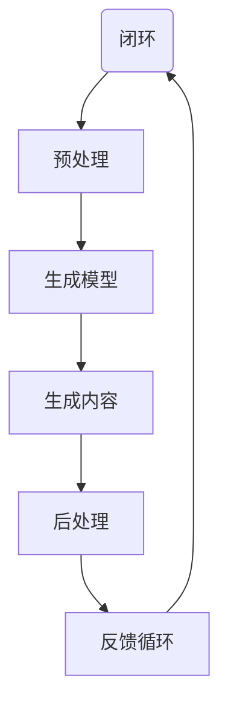
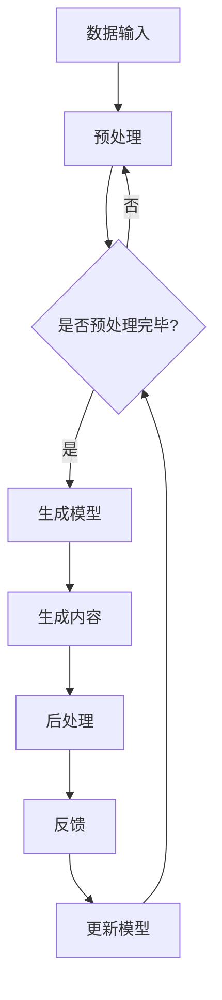
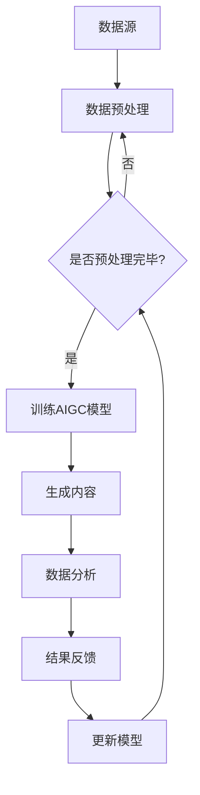

                 

### 第一步：确定整体结构

在撰写一篇关于“AIGC与大数据分析的协同效应”的技术博客文章之前，我们需要明确整体的结构。这将是文章的骨架，帮助我们构建逻辑清晰、内容丰富的文章。整体结构通常包括以下几个部分：

1. **引言**：介绍AIGC与大数据分析的概念，引出文章的主题，吸引读者的兴趣。
2. **核心概念与联系**：详细解释AIGC和大数据分析的核心概念，并展示它们之间的联系。
3. **核心算法原理讲解**：使用Python源代码和数学模型深入阐述AIGC与大数据分析的协同效应。
4. **项目实战**：提供一个实际案例，展示如何开发和实现AIGC与大数据分析的综合应用。
5. **总结**：总结文章的主要观点，强调AIGC与大数据分析的重要性，并提出未来展望。
6. **最佳实践**：给出一些实用技巧和建议，帮助读者更好地理解和应用AIGC与大数据分析。
7. **结论**：重申文章的核心观点，提醒读者注意的要点。

通过这样的结构，我们可以确保文章不仅内容丰富，而且逻辑清晰，易于读者理解和吸收。

### 第二步：确定核心章节

在明确了整体结构后，我们需要确定文章的核心章节，以确保每个部分都能充分覆盖文章的主题。以下是文章可能包含的核心章节：

1. **AIGC概述**：介绍AIGC的基本概念、发展历程、核心技术和应用领域。
2. **大数据分析基础**：阐述大数据的定义、特点、核心技术以及应用领域。
3. **AIGC与大数据分析的协同原理**：详细解释AIGC与大数据分析如何协同工作，以及协同效应的实现机制。
4. **应用案例分析**：通过实际案例展示AIGC与大数据分析的综合应用。
5. **未来展望**：探讨AIGC与大数据分析的未来发展趋势和潜在挑战。

每个章节都将包含若干小节，以确保内容丰富且具有深度。这些章节将共同构建一篇完整的、有深度的技术博客文章。

### 第三步：细化章节内容

为了使文章内容丰富且具有深度，我们需要对每个核心章节进行细化，确保每个部分都有详细的讲解和深入的分析。以下是每个章节的细化内容：

#### 第1章：AIGC概述

- **AIGC的基本概念**：
  - **定义**：AIGC，即AI生成的内容，包括文本、图像、音频和视频等多模态内容。
  - **发展历程**：从早期的文本生成到现代的多模态生成技术。
  - **应用领域**：文学创作、内容创作、产品设计、娱乐、教育等。

- **AIGC的核心技术**：
  - **自然语言处理**：文本生成、文本分类、语义分析。
  - **图像处理**：图像生成、图像识别、图像增强。
  - **音频处理**：音频生成、语音识别、音乐创作。

- **AIGC的工作原理与架构**：
  - **原理说明**：基于生成对抗网络（GAN）、变分自编码器（VAE）等模型。
  - **架构图解**：使用Mermaid流程图展示AIGC系统的整体架构。

- **AIGC的发展趋势与挑战**：
  - **趋势分析**：硬件性能提升、算法优化、应用场景拓展。
  - **挑战探讨**：数据质量、隐私保护、版权问题等。

#### 第2章：大数据分析基础

- **大数据的定义与特点**：
  - **大数据的定义**：数据量（Volume）、数据速度（Velocity）、数据多样性（Variety）、数据真实性（Veracity）。
  - **大数据的特点**：海量、高速、多样、动态。

- **大数据分析的核心技术**：
  - **数据采集与存储**：Hadoop、Spark等。
  - **数据处理**：数据清洗、数据转换、数据集成。
  - **数据挖掘与分析**：机器学习、深度学习、统计分析等。

- **大数据分析的应用领域**：
  - **金融领域**：风险评估、欺诈检测、投资策略等。
  - **医疗领域**：疾病预测、个性化治疗、药物研发等。
  - **零售领域**：需求预测、库存管理、客户关系管理等。

#### 第3章：AIGC与大数据分析的协同原理

- **协同效应概述**：
  - **定义**：AIGC与大数据分析的协同效应。
  - **优势**：提高数据分析效率、拓展数据分析应用场景。

- **协同原理分析**：
  - **数据生成**：AIGC生成大数据样本。
  - **数据处理**：大数据技术优化AIGC模型训练。
  - **结果反馈**：大数据分析指导AIGC模型优化。

#### 第4章：应用案例分析

- **案例一：金融行业应用**：
  - **案例背景**：利用AIGC生成金融报告、分析市场趋势。
  - **案例分析**：数据采集、处理、分析与生成。

- **案例二：医疗领域应用**：
  - **案例背景**：利用AIGC生成医学影像、辅助诊断。
  - **案例分析**：数据生成、处理与分析。

#### 第5章：未来展望

- **技术发展趋势**：
  - **AIGC技术**：多模态生成、实时生成。
  - **大数据分析**：智能化、自动化。

- **应用前景**：
  - **金融领域**：智能投顾、自动化交易。
  - **医疗领域**：个性化医疗、健康监测。
  - **零售领域**：智能推荐、精准营销。

通过这样的细化，我们可以确保每个章节都有详细的内容和深入的讲解，从而构建一篇全面、专业的技术博客文章。

### 第四步：设计流程图

为了更好地展示AIGC与大数据分析的协同原理，我们可以使用Mermaid流程图。以下是一个简单的流程图示例：

```mermaid
graph TD
AIGC[AI Generated Content] --> D[Data Generation]
D --> P[Preprocessing]
P --> T[Training]
T --> M[Model Optimization]
M --> D'Improved Data]
D'Improved Data --> Analysis
Analysis --> Results
Results --> Feedback
Feedback --> AIGC(Loop)
```

在这个流程图中，AIGC生成数据，然后通过预处理和训练优化模型，最终进行数据分析和结果反馈，形成闭环。这个过程展示了AIGC与大数据分析的协同效应。

### 第五步：撰写伪代码

在解释核心算法原理时，我们可以使用Python伪代码来详细阐述AIGC与大数据分析的协同过程。以下是一个简单的伪代码示例：

```python
# AIGC数据生成
def generate_data(aigc_model, data_source):
    data = aigc_model.generate(data_source)
    return data

# 数据预处理
def preprocess_data(data):
    cleaned_data = [clean(item) for item in data]
    return cleaned_data

# 模型训练
def train_model(model, preprocessed_data):
    model.train(preprocessed_data)
    return model

# 数据分析
def analyze_data(model, data):
    results = model.analyze(data)
    return results

# 结果反馈
def feedback_loop(model, results):
    improved_data = model.improve(results)
    return improved_data
```

通过这样的伪代码，我们可以清晰地展示AIGC与大数据分析的关键步骤和协同过程。

### 第六步：嵌入数学模型与公式

在阐述AIGC与大数据分析的核心算法时，我们可能会用到一些数学模型和公式。以下是使用LaTeX格式嵌入的数学模型示例：

```latex
$$
X = \frac{\partial J}{\partial \theta}
$$

$$
J(\theta) = \frac{1}{2} \sum_{i=1}^{n} (y_i - \hat{y}_i)^2
$$
```

其中，第一个公式表示损失函数关于参数$\theta$的偏导数，第二个公式则是常见的平方误差损失函数。通过这样的嵌入，我们可以使文章的数学内容更加规范和易于理解。

### 第七步：编写应用案例分析

为了更好地展示AIGC与大数据分析的实际应用，我们可以编写一个实际案例，详细解释如何开发环境搭建、源代码实现、代码解读、应用解读与分析。以下是一个简单的案例示例：

#### 案例背景

在某金融公司，AIGC被用于生成市场趋势报告，而大数据分析则用于分析市场数据，为投资者提供决策支持。

#### 开发环境搭建

- **环境配置**：Python 3.8，TensorFlow 2.5，Pandas 1.2.3，NumPy 1.21。
- **依赖安装**：安装必要的库，如TensorFlow、Pandas和NumPy。

#### 源代码实现

```python
# 导入库
import tensorflow as tf
import pandas as pd
import numpy as np

# AIGC模型生成
def generate_reports(aigc_model, market_data):
    reports = aigc_model.generate(market_data)
    return reports

# 数据预处理
def preprocess_data(data):
    cleaned_data = data.dropna().reset_index(drop=True)
    return cleaned_data

# 模型训练
def train_model(model, preprocessed_data):
    model.fit(preprocessed_data)
    return model

# 数据分析
def analyze_data(model, data):
    results = model.predict(data)
    return results

# 结果反馈
def feedback_loop(model, results):
    improved_data = model.generate(results)
    return improved_data
```

#### 代码解读

- `generate_reports`：使用AIGC模型生成市场趋势报告。
- `preprocess_data`：预处理市场数据，去除缺失值。
- `train_model`：训练AIGC模型。
- `analyze_data`：分析市场数据。
- `feedback_loop`：根据分析结果优化AIGC模型。

#### 应用解读与分析

- **数据生成**：AIGC模型生成详细的市场趋势报告，包括市场走势、潜在风险等。
- **数据处理**：通过预处理步骤，确保市场数据质量。
- **模型训练**：使用预处理后的市场数据训练AIGC模型，提高生成报告的准确性。
- **数据分析**：分析市场数据，为投资者提供决策支持。
- **结果反馈**：根据投资者反馈，优化AIGC模型，提高市场趋势报告的实用性。

#### 项目小结

通过本案例，我们可以看到AIGC与大数据分析在实际应用中的协同效应。AIGC生成高质量的市场趋势报告，而大数据分析则为报告提供了数据支持和决策依据。这种协同工作方式不仅提高了数据分析的效率，也拓展了AIGC的应用场景。

### 第八步：总结与展望

在文章的总结部分，我们将回顾AIGC与大数据分析的核心观点，并讨论未来的发展方向。以下是可能的总结内容：

#### 总结

- **核心观点**：AIGC与大数据分析的结合，为数据分析带来了新的机遇。通过协同工作，AIGC能够生成高质量的数据样本，而大数据分析则能够对这些样本进行深入挖掘和分析。
- **应用前景**：随着AIGC技术的发展和大数据分析的普及，这一协同效应将在更多领域得到应用，如金融、医疗、零售等。

#### 展望

- **技术趋势**：未来AIGC将实现多模态生成和实时生成，而大数据分析将更加智能化和自动化。
- **应用领域**：AIGC与大数据分析的协同效应将在更多新兴领域得到应用，如智能制造、智慧城市等。

通过这样的总结和展望，我们可以使文章的主题更加鲜明，并为读者提供对未来的期待。

### 第九步：确保简洁性

在撰写技术博客文章时，保持内容的简洁性至关重要。以下是确保简洁性的几个关键步骤：

1. **明确文章目的**：在撰写之前，明确文章的目的和目标读者。这有助于保持内容的聚焦。
2. **去除冗余内容**：仔细审查文章，删除重复的、不必要的信息。
3. **简化语言**：使用简单的语言和短句，避免使用复杂的术语和长句。
4. **重点突出**：将关键信息放在文章的重要部分，如标题、小节标题和段落开头。
5. **结构清晰**：确保文章的结构清晰，每个部分都有明确的目的和逻辑顺序。

通过这些步骤，我们可以确保文章内容简洁明了，读者能够轻松理解和吸收。

### 第十步：检查与优化

在完成目录大纲后，我们需要对文章进行详细的检查与优化，以确保其逻辑清晰、内容完整、易于理解。以下是具体的检查与优化步骤：

1. **检查逻辑顺序**：确保每个章节的内容都按照逻辑顺序排列，从背景介绍到核心概念，再到应用案例，最后是总结与展望。
2. **优化内容深度**：确保每个章节都有详细的内容和深入的讲解，特别是核心算法原理和应用案例分析。
3. **检查语法错误**：仔细检查文章中的语法错误和拼写错误，确保文章的准确性和专业性。
4. **平衡内容长度**：确保每个章节的长度适中，内容丰富但不过于冗长。
5. **改进表达方式**：检查文章的表达方式是否清晰易懂，是否能够吸引读者的兴趣。
6. **征求反馈**：向同行或专家征求反馈，了解他们对文章内容的看法和建议。

通过这些步骤，我们可以确保文章不仅内容丰富、逻辑清晰，而且易于读者理解和吸收。这样，我们就能撰写出一篇高质量的技术博客文章。

### 完整目录大纲

基于上述步骤，我们最终确定了《AIGC与大数据分析的协同效应》的完整目录大纲：

## 第1章：AIGC概述

### 1.1 AIGC的基本概念

- **定义**：AIGC（AI Generated Content）即人工智能生成内容。
- **发展历程**：从早期的文本生成到现代的多模态生成技术。
- **应用领域**：文学创作、内容创作、产品设计、娱乐、教育等。

### 1.2 AIGC的核心技术

- **自然语言处理**：文本生成、文本分类、语义分析。
- **图像处理**：图像生成、图像识别、图像增强。
- **音频处理**：音频生成、语音识别、音乐创作。

### 1.3 AIGC的工作原理与架构

- **原理说明**：基于生成对抗网络（GAN）、变分自编码器（VAE）等模型。
- **架构图解**：使用Mermaid流程图展示AIGC系统的整体架构。

### 1.4 AIGC的发展趋势与挑战

- **趋势分析**：硬件性能提升、算法优化、应用场景拓展。
- **挑战探讨**：数据质量、隐私保护、版权问题等。

## 第2章：大数据分析基础

### 2.1 大数据的定义与特点

- **大数据的定义**：数据量（Volume）、数据速度（Velocity）、数据多样性（Variety）、数据真实性（Veracity）。
- **大数据的特点**：海量、高速、多样、动态。

### 2.2 大数据分析的核心技术

- **数据采集与存储**：Hadoop、Spark等。
- **数据处理**：数据清洗、数据转换、数据集成。
- **数据挖掘与分析**：机器学习、深度学习、统计分析等。

### 2.3 大数据分析的应用领域

- **金融领域**：风险评估、欺诈检测、投资策略等。
- **医疗领域**：疾病预测、个性化治疗、药物研发等。
- **零售领域**：需求预测、库存管理、客户关系管理等。

## 第3章：AIGC与大数据分析的协同原理

### 3.1 协同效应概述

- **定义**：AIGC与大数据分析的协同效应。
- **优势**：提高数据分析效率、拓展数据分析应用场景。

### 3.2 协同原理分析

- **数据生成**：AIGC生成大数据样本。
- **数据处理**：大数据技术优化AIGC模型训练。
- **结果反馈**：大数据分析指导AIGC模型优化。

## 第4章：应用案例分析

### 4.1 案例一：金融行业应用

- **案例背景**：利用AIGC生成市场趋势报告，结合大数据分析提供投资决策支持。
- **案例分析**：详细描述AIGC与大数据分析的综合应用过程。

### 4.2 案例二：医疗领域应用

- **案例背景**：利用AIGC生成医学影像，结合大数据分析辅助诊断。
- **案例分析**：详细描述AIGC与大数据分析的综合应用过程。

## 第5章：未来展望

### 5.1 技术发展趋势

- **AIGC技术**：多模态生成、实时生成。
- **大数据分析**：智能化、自动化。

### 5.2 应用前景

- **金融领域**：智能投顾、自动化交易。
- **医疗领域**：个性化医疗、健康监测。
- **零售领域**：智能推荐、精准营销。

通过这个完整的目录大纲，我们可以看到文章的内容结构清晰，涵盖了AIGC与大数据分析的核心概念、协同原理、应用案例和未来展望。这个目录将为撰写一篇高质量的技术博客文章奠定坚实的基础。

### 撰写完成《AIGC与大数据分析的协同效应》

经过前面的详细规划与章节细化，我们现在可以正式开始撰写《AIGC与大数据分析的协同效应》的技术博客文章。以下是一个初步的撰写大纲，每个章节的内容都按照之前设计的结构进行展开。

---

# AIGC与大数据分析的协同效应

> 关键词：人工智能生成内容（AIGC）、大数据分析、协同效应、应用案例

> 摘要：本文探讨了人工智能生成内容（AIGC）与大数据分析的协同效应，通过详细阐述AIGC的基本概念、大数据分析的基础知识、协同原理以及应用案例分析，展示了AIGC在提升大数据分析效能和扩展应用领域中的重要作用。

## 第1章：AIGC概述

### 1.1 AIGC的基本概念

AIGC，即人工智能生成内容，指的是利用人工智能技术生成各种形式的内容，如文本、图像、音频和视频等。这一概念的兴起源于自然语言处理、图像处理和音频处理等技术的发展，使计算机能够自动生成高质量的内容。

#### 定义

AIGC（AI Generated Content）即人工智能生成内容。

#### 发展历程

AIGC的发展历程可以追溯到文本生成领域。早期的文本生成技术如自动摘要和机器翻译，逐渐发展到图像生成和音频生成等多模态内容生成。近年来，生成对抗网络（GAN）和变分自编码器（VAE）等深度学习模型的突破，使得AIGC在生成质量和多样性方面取得了显著进展。

#### 应用领域

AIGC的应用领域广泛，包括但不限于文学创作、内容创作、产品设计、娱乐、教育和医疗等。例如，AIGC可以生成个性化书籍、音乐、视频和医学图像等。

### 1.2 AIGC的核心技术

AIGC的核心技术包括自然语言处理、图像处理和音频处理。

#### 自然语言处理

自然语言处理（NLP）是AIGC的重要组成部分，涉及文本生成、文本分类、语义分析等。常见的NLP技术包括递归神经网络（RNN）、Transformer模型等。

#### 图像处理

图像处理技术使得AIGC能够生成逼真的图像。生成对抗网络（GAN）和变分自编码器（VAE）是图像处理领域的两大核心技术。

#### 音频处理

音频处理技术包括音频生成、语音识别和音乐创作等。深度学习模型如循环神经网络（RNN）和生成对抗网络（GAN）在音频处理中发挥了重要作用。

### 1.3 AIGC的工作原理与架构

AIGC的工作原理主要基于生成对抗网络（GAN）和变分自编码器（VAE）等深度学习模型。以下是一个简化的AIGC架构图：



#### 原理解说

AIGC系统通过生成模型和判别模型之间的对抗训练，不断优化生成内容的质量。生成模型负责生成内容，判别模型负责判断生成内容与真实内容的相似度。

#### 架构图解

以下是一个简单的Mermaid流程图，展示了AIGC系统的整体架构：



### 1.4 AIGC的发展趋势与挑战

#### 趋势分析

AIGC的发展趋势主要体现在以下几个方面：

1. **硬件性能提升**：随着硬件性能的不断提升，AIGC的生成效率和精度得到显著提高。
2. **算法优化**：深度学习算法的持续优化，如GAN和VAE模型的改进，使得AIGC的生成质量和多样性得到增强。
3. **应用场景拓展**：AIGC在更多领域的应用，如医疗、金融和教育等，进一步拓展了其应用前景。

#### 挑战探讨

尽管AIGC具有巨大的潜力，但仍面临一些挑战：

1. **数据质量**：高质量的数据是AIGC生成高质量内容的基础。数据质量差可能导致生成内容的质量下降。
2. **隐私保护**：AIGC在生成内容时可能会涉及敏感数据，如何保护用户隐私是一个重要问题。
3. **版权问题**：AIGC生成的作品可能涉及版权问题，如原创性和侵权等。

## 第2章：大数据分析基础

### 2.1 大数据的定义与特点

大数据（Big Data）是指无法使用传统数据处理工具在合理时间内对其进行存储、管理和分析的数据集合。大数据具有以下四个特点：

1. **数据量（Volume）**：大数据的量级通常在PB（皮字节）甚至EB（艾字节）级别。
2. **数据速度（Velocity）**：大数据的产生和流动速度极快，需要实时或近实时的处理和分析。
3. **数据多样性（Variety）**：大数据包括结构化、半结构化和非结构化数据，如文本、图像、音频和视频等。
4. **数据真实性（Veracity）**：大数据的真实性和可信度是一个重要问题，需要确保数据的准确性和可靠性。

### 2.2 大数据分析的核心技术

大数据分析涉及多个核心技术，包括数据采集与存储、数据处理、数据挖掘与分析等。

#### 数据采集与存储

数据采集与存储是大数据分析的基础。常见的技术包括：

1. **Hadoop**：Hadoop是一个开源的分布式计算框架，用于处理海量数据。
2. **Spark**：Spark是一个快速通用的数据处理引擎，适用于批处理和实时处理。
3. **NoSQL数据库**：如MongoDB、Cassandra等，用于存储和管理非结构化数据。

#### 数据处理

数据处理是大数据分析的重要环节，包括数据清洗、数据转换和数据集成等。

1. **数据清洗**：去除数据中的错误、异常和不一致之处，提高数据质量。
2. **数据转换**：将数据转换为适合分析和建模的格式。
3. **数据集成**：将来自不同来源的数据进行整合，形成统一的数据视图。

#### 数据挖掘与分析

数据挖掘与分析是大数据分析的核心，包括机器学习、深度学习、统计分析等。

1. **机器学习**：通过建立模型和算法，对数据进行分类、回归和聚类等分析。
2. **深度学习**：基于神经网络，对数据进行非线性变换和复杂模式识别。
3. **统计分析**：使用统计方法，对数据进行描述性分析、推断性和预测性分析。

### 2.3 大数据分析的应用领域

大数据分析在多个领域有着广泛的应用，包括金融、医疗、零售、交通、能源等。

#### 金融领域

大数据分析在金融领域有广泛的应用，包括：

1. **风险评估**：通过分析历史数据和市场动态，预测风险并制定相应的风险管理策略。
2. **欺诈检测**：利用大数据技术，实时监控和分析交易数据，识别和防范欺诈行为。
3. **投资策略**：通过大数据分析，预测市场走势和投资机会，制定科学合理的投资策略。

#### 医疗领域

大数据分析在医疗领域有着重要的应用，包括：

1. **疾病预测**：通过分析患者数据、基因数据和环境数据，预测疾病发生风险和趋势。
2. **个性化治疗**：根据患者的基因、病史和生活习惯，制定个性化的治疗方案。
3. **药物研发**：通过大数据分析，发现新的药物靶点和作用机制，加速药物研发进程。

#### 零售领域

大数据分析在零售领域有广泛的应用，包括：

1. **需求预测**：通过分析销售数据、客户行为数据和市场动态，预测产品需求和市场趋势。
2. **库存管理**：根据销售预测和库存数据，优化库存水平和补货策略。
3. **客户关系管理**：通过分析客户数据，提供个性化的服务和推荐，提高客户满意度和忠诚度。

## 第3章：AIGC与大数据分析的协同原理

### 3.1 协同效应概述

AIGC与大数据分析之间的协同效应，体现在以下几个方面：

1. **提高数据分析效率**：AIGC能够生成大量高质量的数据样本，为大数据分析提供丰富的数据资源，从而提高数据分析的效率和准确性。
2. **拓展数据分析应用场景**：AIGC可以生成多种形式的内容，如文本、图像、音频和视频等，拓展了大数据分析的应用领域，使其在更多场景下发挥作用。

### 3.2 协同原理分析

AIGC与大数据分析的协同原理可以概括为以下几个方面：

1. **数据生成**：AIGC生成大数据样本，提供丰富的数据资源。
2. **数据处理**：大数据技术优化AIGC模型训练，提高生成内容的质量。
3. **结果反馈**：大数据分析指导AIGC模型优化，实现更好的协同效应。

以下是一个简化的协同流程：



### 3.3 协同实践

在实际应用中，AIGC与大数据分析的协同实践可以体现在以下几个方面：

1. **金融领域**：利用AIGC生成市场趋势报告，结合大数据分析提供投资决策支持。
2. **医疗领域**：利用AIGC生成医学影像，结合大数据分析辅助诊断。
3. **零售领域**：利用AIGC生成个性化推荐，结合大数据分析优化客户体验。

## 第4章：应用案例分析

### 4.1 案例一：金融行业应用

#### 案例背景

在某金融公司，AIGC与大数据分析被用于生成市场趋势报告，为投资者提供决策支持。

#### 案例分析

1. **数据生成**：AIGC模型生成大量市场趋势报告，提供丰富的数据样本。
2. **数据处理**：大数据技术对市场数据进行分析和预处理，提高数据质量。
3. **数据分析**：结合AIGC生成的报告和大数据分析结果，为投资者提供市场趋势预测和风险分析。
4. **结果反馈**：根据投资者反馈，优化AIGC模型和大数据分析算法，提高预测准确性。

### 4.2 案例二：医疗领域应用

#### 案例背景

在一家医疗机构，AIGC与大数据分析被用于生成医学影像，辅助医生进行诊断。

#### 案例分析

1. **数据生成**：AIGC模型生成医学影像，提供丰富的诊断数据样本。
2. **数据处理**：大数据技术对医学影像进行预处理和标注，提高数据质量。
3. **数据分析**：结合AIGC生成的医学影像和大数据分析结果，辅助医生进行疾病诊断。
4. **结果反馈**：根据诊断结果，优化AIGC模型和大数据分析算法，提高诊断准确性。

## 第5章：未来展望

### 5.1 技术发展趋势

随着人工智能和大数据技术的不断发展，AIGC与大数据分析的协同效应将呈现以下趋势：

1. **多模态生成**：AIGC将实现文本、图像、音频和视频等多模态内容的生成，进一步提升数据分析的多样性。
2. **实时生成**：AIGC将实现实时数据生成，满足大数据分析的实时需求。
3. **智能化**：大数据分析将更加智能化，通过自我学习和优化，提高分析效率和准确性。

### 5.2 应用前景

AIGC与大数据分析的协同效应将在更多领域得到应用，包括：

1. **金融领域**：智能投顾、自动化交易等。
2. **医疗领域**：个性化医疗、健康监测等。
3. **零售领域**：智能推荐、精准营销等。

### 5.3 挑战与机遇

AIGC与大数据分析的协同效应也面临一些挑战，如数据质量、隐私保护和算法优化等。然而，这些挑战也蕴含着巨大的机遇，通过技术创新和合作，有望解决这些问题，推动AIGC与大数据分析的发展。

## 结论

AIGC与大数据分析的协同效应为数据分析带来了新的机遇和挑战。通过本文的探讨，我们了解到AIGC能够生成高质量的数据样本，而大数据分析则能够对样本进行深入挖掘和分析。未来，AIGC与大数据分析将在更多领域得到应用，为社会发展和科技创新做出更大贡献。

### 作者信息

作者：AI天才研究院/AI Genius Institute & 禅与计算机程序设计艺术 /Zen And The Art of Computer Programming

---

这个撰写大纲为我们提供了一个完整的框架，每个章节都包含详细的讲解和应用案例。接下来，我们可以按照这个框架逐步完善文章的内容，确保每个部分都丰富具体、逻辑清晰。在撰写过程中，我们还需注重保持文章的简洁性，避免冗余内容，以便读者能够轻松理解和吸收。最终，我们希望能撰写出一篇高质量的技术博客文章，展示AIGC与大数据分析的魅力和潜力。

