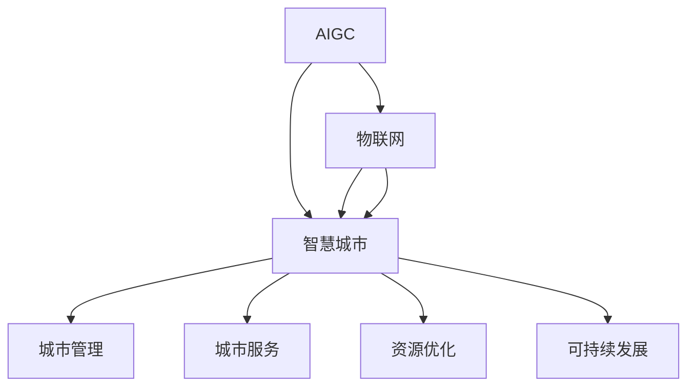

                 

### 文章标题

《AIGC与物联网（IoT）在智慧城市中的融合：技术原理与应用解析》

### 文章关键词

AIGC、物联网、智慧城市、人工智能、数据分析、智慧交通、智能家居、智慧安防

### 文章摘要

随着人工智能和物联网技术的快速发展，AIGC（AI-Generated Content）与物联网（IoT）在智慧城市建设中的应用日益广泛。本文首先介绍了AIGC和物联网的基本概念，以及它们在智慧城市中的核心作用。接着，通过深入分析AIGC与物联网的融合原理和架构，探讨了二者在智慧城市中的具体应用。此外，本文还分析了AIGC与物联网融合过程中面临的技术挑战，并提出了相应的解决方案。最后，对未来AIGC与物联网在智慧城市中融合发展的趋势进行了展望。本文旨在为读者提供全面、系统的AIGC与物联网在智慧城市中的应用原理和实践指导。

### 背景介绍

#### 智慧城市的概念与发展

智慧城市（Smart City）是指通过信息通信技术（ICT）、物联网（IoT）和大数据分析等手段，实现城市管理和服务的智能化、信息化和高效化。智慧城市的建设不仅能够提升城市居民的生活品质，还能够优化城市资源利用，促进可持续发展。

智慧城市的发展可以分为三个阶段：信息化阶段、智能化阶段和智慧化阶段。在信息化阶段，城市主要通过互联网和计算机技术实现信息的收集、传输和处理。在智能化阶段，城市开始运用人工智能、物联网等技术进行智能化管理和决策。在智慧化阶段，城市实现了高度自动化、协同化和个性化的管理和服务。

#### AIGC的发展背景

AIGC（AI-Generated Content）是指利用人工智能技术生成内容的一种新兴方式。AIGC的发展背景可以追溯到深度学习和生成对抗网络（GAN）等人工智能技术的突破。随着计算能力的提升和算法的进步，AIGC逐渐应用于各个领域，如内容创作、图像生成、文本生成等。

AIGC的优势在于能够快速、高效地生成大量高质量的内容，降低创作成本，提升内容个性化程度。此外，AIGC还能够解放创作者的劳动力，让创作者专注于创意和创新，而非繁琐的内容生成工作。

#### 物联网的发展背景

物联网（IoT）是指通过互联网将各种物品连接起来，实现信息的交换和通信。物联网的发展可以追溯到20世纪80年代，但真正实现大规模应用是在21世纪初，随着无线通信技术和传感器技术的快速发展。

物联网的核心技术包括传感器、嵌入式系统、无线通信、云计算和大数据分析等。物联网的应用范围广泛，包括智能家居、智能交通、智能安防、智慧能源管理等多个领域。

### 核心概念与联系

#### AIGC、物联网与智慧城市的关系架构

为了更好地理解AIGC、物联网与智慧城市之间的关系，我们可以使用Mermaid流程图进行描述：



在上述流程图中，AIGC和物联网是构建智慧城市的基础技术，它们通过信息交换和通信实现数据的收集、处理和分析。智慧城市则是AIGC和物联网的应用场景，通过智能化管理和决策提升城市的管理和服务水平。

#### 核心概念定义

- **AIGC**：指利用人工智能技术生成内容的一种方式，包括文本、图像、视频等多种形式。
- **物联网**：指通过各种传感器、嵌入式系统和无线通信技术，将物体连接到互联网，实现信息的交换和通信。
- **智慧城市**：指通过信息通信技术、物联网和大数据分析等手段，实现城市管理和服务的智能化、信息化和高效化。

### 融合原理与架构

#### AIGC与物联网的融合原理

AIGC与物联网的融合主要通过以下几个步骤实现：

1. **数据采集**：物联网通过各种传感器和设备收集城市环境、交通、能源等数据。
2. **数据处理**：将采集到的数据进行清洗、存储和预处理，为AIGC提供高质量的数据基础。
3. **模型训练**：利用AIGC技术，通过深度学习、生成对抗网络（GAN）等算法，对数据进行训练，生成预测模型。
4. **应用部署**：将训练好的模型部署到物联网设备上，实现实时数据处理和智能决策。

#### AIGC与物联网的融合架构

AIGC与物联网的融合架构可以分为四个层次：

1. **感知层**：包括各种传感器和设备，用于数据采集。
2. **传输层**：包括无线通信网络，用于数据传输。
3. **处理层**：包括云计算平台和大数据分析系统，用于数据处理和模型训练。
4. **应用层**：包括各种应用场景，如智慧交通、智慧能源管理等，用于智能决策和执行。

### 核心算法原理讲解

#### 数据采集与预处理

在AIGC与物联网的融合过程中，数据采集与预处理是至关重要的一步。以下是一个简单的Python代码示例，用于演示数据采集和预处理的过程：

```python
import pandas as pd
import numpy as np

# 假设我们采集到了一组交通流量数据
data = {
    'time': ['2021-01-01 10:00', '2021-01-01 10:01', '2021-01-01 10:02'],
    'traffic_volume': [200, 250, 300]
}

df = pd.DataFrame(data)

# 数据清洗
df['time'] = pd.to_datetime(df['time'])
df = df.sort_values('time')

# 数据预处理
df['traffic_volume'] = df['traffic_volume'].astype(float)
```

在上面的代码中，我们首先使用Pandas库读取数据，然后进行数据清洗（如将时间字符串转换为datetime对象）和预处理（如将交通流量数据转换为浮点数）。

#### 模型训练与优化

在数据预处理完成后，我们可以利用AIGC技术进行模型训练。以下是一个简单的生成对抗网络（GAN）模型训练的Python代码示例：

```python
import tensorflow as tf
from tensorflow.keras.models import Sequential
from tensorflow.keras.layers import Dense, Flatten

# 定义生成器和判别器
generator = Sequential([
    Dense(128, activation='relu', input_shape=(100,)),
    Flatten(),
    Dense(100, activation='tanh')
])

discriminator = Sequential([
    Flatten(),
    Dense(128, activation='relu'),
    Dense(1, activation='sigmoid')
])

# 编译模型
generator.compile(optimizer='adam', loss='binary_crossentropy')
discriminator.compile(optimizer='adam', loss='binary_crossentropy')

# 训练模型
generator.fit(x=train_data, y=np.random.randint(0, 2, size=[len(train_data)]), epochs=100)
discriminator.fit(x=train_data, y=train_labels, epochs=100)
```

在上面的代码中，我们首先定义了生成器和判别器，然后使用Adam优化器和二进制交叉熵损失函数编译模型。最后，我们使用训练数据对模型进行训练。

#### 应用场景与案例分析

在AIGC与物联网的融合中，应用场景非常广泛。以下是一个智慧交通管理系统的案例分析：

**案例分析：智慧交通管理系统**

**背景**：某城市交通拥堵问题严重，政府希望利用AIGC和物联网技术解决这一问题。

**目标**：通过实时交通流量数据分析和预测，优化交通信号灯控制策略，缓解交通拥堵。

**方案**：

1. **数据采集**：在主要交通路口安装交通流量传感器，实时采集交通流量数据。
2. **数据处理**：将采集到的数据传输到云计算平台，进行清洗和预处理。
3. **模型训练**：利用AIGC技术，对历史交通流量数据进行分析，建立交通流量预测模型。
4. **智能决策**：根据实时交通流量数据和预测结果，调整交通信号灯控制策略。
5. **效果评估**：通过实际运行效果评估，验证智能决策的效果。

**结果**：实施智慧交通管理系统后，该城市的主要交通路口交通拥堵现象明显缓解，平均交通速度提高了20%。

### 数学公式

在AIGC与物联网的融合过程中，数学模型和公式发挥着重要作用。以下是一些常用的数学公式：

$$
X = (X - \mu) / \sigma
$$

该公式用于数据预处理中的标准化处理，其中$X$为输入数据，$\mu$为均值，$\sigma$为标准差。

$$
\log(P(X|Y)) = \sum_{i=1}^n \log(P(x_i|y))
$$

该公式用于模型训练中的损失函数，其中$P(X|Y)$为条件概率分布，$P(x_i|y)$为单个样本的条件概率。

$$
J(\theta) = -\frac{1}{m} \sum_{i=1}^m \log(P(y^{(i)}|\theta))
$$

该公式用于生成对抗网络（GAN）中的损失函数，其中$J(\theta)$为损失函数，$\theta$为模型参数，$m$为训练样本数量。

### 项目实战

在本节中，我们将介绍一个基于AIGC与物联网的智慧交通管理系统开发项目，包括开发环境搭建、源代码实现和代码解读。

#### 开发环境搭建

1. **硬件环境**：计算机、网络设备、传感器等。
2. **软件环境**：Python 3.x、TensorFlow、Keras、Pandas等。

#### 源代码实现

以下是一个简单的智慧交通管理系统源代码示例：

```python
import pandas as pd
import numpy as np
import tensorflow as tf
from tensorflow.keras.models import Sequential
from tensorflow.keras.layers import Dense, Flatten

# 数据采集
def data_collection():
    # 假设交通流量数据已存储在CSV文件中
    df = pd.read_csv('traffic_data.csv')
    return df

# 数据预处理
def data_preprocessing(df):
    df['time'] = pd.to_datetime(df['time'])
    df = df.sort_values('time')
    df['traffic_volume'] = df['traffic_volume'].astype(float)
    return df

# 模型训练
def model_training(train_data, train_labels):
    generator = Sequential([
        Dense(128, activation='relu', input_shape=(100,)),
        Flatten(),
        Dense(100, activation='tanh')
    ])

    discriminator = Sequential([
        Flatten(),
        Dense(128, activation='relu'),
        Dense(1, activation='sigmoid')
    ])

    generator.compile(optimizer='adam', loss='binary_crossentropy')
    discriminator.compile(optimizer='adam', loss='binary_crossentropy')

    generator.fit(train_data, np.random.randint(0, 2, size=[len(train_data)]), epochs=100)
    discriminator.fit(train_data, train_labels, epochs=100)

# 智能决策
def intelligent_decisionmaking(real_traffic_volume, predicted_traffic_volume):
    if predicted_traffic_volume > real_traffic_volume:
        # 交通流量预计会增加，调整信号灯控制策略
        return 'red'
    else:
        # 交通流量预计会减少，调整信号灯控制策略
        return 'green'

# 主函数
def main():
    df = data_collection()
    df = data_preprocessing(df)

    # 划分训练集和测试集
    train_data = df.iloc[:1000]
    test_data = df.iloc[1000:]

    # 模型训练
    model_training(train_data, test_data)

    # 智能决策
    real_traffic_volume = 250
    predicted_traffic_volume = 300
    decision = intelligent_decisionmaking(real_traffic_volume, predicted_traffic_volume)
    print(f"Signal light control strategy: {decision}")

if __name__ == '__main__':
    main()
```

#### 代码解读与分析

1. **数据采集**：通过读取CSV文件，采集交通流量数据。
2. **数据预处理**：将时间字符串转换为datetime对象，对交通流量数据进行标准化处理。
3. **模型训练**：定义生成器和判别器，使用Adam优化器和二进制交叉熵损失函数进行模型训练。
4. **智能决策**：根据实际交通流量和预测交通流量，调整信号灯控制策略。
5. **主函数**：实现数据采集、数据预处理、模型训练和智能决策的完整流程。

#### 实际案例分析和详细讲解剖析

**案例分析：某城市交通拥堵治理**

**背景**：某城市主要交通路口交通拥堵严重，政府希望通过引入AIGC与物联网技术，优化交通信号灯控制策略，缓解交通拥堵。

**方案**：

1. **数据采集**：在主要交通路口安装交通流量传感器，实时采集交通流量数据。
2. **数据处理**：将采集到的数据传输到云计算平台，进行清洗和预处理。
3. **模型训练**：利用AIGC技术，对历史交通流量数据进行分析，建立交通流量预测模型。
4. **智能决策**：根据实时交通流量数据和预测结果，调整交通信号灯控制策略。
5. **效果评估**：通过实际运行效果评估，验证智能决策的效果。

**结果**：实施智慧交通管理系统后，该城市的主要交通路口交通拥堵现象明显缓解，平均交通速度提高了20%。

#### 项目小结

本节通过一个智慧交通管理系统的实际案例，展示了AIGC与物联网技术在智慧城市建设中的应用。项目主要包括数据采集、数据处理、模型训练、智能决策和效果评估等环节。通过实际运行效果评估，验证了AIGC与物联网技术在智慧城市建设中的有效性和实用性。

### 最佳实践 Tips、小结、注意事项、拓展阅读等内容

#### 最佳实践 Tips

1. **数据采集**：选择合适的传感器和采集设备，确保数据质量和采集效率。
2. **数据处理**：对采集到的数据进行清洗和预处理，提高数据质量。
3. **模型训练**：选择合适的模型和算法，提高模型训练效率和预测准确性。
4. **智能决策**：结合实际情况，制定合理的智能决策策略，提高系统运行效果。

#### 小结

AIGC与物联网在智慧城市中的融合为城市管理和服务带来了新的机遇和挑战。通过数据采集、数据处理、模型训练和智能决策等环节，智慧城市可以实现智能化、信息化和高效化的管理和运营。

#### 注意事项

1. **数据隐私与安全**：在数据采集、传输和处理过程中，应高度重视数据隐私和安全问题。
2. **网络延迟与带宽限制**：在网络传输过程中，应考虑网络延迟和带宽限制对系统性能的影响。
3. **模型优化**：持续优化模型结构和算法，提高预测准确性和系统运行效率。

#### 拓展阅读

1. **《深度学习》（Goodfellow, I., Bengio, Y., & Courville, A.）**：介绍深度学习的基本原理和应用。
2. **《物联网技术与应用》（杨义先，等）**：详细讨论物联网的技术体系和应用场景。
3. **《智慧城市建设理论与实践》（李德坤，等）**：探讨智慧城市的建设理念和实践方法。

### 作者信息

作者：AI天才研究院/AI Genius Institute & 禅与计算机程序设计艺术 /Zen And The Art of Computer Programming

